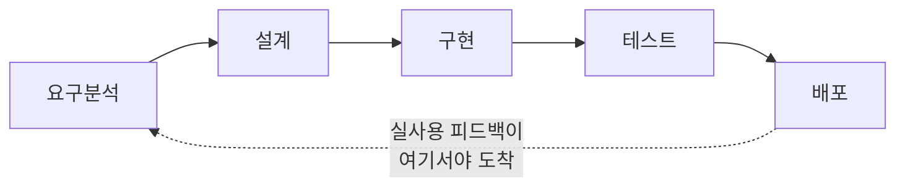
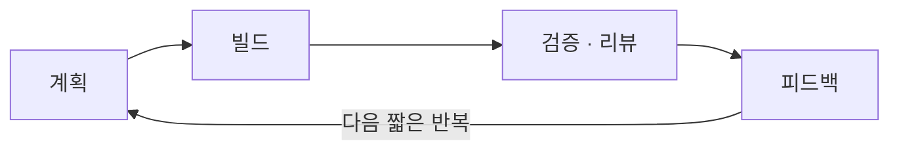

## 서론

데일리 스탠드업이 매니저에게 하는 일일 보고가 되어 있다. 스프린트는 2주짜리 미니 폭포수가 됐고, 회고는 "별일 없었죠?" 한 마디로 끝난다. 분명 "우리 팀 애자일 해요"라고 말하는데, 정작 왜 이렇게 하는지 물으면 답이 안 나온다.

이건 한 팀의 이야기가 아니다. 애자일은 2001년 선언문에서 출발했지만, 20여 년이 지난 지금 "애자일 한다"는 말은 오히려 더 혼란스러운 단어가 됐다. 데일리·스프린트·회고 같은 이벤트는 도입했는데, 그 뒤의 <strong>왜</strong>가 빠져 있기 때문이다.

이 시리즈는 그 <strong>왜</strong>를 채운다. 용어와 이벤트를 암기하는 교과서가 아니라, "왜 이렇게 하는가 + 실무에서 왜 망가지는가"를 관통선으로 둔다. 1편은 그 출발점인 뿌리를 다룬다 — 폭포수가 무너진 이유, 2001년 선언문, 4가지 가치와 12원칙, 그리고 가장 흔한 오해 5가지.

대상 독자는 애자일을 도입은 했는데 왜 하는지 모르겠는 실무자, 가짜 애자일에 지친 사람, 프로세스 뒤의 철학을 한번 정리하고 싶은 사람이다. 사전 지식은 필요 없다.

- <strong>1편 — 애자일은 왜 등장했나 — 선언문 · 4가치 · 12원칙 (이 글)</strong>
- [2편 — Scrum — 경험적 프로세스 제어와 3-5-3](/blog/agile-guide-2)
- [3편 — Kanban · Lean · 흐름(Flow)](/blog/agile-guide-3)
- [4편 — 실천과 측정 — XP부터 벨로시티 · DORA까지](/blog/agile-guide-4)
- [5편 — 스케일링과 가짜 애자일](/blog/agile-guide-5)

---

## TL;DR

- <strong>애자일은 방법론이 아니라 가치 체계다</strong> — Scrum·Kanban·XP는 그 가치를 구현하는 여러 방법일 뿐이다. 선언문은 "이렇게 하라"는 절차가 아니라 "무엇을 더 중요하게 여기라"는 가치 선언이다.
- <strong>폭포수의 한계에 대한 반작용으로 등장했다</strong> — 피드백이 맨 끝에서야 도착하고(후행 피드백), 변경 비용이 뒤로 갈수록 폭증하는 구조가 문제였다. 애자일은 이를 짧은 반복 루프로 푼다.
- <strong>4가지 가치 = 좌변을 우변보다 더</strong> — "공정/도구보다 개인", "문서보다 작동하는 SW", "계약보다 협력", "계획보다 변화 대응". 우변도 가치 있지만 좌변을 더 높이 산다는 선언이다.
- <strong>12원칙은 4가치의 실천 번역</strong> — 일찍·자주 전달, 변경 환영, 지속가능한 속도, 자기조직 팀, 정기 회고. 뒤 편(Scrum·XP·측정)의 모든 것이 이 12줄에서 파생된다.
- <strong>흔한 오해 5가지는 전부 틀렸다</strong> — "문서 안 씀 / 계획 없음 / 무조건 빠름 / 프로세스 없음 / 스타트업 전용"은 선언문을 절반만 읽은 결과다.

---

## 1. 폭포수는 왜 무너졌나

애자일을 이해하려면 그것이 무엇에 대한 반작용이었는지부터 봐야 한다. 그 대상이 <strong>폭포수(Waterfall)</strong>다. 폭포수는 요구분석 → 설계 → 구현 → 테스트 → 배포를 한 방향으로 순차 진행하고, 각 단계가 완전히 끝나야 다음으로 넘어가는 개발 모델이다.

### 1.1 폭포수의 구조

각 단계는 문서로 인수인계되고, 한번 지나간 단계로는 돌아가지 않는 것을 전제로 한다. 물이 위에서 아래로만 떨어지는 폭포처럼 보여서 붙은 이름이다.

문제는 이 구조가 두 가지 위험한 가정 위에 서 있다는 점이다.

- <strong>요구사항을 처음에 다 알 수 있다는 가정</strong> — 프로젝트 시작 시점에 고객과 개발자가 무엇을 만들지 완전히 합의할 수 있다고 본다. 현실의 소프트웨어는 만들어 보고 써 봐야 진짜 요구가 드러난다.
- <strong>각 단계가 한 번에 옳게 끝난다는 가정</strong> — 설계가 끝나면 다시 안 본다. 그런데 구현하다 보면 설계의 구멍이 드러나고, 테스트하다 보면 요구의 오해가 드러난다.

### 1.2 후행 피드백과 변경 비용 곡선

폭포수의 진짜 약점은 <strong>피드백이 맨 끝에서야 도착</strong>한다는 데 있다. 실제 사용자가 동작하는 제품을 만져 보는 시점이 테스트·배포 단계, 즉 프로젝트의 거의 끝이다. 그제야 "이게 우리가 원한 게 아니었다"가 드러난다.

더 큰 문제는 변경 비용이 단계가 진행될수록 가파르게 오른다는 점이다. 요구분석 단계에서 한 줄 고치는 것과, 배포 후 운영 중에 같은 것을 고치는 것은 비용이 완전히 다르다. 배리 베엠(Barry Boehm)이 정리한 <strong>변경 비용 곡선</strong>은 이 차이를 고전적으로 보여 준다(아래는 대략적인 상대 비용).

| 변경이 발견된 단계 | 상대적 수정 비용 |
|---|---|
| 요구분석 | 1배 |
| 설계 | 약 5배 |
| 구현 | 약 10배 |
| 테스트 | 약 20배 |
| 운영(배포 후) | 약 100배 |

피드백이 늦게 오는데(후행 피드백) 늦게 온 변경일수록 비싸다. 이 둘이 겹치면, 폭포수에서 발견된 문제는 거의 항상 "가장 비싼 시점에 발견된 문제"가 된다. 애자일의 핵심 발상은 단순하다 — <strong>피드백 루프를 짧게 만들어 변경을 싼 시점으로 끌어오자.</strong>

여기서 두 단어를 구분하면 좋다. <strong>반복적(iterative)</strong>은 같은 것을 여러 번 다듬어 개선하는 것이고, <strong>점진적(incremental)</strong>은 기능을 조각으로 나눠 하나씩 더해 가는 것이다. 애자일은 보통 둘을 함께 쓴다 — 작은 조각을 더하면서(점진적), 매번 피드백으로 다듬는다(반복적).

### 1.3 참고: 폭포수는 사실 "이렇게 하지 말라"는 예시였다

흔히 폭포수의 출처로 1970년 윈스턴 로이스(Winston Royce)의 논문이 인용된다. 그런데 정작 로이스는 그 순수 순차 모델을 그려 놓고 "이대로 하면 위험하다"고 경고했다. 그는 단계 사이를 오가는 반복과 프로토타입을 권했다. "폭포수"라는 이름과 "순차적으로만 하라"는 해석은 후대가 논문을 절반만 읽고 붙인 것이다.

<strong>더 자세히 — 그런데도 폭포수가 표준이 된 이유</strong>

순차 모델은 <strong>관리하기 쉽고 계약하기 쉽다.</strong> 각 단계가 산출 문서로 끝나니 진척을 보고하기 좋고, "설계까지 얼마, 구현까지 얼마"로 외주 계약을 쪼개기도 좋다. 1980~90년대 대형 SI·국방·관공서 프로젝트에서 폭포수가 사실상 표준이 된 건 기술적 우수성 때문이 아니라 이 <strong>계약·관리 편의성</strong> 때문이었다. 애자일이 "계약 협상보다 고객과의 협력"(3절 3번째 가치)을 들고 나온 맥락이 바로 여기다.

---

## 2. 2001년, 선언문

### 2.1 Snowbird에 모인 17명

2001년 2월, 미국 유타주 스노버드의 한 스키 리조트에 17명의 개발자가 모였다. 이들은 당시 각자 <strong>경량(lightweight) 방법론</strong>을 주창하던 사람들이었다. 경량 방법론은 무거운 문서·절차 대신 짧은 주기와 빠른 피드백을 강조하던 흐름으로, XP(익스트림 프로그래밍)·Scrum·Crystal·DSDM·FDD 등이 여기 속했다.

이들은 서로 다른 방법을 쓰고 있었지만, 공통의 신념이 있다는 걸 발견했다. 그 공통분모를 한 장으로 정리한 것이 <strong>애자일 소프트웨어 개발 선언문(Manifesto for Agile Software Development)</strong>이다. "경량"이라는 약해 보이는 이름 대신 "기민한"을 뜻하는 "Agile"을 골랐다.

> <strong>핵심</strong>: 선언문은 특정 방법(Scrum이든 XP든)을 규정하지 않는다. 여러 방법 위에 공통으로 흐르는 <strong>가치</strong>를 선언했을 뿐이다. 그래서 "애자일 = Scrum"은 틀린 등식이다. Scrum은 애자일을 구현하는 한 방법이다.

### 2.2 선언문 본문

선언문 본체는 놀랄 만큼 짧다. 네 줄이 전부다.

| 우리는 이것보다 | 이것을 더 |
|---|---|
| 공정과 도구 | <strong>개인과 상호작용</strong> |
| 포괄적인 문서 | <strong>작동하는 소프트웨어</strong> |
| 계약 협상 | <strong>고객과의 협력</strong> |
| 계획을 따르기 | <strong>변화에 대응하기</strong> |

그리고 결정적인 한 문장이 뒤에 붙는다.

> 즉, 왼쪽 항목도 가치가 있지만, 우리는 오른쪽 항목을 더 높이 평가한다.

이 마지막 문장이 선언문 전체에서 가장 자주 무시되는 부분이다. <strong>우변을 버리라는 게 아니다.</strong> 문서·계획·도구·계약은 모두 가치 있다. 다만 둘이 충돌할 때 무엇을 우선할지를 정해 둔 것이다. 다음 절에서 네 가치를 한 줄씩 뜯어본다.

---

## 3. 4가지 가치를 한 줄씩

| 가치 | 무슨 뜻인가 | 우변을 버린다는 게 아니라 |
|---|---|---|
| 개인과 상호작용 > 공정과 도구 | 좋은 도구·프로세스를 깔아도, 결국 일을 해내는 건 사람과 사람 사이의 대화다 | 도구를 쓰지 말라는 게 아니라, 도구가 대화를 대체하게 두지 말라 |
| 작동하는 소프트웨어 > 포괄적인 문서 | 진척의 증거는 500쪽 설계서가 아니라 실제로 도는 기능이다 | 문서를 없애라는 게 아니라, 문서를 위한 문서를 쓰지 말라 |
| 고객과의 협력 > 계약 협상 | 범위를 못 박은 계약서보다, 만들면서 같이 방향을 맞추는 협력이 더 좋은 결과를 낸다 | 계약을 없애라는 게 아니라, 계약 뒤에 숨어 고객과 등지지 말라 |
| 변화에 대응하기 > 계획을 따르기 | 시장·요구는 바뀐다. 낡은 계획을 고수하는 것보다 변화에 맞춰 계획을 고치는 게 낫다 | 계획을 세우지 말라는 게 아니라, 계획을 목적이 아니라 도구로 쓰라 |

네 가치를 관통하는 한 가지 정서가 있다. <strong>불확실성을 인정한다</strong>는 것이다. 무엇을 만들지 처음부터 다 알 수 없고, 사람은 실수하고, 세상은 바뀐다 — 그러니 한 번에 옳게 끝내려 하지 말고, 자주 확인하고 자주 고치자는 태도다. 이 태도가 2편 Scrum의 "경험적 프로세스 제어"로 이어진다.

---

## 4. 12원칙 — 4가치의 실천 번역

선언문에는 네 가치 뒤에 12개의 원칙이 따라붙는다. 가치가 "무엇을 중요하게 여기는가"라면, 12원칙은 "그럼 실제로 어떻게 행동하는가"에 가깝다. 12줄을 그대로 나열하면 머리에 안 남으니, 주제별로 묶어 본다.

| 주제 | 해당 원칙(번호) | 한 줄 요약 |
|---|---|---|
| 가치를 일찍·자주 전달 | 1 · 3 · 7 | 작동하는 SW를 일찍, 짧은 주기로 전달한다. 진척의 척도는 작동하는 SW다 |
| 변화를 환영 | 2 | 늦은 단계의 요구 변경도 환영한다. 변화는 고객의 경쟁우위다 |
| 사람과 협업 중심 | 4 · 5 · 6 · 11 | 매일 함께 일하고, 동기부여된 사람을 믿고, 대면으로 소통하고, 자기조직 팀에서 최선의 설계가 나온다 |
| 지속가능성과 기술 | 8 · 9 · 10 | 일정한 속도를 무한정 유지하고, 기술 우수성에 꾸준히 신경 쓰고, 해야 할 일을 최소화(단순성)한다 |
| 학습과 개선 | 12 | 정기적으로 돌아보고(회고) 행동을 조정한다 |

이 표는 시리즈 전체의 지도이기도 하다. 몇 가지를 짚으면:

- <strong>"진척의 척도는 작동하는 SW"(7원칙)</strong> — 진척을 줄 수나 시간으로 재지 말라는 뜻이다. 이 한 줄이 4편의 "벨로시티는 가치가 아니다" 논의로 이어진다.
- <strong>"기술 우수성"(9원칙)</strong> — 애자일은 깔끔한 코드·좋은 설계를 명시적으로 요구한다. 이것이 4편 XP의 엔지니어링 프랙티스(TDD·리팩토링)의 근거다.
- <strong>"정기적으로 돌아본다"(12원칙)</strong> — 애자일의 엔진이다. 뒤에서 보겠지만, 이 검사-적응 루프가 빠지면 그게 바로 가짜 애자일이다(5편).

> <strong>참고</strong>: 8원칙의 "일정한 속도(sustainable pace)"는 "지속가능한 속도"로 옮긴다. 단기 스퍼트로 사람을 갈아 넣는 게 아니라, 몇 달·몇 년을 같은 페이스로 유지할 수 있어야 한다는 뜻이다. "애자일 = 무조건 빨리"라는 오해를 정면으로 반박하는 원칙이다.

> <strong>참고 — 단순성(10원칙)</strong>: "해야 할 일을 최소화하라"는 "적게 일하라"가 아니라 "안 해도 되는 일을 안 하라"는 뜻이다. 안 만든 기능·안 짠 코드가 최대가 되게 하라는 것으로, 코드 한 줄은 유지보수·버그·복잡도라는 부채를 동반하기 때문이다. "혹시 나중에 쓸지도" 하는 일을 미리 만들지 않는 <strong>YAGNI(You Aren't Gonna Need It — 필요해질 때 만들어라)</strong> 정신이며, 4편 XP의 단순 설계로 이어진다. 게으름(필요한 일을 대충 함)과는 다르다 — 불필요한 일의 양을 줄이는 것이지 질을 깎는 게 아니다. (원문은 "maximizing the amount of work not done"이라 직역이 어색해 의미대로 옮겼다.)

---

## 5. 흔한 오해 5가지

애자일에 대한 거의 모든 오해는 선언문을 절반만 읽어서 생긴다. 좌변만 보고 우변을 버렸다고 생각하는 것이다.

| 오해 | 실제 |
|---|---|
| 애자일 = 문서 안 씀 | "포괄적인 문서보다 작동하는 SW"지, 문서 폐지가 아니다. 필요한 문서는 쓰되, 문서가 목적이 되지 않게 한다 |
| 애자일 = 계획 없음 | "계획을 따르기보다 변화 대응"이지, 무계획이 아니다. 오히려 매 반복마다 더 자주 계획한다 |
| 애자일 = 무조건 빨리 | 8원칙은 "지속가능한 속도"다. 빠름이 목표가 아니라, 변화에 적응하며 지치지 않는 페이스가 목표다 |
| 애자일 = 프로세스/규율 없음 | XP·Scrum은 오히려 엄격한 규율(TDD·DoD·타임박스)을 요구한다. "사람을 프로세스보다 우선"할 뿐, 프로세스를 없애는 게 아니다 |
| 애자일 = 스타트업 전용 | 대규모 조직용 스케일링 프레임워크(SAFe·LeSS)가 따로 있다. 다만 스케일은 정말 어렵고, 여기서 가짜 애자일이 자주 태어난다(5편) |

특히 마지막 두 오해가 위험하다. "규율이 없다"는 오해는 엔지니어링 프랙티스를 생략하게 만들고, 그렇게 프랙티스 없이 이벤트만 흉내 내는 상태를 <strong>카고 컬트(cargo cult) 애자일</strong>이라 부른다. 형식만 따라 하면 결과가 따라올 거라 믿는 흉내 내기다. 이 가짜 애자일의 해부와 회복은 시리즈의 종착점인 5편에서 본격적으로 다룬다.

> <strong>참고 — 카고 컬트(cargo cult)</strong>: 2차 대전 때 남태평양 섬 주민들이 군용기가 내려놓던 화물(cargo)을 다시 부르려고, 군인들의 행동(활주로에 불 켜기·나무로 만든 가짜 관제탑·짚으로 만든 헤드폰)을 그대로 흉내 낸 데서 나온 말이다. 화물을 만든 진짜 원인(공장·보급망)은 빼고 겉모습만 따라 했기에 화물은 오지 않았다. 의식만 흉내 내면 결과가 따라올 거라 믿는 행태를 가리키며, 물리학자 리처드 파인만이 "형식만 과학인 연구"를 비판하며 널리 퍼뜨렸다.

---

## 정리

1편의 핵심을 한 줄씩 정리하면 다음과 같다.

- <strong>애자일은 방법론이 아니라 가치 체계다</strong> — 선언문은 절차가 아니라 "무엇을 더 중요하게 여기라"는 선언이다. Scrum·Kanban·XP는 그 가치를 구현하는 서로 다른 방법이다.
- <strong>애자일은 폭포수의 두 약점에 대한 답이다</strong> — 후행 피드백과 가파른 변경 비용 곡선. 답은 "피드백 루프를 짧게 만들어 변경을 싼 시점으로 끌어오기"다.
- <strong>4가지 가치는 좌변을 우변보다 더 높이 산다</strong> — 우변(문서·계획·도구·계약)을 버리는 게 아니라, 충돌할 때의 우선순위를 정한 것이다.
- <strong>12원칙은 4가치의 실천 번역이고, 시리즈 전체의 지도다</strong> — 일찍·자주 전달, 변화 환영, 지속가능한 속도, 자기조직 팀, 정기 회고. 뒤 편의 모든 주제가 여기서 파생된다.
- <strong>흔한 오해 5가지는 전부 선언문을 절반만 읽은 결과다</strong> — 특히 "규율이 없다"는 오해가 엔지니어링 프랙티스를 생략하게 만들어 가짜 애자일을 낳는다.

다음 편은 <strong>Scrum</strong>이다. 애자일 가치를 가장 널리 구현한 프레임워크가 어떻게 "불확실성을 인정한다"는 1편의 태도를 <strong>경험적 프로세스 제어</strong>(투명성·검사·적응)로 바꾸는지, 그리고 3역할·5이벤트·3산출물이라는 3-5-3 구조가 각각 무슨 문제를 푸는지 본다. 데일리가 왜 상태 보고가 아니어야 하는지도 그때 짚는다.

---

## 부록

### A. 애자일 선언문 12원칙 전문

<strong>펼치기 — 12원칙 원문 번역</strong>

1. 우리의 최우선 순위는 가치 있는 소프트웨어를 일찍 그리고 지속적으로 전달해 고객을 만족시키는 것이다.
2. 비록 개발 후반부일지라도 요구사항 변경을 환영한다. 애자일 프로세스는 변화를 고객의 경쟁우위로 활용한다.
3. 작동하는 소프트웨어를 자주(수 주에서 수 개월, 짧은 쪽을 선호) 전달한다.
4. 비즈니스 담당자와 개발자는 프로젝트 전반에 걸쳐 매일 함께 일해야 한다.
5. 동기가 부여된 개인들을 중심으로 프로젝트를 구성하라. 그들이 필요로 하는 환경과 지원을 제공하고, 일을 끝내리라 믿어라.
6. 개발팀에 그리고 팀 내부에서 정보를 전달하는 가장 효율적·효과적인 방법은 대면 대화다.
7. 작동하는 소프트웨어가 진척의 주요 척도다.
8. 애자일 프로세스는 지속 가능한 개발을 촉진한다. 스폰서·개발자·사용자는 일정한 속도를 무한히 유지할 수 있어야 한다.
9. 기술적 우수성과 좋은 설계에 대한 지속적인 관심이 기민함을 높인다.
10. 단순성 — 해야 할 일의 양을 최소화하는 기술(원문 "maximizing the amount of work not done") — 이 본질적이다.
11. 최선의 아키텍처·요구사항·설계는 자기조직 팀에서 창발한다.
12. 팀은 정기적으로 어떻게 더 효과적일지 돌아보고, 그에 맞춰 행동을 조율·조정한다.

### B. 용어 정리

| 용어 | 한 줄 정의 |
|---|---|
| 폭포수(Waterfall) | 요구분석→설계→구현→테스트→배포를 한 방향으로 순차 진행하고, 단계 완료 후 다음으로 넘어가는 개발 모델 |
| 애자일 선언문(Agile Manifesto) | 2001년 17명이 정리한, 애자일의 4가지 가치와 12원칙을 담은 한 장짜리 선언 |
| 경량(lightweight) 방법론 | 무거운 문서·절차 대신 짧은 주기·빠른 피드백을 강조하던 1990년대 흐름(XP·Scrum·Crystal 등) |
| 반복적(iterative) | 같은 것을 여러 번 다듬어 개선하는 방식 |
| 점진적(incremental) | 기능을 조각으로 나눠 하나씩 더해 가는 방식 |
| 변경 비용 곡선 | 결함·변경을 늦게 발견할수록 수정 비용이 가파르게 오른다는 배리 베엠의 고전적 관찰 |
| 지속가능한 속도(sustainable pace) | 단기 스퍼트가 아니라 몇 달·몇 년을 같은 페이스로 유지할 수 있는 작업 속도(8원칙) |
| 자기조직 팀(self-organizing team) | 외부 지시가 아니라 팀 스스로 일을 나누고 방법을 정하는 팀(11원칙) |
| 카고 컬트(cargo cult) 애자일 | 의미는 빼고 이벤트·형식만 흉내 내면 결과가 따라올 거라 믿는 가짜 애자일(5편) |
| TDD | 테스트 주도 개발(Test-Driven Development) — 실패하는 테스트를 먼저 쓰고 통과시키는 개발 방식(4편) |
| DoD | 완료 기준(Definition of Done) — 무엇을 갖춰야 "끝났다"고 할지 정한 공통 기준(2편) |
| 타임박스(timebox) | 정해진 시간만큼만 쓰고 끝내는 규칙 — 스프린트·회의에 적용(2편) |
| 벨로시티(velocity) | 팀이 한 반복에서 처리하는 작업량 지표 — 계획 도구이지 생산성 KPI가 아니다(4편) |
| SAFe(Scaled Agile Framework) · LeSS(Large-Scale Scrum) | 여러 팀으로 애자일을 확장하기 위한 대규모 스케일링 프레임워크(5편) |
| DORA(DevOps Research and Assessment) | 배포 빈도·변경 리드타임·평균 복구 시간·변경 실패율 4가지로 전달 성과를 재는 지표(4편) |

### C. 외부 참조

- [Manifesto for Agile Software Development](https://agilemanifesto.org/) — 선언문 원문(여러 언어 번역 포함)
- [Principles behind the Agile Manifesto](https://agilemanifesto.org/principles.html) — 12원칙 원문
- [Winston Royce, "Managing the Development of Large Software Systems" (1970)](https://www.praxisframework.org/files/royce1970.pdf) — 흔히 폭포수의 출처로 인용되는 논문(정작 순수 순차를 경고함)
