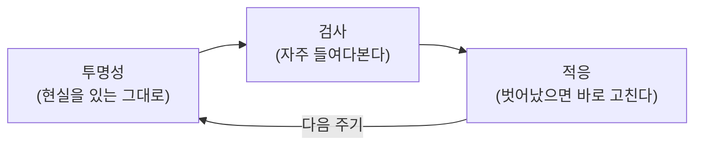
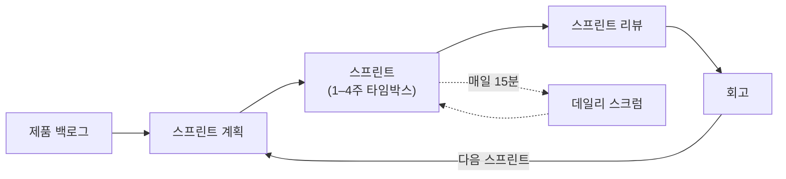

## 서론

[이전 글](/blog/agile-guide-1)에서 애자일의 네 가치를 관통하는 정서가 <strong>"불확실성을 인정한다"</strong>는 것이라고 했다. 무엇을 만들지 처음부터 다 알 수 없으니, 한 번에 끝내려 하지 말고 자주 확인하고 자주 고치자는 태도다.

Scrum은 그 태도를 가장 널리 쓰이는 구체적 뼈대로 만든 프레임워크다. 그런데 현장에서 Scrum은 종종 <strong>"회의만 많은 프로세스"</strong>로 오해받는다. 데일리·계획·리뷰·회고를 왜 하는지는 빠지고, "원래 그렇게 하는 거니까" 이벤트만 돌아간다.

2편은 그 <strong>왜</strong>를 먼저 잡는다. 핵심은 하나다 — Scrum의 모든 역할·이벤트·산출물은 <strong>경험적 프로세스 제어</strong>라는 한 가지 발상에서 파생된다. 이걸 잡으면 3-5-3(3역할·5이벤트·3산출물)이 외울 목록이 아니라 "검사하고 적응하기 위한 장치"로 읽힌다.

대상 독자는 Scrum을 돌리고는 있는데 각 이벤트가 왜 있는지 설명하기 어려운 사람, 데일리가 보고 시간이 되어 버린 팀이다. 1편을 안 봐도 되지만, 보면 더 자연스럽다.

- [1편 — 애자일은 왜 등장했나 — 선언문 · 4가치 · 12원칙](/blog/agile-guide-1)
- <strong>2편 — Scrum — 경험적 프로세스 제어와 3-5-3 (이 글)</strong>
- [3편 — Kanban · Lean · 흐름(Flow)](/blog/agile-guide-3)
- [4편 — 실천과 측정 — XP부터 벨로시티 · DORA까지](/blog/agile-guide-4)
- [5편 — 스케일링과 가짜 애자일](/blog/agile-guide-5)
- [6편 — 실전: 유저스토리에서 릴리스까지](/blog/agile-guide-6)
- [7편 — 디스커버리: 유저스토리는 어디서 오는가](/blog/agile-guide-7)

---

## TL;DR

- <strong>Scrum의 뿌리는 경험적 프로세스 제어다</strong> — 불확실성이 높아 미리 다 정의할 수 없을 때, 자주 들여다보고(검사) 그때그때 고치는(적응) 방식. 모든 이벤트·역할·산출물이 여기서 나온다.
- <strong>3기둥 = 투명성 · 검사 · 적응</strong> — 현실을 있는 그대로 보이게 하고(투명성), 자주 점검하고(검사), 벗어났으면 바로 고친다(적응). 셋 중 하나만 빠져도 Scrum은 헛돈다.
- <strong>3-5-3 = 3역할 · 5이벤트 · 3산출물</strong> — 역할은 "누가 책임지나", 이벤트는 "검사·적응이 일어나는 정해진 자리", 산출물은 "투명하게 들여다볼 대상"이다.
- <strong>각 산출물엔 약속이 붙는다</strong> — 제품 백로그→제품 목표, 스프린트 백로그→스프린트 목표, 증분→Definition of Done(완료 기준). 약속이 없으면 산출물은 그냥 목록일 뿐이다.
- <strong>데일리=상태 보고, 스프린트=미니 폭포수는 변질 신호다</strong> — 형식은 Scrum인데 검사·적응이 빠진 상태. 이게 5편 가짜 애자일의 핵심 증상이다.

---

## 1. 경험적 프로세스 제어 — Scrum이 이 모양인 이유

### 1.1 정의된 프로세스 vs 경험적 프로세스

제조업에서는 입력과 공정이 명확하면 결과를 예측할 수 있다. 같은 재료를 같은 공정에 넣으면 같은 제품이 나온다. 이걸 <strong>정의된 프로세스 제어(defined process control)</strong>라 한다. 계획을 정밀하게 세우고 그대로 실행하는 게 최선인 세계다.

소프트웨어는 다르다. 요구는 만들어 봐야 드러나고, 기술은 해 봐야 알고, 사람은 매번 다르게 움직인다. 입력이 불확실하니 결과도 예측이 안 된다. 이런 세계에서는 정밀한 계획이 오히려 독이 된다 — 1편에서 본 폭포수의 실패가 정확히 이것이다.

| 구분 | 정의된 프로세스 제어 | 경험적 프로세스 제어 |
|---|---|---|
| 전제 | 입력·공정이 명확 → 결과 예측 가능 | 불확실 → 결과 예측 불가 |
| 방식 | 미리 정밀하게 계획하고 그대로 실행 | 자주 들여다보고 그때그때 조정 |
| 적합 | 반복·표준화된 제조 | 소프트웨어처럼 불확실성 높은 일 |
| 1편 대응 | 폭포수 | 애자일(짧은 반복 루프) |

<strong>경험적 프로세스 제어(empirical process control)</strong>는 "예측 대신 경험으로 제어한다"는 뜻이다. 실제로 만들어 본 결과를 보고(경험), 그에 맞춰 다음을 정한다. Scrum은 이 경험적 제어를 팀 단위로 돌리기 위한 장치 모음이다.

### 1.2 세 기둥 — 투명성 · 검사 · 적응

경험적 제어가 작동하려면 세 가지가 받쳐 줘야 한다. Scrum은 이를 <strong>세 기둥(three pillars)</strong>이라 부른다.

- <strong>투명성(transparency)</strong> — 일의 진짜 상태가 모두에게 있는 그대로 보여야 한다. 진척을 부풀리거나 문제를 숨기면 다음 두 기둥이 무너진다.
- <strong>검사(inspection)</strong> — 산출물과 진척을 자주 들여다본다. 단, 일하는 흐름을 방해하지 않을 만큼만.
- <strong>적응(adaptation)</strong> — 검사 결과 벗어났으면 <strong>지금 바로</strong> 고친다. 다음 분기, 다음 릴리스가 아니라 곧장.

이 셋은 따로 놀지 않는다. <strong>투명성이 없으면 검사가 헛것을 보고, 검사가 없으면 적응할 근거가 없고, 적응이 없으면 검사는 그냥 보고가 된다.</strong> 뒤에서 볼 모든 이벤트는 이 셋 중 하나 이상을 일으키기 위해 존재한다. Scrum이 헛도는 거의 모든 경우는 이 셋 중 무엇이 빠졌는지로 진단된다(6절).

Scrum Guide는 세 기둥을 떠받치는 <strong>다섯 가치</strong>를 든다. 기둥이 "무엇을 하느냐"라면, 다섯 가치는 그걸 가능하게 하는 "팀의 태도"다.

| 가치 | 뜻 | 세 기둥과의 연결 |
|---|---|---|
| 확약(commitment) | 목표와 서로에게 최선을 다하기로 약속한다 | 확약이 있어야 검사·적응이 의미를 가진다 |
| 집중(focus) | 스프린트 목표와 지금 할 일에 집중한다 | 검사할 대상이 흐려지지 않게 한다 |
| 개방(openness) | 일과 문제를 있는 그대로 솔직히 드러낸다 | 투명성의 직접적 전제 |
| 존중(respect) | 서로를 유능하고 독립적인 동료로 존중한다 | 자기관리 팀이 작동하는 토대 |
| 용기(courage) | 어려운 문제를 직면하고 옳은 일을 한다 | 문제를 드러내고(개방) 바꾸는(적응) 데 필요 |

특히 <strong>개방과 용기</strong>가 투명성의 전제다 — 문제를 솔직히 드러낼 용기가 없으면 투명성은 구호로 끝나고, 그러면 검사도 헛것을 보고 적응도 못 한다.

---

## 2. 3-5-3 한눈에

Scrum의 구성요소는 3-5-3으로 외운다 — <strong>3역할 · 5이벤트 · 3산출물</strong>. 다만 외우기 전에 각 묶음이 세 기둥 중 무엇을 담당하는지로 보면 구조가 잡힌다.

| 묶음 | 항목 | 세 기둥에서의 역할 |
|---|---|---|
| 3 역할(책무) | PO · 스크럼 마스터 · 개발자 | 무엇을·어떻게 잘 돌게·어떻게 만드나를 나눠 책임 |
| 5 이벤트 | 스프린트 · 계획 · 데일리 · 리뷰 · 회고 | 검사·적응이 일어나는 정해진 자리 |
| 3 산출물(+약속) | 제품 백로그 · 스프린트 백로그 · 증분 | 투명하게 들여다볼 대상 |

한 스프린트가 도는 모습을 그리면 다음과 같다.

스프린트라는 큰 상자 안에서 계획으로 시작해, 매일 데일리로 점검하고, 끝에서 리뷰(만든 것 검사)와 회고(일하는 방식 검사)를 한 뒤 다음 스프린트로 넘어간다. 이 루프가 1편에서 본 "짧은 반복 피드백 루프"의 Scrum 버전이다.

---

## 3. 3 역할 — 누가 무엇을 책임지나

Scrum Guide 2020은 이를 역할이 아니라 <strong>책무(accountability)</strong>라 부른다. 직책이 아니라 "이 결과는 이 사람이 책임진다"는 뜻이다. 하나의 <strong>스크럼 팀(Scrum Team)</strong> 안에 셋이 있고, 팀 위에 하위 팀은 없다.

- <strong>제품 책임자(Product Owner, PO)</strong> — <strong>무엇을</strong> 만들지에 책임진다. 제품 백로그를 관리하고 우선순위를 정해 제품의 가치를 극대화한다. PO는 한 사람이며, 위원회가 아니다.
- <strong>스크럼 마스터(Scrum Master, SM)</strong> — Scrum이 <strong>잘 돌아가게</strong> 하는 데 책임진다. 일정 관리자가 아니라, 팀이 경험적 제어를 제대로 하도록 돕고 방해 요소를 제거하는 코치다.
- <strong>개발자(Developers)</strong> — <strong>어떻게</strong> 만들지에 책임진다. 스프린트마다 쓸 만한 증분을 만든다. 개발자는 "코더"가 아니라 증분을 만드는 데 필요한 모든 작업(설계·개발·테스트 등)을 하는 사람들이다.

세 책무를 관통하는 원칙이 <strong>자기관리(self-managing)</strong>다. 누가 무엇을, 언제, 어떻게 할지를 외부 지시가 아니라 팀 스스로 정한다. 이는 1편 11원칙(자기조직 팀에서 최선의 설계가 나온다)의 직접적 구현이다.

> <strong>주의</strong>: 스크럼 마스터를 "스프린트 일정을 관리하고 진척을 윗선에 보고하는 사람"으로 두는 순간, 그건 PM이지 스크럼 마스터가 아니다. 이 변질은 데일리를 보고 시간으로 만드는 첫 단추다(6절).

---

## 4. 5 이벤트 — 검사·적응이 일어나는 자리

다섯 이벤트의 공통점은 전부 <strong>타임박스(timebox)</strong>라는 것이다. 타임박스는 정해진 시간만큼만 쓰고 끝내는 규칙이다(1편 부록). 시간을 못 박아 두면 "결론 없이 늘어지는 회의"를 구조적으로 막는다.

| 이벤트 | 타임박스(1개월 스프린트 기준) | 무엇을 검사·적응하나 |
|---|---|---|
| 스프린트(Sprint) | ≤ 1개월 | 나머지 모든 이벤트를 담는 컨테이너 |
| 스프린트 계획 | ≤ 8시간 | 이번 스프린트에 무엇을·왜·어떻게 할지 |
| 데일리 스크럼 | 15분 | 스프린트 목표를 향한 진척, 오늘의 계획 |
| 스프린트 리뷰 | ≤ 4시간 | 만든 증분을 이해관계자와 함께, 제품 백로그 |
| 회고(Retrospective) | ≤ 3시간 | 지난 스프린트의 일하는 방식 자체 |

각 이벤트의 본질을 한 줄씩 짚으면:

- <strong>스프린트</strong> — 1개월 이하의 고정 길이 주기. 목표가 흐려지면 PO가 취소할 수 있지만, 길이는 도중에 늘리지 않는다. 길이를 고정해야 리듬과 예측 가능성이 생긴다.
- <strong>스프린트 계획</strong> — 세 가지를 정한다. <strong>왜</strong>(스프린트 목표) · <strong>무엇을</strong>(이번에 다룰 백로그 항목) · <strong>어떻게</strong>(작업 계획). 2020 이전엔 '왜'가 약했는데, 스프린트 목표가 명시되며 강화됐다.
- <strong>데일리 스크럼</strong> — 개발자들이 스프린트 목표 대비 진척을 검사하고 오늘 계획을 적응하는 15분. <strong>매니저에게 하는 보고가 아니다.</strong> 형식(어제/오늘/장애물 3질문)은 2020에서 사라졌다 — 목적만 달성하면 형식은 자유다.
- <strong>스프린트 리뷰</strong> — 만든 증분을 이해관계자와 함께 살펴보고 제품 백로그를 조정하는 <strong>작업 세션</strong>이다. 승인받는 발표회나 데모쇼가 아니다.
- <strong>회고</strong> — 일하는 방식(사람·관계·프로세스·도구·DoD)을 돌아보고 개선책을 정한다. 1편 12원칙(정기적으로 돌아보고 조정한다)의 자리이자, 애자일의 학습 엔진이다.

> <strong>참고 — 데일리의 "3질문"이란</strong>: 2017년판까지 Scrum Guide는 데일리 형식으로 각자 "①어제 한 일 ②오늘 할 일 ③장애물"에 답하는 3질문을 권장했다. 그런데 이게 기계적으로 굳어 데일리를 매니저 대상 상태 보고로 만들곤 했다. 그래서 2020 개정은 3질문을 삭제하고 목적(스프린트 목표 대비 검사·적응)만 남겼다 — 3질문을 써도 되지만, 이제 의무가 아니다.

> <strong>참고 — 스프린트 리뷰는 왜 "발표회"가 아닌가</strong>: 흔한 오해는 리뷰를 "팀이 만든 걸 보여 주고 이해관계자가 승인하는 데모쇼"로 여기는 것이다. 그러면 팀→이해관계자 한 방향이 되고, 검사는 그저 구경거리가 된다. 본래 리뷰는 <strong>양방향 작업 세션</strong>이다. 이미 DoD를 충족한(즉 쓸 수 있는) 증분을 함께 보고, 시장·환경 변화까지 얹어 "다음에 뭐가 가장 가치 있나"를 논의하며, 그 자리에서 제품 백로그를 고친다. 그래서 증분은 리뷰에서 승인받는 게 아니다 — 이미 Done이라 승인 도장이 필요 없고, 리뷰의 산출물은 조정된 제품 백로그다. 정리하면 리뷰 = 증분 검사 + 제품 백로그 적응이고, 발표회로 굳으면 적응이 빠진 변질 신호가 된다(6.2절).

---

## 5. 3 산출물과 그 약속

산출물(artifact)은 "투명하게 들여다볼 대상"이다. Scrum Guide 2020은 각 산출물에 <strong>약속(commitment)</strong>을 하나씩 붙였다. 약속이 없으면 산출물은 방향 없는 목록일 뿐이다.

| 산출물 | 무엇인가 | 약속(commitment) |
|---|---|---|
| 제품 백로그(Product Backlog) | 제품에 필요한 모든 것의 우선순위 목록 | <strong>제품 목표(Product Goal)</strong> — 팀이 향하는 장기 목표 |
| 스프린트 백로그(Sprint Backlog) | 이번 스프린트에 다룰 항목 + 계획 | <strong>스프린트 목표(Sprint Goal)</strong> — 이번 스프린트의 단일 목적 |
| 증분(Increment) | 이번에 만든, 쓸 수 있는 결과물 | <strong>Definition of Done(완료 기준)</strong> — "끝났다"의 공통 기준 |

### 5.1 증분(Increment)이란 — "늘어난 기능"이 아니다

"증분"이라는 번역어 탓에 "이번에 늘어난 기능 = 새로 짠 코드 덩어리"로 읽기 쉽다. 절반만 맞다. 증분의 핵심은 <strong>양(delta)이 아니라 상태</strong>다.

<strong>증분은 이전까지의 결과에 더해져 하나로 작동하는, 쓸 수 있는 상태의 결과물</strong>이다. 세 가지가 한꺼번에 성립해야 증분이다.

- <strong>가산적(누적)</strong> — 이번 증분은 이전 모든 증분 위에 더해지고, 전체가 함께 검증되어 같이 작동한다. 새 기능을 더했는데 기존 기능이 깨지면 그건 증분이 아니다.
- <strong>사용 가능한 상태</strong> — 통합·테스트가 끝나 지금 바로 쓸(릴리스할) 수 있는 상태다(DoD 충족). 실제 릴리스 여부는 PO의 별개 결정이지만, 상태만큼은 "쓸 수 있음"이어야 한다.
- <strong>목표를 향한 한 걸음</strong> — 증분은 제품 목표로 가는 디딤돌이다. "코드가 늘었다"가 아니라 "쓸 수 있는 가치가 한 걸음 늘었다".

그래서 "기능은 다 짰는데 통합·테스트가 안 됐다"는 증분이 아니라 미완 작업이다. 한 스프린트에 증분은 여러 개 나올 수 있고, 스프린트 리뷰에는 그 합(지금까지 쓸 수 있는 전체)을 올린다.

> <strong>핵심</strong>: 증분 = 새로 짠 코드의 양이 아니라, 그 코드까지 더해져 "지금 통째로 쓸 수 있는" 제품의 상태다. 이 "상태"를 보장하는 기준이 바로 다음에 볼 Definition of Done이다.

### 5.2 Definition of Done이 핵심인 이유

<strong>Definition of Done(DoD)은 "이 일이 끝났다"고 부르기 위해 갖춰야 할 공통 기준</strong>이다. 코드 작성뿐 아니라 테스트·리뷰·문서·배포 가능 상태 등 팀이 합의한 품질 조건을 모두 포함한다.

DoD가 없으면 무슨 일이 벌어지는가. 각자 다른 기준으로 "끝났다"고 말하고, 실제로는 테스트·통합이 안 된 <strong>미완 작업(undone work)</strong>이 쌓인다. 증분은 "쓸 수 있다"고 했지만 정작 못 쓰는 상태가 된다. 이게 스프린트가 미니 폭포수로 변질되는 통로다 — 검사할 진짜 증분이 없으니 리뷰가 형식이 된다.

> <strong>핵심</strong>: 증분은 "DoD를 만족한 것"만 인정된다. DoD를 만족하지 못한 작업은 스프린트 리뷰에 올리지 않는다. 이 규율이 투명성(증분이 진짜 쓸 수 있는 상태임을 보장)을 떠받친다.

---

## 6. Scrum Guide 2020의 변화와 변질 신호

### 6.1 2020에서 무엇이 바뀌었나

Scrum Guide는 2020년 개정으로 더 가벼워지고 덜 규범적이 됐다. 주요 변경은 다음과 같다.

| 항목 | 2017까지 | 2020 |
|---|---|---|
| 팀 구조 | 개발팀이 스크럼팀 안의 별도 하위팀 | 하나의 스크럼팀(하위팀 없음), 구성원은 개발자 |
| 제품 목표 | 개념 없음 | 제품 목표(Product Goal) 도입 |
| 약속 | 명시 안 됨 | 산출물마다 약속(제품 목표·스프린트 목표·DoD) |
| 데일리 3질문 | 권장(어제·오늘·장애물) | 삭제 — 목적만 맞으면 형식 자유 |
| 자기조직 | self-organizing | self-managing(무엇을·언제·어떻게까지 스스로) |
| 분량 | 19쪽 | 13쪽으로 축소 |

큰 방향은 <strong>"규칙을 줄이고 목적을 남겼다"</strong>는 것이다. 데일리 3질문을 없앤 게 상징적이다 — 형식을 따라 하느라 목적(진척 검사·계획 적응)을 잊는 일을 막으려는 의도다.

### 6.2 변질 신호 — 형식은 Scrum, 알맹이는 없음

Scrum이 헛도는 팀의 증상은 1절의 세 기둥으로 정확히 진단된다. 무엇이 빠졌는지 보면 된다.

| 변질 신호 | 빠진 기둥 | 본래 모습 |
|---|---|---|
| 데일리가 매니저 대상 상태 보고가 됨 | 검사·적응 | 개발자들이 스프린트 목표 대비 스스로 점검·조정 |
| 스프린트가 미니 폭포수(계획대로만, 중간 피드백 없음) | 검사·적응 | 매일·매 스프린트 검사하고 그때그때 적응 |
| 회고가 형식(액션 없음/매번 같은 얘기) | 적응 | 일하는 방식을 실제로 바꾸는 학습 엔진 |
| DoD 없이 "끝났다" 주장 | 투명성 | 진짜 쓸 수 있는 증분만 완료로 인정 |
| 스크럼 마스터가 일정 관리·보고 취합 | 적응(코칭 부재) | 경험적 제어를 돕고 장애를 제거하는 코치 |

공통점은 분명하다. <strong>이벤트라는 형식은 그대로인데, 투명성·검사·적응이라는 알맹이가 빠졌다.</strong> 이렇게 형식만 남은 상태가 1편에서 예고한 가짜 애자일이고, 그 해부와 회복은 5편에서 본격적으로 다룬다.

---

## 정리

2편의 핵심을 한 줄씩 정리하면 다음과 같다.

- <strong>Scrum의 모든 것은 경험적 프로세스 제어에서 나온다</strong> — 불확실성이 높을 때 예측 대신 경험으로 제어한다. 이 발상을 잡으면 3-5-3은 외울 목록이 아니라 검사·적응 장치로 읽힌다.
- <strong>세 기둥(투명성·검사·적응)이 진단 도구다</strong> — Scrum이 헛도는 거의 모든 경우는 이 셋 중 무엇이 빠졌는지로 설명된다.
- <strong>3역할은 책무, 5이벤트는 검사·적응의 자리, 3산출물은 투명성의 대상</strong> — 그리고 각 산출물엔 약속(제품 목표·스프린트 목표·DoD)이 붙어야 방향이 생긴다.
- <strong>Definition of Done이 증분의 진실성을 지킨다</strong> — DoD 없이 "끝났다"가 쌓이면 미완 작업이 누적되고 리뷰가 형식이 된다.
- <strong>데일리=보고, 스프린트=미니 폭포수는 변질 신호다</strong> — 형식은 Scrum인데 알맹이가 빠진 가짜 애자일의 전형으로, 5편의 주제다.

다음 편은 <strong>Kanban과 흐름(Flow)</strong>이다. Scrum이 "고정 길이 스프린트로 리듬을 만드는" 접근이라면, Kanban은 "흐름을 끊지 않고 진행 중 작업(WIP)을 제한하는" 접근이다. Lean(도요타 생산 방식)의 유산, WIP 제한이 왜 처리량을 높이는지(Little's Law), 그리고 Scrum과 Kanban을 언제 무엇으로 골라야 하는지를 다룬다.

---

## 부록

### A. 용어 정리

| 용어 | 한 줄 정의 |
|---|---|
| 경험적 프로세스 제어(empirical process control) | 불확실해 예측이 안 될 때, 미리 정의 대신 자주 검사하고 적응해 제어하는 방식 |
| 정의된 프로세스 제어(defined process control) | 입력·공정이 명확해 결과를 예측할 수 있을 때, 미리 계획하고 그대로 실행하는 방식 |
| 세 기둥(three pillars) | 경험적 제어를 떠받치는 투명성·검사·적응 |
| 책무(accountability) | 직책이 아니라 "이 결과를 이 사람(역할)이 책임진다"는 뜻 |
| 스크럼 팀(Scrum Team) | PO·스크럼 마스터·개발자로 이뤄진 하나의 팀, 하위 팀 없음 |
| 타임박스(timebox) | 정해진 시간만큼만 쓰고 끝내는 규칙 — 늘어지는 회의를 구조적으로 막음 |
| 증분(Increment) | 이전 결과에 더해져 통째로 쓸 수 있는 상태의 결과물 — 코드의 양(delta)이 아니라 상태이며, DoD를 만족한 것만 |
| Definition of Done(완료 기준) | "끝났다"고 부르기 위해 갖춰야 할, 팀이 합의한 품질 기준 |
| 제품 목표 / 스프린트 목표 | 제품 백로그의 장기 목표 / 이번 스프린트의 단일 목적 |
| 미완 작업(undone work) | DoD를 못 채웠는데 "끝났다"고 분류돼 숨은 채 쌓이는 작업 |

### B. 외부 참조

- [The 2020 Scrum Guide](https://scrumguides.org/scrum-guide.html) — Scrum 공식 정의(2020 개정판)
- [Scrum Guide 2020 변경 요약](https://scrumguides.org/revisions.html) — 2017→2020 주요 변경
- [Manifesto for Agile Software Development](https://agilemanifesto.org/) — 1편에서 다룬 애자일 선언문 원문
