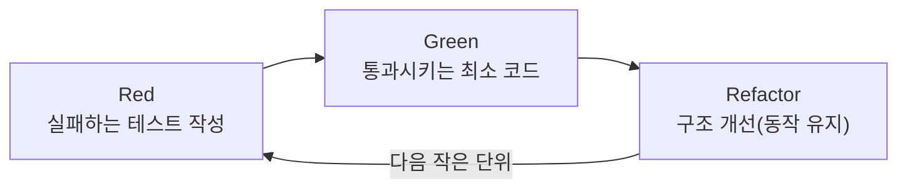
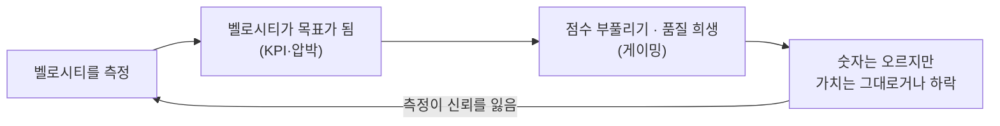

## 서론

[이전 글](/blog/agile-guide-3)까지가 "어떤 틀로 일하나"(Scrum·Kanban)였다면, 4편은 그 틀 안에서 벌어지는 두 가지 질문을 다룬다.

첫째, <strong>그 안에서 코드를 실제로 어떻게 만드나.</strong> Scrum 이벤트를 다 돌려도, 코드를 안전하고 빠르게 바꿀 수 없으면 짧은 반복 루프 자체가 멈춘다. 이 "어떻게 만드나"를 책임지는 게 XP의 엔지니어링 프랙티스다.

둘째, <strong>그걸 어떻게 측정하나.</strong> 스토리포인트·벨로시티·DORA 같은 숫자는 유용하지만, 숫자가 목표가 되는 순간 팀은 숫자를 속이기 시작한다.

두 질문을 관통하는 경고가 둘 있다. <strong>프로세스만 도입하고 엔지니어링 프랙티스를 빼면 애자일은 무너진다</strong>(1절). 그리고 <strong>측정이 KPI가 되면 측정 자체가 망가진다</strong>(4절). 둘 다 5편 가짜 애자일의 핵심 원인이다.

대상 독자는 스크럼은 돌리는데 코드는 점점 손대기 무서워지는 팀, 벨로시티를 생산성 지표로 쓰라는 압박을 받는 사람이다.

- [1편 — 애자일은 왜 등장했나 — 선언문 · 4가치 · 12원칙](/blog/agile-guide-1)
- [2편 — Scrum — 경험적 프로세스 제어와 3-5-3](/blog/agile-guide-2)
- [3편 — Kanban · Lean · 흐름(Flow)](/blog/agile-guide-3)
- <strong>4편 — 실천과 측정 — XP부터 벨로시티 · DORA까지 (이 글)</strong>
- [5편 — 스케일링과 가짜 애자일](/blog/agile-guide-5)
- [6편 — 실전: 유저스토리에서 릴리스까지](/blog/agile-guide-6)
- [7편 — 디스커버리: 유저스토리는 어디서 오는가](/blog/agile-guide-7)

---

## TL;DR

- <strong>XP는 애자일의 기술적 심장이다</strong> — TDD·CI·리팩토링·페어 프로그래밍 같은 엔지니어링 프랙티스가 "코드를 계속 안전하게 바꿀 수 있는 상태"를 만든다. 1편 9원칙(기술 우수성이 기민함을 높인다)의 구현이다.
- <strong>프로세스만 도입하고 프랙티스를 빼면 무너진다</strong> — 스크럼 이벤트만 돌리고 프랙티스를 생략하면 기술 부채가 쌓여 변경이 느려지고, 짧은 반복 루프 자체가 멈춘다. 가짜 애자일의 1순위 원인이다.
- <strong>스토리포인트는 시간이 아니라 상대 크기다</strong> — 사람은 절대 시간 추정엔 약해도 상대 비교엔 낫다. 플래닝 포커로 함께 추정한다.
- <strong>벨로시티는 계획 도구이지 KPI가 아니다</strong> — 팀 간 비교나 생산성 목표로 쓰면 Goodhart's Law에 따라 점수 부풀리기로 망가진다.
- <strong>측정하려면 DORA(DevOps Research and Assessment)를 본다</strong> — 배포 빈도·변경 리드타임·변경 실패율·복구 시간. 내부 점수(벨로시티)가 아니라 전달 성과(outcome)를 잰다. 속도 ≠ 가치.

---

## 1. XP — 애자일의 기술적 심장

### 1.1 XP란

<strong>XP(eXtreme Programming, 익스트림 프로그래밍)</strong>는 켄트 벡이 1990년대 말에 정리한 애자일 방법론으로, "좋은 개발 관행을 극단까지(extreme) 밀어붙이자"는 발상이다. 코드 리뷰가 좋으면 상시로 하자(페어 프로그래밍), 테스트가 좋으면 코드보다 먼저 쓰자(TDD), 통합이 좋으면 매일 여러 번 하자(지속적 통합).

XP는 다섯 가치(의사소통·단순성·피드백·용기·존중)를 두지만, XP가 다른 프레임워크와 구별되는 지점은 <strong>구체적인 엔지니어링 프랙티스</strong>를 정면으로 다룬다는 데 있다. Scrum·Kanban이 "일을 어떻게 조직하나"라면, XP는 "코드를 어떻게 만드나"를 말한다.

### 1.2 왜 엔지니어링 프랙티스가 핵심인가

1편 9원칙은 "기술적 우수성과 좋은 설계에 대한 지속적 관심이 기민함을 높인다"고 했다. 이건 장식이 아니라 애자일의 작동 조건이다.

애자일의 핵심은 짧은 반복으로 자주 바꾸는 것이다. 그런데 <strong>자주 바꾸려면 코드가 바꿀 수 있는 상태로 유지돼야 한다.</strong> 테스트가 없어 변경이 무섭고, 구조가 엉켜 한 곳을 고치면 다른 곳이 깨진다면, "자주 바꾼다"는 불가능해진다.

그래서 프로세스와 프랙티스는 한 몸이다. Scrum 이벤트(프로세스)만 도입하고 TDD·CI·리팩토링(프랙티스)을 빼면 어떻게 되는가.

- 기술 부채가 쌓여 <strong>변경이 점점 느려진다.</strong>
- 변경이 느려지니 <strong>벨로시티가 떨어진다.</strong>
- 코드를 안전하게 못 바꾸니 <strong>짧은 반복 루프가 멈춘다.</strong>

결국 이벤트는 도는데 애자일하지 않은 상태가 된다. <strong>이것이 애자일이 망가지는 1순위 경로</strong>이고, 5편에서 가짜 애자일의 핵심 증상으로 다시 만난다. 프로세스는 골격이고, 엔지니어링 프랙티스는 그 골격을 움직이게 하는 근육이다.

---

## 2. 핵심 엔지니어링 프랙티스

XP의 프랙티스 중 오늘날 가장 널리 쓰이는 여섯 개를 추린다.

| 프랙티스 | 무엇을 | 왜 중요한가 |
|---|---|---|
| TDD | 실패하는 테스트를 먼저 쓰고 통과시킨 뒤 리팩토링 | 변경을 안전하게 만들고 설계를 견인 |
| 지속적 통합(CI) | 작은 변경을 하루에도 여러 번 메인라인에 통합 | 통합 지옥 회피, 빠른 피드백 |
| 리팩토링 | 동작은 그대로 두고 내부 구조만 개선 | 코드를 계속 바꿀 수 있는 상태로 유지 |
| 페어 프로그래밍 | 두 명이 한 코드를 함께 작성 | 상시 리뷰·지식 공유, 사일로 방지 |
| 단순 설계(YAGNI, You Aren't Gonna Need It) | 지금 필요한 것만 만든다 | 복잡도 누적 방지(1편 10원칙) |
| 집단 코드 소유 | 누구나 어떤 코드든 고칠 수 있다 | 병목·사일로 제거 |

### 2.1 TDD — 테스트가 설계를 견인한다

<strong>TDD(Test-Driven Development, 테스트 주도 개발)</strong>는 코드보다 테스트를 먼저 쓰는 방식이다. Red-Green-Refactor 세 단계를 짧게 반복한다.

핵심은 테스트가 회귀 안전망이 되어 <strong>리팩토링을 가능하게</strong> 한다는 점이다. 테스트가 받쳐 주니 구조를 겁 없이 개선할 수 있고, 그래서 코드가 "계속 바꿀 수 있는 상태"로 유지된다. TDD는 1편 10원칙(단순성)과도 맞물린다 — 테스트를 통과시키는 최소 코드만 쓰기 때문이다.

### 2.2 CI와 트렁크 기반 개발

<strong>지속적 통합(CI, Continuous Integration)</strong>은 작은 변경을 자주(하루에도 여러 번) 공유 메인라인에 통합하고, 통합할 때마다 자동 빌드·테스트로 문제를 즉시 잡는 실천이다.

반대편엔 <strong>장수 브랜치(long-lived branch)</strong>가 있다. 몇 주씩 따로 작업하다 한 번에 합치면, 그 시점에 충돌과 통합 버그가 폭발한다(통합 지옥). 그래서 CI는 보통 <strong>트렁크 기반 개발(trunk-based development)</strong> — 짧게 살아 있는 브랜치로 자주 메인라인에 합치는 방식 — 과 함께 간다.

이 프랙티스들은 측정과도 직접 연결된다. 자주·작게 통합하고 배포하는 팀일수록 4절에서 볼 DORA 지표(배포 빈도·변경 리드타임)가 좋아진다. <strong>엔지니어링 프랙티스가 곧 전달 성과로 나타나는 것</strong>이다.

---

## 3. 추정 — 스토리포인트와 플래닝 포커

### 3.1 스토리포인트가 시간이 아닌 이유

가장 흔한 오해는 "1 스토리포인트 = 몇 시간"으로 환산하려는 것이다. <strong>스토리포인트는 시간이 아니라 상대적 크기</strong>다 — 복잡도·불확실성·작업량을 합친 한 덩어리의 "크기 감각"이다.

왜 시간이 아니라 상대 크기인가. 사람은 "이거 며칠 걸려요"라는 <strong>절대 시간 추정엔 형편없지만</strong>, "이건 저거보다 두 배쯤 크다"는 <strong>상대 비교엔 훨씬 낫기</strong> 때문이다. 그래서 기준 작업 하나를 정해 두고, 나머지를 그에 견줘 크기를 매긴다.

### 3.2 플래닝 포커와 피보나치

<strong>플래닝 포커(planning poker)</strong>는 팀이 함께 추정하는 기법이다. 각자 카드로 크기를 동시에 공개하고, 값이 갈리면 왜 다른지 토론한다. 추정치 자체보다 그 토론에서 드러나는 <strong>이해의 차이</strong>가 더 값지다.

카드는 보통 피보나치 비슷한 수열(1·2·3·5·8·13·…)을 쓴다. 숫자가 커질수록 간격이 벌어지는데, 이는 큰 작업일수록 불확실성도 커져 정밀한 구분이 무의미하다는 걸 반영한다.

> <strong>참고 — #NoEstimates</strong>: 추정 자체가 낭비일 때가 많다고 보는 흐름이다. "추정하지 말자"가 아니라, 작업을 잘게·균일하게 쪼개 두고 <strong>처리량(완료 개수)으로 예측</strong>하자는 쪽에 가깝다. 3편의 흐름 지표(처리량·리드타임)로 미래를 예측하는 것과 같은 발상이다. 상세 추정이 정말 가치를 더하는지 질문하라는 문제 제기로 읽으면 된다.

---

## 4. 측정 — 벨로시티의 함정과 DORA

### 4.1 벨로시티의 옳은 사용과 잘못된 사용

<strong>벨로시티(velocity)</strong>는 한 스프린트에 완료한 스토리포인트의 합이다. 문제는 사용처다.

| 구분 | 사용 |
|---|---|
| 옳은 사용 | 그 팀 자신의 다음 스프린트 용량을 예측하는 계획 도구 |
| 잘못된 사용 | 팀 간 비교, 생산성 KPI, 경영진의 목표치 |

벨로시티는 팀마다 추정 기준이 다르므로 <strong>팀 간 비교가 원천적으로 불가능</strong>하다. 어떤 팀의 8점이 다른 팀의 3점일 수 있다. 같은 팀 안에서 "다음에 얼마나 담을 수 있나"를 가늠하는 데만 의미가 있다.

### 4.2 Goodhart's Law — 측정이 목표가 되면 망가진다

<strong>Goodhart's Law(굿하트의 법칙)</strong>는 "측정값이 목표가 되는 순간, 그것은 더 이상 좋은 측정값이 아니다"라는 경고다. 벨로시티를 KPI로 걸면 정확히 이 일이 벌어진다.

목표가 된 순간 팀은 같은 일에 점수를 더 매기고(점수 인플레이션), 리팩토링·테스트 같은 "점수 안 나오는 일"을 건너뛴다. 숫자는 오르지만 실제 가치는 그대로거나 오히려 떨어진다. 1편 7원칙("진척의 척도는 작동하는 소프트웨어")이 여기서 다시 울린다 — 진척은 점수가 아니라 동작하는 결과로 재야 한다.

> <strong>참고 — 번다운과 번업</strong>: 번다운 차트는 남은 일을 0까지 줄여 가며 그리고, 번업 차트는 완료한 일을 범위선까지 쌓아 올리며 그린다. 번업은 범위가 늘어난 것(스코프 변화)까지 보여 줘서, "왜 안 끝났나"가 일을 못해서인지 범위가 커져서인지 구분해 준다.

### 4.3 DORA — 전달 성과를 재는 네 지표

벨로시티가 내부 점수라면, <strong>DORA(DevOps Research and Assessment) 4 메트릭</strong>은 전달 성과(outcome)를 잰다. 'Accelerate' 연구에서 정리된, 소프트웨어 전달 성과를 대표하는 네 지표다.

| 지표 | 무엇을 재나 | 축 |
|---|---|---|
| 배포 빈도 | 운영에 얼마나 자주 배포하나 | 속도 |
| 변경 리드타임 | 커밋부터 운영 반영까지 걸리는 시간 | 속도 |
| 변경 실패율 | 배포 중 장애를 부른 비율 | 안정성 |
| 복구 시간(MTTR, Mean Time To Restore) | 장애에서 회복까지 걸리는 시간 | 안정성 |

앞 둘은 속도, 뒤 둘은 안정성이다. 핵심 발견은 <strong>속도와 안정성이 상충하지 않는다</strong>는 것이다 — 잘하는 팀(엘리트 퍼포머)은 둘 다 좋다. 자주·작게 배포할수록 한 번의 변경이 작아 실패도 적고 복구도 빠르기 때문이다. 2절의 CI·트렁크 기반 개발이 바로 이 네 지표를 끌어올리는 프랙티스다.

DORA가 벨로시티보다 정직한 이유는 <strong>내부 추정이 아니라 실제 전달된 결과를 재기 때문</strong>이다. "변경 리드타임"은 3편의 흐름 리드타임과도 같은 결의 측정이다. 그래도 DORA조차 KPI로 박아 목표치로 강요하면 Goodhart's Law를 피하지 못한다. <strong>측정은 팀이 스스로 개선하는 신호여야지, 위에서 내리꽂는 목표치가 되어선 안 된다.</strong>

---

## 정리

4편의 핵심을 한 줄씩 정리하면 다음과 같다.

- <strong>XP의 엔지니어링 프랙티스가 애자일의 기술적 심장이다</strong> — TDD·CI·리팩토링·페어가 "코드를 계속 안전하게 바꿀 수 있는 상태"를 만든다. 이게 1편 9원칙(기술 우수성)의 실체다.
- <strong>프로세스만 도입하고 프랙티스를 빼면 무너진다</strong> — 기술 부채가 변경을 느리게 하고, 짧은 반복 루프가 멈춘다. 가짜 애자일의 1순위 원인이다.
- <strong>스토리포인트는 상대 크기, 벨로시티는 계획 도구</strong> — 시간 환산도, 팀 간 비교도 본래 용도가 아니다.
- <strong>측정이 KPI가 되면 Goodhart's Law로 망가진다</strong> — 점수 부풀리기와 품질 희생이 따라온다. 측정은 목표치가 아니라 신호여야 한다.
- <strong>측정하려면 DORA를 본다</strong> — 배포 빈도·변경 리드타임·변경 실패율·복구 시간. 내부 점수가 아니라 전달 성과를 재고, 속도와 안정성은 상충하지 않는다.

다음 편은 시리즈의 종착점인 <strong>스케일링과 가짜 애자일</strong>이다. 팀 하나를 넘어 여러 팀으로 애자일을 확장할 때(SAFe·LeSS·Spotify·콘웨이 법칙) 무엇이 어려워지는지, 그리고 1–4편에서 본 변질 신호들이 한 팀의 현실에서 어떻게 "가짜 애자일"로 굳는지, 거기서 어떻게 회복하는지를 종합한다.

---

## 부록

### A. 용어 정리

| 용어 | 한 줄 정의 |
|---|---|
| XP(eXtreme Programming) | 좋은 개발 관행을 극단까지 밀어붙이는 애자일 방법론(켄트 벡) |
| TDD(Test-Driven Development) | 실패하는 테스트를 먼저 쓰고(Red) 통과시킨 뒤(Green) 구조를 개선(Refactor)하는 개발 방식 |
| 지속적 통합(CI, Continuous Integration) | 작은 변경을 자주 메인라인에 통합하고 매번 자동 빌드·테스트로 검증하는 실천 |
| 트렁크 기반 개발(trunk-based development) | 짧게 살아 있는 브랜치로 자주 메인라인에 합치는 방식(장수 브랜치의 반대) |
| 리팩토링(refactoring) | 동작은 그대로 두고 코드 내부 구조만 개선하는 작업 |
| 페어 프로그래밍 | 두 사람이 한 코드를 함께 작성하며 상시 리뷰하는 실천 |
| 단순 설계 / YAGNI | 지금 필요한 것만 만든다(You Aren't Gonna Need It, 1편 10원칙) |
| 스토리포인트 | 시간이 아니라 복잡도·불확실성·작업량을 합친 상대적 크기 |
| 플래닝 포커 | 팀이 카드로 크기를 동시에 공개하고 차이를 토론해 추정하는 기법 |
| 벨로시티 | 한 스프린트에 완료한 스토리포인트 합 — 그 팀의 계획 도구이지 생산성 KPI가 아니다 |
| Goodhart's Law | "측정값이 목표가 되면, 더 이상 좋은 측정값이 아니다"라는 경고 |
| #NoEstimates | 상세 추정의 가치를 의심하고, 잘게 쪼갠 작업의 처리량으로 예측하자는 흐름 |
| DORA(DevOps Research and Assessment) 4 메트릭 | 배포 빈도·변경 리드타임·변경 실패율·복구 시간 — 소프트웨어 전달 성과 지표 |
| MTTR | 평균 복구 시간(Mean Time To Restore) — 장애에서 회복까지 걸리는 시간 |

### B. 외부 참조

- [Extreme Programming Explained (Kent Beck)](https://www.oreilly.com/library/view/extreme-programming-explained/0201616416/) — XP의 가치와 프랙티스
- [Accelerate / DORA State of DevOps](https://dora.dev/) — DORA 4 메트릭과 전달 성과 연구
- [Goodhart's Law](https://en.wikipedia.org/wiki/Goodhart%27s_law) — 측정이 목표가 될 때의 함정
