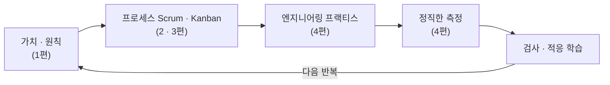

## 서론

[이전 글](/blog/agile-guide-4)까지 우리는 가치(1편)·Scrum(2편)·Kanban(3편)·실천과 측정(4편)을 봤다. 전부 <strong>팀 하나</strong>를 전제로 한 이야기였다.

현실에선 두 가지가 더 남는다. 첫째, 팀이 하나를 넘어 <strong>여러 팀으로 커질 때</strong> 무엇이 어려워지는가. 둘째, 그렇게 쌓아 올린 애자일이 왜 그토록 자주 <strong>"가짜 애자일"</strong>로 변질되며, 거기서 어떻게 빠져나오는가.

시리즈의 종착점인 5편은 이 둘을 종합한다. 스케일링 프레임워크(SAFe·LeSS·Spotify)와 콘웨이 법칙을 보고, 1–4편에서 흩어져 나온 변질 신호들을 한자리에 모아 진단한 뒤, 회복 처방으로 닫는다. 마지막엔 시리즈 전체를 한 문장으로 묶는다 — <strong>애자일은 따라 하는 도구 세트가 아니라 검사-적응 학습 루프다.</strong>

대상 독자는 여러 팀으로 애자일을 굴리려다 오히려 무거워진 조직, "우리가 하는 게 진짜 애자일이 맞나" 의심이 드는 사람이다.

- [1편 — 애자일은 왜 등장했나 — 선언문 · 4가치 · 12원칙](/blog/agile-guide-1)
- [2편 — Scrum — 경험적 프로세스 제어와 3-5-3](/blog/agile-guide-2)
- [3편 — Kanban · Lean · 흐름(Flow)](/blog/agile-guide-3)
- [4편 — 실천과 측정 — XP부터 벨로시티 · DORA까지](/blog/agile-guide-4)
- <strong>5편 — 스케일링과 가짜 애자일 (이 글)</strong>
- [6편 — 실전: 유저스토리에서 릴리스까지](/blog/agile-guide-6)
- [7편 — 디스커버리: 유저스토리는 어디서 오는가](/blog/agile-guide-7)

---

## TL;DR

- <strong>팀을 넘어서면 의존성·정렬·통합이 문제가 된다</strong> — 한 팀에선 통하던 게, 여러 팀에선 팀 간 조율 비용으로 무너진다. 그리고 콘웨이 법칙에 따라 시스템은 조직 구조를 닮는다.
- <strong>스케일링 프레임워크는 셋이 대표적이다</strong> — 스케일드 애자일 프레임워크(대규모 조직용 애자일 확장 방식, 규범적·계층적), 대규모 스크럼(대규모 조직용 스크럼 확장 방식, 최소 확장), Spotify 모델(자율 문화). 단 "Spotify조차 그 모델을 안 쓴다".
- <strong>스케일링의 역설</strong> — 애자일을 키우려고 조율을 더 얹다가, 다시 폭포수처럼 무거워진다. 진짜 스케일은 조율을 더하는 게 아니라 의존성을 줄이는 것이다.
- <strong>가짜 애자일 = 형식은 있는데 검사·적응이 없는 상태</strong> — 데일리=보고, 스프린트=미니 폭포수, 회고=형식, 벨로시티 압박, 프랙티스 생략. 1–4편의 변질 신호가 한 팀에서 동시에 터진 것이다.
- <strong>회복은 이벤트를 더 하는 게 아니다</strong> — 엔지니어링 프랙티스를 먼저 되살리고, 학습 루프를 작게 만들고, 측정을 신호로 되돌리고, 가치로 재정렬한다.

---

## 1. 팀을 넘어설 때 — 스케일링의 문제

한 팀(5–9명) 안에서는 대화로 거의 다 풀린다. 같은 목표를 보고, 매일 얼굴을 맞대고, 막히면 바로 조율한다. 1–4편은 모두 이 전제 위에 있었다.

팀이 다섯, 열, 스무 개로 늘면 새 비용이 생긴다.

- <strong>의존성</strong> — A팀이 B팀의 결과물을 기다리느라 멈춘다. 팀이 늘수록 서로 막는 경우가 기하급수로 는다.
- <strong>정렬(alignment)</strong> — 모두가 같은 방향을 보게 하기가 어려워진다. 팀마다 다른 우선순위로 흩어진다.
- <strong>통합</strong> — 각 팀의 결과물을 하나로 합치는 비용이 커진다(4편 통합 지옥의 조직 버전).

여기서 결정적인 통찰이 <strong>콘웨이 법칙(Conway's Law)</strong>이다. 멜빈 콘웨이가 1967년에 관찰한 것으로, <strong>"시스템 구조는 그것을 만든 조직의 의사소통 구조를 닮는다"</strong>는 법칙이다. 팀을 기능별(프론트·백엔드·DBA(데이터베이스 관리자))로 쪼개면 시스템도 그렇게 쪼개지고, 팀 간 소통이 느리면 그 경계의 인터페이스도 엉성해진다.

그래서 스케일링은 "프로세스를 어떻게 늘리나"의 문제이기 이전에 <strong>"팀 경계를 어떻게 긋나"의 문제</strong>다. 원하는 아키텍처가 있으면 거기에 맞춰 팀을 설계하는 <strong>역콘웨이 전략(reverse Conway maneuver)</strong>, 그리고 팀 간 의존성과 인지 부하를 줄이도록 팀 유형을 설계하는 <strong>팀 토폴로지(Team Topologies)</strong>가 이 통찰의 연장선이다.

---

## 2. 스케일링 프레임워크 — SAFe · LeSS · Spotify

여러 팀의 애자일을 다루겠다는 프레임워크는 많지만, 대표적인 셋만 본다. 성격이 뚜렷이 다르다.

| 프레임워크 | 한 줄 | 강점 | 비판 |
|---|---|---|---|
| SAFe(Scaled Agile Framework) | 가장 규범적·계층적(팀 → 프로그램 → 포트폴리오) | 대기업용 구조와 공통 언어를 제공 | 무겁고 top-down, 대규모 사전 계획이 다시 폭포수처럼 됨 |
| LeSS(Large-Scale Scrum) | Scrum을 최소 변경으로 확장(제품 책임자 1·제품 백로그 1) | 가벼움을 유지, Scrum에 충실 | 깊은 조직 변화를 요구, 규정이 적어 도입이 어려움 |
| Spotify 모델 | 스쿼드·트라이브·챕터·길드의 자율 문화 | 팀 자율과 문화를 강조해 널리 회자 | 한 시점의 스냅샷일 뿐 — "Spotify조차 그대로 안 쓴다" |

세 가지에 각각 함정이 있다.

- <strong>SAFe</strong>는 가장 많이 팔리지만 가장 자주 비판받는다. ART(Agile Release Train, 여러 팀을 묶은 단위)와 PI(Program Increment, 분기 단위) 계획 같은 계층이 "거대한 사전 계획"으로 흐르면, 이름만 애자일인 폭포수가 된다.
- <strong>LeSS</strong>는 가볍지만, 그래서 더 어렵다. 알아서 해야 할 조직 변화가 크고, SAFe처럼 손에 쥐여 주는 절차가 적다.
- <strong>Spotify 모델</strong>은 가장 많이 모방되지만 가장 위험하다. 2012년 한 시점의 모습을 적은 글이 "프레임워크"로 굳어 버렸고, 정작 Spotify도 그대로 쓰지 않는다. 남의 조직도(組織圖)를 베끼는 건 1편의 카고 컬트 그 자체다.

---

## 3. 스케일링의 역설

스케일링에서 가장 흔한 실패는 직관적이다. <strong>애자일을 키우려고 조율을 자꾸 더 얹는 것</strong>이다. 팀이 늘어 정렬이 안 되니 정렬 회의를 늘리고, 의존성이 꼬이니 조율 담당자를 두고, 통합이 안 되니 사전 계획을 키운다.

그 끝은 역설적이다. 더 빠르고 유연해지려고 도입한 애자일이, 조율의 무게에 눌려 <strong>다시 폭포수처럼 무거워진다.</strong> 분기마다 거대한 계획을 세우고, 그 계획을 지키는 게 목표가 된다.

해법의 방향은 반대다. <strong>진짜 스케일은 조율을 더하는 게 아니라, 조율할 필요 자체를 줄이는 것이다.</strong>

- 팀이 <strong>가능한 독립적으로</strong> 일하도록 경계를 긋는다(콘웨이 법칙을 거꾸로 활용).
- 팀 간 의존성을 구조적으로 줄인다(명확한 API·플랫폼 팀·느슨한 결합).
- 그래야 각 팀이 1–4편의 작은 루프를 그대로 돌릴 수 있다.

> <strong>핵심</strong>: 스케일링 프레임워크 자체가 문제는 아니다. 문제는 "프레임워크를 깔면 스케일된다"는 착각이다. 도구는 의존성을 줄이려는 의도를 도울 뿐, 그 의도를 대신해 주지 않는다.

---

## 4. 가짜 애자일 — 신호와 진단

이제 시리즈 내내 깔아 온 복선을 회수한다. <strong>가짜 애자일(fake agile)은 형식(이벤트·프레임워크)은 있는데 알맹이(검사·적응·가치)가 빠진 상태</strong>다. 1–4편에서 흩어져 나온 변질 신호를 한자리에 모으면 진단표가 된다.

| 변질 신호 | 빠진 알맹이 | 어디서 다뤘나 |
|---|---|---|
| 데일리가 매니저 대상 상태 보고 | 검사·적응 | 2편 |
| 스프린트가 미니 폭포수(계획대로만) | 검사·적응 | 2편 |
| 회고가 형식(바뀌는 게 없음) | 적응(학습) | 2편 |
| 벨로시티를 생산성 KPI로 압박 | 정직한 측정 | 4편 |
| 엔지니어링 프랙티스 생략(기술 부채) | 기술적 토대 | 4편 |
| 명령형 스크럼(자기관리 없음) | 사람 신뢰 | 2편 |
| "애자일 = 더 빨리·더 싸게" 오해 | 가치 이해 | 1편 |

이 신호들이 한 팀에서 동시에 터지면, 겉은 애자일인데 속은 통제형 폭포수인 조직이 된다. 1편에서 이름 붙인 <strong>카고 컬트(cargo cult) 애자일</strong> — 의미는 빼고 형식만 흉내 내는 상태 — 의 완성형이다.

여기에 조직 차원의 변질이 하나 더 있다. <strong>애자일 산업 복합체(Agile Industrial Complex)</strong>다. 마틴 파울러가 짚은 표현으로, 애자일이 자격증·컨설팅·도구를 파는 산업이 되어 <strong>위에서 팀에 강요되는</strong> 현상을 가리킨다. "사람과 상호작용을 공정과 도구보다"(1편 1가치) 앞세운 선언문과 정반대로, 애자일이 팀을 찍어 누르는 도구가 된 것이다.

진단의 열쇠는 2편의 세 기둥이다. 어떤 신호든 <strong>투명성·검사·적응 중 무엇이 빠졌는지</strong>로 환원된다. 형식을 더 정교하게 다듬는 걸로는 절대 고쳐지지 않는다 — 빠진 건 형식이 아니라 알맹이이기 때문이다.

---

## 5. 회복 — 어떻게 되돌리나

가짜 애자일의 처방은 직관과 반대다. <strong>이벤트를 더 하는 게 아니다.</strong> 데일리를 더 자주 하고 회고를 더 길게 한다고 알맹이가 돌아오지 않는다. 빠진 알맹이를 되살려야 한다.

| 처방 | 무엇을 | 근거 편 |
|---|---|---|
| 엔지니어링 프랙티스를 먼저 복원 | TDD·CI·리팩토링부터. 코드를 못 바꾸면 어떤 루프도 안 돈다 | 4편 |
| 학습 루프를 작게 | 회고가 실제로 한 가지라도 바꾸게 만든다 | 1·2편 |
| 측정을 신호로 되돌림 | 벨로시티 KPI 압박을 걷어내고, DORA·흐름 지표는 팀 스스로 보는 신호로 | 3·4편 |
| 가치로 재정렬 | "우리가 왜 이걸 하지"를 4가치로 다시 묻는다 | 1편 |

순서가 중요하다. <strong>엔지니어링 프랙티스가 맨 먼저다.</strong> 4편에서 봤듯 코드를 안전하게 못 바꾸면 짧은 반복 루프 자체가 불가능하고, 그러면 나머지 처방은 공염불이 된다. 프랙티스라는 토대 위에서야 검사·적응 루프가 비로소 돈다.

그리고 이 모든 처방은 한 가지를 복원하는 일이다 — <strong>멈춰 버린 학습 루프를 다시 돌리는 것.</strong> 가짜 애자일은 루프가 멈춘 상태고, 회복은 루프를 재가동하는 것이다.

---

## 정리

5편의 핵심을 한 줄씩 정리하면 다음과 같다.

- <strong>팀을 넘어서면 의존성·정렬·통합이 문제가 되고, 콘웨이 법칙이 작동한다</strong> — 시스템은 조직 구조를 닮는다. 그래서 스케일링은 프로세스보다 팀 경계 설계의 문제다.
- <strong>SAFe·LeSS·Spotify 모델은 성격이 다르고 각각 함정이 있다</strong> — 특히 남의 조직도를 베끼는 건 카고 컬트다.
- <strong>스케일링의 역설 — 조율을 더하면 다시 폭포수가 된다</strong> — 진짜 스케일은 조율할 필요 자체를 줄이는 것이다.
- <strong>가짜 애자일은 형식은 있는데 검사·적응이 빠진 상태</strong> — 1–4편의 변질 신호가 한 팀에서 동시에 터진 것이고, 세 기둥으로 진단된다.
- <strong>회복은 이벤트를 더 하는 게 아니라 알맹이를 되살리는 것</strong> — 프랙티스를 먼저, 학습 루프를 작게, 측정을 신호로, 가치로 재정렬.

그리고 시리즈 전체를 한 문장으로 묶으면 이렇다. <strong>애자일은 따라 하는 도구 세트(이벤트·프레임워크)가 아니라, 검사하고 적응하는 학습 루프다.</strong> 1편의 가치가 왜를, 2·3편의 프로세스가 골격을, 4편의 프랙티스와 측정이 근육과 계기판을 줬다면 — 그 전부는 결국 이 하나의 루프를 돌리기 위한 것이었다. 루프가 돌면 애자일이고, 멈추면 이름이 무엇이든 가짜 애자일이다.

여기까지가 "애자일이 무엇이고 왜 그렇게 하며 왜 망가지는가"라는 개념의 한 바퀴다. 이어지는 <strong>6편(실전)</strong>에서는 이 개념들이 유저스토리에서 릴리스까지 실제로 어떤 순서로 도는지를 한 흐름으로 걸어 본다 — 유저스토리·인수조건(Given/When/Then)·MoSCoW·MVP를 거쳐 검사-적응 루프가 한 바퀴 도는 모습을 본다.

---

## 부록

### A. 용어 정리

| 용어 | 한 줄 정의 |
|---|---|
| 콘웨이 법칙(Conway's Law) | 시스템 구조는 그것을 만든 조직의 의사소통 구조를 닮는다는 관찰(멜빈 콘웨이, 1967) |
| 역콘웨이 전략(reverse Conway maneuver) | 원하는 아키텍처에 맞춰 조직·팀 경계를 먼저 설계하는 접근 |
| 팀 토폴로지(Team Topologies) | 팀 간 의존성과 인지 부하를 줄이도록 팀 유형·상호작용을 설계하는 방법론 |
| SAFe(Scaled Agile Framework) | 팀→프로그램→포트폴리오 계층으로 애자일을 확장하는 가장 규범적인 프레임워크 |
| LeSS(Large-Scale Scrum) | 제품 책임자 1·제품 백로그 1을 유지하며 Scrum을 최소 변경으로 확장하는 프레임워크 |
| Spotify 모델 | 스쿼드·트라이브·챕터·길드로 자율 팀을 구성한 2012년 사례(프레임워크가 아님) |
| 가짜 애자일(fake agile) | 이벤트·프레임워크 형식은 있는데 검사·적응·가치라는 알맹이가 빠진 상태 |
| 애자일 산업 복합체(Agile Industrial Complex) | 애자일이 자격증·컨설팅·도구 산업이 되어 위에서 팀에 강요되는 현상(마틴 파울러) |

### B. 외부 참조

- [Conway's Law](https://en.wikipedia.org/wiki/Conway%27s_law) — 조직 구조와 시스템 구조의 관계
- [Team Topologies (Skelton & Pais)](https://teamtopologies.com/) — 역콘웨이 전략과 팀 유형 설계
- [Martin Fowler, "The State of Agile Software in 2018"](https://martinfowler.com/articles/agile-aus-2018.html) — 애자일 산업 복합체 비판
- [Manifesto for Agile Software Development](https://agilemanifesto.org/) — 시리즈의 출발점, 애자일 선언문
