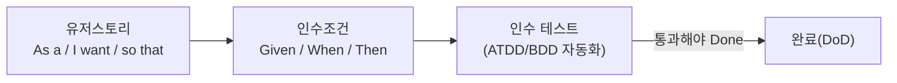
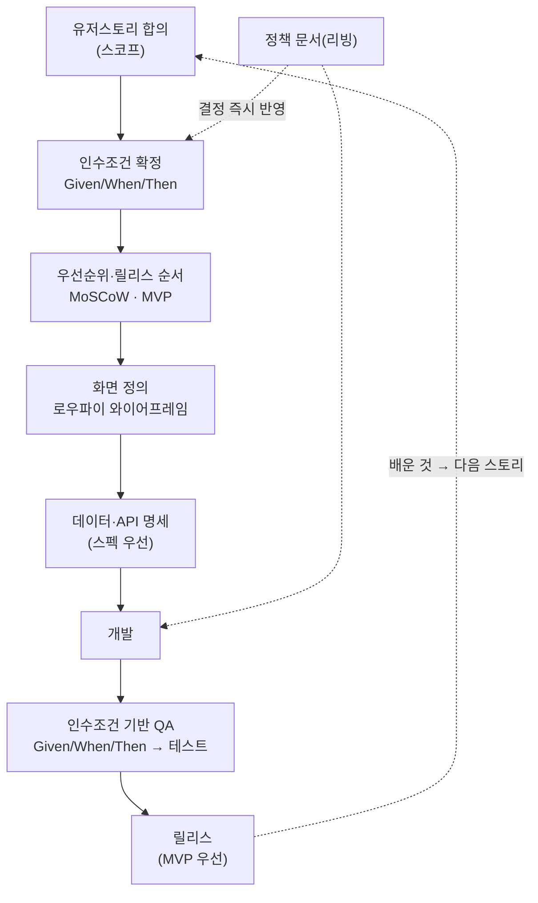

## 서론

[이전 글](/blog/agile-guide-5)까지 다섯 편으로 "애자일이 무엇이고, 왜 그렇게 하며, 왜 망가지는가"를 한 바퀴 돌았다. 전부 <strong>개념</strong>이었다.

그런데 막상 월요일 아침 팀에 앉으면 질문은 더 구체적이다. "스토리는 어떻게 적지?", "인수조건이 QA로 어떻게 넘어가지?", "MVP는 어디까지지?", "이벤트 스토밍은 해야 하나?" 개념을 알아도, 그게 <strong>유저스토리에서 릴리스까지 어떤 순서로 굴러가는지</strong>는 따로 그려 봐야 잡힌다.

6편은 그 실전 흐름을 한 바퀴 걸어 본다. 특정 비즈니스가 아니라 어느 팀에나 적용되는 일반 딜리버리 플로우다. 그리고 각 단계에서 1–5편의 개념이 어디서 작동하는지 매핑한다. 시리즈가 아직 정면으로 안 다룬 <strong>유저스토리·인수조건(Given/When/Then)·MoSCoW·MVP·이벤트 스토밍</strong>도 이 흐름 안에서 자연스럽게 소화한다.

대상 독자는 개념은 봤는데 "그래서 우리 팀은 내일 뭘 먼저 하지"가 막막한 사람이다.

- [1편 — 애자일은 왜 등장했나 — 선언문 · 4가치 · 12원칙](/blog/agile-guide-1)
- [2편 — Scrum — 경험적 프로세스 제어와 3-5-3](/blog/agile-guide-2)
- [3편 — Kanban · Lean · 흐름(Flow)](/blog/agile-guide-3)
- [4편 — 실천과 측정 — XP부터 벨로시티 · DORA까지](/blog/agile-guide-4)
- [5편 — 스케일링과 가짜 애자일](/blog/agile-guide-5)
- <strong>6편 — 실전: 유저스토리에서 릴리스까지 (이 글)</strong>

---

## TL;DR

- <strong>모든 흐름의 출발점은 유저스토리다</strong> — "~로서, ~하고 싶다, ~하기 위해" 한 줄. 명세가 아니라 대화의 약속이며, INVEST 조건과 인수조건이 따라붙는다.
- <strong>인수조건은 Given/When/Then으로 적고, 그대로 QA로 넘어간다</strong> — 인수조건이 곧 완료 기준(DoD)이자 인수 테스트의 씨앗이다(ATDD/BDD). "QA에서 유저스토리로 검증"이 이 뜻이다.
- <strong>우선순위는 MoSCoW, 크기는 스토리 포인트, 범위는 MVP로 자른다</strong> — 다 만들고 한 번에 내는 게 아니라, 가장 가치 있는 최소한을 먼저 릴리스한다.
- <strong>스펙(화면·데이터·API)을 먼저 확정해 병렬로 짓되, 병렬은 단절이 아니다</strong> — API 계약·인수조건·리빙 정책 문서가 백엔드·프론트를 묶는다. '스펙 던지고 각자 잠수'는 폭포수다.
- <strong>정책·데이터 모델은 한 번에 못 박지 않는다</strong> — 스토리·인수조건 단계에서 씨앗을 심고 개발·QA 내내 리빙 문서로 갱신한다. 확정하되 동결하지 않는다.
- <strong>이 전체 플로우는 1–5편의 실전 합본이다</strong> — 유저스토리→인수조건→우선순위→스펙→개발→QA→릴리스가 결국 5편의 검사-적응 학습 루프를 한 바퀴 도는 일이다.

---

## 1. 유저스토리 — 모든 것의 출발점

### 1.1 As a / I want / so that

<strong>유저스토리(user story)</strong>는 기능을 사용자 관점에서 한 줄로 적은 것이다. 정해진 틀이 있다.

```text
~로서(As a <역할>),
~하고 싶다(I want <목표>),
~하기 위해(so that <이유/가치>).
```

예를 들면 이렇다.

```text
사용자로서, 비밀번호를 재설정하고 싶다, 계정에 다시 접근하기 위해.
```

핵심은 유저스토리가 <strong>명세서가 아니라는 점</strong>이다. 스토리는 "이 대화를 나중에 꼭 하자"는 약속(placeholder)에 가깝다. 그래서 짧게 적고, 상세는 인수조건과 대화로 채운다. 1편 1가치(개인과 상호작용 > 공정과 도구)가 여기서 작동한다 — 두꺼운 명세 대신 대화를 남긴다.

### 1.2 INVEST — 좋은 스토리의 조건

좋은 스토리인지 점검하는 체크리스트가 <strong>INVEST</strong>다.

| 글자 | 뜻 | 한 줄 |
|---|---|---|
| Independent | 독립적 | 다른 스토리와 순서·의존 없이 다룰 수 있다 |
| Negotiable | 협상 가능 | 고정 명세가 아니라 대화로 조정 가능하다 |
| Valuable | 가치 있는 | 사용자·비즈니스에 가치를 준다 |
| Estimable | 추정 가능 | 크기를 가늠할 수 있다(4편 스토리 포인트) |
| Small | 작은 | 한 스프린트(또는 더 짧게) 안에 끝낼 수 있다 |
| Testable | 테스트 가능 | 완료를 객관적으로 검증할 수 있다(→ 인수조건) |

특히 마지막 <strong>Testable</strong>이 다음 절로 이어진다. 테스트 가능하다는 건 "끝났다"를 판별할 인수조건이 있다는 뜻이다.

---

## 2. 스토리에서 인수조건으로 — Given/When/Then

스토리 한 줄로는 "끝났다"를 판단할 수 없다. 그래서 <strong>인수조건(acceptance criteria)</strong>을 붙인다. 인수조건은 "이걸 다 만족하면 이 스토리는 받아들여진다"는 조건 목록이다.

인수조건은 흔히 <strong>Given/When/Then</strong> 형식으로 적는다. <strong>BDD(Behavior-Driven Development, 행위 주도 개발)</strong>에서 온 형식으로, 상황·행위·결과를 분리한다.

```text
Given 가입된 이메일이 있고,
When 비밀번호 재설정을 요청하면,
Then 재설정 링크가 담긴 메일이 발송된다.

Given 만료된 재설정 링크로,
When 접속하면,
Then 만료 안내와 재요청 버튼을 보여준다.
```

이 형식이 강력한 이유는 <strong>그대로 테스트가 되기 때문</strong>이다. Given/When/Then 한 줄 한 줄이 인수 테스트의 단계로 옮겨진다.



여기서 두 가지가 시리즈와 맞물린다. 첫째, 인수조건은 2편의 <strong>완료 기준(DoD)</strong>의 구체적 형태다 — "이 조건을 통과해야 증분으로 인정"이다. 둘째, 인수조건을 먼저 쓰고 그걸 통과시키는 개발 방식이 <strong>ATDD(Acceptance Test-Driven Development, 인수 테스트 주도 개발)</strong>로, 4편 TDD의 인수 레벨 버전이다. "QA에서 유저스토리로 검증한다"는 말은 결국 <strong>인수조건을 테스트로 돌려 스토리 단위로 확인한다</strong>는 뜻이다.

> <strong>참고</strong>: 미결 정책이 인수조건을 막을 때가 있다("만료 시간은 몇 분?"). 이때 정책을 결정해 <strong>리빙 정책 문서</strong>에 적고, 그 결정을 인수조건에 반영한다. 정책 문서는 한 번 쓰고 끝나는 게 아니라 진행 중 계속 갱신된다(5절).

---

## 3. 우선순위와 릴리스 순서 — MoSCoW · 스토리 포인트 · MVP

스토리가 쌓이면 "무엇을 먼저, 무엇을 이번엔 안 함"을 정해야 한다. 가장 흔한 도구가 <strong>MoSCoW</strong>다.

| 등급 | 뜻 | 의미 |
|---|---|---|
| Must | 반드시 | 없으면 릴리스가 무의미한 핵심 |
| Should | 하면 좋음 | 중요하지만 빠져도 릴리스는 가능 |
| Could | 가능하면 | 여유 있으면 포함, 가장 먼저 버려짐 |
| Won't | 이번엔 안 함 | 의도적으로 범위에서 제외(다음으로) |

핵심은 마지막 <strong>Won't</strong>이다. "이번엔 안 한다"를 명시적으로 적는 게 MoSCoW의 진짜 가치다 — 1편 10원칙(단순성, 해야 할 일을 최소화)을 우선순위 차원에서 실행하는 것이다.

크기는 4편에서 본 <strong>스토리 포인트</strong>로 매기고(상대 추정·플래닝 포커), 이 둘을 합쳐 <strong>MVP(Minimum Viable Product, 최소 기능 제품)</strong>의 범위를 자른다. MVP는 "가장 작지만, 사용자에게 가치를 주고 배움을 얻을 수 있는 최소한"이다. 다 만들고 한 번에 내는 게 아니라(그건 폭포수다, 1편), Must부터 묶어 먼저 릴리스하고 나머지를 이어 낸다.

> <strong>핵심</strong>: MVP는 "대충 만든 반쪽"이 아니다. 범위는 좁아도 그 범위 안에서는 인수조건을 만족하는 <strong>쓸 수 있는 증분</strong>(2편)이어야 한다. 좁게, 그러나 제대로.

---

## 4. 화면·데이터·API로 구체화

스토리와 인수조건이 정해지면 만들 수 있게 구체화한다. 순서가 중요하다.

### 4.1 로우파이 와이어프레임

먼저 <strong>로우파이(low-fidelity) 와이어프레임</strong>으로 핵심 화면을 거칠게 그린다. 색·폰트가 아니라 "어떤 화면에 무엇이 있고 어디로 가는가"만 본다. 거칠게 그리는 이유는 1편 가치 그대로다 — 정교한 시안에 시간을 쏟기 전에 빨리 보여 주고 피드백을 받는 게 싸다(변경 비용 곡선).

### 4.2 스펙 우선 — 데이터·API 명세

화면이 잡히면 <strong>엔티티·필드를 확정하고 API 명세를 먼저 합의</strong>한다. 데이터 모델은 이 단계에서 갑자기 튀어나오는 게 아니다 — 유저스토리와 도메인 개념이 "어떤 엔티티가 있나"를 이미 암시하고, 도메인이 복잡하면 4.3절의 이벤트 스토밍이 그 모델의 입력이 된다. 이 단계는 그렇게 모인 이해를 <strong>시작할 만큼 확정</strong>하는 지점이다.

API 계약을 먼저 못 박으면 웹·앱·서버가 <strong>병렬로</strong> 작업할 수 있다 — 3편 흐름(flow) 관점에서 의존성을 줄여 병목을 없앤다. 단 여기서 '병렬'을 '각자 잠수'로 오해하면 안 된다. 그 구분은 5절에서 따로 다룬다.

데이터는 처음부터 <strong>마이그레이션이 쉬운 형태</strong>로 적재한다. 스키마가 바뀔 걸 전제로(불확실성 인정, 1편) 되돌리기 쉬운 구조를 택한다 — 데이터 모델은 '확정'하되 '동결'하지 않는다.

### 4.3 이벤트 스토밍 — 쓸지 말지 판단

<strong>이벤트 스토밍(event storming)</strong>은 도메인에서 일어나는 "사건(event)"을 포스트잇으로 쭉 펼쳐 도메인을 함께 탐색하는 워크숍이다(알베르토 브란돌리니). 복잡한 도메인을 팀이 같은 그림으로 이해하는 데 강력하다.

단, 모든 프로젝트에 필요하진 않다. 도메인이 단순하면 오버헤드가 된다. <strong>효용이 있을 때만 꺼내는 도구</strong>로 보면 된다 — "해야 하니까"가 아니라 "이 도메인이 충분히 복잡해 같이 그려 볼 가치가 있나"로 판단한다.

---

## 5. 정책과 협업 — 언제 정하고, 어떻게 병렬로 가나

앞 단계들을 따라오면 자연스러운 질문이 둘 생긴다. "정책은 언제 정하지?" 그리고 "스펙을 넘기면 백엔드·프론트엔드는 각자 알아서 가는 건가?" 실전에서 가장 자주 어긋나는 두 지점이다.

### 5.1 정책은 한 번에 정해지지 않는다

미결 정책(만료 시간·중복 처리·권한 규칙 같은 것)은 보통 <strong>스토리·인수조건을 잡는 단계</strong>에서 처음 드러난다 — 인수조건을 쓰다 "이 경우엔 어떻게?"가 막히는 순간이다. 그걸 결정해 <strong>리빙 정책 문서</strong>에 적고 인수조건에 반영하는 게 출발이다.

하지만 정책은 거기서 끝나지 않는다. 개발하다, QA하다 새 구멍이 계속 드러난다 — 처음엔 안 보이던 엣지 케이스가 코드를 짜야 비로소 보이기 때문이다(1편의 불확실성 인정). 그래서 정책 문서는 한 번 쓰고 동결하는 명세가 아니라, <strong>진행 내내 결정이 쌓이는 살아있는 문서</strong>다. 새 정책이 정해지면 즉시 문서에 반영하고, 영향받는 인수조건·코드·테스트를 함께 고친다.

데이터 모델도 같은 결이다(4.2절). 유저스토리·도메인 개념에서 윤곽이 잡히고 명세 단계에서 확정하지만, 마이그레이션이 쉬운 형태로 두어 <strong>확정하되 동결하지 않는다.</strong>

> <strong>핵심</strong>: 정책·데이터 모델을 "초반에 다 못 박아야 한다"고 여기면 그게 폭포수다. 스토리·인수조건 단계에서 씨앗을 심고, 릴리스까지 계속 키우는 것으로 본다.

### 5.2 스펙 이후, 병렬은 단절이 아니다

API 명세를 합의하면 백엔드·프론트엔드(·앱)는 병렬로 달린다. 여기서 흔한 오해가 "스펙 넘겼으니 이제 각자 알아서"다. 그건 병렬이 아니라 <strong>단절</strong>이고, 합치는 순간 통합 지옥(4편)이 터진다.

병렬과 단절을 가르는 건 <strong>세 가지 공유 기준</strong>이다.

| 단절 (폭포수·가짜 애자일) | 병렬 (애자일) |
|---|---|
| 스펙을 통째로 못 박고 "던지고" 각자 잠수 | 시작할 만큼만 합의하고 병렬 착수 |
| 합칠 때 처음 만나 통합 지옥 | API 계약 + 인수조건으로 계속 정렬 |
| 정책 바뀐 걸 한참 뒤에 알게 됨 | 리빙 정책 문서가 양쪽에 동시 반영 |
| 스펙은 동결, 어기면 잘못 | 현실이 어긋나면 스펙을 재협상 |

세 가지 공유 기준을 정리하면 이렇다.

- <strong>API 계약</strong> — 서로 안 기다리게 하는 좌표다(3편 흐름의 의존성 감소).
- <strong>인수조건(Given/When/Then)</strong> — 백엔드·프론트가 같은 "완료의 정의"를 향하고, QA도 같은 기준으로 검증한다(2절).
- <strong>리빙 정책 문서 + 데일리</strong> — 바뀐 결정을 양쪽에 즉시 동기화한다.

핵심은 5편 스케일링 교훈과 같다. <strong>조율을 더 얹는 게 아니라 '조율할 필요'를 계약·인수조건·정책 문서로 줄여, 각 팀이 독립적으로 빠르게 가게</strong> 하는 것이다. 그래서 겉보기엔 '각자 알아서'처럼 보여도, 실은 공유 기준이 조율을 대신한다. 스펙을 던지고 다들 잠수하면 그건 병렬이 아니라 폭포수이자 가짜 애자일이다.

---

## 6. 딜리버리 한 바퀴 — 그리고 1–5편 매핑

이제 전체를 한 흐름으로 잇는다.



이 그림에서 두 개의 점선이 중요하다. <strong>리빙 정책 문서</strong>는 인수조건과 개발 양쪽에 계속 결정을 흘려보낸다(진행 중 정책은 즉시 반영). 그리고 릴리스에서 배운 것이 다음 유저스토리로 돌아간다 — 이게 5편에서 닫은 <strong>검사-적응 학습 루프</strong>의 실전 모습이다.

각 단계가 시리즈의 어느 개념인지 매핑하면 이렇다.

| 단계 | 하는 일 | 연결되는 편 |
|---|---|---|
| 유저스토리 합의 | 스토리·스코프·인수조건 확정 | 1편 가치(고객 협력)·2편 백로그 |
| 인수조건·정책 | Given/When/Then, 정책 문서로 승격 | 2편 DoD·투명성 |
| 우선순위 | MoSCoW·스토리 포인트·MVP | 4편 추정·1편 단순성 |
| 와이어프레임 | 로우파이 화면 | 1편 빨리 보여주고 피드백 |
| 데이터·API | 스펙 우선·병렬화 | 3편 흐름(의존성 감소)·4편 프랙티스 |
| QA | 인수조건 → 인수 테스트 | 4편 TDD/ATDD |
| 개발·릴리스 | MVP 우선·리빙 정책 | 3편 흐름·5편 학습 루프 |

매핑이 말해 주는 건 분명하다. <strong>실전 플로우는 새로운 무언가가 아니라, 1–5편 개념이 순서대로 작동하는 모습이다.</strong> 유저스토리는 "왜·누구를 위해"(가치)를 담고, 인수조건은 "끝의 정의"(DoD)를 주고, MoSCoW·MVP는 "무엇을 먼저"(우선순위)를, 스펙·QA는 "어떻게 안전하게"(프랙티스)를, 릴리스는 "배워서 다시"(학습 루프)를 돈다.

---

## 정리

6편의 핵심을 한 줄씩 정리하면 다음과 같다.

- <strong>유저스토리가 출발점이다</strong> — 명세가 아니라 대화의 약속(As a/I want/so that), INVEST로 점검하고 인수조건을 붙인다.
- <strong>인수조건(Given/When/Then)이 DoD이자 QA의 씨앗</strong> — 그대로 인수 테스트가 되고(ATDD/BDD), "QA에서 유저스토리로 검증"이 이 뜻이다.
- <strong>MoSCoW·스토리 포인트·MVP로 범위를 자른다</strong> — 특히 "이번엔 안 함(Won't)"을 명시하는 게 단순성의 실행이다.
- <strong>스펙을 먼저 확정해 병렬로 만들되, 병렬은 단절이 아니다</strong> — API 계약·인수조건·리빙 정책 문서가 백엔드·프론트를 묶는다. 던지고 잠수하면 그건 폭포수다.
- <strong>정책·데이터 모델은 한 번에 못 박지 않는다</strong> — 스토리·인수조건 단계에서 씨앗을 심고 릴리스까지 리빙 문서로 갱신한다(확정하되 동결 않음).
- <strong>이 전체가 결국 검사-적응 학습 루프 한 바퀴</strong> — 실전 플로우는 1–5편 개념이 순서대로 작동하는 모습일 뿐이다.

이것으로 <strong>애자일 제대로 알기</strong> 시리즈를 마친다. 1편의 가치에서 출발해 2–3편의 프로세스, 4편의 실천과 측정, 5편의 스케일링·가짜 애자일을 거쳐, 6편에서 그 전부가 유저스토리에서 릴리스까지 한 바퀴 도는 것을 봤다. 남은 일은 하나다 — 당신의 팀에서 이 루프가 지금 돌고 있는지 들여다보고, 안 돌면 한 단계라도 되살리는 것.

---

## 부록

### A. 용어 정리

| 용어 | 한 줄 정의 |
|---|---|
| 유저스토리(user story) | 기능을 사용자 관점에서 "~로서, ~하고 싶다, ~하기 위해"로 적은 한 줄. 명세가 아니라 대화의 약속 |
| INVEST | 좋은 스토리의 조건 — Independent·Negotiable·Valuable·Estimable·Small·Testable |
| 인수조건(acceptance criteria) | 스토리가 받아들여지기 위해 만족해야 할 조건 목록 |
| Given/When/Then | 상황·행위·결과로 인수조건을 적는 형식(BDD에서 유래) |
| BDD(Behavior-Driven Development) | 행위(시나리오) 중심으로 개발·검증하는 방식 |
| ATDD(Acceptance Test-Driven Development) | 인수 테스트를 먼저 쓰고 통과시키는 개발 방식(TDD의 인수 레벨) |
| MoSCoW | 우선순위 분류 — Must·Should·Could·Won't(이번엔 안 함) |
| MVP(Minimum Viable Product) | 가장 작지만 가치를 주고 배움을 얻을 수 있는 최소 기능 제품 |
| 로우파이 와이어프레임 | 색·폰트 없이 화면 구성·흐름만 거칠게 그린 화면 정의 |
| 이벤트 스토밍(event storming) | 도메인 사건을 포스트잇으로 펼쳐 함께 탐색하는 워크숍(알베르토 브란돌리니) |
| 리빙 정책 문서 | 진행 중 결정된 정책·인수조건이 계속 누적·갱신되는 살아있는 문서 |

### B. 외부 참조

- [Bill Wake, INVEST in Good Stories](https://xp123.com/articles/invest-in-good-stories-and-smart-tasks/) — INVEST 기준의 출처
- [Mike Cohn, User Stories Applied](https://www.mountaingoatsoftware.com/books/user-stories-applied) — 유저스토리 실무
- [Dan North, Introducing BDD](https://dannorth.net/introducing-bdd/) — Given/When/Then과 BDD의 출발
- [Alberto Brandolini, EventStorming](https://www.eventstorming.com/) — 이벤트 스토밍

<details>
<summary><strong>6편 hero 이미지 프롬프트 (현재 임시로 4편 이미지 사용 중 — 실제 이미지 생성용 보관)</strong></summary>

```text
A dark navy gradient scene (#0a1628 edges → #1a2744 center) with a faint hexagonal grid floor receding into the distance and a few sparse glowing ambient particles, corners kept calm. The dominant focal element is a horizontal isometric delivery pipeline of glowing stations flowing left-to-right — a gold user-story card → acceptance-criteria (Given/When/Then) tile → MoSCoW/MVP scope gate → lo-fi wireframe frame → API-spec tile → build → QA check → a green released increment — connected by a bright cyan flow that curves back from release to the story card, closing into a loop (tying to the series' inspect-adapt motif). A glowing gold "living policy doc" tablet hovers to one side, feeding dotted amber decision-lines into the acceptance-criteria and build stations. At the scope gate, a few cards glow green ("Must") while one is dimmed coral and set aside ("Won't this time"). Color palette and narrative roles: cyan/blue = the flowing delivery pipeline, the loop turning (~55%); gold = the user-story origin and the living policy anchor, the "why/decisions" (~20%); green = released, done, the Must scope (~15%); coral = the deferred "Won't this time" card, set aside not failed (~10%); no server racks, no cube clusters, no console monitors — depth from glow, haze, and sparse particles, focal clarity like the DB Deadlock hero where every color tells one part of the story. Isometric 2.5D style, dark navy background, multi-color narrative palette (cyan + gold + green + coral), no text. Aspect ratio 3:2 (1536x1024).
```

</details>
