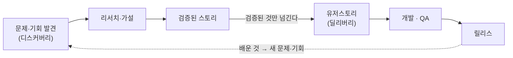
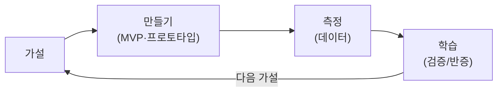
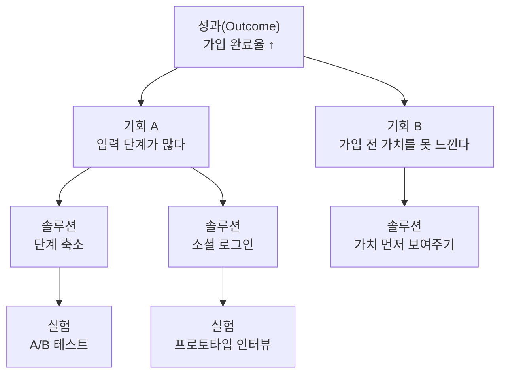
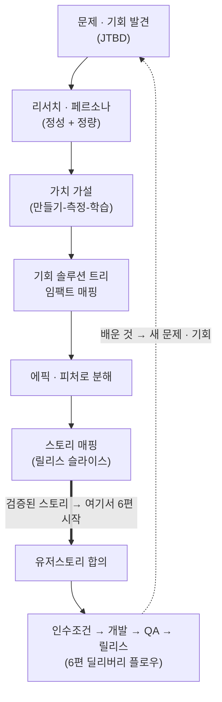

## 서론

[이전 글](/blog/agile-guide-6)에서 유저스토리에서 릴리스까지 딜리버리 플로우를 한 바퀴 걸었다. 그 흐름의 출발점은 <strong>유저스토리 합의</strong>였다.

그런데 막상 따라 해 보면 더 앞에서 막힌다. "그 유저스토리는 누가, 무얼 보고 쓰지?" 스토리는 하늘에서 떨어지지 않는다. 그 앞에 <strong>무엇을 만들 가치가 있는지 찾아내는 단계</strong>가 있고, 유저스토리는 그 단계의 산출물이다. 이 앞단을 건너뛰면, 잘 만들었는데 아무도 안 쓰는 제품이 나온다.

7편은 6편의 바로 앞 구간을 다룬다. 문제 발견에서 시작해 리서치·가설·기회를 거쳐 유저스토리가 만들어지기까지다. 6편이 "그것을 제대로 만든다(딜리버리)"였다면, 7편은 "무엇을 만들 가치가 있나(디스커버리)"다. 이 둘을 합친 그림이 <strong>듀얼 트랙 애자일</strong>이고, 그것으로 시리즈를 닫는다.

대상 독자는 6편을 읽고 "그래서 그 유저스토리는 어디서 오지"가 막힌 사람이다. 기획자·PO만의 일이 아니다. 좋은 스토리를 받고 싶은 개발자도 이 앞단이 어떻게 굴러가는지 알아야 한다.

- [1편 — 애자일은 왜 등장했나 — 선언문 · 4가치 · 12원칙](/blog/agile-guide-1)
- [2편 — Scrum — 경험적 프로세스 제어와 3-5-3](/blog/agile-guide-2)
- [3편 — Kanban · Lean · 흐름(Flow)](/blog/agile-guide-3)
- [4편 — 실천과 측정 — XP부터 벨로시티 · DORA까지](/blog/agile-guide-4)
- [5편 — 스케일링과 가짜 애자일](/blog/agile-guide-5)
- [6편 — 실전: 유저스토리에서 릴리스까지](/blog/agile-guide-6)
- <strong>7편 — 디스커버리: 유저스토리는 어디서 오는가 (이 글)</strong>

---

## TL;DR

- <strong>유저스토리는 디스커버리의 산출물이다</strong> — 하늘에서 떨어지지 않는다. 문제 발견·리서치·가설·기회를 거쳐 비로소 "쓸 만한 스토리"가 나온다.
- <strong>솔루션이 아니라 문제부터</strong> — "소셜 로그인 버튼 추가"는 솔루션이고, "가입을 중도 포기한다"가 문제다. 문제를 건너뛰면 기능만 쌓인다(고객이 실제로 해결하려는 과업 관점: 고객은 '일'을 해결하려 제품을 고용한다).
- <strong>우리가 아는 건 가설이지 사실이 아니다</strong> — 정성(인터뷰)과 정량(데이터)으로 검증한다. Lean Startup의 만들기-측정-학습 루프가 디스커버리의 엔진이다.
- <strong>큰 덩어리는 한 번에 다 쪼개지 않는다</strong> — 테마·이니셔티브 → 에픽 → 피처 → 스토리로, 곧 할 것만 잘게, 먼 것은 덩어리로 둔다(점진적 구체화).
- <strong>스토리 매핑이 디스커버리와 딜리버리를 잇는 다리다</strong> — 가로축은 사용자 여정, 세로축은 릴리스 슬라이스. 첫 슬라이스가 곧 6편의 최소 기능 제품이다.
- <strong>디스커버리와 딜리버리는 순차가 아니라 듀얼 트랙으로 동시에 돈다</strong> — 발견은 한 번 하고 끝나는 게 아니라, 릴리스에서 배운 것이 다음 문제로 돌아온다.

---

## 1. 디스커버리 vs 딜리버리 — 듀얼 트랙 애자일

<strong>디스커버리(discovery, 발견)</strong>는 "무엇을 만들 가치가 있나"를 찾아내는 단계다. <strong>딜리버리(delivery, 전달)</strong>는 "그렇게 정해진 것을 제대로 만들어 낸다"는 단계다. 6편이 다룬 유저스토리→릴리스 플로우가 통째로 딜리버리였고, 7편은 그 앞의 디스커버리다.

둘을 한 문장으로 가르면 이렇다 — <strong>딜리버리는 "제대로 만드는 것(build the thing right)", 디스커버리는 "만들 가치가 있는 걸 고르는 것(build the right thing)"</strong>이다. 둘 다 필요하다. 디스커버리 없이 딜리버리만 잘하면, 흠 없이 만들었지만 아무도 원하지 않는 제품이 나온다.

### 1.1 빌드 트랩 — 잘 만드는 것과 옳은 걸 만드는 것

디스커버리를 건너뛰면 팀은 <strong>빌드 트랩(build trap)</strong>에 빠진다. 빌드 트랩은 "기능을 많이·빨리 출시하는 것" 자체를 성공으로 착각하는 상태다(마티 케이건·멜리사 페리). 속도와 산출물(output)은 늘지만, 정작 사용자 가치나 비즈니스 성과(outcome)는 그대로다.

탈출구는 단순하다. 출시한 기능 수가 아니라 <strong>그 기능이 만든 성과</strong>로 성공을 재정의하는 것이다. 그러려면 만들기 전에 "이게 어떤 문제를, 누구를 위해 푸는가"를 먼저 확인해야 한다 — 그게 디스커버리다.

### 1.2 듀얼 트랙 — 두 트랙은 동시에 돈다

흔한 오해는 "디스커버리를 다 끝내고 나서 딜리버리를 시작한다"는 순차 모델이다. 그건 결국 폭포수다(1편). 실제로는 두 트랙이 <strong>동시에</strong> 돈다. 이것이 <strong>듀얼 트랙 애자일(dual-track agile)</strong>이다(제프 패튼·마티 케이건).



| | 디스커버리 트랙 | 딜리버리 트랙 |
|---|---|---|
| 질문 | 무엇을 만들 가치가 있나 | 그걸 어떻게 제대로 만드나 |
| 다루는 것 | 문제·가설·기회·실험 | 유저스토리·코드·테스트·릴리스 |
| 끝나는가 | 안 끝남(계속 다음을 탐색) | 스토리 단위로 완료 |
| 6편/7편 | 7편(이 글) | 6편 |

핵심은 두 트랙을 잇는 점선이다. 릴리스에서 배운 것이 다음 문제·기회로 돌아오고, 디스커버리는 그걸 받아 다음에 만들 것을 또 탐색한다. 이건 5편의 <strong>검사-적응 학습 루프</strong>가 발견 차원에서 한 번 더 도는 모습이다. 디스커버리는 불확실성을 인정하고(1편) 그걸 줄여 가는 과정이다.

---

## 2. 문제부터 — 솔루션으로 점프하지 않기

디스커버리의 첫 규칙은 <strong>문제를 솔루션보다 먼저 둔다</strong>는 것이다. 실무에서 가장 흔한 실수가 이 순서를 뒤집는 것이다.

```text
솔루션 점프:  "가입 화면에 소셜 로그인 버튼을 추가하자."
문제부터:    "사용자가 가입을 중도에 포기한다. 왜?"
```

소셜 로그인은 <strong>솔루션</strong>이지 문제가 아니다. 진짜 문제("가입 포기")를 먼저 정의하면, 솔루션은 소셜 로그인 말고도 여럿이다 — 입력 단계 축소, 게스트 결제, 가치 먼저 보여주기. 솔루션부터 정해 버리면 이 선택지들이 통째로 사라진다.

### 2.1 문제 진술 — 한 문장으로 못 박기

그래서 디스커버리는 <strong>문제 진술(problem statement)</strong>로 시작한다. 문제 진술은 "누가, 어떤 상황에서, 무엇이 안 돼서, 그래서 어떤 손해를 보는가"를 한두 문장으로 적은 것이다.

```text
신규 사용자가 가입 과정에서 입력 항목이 많아 중도 이탈하고,
그 결과 첫날 활성 사용자의 40%를 잃는다.
```

여기엔 아직 "어떻게"가 없다. 일부러 그렇다. 어떻게는 4절(기회·솔루션)에서 정한다.

### 2.2 JTBD — 고객은 '일'을 해결하려 제품을 고용한다

문제를 사용자 관점으로 더 밀고 가는 렌즈가 <strong>JTBD(Jobs to be Done, 해결해야 할 일)</strong>다. JTBD의 핵심 명제는 이렇다 — <strong>고객은 제품을 사는 게 아니라, 해결하려는 '일(job)'에 그 제품을 고용한다.</strong>

클레이튼 크리스텐슨의 유명한 예시가 밀크셰이크다. 사람들은 "밀크셰이크"를 사는 게 아니라, "출근길 지루한 운전을 견디게 해 줄, 한 손으로 오래 먹을 무언가"라는 일에 밀크셰이크를 고용한다. 경쟁자는 다른 밀크셰이크가 아니라 바나나·도넛·커피다.

이 렌즈가 강력한 이유는 솔루션의 함정을 벗겨내기 때문이다. "더 맛있는 밀크셰이크"(솔루션)가 아니라 "지루한 운전을 어떻게 견디게 하나"(일)를 묻게 만든다. 1편 1가치(고객 협력 > 계약 협상)가 여기서 작동한다 — 고객이 진짜 하려는 일을 먼저 이해한다.

> <strong>주의</strong>: 문제 진술과 JTBD는 "사용자가 원한다고 말한 것"을 그대로 받아 적는 게 아니다. 사용자는 종종 솔루션("버튼 달아 주세요")으로 말한다. 그 뒤의 일·문제를 캐는 게 디스커버리의 일이다("그 버튼으로 무엇을 하려 하셨나요?").

---

## 3. 누구를 위해 — 사용자·페르소나·리서치

문제를 정의했으면 다음 질문은 "누구의 문제인가"다. 모두를 위한 제품은 누구를 위한 것도 아니게 되기 쉽다.

### 3.1 페르소나 — 대표 사용자를 구체화

<strong>페르소나(persona)</strong>는 대표 사용자를 구체적인 가상 인물로 묘사한 것이다. "20–40대 직장인" 같은 추상적 세그먼트가 아니라, 이름·목표·맥락·불편을 가진 한 사람으로 그린다. 팀이 "그 기능, 지수가 진짜 쓸까?"처럼 같은 사람을 떠올리며 판단하게 만드는 도구다.

### 3.2 정성과 정량 — 두 눈으로 본다

페르소나도 가설이다. 검증하려면 리서치가 필요하고, 리서치는 두 축으로 나뉜다.

| | 정성 리서치 | 정량 리서치 |
|---|---|---|
| 답하는 질문 | 왜? 어떤 맥락에서? | 얼마나? 몇 %가? |
| 방법 | 사용자 인터뷰·관찰·섀도잉 | 애널리틱스·퍼널·A/B 데이터 |
| 강점 | 동기·맥락을 깊게 | 규모·경향을 객관적으로 |
| 약점 | 표본 작음, 일반화 위험 | "왜"를 설명 못 함 |

둘은 경쟁이 아니라 보완이다. 정량이 <strong>어디서</strong> 문제가 나는지(가입 3단계에서 40% 이탈) 짚고, 정성이 <strong>왜</strong> 그런지(주소 입력이 귀찮음) 설명한다. 한쪽만 보면 반쪽짜리 결론이 나온다.

핵심은 단순하다 — <strong>우리가 아는 건 가설이지 사실이 아니다.</strong> 회의실 추측을 사실로 확정해 버리는 순간 디스커버리는 죽는다. 1편의 정신(현장의 실제 사용자 > 회의실 문서)이 여기서 그대로 작동한다.

---

## 4. 무엇을 만들 가치가 있나 — 가치 가설과 기회

문제와 사용자를 잡았으면, 이제 "그래서 무엇을 만들 가치가 있나"를 판단한다. 여기서도 솔루션으로 바로 점프하지 않는다.

### 4.1 가치 가설과 만들기-측정-학습

만들 것을 정할 때 그건 확신이 아니라 <strong>가치 가설(value hypothesis)</strong>이다 — "이걸 만들면 이 사용자의 이 문제가 풀려 이 성과가 날 것이다"라는 검증 대상 명제다. 가설이므로 검증해야 하고, 그 엔진이 <strong>린 스타트업(Lean Startup)</strong>의 만들기-측정-학습(Build-Measure-Learn) 루프다(에릭 리스).



이 루프는 5편의 검사-적응 루프와 같은 모양이다. 다른 점은 도는 대상이 "이미 정해진 제품의 품질"이 아니라 "무엇을 만들지에 대한 가설"이라는 것이다. 가장 싸게 가설을 검증할 최소한이 6편에서 본 <strong>MVP</strong>이고, 때로는 코드 한 줄 없이 랜딩 페이지나 프로토타입으로도 검증한다.

### 4.2 임팩트 매핑 — 목표에서 산출물까지

가설을 비즈니스 목표와 잇는 도구가 <strong>임팩트 매핑(impact mapping)</strong>이다(고이코 아지치). 네 단계 질문으로 목표에서 산출물까지 한 트리로 잇는다.

| 단계 | 질문 | 예시 |
|---|---|---|
| Why(왜) | 어떤 목표인가 | 첫날 활성 사용자 유지율 +10% |
| Who(누가) | 누가 그 목표에 영향을 주나 | 신규 가입자, 추천인 |
| How(어떻게) | 그들의 행동을 어떻게 바꾸나 | 가입을 더 빨리 끝낸다 |
| What(무엇을) | 그러려면 무엇을 만드나 | 단계 축소, 소셜 로그인 |

임팩트 매핑의 가치는 <strong>What(산출물)이 맨 끝에 온다</strong>는 데 있다. 기능은 목표(Why)에서 거꾸로 도출되지, 기능부터 정하고 목표를 붙이는 게 아니다. 빌드 트랩(1.1절)의 반대 방향이다.

### 4.3 기회 솔루션 트리 — 하나의 성과, 여러 기회, 여러 솔루션

같은 문제를 더 탐색적으로 푸는 도구가 <strong>기회 솔루션 트리(Opportunity Solution Tree)</strong>다(테레사 토레스). 하나의 성과(outcome) 아래 여러 기회(사용자 니즈·불편)를, 각 기회 아래 여러 솔루션을, 각 솔루션 아래 검증 실험을 단다.



이 트리가 막아 주는 게 바로 솔루션 점프(2절)다. 하나의 솔루션에 매몰되지 않고, "이 성과를 낼 기회가 여럿이고, 각 기회에 솔루션이 여럿"임을 한눈에 보게 한다. 비교 후 가장 가치 대비 비용이 좋은 가지를 골라 실험한다.

---

## 5. 큰 덩어리를 쪼갠다 — 테마 · 에픽 · 피처 · 스토리

검증된 기회·솔루션은 아직 유저스토리보다 크다. 이걸 스토리 크기까지 단계적으로 쪼갠다. 흔히 쓰는 계층은 이렇다.

| 단위 | 크기 감각 | 예시 |
|---|---|---|
| 테마 / 이니셔티브 | 분기–반기 목표 | "신규 사용자 온보딩 개선" |
| 에픽(epic) | 여러 스프린트 | "가입 플로우 단축" |
| 피처(feature) | 한두 스프린트 | "소셜 로그인" |
| 유저스토리 | 한 스프린트 이하 | "사용자로서 구글로 로그인하고 싶다" |

<strong>에픽</strong>은 한 스프린트에 다 못 끝낼 만큼 큰 스토리 묶음이다. 너무 커서 INVEST의 Small(작은)·Estimable(추정 가능)을 만족 못 하므로, 작업에 들어가기 전 더 작은 스토리로 쪼갠다. 이 쪼개는 지점이 바로 6편의 유저스토리로 내려오는 입구다.

### 5.1 점진적 구체화 — 한 번에 다 쪼개지 않는다

여기서 함정은 "위에서부터 전부 스토리로 잘게 쪼개 놓고 시작"하는 것이다. 그건 폭포수식 백로그다 — 먼 미래의 스토리까지 미리 상세화해 봐야, 그 사이 배운 것 때문에 대부분 다시 쓰게 된다.

대신 <strong>점진적 구체화(progressive refinement)</strong>를 쓴다. 곧 할 것(다음 한두 스프린트)만 스토리로 잘게 다듬고, 먼 것은 에픽·테마 덩어리로 굵게 둔다. 백로그를 정제(refinement)하는 일은 한 번이 아니라 계속이며, 이는 2편의 백로그·정제 활동과 그대로 맞물린다.

> <strong>핵심</strong>: 백로그는 "처음에 다 채워 동결하는 명세"가 아니라, 위는 굵고 아래(가까운 것)는 잘게 다듬어진 <strong>살아있는 목록</strong>이다. 6편의 리빙 정책 문서와 같은 정신이다 — 확정하되 동결하지 않는다.

---

## 6. 스토리 매핑 — 디스커버리에서 딜리버리로 건너가는 다리

쪼갠 스토리를 평평한 리스트로 쌓으면, "이것들을 어떤 순서로, 어디까지 묶어 릴리스하지"가 안 보인다. 이걸 해결하는 도구가 <strong>스토리 매핑(story mapping)</strong>이다(제프 패튼).

스토리 맵은 스토리를 2차원으로 배치한다. <strong>가로축은 사용자 여정</strong>(사용자가 하는 활동의 순서)이고, <strong>세로축은 우선순위·릴리스 슬라이스</strong>다.


위 가로줄이 <strong>백본(backbone)</strong>, 즉 사용자 여정의 큰 활동들이다. 각 활동 아래에 그 활동을 이루는 스토리를 우선순위순으로 세로로 쌓고, 가로로 한 줄을 그어 "이번 릴리스에 낼 만큼"을 슬라이스한다.

| 릴리스 슬라이스 | 상품 탐색 | 장바구니 | 결제 | 배송 추적 |
|---|---|---|---|---|
| MVP (슬라이스 1) | 키워드 검색 | 담기 / 빼기 | 카드 결제 | 배송 상태 조회 |
| 슬라이스 2 | 필터 · 추천 | 위시리스트 | 간편결제 | 푸시 알림 |
| 나중 (Won't yet) | 개인화 추천 | 장바구니 공유 | 포인트 결제 | 반품 신청 |

여기서 6편과 직접 연결된다. <strong>맨 윗줄(MVP 슬라이스)이 곧 6편의 MVP이고, 그 안의 칸 하나하나가 6편이 출발점으로 삼은 유저스토리</strong>다. 어떤 스토리를 Must로 묶어 먼저 낼지(6편의 MoSCoW·MVP)가, 스토리 맵에서는 가로 슬라이스 한 줄을 긋는 일로 시각화된다.

스토리 맵이 평평한 백로그보다 나은 이유는 둘이다. 첫째, 사용자 여정 맥락이 살아 있어 "이 슬라이스로 사용자가 끝까지 한 바퀴 돌 수 있나"를 한눈에 본다(워킹 스켈레톤). 둘째, 릴리스 슬라이싱이 시각적이라 "무엇을 먼저, 무엇을 나중에"가 줄 하나로 드러난다.

> <strong>참고</strong>: 스토리 맵의 첫 슬라이스는 "가장 가치 있는 최소한"이지 "각 기능의 반쪽"이 아니다. 세로로 얕더라도 가로로는 여정 끝까지 닿아야(검색→결제→배송까지) 사용자가 실제로 쓸 수 있는 증분이 된다 — 6편의 "좁게, 그러나 제대로"와 같다.

---

## 7. 디스커버리 한 바퀴 — 그리고 6편으로의 연결

이제 디스커버리 전체를 한 흐름으로 잇고, 그것이 6편 딜리버리로 어떻게 넘어가는지 본다.



이 그림의 두 가지가 핵심이다. 첫째, 굵은 화살표가 <strong>디스커버리에서 딜리버리로 넘어가는 핸드오프</strong>다 — 스토리 맵의 검증된 슬라이스가 6편의 "유저스토리 합의" 박스로 들어간다. 둘째, 점선이 릴리스에서 배운 것을 다시 문제·기회로 돌려보낸다. 두 트랙은 이렇게 맞물려 끝없이 돈다(1.2절 듀얼 트랙).

각 디스커버리 단계가 시리즈의 어느 개념과 맞닿는지 매핑하면 이렇다.

| 디스커버리 단계 | 하는 일 | 연결되는 편 |
|---|---|---|
| 문제 · JTBD | 솔루션 전에 문제·일을 정의 | 1편 가치(왜 · 고객 협력) |
| 리서치 · 페르소나 | 정성+정량으로 가설 검증 | 1편 현장 우선 · 5편 학습 |
| 가치 가설 · 기회 | 만들기-측정-학습, 기회 트리 | 5편 검사-적응 루프 |
| 에픽 · 피처 분해 | 큰 덩어리 → 스토리, 점진적 구체화 | 2편 백로그 · 1편 단순성 |
| 스토리 매핑 | 사용자 여정 + 릴리스 슬라이스 | 6편 MVP · MoSCoW |
| 핸드오프 | 검증된 스토리 → 딜리버리 | 6편 전체 |

매핑이 말해 주는 건 6편과 같은 결이다. <strong>디스커버리도 새로운 무언가가 아니라, 1편의 가치(왜·누구)와 5편의 학습 루프가 "만들 것을 고르는" 차원에서 작동하는 모습이다.</strong> 6편이 그 개념들을 "만드는" 차원에서 돌렸다면, 7편은 같은 개념들을 "고르는" 차원에서 한 바퀴 돌린 것이다.

---

## 정리

7편의 핵심을 한 줄씩 정리하면 다음과 같다.

- <strong>유저스토리는 디스커버리의 산출물이다</strong> — 하늘에서 안 떨어진다. 문제→리서치→가설→기회→분해를 거쳐 비로소 만들어진다.
- <strong>솔루션이 아니라 문제부터</strong> — JTBD로 "고객이 진짜 하려는 일"을 잡으면, 솔루션 점프와 빌드 트랩을 피한다.
- <strong>아는 건 가설이지 사실이 아니다</strong> — 정성·정량 리서치로 검증하고, 만들기-측정-학습 루프로 가설을 돌린다.
- <strong>큰 덩어리는 점진적으로 쪼갠다</strong> — 테마·에픽·피처·스토리, 곧 할 것만 잘게. 백로그는 동결이 아니라 살아있는 목록이다.
- <strong>스토리 매핑이 두 트랙을 잇는 다리</strong> — 가로는 여정, 세로는 릴리스 슬라이스. 첫 슬라이스가 6편의 MVP다.
- <strong>디스커버리와 딜리버리는 듀얼 트랙으로 동시에 돈다</strong> — 릴리스에서 배운 것이 다음 문제로 돌아오는, 5편 학습 루프의 발견 버전이다.

이것으로 <strong>애자일 제대로 알기</strong> 시리즈를 진짜로 닫는다. 1편의 가치에서 출발해 2–3편의 프로세스, 4편의 실천과 측정, 5편의 스케일링·가짜 애자일, 6편의 딜리버리 플로우를 거쳐, 7편에서 그 모든 흐름의 출발점인 디스커버리까지 채웠다. 6편이 "유저스토리에서 릴리스까지"였다면 7편은 "문제에서 유저스토리까지"이고, 둘을 합치면 문제에서 릴리스까지 한 바퀴가 완성된다. 남은 일은 하나다 — 당신의 팀에서 이 두 트랙이 지금 같이 돌고 있는지, 혹시 딜리버리만 바쁘게 돌고 디스커버리는 멈춰 있지 않은지 들여다보는 것.

---

## 부록

### A. 용어 정리

| 용어 | 한 줄 정의 |
|---|---|
| 디스커버리(discovery) | "무엇을 만들 가치가 있나"를 찾아내는 단계 — 문제·가설·기회·실험 |
| 딜리버리(delivery) | 정해진 것을 "제대로 만들어 내는" 단계 — 스토리·코드·테스트·릴리스(6편) |
| 듀얼 트랙 애자일 | 디스커버리와 딜리버리 두 트랙을 순차가 아니라 동시에 돌리는 방식 |
| 빌드 트랩(build trap) | 산출물(기능 수·출시 속도)을 성과로 착각하는 상태 |
| 문제 진술(problem statement) | 누가·어떤 상황에서·무엇이 안 돼서·어떤 손해를 보는가를 한두 문장으로 적은 것 |
| JTBD(Jobs to be Done) | 고객은 제품을 사는 게 아니라 해결하려는 '일'에 제품을 고용한다는 렌즈 |
| 페르소나(persona) | 대표 사용자를 이름·목표·맥락을 가진 구체적 가상 인물로 묘사한 것 |
| 정성 리서치 | 인터뷰·관찰로 "왜·어떤 맥락"을 깊게 보는 리서치 |
| 정량 리서치 | 애널리틱스·퍼널·A/B로 "얼마나·몇 %"를 객관적으로 보는 리서치 |
| 가치 가설(value hypothesis) | "이걸 만들면 이 문제가 풀려 이 성과가 날 것"이라는 검증 대상 명제 |
| 린 스타트업 / 만들기-측정-학습 | 가설을 최소로 만들어(MVP) 측정·학습으로 검증하는 루프(에릭 리스) |
| 임팩트 매핑 | Why→Who→How→What으로 목표에서 산출물까지 잇는 트리(고이코 아지치) |
| 기회 솔루션 트리 | 성과→기회→솔루션→실험으로 솔루션을 탐색하는 트리(테레사 토레스) |
| 테마 / 이니셔티브 | 분기–반기 단위의 큰 목표 묶음 |
| 에픽(epic) | 한 스프린트에 못 끝낼 만큼 큰 스토리 묶음 |
| 피처(feature) | 에픽보다 작고 스토리보다 큰, 한두 스프린트 단위 기능 |
| 스토리 매핑 | 가로=사용자 여정, 세로=릴리스 슬라이스로 스토리를 2차원 배치(제프 패튼) |
| 백본(backbone) | 스토리 맵 가로축의 큰 사용자 활동 줄 |
| 워킹 스켈레톤 | 여정 끝까지 얇게 한 바퀴 도는 최소 동작 슬라이스 |
| 점진적 구체화 | 곧 할 것만 잘게, 먼 것은 굵게 두고 계속 정제하는 백로그 운영 |
| INVEST | 좋은 스토리의 조건 — Independent·Negotiable·Valuable·Estimable·Small·Testable(6편) |
| MVP(Minimum Viable Product) | 가장 작지만 가치를 주고 배움을 얻는 최소 기능 제품(6편) |
| MoSCoW | 우선순위 분류 — Must·Should·Could·Won't(이번엔 안 함)(6편) |

### B. 외부 참조

- [Jeff Patton, User Story Mapping](https://www.jpattonassociates.com/the-new-backlog/) — 스토리 매핑의 출처
- [Teresa Torres, Continuous Discovery Habits](https://www.producttalk.org/opportunity-solution-tree/) — 기회 솔루션 트리
- [Marty Cagan, Inspired / SVPG](https://www.svpg.com/) — 제품 디스커버리·듀얼 트랙
- [Gojko Adzic, Impact Mapping](https://www.impactmapping.org/) — 임팩트 매핑
- [Eric Ries, The Lean Startup](http://theleanstartup.com/) — 만들기-측정-학습, MVP
- [Clayton Christensen, Competing Against Luck](https://claytonchristensen.com/books/competing-against-luck/) — JTBD와 밀크셰이크 사례
