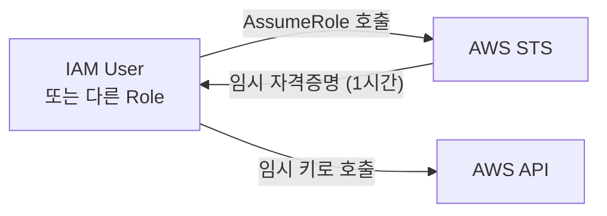
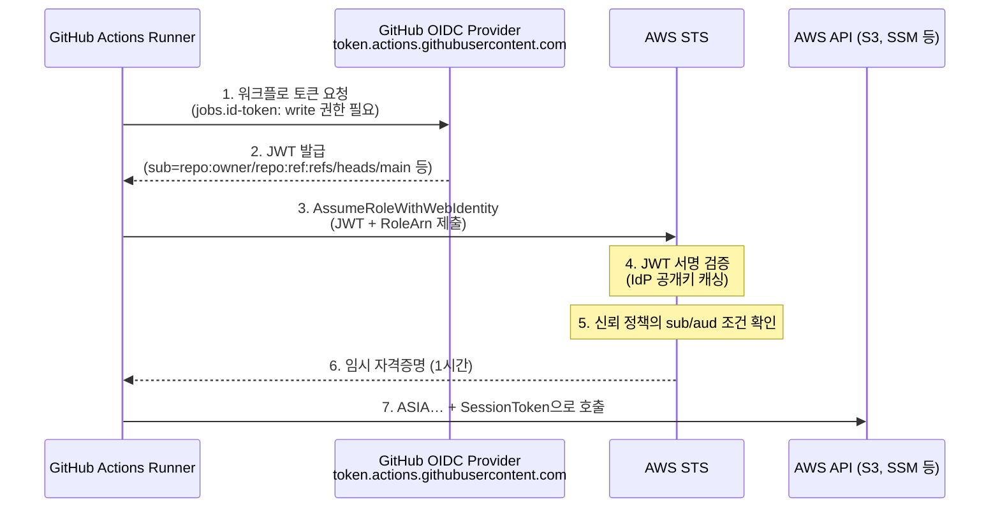
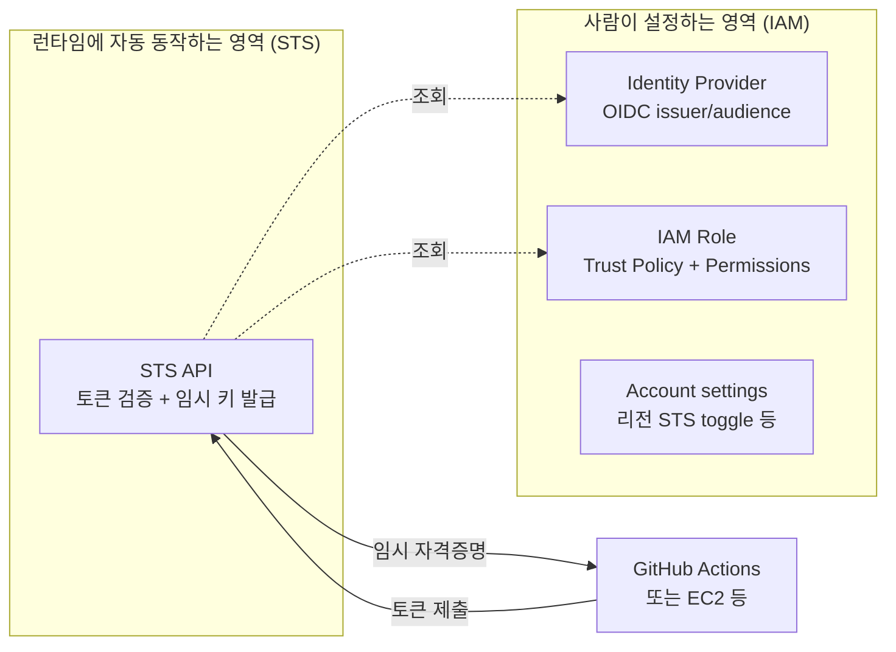
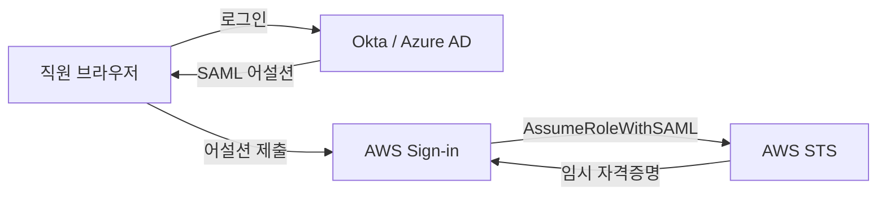
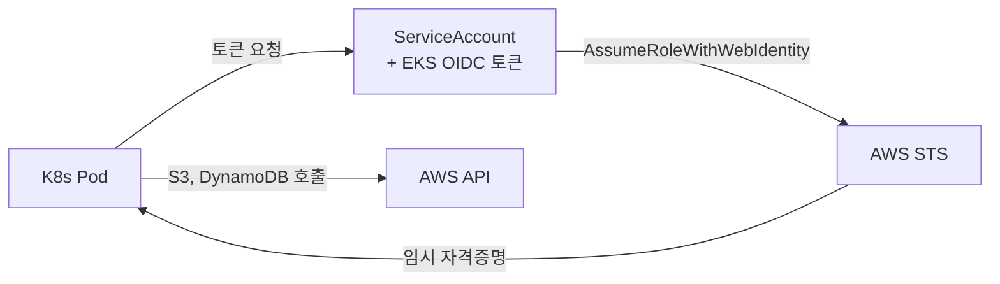

## 서론

[AWS Private EC2 운영 가이드 4편](/blog/aws-private-ec2-guide-4)에서 OIDC 페더레이션이 등장한다. GitHub Actions에서 AWS Access Key를 영원히 지우는 패턴이다. 따라 하면 동작하지만, 그 안에서 일어나는 일을 정확히 그릴 수 있는 사람은 의외로 적다.

가장 흔한 질문 네 개:

- <strong>OIDC 페더레이션이 정확히 뭐고, "페더레이션"이라는 단어는 왜 붙는가?</strong>
- <strong>STS는 왜 콘솔에 단독 페이지가 없는가? 어디서 설정하는가?</strong>
- <strong>신뢰 정책의 `sub` 조건은 왜 그렇게 강조되는가?</strong>
- <strong>GitHub Actions 외에 페더레이션이 등장하는 곳은 어디인가? (SAML, IAM Identity Center, EKS IRSA, Cognito…)</strong>

이 글은 그 네 질문을 한 번에 정리한다. 4편이 "이 패턴을 어떻게 적용하는가"였다면, 이 글은 <strong>"그 밑에서 어떤 부품들이 어떻게 맞물려 있는가"</strong>다. 다 읽고 나면 4편뿐 아니라 EKS·크로스 어카운트·회사 SSO에서도 같은 멘탈 모델로 진단이 가능해진다.

이 글의 대상은 <strong>AWS를 좀 써봤지만 IAM·STS·OIDC를 토대부터 이해해본 적 없는 주니어</strong>다. AWS Private EC2 시리즈를 안 봤어도 무관하지만, 4편의 OIDC 절을 함께 두면 추상과 구현을 동시에 잡기 좋다.

---

## TL;DR

- <strong>AWS의 모든 자격증명 흐름은 결국 STS로 수렴한다.</strong> STS = Security Token Service, 임시 자격증명을 발급하는 무상태 API. EC2 Role, OIDC, SAML, IAM Identity Center 모두 STS 호출이 끝에 있다.
- <strong>장기 키(`AKIA…`) → 임시 키(`ASIA…`) + SessionToken</strong>으로 옮기는 게 자격증명 보안의 큰 방향이다. 임시 키는 시간이 지나면 알아서 죽고, 폭발 반경이 자연 감소한다.
- <strong>"페더레이션"은 외부 신원의 검증 결과를 AWS가 신뢰해서 임시 자격증명을 내주는 모델</strong>이다. OIDC, SAML, Cognito가 모두 이 패턴의 변종이다.
- <strong>STS 자체는 설정할 게 없다.</strong> 콘솔에 단독 페이지가 없는 게 정상. 우리가 "STS 설정"이라 부르는 작업은 모두 <strong>IAM 안의 Identity Provider, Role, 신뢰 정책</strong>이다.
- <strong>신뢰 정책의 `sub` 조건은 페더레이션의 자물쇠다.</strong> 누락하면 같은 Provider를 신뢰하는 모든 외부 신원이 Role을 가져갈 수 있다 — OIDC 사고의 1번 원인이다.

---

## 1. 자격증명의 진화 — 왜 페더레이션이 등장했나

### 1.1 시작점 — IAM User + 장기 Access Key

AWS 초창기 자격증명 모델은 단순했다. <strong>IAM User를 만들고, 그 User의 Access Key Pair를 발급받아 어플리케이션에 박는다.</strong> 키는 영원히 유효하고, 하나의 키 = 하나의 정체성이다.

```hcl
# 레거시 방식
resource "aws_iam_user" "ci"        { name = "github-ci" }
resource "aws_iam_access_key" "ci"  { user = aws_iam_user.ci.name }
# AccessKeyId / SecretAccessKey를 GitHub Secrets에 저장
```

이 모델은 익숙하지만 운영하면서 다음 네 가지 통점이 누적된다.

| 문제 | 구체적 모습 |
| --- | --- |
| <strong>무제한 유효기간</strong> | 키가 깃에 푸시되거나 캡처에 찍히면 회수 전까지 영구 침해 |
| <strong>공유의 어려움</strong> | 한 사람의 키가 여러 곳에 박혀 있으면 회전 시 모든 곳을 동시에 갱신해야 함 |
| <strong>추적의 한계</strong> | CloudTrail은 "어떤 IAM User가 호출했는가"까지만 보여줌 — 어느 워크플로/인스턴스/세션인지는 모름 |
| <strong>시간제 권한 부여 어려움</strong> | "평소엔 read-only, 배포 때만 write" 같은 패턴이 키 단위에서는 표현되지 않음 |

### 1.2 한 단계 진화 — IAM Role

AWS는 이 통점을 풀기 위해 <strong>IAM Role</strong>을 도입했다. Role은 <strong>"권한을 지닌 가면(persona)"</strong>이다 — 장기 키가 붙어 있지 않고, 누가(어느 Principal이) 일시적으로 쓸 수 있는지 신뢰 정책(Trust Policy)으로 정의한다.



핵심 변화 세 가지:

- <strong>장기 키 없이도</strong> Role을 빌려 쓸 수 있다 — EC2 인스턴스 프로파일이 대표 예시.
- <strong>권한이 시간 단위로 발급</strong>된다 — 1시간 후 자동 만료, 회전이 자동.
- <strong>호출 컨텍스트가 풍부</strong>해진다 — CloudTrail에 "누가 어떤 Role을 어떤 세션 이름으로 가져갔는지" 기록.

다만 Role도 한계가 있다. <strong>AssumeRole을 호출하려면 결국 누군가는 자격증명이 있어야</strong> 한다. EC2면 인스턴스 프로파일(IMDS), 로컬 머신이면 IAM User의 키. 즉 <strong>"AWS 안에서 시작점이 있는 흐름"</strong> 만 커버된다. AWS 바깥의 신원(예: GitHub Actions 워크플로, 회사 SSO 사용자, 모바일 앱 사용자)은 어떻게 Role을 가질까?

### 1.3 페더레이션 — AWS 바깥의 신원을 받아들이기

답은 <strong>외부 신원 발급자(Identity Provider, IdP)를 AWS가 신뢰</strong>하는 것이다. IdP가 "이 사용자/워크플로는 우리가 검증했다"는 서명된 증거를 발급하면, AWS는 그 증거를 받아 임시 자격증명을 내준다. 이 모델이 <strong>페더레이션(federation, 연합 인증)</strong>이다.

| 페더레이션 종류 | IdP 예시 | AWS API |
| --- | --- | --- |
| <strong>OIDC</strong> | GitHub Actions, GitLab, EKS, Auth0 | `AssumeRoleWithWebIdentity` |
| <strong>SAML 2.0</strong> | Okta, Azure AD, ADFS, Google Workspace | `AssumeRoleWithSAML` |
| <strong>Cognito Identity Pool</strong> | Cognito User Pool, 소셜 로그인 | `GetCredentialsForIdentity` |
| <strong>IAM Identity Center</strong> | AWS 관리 디렉토리 또는 외부 IdP | 콘솔/CLI 자동 |

이름은 다양해도 <strong>본질은 같다</strong>:

1. 외부 IdP가 사용자/워크플로의 신원을 검증한다.
2. 서명된 토큰(JWT, SAML 어설션 등)을 발급한다.
3. AWS STS가 그 토큰의 서명·조건을 검증한다.
4. STS가 임시 자격증명을 발급한다.

이 흐름이 <strong>2026년 AWS 자격증명 운영의 표준</strong>이다. 장기 키는 점점 안티패턴이 되어가고 있다.

---

## 2. STS — 임시 자격증명의 발급소

### 2.1 STS는 무엇이고 왜 보이지 않는가

<strong>STS(Security Token Service)</strong>는 AWS의 <strong>"임시 자격증명 발급 전용 API 서비스"</strong>다. 다른 모든 AWS 서비스가 자격증명을 검증할 때 그 발급의 끝에는 STS가 있다.

특징을 정리하면:

| 항목 | 내용 |
| --- | --- |
| 역할 | 임시 자격증명 발급 |
| 상태 | 무상태(stateless) — 발급 후 토큰을 보관하지 않음 |
| 엔드포인트 | `sts.amazonaws.com`(글로벌) 또는 `sts.<region>.amazonaws.com`(리전) |
| 만들 리소스 | <strong>없음</strong> |
| 콘솔 페이지 | <strong>없음</strong> (IAM 안의 일부 설정만) |
| 비용 | 호출 자체는 무료 |

다른 서비스가 "건물"이라면 STS는 <strong>"건물 안의 출입증 발급 창구"</strong>에 가깝다. 가서 패스를 받아 가는 곳일 뿐, 거기서 뭘 만들거나 보관할 일은 없다. 콘솔에서 "STS"를 검색해도 안 나오는 이유다.

### 2.2 발급 4가지 방식

STS API는 본질적으로 <strong>"누가 토큰을 받아 가는가"</strong>에 따라 네 개 액션으로 갈린다.

| API | 호출 주체 | 시나리오 |
| --- | --- | --- |
| `AssumeRole` | 다른 IAM User/Role | 크로스 어카운트, 권한 승격 |
| `AssumeRoleWithWebIdentity` | <strong>OIDC 토큰 보유자</strong> | <strong>GitHub Actions, EKS Pod</strong> |
| `AssumeRoleWithSAML` | SAML 어설션 보유자 | 회사 SSO에서 콘솔 로그인 |
| `GetSessionToken` | IAM User 본인 | MFA 강제, 자기 키를 임시 키로 변환 |

이 글에서 가장 자주 만나는 건 두 번째 — <strong>`AssumeRoleWithWebIdentity`</strong>. 4편의 GitHub Actions OIDC 흐름이 이걸 호출하는 코드다. EKS의 IRSA(서비스 어카운트 페더레이션)도 동일한 API를 쓴다.

### 2.3 임시 자격증명의 형태

발급되면 이런 모양이다.

```json
{
  "AccessKeyId": "ASIAXXXX...",
  "SecretAccessKey": "abc123...",
  "SessionToken": "FwoGZXIvYXdzE...",
  "Expiration": "2026-04-28T11:30:00Z"
}
```

장기 키와의 결정적 차이가 두 가지다.

- <strong>`SessionToken` 필드가 추가됨</strong> — AWS API에 호출 시 이 값까지 함께 보내야 검증된다. 만료 후에는 거부.
- <strong>Access Key prefix가 `ASIA…`</strong> — 장기 키는 `AKIA…`. 콘솔이나 로그에서 prefix만 봐도 임시인지 영구인지 한눈에 구분된다.

> <strong>핵심</strong>: 보안 관점에서 임시 자격증명의 핵심 가치는 <strong>"폭발 반경의 시간 의존 감소"</strong>다. 장기 키는 사고가 발견될 때까지 침해가 누적되지만, 임시 키는 그냥 시간이 지나면 알아서 죽는다. 운영 부담을 시간이라는 자연 자원에 외주 주는 셈이다.

---

## 3. OIDC 페더레이션이 동작하는 원리

### 3.1 OIDC가 무엇인가

<strong>OIDC(OpenID Connect)</strong>는 OAuth 2.0 위에 얹힌 인증 표준이다. 핵심은 <strong>"신뢰할 수 있는 발급자가 서명한 짧은 JWT 토큰"</strong>을 만들어내는 부분이다.

JWT는 세 부분으로 나뉜다(`.`으로 구분):

```text
eyJhbGciOiJSUzI1NiIs...     ← Header (서명 알고리즘)
.eyJzdWIiOiJyZXBvOl...      ← Payload (sub, aud, exp 등 클레임)
.SflKxwRJSMeKKF2QT4f...     ← Signature (IdP의 비밀키로 서명)
```

AWS가 검증하는 건 두 가지다.

- <strong>Signature가 IdP의 공개키로 검증되는가</strong> — IdP가 진짜 발급한 토큰인지 확인.
- <strong>Payload의 `sub`, `aud` 클레임이 신뢰 정책 조건과 매치하는가</strong> — "내가 허용한 워크플로/레포가 맞는가" 확인.

### 3.2 GitHub Actions → AWS 흐름 분해



핵심 분기점은 <strong>5번</strong>이다. STS는 IAM Role의 신뢰 정책을 읽어, JWT 클레임이 조건과 일치하는지 검사한다. 일치하지 않으면 6번에서 거부.

### 3.3 신뢰 정책의 `sub`와 `aud`

신뢰 정책 예시:

```json
{
  "Version": "2012-10-17",
  "Statement": [{
    "Effect": "Allow",
    "Principal": {
      "Federated": "arn:aws:iam::123456789012:oidc-provider/token.actions.githubusercontent.com"
    },
    "Action": "sts:AssumeRoleWithWebIdentity",
    "Condition": {
      "StringEquals": {
        "token.actions.githubusercontent.com:aud": "sts.amazonaws.com"
      },
      "StringLike": {
        "token.actions.githubusercontent.com:sub": "repo:rhcwlq89/myrepo:ref:refs/heads/main"
      }
    }
  }]
}
```

조건의 두 핵심 키:

- <strong>`aud` (audience)</strong> — "이 토큰의 의도된 수신자가 누구인가". GitHub Actions가 AWS STS용 토큰을 만들 때 `aud=sts.amazonaws.com`을 박는다. 다른 시스템용 토큰을 가져와 AWS Role을 가정하는 것을 막는 1차 자물쇠.
- <strong>`sub` (subject)</strong> — "이 토큰을 받아 갈 자격이 누구인가". GitHub Actions의 `sub`는 `repo:<owner>/<repo>:ref:<ref>` 또는 `repo:<owner>/<repo>:environment:<env>` 형태. <strong>여기를 좁히지 않으면 같은 OIDC Provider를 신뢰하는 모든 GitHub 레포가 토큰을 받아 갈 수 있다.</strong>

### 3.4 가장 흔한 사고 — `sub` 누락

운영에서 1번으로 보는 사고는 이 패턴이다.

```json
"StringLike": {
  "token.actions.githubusercontent.com:sub": "repo:*"
}
```

또는 아예 `sub` 조건이 빠진 경우. 이러면 <strong>GitHub의 어떤 레포에서 실행된 워크플로든</strong> 이 OIDC Provider를 통해 Role을 가정할 수 있다. 누군가 자기 레포에서 `aud=sts.amazonaws.com` 토큰을 만들고 우리 Role ARN을 호출하면 우리 어카운트의 권한을 사용할 수 있게 된다.

올바른 패턴:

```json
"StringLike": {
  "token.actions.githubusercontent.com:sub": [
    "repo:rhcwlq89/myrepo:ref:refs/heads/main",
    "repo:rhcwlq89/myrepo:environment:prod"
  ]
}
```

레포·브랜치·환경까지 정확히 좁힌다. PR 빌드용 Role과 prod 배포용 Role을 분리하는 것까지가 한 세트.

> <strong>주의</strong>: `StringEquals` 대신 `StringLike`를 쓰는 건 environment 매칭에 와일드카드가 필요한 경우(`repo:owner/repo:environment:prod*` 등)에만 정당하다. 단순 매칭이라면 `StringEquals`가 안전하다 — 와일드카드 사고 가능성이 줄어든다.

---

## 4. STS는 어디서 설정하는가 — "보이지 않는 서비스"의 멘탈 모델

### 4.1 STS 자체는 설정할 게 없다

콘솔에서 "STS"를 검색하면 단독 페이지가 안 나온다. 정상이다. STS는 <strong>항상 켜져 있는 글로벌 API 서버</strong>일 뿐, 사람이 만질 리소스가 없다.

| 사람이 만지는 것 | 콘솔 위치 |
| --- | --- |
| OIDC Identity Provider 등록 | <strong>IAM → Identity providers</strong> |
| AssumeRole 받을 IAM Role 생성 | <strong>IAM → Roles → Create role → Web identity</strong> |
| `sub` 조건 신뢰 정책 | <strong>IAM → Roles → 해당 Role → Trust relationships</strong> |
| 권한 정책 부착 | <strong>IAM → Roles → 해당 Role → Permissions</strong> |
| 임시 자격증명 발급 | <strong>설정 없음 — 런타임에 자동</strong> |

즉 <strong>"OIDC 설정"이라 부르는 모든 작업은 IAM 안의 작업</strong>이다. STS 메뉴는 어디에도 없다.

### 4.2 그래도 STS와 직접 관련된 설정 — 세 곳

순수 STS 동작에 영향을 주는 설정은 정확히 세 곳에 있다.

<strong>① IAM → Account settings → Security Token Service</strong>

리전별 STS 엔드포인트 활성/비활성 토글. 기본은 모두 활성. 보안 강화 차원에서 안 쓰는 리전의 STS를 끄는 경우가 있다. 같은 화면에 <strong>글로벌 엔드포인트 토큰 호환성 v1/v2</strong> 설정도 있다 — 신규 어카운트는 v2(리전 한정 토큰)가 기본이다.

<strong>② IAM Role의 Maximum session duration</strong>

콘솔: IAM → Roles → 해당 Role → Edit. AssumeRole 시 발급되는 임시 자격증명의 최대 유효시간을 1~12시간 사이로 설정한다. 기본 1시간. CI/CD Role은 1시간, 운영자 수동 작업 Role은 4~8시간으로 두는 패턴이 흔하다.

<strong>③ Organizations SCP — STS 호출 자체 제한</strong>

여러 어카운트를 운영할 때 <strong>"이 OU의 어카운트는 외부 OIDC Provider로의 AssumeRole 금지"</strong> 같은 가드를 거는 곳. 단일 어카운트면 무관하다.

### 4.3 멘탈 모델 — 사람과 런타임의 분리



왼쪽이 우리가 콘솔/Terraform에서 만지는 영역, 오른쪽이 런타임에 알아서 도는 영역. <strong>STS는 오른쪽 박스 한 줄</strong>이다 — "콘솔에서 안 보인다"고 느낀 직관이 정확했던 셈이다.

---

## 5. OIDC 외 페더레이션 패턴들

같은 페더레이션 골격이 여러 맥락에서 변종으로 등장한다. 어느 자리에 STS와 IAM Role이 있는지 한 번 보면 다음에 마주쳤을 때 막히지 않는다.

### 5.1 SAML 2.0 — 회사 SSO에서 콘솔 로그인

Okta·Azure AD·Google Workspace 같은 기업 IdP에서 콘솔에 SSO로 로그인하는 흐름이다.



토큰 형식이 JWT가 아니라 <strong>XML 기반 SAML 어설션</strong>이라는 점만 다르고, 골격은 OIDC와 같다. AWS API도 `AssumeRoleWithSAML`로 분리된다.

### 5.2 IAM Identity Center (구 AWS SSO)

AWS가 직접 운영하는 SSO 솔루션. 내부적으로는 <strong>여러 어카운트의 IAM Role을 한 곳에서 매핑</strong>해주는 레이어다.

- 사용자는 한 번 로그인 후 어카운트·Role을 골라 사용
- 백엔드는 결국 STS의 `AssumeRole` 호출
- `aws sso login` CLI도 이 위에서 동작

조직이 어카운트 5개 이상으로 커지면 거의 필수가 된다. 기존 SAML보다 운영이 가벼운 게 장점.

### 5.3 EKS IRSA / Pod Identity

Kubernetes Pod이 AWS 서비스를 호출할 때 쓴다. <strong>EKS 클러스터 자체가 OIDC Provider 역할</strong>을 한다.



GitHub Actions가 <strong>워크플로 단위</strong>로 임시 키를 받았다면, IRSA는 <strong>Pod 단위</strong>로 받는다. Pod 사양에 ServiceAccount만 매핑하면 SDK가 자동으로 처리해준다. 노드 단위 IAM Role보다 권한 격리가 훨씬 정밀해진다.

### 5.4 Cognito Identity Pool

모바일/웹 앱에서 <strong>로그인 안 한 게스트 사용자나 소셜 로그인 사용자에게 임시 AWS 자격증명을 주는</strong> 패턴이다. S3 직접 업로드 같은 시나리오에 쓴다.

골격은 같지만 STS가 아니라 Cognito가 한 단계 매개한다는 점이 다르다.

| 패턴 | IdP | STS API |
| --- | --- | --- |
| OIDC | GitHub, EKS, Auth0 | `AssumeRoleWithWebIdentity` |
| SAML | Okta, Azure AD | `AssumeRoleWithSAML` |
| IAM Identity Center | AWS 자체 또는 외부 | 내부적으로 AssumeRole |
| EKS IRSA | EKS 클러스터 | `AssumeRoleWithWebIdentity` |
| Cognito Identity Pool | Cognito + 소셜 | `GetCredentialsForIdentity` |

다섯 가지 다른 맥락인데 <strong>"외부 신원 검증 → STS → 임시 키"</strong>라는 골격은 모두 같다. 이 패턴 하나를 머리에 박아두면 다섯 사례에 같은 진단 흐름이 적용된다.

---

## 6. 실전 점검 — 자주 막히는 지점

### 6.1 자격증명 흐름 디버깅 5단계

OIDC 또는 AssumeRole이 실패할 때 다음 순서로 본다.

| 단계 | 확인 | 명령/위치 |
| --- | --- | --- |
| 1 | 토큰이 발급되었는가 | GitHub Actions: `id-token: write` 권한, `actions/checkout` 후 |
| 2 | 토큰 클레임이 우리가 기대한 값인가 | 워크플로에서 토큰 디코드(jwt.io 등 — secret 노출 주의) |
| 3 | IAM Identity Provider가 등록되어 있나 | <strong>IAM → Identity providers</strong>에서 thumbprint 확인 |
| 4 | Role의 신뢰 정책 sub/aud가 맞나 | <strong>IAM → Roles → Trust relationships</strong> |
| 5 | Role의 권한 정책이 충분한가 | <strong>IAM Policy Simulator</strong>로 호출 액션 검증 |

가장 자주 막히는 건 4단계. 특히 GitHub Actions의 `sub`는 환경/브랜치에 따라 모양이 달라진다 — `pull_request` 이벤트는 `pull_request`로, `push`는 `ref:refs/heads/<branch>`로. 워크플로 트리거를 바꾸면 sub 형태도 바뀌니 신뢰 정책도 같이 손봐야 한다.

### 6.2 자주 보는 에러와 해석

| 에러 | 의미 | 1차 진단 |
| --- | --- | --- |
| `Not authorized to perform sts:AssumeRoleWithWebIdentity` | 신뢰 정책 sub/aud가 일치하지 않음 | sub 클레임을 디코드해서 패턴 비교 |
| `InvalidIdentityToken: ... incorrect token audience` | aud가 `sts.amazonaws.com`이 아님 | `configure-aws-credentials`의 audience 옵션 확인 |
| `ExpiredToken` | 임시 자격증명 1시간 초과 | 워크플로 step이 길면 step마다 재발급 |
| `AccessDenied: ... is not authorized to perform: ...` | Role 권한 정책 부족 | Permissions 정책 확인(Trust 정책이 아님) |

### 6.3 사람 관점에서 페더레이션 만져보기

직접 흐름을 끝까지 호출해보면 실감이 빠르다.

```bash
# 1. 현재 자격증명 확인 — 어떤 ARN인가, 임시(ASIA)인가 영구(AKIA)인가
aws sts get-caller-identity

# 2. 다른 Role로 가정 — 임시 자격증명 받기
aws sts assume-role \
  --role-arn arn:aws:iam::123456789012:role/ReadOnlyRole \
  --role-session-name my-session

# 3. 현재 어카운트의 등록된 OIDC Provider 목록
aws iam list-open-id-connect-providers

# 4. SSO 로그인 (IAM Identity Center)
aws sso login --profile my-profile
```

이 네 명령은 <strong>STS와 IAM이 어떻게 함께 동작하는지</strong> 손으로 확인하는 가장 빠른 길이다. 특히 1번은 평소 자격증명이 어디서 왔는지(인스턴스 프로파일? SSO? 장기 키?) 의심될 때 즉시 답을 준다.

---

## 정리

이 글에서 얻고 가야 할 것:

1. <strong>AWS의 모든 자격증명 흐름은 STS로 수렴한다.</strong> EC2 인스턴스 프로파일, IAM Role AssumeRole, OIDC, SAML, Cognito — 모두 끝에는 STS가 임시 키를 발급하는 단계가 있다.
2. <strong>장기 키 → 임시 키로의 이동이 자격증명 보안의 큰 방향이다.</strong> 임시 키는 시간이 지나면 알아서 죽고, 사고의 폭발 반경이 자연 감소한다.
3. <strong>페더레이션은 외부 신원 검증을 AWS가 신뢰하는 모델이다.</strong> OIDC, SAML, Cognito가 모두 이 패턴의 변종이고, 어떤 IdP·어떤 토큰 형식인가만 다를 뿐 골격은 같다.
4. <strong>STS는 설정할 게 없다.</strong> 콘솔에 단독 페이지가 없는 게 정상이고, 우리가 "STS 설정"이라 부르는 작업은 모두 IAM 안의 Identity Provider, Role, 신뢰 정책 작업이다.
5. <strong>신뢰 정책의 `sub`/`aud` 조건이 페더레이션의 자물쇠다.</strong> 누락하면 같은 Provider를 신뢰하는 외부 신원이 모두 Role을 가져갈 수 있다 — OIDC 사고의 1번 원인이다.
6. <strong>OIDC 외에도 SAML·IAM Identity Center·EKS IRSA·Cognito가 같은 골격을 쓴다.</strong> 한 패턴을 익혀두면 다섯 곳에서 재사용된다.

[AWS Private EC2 운영 가이드 4편](/blog/aws-private-ec2-guide-4)이 "이 패턴을 우리 환경에 적용하는 코드"였다면, 이 글은 그 밑에서 어떤 부품들이 어떻게 맞물려 있는지를 본 글이다. 다음에 EKS IRSA, 회사 SSO, 크로스 어카운트 AssumeRole에서 비슷한 화면을 만나도 같은 멘탈 모델로 진단할 수 있다.

---

## 부록

### A. 용어 정리

| 용어 | 정의 |
| --- | --- |
| <strong>IAM</strong> | Identity and Access Management — AWS의 신원·권한 관리 서비스 |
| <strong>STS</strong> | Security Token Service — 임시 자격증명 발급 API |
| <strong>IdP</strong> | Identity Provider — 외부 신원 발급자(GitHub, Okta 등) |
| <strong>JWT</strong> | JSON Web Token — OIDC가 사용하는 서명된 토큰 포맷 |
| <strong>OIDC</strong> | OpenID Connect — OAuth 2.0 위의 인증 프로토콜 |
| <strong>SAML</strong> | Security Assertion Markup Language — XML 기반 SSO 프로토콜 |
| <strong>Trust Policy</strong> | IAM Role을 누가 가정할 수 있는지 정의한 JSON 정책 |
| <strong>`sub` claim</strong> | 토큰의 주체 — "누구의 토큰인가" |
| <strong>`aud` claim</strong> | 토큰의 수신자 — "어디 쓰려고 만든 토큰인가" |
| <strong>IRSA</strong> | IAM Roles for Service Accounts — EKS Pod 단위 페더레이션 |
| <strong>AssumeRole</strong> | 다른 Role의 권한을 일시적으로 빌리는 STS API |

### B. 참고 자료

- AWS 문서 — [Temporary security credentials in IAM](https://docs.aws.amazon.com/IAM/latest/UserGuide/id_credentials_temp.html)
- AWS 문서 — [Creating OpenID Connect identity providers](https://docs.aws.amazon.com/IAM/latest/UserGuide/id_roles_providers_create_oidc.html)
- GitHub 문서 — [Configuring OpenID Connect in Amazon Web Services](https://docs.github.com/en/actions/deployment/security-hardening-your-deployments/configuring-openid-connect-in-amazon-web-services)
- AWS 블로그 — [IAM Roles for Service Accounts (IRSA)](https://aws.amazon.com/blogs/opensource/introducing-fine-grained-iam-roles-service-accounts/)

### C. 자매편

- [AWS Private EC2 운영 가이드 4편 — GitHub Actions OIDC 실전 적용](/blog/aws-private-ec2-guide-4)
