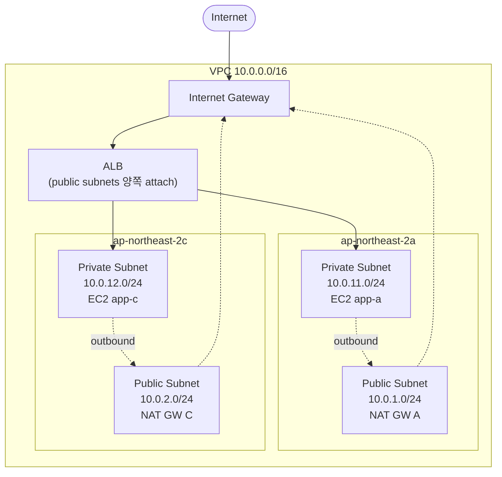
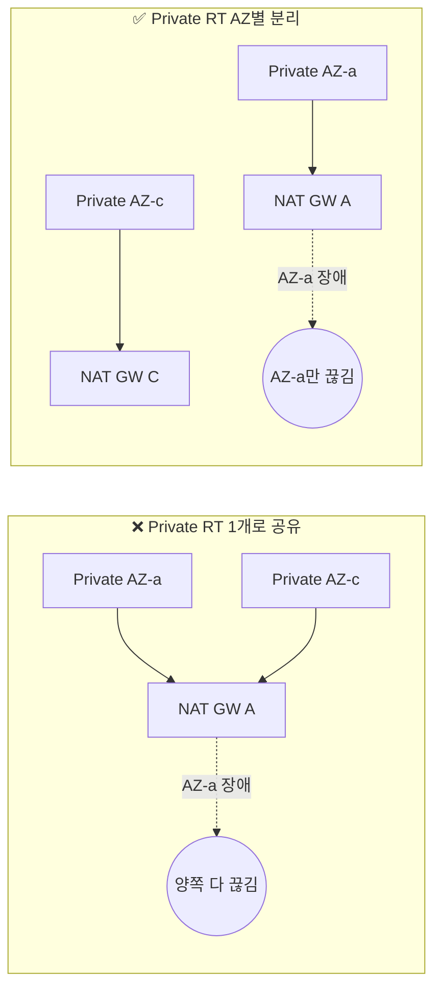
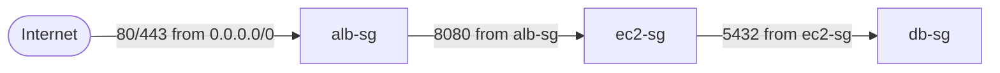

## 서론

[1편](/blog/aws-private-ec2-guide-1)에서 "왜 Private Subnet인가"를 납득했다면, 2편은 그 아키텍처를 <strong>실제로 띄우는 편</strong>이다. 읽고 끝나는 글이 아니라, 이 글의 코드를 그대로 복붙해서 `terraform apply`만 하면 1편의 그림이 AWS 콘솔에 그대로 뜬다.

구성 방침은 하나다 — <strong>단일 `main.tf`</strong>. 주니어에게 "파일 분리부터 하자"고 하면 변수가 어느 파일에 있는지 추적하느라 에너지가 샌다. 위에서 아래로 읽으면 의존 관계가 보이도록 하나의 파일에 주석 블록(`# ===== VPC =====` 식)으로 구역만 나눈다. 프로덕션용 모듈 분리는 마지막 절에서 짚는다.

- [1편 — 왜 Private Subnet인가?](/blog/aws-private-ec2-guide-1)
- <strong>2편 — Terraform으로 VPC 인프라 구성하기 (이 글)</strong>
- 3편 — SSM Session Manager로 Bastion 없이 접속하기
- 4편 — GitHub Actions + SSM/CodeDeploy CI/CD 파이프라인
- 5편 — 비용 분석과 최적화 전략

이 글의 대상은 <strong>Terraform은 `hello_world` 정도는 해봤지만 VPC 한 벌을 스스로 못 세워본 주니어</strong>다. 다 읽고 나면 "아 SG가 SG를 참조한다는 게 이런 거구나"와 "AZ마다 Route Table이 따로인 이유가 이거구나"가 남아야 한다.

---

## TL;DR

- <strong>설계 확정</strong>: `VPC 10.0.0.0/16` + `/24` 서브넷 4개(Public 2 + Private 2), 2AZ(`ap-northeast-2a`, `2c`), NAT Gateway AZ별 1개.
- <strong>핵심 패턴</strong>: SG가 <strong>IP가 아니라 다른 SG를 참조</strong>한다. `alb-sg` → `ec2-sg` → `db-sg`로 체인이 이어져야 실무 SG 설계다.
- <strong>Route Table은 AZ별로 분리</strong>해야 한다. 한 AZ의 NAT Gateway가 죽었을 때 다른 AZ 트래픽까지 말려드는 걸 막기 위해서다.
- <strong>NACL은 기본값 그대로 둔다</strong>. SG는 stateful(돌아오는 트래픽 자동 허용), NACL은 stateless라 실무 99%는 SG만으로 충분하다.
- <strong>단일 `main.tf`로 시작한다</strong>. 공식 `terraform-aws-modules/vpc/aws`는 학습 단계에서는 추상화가 과해서 오히려 방해 — 프로덕션으로 가면서 모듈화한다.

---

## 1. 설계 결정 한눈에 보기

본론 들어가기 전에 이 글에서 만들 리소스를 한 장으로 정리한다. 각 결정의 <strong>왜</strong>는 해당 섹션에서 다룬다.

| 항목 | 결정 | 근거 |
| --- | --- | --- |
| VPC CIDR | `10.0.0.0/16` | 6만+ IP. 주니어가 머리로 계산 가능한 단위 |
| Subnet | `/24` 4개 (Public 2 + Private 2) | 각 254개 IP. AZ 식별이 CIDR만 봐도 됨 |
| AZ 수 | 2개 (`ap-northeast-2a`, `2c`) | 1편의 Multi-AZ 기준 유지 |
| IGW | 1개 | 리전 하나에 1개면 충분 |
| NAT Gateway | AZ별 1개 (총 2개) | AZ 장애 격리 — 이유는 §3에서 |
| Route Table | Public 1개 + Private AZ별 1개 | AZ별 NAT을 가리키려면 분리 필요 |
| Security Group | `alb-sg`, `ec2-sg`, `db-sg` 3개 | SG 참조 체인 패턴 |
| NACL | 기본값 그대로 | Stateless의 번거로움 — §5 참고 |
| EC2 | `t3.micro` 2대 (Private Subnet에 분산) | SSM 접속을 위해 IAM Role 부여 |
| ALB | Internet-facing, 양쪽 Public Subnet attach | 1편 "ALB는 AZ마다 만들지 않는다" 원칙 |

아키텍처 그림으로 한 번 더:



---

## 2. VPC와 Subnet — CIDR 설계와 2AZ 배치

### 2.1 왜 10.0.0.0/16 + /24 네 개인가

<strong>CIDR은 "IP 몇 개를 쓸 수 있는 대역인가"를 표시하는 표기법</strong>이다. `/16`은 IP 65,536개, `/24`는 256개(AWS는 그중 5개를 예약으로 쓰므로 실제 사용 가능 251개).

- <strong>`/16` VPC</strong> — 서비스 몇 개를 더 얹어도 IP가 마를 일이 없다. `172.16.0.0/16`이나 `192.168.0.0/16`도 가능하지만, `10.0.0.0/16`은 AWS 예제·사내망과 덜 겹쳐서 초보자 기준으로 가장 만만하다.
- <strong>`/24` Subnet</strong> — 각 서브넷에 IP 254개. EC2 수백 대를 한 서브넷에 넣을 일이 없다면 충분하고, 3번째 옥텟만 보면 어느 서브넷인지 한눈에 보인다.
- <strong>AZ 식별이 쉬운 번호 체계</strong> — Public은 `10.0.1.x`, `10.0.2.x`(1자리), Private는 `10.0.11.x`, `10.0.12.x`(2자리). CIDR만 보고도 "아 이건 Private AZ-c구나"가 바로 읽힌다.

> <strong>참고</strong>: VPC CIDR은 생성 후 변경이 매우 까다롭다(Secondary CIDR 추가는 가능하지만 메인 대역 변경은 사실상 재구성). 실무에서는 <strong>처음에 넉넉하게 `/16`</strong>으로 잡고, 서브넷을 좁게 자른다.

### 2.2 Provider와 VPC 스켈레톤

```hcl
# ===== Terraform & Provider =====
terraform {
  required_version = ">= 1.5.0"
  required_providers {
    aws = {
      source  = "hashicorp/aws"
      version = "~> 5.0"
    }
  }
}

provider "aws" {
  region = "ap-northeast-2"
}

# ===== VPC =====
resource "aws_vpc" "main" {
  cidr_block           = "10.0.0.0/16"
  enable_dns_support   = true
  enable_dns_hostnames = true
  tags = { Name = "private-ec2-vpc" }
}
```

`enable_dns_hostnames = true`는 뒤에서 ALB DNS 해석과 SSM 엔드포인트 Private DNS를 쓰려면 필수다. 기본값이 `false`라 깜빡하고 끄면 3편에서 SSM VPC Endpoint 붙일 때 문제가 생긴다.

### 2.3 Subnet 4개

```hcl
# ===== Public Subnets =====
resource "aws_subnet" "public_a" {
  vpc_id                  = aws_vpc.main.id
  cidr_block              = "10.0.1.0/24"
  availability_zone       = "ap-northeast-2a"
  map_public_ip_on_launch = true
  tags = { Name = "private-ec2-public-a" }
}

resource "aws_subnet" "public_c" {
  vpc_id                  = aws_vpc.main.id
  cidr_block              = "10.0.2.0/24"
  availability_zone       = "ap-northeast-2c"
  map_public_ip_on_launch = true
  tags = { Name = "private-ec2-public-c" }
}

# ===== Private Subnets =====
resource "aws_subnet" "private_a" {
  vpc_id            = aws_vpc.main.id
  cidr_block        = "10.0.11.0/24"
  availability_zone = "ap-northeast-2a"
  tags              = { Name = "private-ec2-private-a" }
}

resource "aws_subnet" "private_c" {
  vpc_id            = aws_vpc.main.id
  cidr_block        = "10.0.12.0/24"
  availability_zone = "ap-northeast-2c"
  tags              = { Name = "private-ec2-private-c" }
}
```

<strong>`map_public_ip_on_launch`</strong>는 "이 서브넷에 EC2를 만들면 공인 IPv4를 자동으로 붙이느냐"를 정한다. Public Subnet만 `true`로 두고, Private Subnet은 기본값(`false`)으로 둔다. 이게 1편에서 말한 "Private EC2에는 공인 IP가 없다"의 실제 스위치다.

> <strong>참고</strong>: 서울 리전에는 AZ가 `2a, 2b, 2c, 2d` 4개가 있다. `2b`를 건너뛰고 `2a`와 `2c`를 쓴 건 특별한 이유는 없다 — AWS 가이드·블로그에서 관용적으로 많이 쓰이고, `b`는 구 계정에서 사용 제한이 있던 리전(us-east-1 등) 관례가 이어진 것 정도다. 어느 두 개를 고르든 실습에는 차이 없다.

---

## 3. 라우팅 — IGW, NAT Gateway, Route Table

### 3.1 Internet Gateway와 Public Route Table

<strong>Internet Gateway(IGW)는 VPC를 인터넷과 연결하는 관문</strong>이다. 하나의 VPC에 1개만 있으면 되고, 무료다.

```hcl
# ===== Internet Gateway =====
resource "aws_internet_gateway" "main" {
  vpc_id = aws_vpc.main.id
  tags   = { Name = "private-ec2-igw" }
}

# ===== Public Route Table =====
resource "aws_route_table" "public" {
  vpc_id = aws_vpc.main.id
  route {
    cidr_block = "0.0.0.0/0"
    gateway_id = aws_internet_gateway.main.id
  }
  tags = { Name = "private-ec2-public-rt" }
}

resource "aws_route_table_association" "public_a" {
  subnet_id      = aws_subnet.public_a.id
  route_table_id = aws_route_table.public.id
}

resource "aws_route_table_association" "public_c" {
  subnet_id      = aws_subnet.public_c.id
  route_table_id = aws_route_table.public.id
}
```

"Public Subnet이 Public인 이유는 라우트 테이블에 IGW 경로가 있기 때문" — 1편에서 말한 내용의 실제 코드가 이 4줄의 `route { ... }` 블록이다. Subnet 자체에는 Public/Private 속성이 없다. 라우트 테이블이 붙는 순간 성격이 정해진다.

### 3.2 NAT Gateway와 Private Route Table (AZ별 분리)

<strong>NAT Gateway는 Private Subnet의 EC2가 외부로 나가는 아웃바운드 전용 통로</strong>다. `aws_eip` 1개(Elastic IP)를 할당해 Public Subnet에 심는다.

```hcl
# ===== NAT Gateways (per AZ) =====
resource "aws_eip" "nat_a" {
  domain = "vpc"
  tags   = { Name = "private-ec2-nat-eip-a" }
}

resource "aws_eip" "nat_c" {
  domain = "vpc"
  tags   = { Name = "private-ec2-nat-eip-c" }
}

resource "aws_nat_gateway" "a" {
  allocation_id = aws_eip.nat_a.id
  subnet_id     = aws_subnet.public_a.id
  tags          = { Name = "private-ec2-nat-a" }
  depends_on    = [aws_internet_gateway.main]
}

resource "aws_nat_gateway" "c" {
  allocation_id = aws_eip.nat_c.id
  subnet_id     = aws_subnet.public_c.id
  tags          = { Name = "private-ec2-nat-c" }
  depends_on    = [aws_internet_gateway.main]
}

# ===== Private Route Tables (AZ별 분리) =====
resource "aws_route_table" "private_a" {
  vpc_id = aws_vpc.main.id
  route {
    cidr_block     = "0.0.0.0/0"
    nat_gateway_id = aws_nat_gateway.a.id
  }
  tags = { Name = "private-ec2-private-rt-a" }
}

resource "aws_route_table" "private_c" {
  vpc_id = aws_vpc.main.id
  route {
    cidr_block     = "0.0.0.0/0"
    nat_gateway_id = aws_nat_gateway.c.id
  }
  tags = { Name = "private-ec2-private-rt-c" }
}

resource "aws_route_table_association" "private_a" {
  subnet_id      = aws_subnet.private_a.id
  route_table_id = aws_route_table.private_a.id
}

resource "aws_route_table_association" "private_c" {
  subnet_id      = aws_subnet.private_c.id
  route_table_id = aws_route_table.private_c.id
}
```

### 3.3 참고: 왜 Private Route Table을 AZ별로 분리하나?

주니어가 가장 많이 실수하는 지점이다. "Public Route Table은 하나인데 Private는 왜 둘로?"

<strong>이유는 AZ 장애 격리</strong>다. NAT Gateway는 <strong>한 서브넷(=한 AZ)에 묶이는 리소스</strong>라, AZ-a의 NAT이 죽었을 때 AZ-c EC2가 AZ-a NAT을 쓰도록 route가 걸려 있으면 멀쩡한 AZ-c까지 같이 아웃바운드가 막힌다.



<details>
<summary><strong>더 자세히 — 비용이 아까우면 단일 NAT도 가능</strong></summary>

개발·스테이징처럼 가용성 요건이 낮은 환경에서는 NAT Gateway 1개만 두고 Private Route Table 2개가 모두 그 하나를 가리키게 하기도 한다. 월 $43 → 프로덕션 대비 절반이다. 단 위 그림의 "Bad" 시나리오를 각오한 선택이라는 걸 문서화해두는 게 좋다. 5편에서 NAT Gateway 비용 최적화 전략을 상세히 다룬다.

</details>

---

## 4. Security Group — SG가 SG를 참조하는 패턴

### 4.1 핵심 아이디어

<strong>Security Group은 EC2/ALB 등에 붙는 인스턴스 단위 방화벽</strong>이다. 가장 기본적인 사용법은 "특정 포트를 IP CIDR로부터 허용"이지만, 실무에서 <strong>더 많이 쓰이는 패턴은 "SG가 SG를 참조"하는 것</strong>이다.



- <strong>`alb-sg`</strong>: 외부에서 80/443만 받는다. 바깥 경계.
- <strong>`ec2-sg`</strong>: "알beg-sg에서 온 8080"만 받는다. <strong>IP를 쓰지 않는다</strong>.
- <strong>`db-sg`</strong>: "ec2-sg에서 온 5432"만 받는다. 역시 IP를 쓰지 않는다.

### 4.2 왜 IP 대신 SG를 참조하나

| IP 기반 | SG 참조 |
| --- | --- |
| EC2가 늘어나면 IP 일일이 관리 | SG만 붙이면 자동 적용 |
| EC2가 재시작되면 IP 바뀔 수 있음 | SG ID는 영속적 |
| Auto Scaling과 궁합이 나쁨 | Auto Scaling과 자연스러움 |
| ALB 내부 IP는 AWS가 알아서 바꿈 → 추적 불가 | `alb-sg`만 걸어두면 끝 |

EC2 10대를 운영하다 1대를 추가했다고 치자. IP 기반이면 DB SG를 열어주러 가야 한다. SG 참조면 <strong>새 EC2에 `ec2-sg`를 붙이는 순간 DB 접근이 자동으로 허용</strong>된다. 이게 1편에서 "Private Subnet은 Security Group으로 제어한다"고 했을 때의 실제 형태다.

### 4.3 코드

```hcl
# ===== ALB SG — 바깥 경계 =====
resource "aws_security_group" "alb" {
  name        = "private-ec2-alb-sg"
  description = "ALB: HTTP/HTTPS from the internet"
  vpc_id      = aws_vpc.main.id

  ingress {
    description = "HTTP"
    from_port   = 80
    to_port     = 80
    protocol    = "tcp"
    cidr_blocks = ["0.0.0.0/0"]
  }

  ingress {
    description = "HTTPS"
    from_port   = 443
    to_port     = 443
    protocol    = "tcp"
    cidr_blocks = ["0.0.0.0/0"]
  }

  egress {
    from_port   = 0
    to_port     = 0
    protocol    = "-1"
    cidr_blocks = ["0.0.0.0/0"]
  }

  tags = { Name = "private-ec2-alb-sg" }
}

# ===== EC2 SG — ALB에서만 받는다 =====
resource "aws_security_group" "ec2" {
  name        = "private-ec2-app-sg"
  description = "EC2: app port from ALB SG only"
  vpc_id      = aws_vpc.main.id

  ingress {
    description     = "App port from ALB"
    from_port       = 8080
    to_port         = 8080
    protocol        = "tcp"
    security_groups = [aws_security_group.alb.id]  # ← SG-참조
  }

  egress {
    from_port   = 0
    to_port     = 0
    protocol    = "-1"
    cidr_blocks = ["0.0.0.0/0"]  # NAT Gateway 경유 아웃바운드
  }

  tags = { Name = "private-ec2-app-sg" }
}

# ===== DB SG — EC2에서만 받는다 (참고용) =====
resource "aws_security_group" "db" {
  name        = "private-ec2-db-sg"
  description = "DB: Postgres from EC2 SG only"
  vpc_id      = aws_vpc.main.id

  ingress {
    description     = "Postgres from EC2"
    from_port       = 5432
    to_port         = 5432
    protocol        = "tcp"
    security_groups = [aws_security_group.ec2.id]  # ← SG-참조
  }

  tags = { Name = "private-ec2-db-sg" }
}
```

`db-sg`는 이 시리즈에서 실제로 DB를 띄우지는 않는다. 그래도 포함한 이유는 <strong>SG 참조 체인의 가장 또렷한 예시</strong>이기 때문이다. 2단 체인(ALB → EC2)만 보여주는 것보다, <strong>3단 체인(ALB → EC2 → DB)</strong>이 "아 이게 얼마나 확장되는 패턴이구나"가 체감된다.

---

## 5. 참고: NACL은 왜 기본값 그대로 두나

### 5.1 Stateful(SG) vs Stateless(NACL)

- <strong>SG</strong>는 stateful이다. "외부에서 80으로 들어오는 요청"을 허용하면, <strong>그 요청에 대한 응답 트래픽(ephemeral port로 돌아오는 것)은 자동으로 허용</strong>된다.
- <strong>NACL</strong>은 stateless다. 들어오는 규칙을 허용했더라도, <strong>나가는 응답 트래픽을 따로 명시적으로 허용</strong>해야 한다. 실무에서는 `1024-65535` ephemeral port 대역을 수동으로 열어야 해서 번거롭다.

### 5.2 실무 가이드

| 상황 | 도구 |
| --- | --- |
| 99%의 일반 서비스 | SG만 — 인스턴스 단위 세밀 제어 |
| 금융·공공 등 Defense-in-Depth 요구 | SG + 커스텀 NACL (Subnet 레벨 추가 방어) |
| 특정 IP 대역 전체 차단(봇넷 ASN 등) | NACL deny 규칙 — SG는 deny가 없다 |

결론: <strong>이 가이드에서는 기본 NACL(모두 허용)을 그대로 둔다</strong>. 방화벽 규칙은 전부 SG에 집중시키는 게 학습·운영 모두 단순하다. NACL이 필요해지는 순간은 "규제에 따라 Subnet 레벨 방어 레이어가 명시적으로 요구될 때"인데, 그런 환경은 이미 네트워크 전담자가 있다.

---

## 6. ALB + EC2 + IAM Role (SSM 준비)

### 6.1 IAM Role — 3편을 위한 밑작업

Private EC2는 공인 IP가 없으므로 SSH로 못 붙는다. 대신 <strong>SSM Session Manager</strong>로 접속할 예정인데(3편), 그러려면 EC2에 `AmazonSSMManagedInstanceCore` 정책을 가진 IAM Role을 미리 붙여놔야 한다. 2편에서 같이 심어둔다.

```hcl
# ===== IAM Role for EC2 (SSM) =====
resource "aws_iam_role" "ec2_ssm" {
  name = "private-ec2-ssm-role"
  assume_role_policy = jsonencode({
    Version = "2012-10-17"
    Statement = [{
      Effect    = "Allow"
      Principal = { Service = "ec2.amazonaws.com" }
      Action    = "sts:AssumeRole"
    }]
  })
}

resource "aws_iam_role_policy_attachment" "ec2_ssm" {
  role       = aws_iam_role.ec2_ssm.name
  policy_arn = "arn:aws:iam::aws:policy/AmazonSSMManagedInstanceCore"
}

resource "aws_iam_instance_profile" "ec2_ssm" {
  name = "private-ec2-ssm-profile"
  role = aws_iam_role.ec2_ssm.name
}
```

### 6.2 EC2 2대

```hcl
# ===== AMI (Amazon Linux 2023) =====
data "aws_ami" "al2023" {
  most_recent = true
  owners      = ["amazon"]
  filter {
    name   = "name"
    values = ["al2023-ami-*-x86_64"]
  }
}

# ===== EC2 Instances (Private Subnet, Multi-AZ) =====
resource "aws_instance" "app_a" {
  ami                    = data.aws_ami.al2023.id
  instance_type          = "t3.micro"
  subnet_id              = aws_subnet.private_a.id
  vpc_security_group_ids = [aws_security_group.ec2.id]
  iam_instance_profile   = aws_iam_instance_profile.ec2_ssm.name
  user_data = <<-EOT
    #!/bin/bash
    dnf install -y nginx
    sed -i 's/listen\s*80;/listen 8080;/' /etc/nginx/nginx.conf
    echo "Hello from AZ-a ($(hostname))" > /usr/share/nginx/html/index.html
    systemctl enable --now nginx
  EOT
  tags = { Name = "private-ec2-app-a" }
}

resource "aws_instance" "app_c" {
  ami                    = data.aws_ami.al2023.id
  instance_type          = "t3.micro"
  subnet_id              = aws_subnet.private_c.id
  vpc_security_group_ids = [aws_security_group.ec2.id]
  iam_instance_profile   = aws_iam_instance_profile.ec2_ssm.name
  user_data = <<-EOT
    #!/bin/bash
    dnf install -y nginx
    sed -i 's/listen\s*80;/listen 8080;/' /etc/nginx/nginx.conf
    echo "Hello from AZ-c ($(hostname))" > /usr/share/nginx/html/index.html
    systemctl enable --now nginx
  EOT
  tags = { Name = "private-ec2-app-c" }
}
```

`user_data`의 Nginx 설정 치환은 "ALB Target이 8080을 쓰는 걸 보여주기 위한 데모 수준"이다. 실제 앱 배포는 4편의 CI/CD에서 다룬다.

### 6.3 ALB + Target Group + Listener

```hcl
# ===== ALB =====
resource "aws_lb" "app" {
  name               = "private-ec2-alb"
  internal           = false
  load_balancer_type = "application"
  security_groups    = [aws_security_group.alb.id]
  subnets            = [aws_subnet.public_a.id, aws_subnet.public_c.id]  # 양쪽 AZ attach
  tags               = { Name = "private-ec2-alb" }
}

resource "aws_lb_target_group" "app" {
  name     = "private-ec2-tg"
  port     = 8080
  protocol = "HTTP"
  vpc_id   = aws_vpc.main.id

  health_check {
    path                = "/"
    matcher             = "200"
    interval            = 30
    timeout             = 5
    healthy_threshold   = 2
    unhealthy_threshold = 3
  }
}

resource "aws_lb_target_group_attachment" "app_a" {
  target_group_arn = aws_lb_target_group.app.arn
  target_id        = aws_instance.app_a.id
  port             = 8080
}

resource "aws_lb_target_group_attachment" "app_c" {
  target_group_arn = aws_lb_target_group.app.arn
  target_id        = aws_instance.app_c.id
  port             = 8080
}

resource "aws_lb_listener" "http" {
  load_balancer_arn = aws_lb.app.arn
  port              = 80
  protocol          = "HTTP"
  default_action {
    type             = "forward"
    target_group_arn = aws_lb_target_group.app.arn
  }
}

# ===== Outputs =====
output "alb_dns_name" {
  value       = aws_lb.app.dns_name
  description = "ALB의 퍼블릭 DNS — 브라우저로 바로 열어볼 수 있다"
}

output "ec2_ids" {
  value = {
    app_a = aws_instance.app_a.id
    app_c = aws_instance.app_c.id
  }
  description = "3편 SSM Session Manager에서 쓸 인스턴스 ID"
}
```

> <strong>참고</strong>: 학습용이라 HTTPS(443) Listener는 생략했다. 프로덕션에서는 ACM 인증서를 발급받아 443 Listener를 추가하고 80 → 443 리다이렉트를 거는 게 표준이다.

---

## 7. terraform apply와 콘솔에서 검증하기

### 7.1 적용

위 코드 블록을 순서대로 이어 붙여 `main.tf` 한 파일로 저장한 다음:

```bash
# 1. 프로바이더 플러그인 설치
terraform init

# 2. 무엇이 만들어질지 미리보기
terraform plan

# 3. 실제로 만들기 (Y 입력)
terraform apply
```

apply가 끝나면 출력 맨 아래에 `alb_dns_name = "private-ec2-alb-xxxxxxxxxx.ap-northeast-2.elb.amazonaws.com"`이 찍힌다. <strong>이 DNS를 브라우저에 붙여넣으면 `Hello from AZ-a` 또는 `Hello from AZ-c`가 번갈아 나와야 성공</strong>이다.

### 7.2 콘솔 검증 체크리스트

코드가 문제없이 적용됐더라도, 1편 아키텍처가 그대로 올라왔는지 AWS 콘솔에서 한 번은 눈으로 확인하는 게 좋다.

| 서비스 | 메뉴 | 확인할 것 |
| --- | --- | --- |
| VPC | Your VPCs | `private-ec2-vpc`, CIDR `10.0.0.0/16` |
| VPC | Subnets | Public 2개(`10.0.1.0/24`, `10.0.2.0/24`) + Private 2개(`10.0.11.0/24`, `10.0.12.0/24`) |
| VPC | Route Tables | Public 1개(IGW) + Private 2개(각 NAT) — 연결된 서브넷 확인 |
| VPC | NAT Gateways | 2개 상태 `Available`, EIP 연결 확인 |
| VPC | Internet Gateways | 1개, VPC attach 상태 |
| EC2 | Security Groups | 3개(`alb-sg`, `ec2-sg`, `db-sg`), Inbound의 Source에 SG ID가 보이는지 |
| EC2 | Instances | 2대, Public IP 없음, Private IP가 `10.0.11.x` / `10.0.12.x` |
| EC2 | Load Balancers | ALB 1개, Availability Zones 2개 활성 |
| EC2 | Target Groups | Healthy 2개 (초기엔 `unhealthy`로 뜨다 1~2분 후 전환) |

Target Group이 계속 `unhealthy`이면 원인은 대부분 이 3개 중 하나다:

1. Nginx가 8080에서 리슨하지 않음 → EC2에 SSM 접속해서 `curl localhost:8080` 확인(3편 예고).
2. `ec2-sg`의 인바운드가 `alb-sg`가 아닌 다른 소스로 잘못 걸림.
3. Private Subnet의 Route Table이 NAT을 안 가리켜서 `dnf install nginx`가 실패 → user_data 로그 `/var/log/cloud-init-output.log`.

---

## 8. 프로덕션은 어떻게 다를까 — 모듈화와 공식 모듈 평가

### 8.1 단일 `main.tf`의 한계

이 글의 코드는 학습용으로는 최적이지만 프로덕션에는 그대로 쓰지 않는다. 이유는:

- <strong>환경 복제가 번거롭다</strong> — dev/staging/prod 각각의 `main.tf`를 복붙하게 되고, 변경사항이 서로 어긋난다.
- <strong>리뷰 단위가 커진다</strong> — VPC 1줄 수정 PR에 400줄짜리 파일 전체가 diff로 뜬다.
- <strong>State가 하나에 몰린다</strong> — `terraform apply` 한 번에 VPC부터 EC2까지 전부 다룬다. 실수로 VPC를 날릴 여지가 있다.

### 8.2 실무 리팩토링 방향

```text
infra/
├── modules/
│   ├── network/    # VPC, Subnet, IGW, NAT, Route Table
│   ├── security/   # SG 3종
│   └── compute/    # EC2, ALB, Target Group
└── envs/
    ├── dev/        # modules 호출 + dev 변수
    ├── staging/
    └── prod/       # prod는 NAT Gateway 2개, dev는 1개 식
```

- <strong>`terraform_remote_state`</strong>로 네트워크 모듈 출력을 컴퓨팅 모듈이 참조.
- <strong>S3 backend + DynamoDB lock</strong>으로 State 공유·경합 방지.
- <strong>환경별 변수</strong>(`instance_type`, `az_count`, `enable_nat_ha` 등)로 dev와 prod 차이 관리.

### 8.3 공식 모듈 `terraform-aws-modules/vpc/aws`는?

Terraform Registry에서 가장 많이 쓰이는 공식 커뮤니티 모듈이다. 프로덕션에서는 훌륭하지만 <strong>학습 단계에서는 권하지 않는다</strong>. 이유는:

| 측면 | 공식 모듈 | 단일 `main.tf` |
| --- | --- | --- |
| 리소스 이해 | `aws_vpc`/`aws_subnet`이 모듈 안으로 숨음 | 모든 리소스가 눈앞에 있음 |
| 디버깅 | 모듈 변수 이름만 보고 추론 | `terraform state list`로 바로 매칭 |
| 학습 효과 | "왜 NAT이 필요한지" 체감 약함 | 한 줄 한 줄이 1편의 그림 |
| 프로덕션 편의 | 수십 옵션 즉시 활용 | 직접 옮겨 써야 함 |

정리: <strong>리소스 하나하나를 직접 타이핑하며 VPC 구조를 몸으로 익힌 뒤</strong> 공식 모듈로 옮기는 게 순서다. 처음부터 공식 모듈로 시작하면 변수만 바꾸며 "뭔가 되긴 하는" 단계에 머무르기 쉽다.

---

## 정리

이 글에서 다룬 핵심:

1. <strong>설계는 단순하게, `/16` VPC + `/24` Subnet 4개 + 2AZ.</strong> 숫자 체계로 Public/Private과 AZ가 CIDR만 봐도 읽혀야 한다.
2. <strong>Subnet은 라우트 테이블이 성격을 결정한다.</strong> IGW를 가리키면 Public, NAT을 가리키면 Private — Subnet 자체에는 Public/Private 속성이 없다.
3. <strong>Private Route Table은 AZ별로 분리한다.</strong> 단일 Private RT는 AZ 장애 격리 원칙을 깬다. NAT Gateway가 AZ 리소스이기 때문이다.
4. <strong>SG는 IP 대신 다른 SG를 참조한다.</strong> `alb-sg` → `ec2-sg` → `db-sg` 체인이 실무 SG 설계의 표준이고, Auto Scaling·IP 변동과도 자연스럽게 맞물린다.
5. <strong>NACL은 기본값으로 둔다.</strong> Stateful한 SG에 방화벽 규칙을 집중시키는 게 학습·운영 모두 단순하다.
6. <strong>EC2에 `AmazonSSMManagedInstanceCore` Role을 미리 붙인다.</strong> 공인 IP도 SSH도 없이 3편에서 SSM으로 접속하기 위한 사전 준비다.
7. <strong>학습은 단일 `main.tf`, 프로덕션은 모듈.</strong> 공식 모듈은 이 한 번을 직접 해본 뒤로 미룬다.

2편의 목표도 하나였다 — <strong>1편의 그림을 실제로 띄우는 것</strong>. 이제 VPC, Subnet, Route Table, SG, ALB, EC2가 전부 당신 계정에 살아있고, `alb_dns_name`으로 응답까지 받는 상태다.

다음 편에서는 이 Private EC2에 <strong>Bastion 없이 SSM Session Manager로 접속</strong>한다. 22번 포트를 단 한 번도 열지 않고도 셸에 들어가고, 파일을 올리고, 로그를 뽑는 과정 — SSH와 뭐가 다른지, 443 아웃바운드만으로 어떻게 양방향 세션이 성립하는지까지 다룬다.

---

## 부록. 실습 비용 주의와 변수화 Tip

### A. 실습 중 과금 유의

학습용이라도 <strong>NAT Gateway 2개 + ALB + EC2 2대</strong>는 시간당 약 $0.25, <strong>하루 켜두면 약 $6</strong>이 나온다. 실습이 끝나면 반드시:

```bash
terraform destroy
```

를 실행한다. 특히 NAT Gateway와 EIP는 안 쓰는 동안에도 과금되는 대표 리소스라 잊고 방치하기 쉽다.

### B. 최소 비용으로 실습을 이어가고 싶다면

`aws_nat_gateway.c` 리소스와 `aws_eip.nat_c`, `aws_route_table.private_c`를 주석 처리하고, `private_c`의 route table association이 `aws_route_table.private_a`를 가리키도록 바꾸면 NAT 1개로 실습 가능하다(월 $43 절감). 단 "AZ 장애 격리가 깨졌다"는 트레이드오프를 스스로 인지하고 쓴다.

### C. 변수화 Tip

이 글은 일부러 하드코딩했지만, 바로 변수로 바꾸고 싶다면 최소 이 3개만 먼저 분리해도 재사용성이 크게 오른다:

```hcl
variable "project"  { default = "private-ec2" }
variable "region"   { default = "ap-northeast-2" }
variable "vpc_cidr" { default = "10.0.0.0/16" }
```

그 다음 단계는 `azs = ["ap-northeast-2a", "ap-northeast-2c"]` 같은 리스트와 `for_each`로 Subnet·NAT·Route Table을 반복 생성하는 것 — 이쯤 가면 "단일 `main.tf`의 한계"에 자연스럽게 도달한다. 그때가 모듈로 쪼갤 타이밍이다.
