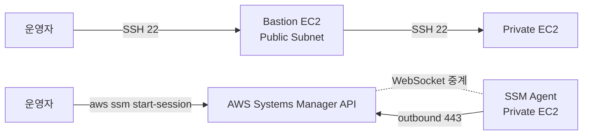
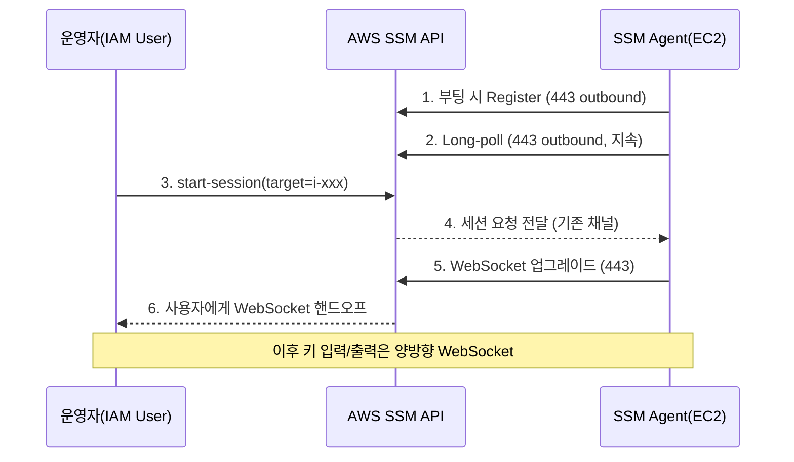
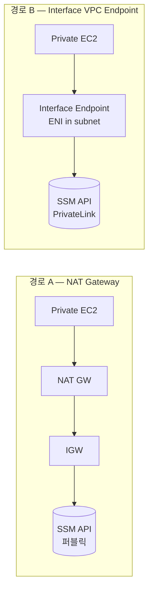
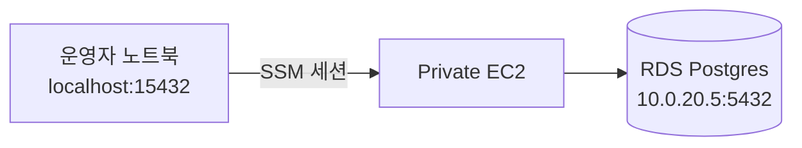

## 서론

[2편](/blog/aws-private-ec2-guide-2)에서 만든 Private EC2는 공인 IP가 없다. SSH로 직접 접속할 수 없다는 뜻이다. 전통적인 답은 <strong>Bastion(점프 호스트)</strong>이다 — Public Subnet에 EC2 한 대를 두고 SSH 22번을 열어둔 다음, 거기서 다시 Private EC2로 SSH한다.

이 시리즈는 그 답을 거부한다. <strong>22번 포트를 단 한 번도 열지 않고도</strong> 셸에 들어가고, 명령을 실행하고, RDS까지 포트 포워딩한다. 답은 SSM Session Manager다.

- [1편 — 왜 Private Subnet인가?](/blog/aws-private-ec2-guide-1)
- [2편 — Terraform으로 VPC 인프라 구성하기](/blog/aws-private-ec2-guide-2)
- <strong>3편 — SSM Session Manager로 Bastion 없이 접속하기 (이 글)</strong>
- 4편 — GitHub Actions + SSM/CodeDeploy CI/CD 파이프라인
- 5편 — 비용 분석과 최적화 전략

이 글의 대상은 <strong>Bastion을 한두 번 운영해보고 키 관리·감사·노출 위험에 지친 주니어</strong>다. 다 읽고 나면 "SSM이 왜 이렇게 작동하는지"와 "내 환경에서 NAT 대신 VPC Endpoint를 쓸 가치가 있는지" 둘 다 판단할 수 있게 된다.

---

## TL;DR

- <strong>SSM은 reverse-tunnel이다.</strong> EC2의 SSM Agent가 AWS API에 <strong>아웃바운드 443</strong>으로 폴링한다 — 인바운드 22번을 열 필요가 없는 진짜 이유.
- <strong>필요한 건 3가지</strong>: ① SSM Agent(AL2023은 기본 탑재) ② `AmazonSSMManagedInstanceCore` IAM Role(2편에서 미리 붙임) ③ SSM 엔드포인트로 가는 네트워크 경로(NAT 또는 VPC Endpoint).
- <strong>네트워크 경로는 둘 중 하나</strong>: NAT Gateway 경유(이미 있으면 추가 비용 0) vs Interface VPC Endpoint 3개(`ssm`, `ssmmessages`, `ec2messages`). NAT 있으면 NAT, 인터넷을 끊고 싶으면 Endpoint.
- <strong>Port Forwarding 두 종류</strong>: 인스턴스 자기 포트(`AWS-StartPortForwardingSession`), 인스턴스 너머 원격 호스트(`AWS-StartPortForwardingSessionToRemoteHost`). 후자가 RDS·ElastiCache 운영의 사실상 표준.
- <strong>Bastion 대비 이득</strong>: SSH 키·22번 포트·점프 호스트 EC2 비용·키 회전 운영이 한꺼번에 사라지고, 모든 세션이 IAM 사용자 단위로 자동 감사된다.

---

## 1. 왜 Bastion을 버리나

### 1.1 Bastion이 가져오는 5가지 부담

| 부담 | 구체적인 모습 |
| --- | --- |
| <strong>22번 포트 노출</strong> | Public Subnet의 Bastion에 `0.0.0.0/0:22`(또는 회사 IP 대역). 스캐닝과 무차별 대입의 1순위 표적 |
| <strong>키 관리 운영</strong> | 직원 입·퇴사마다 `authorized_keys` 갱신, 키 회전 정책, 분실 시 재발급 — 자동화하지 않으면 결국 방치 |
| <strong>인스턴스 비용·HA</strong> | Bastion 자체가 EC2 + EIP. 가용성 챙기려면 AZ별 Bastion 또는 Auto Scaling이 필요 |
| <strong>감사 누락</strong> | "누가 언제 무엇을 했는가"는 결국 Bastion의 셸 히스토리에 의존 — 운영자가 직접 지울 수도 있다 |
| <strong>점프 호스트 자체가 표적</strong> | Bastion만 뚫리면 Private 전체로 진입. 한 번의 키 유출이 곧 전면 침해 |

### 1.2 SSM이 답을 다르게 하는 방식

위 5가지를 SSM은 한 줄로 정리한다 — <strong>접속을 인바운드가 아니라 아웃바운드로 뒤집는다</strong>. EC2가 AWS API에 먼저 연결하고, 사용자는 AWS API를 통해 그 세션을 잡는다. 22번 포트도, 키도, Bastion EC2도 필요 없다.



위가 Bastion 모델, 아래가 SSM 모델이다. 차이는 화살표의 <strong>시작점</strong>이다.

---

## 2. SSM Session Manager 작동 원리

### 2.1 핵심 흐름 — Agent가 AWS에 폴링한다

EC2 위에서 동작하는 <strong>SSM Agent</strong>(`amazon-ssm-agent` 데몬)가 부팅 직후부터 AWS Systems Manager API에 <strong>아웃바운드 HTTPS(443)</strong>로 지속적인 연결을 유지한다. 사용자가 `aws ssm start-session`을 호출하면 AWS API가 이미 열려 있는 그 채널을 통해 양방향 스트림을 다리 놓는다.



핵심 포인트 두 개:

- 모든 트래픽이 <strong>EC2 입장에서 아웃바운드</strong>다. SG에 인바운드 22번이 없어도 된다.
- 사용자는 EC2와 직접 연결되지 않는다. <strong>AWS API가 가운데에서 중계</strong>한다 — 그래서 IAM 권한·CloudTrail 감사가 자동으로 따라온다.

### 2.2 참여하는 3가지 컴포넌트

| 컴포넌트 | 역할 | 위치 |
| --- | --- | --- |
| <strong>SSM Agent</strong> | EC2에서 폴링·세션 처리 | EC2 안 (`amazon-ssm-agent` 데몬) |
| <strong>SSM Service</strong> | 메시지 라우팅·세션 중계·감사 | AWS 관리형 (리전별) |
| <strong>Session Manager Plugin</strong> | 운영자 PC에서 WebSocket I/O 처리 | 운영자의 노트북 |

세 개가 모두 갖춰져야 세션이 성립한다. 트러블슈팅도 "이 셋 중 어느 단계에서 막히는가"로 끊어보면 빠르다.

### 2.3 참고: 왜 인바운드 22번이 필요 없는가

SSH는 클라이언트가 서버의 22번을 직접 두드린다. 그래서 서버는 인바운드 22번을 허용해야 한다. SSM은 반대다 — <strong>EC2가 클라이언트가 되어 AWS API의 443을 두드린다</strong>. AWS API 입장에서 보면 EC2도, 운영자 노트북도 모두 "API를 호출하는 클라이언트"다.

이게 회사 방화벽을 뚫고 들어가는 사내 슬랙·구글 미트와 같은 모델이다. 회사 내부망에는 외부에서 들어오는 포트가 열려 있지 않지만, 내부에서 외부로 나가는 443은 열려 있다. 그 위에서 메신저가 양방향 통신을 한다. SSM도 똑같다.

---

## 3. 접속에 필요한 3가지 전제조건

### 3.1 SSM Agent

Amazon Linux 2, Amazon Linux 2023, Ubuntu 18.04+, Windows Server 최신 AMI에는 <strong>SSM Agent가 기본 탑재</strong>되어 있다. 2편에서 띄운 AL2023 EC2는 그대로 쓰면 된다. 직접 확인하려면:

```bash
# EC2 안에서
systemctl status amazon-ssm-agent
```

`active (running)` 상태여야 한다. 사내 골든 AMI를 쓴다면 빠져 있을 수도 있어 `dnf install -y amazon-ssm-agent && systemctl enable --now amazon-ssm-agent`를 user_data에 추가한다.

### 3.2 IAM Role

EC2가 AWS API를 호출하려면 자격증명이 필요하다. 정답은 <strong>EC2 인스턴스 프로파일에 IAM Role 부착</strong>이다. 2편 6.1절에서 이미 만들어뒀다.

```hcl
resource "aws_iam_role_policy_attachment" "ec2_ssm" {
  role       = aws_iam_role.ec2_ssm.name
  policy_arn = "arn:aws:iam::aws:policy/AmazonSSMManagedInstanceCore"
}
```

이 관리형 정책이 SSM Agent 운영에 필요한 최소 권한 집합(API 호출, 메시지 송수신, KMS 복호화 등)을 담고 있다. 더 좁게 가고 싶으면 직접 정책을 작성할 수 있지만, <strong>학습·일반 운영 단계에서는 관리형 정책이 정답</strong>이다.

> <strong>참고</strong>: "EC2가 IAM Role을 어떻게 받아오는가"는 인스턴스 메타데이터(IMDS) 호출이다. EC2 안에서 `curl http://169.254.169.254/latest/meta-data/iam/info`를 쳐보면 부착된 Role이 보인다. SSM Agent도 부팅 시 같은 경로로 자격증명을 받아간다.

### 3.3 Network 경로

이 부분이 가장 자주 막힌다. SSM Agent가 폴링할 때 호출하는 <strong>3개의 엔드포인트</strong>까지 도달할 수 있어야 한다.

- `ssm.<region>.amazonaws.com` — 명령 메타데이터 API
- `ssmmessages.<region>.amazonaws.com` — Session Manager 양방향 채널
- `ec2messages.<region>.amazonaws.com` — Run Command 메시지 채널

도달 방법은 두 가지 — <strong>NAT Gateway 경유로 인터넷</strong>을 통해 가거나, <strong>Interface VPC Endpoint</strong>로 VPC 내부에서 직접 닿거나. 어느 쪽을 택할지가 4절의 핵심 결정이다.

### 3.4 클라이언트 — Session Manager Plugin

운영자 노트북에는 AWS CLI 외에 <strong>Session Manager Plugin</strong>이 추가로 설치돼 있어야 한다. CLI는 API 호출만 알고, WebSocket으로 키 입력을 주고받는 일은 플러그인이 한다.

```bash
# macOS
brew install --cask session-manager-plugin

# 검증
session-manager-plugin --version
```

플러그인 없이 `aws ssm start-session`을 치면 "SessionManagerPlugin is not found" 에러가 떨어진다.

---

## 4. NAT Gateway vs VPC Endpoint — 어떻게 고를까

### 4.1 두 경로



| 항목 | NAT Gateway | Interface VPC Endpoint |
| --- | --- | --- |
| 트래픽 경로 | 인터넷(공용) | AWS PrivateLink(사설) |
| EC2 추가 권한 | 없음 (이미 NAT 있으면 끝) | 없음 |
| 추가 리소스 | 0 (재사용) | 엔드포인트 3개 + ENI |
| 시간당 비용 | 약 $0.045/AZ + 데이터 | 약 $0.01/AZ × 엔드포인트 + 데이터 |
| 인터넷 패키지 다운로드 | 가능 (`dnf update` 등) | 불가 (별도 NAT 또는 미러 필요) |
| 컴플라이언스 | 트래픽이 외부로 나갔다 들어옴 | VPC 안에 머무름 |

### 4.2 비용 — 실제 숫자

서울 리전 기준(2026년):

- <strong>NAT Gateway 1개</strong>: 약 $32/월 (시간당 $0.045) + 데이터 처리
- <strong>NAT Gateway 2개(2AZ HA, 2편 구성)</strong>: 약 $64/월
- <strong>Interface VPC Endpoint 3종 × 2AZ</strong>: 3 × 2 × $0.01 × 720h ≈ <strong>약 $43/월</strong> + 데이터

수치만 보면 NAT 한 대가 더 싸다. 하지만 <strong>2편 구성처럼 NAT가 이미 두 대 떠 있다면 SSM 트래픽은 그대로 NAT으로 보내는 게 추가 비용 0</strong>이다. 반대로 Endpoint를 따로 깔면 둘 다 청구된다.

### 4.3 결정 기준

| 상황 | 추천 |
| --- | --- |
| 학습·개발·스테이징, NAT 이미 있음 | <strong>NAT 경유</strong> — 추가 작업 0 |
| 프로덕션, NAT가 외부 API 호출 등에 이미 필요 | <strong>NAT 경유</strong> — 비용 효율 |
| 보안 강화로 Private EC2의 인터넷 차단 | <strong>VPC Endpoint + NAT 제거</strong> — SSM에만 닿음 |
| 컴플라이언스(PCI, ISMS-P, 금융) | <strong>VPC Endpoint</strong> — 트래픽이 AWS 내부에 머무는 게 명시 요건 |
| 에어갭 환경 / 인터넷 끊긴 VPC | <strong>VPC Endpoint 외 선택지 없음</strong> |

이 시리즈의 학습 트랙은 첫 번째 — <strong>NAT 경유</strong>다. 2편에서 만든 그대로 SSM이 동작한다. 4.4절의 Endpoint 코드는 "필요해지면 어떻게 추가하는가"를 보여주는 참고용이다.

### 4.4 참고: Interface VPC Endpoint를 추가하는 Terraform

NAT을 끄고 SSM 전용으로 가려면 이렇게 붙인다:

```hcl
resource "aws_security_group" "vpc_endpoints" {
  name        = "private-ec2-vpce-sg"
  description = "Allow 443 from VPC CIDR to interface endpoints"
  vpc_id      = aws_vpc.main.id

  ingress {
    description = "HTTPS from VPC"
    from_port   = 443
    to_port     = 443
    protocol    = "tcp"
    cidr_blocks = [aws_vpc.main.cidr_block]
  }

  egress {
    from_port   = 0
    to_port     = 0
    protocol    = "-1"
    cidr_blocks = ["0.0.0.0/0"]
  }
}

locals {
  ssm_endpoints = ["ssm", "ssmmessages", "ec2messages"]
}

resource "aws_vpc_endpoint" "ssm" {
  for_each            = toset(local.ssm_endpoints)
  vpc_id              = aws_vpc.main.id
  service_name        = "com.amazonaws.ap-northeast-2.${each.key}"
  vpc_endpoint_type   = "Interface"
  subnet_ids          = [aws_subnet.private_a.id, aws_subnet.private_c.id]
  security_group_ids  = [aws_security_group.vpc_endpoints.id]
  private_dns_enabled = true
}
```

`private_dns_enabled = true`가 핵심이다. 이걸 켜야 EC2 안에서 `ssm.ap-northeast-2.amazonaws.com`이 자동으로 Endpoint의 사설 IP로 해석된다 — 코드를 바꿀 필요 없이 SSM Agent가 그대로 작동한다. 2편에서 VPC에 `enable_dns_hostnames = true`를 켜둔 게 이 시점에 효과를 본다.

### 4.5 참고: 실무에서는 보통 둘 다 쓴다

4.3절 표를 "둘 중 하나"로 읽기 쉽지만, 학습 단계를 지나 <strong>컨테이너 기반 운영</strong>으로 넘어가면 NAT과 VPC Endpoint를 <strong>병행하는 구성</strong>이 디폴트가 된다. 이유는 아웃바운드 트래픽이 자연스럽게 두 종류로 갈라지기 때문이다.

| 트래픽 | 통로 | 이유 |
| --- | --- | --- |
| AWS 서비스 호출 (ECR, S3, Logs, Secrets Manager 등) | <strong>VPC Endpoint</strong> | 더 싸고, 인터넷 안 탐, 컴플라이언스 우위 |
| 외부 API 호출 (Stripe, Slack, OpenAI 등) | <strong>NAT Gateway</strong> | Endpoint가 없는 서비스라 다른 선택지 없음 |
| OS·언어 패키지 (`dnf update`, `pip install` 등) | <strong>NAT Gateway</strong> | 외부 미러 접근 필요 |

라우팅 분기는 자동이다. S3 Gateway Endpoint를 만들면 S3 prefix list가 라우트 테이블에 자동으로 추가되고, Interface Endpoint는 Private DNS가 사설 IP로 응답한다. 그 외 `0.0.0.0/0` 트래픽만 NAT으로 흐른다. 애플리케이션 코드는 평소처럼 SDK를 쓰면 된다.

> <strong>핵심</strong>: "Endpoint가 NAT을 대체"가 아니라 <strong>"Endpoint가 NAT의 트래픽 비용을 흡수"</strong>한다. 컨테이너 이미지 pull(ECR), 로그 전송(CloudWatch Logs), 시크릿 조회(Secrets Manager) — 운영 트래픽 대부분이 Endpoint 쪽으로 빠지면서 NAT 처리량 과금이 확 줄어든다. 5편 2절의 절감 전략이 이 원리를 활용한다.

이 분리는 <strong>컨테이너·k8s 환경</strong>에서 특히 잘 맞는다. 빌드 타임과 런타임이 본래 분리되어 있기 때문이다.

- <strong>빌드 타임</strong>: CI(GitHub Actions 등 인터넷이 있는 환경)에서 `dnf install`, `pip install`로 의존성을 모두 설치해 이미지에 박는다 → ECR push.
- <strong>런타임</strong>: 프라이빗 서브넷의 EKS/ECS 노드는 ECR Endpoint로 이미지 pull, CloudWatch Logs Endpoint로 로그 전송, Secrets Manager Endpoint로 시크릿 조회.

런타임에 인터넷이 필요한 일이 거의 없다. 패키지가 이미 이미지 안에 있기 때문이다. <strong>"VPC Endpoint로 패키지 다운로드가 안 된다"는 제약이 컨테이너 시대에 사실상 무력화되는 지점</strong>이다.

극단적으로 보안이 중요한 환경(금융·의료·정부)은 NAT까지 제거하고 외부 API는 PrivateLink 파트너 서비스나 별도 프록시 VPC를 경유시킨다. 다만 일반 백엔드 운영 기준으로는 <strong>"Endpoint + NAT 병행"이 디폴트, "Endpoint 단독"이 특수 케이스</strong>로 이해하면 된다.

---

## 5. 실습 — 접속하고 명령 실행하기

### 5.1 가장 단순한 시작 — `start-session`

2편의 출력으로 받은 `ec2_ids` 중 하나를 골라 접속한다:

```bash
aws ssm start-session --target i-0123456789abcdef0
```

성공하면 `sh-5.2$` 같은 셸이 떨어진다. `whoami`는 `ssm-user`다(SSM이 자동 생성한 sudo 권한 계정). `exit`로 빠져나오면 된다.

| 상황 | 원인 |
| --- | --- |
| `TargetNotConnected` | EC2가 Online이 아님 — IAM Role 또는 Network 경로 문제 |
| `AccessDeniedException` | 운영자 IAM에 `ssm:StartSession` 권한이 없음 |
| `SessionManagerPlugin is not found` | 클라이언트 플러그인 미설치 (3.4절) |
| 세션은 열리는데 `dnf install`이 안 됨 | NAT은 있지만 Private RT가 NAT을 안 가리킴 (2편 3.3절) |

EC2의 SSM 등록 상태는 콘솔의 <strong>Systems Manager → Fleet Manager</strong>에서 `Online`으로 보여야 한다. 또는 CLI로:

```bash
aws ssm describe-instance-information \
  --filters "Key=InstanceIds,Values=i-0123456789abcdef0"
```

### 5.2 SSH 명령과 ssh config 통합

기존 `ssh ec2-user@host` 흐름을 버리지 않고 SSM 위에 얹을 수 있다. `~/.ssh/config`에:

```text
Host i-* mi-*
  ProxyCommand sh -c "aws ssm start-session --target %h \
    --document-name AWS-StartSSHSession --parameters 'portNumber=%p'"
```

이러면 다음 명령이 그대로 동작한다:

```bash
ssh ec2-user@i-0123456789abcdef0
scp ./deploy.tar.gz ec2-user@i-0123456789abcdef0:/tmp/
```

내부적으로는 SSM 위에 SSH 프로토콜이 한 번 더 얹힌 형태다. 이때만큼은 인스턴스에 SSH 데몬이 켜져 있어야 한다(AL2023 기본값). 22번 포트를 SG에서 열 필요는 여전히 없다 — 트래픽은 SSM 채널을 통한다.

> <strong>참고</strong>: `scp`가 필요한 순간이 종종 있다 — 큰 로그 덤프 가져오기, 빌드 산출물 올리기. CI/CD에서는 다른 답을 쓰지만(4편), 운영 중 일회성 작업에는 이 방식이 빠르다.

---

## 6. Port Forwarding — RDS와 내부 서비스에 접근

### 6.1 두 종류의 Port Forwarding

SSM이 진가를 발휘하는 지점이 여기다. 운영자 노트북의 로컬 포트를 VPC 내부 자원에 직접 연결한다 — VPN 없이.



두 가지 SSM 문서가 제공된다:

| 문서 | 용도 |
| --- | --- |
| `AWS-StartPortForwardingSession` | 인스턴스 자기 자신의 포트로 (예: EC2의 8080 → 로컬 8080) |
| `AWS-StartPortForwardingSessionToRemoteHost` | 인스턴스 너머 다른 호스트 포트로 (예: RDS 5432 → 로컬 15432) |

후자가 RDS, ElastiCache, 내부 마이크로서비스에 접속할 때 사실상의 표준이다.

### 6.2 인스턴스 자기 포트로

EC2에 떠 있는 8080(2편 user_data의 Nginx)을 로컬 8080으로 끌어온다:

```bash
aws ssm start-session \
  --target i-0123456789abcdef0 \
  --document-name AWS-StartPortForwardingSession \
  --parameters '{"portNumber":["8080"],"localPortNumber":["8080"]}'
```

다른 터미널에서 `curl localhost:8080` → `Hello from AZ-a`. ALB를 거치지 않고도 인스턴스 동작을 직접 확인할 수 있다.

### 6.3 RDS로 — 운영의 가장 흔한 패턴

EC2를 점프 포인트로 삼아 RDS 5432를 로컬 15432로 끌어온다:

```bash
aws ssm start-session \
  --target i-0123456789abcdef0 \
  --document-name AWS-StartPortForwardingSessionToRemoteHost \
  --parameters '{
    "host":["mydb.cluster-xxxxx.ap-northeast-2.rds.amazonaws.com"],
    "portNumber":["5432"],
    "localPortNumber":["15432"]
  }'
```

이후 로컬에서:

```bash
psql -h localhost -p 15432 -U app_user -d app
```

트래픽은 노트북 → SSM 채널 → EC2 → RDS 식으로 흐른다. <strong>RDS는 여전히 Private Subnet에 있고, 5432는 EC2 SG에만 열려 있어도</strong> 운영자가 DB에 붙을 수 있다. VPN을 따로 두지 않아도 된다는 게 이 패턴의 핵심 가치다.

| 보안 관점 | 효과 |
| --- | --- |
| RDS의 Public Access | 계속 `false` 유지 — 외부 노출 없음 |
| DB SG | EC2 SG만 허용 (2편 4.3절 패턴 그대로) |
| 운영자 인증 | IAM 사용자 단위 — 키 공유 없음 |
| 감사 | CloudTrail에 `StartSession` 이벤트, 누가 언제 어디로 포워딩했는지 |

### 6.4 참고: 자주 쓰는 명령은 별칭으로

매번 위 한 줄을 치기는 길다. `~/.aws/cli/alias`에 별칭을 박아두면 편하다.

```text
[toplevel]
db = !f() { aws ssm start-session --target $1 \
  --document-name AWS-StartPortForwardingSessionToRemoteHost \
  --parameters host=$2,portNumber=5432,localPortNumber=15432; }; f
```

```bash
aws db i-0123456789abcdef0 mydb.cluster-xxxxx.ap-northeast-2.rds.amazonaws.com
```

---

## 7. 감사와 로깅 — 누가 언제 무엇을 했는가

### 7.1 자동으로 남는 것

SSM은 켜는 순간 두 종류 로그가 생긴다:

- <strong>CloudTrail의 API 이벤트</strong> — `StartSession`, `TerminateSession`, `SendCommand`. 누가 어느 인스턴스에 언제 붙었는지 IAM 사용자 단위로 남는다.
- <strong>세션 메타데이터</strong> — Systems Manager → Session Manager → Session History.

여기까지는 별도 설정 없이 기본 제공이다. <strong>실제 키 입력·출력 본문</strong>까지 보존하려면 한 단계가 더 필요하다.

### 7.2 세션 본문 로깅 (S3 + CloudWatch)

콘솔의 <strong>Session Manager → Preferences</strong>에서 S3 버킷 또는 CloudWatch Log Group을 지정한다. 이후 모든 세션의 셸 입력·출력이 그대로 저장된다.

```hcl
resource "aws_ssm_document" "session_prefs" {
  name            = "SSM-SessionManagerRunShell"
  document_type   = "Session"
  document_format = "JSON"
  content = jsonencode({
    schemaVersion = "1.0"
    description   = "Session Manager preferences"
    sessionType   = "Standard_Stream"
    inputs = {
      s3BucketName                = aws_s3_bucket.ssm_logs.id
      s3KeyPrefix                 = "session-logs"
      cloudWatchLogGroupName      = aws_cloudwatch_log_group.ssm.name
      cloudWatchEncryptionEnabled = true
    }
  })
}
```

이 문서 하나가 리전 전체의 SSM 세션에 적용된다. 운영자는 자기 키 입력이 기록된다는 걸 알아야 하므로, 사내 정책에 명시해두는 게 좋다.

### 7.3 Run As — IAM 사용자별 OS 계정 매핑

기본은 모두 `ssm-user`로 들어가서 누가 누군지 OS 레벨에서는 구분이 안 된다. <strong>Run As</strong>를 켜면 IAM 사용자 태그(`SSMSessionRunAs = alice`)에 따라 EC2의 `alice` OS 계정으로 자동 매핑된다.

| 옵션 | 효과 |
| --- | --- |
| 기본(Run As off) | 모두 `ssm-user`. 빠르게 시작하기 좋음 |
| Run As on | IAM 사용자 ↔ OS 계정 1:1. `last`, `who`, sudo 로그가 정확해짐 |

규모가 작으면 기본으로, 운영자가 5명 이상이거나 감사 요건이 빡빡하면 Run As로 가는 게 일반적이다.

---

## 8. SSH·Bastion과 비교 — 그리고 SSM의 한계

### 8.1 한 장 비교

| 항목 | 전통적 Bastion | SSM Session Manager |
| --- | --- | --- |
| 인바운드 포트 | 22 (Bastion) | 없음 |
| 키 관리 | SSH 키 페어 | IAM 사용자/Role |
| 추가 인스턴스 | Bastion EC2(+EIP) 필요 | 없음 |
| HA 운영 | Bastion AZ별로 + ALB | AWS 관리형 (자동) |
| 감사 | Bastion 셸 히스토리 | CloudTrail + 세션 본문 |
| Port Forwarding | `ssh -L`로 가능 | SSM 문서로 더 강력 |
| 학습 곡선 | SSH 친숙함 | aws CLI + 플러그인 |
| 비용 | Bastion EC2 + EIP (~$15/월) | $0 (NAT 재사용 시) |

### 8.2 SSM이 약한 곳

만능은 아니다. 알아두면 트러블슈팅이 빨라진다.

- <strong>대량 파일 전송</strong> — `scp` 흉내는 가능하지만 처리량이 아쉽다. 큰 산출물은 S3 경유가 정답이다.
- <strong>그래픽/데스크톱</strong> — Session Manager는 셸 중심이다. RDP/VNC가 필요하면 SSM Port Forwarding으로 3389/5901을 잠깐 끌어오는 식으로 우회.
- <strong>지연시간</strong> — 모든 키 입력이 AWS API를 한 번 거친다. SSH 직접 연결보다 살짝 느리다 — 인터랙티브하게 큰 차이는 아니지만 키 누름 응답에 민감한 작업이라면 인지하고 쓴다.
- <strong>오프라인 모드</strong> — AWS API에 못 닿으면 접속할 수 없다. NAT/Endpoint 양쪽이 다 죽으면 EC2가 살아 있어도 들어갈 길이 없다 — Bastion도 마찬가지지만, "AWS API 의존"이 최후의 비상 통로조차 막을 수 있다는 점은 인지해두자.

### 8.3 그럼에도 결론은 SSM

위 단점은 모두 <strong>특수 상황</strong>이다. 일반적인 백엔드 운영의 95%는 SSM이 더 안전하고 더 싸고 더 자동화돼 있다. <strong>"기본은 SSM, 안 되는 케이스만 예외"</strong>가 2026년 AWS 운영의 표준 사고다.

---

## 정리

이 글에서 얻고 가야 할 것:

1. <strong>SSM은 reverse-tunnel이다.</strong> EC2가 AWS API에 아웃바운드 443으로 폴링하기 때문에 인바운드 22번이 필요 없다. Bastion이 필요한 모든 이유가 여기서 사라진다.
2. <strong>3가지 전제: Agent, IAM Role, Network 경로.</strong> 2편의 user_data와 IAM Role 부착 덕분에 앞 두 개는 이미 준비됐다. 남은 건 NAT(이미 있음) 또는 VPC Endpoint 선택.
3. <strong>NAT vs VPC Endpoint는 비용·컴플라이언스·인터넷 차단 의도로 결정한다.</strong> 학습·일반 운영은 NAT 재사용, 보안·금융·에어갭은 Endpoint.
4. <strong>Port Forwarding 두 종류 중 RemoteHost 버전이 운영의 핵심.</strong> RDS·ElastiCache·내부 서비스를 VPN 없이 IAM 권한만으로 안전하게 잇는다.
5. <strong>모든 세션은 IAM·CloudTrail·세션 본문 로그로 자동 감사된다.</strong> Bastion에서 운영자가 손으로 지우던 셸 히스토리와 차원이 다르다.
6. <strong>SSM이 만능은 아니지만 95%는 SSM이 정답이다.</strong> 그래픽 세션이나 초고속 파일 전송 같은 예외는 별도 경로로 분리한다.

3편의 목표는 하나였다 — <strong>22번 포트를 영원히 닫고도 운영이 가능한 상태를 만드는 것</strong>. 이제 셸 접속, 명령 실행, RDS 포트 포워딩까지 모두 IAM·SSM 위에서 동작한다.

다음 편에서는 이 SSM 채널을 <strong>배포 파이프라인</strong>의 일부로 끌어들인다. GitHub Actions가 SSM Run Command 또는 CodeDeploy를 통해 Private EC2에 코드 변경을 전파하는 흐름 — 그동안 Jenkins+SSH로 처리하던 일을 어떻게 OIDC 페더레이션과 SSM으로 대체하는지 본다.

---

## 부록

### A. 처음 SSM을 켤 때 5분 체크리스트

```bash
# 1. CLI와 플러그인
aws --version
session-manager-plugin --version

# 2. 인스턴스가 SSM에 등록됐나
aws ssm describe-instance-information \
  --query "InstanceInformationList[*].[InstanceId,PingStatus]" \
  --output table

# 3. 본인 IAM 사용자에게 권한이 있나
aws iam simulate-principal-policy \
  --policy-source-arn "arn:aws:iam::ACCOUNT:user/$USER" \
  --action-names ssm:StartSession ssm:TerminateSession

# 4. 첫 세션
aws ssm start-session --target i-...
```

### B. 주요 AWS 관리형 SSM Document

| 이름 | 용도 |
| --- | --- |
| `SSM-SessionManagerRunShell` | 기본 셸 세션 (커스텀 시 이 이름으로 덮어씀) |
| `AWS-StartSSHSession` | SSH 호환 모드 (ssh config의 ProxyCommand) |
| `AWS-StartPortForwardingSession` | 인스턴스 자기 포트 포워딩 |
| `AWS-StartPortForwardingSessionToRemoteHost` | RDS 등 원격 호스트 포트 포워딩 |
| `AWS-RunShellScript` | 비대화형 명령 실행 (4편에서 다룸) |

### C. 운영자 IAM 정책 최소 예시

```json
{
  "Version": "2012-10-17",
  "Statement": [
    {
      "Effect": "Allow",
      "Action": [
        "ssm:StartSession",
        "ssm:TerminateSession",
        "ssm:DescribeInstanceInformation",
        "ssm:DescribeSessions",
        "ssm:GetConnectionStatus"
      ],
      "Resource": "*"
    },
    {
      "Effect": "Allow",
      "Action": "ssm:StartSession",
      "Resource": [
        "arn:aws:ssm:*:*:document/AWS-StartSSHSession",
        "arn:aws:ssm:*:*:document/AWS-StartPortForwardingSession",
        "arn:aws:ssm:*:*:document/AWS-StartPortForwardingSessionToRemoteHost"
      ]
    }
  ]
}
```

타깃 인스턴스를 태그로 좁히고 싶으면 `Resource`에 `arn:aws:ec2:*:*:instance/*`와 `Condition: { StringEquals: { "ssm:resourceTag/Env": "dev" } }`를 더한다 — 운영자가 prod에는 못 붙고 dev에만 붙도록 강제하는 식이다.
