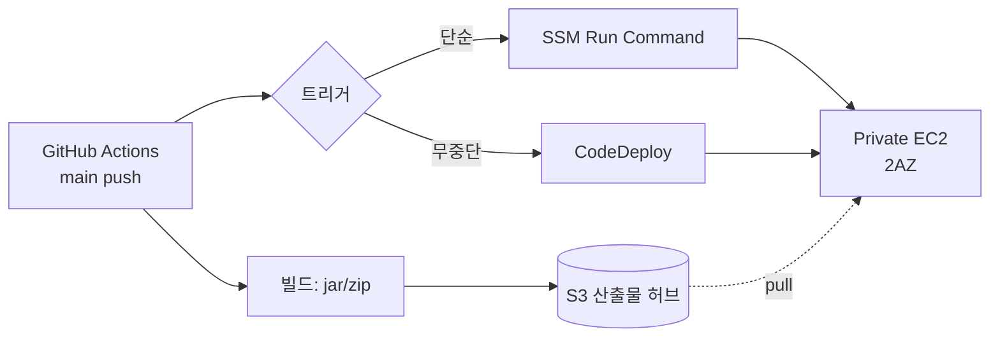
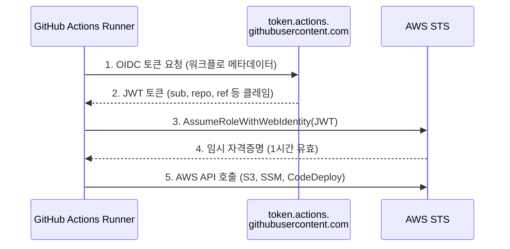
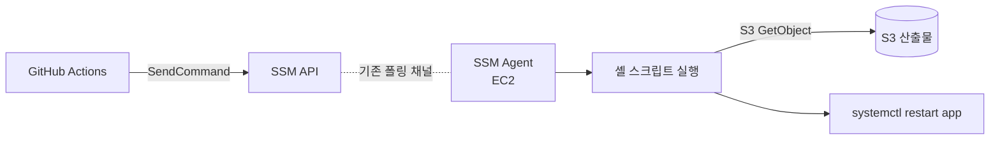
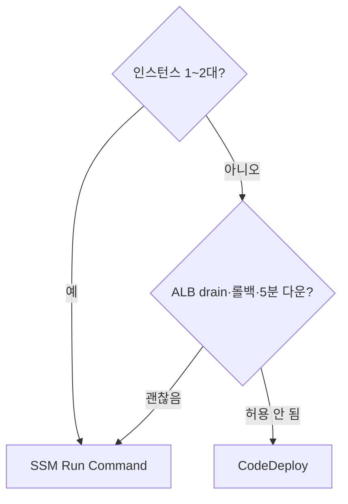

## 서론

[3편](/blog/aws-private-ec2-guide-3)에서 22번 포트를 영원히 닫았다. 운영자는 SSM으로 셸에 들어가 명령을 실행할 수 있다. 하지만 <strong>배포는 다른 문제</strong>다. GitHub Actions가 push 이벤트마다 EC2에 코드를 어떻게 전파할까?

전통적인 답은 두 가지였다. 하나, GitHub Secret에 AWS Access Key를 박고 ssh로 EC2에 접속해서 scp로 jar를 올리는 방식. 둘, Jenkins를 EC2에 띄워서 같은 일을 한다. 둘 다 <strong>장기 자격증명을 어딘가에 보관</strong>한다는 점이 같고, 그래서 키 유출이 파이프라인 보안에서 가장 자주 깨지는 지점이 됐다.

이 글은 그 패턴을 둘 다 버린다. <strong>OIDC 페더레이션</strong>으로 GitHub에 키를 두지 않고, <strong>S3 + SSM/CodeDeploy</strong>로 22번 포트도 열지 않는 배포 파이프라인을 만든다.

- [1편 — 왜 Private Subnet인가?](/blog/aws-private-ec2-guide-1)
- [2편 — Terraform으로 VPC 인프라 구성하기](/blog/aws-private-ec2-guide-2)
- [3편 — SSM Session Manager로 Bastion 없이 접속하기](/blog/aws-private-ec2-guide-3)
- <strong>4편 — GitHub Actions + SSM/CodeDeploy CI/CD 파이프라인 (이 글)</strong>
- 5편 — 비용 분석과 최적화 전략

이 글의 대상은 <strong>GitHub Actions를 띄워봤지만 AWS 자격증명 처리에서 한 번씩 막혔던 주니어</strong>다. 다 읽고 나면 "왜 OIDC가 정답인지"와 "내 환경에 SSM Run Command가 충분한지 CodeDeploy까지 가야 하는지" 둘 다 판단된다.

---

## TL;DR

- <strong>OIDC 페더레이션이 사실상의 표준이다.</strong> GitHub Actions는 매 실행마다 OIDC 토큰을 발급받아 AWS에 제출하고, AWS는 STS로 임시 자격증명을 돌려준다 — GitHub 시크릿에 AWS 키를 보관하지 않는다.
- <strong>산출물 허브는 S3다.</strong> GitHub Actions는 S3에 jar/zip을 올리고, EC2는 IAM Role로 그걸 받아간다. SSH/scp는 등장하지 않는다.
- <strong>SSM Run Command는 단순 배포의 정답.</strong> `aws ssm send-command`로 인스턴스에 셸 스크립트를 푸시한다 — Agent가 폴링으로 받아와 실행하므로 인바운드 포트는 여전히 0개.
- <strong>CodeDeploy는 무중단·롤백·Hook이 필요할 때.</strong> `appspec.yml`로 단계(Stop → Install → Start → Validate)를 정의하면 In-Place 또는 Blue/Green으로 롤링한다.
- <strong>선택 기준 한 줄</strong>: 단일 jar를 1~2대에 갈아끼우는 수준이면 SSM, 트래픽 차단·헬스체크·롤백이 필수면 CodeDeploy.

---

## 1. 배포 모델 — Private EC2에 어떻게 코드를 넣는가

### 1.1 4단계 그림

배포 파이프라인의 뼈대는 어느 패턴이든 같다.



- <strong>빌드</strong>: GitHub Actions에서 jar/zip을 만든다.
- <strong>업로드</strong>: 산출물을 S3에 올린다(SHA로 키 분리).
- <strong>트리거</strong>: GitHub Actions가 SSM Run Command 또는 CodeDeploy를 호출한다.
- <strong>적용</strong>: EC2가 S3에서 산출물을 받고, 서비스를 갈아끼운다.

### 1.2 두 갈래의 선택지

3번째 단계(트리거)에서 갈린다. <strong>SSM Run Command</strong>는 셸 스크립트를 인스턴스에 푸시해서 실행하는 가장 단순한 길이다. <strong>CodeDeploy</strong>는 무중단·롤백·Hook 단계 같은 운영 기능을 추가로 제공한다. §4–§5에서 각각 다루고, §6에서 의사결정 표를 본다.

---

## 2. OIDC 페더레이션 — long-lived 키를 GitHub에 두지 마라

### 2.1 무엇이 문제였나

전통적으로 GitHub Actions에서 AWS를 호출하려면 IAM 사용자를 만들고 Access Key/Secret Key를 발급받아 GitHub Secret에 저장했다. 이 방식의 문제:

- <strong>키가 영구적이다.</strong> 회전하지 않으면 평생 유효 — 유출 시 무제한 사용된다.
- <strong>스코프가 넓어지기 쉽다.</strong> 한 키로 여러 워크플로를 돌리다 보면 AdminAccess에 가까워진다.
- <strong>감사가 어렵다.</strong> CloudTrail에 IAM 사용자 이름은 남지만 "어느 워크플로 어느 커밋이 호출했는지"는 안 남는다.

### 2.2 OIDC가 답을 다르게 하는 방식

OIDC(OpenID Connect)는 <strong>실행 단위로 짧은 토큰을 발급</strong>받아 AWS에 제출하고, AWS가 임시 자격증명(STS)을 돌려주는 모델이다.



- 토큰은 워크플로 한 번에 한 번 발급되고, <strong>몇 분에서 한 시간 안에 만료</strong>된다.
- 토큰의 클레임에 `repo:my-org/my-repo:ref:refs/heads/main` 같은 정보가 박혀 있어, IAM Role 신뢰 정책에서 <strong>특정 레포·특정 브랜치만 허용</strong>하도록 좁힐 수 있다.
- CloudTrail에는 어떤 워크플로 실행이 호출했는지 OIDC sub 클레임이 남는다.

### 2.3 IAM에 OIDC Provider 등록

GitHub의 OIDC 발급자(`token.actions.githubusercontent.com`)를 AWS IAM에 한 번 등록한다. Terraform으로:

```hcl
resource "aws_iam_openid_connect_provider" "github" {
  url             = "https://token.actions.githubusercontent.com"
  client_id_list  = ["sts.amazonaws.com"]
  thumbprint_list = ["6938fd4d98bab03faadb97b34396831e3780aea1"]
}
```

`thumbprint_list`는 GitHub의 인증서 지문이다. 최근에는 AWS가 자동 검증하므로 자리만 채워두면 되고, 최신 모범값은 AWS 공식 문서를 따른다.

### 2.4 GitHub Actions가 사용할 IAM Role

OIDC 토큰을 받아들이는 IAM Role을 만든다. 신뢰 정책의 핵심은 <strong>`sub` 조건</strong>이다 — 어느 레포·어느 브랜치에서 온 토큰만 허용할지 지정한다.

```hcl
resource "aws_iam_role" "github_actions_deploy" {
  name = "GitHubActionsDeploy"

  assume_role_policy = jsonencode({
    Version = "2012-10-17"
    Statement = [{
      Effect    = "Allow"
      Principal = { Federated = aws_iam_openid_connect_provider.github.arn }
      Action    = "sts:AssumeRoleWithWebIdentity"
      Condition = {
        StringEquals = {
          "token.actions.githubusercontent.com:aud" = "sts.amazonaws.com"
        }
        StringLike = {
          "token.actions.githubusercontent.com:sub" = "repo:my-org/my-repo:ref:refs/heads/main"
        }
      }
    }]
  })
}

resource "aws_iam_role_policy" "github_actions_deploy" {
  role = aws_iam_role.github_actions_deploy.id
  policy = jsonencode({
    Version = "2012-10-17"
    Statement = [
      {
        Effect   = "Allow"
        Action   = ["s3:PutObject", "s3:GetObject"]
        Resource = "${aws_s3_bucket.artifacts.arn}/*"
      },
      {
        Effect   = "Allow"
        Action   = ["ssm:SendCommand", "ssm:GetCommandInvocation", "ssm:DescribeInstanceInformation"]
        Resource = "*"
      },
      {
        Effect   = "Allow"
        Action   = ["codedeploy:CreateDeployment", "codedeploy:GetDeployment", "codedeploy:GetDeploymentConfig"]
        Resource = "*"
      }
    ]
  })
}
```

`sub` 조건을 좁히지 않으면 같은 OIDC Provider를 신뢰하는 모든 GitHub 레포가 이 Role을 빼앗을 수 있다 — <strong>`sub` 조건 누락은 가장 흔한 OIDC 사고</strong>다.

### 2.5 GitHub Actions에서 Role 가정하기

Workflow YAML의 핵심은 두 부분이다 — `id-token: write` 권한과 `aws-actions/configure-aws-credentials` 액션.

```yaml
permissions:
  id-token: write   # OIDC 토큰 발급에 필요
  contents: read

jobs:
  deploy:
    runs-on: ubuntu-latest
    steps:
      - uses: actions/checkout@v4
      - uses: aws-actions/configure-aws-credentials@v4
        with:
          role-to-assume: arn:aws:iam::123456789012:role/GitHubActionsDeploy
          aws-region: ap-northeast-2
      - run: aws sts get-caller-identity
```

`get-caller-identity`가 임시 자격증명의 ARN을 찍어주면 OIDC 흐름이 정상 동작하는 것이다.

> <strong>참고</strong>: GitHub 시크릿에 AWS 키를 두던 레거시 워크플로를 OIDC로 옮기는 게 2026년 표준이다. AWS 보안 권고와 GitHub Actions 공식 문서 모두 OIDC를 권장한다.

---

## 3. 산출물 허브 — S3

### 3.1 왜 S3인가

GitHub Actions와 Private EC2 사이에 <strong>중간 저장소</strong>가 있어야 한다. EC2는 GitHub에 직접 닿지 않고(인증·신뢰 경계 문제), GitHub Actions Runner는 Private EC2에 직접 닿지 않기 때문이다(인바운드 차단). S3는:

- <strong>둘 다 닿는다</strong> — IAM 권한만 주면 GitHub Actions도 EC2도 같은 버킷을 사용한다.
- <strong>버전 키를 자유롭게 부여한다</strong> — `app/${SHA}.jar` 형태로 모든 빌드 산출물이 영속된다.
- <strong>롤백이 쉽다</strong> — 이전 SHA를 다시 트리거만 하면 끝.

### 3.2 EC2에 S3 권한 주기

3편에서 만든 `private-ec2-ssm-role`에 S3 GetObject 권한을 추가한다.

```hcl
resource "aws_s3_bucket" "artifacts" {
  bucket = "my-private-ec2-artifacts"
}

resource "aws_iam_role_policy" "ec2_artifacts_read" {
  role = aws_iam_role.ec2_ssm.id
  policy = jsonencode({
    Version = "2012-10-17"
    Statement = [{
      Effect   = "Allow"
      Action   = ["s3:GetObject"]
      Resource = "${aws_s3_bucket.artifacts.arn}/*"
    }]
  })
}
```

EC2가 NAT 경유로 S3에 닿게 되어 있으므로 추가 네트워크 작업은 필요 없다(완전 폐쇄망이라면 S3 Gateway VPC Endpoint를 추가).

> <strong>참고</strong>: S3 Gateway Endpoint는 시간당 비용이 0이다. NAT 데이터 처리비가 부담이라면 추가하는 게 비용·보안 모두에 이득이다.

---

## 4. 방식 A — SSM Run Command

### 4.1 왜 SSM Run Command인가

3편의 SSM Session Manager가 인터랙티브 셸이라면, <strong>Run Command는 비대화형 변형</strong>이다. 같은 SSM Agent가 같은 폴링 채널에서 명령을 받아 실행한다 — 따라서 추가 인프라가 0이다(Agent + IAM Role + Network 경로는 이미 갖춰졌다).



### 4.2 GitHub Actions Workflow

```yaml
name: Deploy via SSM
on:
  push:
    branches: [main]

permissions:
  id-token: write
  contents: read

jobs:
  deploy:
    runs-on: ubuntu-latest
    steps:
      - uses: actions/checkout@v4
      - uses: actions/setup-java@v4
        with:
          java-version: '21'
          distribution: 'temurin'
      - run: ./gradlew bootJar

      - uses: aws-actions/configure-aws-credentials@v4
        with:
          role-to-assume: arn:aws:iam::123456789012:role/GitHubActionsDeploy
          aws-region: ap-northeast-2

      - name: Upload artifact
        run: |
          aws s3 cp build/libs/app.jar \
            s3://my-private-ec2-artifacts/app/${{ github.sha }}.jar

      - name: Send deploy command
        id: deploy
        run: |
          CMD_ID=$(aws ssm send-command \
            --document-name AWS-RunShellScript \
            --targets "Key=tag:App,Values=myapp" "Key=tag:Env,Values=prod" \
            --parameters commands='[
              "set -e",
              "aws s3 cp s3://my-private-ec2-artifacts/app/${{ github.sha }}.jar /opt/app/app.jar.new",
              "mv /opt/app/app.jar.new /opt/app/app.jar",
              "systemctl restart app",
              "sleep 5",
              "curl -fsS http://localhost:8080/health"
            ]' \
            --comment "Deploy ${{ github.sha }}" \
            --query "Command.CommandId" --output text)
          echo "command_id=$CMD_ID" >> "$GITHUB_OUTPUT"

      - name: Wait for completion
        run: |
          for INSTANCE in $(aws ec2 describe-instances \
              --filters "Name=tag:App,Values=myapp" "Name=tag:Env,Values=prod" \
              --query "Reservations[].Instances[].InstanceId" --output text); do
            aws ssm wait command-executed \
              --command-id "${{ steps.deploy.outputs.command_id }}" \
              --instance-id "$INSTANCE"
          done
```

핵심 패턴:

- <strong>대상은 태그다.</strong> EC2에 `App=myapp`, `Env=prod` 태그가 붙어 있으면 Auto Scaling으로 늘어도 자동 포함된다.
- <strong>`set -e`</strong>로 첫 줄에서 한 번 실패하면 즉시 종료. 부분 적용 상태를 만들지 않는다.
- <strong>마지막 `curl` 한 줄로 헬스체크.</strong> 200이 안 오면 SSM이 실패로 표시 → GitHub Actions가 빨간불.

### 4.3 인스턴스 측 사전 준비

`/opt/app`과 `app.service`(systemd unit)는 EC2 부팅 시 user_data 또는 골든 AMI에 미리 박아둔다.

```text
[Unit]
Description=My App
After=network.target

[Service]
ExecStart=/usr/bin/java -jar /opt/app/app.jar
Restart=on-failure
User=app

[Install]
WantedBy=multi-user.target
```

> <strong>참고</strong>: SSM Run Command의 stdout/stderr는 기본적으로 1차 결과만 반환된다. 길어지는 출력은 `--output-s3-bucket-name`을 지정해 S3 또는 CloudWatch Logs로 자동 전송한다.

---

## 5. 방식 B — CodeDeploy

### 5.1 왜 CodeDeploy를 따로 배우나

SSM Run Command만으로도 잘 작동한다. 그런데도 CodeDeploy를 배우는 이유는:

- <strong>무중단 배포</strong> — In-Place Rolling이나 Blue/Green을 기본 제공. 트래픽을 단계적으로 옮긴다.
- <strong>Hook 단계가 명시적</strong> — `ApplicationStop → BeforeInstall → AfterInstall → ApplicationStart → ValidateService` 다섯 단계가 표준화돼 있다.
- <strong>롤백이 자동</strong> — `ValidateService`가 실패하면 이전 버전으로 자동 복귀.
- <strong>ALB 통합</strong> — 배포 중 인스턴스를 Target Group에서 빼고 다시 넣는다. 사용자에게 503이 가지 않는다.

규모·SLA가 올라가면 Run Command로는 부족하다. CodeDeploy는 그 때를 위한 도구다.

### 5.2 필요한 4가지 리소스

| 리소스 | 역할 |
| --- | --- |
| <strong>CodeDeploy Agent</strong> | EC2 측 데몬. user_data 또는 SSM Run Command로 설치 |
| <strong>CodeDeploy Service Role</strong> | CodeDeploy가 EC2·ALB·Auto Scaling을 조작할 권한 |
| <strong>CodeDeploy Application</strong> | 배포 단위(앱 이름) — 그릇 |
| <strong>Deployment Group</strong> | 어느 인스턴스(태그)에 어떤 방식(In-Place/Blue-Green)으로 배포할지 |

### 5.3 Agent 설치를 user_data에 추가

3편의 EC2 user_data에 추가:

```bash
#!/bin/bash
dnf install -y ruby wget nginx
cd /tmp
wget https://aws-codedeploy-ap-northeast-2.s3.amazonaws.com/latest/install
chmod +x ./install
./install auto
systemctl enable --now codedeploy-agent
```

이미 떠 있는 EC2라면 SSM Run Command로 위 스크립트를 한 번 실행하면 된다 — 4편 도구가 자기를 부트스트랩하는 셈이다.

### 5.4 Terraform — Application과 Deployment Group

```hcl
resource "aws_iam_role" "codedeploy" {
  name = "CodeDeployServiceRole"
  assume_role_policy = jsonencode({
    Version = "2012-10-17"
    Statement = [{
      Effect    = "Allow"
      Principal = { Service = "codedeploy.amazonaws.com" }
      Action    = "sts:AssumeRole"
    }]
  })
}

resource "aws_iam_role_policy_attachment" "codedeploy" {
  role       = aws_iam_role.codedeploy.name
  policy_arn = "arn:aws:iam::aws:policy/service-role/AWSCodeDeployRole"
}

resource "aws_codedeploy_app" "app" {
  name             = "myapp"
  compute_platform = "Server"
}

resource "aws_codedeploy_deployment_group" "prod" {
  app_name              = aws_codedeploy_app.app.name
  deployment_group_name = "myapp-prod"
  service_role_arn      = aws_iam_role.codedeploy.arn

  ec2_tag_set {
    ec2_tag_filter {
      key   = "App"
      type  = "KEY_AND_VALUE"
      value = "myapp"
    }
    ec2_tag_filter {
      key   = "Env"
      type  = "KEY_AND_VALUE"
      value = "prod"
    }
  }

  load_balancer_info {
    target_group_info {
      name = aws_lb_target_group.app.name
    }
  }

  deployment_style {
    deployment_option = "WITH_TRAFFIC_CONTROL"
    deployment_type   = "IN_PLACE"
  }

  auto_rollback_configuration {
    enabled = true
    events  = ["DEPLOYMENT_FAILURE"]
  }
}
```

`WITH_TRAFFIC_CONTROL`이 핵심이다 — 배포 중인 인스턴스를 Target Group에서 자동으로 빼고, 새 jar가 헬스체크를 통과하면 다시 넣는다.

### 5.5 appspec.yml과 Hook 스크립트

레포 루트에 `appspec.yml`:

```yaml
version: 0.0
os: linux
files:
  - source: app.jar
    destination: /opt/app
hooks:
  ApplicationStop:
    - location: scripts/stop.sh
      timeout: 30
  BeforeInstall:
    - location: scripts/before_install.sh
      timeout: 30
  ApplicationStart:
    - location: scripts/start.sh
      timeout: 60
  ValidateService:
    - location: scripts/validate.sh
      timeout: 60
```

`scripts/start.sh`:

```bash
#!/bin/bash
systemctl restart app
```

`scripts/validate.sh`:

```bash
#!/bin/bash
for i in $(seq 1 10); do
  if curl -fsS http://localhost:8080/health; then
    exit 0
  fi
  sleep 3
done
exit 1
```

`validate.sh`가 실패하면 `auto_rollback_configuration` 덕에 이전 버전으로 자동 복귀한다.

### 5.6 GitHub Actions Workflow

```yaml
      - name: Package for CodeDeploy
        run: |
          mkdir -p deploy/scripts
          cp build/libs/app.jar deploy/
          cp appspec.yml deploy/
          cp scripts/*.sh deploy/scripts/
          chmod +x deploy/scripts/*.sh
          cd deploy && zip -r ../app.zip .

      - name: Upload bundle
        run: |
          aws s3 cp app.zip \
            s3://my-private-ec2-artifacts/app/${{ github.sha }}.zip

      - name: Trigger CodeDeploy
        id: deploy
        run: |
          DEPLOY_ID=$(aws deploy create-deployment \
            --application-name myapp \
            --deployment-group-name myapp-prod \
            --s3-location bucket=my-private-ec2-artifacts,key=app/${{ github.sha }}.zip,bundleType=zip \
            --description "Deploy ${{ github.sha }}" \
            --query "deploymentId" --output text)
          echo "deployment_id=$DEPLOY_ID" >> "$GITHUB_OUTPUT"

      - name: Wait for completion
        run: |
          aws deploy wait deployment-successful \
            --deployment-id "${{ steps.deploy.outputs.deployment_id }}"
```

`wait deployment-successful`이 실패로 종료되면(롤백 포함) GitHub Actions가 빨간불이 된다. 운영자는 콘솔의 CodeDeploy 화면에서 어느 단계에서 무엇이 실패했는지 단계별로 볼 수 있다.

### 5.7 참고: Blue/Green은 언제 가는가

In-Place는 같은 인스턴스 위에서 배포한다(잠깐 503 가능성). Blue/Green은 새 인스턴스 그룹을 띄워 트래픽을 옮긴다 — 사용자 입장 다운타임 0이지만 비용은 일시적으로 2배. <strong>대부분의 백엔드는 In-Place + ALB 통합</strong>으로 충분하고, 결제·실시간 같은 0다운 요건이 있을 때만 Blue/Green을 고려한다.

---

## 6. 어떻게 고를까 — SSM vs CodeDeploy

| 기준 | SSM Run Command | CodeDeploy |
| --- | --- | --- |
| 학습 곡선 | 셸 스크립트 한 페이지 | appspec + 5 hook + 리소스 4종 |
| 인프라 추가 | 없음 (3편 그대로) | Agent 설치 + Service Role + App + DG |
| 배포 단계 정의 | 셸 한 줄로 직접 | `appspec.yml` 표준 hook |
| 무중단 배포 | 직접 구현해야 함 | In-Place + ALB drain 자동 |
| 롤백 | 직접 구현해야 함 | `auto_rollback` 한 줄 |
| 관찰성 | SSM 콘솔에서 stdout | CodeDeploy 콘솔에서 단계별 진행 |
| ALB 헬스체크 통합 | 수동 | 자동 |

### 6.1 짧은 의사결정 가이드



- <strong>학습용·개인 프로젝트·내부 툴</strong> → SSM. 셸 스크립트만 잘 짜면 된다.
- <strong>실제 사용자 트래픽 + ALB</strong> → CodeDeploy. drain·롤백·hook가 비용 대비 가치 있다.
- <strong>SLA 99.9%+, 0다운 요건</strong> → CodeDeploy + Blue/Green.

이 시리즈가 5편으로 끝나고 4편에서 둘 다 다루는 이유 — 주니어가 필요할 때 둘 사이를 자유롭게 오갈 수 있어야 하기 때문이다. 처음 한 번은 SSM으로 빠르게 띄워보고, 트래픽이 붙기 시작하면 같은 S3 산출물 그대로 CodeDeploy로 옮긴다.

---

## 7. 관찰성과 배포 가드

### 7.1 실패 시 어디를 보는가

| 단계 | 1차 확인 | 그 다음 |
| --- | --- | --- |
| GitHub Actions에서 빨간불 | Actions 화면의 step 로그 | OIDC 단계면 IAM 신뢰 정책 `sub` 확인 |
| `aws s3 cp` 실패 | GitHubActionsDeploy Role의 S3 권한 | 버킷 정책·KMS |
| `send-command` 실패 | Run Command 콘솔 → 명령 ID 추적 | 인스턴스가 SSM Online인지(3편 §5.1) |
| CodeDeploy 단계 실패 | 콘솔 → Deployments → 실패 단계 | EC2의 `/var/log/aws/codedeploy-agent/codedeploy-agent.log` |
| 헬스체크 실패 | `validate.sh` 또는 `curl` 결과 | 앱 자체의 로그 |

각 단계마다 1차 확인 위치가 다르다는 게 핵심이다. "GitHub Actions가 빨간불"만 보고 워크플로 YAML을 고치기 시작하면 헛걸음하는 경우가 많다.

### 7.2 배포 가드 — 사고를 줄이는 4가지

- <strong>브랜치 보호 룰</strong> — `main`에 직접 push 금지, PR + 리뷰 + CI 통과만 머지.
- <strong>Environment + Required Reviewer</strong> — `prod` Environment에 수동 승인 단계를 둔다. GitHub Actions가 prod 직전에 멈춘다.
- <strong>OIDC `sub` 조건</strong> — `refs/heads/main`만 허용해서 PR 빌드가 prod Role을 못 가정하게 막는다.
- <strong>Deployment 알림</strong> — Slack/Teams로 시작·성공·실패 이벤트를 푸시. 실패는 사람이 알아채야 한다.

### 7.3 참고: 단계적 배포(스테이징 → 프로덕션)

`Env=staging` 인스턴스에 먼저 배포하고, 헬스체크가 통과한 뒤에만 `Env=prod`로 진행한다. GitHub Actions의 `needs:` 의존성과 `environments:`로 표현 가능하고, CodeDeploy는 Deployment Group을 두 개로 나누면 된다.

---

## 정리

이 글에서 얻고 가야 할 것:

1. <strong>OIDC가 정답이다.</strong> GitHub 시크릿에서 AWS Access Key를 영원히 제거하고, 워크플로 단위 임시 자격증명으로 옮긴다 — `sub` 조건으로 레포·브랜치를 좁히는 것까지 한 세트.
2. <strong>S3가 산출물 허브다.</strong> GitHub Actions와 EC2 둘 다 IAM 권한으로 같은 버킷을 쓴다. SSH도 scp도 등장하지 않는다.
3. <strong>SSM Run Command는 단순 배포의 정답.</strong> 3편의 SSM Agent를 그대로 재사용하므로 추가 인프라가 0이다. 셸 스크립트로 stop → fetch → start → 헬스체크.
4. <strong>CodeDeploy는 무중단·롤백·Hook의 정답.</strong> `appspec.yml`로 5단계를 표준화하고, ALB Target Group과 자동 통합되어 사용자에게 503을 보내지 않는다.
5. <strong>선택은 규모와 SLA로 결정.</strong> 1~2대·내부 툴은 SSM, 트래픽·헬스체크·롤백이 필수면 CodeDeploy, 0다운 요건이면 Blue/Green.
6. <strong>가드는 OIDC `sub` + Environment 승인 + 브랜치 보호 + 알림.</strong> 자동화의 가속도가 붙기 전에 잠금장치 4종이 자리잡고 있어야 한다.

4편의 목표는 하나였다 — <strong>22번 포트도, 정적 AWS 키도 두지 않은 채 GitHub push가 EC2의 코드 변경으로 이어지는 파이프라인</strong>. 이제 1·2·3편의 인프라 위에서 자동 배포까지 완성됐다.

다음 편에서는 1~4편이 만들어낸 환경의 <strong>비용 구조</strong>를 분해한다. NAT Gateway·ALB·EC2·CodeDeploy 각각이 월 얼마인지, 어디서 절감 여지가 있는지, 사이드 프로젝트와 프로덕션의 비용 차이를 어떻게 견적 내는지까지 본다.

---

## 부록

### A. 파이프라인 빠른 점검 명령

```bash
# OIDC 흐름 확인 (워크플로 안에서)
aws sts get-caller-identity
# 출력의 ARN이 임시 자격증명이면 OIDC가 잘 동작 중

# SSM 인스턴스 등록 확인
aws ssm describe-instance-information \
  --filters "Key=tag:App,Values=myapp" \
  --query "InstanceInformationList[].[InstanceId,PingStatus]" \
  --output table

# CodeDeploy 마지막 배포
aws deploy list-deployments \
  --application-name myapp \
  --deployment-group-name myapp-prod \
  --query "deployments[0]"

# Run Command 마지막 호출 출력
aws ssm list-command-invocations \
  --details \
  --query "CommandInvocations[0].CommandPlugins[].Output"
```

### B. 최소 권한 IAM 정책 — GitHubActionsDeploy 좁히기

§2.4의 정책은 학습용으로 넓게 잡았다. 운영에서는 다음 둘은 꼭 좁혀쓴다:

- `s3:PutObject`는 `Resource = "arn:aws:s3:::my-private-ec2-artifacts/app/*"`로 prefix 한정.
- `ssm:SendCommand`는 `Resource`에 인스턴스 ARN을 태그 조건과 함께 — `Condition: ssm:resourceTag/Env: prod`로 prod에만 보내게 강제.

### C. Auto Scaling을 쓸 때

ASG 뒤에 EC2가 자동으로 늘었다 줄어드는 경우, <strong>새 인스턴스가 시작되자마자 최신 버전을 받아야</strong> 한다.

- SSM Run Command 방식: ASG의 user_data에 부팅 스크립트로 "S3에서 최신 jar 받기"를 넣는다.
- CodeDeploy 방식: Deployment Group에 ASG를 등록하면 신규 인스턴스가 자동으로 마지막 성공 배포의 산출물을 받아 시작한다.

ASG와 자연스럽게 붙는다는 점은 CodeDeploy가 SSM 대비 가지는 또 하나의 강점이다.
