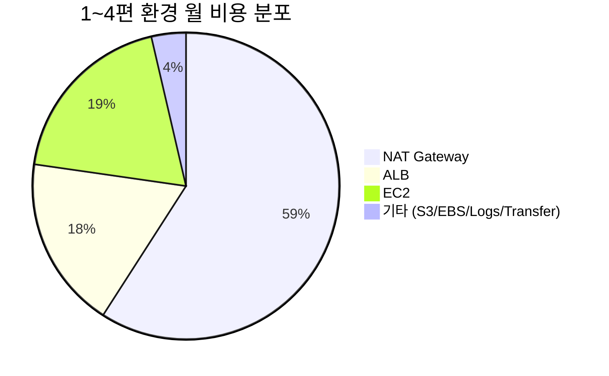

## 서론

[1편](/blog/aws-private-ec2-guide-1) ~ [4편](/blog/aws-private-ec2-guide-4)을 마치면 인프라 한 벌이 갖춰진다. 그런데 한 달이 지나 청구서를 받아보면 첫 반응은 보통 같다 — <strong>"왜 NAT Gateway가 이렇게 많지?"</strong>

마지막 편은 그 청구서를 분해한다. 어느 항목이 얼마인지, 어디서 새고 있는지, 그리고 보안·가용성을 잃지 않으면서 한 달 비용을 절반 가까이 줄이는 무기들을 정리한다.

- [1편 — 왜 Private Subnet인가?](/blog/aws-private-ec2-guide-1)
- [2편 — Terraform으로 VPC 인프라 구성하기](/blog/aws-private-ec2-guide-2)
- [3편 — SSM Session Manager로 Bastion 없이 접속하기](/blog/aws-private-ec2-guide-3)
- [4편 — GitHub Actions + SSM/CodeDeploy CI/CD 파이프라인](/blog/aws-private-ec2-guide-4)
- <strong>5편 — 비용 분석과 최적화 전략 (이 글)</strong>

이 글의 대상은 <strong>처음 받아본 AWS 청구서에 놀란 주니어</strong>다. 다 읽고 나면 어디에 돈이 가고 있는지, 어떤 한 줄을 바꾸면 한 달 $5~$30이 즉시 사라지는지, 자기 환경이 어느 시나리오에 속하는지 — 셋 다 답이 나온다.

---

## TL;DR

- <strong>NAT Gateway가 비용의 절반</strong>이다. 1~4편 환경의 baseline은 월 ~$110, 그중 ~$65이 NAT — 가장 먼저 손볼 곳.
- <strong>가장 빠른 무료 한 줄: S3 Gateway Endpoint.</strong> EC2의 S3 트래픽이 NAT을 거치지 않게 만든다 — 시간당 0원, 한 달 $5~$30 즉시 절감.
- <strong>EC2는 Right-sizing → Graviton → Savings Plans 순.</strong> 코드 변경 거의 없이 30~50% 절감이 정상이다. 1년 No-Upfront Compute Savings Plans가 균형점.
- <strong>ALB는 통합이 답.</strong> 5개 서비스에 5개 ALB는 월 $80 누수다. Listener Rule로 묶어 1개로 → 월 $25.
- <strong>예산은 시나리오로 기억한다.</strong> 사이드 ~$40, 스타트업 ~$110, 엔터프라이즈 $300+ — 자기 환경이 어디에 있는지 알면 다음 결정이 쉬워진다.

---

## 1. 1~4편 환경의 월 비용 분해

### 1.1 한눈에 보는 분해 표

기준 시나리오: 2편 구성(Multi-AZ HA + NAT 2 + ALB + EC2 2대) + 4편 파이프라인 + 가벼운 사용자 트래픽(월 데이터 전송 10GB). 서울 리전, 2026년 단가.

| 항목 | 단위 단가 | 월 비용 | 비중 |
| --- | --- | --- | --- |
| NAT Gateway × 2 (AZ별 1) | $32.40 × 2 | $64.80 | 58% |
| ALB (시간 + LCU) | $20 (low traffic) | $20.00 | 18% |
| EC2 t3.micro × 2 (on-demand) | $10.50 × 2 | $21.00 | 19% |
| EBS gp3 8GB × 2 | $0.80 × 2 | $1.60 | 1% |
| S3 (산출물 1GB + 요청) | - | $0.50 | 0.5% |
| Data Transfer Out (10GB) | $0.114/GB | $1.14 | 1% |
| CloudWatch Logs (1GB) | $0.80 | $0.80 | 1% |
| <strong>합계</strong> | | <strong>~$110</strong> | 100% |

### 1.2 무료 항목 vs 청구 항목

청구서를 처음 보면 "왜 이렇게 많지?"와 "왜 이건 0이지?"가 동시에 든다. 패턴은 단순하다.

| 무료 (시간당 0원) | 청구 (시간당 또는 GB당) |
| --- | --- |
| VPC, Subnet, Route Table, IGW | NAT Gateway, ALB, EC2 |
| Security Group, NACL | EBS Volume, EBS Snapshot |
| IAM Role, OIDC Provider | Interface VPC Endpoint, EIP·Public IP |
| S3 Gateway Endpoint | S3 Storage, S3 Request |
| SSM Session Manager (관리형 EC2) | CloudWatch Logs Ingest/Storage |
| CodeDeploy (EC2/Lambda) | Data Transfer (Out, Cross-AZ, NAT 처리) |

핵심은 <strong>"가만히 있어도 시간당 돈이 흐르는" 리소스</strong>가 누구인지 파악하는 것이다. NAT Gateway, ALB, EC2 인스턴스, EBS, EIP — 이 다섯이 청구서의 90%를 만든다.

### 1.3 어디에 돈이 새는가

위 표를 분포로 보면:



<strong>NAT 하나가 비용의 절반</strong>이라는 게 거의 모든 시리즈 환경의 공통점이다. 그래서 2절이 단일 항목으로 가장 큰 한 줄이다.

---

## 2. NAT Gateway — 가장 큰 절감 후보

### 2.1 NAT에는 두 종류의 청구가 있다

- <strong>시간당 요금</strong>: $0.045/시간 × 720시간 ≈ $32.40/월 — 트래픽 0이어도 청구된다.
- <strong>데이터 처리 요금</strong>: $0.045/GB — 통과한 모든 GB에 부과.
- 추가로 인터넷으로 나간 트래픽에는 <strong>Data Transfer Out도 별도</strong>로 부과된다.

다시 말해 <strong>NAT을 통과하는 1GB는 ~$0.045(NAT 처리) + ~$0.114(Egress) ≈ $0.16/GB</strong>가 든다. 같은 1GB를 같은 리전 S3에서 받아오면 0원이다(S3 Gateway Endpoint 경유).

### 2.2 단일 NAT vs Multi-AZ NAT

| 환경 | NAT 구성 | 월 비용 (시간만) |
| --- | --- | --- |
| 학습·개발·스테이징 | 단일 AZ | $32.40 |
| 일반 프로덕션 (HA 권장) | AZ별 1개 (2개) | $64.80 |
| 트래픽이 큰 프로덕션 | AZ별 1개 + 데이터 처리 큼 | $100+ |

Multi-AZ NAT는 2편 3.3절에서 설명한 AZ 장애 격리를 보장한다. 비용이 부담스러우면 dev/stage는 단일 NAT, prod만 Multi-AZ — 환경별 분리가 표준 패턴이다.

### 2.3 S3 Gateway Endpoint — 가장 빠른 무료 절감

EC2가 S3로 보내는·받는 트래픽이 NAT을 안 거치게 하는 게 가장 큰 한 줄 절감이다.

```hcl
resource "aws_vpc_endpoint" "s3" {
  vpc_id            = aws_vpc.main.id
  service_name      = "com.amazonaws.ap-northeast-2.s3"
  vpc_endpoint_type = "Gateway"
  route_table_ids   = [
    aws_route_table.private_a.id,
    aws_route_table.private_c.id,
  ]
}
```

- <strong>Gateway Endpoint는 시간당 0원</strong>이다 — 추가 비용 없음.
- Private Route Table에 자동으로 S3 prefix list 경로가 추가된다.
- 4편의 산출물 다운로드, CloudWatch Logs S3 export, 모든 S3 트래픽이 NAT을 거치지 않는다.

배포 산출물이 한 달 100GB 오간다면 NAT 처리 $4.50 + Egress $11.40 = ~$16/월 절감. 작은 환경에서도 5분 작업으로 한 달 $5+ 절감이 보장된다.

### 2.4 SSM Interface Endpoint — 언제 가치 있나

3편 4.2절의 비교 그대로다.

- NAT가 이미 있고 SSM 외 다른 인터넷 아웃 트래픽도 필요한 경우: <strong>NAT 재사용</strong>이 더 싸다.
- NAT를 완전히 끊고 SSM·S3·핵심 AWS만 닿게 하고 싶은 경우: <strong>Interface Endpoint × 3 + S3 Gateway Endpoint</strong>로 NAT 제거 가능. 3 endpoint × 2 AZ × $0.011/h × 720h ≈ ~$48/월 vs Multi-AZ NAT $64/월 — Endpoint 쪽이 약간 싸고, Private EC2가 인터넷에 안 닿는다는 보안 이득까지 따라온다.

### 2.5 참고: NAT Instance는 어떤가

비용을 더 줄이려고 EC2 위에 직접 NAT을 띄우는 NAT Instance 패턴(t4g.nano + iptables)도 있다. 한 달 ~$5 수준으로 압도적으로 싸다. 단점:

- HA·자동 페일오버를 직접 구성해야 한다.
- 처리량 한계가 인스턴스 사양에 묶인다.
- 보안 패치·운영 책임이 자기에게 온다.

<strong>학습·개인 프로젝트에서만 권한다</strong>. 실무 환경은 NAT Gateway가 정답이다 — 운영 시간이 곧 돈이다.

---

## 3. EC2 본체 — Right-sizing + Graviton + Savings Plans

### 3.1 Right-sizing이 가장 먼저

EC2 비용을 줄이는 가장 빠른 한 줄은 <strong>인스턴스 타입을 한 단계 낮추는 것</strong>이다. CloudWatch에서 다음을 본다:

- CPU Utilization 평균이 20% 미만 → 한 사이즈 다운 후보.
- Memory Utilization 70% 이상이면 CPU는 줄이고 메모리 비율 좋은 패밀리(`r` 패밀리 등) 검토.

`aws ce get-rightsizing-recommendation`이 자동 추천을 준다 — 보통 30~40% 절감 후보가 한두 개씩 나온다.

### 3.2 Graviton(t4g/m7g) — 큰 노력 없이 ~20%

ARM 기반 Graviton 인스턴스는 같은 사양 x86 대비 <strong>약 20% 저렴</strong>하고, JVM·Node·Python·Go는 보통 그대로 돈다. 2편의 t3.micro → t4g.micro로 옮기면:

- $10.50/월 → $8.40/월 (2대 기준 월 $4 절감)
- AMI만 ARM AL2023으로 바꾸면 끝.

> <strong>참고</strong>: 네이티브 의존성이 있는 경우(예: 일부 Python 라이브러리, 오래된 .NET) 빌드만 한번 다시 돌리면 된다. 라이선스가 x86 한정인 상용 SW가 예외.

### 3.3 Savings Plans / Reserved Instances / Spot

상시 가동 EC2의 다음 단계는 약정 할인이다.

| 옵션 | 약정 기간 | 절감 폭 | 유연성 |
| --- | --- | --- | --- |
| <strong>Spot Instance</strong> | 없음 | 최대 90% | 2분 통보 후 회수 — 비대화형/배치 전용 |
| <strong>Reserved Instance</strong> | 1년 / 3년 | 최대 72% | 인스턴스 패밀리 고정 |
| <strong>Compute Savings Plans</strong> | 1년 / 3년 | 최대 66% | 패밀리·리전·OS 자유 |
| <strong>EC2 Instance Savings Plans</strong> | 1년 / 3년 | 최대 72% | 패밀리·리전 고정, 사이즈 자유 |

대부분 <strong>1년 No-Upfront Compute Savings Plans</strong>가 균형점이다. 약정 위험이 낮고, Graviton으로 옮기거나 인스턴스 패밀리를 바꿔도 그대로 적용된다.

### 3.4 짧은 의사결정

```mermaid
flowchart TB
    Q1{인스턴스가 24x7 가동?}
    Q2{워크로드가 중단 가능?}
    SP[Compute Savings Plans 1y]
    Spot[Spot Instance]
    OD[On-Demand 유지]
    Q1 -->|예| SP
    Q1 -->|아니오| Q2
    Q2 -->|예 (배치/CI)| Spot
    Q2 -->|아니오| OD
```

---

## 4. 데이터 전송 — 잘 안 보이지만 청구서 상위

### 4.1 어떤 트래픽이 돈인가

| 경로 | 단가 | 메모 |
| --- | --- | --- |
| EC2 → 인터넷 (out) | $0.114/GB | 처음 100GB/월 무료 |
| EC2 → EC2 같은 AZ (사설 IP) | 무료 | |
| EC2 → EC2 다른 AZ | $0.01/GB × 2 | 양방향 합산 $0.02/GB |
| ALB → EC2 (cross-AZ) | $0.01/GB | ALB 백엔드 cross-AZ |
| EC2 → S3 같은 리전 (Gateway Endpoint) | 무료 | <strong>핵심</strong> |
| EC2 → S3 같은 리전 (NAT 경유) | $0.045/GB (NAT 처리) | Endpoint 안 쓸 때 |
| EC2 → 다른 리전 | $0.02/GB | 대부분의 cross-region |

### 4.2 ALB 비용 — 시간 + LCU

ALB는 두 가지로 청구된다:

- <strong>시간당</strong>: $0.0225/시간 × 720h ≈ $16.20/월 — 트래픽 0이어도 부과.
- <strong>LCU(Load Balancer Capacity Unit)</strong>: $0.008/LCU-시간 — 4가지 차원(새 연결, 활성 연결, 처리 바이트, 룰 평가)의 max.

가벼운 트래픽: ~$20/월. 트래픽이 늘면 LCU만 올라간다. 작은 서비스 5개에 ALB 5개를 두는 대신 <strong>ALB 1개 + Listener Rule로 host/path-based 라우팅</strong>이 보통 정답이다 — 월 $80 → $25.

### 4.3 ALB 통합 — Listener Rule로 묶기

```hcl
resource "aws_lb_listener_rule" "service_a" {
  listener_arn = aws_lb_listener.https.arn
  priority     = 10
  action {
    type             = "forward"
    target_group_arn = aws_lb_target_group.service_a.arn
  }
  condition {
    host_header {
      values = ["a.example.com"]
    }
  }
}
```

5개 서비스 → ALB 1개 + Listener Rule 5개. 비용 영향이 가장 큰 단일 변경 중 하나다. 단, 한 ALB에 너무 많은 룰을 묶으면 LCU의 룰 평가 차원이 비싸질 수 있어 50개 이상이면 분리를 검토.

---

## 5. 비용 가시성 — Tag, Budgets, Anomaly

### 5.1 태그 정책이 먼저다

비용을 보려면 비용에 라벨이 붙어 있어야 한다. 모든 리소스에 다음 4개 태그를 박는 게 표준이다.

| 태그 키 | 예시 값 | 용도 |
| --- | --- | --- |
| `Env` | `dev`, `staging`, `prod` | 환경별 비용 분리 |
| `App` | `myapp`, `internal-tool` | 서비스별 비용 |
| `Owner` | `team-platform` | 누가 책임지나 |
| `CostCenter` | `R&D`, `Marketing` | 회계 카테고리 |

태그 정책(Tag Policy)으로 강제 가능하고, Cost Explorer에서 태그를 활성화해야 비용 차원으로 잡힌다(설정 > 비용 할당 태그 > 활성화).

### 5.2 AWS Budgets — 예산 알림

월 예산을 넘기 전에 알리는 가장 단순한 도구.

```hcl
resource "aws_budgets_budget" "monthly" {
  name         = "monthly-cap"
  budget_type  = "COST"
  limit_amount = "150"
  limit_unit   = "USD"
  time_unit    = "MONTHLY"

  notification {
    comparison_operator        = "GREATER_THAN"
    threshold                  = 80
    threshold_type             = "PERCENTAGE"
    notification_type          = "FORECASTED"
    subscriber_email_addresses = ["ops@example.com"]
  }
}
```

`FORECASTED`로 잡으면 "이 추세대로면 월말에 한도를 넘는다"는 시점에 알림이 온다 — 사후 청구서를 보고 놀라는 일이 없어진다.

### 5.3 Cost Anomaly Detection — 자동 이상 감지

AWS가 ML로 평소 패턴을 학습해서 <strong>갑자기 솟구치는 비용</strong>(예: 잘못 띄운 NAT 5개, 닫지 않은 t3.xlarge)을 감지해 알린다. 한 번 켜두면 모니터링이 알아서 돈다.

콘솔의 Cost Management → Cost Anomaly Detection에서 Monitor를 한 번 만들면 끝. 사고가 한 번이라도 있었던 환경에서는 켜는 게 무조건 정답.

---

## 6. 시나리오별 예산

### 6.1 사이드 프로젝트 — ~$40/월

가용성·HA 신경 안 씀. NAT 1개·EC2 1대.

| 항목 | 월 |
| --- | --- |
| NAT Gateway × 1 | $32.40 |
| EC2 t4g.nano × 1 (Graviton) | $4.20 |
| EBS 8GB | $0.80 |
| Public IP / EIP | $3.60 |
| <strong>합계</strong> | <strong>~$41</strong> |

ALB는 빼고 EC2에 직접 도메인을 붙인다. Multi-AZ는 포기. 더 줄이고 싶다면 Public Subnet으로 옮겨서 NAT까지 제거 — 월 ~$15까지 내려간다(1편의 "사이드 프로젝트는 Public Subnet + SG로도 충분"이 그 시나리오).

### 6.2 스타트업 / MVP — ~$110/월

1~4편 baseline 그대로. Multi-AZ HA + ALB + EC2 2대 + 파이프라인.

| 항목 | 월 |
| --- | --- |
| NAT Gateway × 2 | $64.80 |
| ALB | $20.00 |
| EC2 t4g.micro × 2 (Graviton) | $16.80 |
| EBS, S3, Logs, Transfer | ~$5 |
| <strong>합계</strong> | <strong>~$107</strong> |

Compute Savings Plans 1년 적용 시 EC2 부분이 ~30% 절감, S3 Gateway Endpoint 추가로 NAT 데이터 처리비도 줄어 총 ~$95까지 내려간다.

### 6.3 엔터프라이즈 / 컴플라이언스 — $300+/월

Interface VPC Endpoint 추가, EC2 더 큰 사양, RDS Multi-AZ, KMS, WAF, CloudWatch Logs 보존 1년.

| 항목 | 월 |
| --- | --- |
| NAT Gateway × 2 | $64.80 |
| Interface VPC Endpoint × 3 × 2AZ | $48 |
| ALB + WAF | $35 |
| EC2 t4g.medium × 2 + Savings Plans | $50 |
| RDS Multi-AZ (db.t4g.medium) | $80+ |
| CloudWatch Logs (10GB/월) | $10 |
| KMS, Secrets Manager | $5 |
| <strong>합계</strong> | <strong>$300+</strong> |

이 단계에서는 한 항목 한 항목보다 <strong>비용 가시성과 거버넌스</strong>가 더 중요하다. 5절의 태그·Budgets·Anomaly가 필수 인프라가 된다.

---

## 7. 자주 빠지는 함정 — 체크리스트

청구서가 비정상적으로 튀었을 때 이 순서로 본다.

- ☐ <strong>미연결 EIP / 미사용 Public IP</strong> — 시간당 $0.005 = ~$3.60/월씩. 여러 개 쌓이면 큰 돈.
- ☐ <strong>중지된 EC2의 EBS</strong> — 인스턴스를 stop했어도 EBS는 그대로 청구된다.
- ☐ <strong>오래된 EBS Snapshot</strong> — 자동 백업이 누적되면 GB×$0.05/월.
- ☐ <strong>NAT으로 가는 S3 트래픽</strong> — Gateway Endpoint 안 만들면 NAT 처리비 + Egress가 둘 다 잡힌다.
- ☐ <strong>CloudWatch Logs 보존 무기한</strong> — 기본이 "Never expire". 30일 또는 90일로 retention 설정.
- ☐ <strong>S3 Versioning + Lifecycle 미설정</strong> — 산출물 버킷에 버전이 쌓이면 폭발한다. SHA-키 방식이면 90일 후 Glacier IR 또는 Delete.
- ☐ <strong>cross-AZ chatty traffic</strong> — 같은 서비스의 두 컴포넌트가 AZ 다르고 트래픽이 많으면 inter-AZ 비용이 크다.
- ☐ <strong>잊혀진 dev/stage 환경</strong> — 24x7 켜둔 dev는 prod의 1/3쯤 든다. Instance Scheduler로 야간·주말 자동 stop.
- ☐ <strong>ALB 5개 이상</strong> — 호스트/패스 라우팅으로 묶을 수 있는지 검토(4.3절).
- ☐ <strong>cross-region 트래픽</strong> — 별 의도 없이 다른 리전 S3나 DynamoDB를 부르고 있지 않은지.

---

## 정리

이 글에서 얻고 가야 할 것:

1. <strong>NAT Gateway가 비용의 절반</strong>이다. 1번 후보, 1번 무기는 S3 Gateway Endpoint(무료) — 5분 작업으로 한 달 $5+ 즉시 절감.
2. <strong>Multi-AZ HA는 운영 가치 vs 비용의 트레이드오프</strong>다. dev/stage는 단일 NAT, prod만 Multi-AZ가 표준 패턴.
3. <strong>EC2는 Right-sizing → Graviton → Savings Plans 순으로 손본다.</strong> 코드 변경 0~소량으로 30~50% 절감이 정상이다.
4. <strong>ALB는 통합이 답.</strong> 서비스마다 ALB를 따로 띄우면 월 수십 달러가 새고, Listener Rule로 묶으면 1/4로 줄어든다.
5. <strong>비용 가시성이 절감보다 먼저다.</strong> 태그·Budgets·Anomaly가 없으면 어디를 손볼지조차 모른다.
6. <strong>예산은 시나리오로 기억한다.</strong> 사이드 ~$40, 스타트업 ~$110, 엔터프라이즈 $300+ — 자기 환경이 어디에 있는지 알면 다음 결정이 쉬워진다.

5편의 목표는 하나였다 — <strong>1~4편이 만든 환경의 청구서를 읽고, 자신 있게 절감 결정을 내릴 수 있는 상태</strong>. 이제 NAT 한 줄, EC2 한 사이즈, ALB 한 개를 고치며 한 달에 $30~$50을 자유롭게 옮길 수 있다.

이로써 시리즈 5편이 모두 끝난다. 1편의 "왜 Private Subnet인가"부터 5편의 "그 환경의 청구서 분해"까지 — Private EC2 운영의 처음과 끝이 한 벌로 갖춰졌다. 새 서비스를 띄울 때, 동료의 AWS 청구서를 받았을 때, 면접에서 VPC 그림을 그릴 때, 각 편의 결론을 한 줄씩 끄집어내 쓸 수 있으면 이 시리즈의 목표는 다한 것이다.

---

## 부록

### A. 청구서를 빠르게 보는 5가지 명령

```bash
# 1. 이번 달 누적 비용
aws ce get-cost-and-usage \
  --time-period Start=$(date -u +%Y-%m-01),End=$(date -u +%Y-%m-%d) \
  --granularity MONTHLY \
  --metrics UnblendedCost \
  --query "ResultsByTime[0].Total.UnblendedCost"

# 2. 서비스별 비용
aws ce get-cost-and-usage \
  --time-period Start=$(date -u +%Y-%m-01),End=$(date -u +%Y-%m-%d) \
  --granularity MONTHLY \
  --metrics UnblendedCost \
  --group-by Type=DIMENSION,Key=SERVICE

# 3. 미연결 EIP 찾기
aws ec2 describe-addresses \
  --query "Addresses[?AssociationId==null].[PublicIp,AllocationId]" \
  --output table

# 4. 보존 무기한 CloudWatch Log Group
aws logs describe-log-groups \
  --query "logGroups[?retentionInDays==null].logGroupName" \
  --output table

# 5. Right-sizing 추천
aws ce get-rightsizing-recommendation \
  --service AmazonEC2 \
  --query "RightsizingRecommendations[].[CurrentInstance.ResourceId,RightsizingType]"
```

### B. 무료 한도(Free Tier) 빠른 정리 — 첫 12개월

| 서비스 | 무료 한도 |
| --- | --- |
| EC2 | t2.micro/t3.micro 750시간/월 |
| EBS | 30GB gp2/gp3 |
| S3 | 5GB Standard |
| Data Transfer Out | 100GB/월 (전 서비스 누적) |
| CloudWatch | 10 metrics + 5GB Log |
| ELB / ALB | 750시간 |

학습용으로 1편 환경을 그대로 띄우면 NAT Gateway 외 대부분이 Free Tier로 들어간다. NAT가 약 $32/월로 단일 항목 최대.

### C. 다음 행동 한 줄

이 글을 닫고 가장 먼저 할 한 줄은 — <strong>지난달 어디에 가장 많이 썼는지</strong> 확인하는 것이다.

```bash
aws ce get-cost-and-usage \
  --time-period Start=$(date -u -v-1m +%Y-%m-01),End=$(date -u +%Y-%m-01) \
  --granularity MONTHLY \
  --metrics UnblendedCost \
  --group-by Type=DIMENSION,Key=SERVICE
```

상위 3개 서비스가 보일 것이다. 거기서부터 2~4절의 절감 기법을 차례로 적용한다 — 시리즈 전체가 그 한 줄을 위한 길었다.
