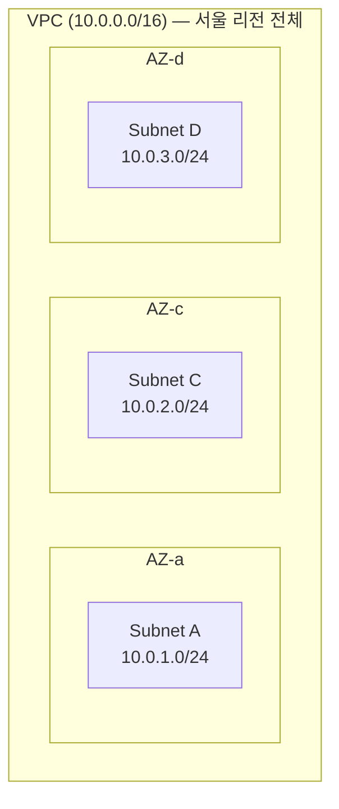
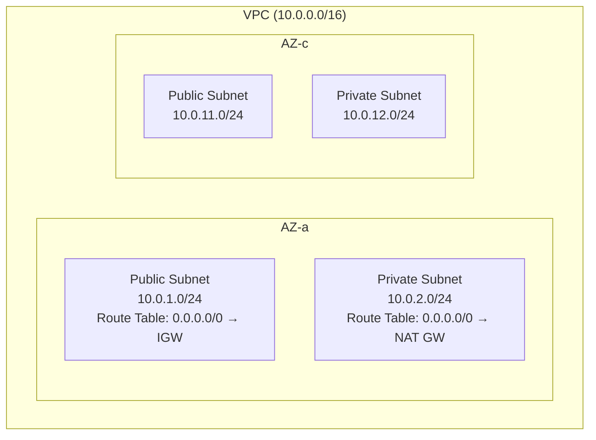
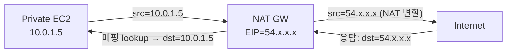
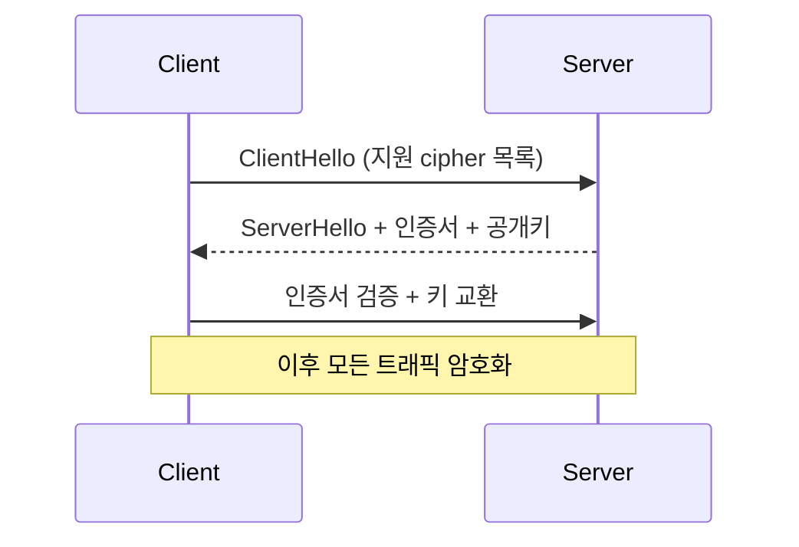
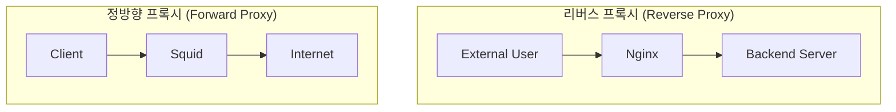

## 서론

AWS 네트워크 글을 처음 펼치면 절반 이상이 약어와 jargon이다. ALB·NLB·API Gateway·VPC Endpoint·CIDR·ENI·NAT GW·NACL — 본문에 던져지는데 정작 그게 뭔지 풀어주는 자리가 없다. <strong>"이게 다 뭔지 모르는데 어떻게 결정 트리를 따라가지?"</strong>가 자연스러운 반응이다.

이 글은 거기서 출발한다. 1·2·3편의 결정 트리에 들어가기 전에 <strong>네트워크 기초 + AWS 핵심 서비스를 한 페이지에 정리한 사전편</strong>이다. 이 글을 다 읽고 나면 1·2·3편을 따라가다 막히는 용어가 거의 없는 상태가 된다.

- <strong>0편 — 사전편: 네트워크·AWS 기본 개념 정리 (이 글)</strong>
- 1편 — 외부 진입점 선택: ALB / NLB / API Gateway / CloudFront / Global Accelerator
- 2편 — VPC 간·온프레미스 연결: VPC Endpoint / PrivateLink / Peering / Transit Gateway / VPN / Direct Connect
- 3편 — VPC 내부 라우팅: IGW / NAT GW / Route Tables / Security Group vs NACL
- 4편 — DNS 결정과 Route 53: Hosted Zone / Routing Policy / Alias vs CNAME / Health Check
- 5편 — 표준 패턴 4가지: 결정 트리에서 처음 그릴 때까지

대상 독자는 "AWS 콘솔은 만져봤지만 OSI L4/L7 차이가 뭔지, CIDR 표기를 어떻게 읽는지, ENI는 또 뭔지 막막한" 백엔드/인프라 엔지니어. 시리즈 본격편(1·2·3편)을 1초 막힘 없이 따라갈 수 있는 상태로 만드는 게 목표다.

---

## TL;DR

- <strong>OSI 7-layer 중 L4(전송 — TCP/UDP)와 L7(응용 — HTTP)이 시리즈 첫 분기점</strong>이다. NLB는 L4, ALB·API Gateway·CloudFront는 L7.
- <strong>VPC = AWS 안에 만드는 가상 네트워크</strong>. IP 대역(주소 범위)은 `시작IP/prefix길이` 표기로 지정하고, Subnet은 가용 영역 단위로 쪼개 쓴다. <strong>Public/Private subnet의 차이는 단지 Route Table에 인터넷 게이트웨이 경로가 있느냐 없느냐</strong>다.
- <strong>탄력적 네트워크 인터페이스는 VPC에 사설 IP를 갖고 붙는 가상 네트워크 인터페이스 카드</strong>다. EC2·RDS·Lambda·ALB 등 VPC에 연결되는 모든 리소스가 최소 1개 가진다 — 사설 IP·보안 그룹·EIP가 모두 탄력적 네트워크 인터페이스 단위로 결합.
- <strong>리버스 프록시는 클라이언트 요청을 백엔드 대신 받아 분배하는 중계자</strong>다. ALB·API Gateway·CloudFront는 모두 "AWS 매니지드 리버스 프록시 + 부가 기능"으로 볼 수 있다.
- <strong>AWS 핵심 서비스는 컴퓨트(EC2/ECS/EKS/Lambda) · 스토리지/DB(S3/EBS/RDS/DynamoDB) · 메시징(SQS/SNS) · 로드밸런서(ALB/NLB) · CDN(CloudFront) · 인증(IAM/Cognito/KMS)</strong> 정도로 분류된다.

---

## 1. OSI 7-layer 모델 — L4 vs L7이 시리즈 첫 분기점

네트워크 통신을 추상화한 모델 중 가장 자주 쓰이는 게 <strong>OSI(Open Systems Interconnection) 7-layer 모델</strong>이다. 1980년대 ISO가 정의한 표준으로, 통신을 7개 계층으로 나눠 각 계층이 자기 책임만 처리하도록 설계됐다.

| 계층 | 이름 | 핵심 책임 | 대표 프로토콜·예시 | 본 시리즈에서 |
| --- | --- | --- | --- | --- |
| L7 | 응용 (Application) | 사용자 앱이 직접 다루는 메시지 | HTTP, gRPC, WebSocket, DNS, SMTP | <strong>ALB · API Gateway · CloudFront</strong> |
| L6 | 표현 (Presentation) | 암호화·인코딩·포맷 변환 | TLS, SSL | TLS 종료 (관련) |
| L5 | 세션 (Session) | 연결 수립·유지·종료 | NetBIOS, RPC | 거의 안 등장 |
| L4 | 전송 (Transport) | 포트·신뢰성·흐름 제어 | <strong>TCP, UDP</strong> | <strong>NLB</strong> |
| L3 | 네트워크 (Network) | IP 주소·라우팅 | <strong>IP, ICMP</strong> | VPC Peering · Route Table |
| L2 | 데이터링크 (Data Link) | MAC 주소·프레임 | Ethernet, ARP | 거의 안 등장 |
| L1 | 물리 (Physical) | 케이블·전기 신호 | Ethernet 케이블, Wi-Fi 무선 | — |

이 시리즈에서 알아야 할 건 <strong>L3, L4, L7</strong> 셋. 나머지는 거의 등장하지 않는다.

### 1.1 L3 — 네트워크 계층 (IP)

- <strong>IP 주소</strong>로 장치를 식별하고 패킷을 라우팅하는 계층.
- IPv4(32비트, 약 43억 개)와 IPv6(128비트, 사실상 무한)이 있다.
- VPC Peering·Route Table 같은 개념이 L3 라우팅 결정.

### 1.2 L4 — 전송 계층 (TCP/UDP)

- <strong>TCP</strong>(Transmission Control Protocol): 연결 기반, 신뢰성 보장. 패킷 손실 시 재전송, 순서 보장. HTTP·DB 연결 등.
- <strong>UDP</strong>(User Datagram Protocol): 비연결, 신뢰성 없음. 빠르지만 손실 가능. DNS 쿼리·게임·VoIP·실시간 스트리밍.
- L4 라우팅 = <strong>패킷의 IP·port만 보고</strong> 어디로 보낼지 결정. HTTP 메시지 내용은 모름.
- 대표 AWS 서비스: <strong>NLB</strong>(Network Load Balancer).

### 1.3 L7 — 응용 계층 (HTTP)

- 사용자 애플리케이션이 직접 다루는 계층. HTTP·gRPC·WebSocket·DNS·SMTP 모두 L7.
- L7 라우팅 = <strong>HTTP 메시지의 host·path·header·cookie까지 보고</strong> 결정.
- 대표 AWS 서비스: <strong>ALB·API Gateway·CloudFront</strong> 모두 L7.

### 1.4 L4 vs L7 비교 — 결정 영향

| | L4 | L7 |
| --- | --- | --- |
| 의사결정 단위 | IP·port | host·path·header·cookie |
| 속도 | 빠름 (헤더만 처리) | 느림 (메시지 파싱 필요) |
| 처리 가능 프로토콜 | TCP·UDP·임의 바이너리 | HTTP·HTTPS·gRPC·WebSocket |
| 라우팅 유연성 | 낮음 | 높음 |
| 대표 AWS 서비스 | NLB, Global Accelerator | ALB, API Gateway, CloudFront |
| 비용 (대체로) | L7보다 저렴 | L7이 더 비쌈 |

핵심: <strong>"HTTP 의미를 진입점이 알아야 하는가"</strong>가 첫 갈림길. host·path 라우팅이나 HTTPS 종료가 필요하면 L7, 아니면 L4.

> <strong>참고 — URI vs URL</strong>: 위 표에서 "L7은 host·path·header·cookie를 본다"고 했는데, 이때 <strong>path는 정확히는 URI의 path 컴포넌트</strong>다. URI(Uniform Resource Identifier)는 자원을 식별하는 모든 문자열, URL(Uniform Resource Locator)은 그중 위치 정보가 있는 부분집합 — 즉 <strong>URI ⊃ URL</strong>의 관계다. `https://api.example.com/users/123?id=42`에서 `/users/123` 부분을 ALB·API Gateway가 라우팅에 쓴다. 실무 대화에서는 "URL의 path"라고 해도 거의 통하지만, HTTP RFC(7230·9110)나 Java `java.net.URI`/`URL` 클래스 같은 표준에서는 URI가 더 정확한 용어 — 차이를 알면 RFC·라이브러리 문서를 읽을 때 막히지 않는다.

> <strong>참고 — TLS는 L4인가 L7인가</strong>: TLS는 엄밀히 L6(표현 계층)지만 실무에서는 "L4(TCP) 위에서 동작하는 암호화 layer"로 언급되는 경우가 많다. NLB도 TLS listener를 지원해서 "L4 진입점이지만 TLS 종료는 한다"는 시나리오가 가능 — 본 시리즈에서 자주 등장.

---

## 2. VPC와 그 구성 요소

<strong>VPC(Virtual Private Cloud) = AWS 안에 격리해 만드는 가상 네트워크</strong>. 한 AWS 계정 안에서 여러 VPC를 만들 수 있고, 각 VPC는 독립된 IP 대역·라우팅·보안 정책을 가진다.

### 2.1 VPC의 범위 — 리전 전체

VPC는 <strong>한 리전(Region) 전체에 걸친다</strong>. 즉 서울 리전(ap-northeast-2)에 VPC를 만들면 그 리전의 모든 AZ를 잠재적으로 커버한다.



- <strong>리전(Region)</strong>: 지리적으로 분리된 데이터센터 군집. 전 세계 ~30개 (서울·도쿄·버지니아·프랑크푸르트 등).
- <strong>AZ(Availability Zone)</strong>: 한 리전 안의 물리적으로 분리된 데이터센터 단위. 서울 리전엔 <strong>4개의 물리적 AZ</strong>가 있다 — 콘솔에는 `ap-northeast-2a/b/c/d`로 보이지만 이 이름은 <strong>계정마다 다른 물리 AZ에 매핑</strong>되어 일부 계정엔 `b`가 안 보이고 `a, c, d`만 보일 수도 있다. 전역 식별자는 `apne2-az1~az4`이고 `aws ec2 describe-availability-zones`로 자기 계정 매핑을 확인할 수 있다.
- <strong>Multi-AZ</strong>: 한 AZ가 장애나도 다른 AZ가 처리하도록 분산 배치. HA(High Availability)의 기본.

### 2.2 CIDR — IP 대역을 표기하는 방식

<strong>CIDR(Classless Inter-Domain Routing)은 IP 주소 대역을 `시작IP/prefix길이`로 표기하는 방식</strong>이다. VPC·Subnet·Route Table·SG 어디서나 IP 범위를 지정할 때 이 표기를 쓴다.

`10.0.0.0/16`을 읽으면:
- `10.0.0.0` = 시작 IP
- `/16` = 앞에서 16비트가 네트워크 부분 (고정), 나머지 16비트가 호스트 부분 (변동)
- 즉 `10.0.0.0` ~ `10.0.255.255`의 65,536개 IP 묶음

### 자주 쓰이는 prefix 길이

| 표기 | IP 개수 | 흔한 용도 |
| --- | --- | --- |
| `/8` | 16,777,216 | 거대 사설망 (예: `10.0.0.0/8` 전체) |
| `/16` | 65,536 | <strong>VPC 표준 크기</strong> |
| `/20` | 4,096 | 큰 Subnet |
| `/24` | 256 | <strong>Subnet 표준 크기</strong> |
| `/28` | 16 | 작은 Subnet (AWS 최소 크기) |
| `/32` | 1 | 개별 IP 화이트리스트 |
| `/0` | 전체 (43억) | default route (`0.0.0.0/0` = "모든 IP") |

핵심 직관:
- <strong>prefix 숫자가 작을수록 큰 범위</strong> (즉 `/16`은 `/24`보다 256배 큼)
- <strong>`0.0.0.0/0`은 "모든 IP"</strong>를 의미 — Route Table에 default 경로 설정 시 자주 등장
- <strong>"longest-prefix match"</strong> = 더 긴 prefix(더 구체적인 CIDR)가 라우팅 결정에서 이긴다

> <strong>참고 — CIDR과 넷마스크(netmask)의 관계</strong>: CIDR과 넷마스크는 <strong>같은 정보의 두 가지 표기법</strong>이다. 둘 다 IP의 어디까지가 네트워크 부분이고 어디부터가 호스트 부분인지를 표현 — `/16` (CIDR) = `255.255.0.0` (넷마스크), `/24` = `255.255.255.0`. 변환 규칙은 "넷마스크 이진수의 연속된 1의 개수 = CIDR prefix 길이"(`255.255.0.0` = `11111111.11111111.00000000.00000000` = 1이 16개 → `/16`). 1993년 CIDR 도입(RFC 1518/1519) 전에는 IP가 <strong>클래스풀(A=`/8`, B=`/16`, C=`/24` 고정)</strong>이었는데, "1,000명 회사는 C(256개)는 모자라고 B(65K)는 과도"한 자원 낭비 문제로 임의 prefix를 허용하는 CIDR이 등장. 모던 AWS·Linux 도구는 CIDR이 표준이고 넷마스크는 구 Windows·가정용 공유기 설정 화면에서 주로 본다 — 본 시리즈는 모든 IP 대역을 CIDR로 표기.

### 2.3 Subnet — VPC 내부 IP 대역 + AZ 1개

<strong>Subnet은 VPC의 IP 대역을 더 작게 쪼갠 단위</strong>다. Subnet 하나는 정확히 1개 AZ에 속한다.



### Public vs Private Subnet의 진짜 차이

가장 흔한 오해: "Public/Private은 물리적으로 다른 격리." <strong>실제는 같은 VPC 안에서 Route Table 설정 한 줄 차이</strong>다.

| | Public Subnet | Private Subnet |
| --- | --- | --- |
| Route Table에 `0.0.0.0/0 → IGW` | <strong>O</strong> | X |
| Route Table에 `0.0.0.0/0 → NAT GW` | X | <strong>O</strong> |
| 외부에서 인바운드 가능 | O (인스턴스에 공인 IP 있을 때) | X |
| 인스턴스의 outbound | IGW로 직접 | NAT GW를 통해 |
| 적합한 리소스 | ALB, NAT GW, Bastion | EC2 앱 서버, RDS, ECS Task |

이 차이를 이해하면 시리즈 전체가 훨씬 잘 읽힌다 — Public/Private은 "물리적 격리"가 아니라 "라우팅 정책"이다.

### 2.4 Route Table — 패킷이 어디로 갈지 결정

<strong>Route Table은 (목적지 CIDR, 다음 hop)의 매핑</strong>이다. Subnet마다 하나씩 연결된다(또는 VPC 메인 RT 공유). 패킷이 들어오면 destination IP를 보고 가장 일치하는 CIDR 경로를 찾아 다음 hop으로 보낸다.

```text
| Destination | Target |
| 10.0.0.0/16 | local |          ← VPC 내부 (변경 불가)
| 10.1.0.0/16 | tgw-aaa |        ← Transit Gateway로
| 0.0.0.0/0   | igw-bbb |        ← 그 외는 IGW로 (Public Subnet)
```

핵심:
- <strong>local 경로</strong>(VPC CIDR)는 자동 생성·삭제 불가. 같은 VPC 안 통신은 항상 local로.
- <strong>longest-prefix match</strong>로 평가 — `/24`가 `/16`보다 우선.
- Subnet과 RT는 1대1 또는 N대1 관계 — 한 RT를 여러 Subnet이 공유 가능.

---

## 3. 네트워크 인터페이스 — ENI / EIP / Source NAT

VPC 안의 모든 통신은 네트워크 인터페이스를 거친다. AWS는 이걸 <strong>ENI(Elastic Network Interface)</strong>라는 추상화로 노출한다.

### 3.1 ENI — VPC 안의 가상 NIC

<strong>ENI(Elastic Network Interface) = VPC에 사설 IP를 갖고 붙는 가상 NIC</strong>(Network Interface Card). 실물 서버의 NIC를 클라우드에서 가상화한 것.

### ENI를 갖는 리소스

VPC에 연결되는 거의 모든 것이 적어도 1개씩 가진다:

| 리소스 | ENI 개수 |
| --- | --- |
| EC2 인스턴스 | 인스턴스당 최소 1, 추가 attach 가능 |
| RDS 인스턴스 | 1개 (서비스용) |
| Lambda (VPC 연결 시) | 자동 생성 |
| ALB / NLB | attach된 각 AZ당 1개 |
| Interface Endpoint | 자기 ENI 1개 |
| ECS Task (awsvpc 모드) | task당 1개 |

### 왜 따로 추상화돼 있나 — "IP·SG가 인스턴스에서 분리됨"

핵심 이점은 <strong>인스턴스 교체해도 ENI는 살아남는다</strong>는 것:

- EC2의 IP가 EC2 안에 박혀 있으면 인스턴스 교체 시 IP 변경 → DB connection string 다 바꿔야 함
- ENI를 따로 만들어 EC2에 attach해두면 새 EC2에 같은 ENI를 붙일 수 있어 IP·SG·EIP 그대로 유지

추가 능력:

- <strong>Multi-homing</strong>: 한 EC2에 ENI 여러 개 (관리망 + 서비스망 분리)
- <strong>SG는 ENI 단위로 붙음</strong> — 인스턴스가 아니라 인터페이스 별
- <strong>EIP는 ENI에 attach</strong> — 직접 인스턴스 attach 아님

### 3.2 EIP — 고정 공인 IP

<strong>EIP(Elastic IP) = 사용자가 명시적으로 할당하고 명시적으로 릴리스할 때까지 고정되는 공인 IPv4 주소</strong>다. 일반적인 EC2 Public IP와 다음과 같이 다르다:

| | Public IPv4 (자동) | EIP |
| --- | --- | --- |
| 할당 방식 | EC2 시작 시 자동 부여 | 사용자가 직접 할당 |
| 수명 | EC2 stop/start 시 변경 | 명시적 릴리스 시까지 고정 |
| 비용 | 시간당 $0.005 | 실행 중 EC2에 연결 시 동일. 미연결 시에도 과금 |
| 용도 | 임시 테스트 | DNS 연결, 화이트리스트, NAT GW의 외부 IP |

> <strong>참고 — EIP를 할당해놓고 안 쓰면 오히려 더 비싸다</strong>: AWS가 IPv4 부족 문제로 "할당해놓고 안 쓰면 패널티 과금"을 매긴다. 안 쓸 거면 릴리스하는 게 원칙.

### 3.3 NAT — Source Network Address Translation

<strong>NAT(Network Address Translation) = IP 주소를 변환하는 기술</strong>. 사설 IP를 갖는 인스턴스가 외부와 통신할 때 사설 IP를 공인 IP로 바꿔서 보낸다.



- <strong>Source NAT</strong>: outbound 트래픽의 source IP를 사설 → 공인으로 변환. 외부에서 보면 모든 트래픽이 NAT GW의 EIP에서 오는 것처럼.
- <strong>NAT 매핑 테이블</strong>: 응답 트래픽이 돌아올 때 어느 인스턴스로 라우팅할지 lookup.
- <strong>아웃바운드 전용</strong>: 외부에서 인스턴스로의 인바운드는 불가능 — 매핑은 outbound 시점에만 생성.

이 메커니즘이 NAT GW의 본질이다. Private Subnet의 EC2가 외부 API·OS 패치·로그 전송에 접근할 수 있게 해주는 통로.

> <strong>참고 — IPv6는 왜 NAT가 필요 없나</strong>: IPv6는 사설/공인 구분이 없고 주소가 충분해서 모든 인스턴스가 직접 공인 주소를 가진다. 그래서 NAT 변환 불필요 — 대신 "outbound는 OK 인바운드는 차단"하는 방화벽 역할만 필요해서 <strong>Egress-only IGW</strong>가 그 자리를 채운다.

---

## 4. 암호화·인증 기본

API 진입점 결정에 자주 등장하는 보안·인증 jargon을 짚는다.

### 4.1 HTTP / HTTPS / TLS

- <strong>HTTP</strong>(HyperText Transfer Protocol): 평문 웹 통신 프로토콜. L7.
- <strong>HTTPS</strong>(HTTP Secure): TLS로 암호화된 HTTP. 표준 포트 443.
- <strong>TLS</strong>(Transport Layer Security): 암호화 프로토콜. 이전 이름은 SSL.

### TLS 핸드셰이크 짧게



- <strong>인증서</strong>(Certificate): 도메인 소유자가 정당한지 CA(Certificate Authority)가 서명한 공개키. AWS에선 ACM(AWS Certificate Manager)이 관리.
- <strong>RTT</strong>(Round Trip Time): 패킷 왕복 시간. TLS 핸드셰이크는 RTT 2~3번 소비.

### TLS 종료 (Termination)

진입점이 TLS를 풀어서 이후 백엔드와는 평문(또는 새 TLS)으로 통신하는 패턴. ALB·API Gateway·CloudFront 모두 TLS 종료 지원. 백엔드 부담을 줄이고 인증서 관리를 한 곳에 집중하는 효과.

### 4.2 mTLS — 양방향 TLS

<strong>mTLS(Mutual TLS) = 서버뿐만 아니라 클라이언트도 인증서로 자신을 증명</strong>하는 양방향 TLS.

| | 일반 TLS (서버 인증) | mTLS (양방향) |
| --- | --- | --- |
| 서버 → 클라이언트 인증 | O | O |
| 클라이언트 → 서버 인증 | X (별도 토큰·세션 필요) | <strong>O (인증서로 직접)</strong> |
| 사용 사례 | 일반 웹 트래픽 | B2B API, 마이크로서비스 mesh, 정부·금융 |

API Gateway REST API는 mTLS를 지원하지만 HTTP API는 미지원 — 1편에서 REST/HTTP 갈림길의 한 변수.

### 4.3 인증 jargon — JWT / OIDC / SAML / OAuth / IAM / Cognito

API Gateway 같은 매니지드 진입점이 "인증" 기능을 자랑할 때 자주 등장하는 용어들.

#### Authentication vs Authorization

- <strong>인증(Authentication)</strong>: "누구인가?"를 확인. 로그인.
- <strong>인가(Authorization)</strong>: "무엇을 할 권한이 있는가?"를 결정.

이 둘은 자주 혼용되지만 다른 결정. 보통 함께 처리.

#### 표준 프로토콜

| 약어 | 정의 | 어디 쓰이나 |
| --- | --- | --- |
| <strong>OAuth 2.0</strong> | 인가(Authorization) 위임 표준 — "사용자가 X 서비스에게 자기 데이터 접근을 위임" | Google·Facebook·GitHub 로그인 백엔드 |
| <strong>OIDC</strong> (OpenID Connect) | OAuth 2.0 위에 인증(Authentication) layer를 얹은 표준 — "이 사용자가 누구인지 확인". JSON·JWT 기반 | 모바일·SPA·API 친화적 모던 SSO |
| <strong>SAML</strong> (Security Assertion Markup Language) | OASIS가 2002년 표준화한 XML 기반 SSO 프로토콜. OIDC보다 오래되고 엔터프라이즈에서 표준 | <strong>AWS IAM Identity Center</strong>(구 AWS SSO) · IAM SAML Federation · Okta·Azure AD 같은 사내 IdP 연동 |
| <strong>JWT</strong> (JSON Web Token) | 서명된 JSON 토큰. 서버가 발행하면 클라이언트가 매 요청에 첨부 — "이게 검증된 토큰임" | OIDC 응답·세션 토큰·API Gateway Authorizer |
| <strong>IAM</strong> (Identity and Access Management) | AWS의 권한·접근 관리 시스템. 사용자·역할(Role)·정책(Policy)으로 구성 | AWS 리소스 접근 통제 (모든 AWS 서비스) |
| <strong>Cognito</strong> | AWS 매니지드 사용자 풀 + 인증 서비스. OIDC·SAML 모두 IdP로 연동 가능 | 모바일·웹 앱의 사용자 로그인 백엔드 |

> <strong>OIDC vs SAML</strong> — 둘 다 SSO 표준이지만 사용처가 다르다. <strong>OIDC는 JSON·JWT 기반</strong>으로 모바일·SPA·API 친화적이라 컨슈머 앱·신규 시스템의 표준이 됐고, <strong>SAML은 XML 기반</strong>으로 2000년대 초부터 엔터프라이즈 SSO의 표준 — Okta·Microsoft Azure AD·OneLogin·Ping Identity 같은 사내 IdP가 모두 SAML을 backbone으로 한다. AWS 측에서도 <strong>IAM Identity Center는 SAML이 backbone</strong>이고, Cognito User Pool은 둘 다 IdP로 받아들일 수 있다. "어느 걸 쓰나" 판단은 단순: <strong>사내 SSO·B2B 통합이면 SAML, 외부 사용자·모바일 앱이면 OIDC</strong>.

> <strong>한 줄 요약</strong>: 사용자가 ID/PW로 로그인 → 서버가 JWT 발행(OIDC 표준) → 클라이언트가 매 API 호출에 JWT 첨부 → API Gateway가 JWT 검증해서 인증 통과시킴. AWS 안에서는 IAM이 리소스 접근을 통제.

---

## 5. 리버스 프록시 — 시리즈 진입점들의 공통 본질

ALB·API Gateway·CloudFront — 1편의 L7 진입점 셋은 모두 본질적으로 <strong>리버스 프록시</strong>다. 이 개념을 한 번 명확히 짚으면 셋 사이의 차이도 더 잘 보인다.

### 5.1 정의 — Forward vs Reverse



- <strong>Forward Proxy</strong>: 클라이언트를 대신해 외부에 요청을 보냄. 사내망에서 외부로 나갈 때 거치는 squid 같은 도구. 클라이언트 보호·필터링.
- <strong>Reverse Proxy</strong>: 서버 앞에 서서 외부 요청을 받아 백엔드에 분배. 서버 보호·로드밸런싱·HTTPS 종료.

### 5.2 리버스 프록시의 4가지 핵심 책임

1. <strong>HTTPS 종료</strong> — 인증서 관리를 한 곳에. 백엔드는 평문으로 가볍게.
2. <strong>호스트·경로 라우팅</strong> — `api.x.com`은 서버 A, `admin.x.com`은 서버 B로.
3. <strong>로드밸런싱</strong> — 여러 백엔드에 트래픽 분배. 헬스체크로 죽은 백엔드 제외.
4. <strong>백엔드 직접 노출 차단</strong> — 외부에서 백엔드 IP를 모르게. 공격 표면 축소.

### 5.3 오픈소스 대표 구현

| 도구 | 특징 |
| --- | --- |
| <strong>Nginx</strong> | C 기반, 가장 유명. 정적 파일 서빙·HTTPS·라우팅·캐싱 |
| <strong>HAProxy</strong> | C 기반, 로드밸런싱 특화. 고성능·고가용성 |
| <strong>Envoy</strong> | C++ 기반, modern (Lyft·Istio sidecar). gRPC·HTTP/2 강력 |
| <strong>Traefik</strong> | Go 기반, 컨테이너 친화적. Docker·Kubernetes 자동 설정 |

### 5.4 AWS 매니지드 = 리버스 프록시 + 부가 기능

본 시리즈의 L7 진입점들을 이렇게 매핑할 수 있다.

| AWS 서비스 | 리버스 프록시 기본 + 추가하는 부가 기능 |
| --- | --- |
| <strong>ALB</strong> | 기본 4가지 + AWS 매니지드 HA·SG 통합·gRPC·WebSocket |
| <strong>API Gateway</strong> | 기본 + 인증·쓰로틀·요금제·Lambda 통합·OpenAPI 임포트 |
| <strong>CloudFront</strong> | 기본 + 글로벌 edge 캐싱·DDoS 보호·signed URL |

L4 영역인 <strong>NLB</strong>는 리버스 프록시는 아니지만 같은 자리의 변종 — IP·port만 보고 분배하는 L4 로드밸런서.

---

## 6. AWS 핵심 서비스 한 페이지 분류

AWS 서비스가 200개가 넘지만, 본 시리즈에서 등장하는 건 30개 정도. 카테고리별로 한 줄씩 정리.

### 6.1 컴퓨트 (Compute)

코드를 실행하는 자원.

| 서비스 | 한 줄 설명 |
| --- | --- |
| <strong>EC2</strong> | Elastic Compute Cloud. 가상 서버 (인스턴스 타입·스토리지·네트워크 직접 구성) |
| <strong>ECS</strong> | Elastic Container Service. 컨테이너 오케스트레이션 (AWS 매니지드, EKS보다 단순) |
| <strong>EKS</strong> | Elastic Kubernetes Service. Kubernetes 매니지드 |
| <strong>Lambda</strong> | 서버리스 함수. 코드만 업로드, 호출당 과금 |
| <strong>Fargate</strong> | ECS·EKS의 서버리스 모드 — 노드 관리 없이 컨테이너 실행 |

### 6.2 스토리지 (Storage)

데이터를 저장하는 자원.

| 서비스 | 한 줄 설명 |
| --- | --- |
| <strong>S3</strong> | Simple Storage Service. 객체 스토리지 (파일·이미지·백업·로그). 사실상 무한 용량 |
| <strong>EBS</strong> | Elastic Block Store. EC2에 attach되는 블록 스토리지 (디스크) |
| <strong>EFS</strong> | Elastic File System. 여러 EC2가 공유하는 NFS |

### 6.3 데이터베이스 (Database)

| 서비스 | 한 줄 설명 |
| --- | --- |
| <strong>RDS</strong> | Relational Database Service. MySQL·PostgreSQL·MariaDB 매니지드 |
| <strong>Aurora</strong> | RDS 호환 + AWS 자체 엔진 (성능·확장성 강화) |
| <strong>DynamoDB</strong> | 매니지드 NoSQL 키-값 DB. 사실상 무한 확장 |
| <strong>ElastiCache</strong> | Redis·Memcached 매니지드 |

### 6.4 메시징·이벤트

| 서비스 | 한 줄 설명 |
| --- | --- |
| <strong>SQS</strong> | Simple Queue Service. 매니지드 메시지 큐 (Standard·FIFO) |
| <strong>SNS</strong> | Simple Notification Service. pub/sub. SMS·email·HTTP·SQS로 fan-out |
| <strong>EventBridge</strong> | 이벤트 버스. AWS 서비스·SaaS·자체 앱의 이벤트를 라우팅 |
| <strong>Kinesis</strong> | 실시간 스트리밍 (Data Streams·Firehose·Analytics) |

### 6.5 로드밸런서·CDN·DNS·API

| 서비스 | 한 줄 설명 |
| --- | --- |
| <strong>ALB</strong> | L7 로드밸런서. 본 시리즈 1편 토픽 |
| <strong>NLB</strong> | L4 로드밸런서. 본 시리즈 1편 토픽 |
| <strong>API Gateway</strong> | API 매니지드 진입점 (REST·HTTP·WebSocket). 본 시리즈 1편 토픽 |
| <strong>CloudFront</strong> | CDN. 글로벌 edge 캐싱. 본 시리즈 1편 토픽 |
| <strong>Global Accelerator</strong> | AWS 백본 기반 글로벌 가속. 본 시리즈 1편 토픽 |
| <strong>Route 53</strong> | DNS 매니지드. health check·failover·geo-routing |

### 6.6 인증·암호화·비밀 관리

| 서비스 | 한 줄 설명 |
| --- | --- |
| <strong>IAM</strong> | Identity and Access Management. AWS 권한 시스템 |
| <strong>Cognito</strong> | 사용자 풀·인증 매니지드 |
| <strong>KMS</strong> | Key Management Service. 암호화 키 관리·암호화·서명 |
| <strong>Secrets Manager</strong> | DB 비밀번호·API key 같은 비밀 관리 + 자동 회전 |
| <strong>ACM</strong> | AWS Certificate Manager. TLS 인증서 무료 발급·갱신 |

### 6.7 운영·관찰성

| 서비스 | 한 줄 설명 |
| --- | --- |
| <strong>CloudWatch</strong> | 메트릭·로그·알람·대시보드 |
| <strong>CloudTrail</strong> | AWS API 호출 감사 로그 |
| <strong>X-Ray</strong> | 분산 트레이싱 |
| <strong>SSM</strong> | Systems Manager. EC2 통합 관리 (Session Manager·Run Command·Parameter Store) |

### 6.8 네트워크 (시리즈 핵심)

| 서비스 | 한 줄 설명 |
| --- | --- |
| <strong>VPC</strong> | Virtual Private Cloud. 가상 네트워크 |
| <strong>VPC Peering</strong> | 두 VPC를 L3 라우팅으로 직접 잇는 1:1 연결. 양쪽 Route Table에 상대 CIDR 경로 추가. 비전이성(A↔B, B↔C가 있어도 A↔C는 불가), CIDR 겹침 불가 (2편) |
| <strong>VPC Endpoint</strong> | VPC 안에서 AWS 서비스로 인터넷 우회 없이 직접 통신 (2편) |
| <strong>PrivateLink</strong> | 다른 조직 서비스를 VPC에 단방향 노출 (2편) |
| <strong>Transit Gateway</strong> | 다대다 VPC·온프레미스 허브 (2편) |
| <strong>Direct Connect</strong> | AWS와의 전용 회선 (2편) |
| <strong>Site-to-Site VPN</strong> | 인터넷 위 IPsec VPN (2편) |

---

## 정리

이 사전편에서 다룬 핵심:

1. <strong>OSI L4 vs L7이 시리즈 첫 분기점</strong>이다. NLB는 L4, ALB·API Gateway·CloudFront는 L7. "HTTP 의미를 진입점이 알아야 하는가"가 갈림길.
2. <strong>VPC = AWS 안의 가상 네트워크</strong>. CIDR로 IP 대역 표기, Subnet은 AZ 단위. <strong>Public/Private은 Route Table에 IGW 경로가 있느냐 없느냐의 차이</strong>일 뿐.
3. <strong>ENI = VPC에 사설 IP를 갖고 붙는 가상 NIC</strong>. EC2·RDS·Lambda·ALB 등 모든 VPC 리소스가 최소 1개 가지며, SG·EIP가 ENI 단위로 결합된다.
4. <strong>리버스 프록시는 클라이언트 요청을 백엔드 대신 받아 분배하는 중계자</strong>. ALB·API Gateway·CloudFront 모두 변종 + 부가 기능.
5. <strong>AWS 핵심 서비스는 컴퓨트·스토리지·DB·메시징·LB/CDN·인증·관찰성</strong>의 7대 카테고리로 분류된다.

이 글의 목표는 시리즈 본격편(1·2·3편)의 진입 장벽을 낮추는 것이었다. 1편의 결정 트리를 따라가다 OSI·CIDR·ENI·리버스 프록시 같은 용어가 나와도 막힘 없이 진행할 수 있어야 한다.

다음 편에서는 <strong>외부 트래픽이 VPC로 들어오는 진입점 결정</strong>을 다룬다 — ALB·NLB·API Gateway·CloudFront·Global Accelerator 5개 후보가 4가지 결정 변수에 따라 어떻게 갈리는지를 결정 트리 한 장으로 풀어낸다.

---

## 부록. 시리즈 마스터 약어표

시리즈 전체에서 등장하는 모든 약어를 카테고리별로 정리. 1·2·3편에서 헷갈리면 여기로 돌아오면 된다.

### A. AWS 서비스·구성

| 약어 | 풀이 |
| --- | --- |
| VPC | Virtual Private Cloud. AWS 안에 격리해 만드는 가상 네트워크 |
| EC2 | Elastic Compute Cloud. AWS의 가상 서버 |
| ECS / EKS | Elastic Container Service / Elastic Kubernetes Service |
| Lambda | AWS 서버리스 컴퓨트 |
| Fargate | ECS·EKS의 서버리스 모드 |
| S3 | Simple Storage Service. 객체 스토리지 |
| EBS | Elastic Block Store. EC2 attach 블록 스토리지 |
| EFS | Elastic File System. 공유 NFS |
| RDS | Relational Database Service. 매니지드 RDB |
| Aurora | RDS 호환 + AWS 자체 엔진 |
| DynamoDB | 매니지드 NoSQL 키-값 DB |
| ElastiCache | Redis·Memcached 매니지드 |
| SQS | Simple Queue Service. 메시지 큐 |
| SNS | Simple Notification Service. pub/sub |
| EventBridge | 이벤트 버스 |
| Kinesis | 실시간 스트리밍 |

### B. 진입점·로드밸런서·CDN

| 약어 | 풀이 |
| --- | --- |
| ALB | Application Load Balancer. L7 로드밸런서 |
| NLB | Network Load Balancer. L4 로드밸런서 |
| API Gateway | API 매니지드 진입점 (REST·HTTP·WebSocket) |
| CloudFront | AWS의 CDN (글로벌 edge 캐싱) |
| GA / Global Accelerator | AWS 백본 기반 글로벌 가속 |
| Route 53 | DNS 매니지드 |
| LCU / NLCU | Load Balancer Capacity Unit. ALB·NLB 사용량 청구 단위 |
| TG | Target Group. ALB/NLB의 백엔드 묶음 |
| OAC | Origin Access Control. CloudFront에서 S3 접근 보호 |

### C. 연결·라우팅 (시리즈 2·3편)

| 약어 | 풀이 |
| --- | --- |
| VPC Peering | 두 VPC 사이의 L3 직접 라우팅 연결. 1:1 비전이성, CIDR 겹침 불가 |
| VPC Endpoint | VPC 안에서 AWS 서비스로 직접 통신 (Gateway·Interface 두 종류) |
| PrivateLink | 다른 조직 서비스를 NLB 뒤에 단방향 노출 |
| TGW | Transit Gateway. 다대다 VPC·온프레미스 허브 |
| DX | Direct Connect. AWS와의 전용 회선 |
| VPN | Virtual Private Network. Site-to-Site VPN |
| VGW | Virtual Private Gateway. VPC 쪽 VPN 종단점 |
| IGW | Internet Gateway. VPC와 인터넷의 양방향 게이트웨이 |
| NAT GW | NAT Gateway. Private subnet의 IPv4 outbound 통로 |
| EOIGW | Egress-only Internet Gateway. Private subnet의 IPv6 outbound |
| NAT | Network Address Translation. 사설 IP ↔ 공인 IP 변환 |
| RT / Route Table | (목적지 CIDR, 다음 hop) 매핑 |
| SG / Security Group | ENI 단위 stateful 방화벽 |
| NACL | Network Access Control List. Subnet 단위 stateless 방화벽 |

### D. 네트워크 기초

| 약어 | 풀이 |
| --- | --- |
| OSI | Open Systems Interconnection. 7-layer 추상 모델 |
| L3 | OSI 네트워크 계층 (IP) |
| L4 | OSI 전송 계층 (TCP/UDP). 패킷의 IP·port만 보고 라우팅 |
| L7 | OSI 응용 계층 (HTTP). 메시지 내용까지 보고 라우팅 |
| TCP / UDP | Transmission Control Protocol / User Datagram Protocol |
| IP / IPv4 / IPv6 | Internet Protocol. 32비트 / 128비트 주소 체계 |
| CIDR | Classless Inter-Domain Routing. IP 대역 표기 (`10.0.0.0/16`) |
| ENI | Elastic Network Interface. VPC 안의 가상 NIC |
| EIP | Elastic IP. 고정 공인 IPv4 |
| NIC | Network Interface Card. 네트워크 카드 (실물 또는 가상) |
| BGP | Border Gateway Protocol. 동적 라우팅 프로토콜 |
| IPsec | IP Security. 패킷 암호화·무결성 검증 보안 프로토콜 |
| AZ | Availability Zone. 리전 안의 데이터센터 단위 |
| Region | 지리적으로 분리된 데이터센터 군집 |
| RTT | Round Trip Time. 패킷 왕복 시간 |
| DNS | Domain Name System. 도메인을 IP로 해석 |

### E. 암호화·인증

| 약어 | 풀이 |
| --- | --- |
| HTTP / HTTPS | HyperText Transfer Protocol (Secure) |
| TLS | Transport Layer Security. HTTPS의 암호화 프로토콜 |
| mTLS | Mutual TLS. 양방향 인증 |
| OAuth | Authorization 위임 표준 |
| OIDC | OpenID Connect. OAuth 위에 인증 layer (JSON·JWT 기반, 모바일·SPA 친화) |
| SAML | Security Assertion Markup Language. XML 기반 SSO 프로토콜 (엔터프라이즈 표준, AWS IAM Identity Center backbone) |
| JWT | JSON Web Token. 서명된 JSON 토큰 |
| IAM | Identity and Access Management. AWS 권한 시스템 |
| Cognito | AWS 매니지드 사용자 풀·인증 |
| KMS | Key Management Service. 암호화 키 관리 |
| ACM | AWS Certificate Manager. TLS 인증서 매니지드 |
| WAF | Web Application Firewall. L7 방화벽 |
| DDoS | Distributed Denial of Service. 분산 서비스 거부 공격 |

### F. API·통신 프로토콜

| 약어 | 풀이 |
| --- | --- |
| REST | Representational State Transfer. HTTP 기반 API 디자인 스타일 |
| OpenAPI | API 명세 표준 (구 Swagger) |
| WebSocket | TCP 위에서 동작하는 양방향 실시간 통신 |
| gRPC | Google RPC. HTTP/2 + Protocol Buffers 기반 |
| VTL | Velocity Template Language. API Gateway REST API 변환 DSL |

### G. 일반

| 약어 | 풀이 |
| --- | --- |
| CDN | Content Delivery Network. 글로벌 edge 캐싱 (CloudFront 등) |
| HA | High Availability. 고가용성 |
| SLA | Service Level Agreement. 서비스 수준 협약 |
| SaaS | Software as a Service |
| PoC | Proof of Concept. 가능성 검증 |
| 온프렘 / 온프레미스 | On-Premises. 자사 데이터센터·사옥 서버실 등 클라우드 외부 자체 운영 인프라 |

### H. AWS 운영·관찰성

| 약어 | 풀이 |
| --- | --- |
| CloudWatch | 메트릭·로그·알람·대시보드 |
| CloudTrail | AWS API 호출 감사 로그 |
| X-Ray | 분산 트레이싱 |
| SSM | Systems Manager. EC2 통합 관리 |
| Secrets Manager | 비밀 관리 + 자동 회전 |

### I. 인터넷 Egress 비용 한눈에 비교

VPC 안의 자원이 외부와 통신할 때 어느 경로를 거치느냐에 따라 비용이 크게 다르다. 시리즈 전체에서 NAT GW 데이터 처리 요금이 반복적으로 등장하는 이유가 여기 있다.

| 경로 | 시간당 | 데이터 처리 | 데이터 전송 (outbound) | 적용 시나리오 |
| --- | --- | --- | --- | --- |
| <strong>Gateway Endpoint</strong> (S3·DynamoDB) | $0 | <strong>$0</strong> | $0 (같은 리전) | Private Subnet → S3·DynamoDB. 가장 싸다 |
| <strong>Interface Endpoint</strong> (KMS·ECR·SSM 등) | AZ당 $0.01 | $0.01/GB | 표준 outbound | Private Subnet → 그 외 AWS 서비스 |
| <strong>NAT Gateway</strong> | $0.045 | <strong>$0.045/GB</strong> | 표준 outbound | Private Subnet → 인터넷·cross-region AWS 서비스 |
| <strong>IGW</strong> (직접) | $0 | $0 | 표준 outbound | Public Subnet → 인터넷 |
| <strong>VPC Peering / TGW</strong> | TGW만 attachment 시간당 $0.05 | TGW만 $0.02/GB | cross-AZ 시간당 작은 요금 | VPC 간 통신 |

핵심 직관:
- <strong>S3·DynamoDB는 Gateway Endpoint가 항상 정답</strong>(무료 + 빠름).
- <strong>NAT GW는 GB당 $0.045가 곱하기로 누적</strong>되므로 큰 트래픽일수록 청구서가 폭증. 1편 안티패턴 5.5절·2편 안티패턴 7.1절에서 반복적으로 짚는 이유.
- <strong>같은 리전 안 통신은 가능하면 외부 인터넷을 거치지 않게</strong> — Endpoint·Peering·PrivateLink 우선.
