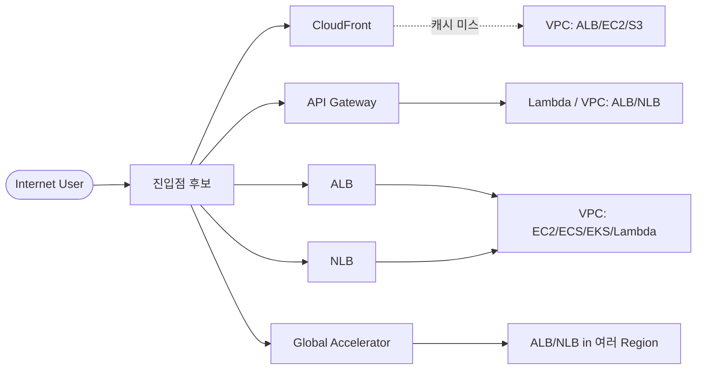
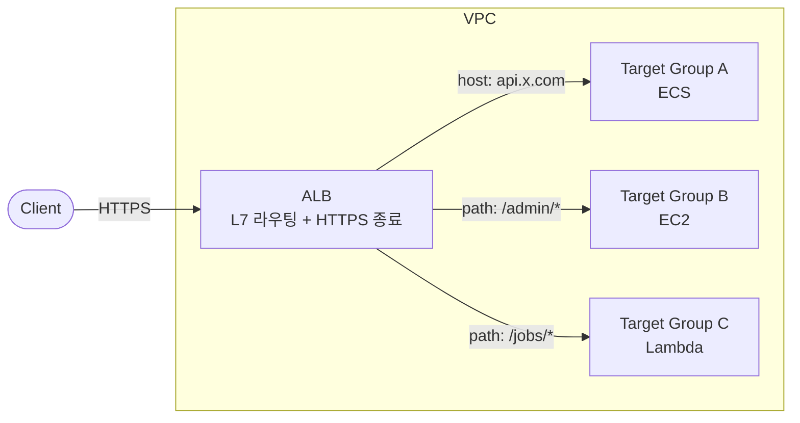
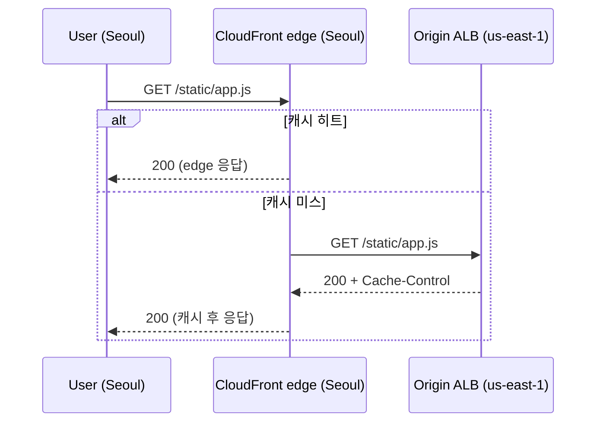
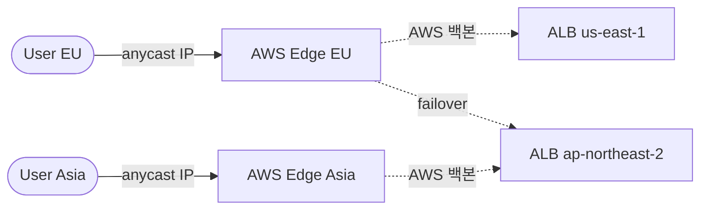
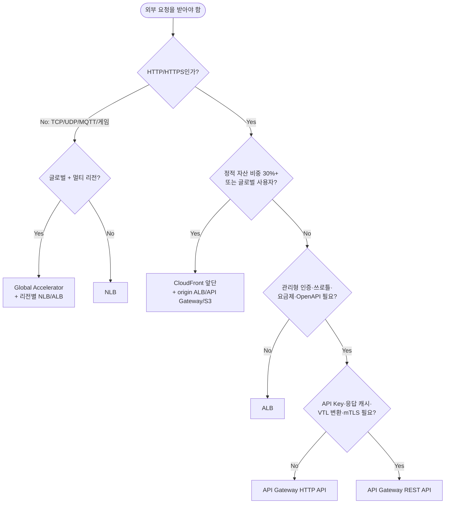

## 서론

"외부에서 들어오는 요청을 어디서 받지?"는 AWS 아키텍처를 그릴 때마다 매번 고민하게 되는 질문이다. 후보가 한둘이 아니기 때문이다 — ALB, NLB, API Gateway, CloudFront, Global Accelerator. 이름은 다 알지만, 막상 새 서비스를 띄울 때 무엇을 골라야 하는지 1초 안에 답이 안 나오면 그 결정은 보통 "남이 해놨던 대로"로 끝난다.

이 시리즈는 거기서 출발한다. AWS 네트워크 서비스 블록을 <strong>"어떤 결정 문제를 푸는가"</strong>의 관점에서 3편에 걸쳐 정리한다. 1편은 가장 자주 마주치는 결정 — <strong>외부 트래픽을 VPC로 받는 진입점 선택</strong> — 을 다룬다.

- <strong>1편 — 외부 진입점 선택: ALB / NLB / API Gateway / CloudFront / Global Accelerator (이 글)</strong>
- 2편 — VPC 간·온프레미스 연결: VPC Endpoint / PrivateLink / Transit Gateway / Peering / Direct Connect
- 3편 — VPC 내부 라우팅: IGW / NAT GW / Route Tables / Security Group vs NACL

대상 독자는 "AWS 콘솔에서 ALB는 만들어봤지만 API Gateway나 CloudFront를 언제 써야 하는지 명확하지 않은" 백엔드/인프라 엔지니어다. 다 읽고 나면 <strong>새 서비스를 그릴 때 진입점 결정에 더는 헤매지 않는</strong> 상태가 목표다.

---

## TL;DR

- <strong>L7(HTTP/HTTPS)인가 L4(TCP/UDP)인가</strong>가 첫 분기점이다. L7이면 ALB · API Gateway · CloudFront 중에서, L4면 NLB · Global Accelerator 중에서 선택한다.
- <strong>API Gateway는 "L7 + 인증·쓰로틀·요금제·관리형 통합"</strong>이 필요할 때만 쓴다. 단순 HTTP 프록시 용도면 ALB가 거의 항상 더 싸고 빠르다.
- <strong>CloudFront는 진입점이 아니라 "ALB·API Gateway·S3 앞단의 캐시 레이어"</strong>로 보는 게 정확하다. 단독으로 쓰지 않고 항상 origin이 따라온다.
- <strong>NLB는 정적 IP·ultra-low latency·TCP/UDP가 필요할 때</strong>의 답이다. WebSocket·gRPC도 가능하지만 ALB가 L7에서 같은 걸 더 잘 하는 경우가 많다.
- <strong>Global Accelerator는 멀티 리전 + 전 세계 사용자</strong>일 때만 가성비가 나온다. 단일 리전 서비스에 끼우면 시간당 $18이 그냥 새는 돈.

---

## 1. 왜 이 결정이 어려운가

AWS의 진입점 후보는 다섯 개고, 각자 OSI 계층 · 라우팅 단위 · 인증/캐시 기능 · 과금 모델이 다르다. <strong>"비슷해 보이는 두 서비스가 결정적인 한 가지 변수에서 갈리는"</strong> 구조라, 표면만 보고 고르면 한참 운영하다 비용이나 기능 한계로 갈아엎게 된다.

핵심은 진입점이 단순히 "트래픽을 받는 곳"이 아니라 <strong>요청에 어떤 처리를 더해주는 컴포넌트</strong>라는 점이다. 그래서 결정에 들어가는 변수는 다음 4가지로 좁혀진다.

| 결정 변수 | 의미 | 어떤 후보로 가는가 |
| --- | --- | --- |
| 프로토콜 계층 | HTTP/HTTPS면 L7, 그 외 TCP/UDP는 L4 | L7 → ALB / API Gateway / CloudFront, L4 → NLB / Global Accelerator |
| 글로벌 분산 | 사용자가 여러 대륙에 분포 | CloudFront(L7) / Global Accelerator(L4) |
| 관리형 부가 기능 | 인증, 쓰로틀, API Key, 요금제, 캐시 | API Gateway(인증·쓰로틀) / CloudFront(캐시) |
| 정적 IP·초저지연 | 화이트리스트 필요, 금융 거래·게임 트래픽 | NLB |

> <strong>참고 — L4 vs L7과 OSI 모델</strong>: <strong>OSI(Open Systems Interconnection) 7-layer 모델</strong>은 네트워크 통신을 7개 계층(물리·데이터링크·네트워크·전송·세션·표현·응용)으로 나눈 추상 모델이다. <strong>L4(전송 계층 — TCP/UDP)</strong>는 패킷의 IP·port만 보고 라우팅하고, <strong>L7(응용 계층 — HTTP)</strong>은 메시지 내용(host·path·header)까지 보고 결정한다. ALB는 L7, NLB는 L4 — 같은 "AWS 로드밸런서"지만 라우팅 단위가 완전히 다른 이유.

이 네 가지를 차례로 묻고 답하면 후보는 거의 항상 1~2개로 좁혀진다. 4절의 결정 트리가 이 흐름을 한 장으로 정리한 것이고, 그 전에 각 후보가 실제로 어떻게 동작하는지를 짧게 짚는다.

---

## 2. L7 진입점 — ALB / API Gateway / CloudFront

L7은 진입점이 HTTP 메시지의 내용(host, path, header, cookie)을 보고 라우팅 결정을 내릴 수 있는 계층이다. ALB · API Gateway · CloudFront 셋 다 L7이지만, <strong>"L7에서 무엇을 더 해주는가"</strong>가 완전히 다르다.

> <strong>참고 — 리버스 프록시(reverse proxy)가 뭔가</strong>: <strong>클라이언트 요청을 백엔드 대신 받아서 적절한 서버로 분배하는 중계자</strong>다. 정방향 프록시(forward proxy)가 "클라이언트를 대신해 외부로 나가는" 도구라면(예: 사내망에서 외부로 나갈 때 거치는 squid), 리버스 프록시는 "서버 앞에 서서 외부 요청을 받아 백엔드로 분배"한다. 핵심 책임 네 가지 — (1) HTTPS 종료, (2) host/path 기반 라우팅, (3) 로드밸런싱, (4) 백엔드 직접 노출 차단. Nginx·HAProxy·Envoy가 오픈소스 대표 구현이고, 이 글에서 다루는 <strong>ALB·API Gateway·CloudFront는 모두 "AWS가 관리해주는 리버스 프록시 + 부가 기능"</strong>으로 볼 수 있다. L4(TCP/UDP)에서 같은 중계 역할을 하는 게 NLB.

### 2.1 ALB — 가장 평범한 L7 로드밸런서

ALB(Application Load Balancer)는 AWS 관리형 L7 리버스 프록시다. <strong>VPC 안의 EC2 / ECS / EKS / Lambda 앞에 두는 가장 기본적인 진입점</strong>으로, 호스트·경로·헤더 기반 라우팅과 HTTPS 종료를 맡는다.

핵심 기능을 짚으면:

- <strong>호스트·경로 기반 라우팅</strong> — 단일 ALB에 여러 도메인·경로를 묶어 다른 백엔드로 분배.
- <strong>HTTPS 종료</strong> — ACM 인증서로 TLS를 끝내고 백엔드와는 평문 또는 새로운 TLS로 재암호화.
- <strong>WebSocket / HTTP/2 / gRPC</strong> — 셋 다 네이티브 지원. gRPC는 Target Group의 protocol을 `HTTP` + `Protocol version: gRPC`로 지정.
- <strong>관리형 HA</strong> — 내부적으로 Multi-AZ. ALB 자체가 죽는 사고는 사실상 사용자가 신경 쓸 필요 없는 영역.

과금은 <strong>시간당 LB 비용 + LCU</strong>(Load Balancer Capacity Unit) 두 축이다. 한국 리전 기준 LB 시간당 $0.0225, 즉 월 $16~20 상시 비용이 깔린다. 이게 핵심이다 — 트래픽이 0이어도 ALB가 떠 있으면 매월 청구된다.

> <strong>참고 — LCU 계산 메커니즘</strong>: LCU는 단일 metric이 아니라 <strong>4개 차원 중 가장 큰 값</strong>을 매시간 청구하는 합성 단위다. 1 LCU 한도 — (1) 새 연결 25/초, (2) 활성 연결 3,000/분, (3) 처리 바이트 HTTP 1 GB/시간(HTTPS는 0.4 GB/시간), (4) 10번째 이후 rule 평가 1,000/초. 트래픽 성격에 따라 dominate 차원이 자동으로 결정된다 — 짧은 API 요청 많으면 "새 연결"이, WebSocket 장기 연결이면 "활성 연결"이, 큰 파일 응답 많으면 "처리 바이트"가, 라우팅 규칙이 10개를 훌쩍 넘으면 "rule 평가"가 비용을 좌우한다. 1 LCU/시간 ≈ 월 $5.84(서울)라 작은 서비스는 1 LCU도 못 채워 LB 시간 비용에 가려져 "사실상 0"이 되고, 트래픽이 폭증해야 LCU가 시간 비용을 넘어선다. NLB의 NLCU도 같은 max 메커니즘이지만 차원 한도가 훨씬 커서(예: 새 flow 800/초, 활성 flow 100,000/분) 같은 트래픽에 대해 ALB LCU보다 적게 잡혀 보통 더 싸다.

### 2.2 API Gateway — "관리형 부가 기능"이 필요한 API

API Gateway는 ALB와 같은 L7이지만 <strong>"API 운영에 필요한 부가 기능"을 통째로 품은 진입점</strong>이다. 단순한 HTTP 라우터로 보면 안 되고, "인증·쓰로틀·요금제·캐시·custom domain·OpenAPI 임포트"까지 한 박스에 들어 있는 서비스로 봐야 한다.

이 네 가지 — <strong>인증·쓰로틀·요금제·관리형 통합</strong> — 가 결정 기준에 자주 묶여 나오는데, 각자 푸는 문제가 다르다. 백엔드 코드에서 직접 만들면 어떤 스택을 끌어와야 하는지를 같이 두면 감이 잡힌다.

| 부가 기능 | 어떤 문제를 푸나 | 백엔드 코드로 직접 만들면 | API Gateway가 주는 것 |
| --- | --- | --- | --- |
| <strong>인증 (Auth)</strong> | "이 요청자가 누구이고, 무엇을 할 권한이 있는지" 백엔드 도달 전에 검증 | Spring Security · Passport · 자체 JWT 검증 미들웨어 | JWT/OIDC 검증, IAM 서명, Cognito User Pool, Lambda Authorizer (임의 검증 로직) |
| <strong>쓰로틀 (Throttling)</strong> | "초당·분당 N건 이상 못 보내게" — 백엔드 보호 + burst·DDoS 흡수 | Bucket4j · Resilience4j RateLimiter · Redis 토큰 버킷 | account/stage/route 단위 RPS·burst 한도, 초과 시 429 자동 반환 |
| <strong>요금제 (Usage Plan)</strong> | "Free는 분당 10건, Pro는 분당 1000건" — API Key로 등급 구분 후 한도·과금 적용 | 자체 API Key 발급·검증 + 미터링 시스템 + 결제 연동 | REST API의 Usage Plan + API Key 묶음, 일·월 quota와 rate 한도 |
| <strong>관리형 통합 (Integration)</strong> | "받은 HTTP를 백엔드 호출로 <strong>변환</strong>해서 보내기" — 예: `GET /products/{id}` → DynamoDB GetItem 직접 호출 (Lambda·EC2 없이) | 자체 SDK 호출 코드 + 요청/응답 매핑 + 재시도·timeout 로직 | DynamoDB·Lambda·SQS·Step Functions·임의 AWS API 통합, VTL(Velocity Template Language, Apache Velocity 기반 요청·응답 변환 템플릿 DSL — Lambda 코드 없이 설정만으로 변환 처리)로 요청/응답 변환, 재시도·timeout은 설정으로 |

> <strong>관리형 통합이 ALB와 다른 결정적 한 가지</strong>: ALB는 받은 HTTP를 <strong>그대로</strong> 뒤의 컴퓨트(EC2·ECS·Lambda)로 던지고, 백엔드 코드가 알아서 처리하는 모델이다. API Gateway의 통합은 받은 HTTP를 <strong>AWS 서비스 API 호출 형식으로 변환해서 직접 호출</strong>하는 모델이라, 단순 CRUD 같은 경우 Lambda·EC2 같은 컴퓨트 자체가 필요 없어진다 — `GET /products/123` 한 줄이 곧 DynamoDB API 호출이 된다는 뜻. 다른 셋(인증·쓰로틀·요금제)이 "받은 요청을 어떻게 검증·제한하느냐"라면 통합은 "그 요청을 누구에게 어떤 형태로 전달하느냐"의 결정이다.

이 네 가지 중 어느 하나라도 "직접 만들기 부담스럽다"면 API Gateway 가격이 정당화된다. 반대로 단순 HTTP 프록시 용도라면 ALB가 거의 항상 더 싸다 — 이게 2.5절 비교의 출발점이다.

타입이 둘이라 자주 혼동된다.

| | HTTP API | REST API |
| --- | --- | --- |
| 등장 시점 | v2 (2019~) | v1 (2015~) |
| 가격 | 요청당 $1.00/100만 | 요청당 $3.50/100만 |
| 인증 | JWT / OIDC / Lambda Authorizer | IAM / API Key / Cognito / Lambda Authorizer |
| 응답 캐싱 | X | O (인스턴스 시간당 별도 과금) |
| 요청·응답 변환 | 제한적 | 강력 (Velocity 템플릿) |
| 사용 사례 | 대부분의 신규 API | API Key·요금제·캐시·VTL 변환 필요 시 |

<strong>신규로 만들면 일단 HTTP API가 디폴트</strong>고, REST API의 고유 기능(API Key 기반 사용량 제한, 응답 캐시, 요청·응답 변환, mTLS 등)이 필요할 때만 REST를 쓴다.

> <strong>참고</strong>: API Gateway에는 WebSocket API라는 세 번째 타입도 있다. 양방향 메시징(채팅·실시간 알림 등)에 쓴다. ALB도 WebSocket을 받지만, 백엔드를 Lambda로 두고 connection 관리까지 AWS에 맡기고 싶을 때 WebSocket API가 답이다.

API Gateway가 ALB보다 비싼 만큼, <strong>비싼 이유에 해당하는 기능을 실제로 쓰고 있어야 정당화된다</strong>. 단순히 "Lambda 앞에 뭔가 두려고" API Gateway를 쓰는 패턴이 가장 흔한 낭비다 — Lambda Function URL이나 ALB + Lambda 타깃이 거의 항상 더 싸다.

### 2.3 CloudFront — 진입점이 아니라 "캐시 + 글로벌 가속"

CloudFront는 AWS의 CDN이다. 전 세계 600+ edge 로케이션에서 콘텐츠를 캐시해서 사용자에게 가까운 곳에서 응답한다. <strong>CloudFront만 단독으로 쓰는 경우는 거의 없다</strong> — 항상 origin(S3, ALB, API Gateway, 외부 HTTP 서버)이 뒤에 붙는다.

CloudFront가 의미 있는 시나리오는 셋 중 하나다.

- <strong>정적 자산이 많을 때</strong> — JS·CSS·이미지·폰트. edge 캐시로 origin 트래픽이 거의 0이 됨.
- <strong>전 세계 사용자가 있을 때</strong> — TLS 핸드셰이크부터 가장 가까운 edge에서. AWS 백본을 타고 origin까지 가므로 퍼블릭 인터넷 경로보다 빠르다.
- <strong>API에 캐시·DDoS 보호가 필요할 때</strong> — API Gateway·ALB 앞에 CloudFront를 끼우면 응답 캐시(짧은 TTL)와 AWS Shield Standard 자동 적용.

여기서 가장 자주 빼먹는 게 <strong>"캐시 레이어"라는 정체성</strong>이다. CloudFront 단독으로는 동적 요청을 처리하지 못한다 — 캐시가 미스나면 origin으로 그대로 돌리는 게 전부고, 그 origin은 결국 ALB든 S3든 누군가가 처리해야 한다.

### 2.4 참고: Region vs Edge가 뭐가 다른가

2.3절에서 "edge 로케이션"이라는 단어가 등장했고, 다음 절 비교 표에서도 ALB는 "VPC 안 (regional)", CloudFront는 "글로벌 edge", API Gateway REST API는 "regional/edge"로 분류된다. 두 단어의 차이를 한 번 짚고 가야 표가 매끄럽게 읽힌다.

| | Region | Edge Location |
| --- | --- | --- |
| 정의 | AWS의 지리적 데이터센터 군집 | 사용자에게 가까운 작은 PoP (Point of Presence) |
| 수 | 약 30개 (서울·도쿄·버지니아 등) | 600+ (도시 단위) |
| 사는 것 | EC2·RDS·ALB·VPC 등 모든 컴퓨트·스토리지·DB | CloudFront 캐시·Route 53·TLS 종료점 |
| 용도 | 무거운 처리, 데이터 영속 | 캐싱·DNS·TLS 종료·anycast 라우팅 |

한 줄로: <strong>Region은 "서비스가 실제로 사는 곳", Edge는 "사용자 가까운 가장자리"</strong>. ALB·EC2 같은 무거운 컴퓨트는 region 안에만 살고, edge에는 캐시·DNS·TLS 같은 가벼운 처리만 들어간다.

<strong>미국 사용자가 서울 region 서비스에 접근</strong>한다고 가정하고 둘의 차이를 보면:

- <strong>Regional만</strong> — 매 요청이 태평양을 건너 서울까지. 평균 RTT ~150ms, TLS 핸드셰이크 누적 ~600ms 들어감.
- <strong>Edge 포함 (CloudFront 앞단)</strong> — 미국 edge에서 TLS 종료 → AWS 백본으로 서울 origin까지. TLS 핸드셰이크 ~30ms, 정적 자산이면 origin까지 안 감.

<strong>API Gateway REST API의 "regional/edge"</strong>는 endpoint 타입 두 가지를 고를 수 있어서다:

- <strong>Regional endpoint</strong> — 사용자가 직접 해당 region의 API Gateway로. 같은 region 사용자가 주 대상이거나, 자체 CloudFront를 앞에 둘 때.
- <strong>Edge-optimized endpoint</strong> — AWS가 자동으로 CloudFront edge를 앞에 깐 형태. 글로벌 사용자에게 기본 latency가 짧아진다.

HTTP API는 regional만 지원하고, edge가 필요하면 사용자가 직접 CloudFront를 앞에 두면 된다.

> <strong>결정에의 영향</strong>: 대상 사용자가 한 region에 모여 있으면 regional만으로 충분하다. 전 세계 사용자라면 edge layer(CloudFront 또는 edge-optimized API Gateway)가 거의 필수 — TLS RTT 절감만으로도 체감 latency가 크게 떨어진다. 정적 자산이 많으면 edge 캐시 효과가 결정적.

### 2.5 L7 셋의 비교 표

| | ALB | API Gateway HTTP API | API Gateway REST API | CloudFront |
| --- | --- | --- | --- | --- |
| 동작 위치 | VPC 안 (regional) | AWS 관리형 (regional) | AWS 관리형 (regional/edge) | 글로벌 edge |
| 라우팅 단위 | host / path / header | route → integration | route → integration | path / behavior |
| 인증 내장 | OIDC / Cognito | JWT / OIDC / Lambda | IAM / API Key / Cognito / Lambda | signed URL / signed cookie |
| 캐싱 | X | X | O (옵션) | O (핵심 기능) |
| WebSocket | O | 별도 WebSocket API | X | X |
| gRPC | O | X | X | X |
| 상시 비용 | $16~20/월 (LB 시간) | $0 | $0 (캐시 사용 시 인스턴스 시간) | $0 |
| 요청당 비용 | 매우 낮음 (LCU) | $1.00/100만 | $3.50/100만 | 매우 낮음 + 데이터 전송 |
| 강점 | 컨테이너·EC2 표준 진입점 | 서버리스 API · 인증·쓰로틀 | 요금제·캐시·VTL 변환 | 글로벌 캐시 · 정적 자산 |

L7 영역에서 가장 흔하게 헷갈리는 두 가지를 정리하면:

- <strong>ALB vs API Gateway HTTP API</strong>: 트래픽이 일정 수준 이상으로 꾸준하면 ALB가 싸다(상시 비용은 있어도 요청당이 사실상 0). 트래픽이 적거나 spiky하면 API Gateway가 싸다(상시 비용 0, 요청당만). 분기점은 대략 <strong>월 200만 요청 근처</strong>. 비용 외에 인증·쓰로틀이 필요하면 API Gateway, 컨테이너·gRPC·WebSocket이면 ALB.
- <strong>CloudFront vs 다른 둘</strong>: CloudFront는 대안이 아니라 <strong>위에 얹는 레이어</strong>다. "ALB냐 CloudFront냐"가 아니라 "CloudFront + ALB냐 ALB만이냐".

### 2.6 참고: AWS API Gateway 외에도 — Kong·Spring Cloud Gateway와 어떻게 다른가

여기까지는 AWS 안에서의 결정이었다. "API Gateway"라는 카테고리 자체는 더 넓다 — <strong>Kong·Spring Cloud Gateway(Zuul 후속) 같은 자체 호스팅 대안</strong>이 같은 자리에 있다. 이걸 짚고 가야 1편의 결정 트리가 "AWS 환경 한정"임을 의식하고, 회사 제약에 맞게 확장해서 읽을 수 있다.

<strong>카테고리는 같다</strong>. 셋 다 외부 진입 + path/host 라우팅 + 인증·쓰로틀 + 요청/응답 변환 + 로깅을 책임진다. "API Gateway"라는 추상 개념의 세 가지 구현체로 보면 된다.

차이는 운영 모델·생태계·통합 깊이에서 갈린다.

| | AWS API Gateway | Kong | Spring Cloud Gateway (Zuul 후속) |
| --- | --- | --- | --- |
| 운영 | <strong>AWS 매니지드</strong> (인프라 0) | <strong>자체 호스팅</strong> (컨테이너/VM 직접 운영) | <strong>자체 호스팅</strong> (JVM 프로세스) |
| 기술 스택 | AWS proprietary | Nginx + OpenResty (Lua) | Java + Netty (Reactor) |
| 확장 메커니즘 | Lambda Authorizer · VTL · OpenAPI 임포트 | Plugin (Lua/Go/JS), 풍부한 생태계 | Java Filter |
| 클라우드 종속 | <strong>AWS 전용</strong> | <strong>포터블</strong> (멀티클라우드·온프렘) | <strong>포터블</strong> |
| 비용 모델 | 요청당 ($1~3.50/100만) | 서버 비용 (24/7) | 서버 비용 (24/7) |
| AWS 서비스 통합 | <strong>네이티브</strong> (Lambda·DynamoDB·SQS 직결) | 일반 HTTP 백엔드만 | 일반 HTTP 백엔드 |
| Latency 오버헤드 | ~10~30ms (매니지드) | 낮음 (Nginx 기반) | 중간 (JVM warm-up) |

언제 무엇을 고르는가:

| 상황 | 선택 |
| --- | --- |
| AWS 위에서만 굴림, 서버리스(Lambda) 백엔드, 운영 부담 회피 | <strong>AWS API Gateway</strong> |
| 멀티클라우드·온프렘, 고성능, 플러그인 커스터마이징 | <strong>Kong</strong> |
| Spring Cloud 마이크로서비스 스택, Java 중심 팀 | <strong>Spring Cloud Gateway</strong> |
| 단순 라우팅만, 운영 최소화 | ALB + path-based routing (Gateway 불필요) |

> <strong>참고</strong>: Zuul 1은 Netflix가 만들었지만 Spring Cloud Gateway(Reactor + Netty 기반)로 사실상 대체됐다. 새 프로젝트에서 Zuul 1을 쓰는 경우는 거의 없고, "Zuul"이라고 해도 보통 Spring Cloud Gateway를 가리킨다.

<strong>1편 결정 트리와의 관계</strong>: 4절의 결정 트리는 <strong>"AWS 안에서 어떤 진입점을 고를 것인가"</strong>의 결정이다. 회사가 멀티클라우드를 쓰거나, EKS/Kubernetes 기반 마이크로서비스 인프라를 운영하거나, Spring Cloud 스택에 익숙한 팀이라면 — 결정 트리에서 "API Gateway"가 나오는 모든 분기에 "Kong이나 Spring Cloud Gateway도 후보"라고 읽어야 한다. 본 글의 결정 트리는 AWS 종속이라는 전제를 깔고 있다.

---

## 3. L4 진입점 — NLB / Global Accelerator

L4는 진입점이 TCP/UDP 패킷의 헤더(IP, port)만 보고 라우팅하는 계층이다. <strong>HTTP 의미를 모르는 대신 매우 빠르고, 어떤 프로토콜이든 받을 수 있다.</strong>

### 3.1 NLB — 정적 IP와 ultra-low latency

NLB(Network Load Balancer)는 L4 로드밸런서다. ALB가 못 하는 것을 정확히 채워준다.

- <strong>정적 IP 고정</strong> — 각 AZ에 EIP를 직접 할당 가능. 외부 시스템에서 IP 화이트리스트가 필요할 때(은행·결제 게이트웨이 연동) 거의 유일한 답.
- <strong>TCP / UDP / TLS</strong> — HTTP가 아닌 모든 것. 게임 서버(UDP), MQTT, 자체 바이너리 프로토콜.
- <strong>ultra-low latency</strong> — 패킷 단위 처리라 ALB보다 latency가 한 자릿수 ms 낮다.
- <strong>preserve client IP</strong> — Target Group을 IP 모드 + Cross-Zone 비활성화로 두면 클라이언트 IP가 그대로 백엔드에 전달.

ALB와 NLB의 구분은 한 줄로: <strong>HTTP 의미를 진입점이 알아야 하는가</strong>. host/path 라우팅이나 HTTPS 종료를 ALB에 맡기고 싶다면 ALB, 그 외에는 NLB.

> <strong>참고</strong>: NLB도 TLS 종료(TLS listener)를 지원한다. 그래서 "HTTPS인데 라우팅은 IP/port면 충분"한 시나리오에는 NLB가 답이 될 수 있다 — 예: 단일 백엔드만 있고 host 라우팅이 필요 없을 때.

### 3.2 Global Accelerator — 멀티 리전 + AWS 백본

Global Accelerator(GA)는 IP 두 개(anycast)를 발급해주는 서비스다. 사용자가 그 IP로 요청을 보내면 <strong>가장 가까운 AWS edge로 들어간 뒤 AWS 백본망을 타고</strong> 실제 백엔드(여러 리전의 ALB·NLB·EC2·EIP)로 라우팅된다.

핵심 효과는 두 가지다.

- <strong>first hop부터 AWS 백본</strong> — CloudFront가 캐시 미스 시 백본을 쓰는 것과 비슷하지만, GA는 모든 패킷에 적용된다. 퍼블릭 인터넷 라우팅 변동에 영향을 안 받는다.
- <strong>리전 간 자동 failover</strong> — 한 리전이 죽으면 자동으로 다른 리전 백엔드로 트래픽 우회. Route 53 health check 기반 라우팅과 비슷하지만 DNS TTL을 기다리지 않는다.

대신 <strong>비용</strong>이 있다 — 시간당 $0.025(약 월 $18) 고정 + 데이터 전송 추가. <strong>단일 리전 서비스에는 거의 항상 낭비</strong>다. "전 세계 사용자가 있고, 멀티 리전 백엔드가 이미 있고, DNS 기반 라우팅의 한계(failover 지연)가 실제로 아플 때"가 GA가 정당화되는 거의 유일한 조건이다.

### 3.3 NLB vs Global Accelerator

| | NLB | Global Accelerator |
| --- | --- | --- |
| 계층 | L4 | L4 (anycast) |
| 범위 | 단일 리전 | 글로벌 |
| IP | EIP 고정 가능 | anycast IP 2개 (영구 고정) |
| AWS 백본 | 마지막 hop | 첫 hop부터 |
| 멀티리전 failover | X (Route 53 별도) | O (자동) |
| 상시 비용 | LB 시간당 $0.0225 | $0.025/시간 + 데이터 전송 |
| 적합한 경우 | 정적 IP, 초저지연, TCP/UDP | 글로벌 사용자 + 멀티 리전 |

---

## 4. 결정 트리

위에서 짚은 변수 4개를 순서대로 물으면 거의 모든 케이스가 결정된다.

각 분기를 한 줄씩 풀면:

- <strong>Q1 (L7 vs L4)</strong>: HTTP가 아닌 모든 것은 L4. WebSocket·gRPC는 HTTP 위에서 동작하므로 L7으로 분류되는 게 맞다.
- <strong>Q2 (글로벌 멀티리전)</strong>: 단일 리전이면 NLB로 끝. 정적 IP가 필요한 화이트리스트 시나리오도 여기 해당.
- <strong>Q3 (정적 자산 / 글로벌)</strong>: 정적 자산이 많거나 사용자가 여러 대륙이면 CloudFront를 앞에 깐다. CloudFront는 단독이 아니라 origin과 항상 같이.
- <strong>Q4 (관리형 부가 기능)</strong>: 인증·쓰로틀이 필요 없으면 ALB가 거의 항상 답이다. 컨테이너·EKS·gRPC도 여기.
- <strong>Q5 (REST 고유 기능)</strong>: API Key 기반 요금제, 응답 캐시, 요청·응답 변환, mTLS — 이 중 하나라도 필요하면 REST API. 그 외는 HTTP API.

> <strong>핵심</strong>: 결정 트리의 분기 순서가 "비용"이 아니라 "기능"인 이유는, <strong>기능이 부족하면 갈아엎어야 하지만 비용은 사후 최적화가 가능</strong>하기 때문이다. 가성비 좋은 진입점을 골랐는데 WebSocket을 못 받으면 처음부터 다시 그려야 한다.

---

## 5. 흔한 안티패턴 5가지

진입점 선택 실수는 보통 정형화된 패턴으로 반복된다. 한 번씩 짚고 가면 비슷한 함정에 안 빠진다.

### 5.1 ALB 앞에 NLB 끼우기

"정적 IP가 필요해서 NLB를 두고, 뒤에 ALB가 있어야 host 라우팅이 되니까…"라는 흐름인데, <strong>NLB → ALB 체이닝은 의미가 없다</strong>. NLB는 IP/port만 보고 ALB로 그대로 흘려보내는데, 그러면 정적 IP의 의미는 거의 사라진다(ALB가 실제 처리를 하니까 화이트리스트는 ALB가 대상). 이런 경우는 <strong>ALB에 EIP를 직접 붙이는 방법은 없으니 Global Accelerator를 ALB 앞에 두는 것</strong>이 표준 답이다 — GA가 anycast IP를 제공하면서 ALB에 트래픽을 전달한다.

### 5.2 API Gateway로 정적 자산 서빙

"API 엔드포인트랑 정적 파일을 한곳에서 받고 싶어서" API Gateway로 정적 자산까지 서빙하는 경우. <strong>요청당 $1~3.50/100만이 정적 자산에 그대로 적용</strong>되어, JS/CSS 한 페이지 로드에 수십 건 요청이 발생하면 청구서가 빠르게 부푼다. 정적 자산은 S3 + CloudFront, API는 API Gateway로 분리하고 CloudFront에서 path behavior로 라우팅하는 게 표준.

### 5.3 CloudFront 없이 글로벌 서비스

서울 리전에 ALB만 두고 전 세계 사용자에게 서비스. 미국·유럽 사용자는 매 요청마다 태평양·인도양을 건너온다. <strong>TLS 핸드셰이크에만 RTT가 4번 들어가서 latency 체감이 심하다</strong>. 정적 자산이 거의 없는 동적 API여도 <strong>CloudFront를 "0초 캐시"로 깔아두는 것만으로 TLS 종료가 edge로 옮겨가</strong> 체감 지연이 줄어든다.

### 5.4 단일 EC2 앞에 ALB

EC2 1대뿐인데 ALB를 끼운 구성. <strong>로드밸런싱할 대상이 없으니 ALB는 단순히 비싼 HTTPS 종료기</strong>가 된다. 월 $20을 쓰면서 HA도 늘지 않는다(EC2가 죽으면 ALB는 보낼 곳이 없다). 이 단계에서는 EC2 위에서 직접 Nginx로 HTTPS를 종료하거나, Lightsail/Cloudflare Tunnel 같은 더 싼 옵션을 쓰는 게 합리적이다. ALB는 EC2 2대 이상부터 정당화된다.

### 5.5 WebSocket을 REST API로 받으려는 시도

"실시간 알림 기능을 만들려고 REST 폴링으로…" — 처음에는 동작하지만 트래픽이 늘면 polling이 비용·서버 부하 양쪽으로 폭발한다. WebSocket이 답인 시나리오는 처음부터 <strong>ALB(WebSocket native)나 API Gateway WebSocket API</strong>로 잡아야 한다. 둘의 구분은 connection state를 어디서 관리하느냐 — 백엔드(ALB) vs AWS(API Gateway WebSocket).

---

## 정리

이 글에서 다룬 핵심:

1. <strong>진입점 선택은 4가지 변수로 좁혀진다</strong>: 프로토콜 계층 / 글로벌 분산 / 관리형 부가 기능 / 정적 IP·초저지연. 이 순서로 물으면 후보가 1~2개로 줄어든다.
2. <strong>L7 영역의 핵심은 "각 후보가 더해주는 처리"</strong>다. ALB는 host/path 라우팅, API Gateway는 인증·쓰로틀, CloudFront는 글로벌 캐시. 같은 L7이라도 역할이 다르다.
3. <strong>CloudFront는 진입점이 아니라 캐시 레이어</strong>다. 항상 origin이 뒤에 붙고, 단독으로 쓰는 케이스는 거의 없다.
4. <strong>L4는 NLB(단일 리전 정적 IP·초저지연)와 Global Accelerator(글로벌 멀티 리전)로 갈린다</strong>. GA는 비용이 있어 단일 리전에는 거의 항상 낭비.
5. <strong>흔한 안티패턴은 다섯 가지</strong>: NLB → ALB 체이닝, API Gateway 정적 자산, CloudFront 없는 글로벌, 단일 EC2 앞 ALB, REST 폴링으로 WebSocket. 결정 트리에서 한 분기만 잘못 넘어가도 이 함정에 빠진다.

1편의 목표는 <strong>외부 트래픽이 VPC로 들어오는 그 한 단계의 결정을 자동화</strong>하는 것이었다. 새 서비스를 그릴 때 결정 트리만 따라가면 1분 안에 진입점이 잡혀야 한다.

다음 편에서는 <strong>VPC 간·온프레미스 연결</strong>을 다룬다 — VPC Endpoint와 PrivateLink는 무엇이 다른가, Transit Gateway와 VPC Peering은 언제 갈리는가, Direct Connect는 어느 시점부터 정당화되는가. 외부 진입을 끝낸 트래픽이 VPC 안에서 다른 시스템으로 어떻게 이어지는지의 결정 문제다.

---

## 부록. 진입점 후보 한 페이지 요약

읽다가 헷갈리면 여기로 돌아오면 된다.

### A. OSI 계층별 분류

| 계층 | 후보 | 라우팅 단위 |
| --- | --- | --- |
| L7 (HTTP) | ALB / API Gateway / CloudFront | host, path, header, cookie |
| L4 (TCP/UDP) | NLB / Global Accelerator | IP, port |

### B. 가격 모델 한 줄 요약

| 후보 | 상시 비용 | 요청당 비용 | 데이터 전송 |
| --- | --- | --- | --- |
| ALB | $16~20/월 | LCU (사실상 0에 가까움) | 표준 EC2 outbound |
| NLB | $16~20/월 | NLCU | 표준 |
| API Gateway HTTP API | $0 | $1.00/100만 | 표준 |
| API Gateway REST API | $0 (캐시 시 인스턴스 시간 추가) | $3.50/100만 | 표준 |
| CloudFront | $0 | 매우 낮음 | edge → 사용자 별도 (지역별 차등) |
| Global Accelerator | $18/월 | $0 | $0.015/GB 추가 |

### C. AWS 공식 문서

- ALB: <https://docs.aws.amazon.com/elasticloadbalancing/latest/application/>
- NLB: <https://docs.aws.amazon.com/elasticloadbalancing/latest/network/>
- API Gateway 비교: <https://docs.aws.amazon.com/apigateway/latest/developerguide/http-api-vs-rest.html>
- CloudFront: <https://docs.aws.amazon.com/AmazonCloudFront/latest/DeveloperGuide/>
- Global Accelerator: <https://docs.aws.amazon.com/global-accelerator/latest/dg/>

### D. 약어

**AWS 서비스·진입점**

| 약어 | 풀이 |
| --- | --- |
| VPC | Virtual Private Cloud. AWS 안에 격리해 만드는 가상 네트워크 |
| EC2 | Elastic Compute Cloud. AWS의 가상 서버 |
| ECS / EKS | Elastic Container Service / Elastic Kubernetes Service. AWS 컨테이너 오케스트레이션 매니지드 |
| Lambda | AWS 서버리스 컴퓨트 (코드만 업로드, 호출당 과금) |
| S3 | Simple Storage Service. AWS의 객체 스토리지 |
| DynamoDB | AWS의 매니지드 NoSQL 키-값 DB |
| SQS | Simple Queue Service. AWS의 메시지 큐 |
| ALB | Application Load Balancer. L7 로드밸런서 |
| NLB | Network Load Balancer. L4 로드밸런서 |
| CloudFront | AWS의 CDN (글로벌 edge 캐싱) |
| GA | Global Accelerator. AWS 백본 기반 글로벌 가속기 |
| API Gateway | AWS 매니지드 API 진입점 (인증·쓰로틀·요금제 포함) |

**과금·구성 요소**

| 약어 | 풀이 |
| --- | --- |
| LCU / NLCU | (Network) Load Balancer Capacity Unit. ALB·NLB의 사용량 청구 단위 |
| EIP | Elastic IP. 고정 공인 IP |
| TG | Target Group. ALB/NLB의 백엔드 묶음 |
| OAC | Origin Access Control. CloudFront에서 S3 접근 보호 |

**네트워크·프로토콜**

| 약어 | 풀이 |
| --- | --- |
| OSI | Open Systems Interconnection. 네트워크 통신을 7개 계층으로 나눈 추상 모델 |
| L4 | OSI 전송 계층 (TCP/UDP). 패킷의 IP·port만 보고 라우팅 |
| L7 | OSI 응용 계층 (HTTP). 메시지 내용까지 보고 라우팅 |
| TLS | Transport Layer Security. HTTPS의 암호화 프로토콜 |
| mTLS | Mutual TLS. 서버·클라이언트 양쪽이 인증서로 서로 인증 |
| TCP / UDP | Transmission Control Protocol / User Datagram Protocol. L4 전송 프로토콜 |
| WebSocket | TCP 위에서 동작하는 양방향 실시간 통신 프로토콜 |
| gRPC | Google RPC. HTTP/2 + Protocol Buffers 기반 RPC 프레임워크 |
| RTT | Round Trip Time. 패킷 왕복 시간 (지연 측정 단위) |
| DNS | Domain Name System. 도메인을 IP로 해석하는 시스템 |

**API·인증**

| 약어 | 풀이 |
| --- | --- |
| REST | Representational State Transfer. HTTP 기반 API 디자인 스타일 |
| OpenAPI | API 명세를 YAML/JSON으로 표준화한 형식 (구 Swagger) |
| OIDC | OpenID Connect. OAuth 2.0 위에 인증 layer를 얹은 표준 |
| JWT | JSON Web Token. 서명된 JSON 토큰 (인증·세션 전달용) |
| Cognito | AWS의 사용자 풀·인증 매니지드 서비스 |
| IAM | Identity and Access Management. AWS 권한·접근 관리 |
| VTL | Velocity Template Language. API Gateway REST API의 요청·응답 변환 템플릿 DSL (Apache Velocity 기반) |
| WAF | Web Application Firewall. L7 방화벽 (SQL injection·XSS 등 차단) |
| DDoS | Distributed Denial of Service. 분산 서비스 거부 공격 |

**일반**

| 약어 | 풀이 |
| --- | --- |
| CDN | Content Delivery Network. 글로벌 edge 캐싱 네트워크 (CloudFront 등) |
| 온프렘 / 온프레미스 | On-Premises. 자사 데이터센터·사옥 서버실 등 AWS 같은 퍼블릭 클라우드 외부에서 자체 운영하는 인프라 |
