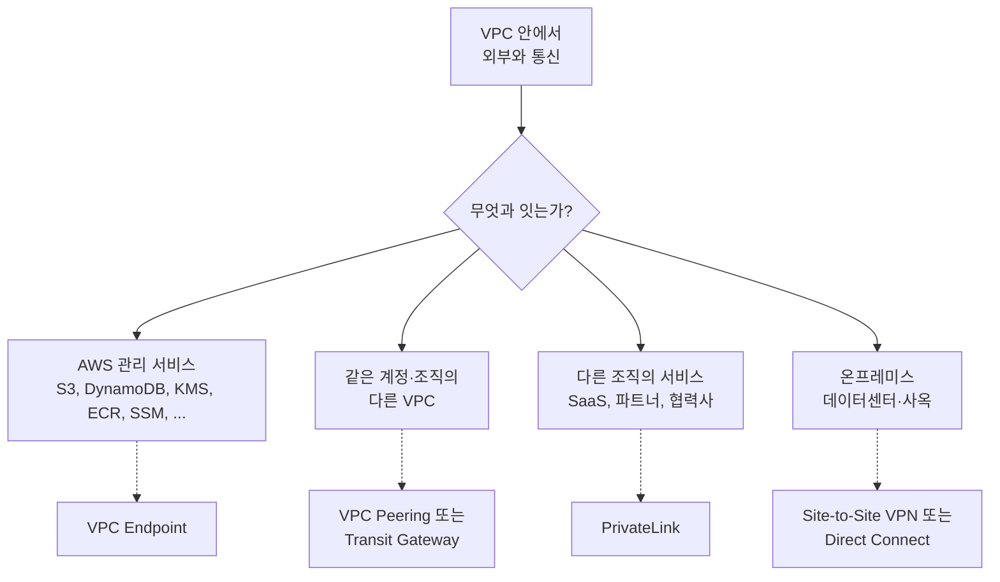
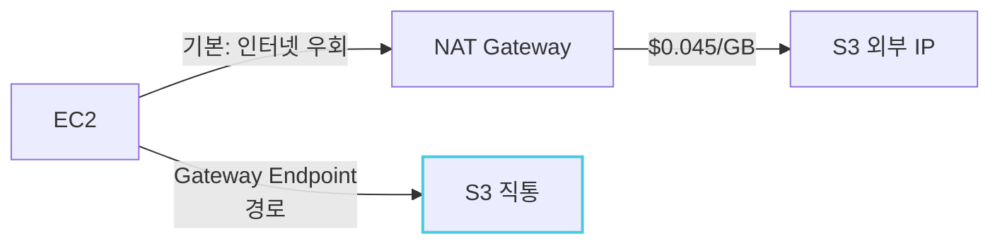
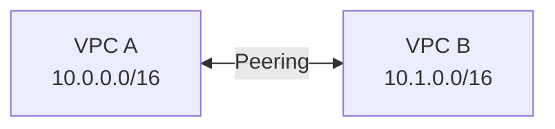
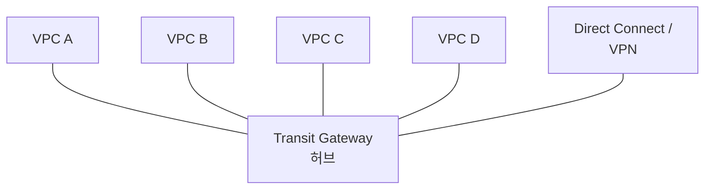
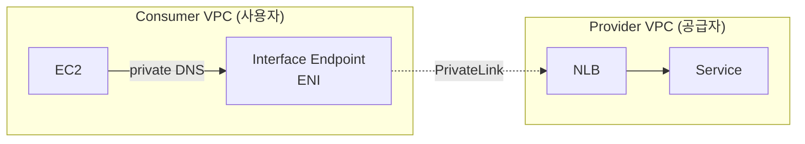
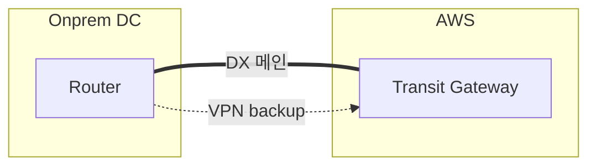
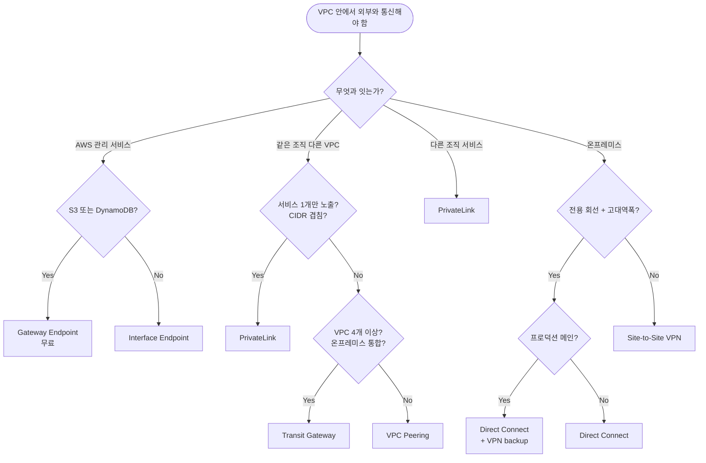

## 서론

[이전 글](/blog/aws-vpc-edge-routing-guide-1)에서 외부 트래픽이 VPC로 들어오는 진입점 결정을 다뤘다. 이번 편은 그 다음 결정이다 — <strong>VPC 안에 들어온(혹은 VPC 안에 있는) 트래픽이 다른 VPC, AWS 관리 서비스, 또는 자사 데이터센터·사옥 같은 온프레미스(on-prem, AWS 같은 퍼블릭 클라우드 외부에서 자체 운영하는 인프라)로 어떻게 이어지는가</strong>.

이 결정은 1편보다 훨씬 자주 틀린다. 후보가 6개고, 각자 동작 원리가 완전히 달라서 "비슷해 보이지만 정작 못 하는 것"이 많기 때문이다. VPC Peering으로 N:N 메시를 만들다 1년 만에 Transit Gateway로 갈아엎거나, NAT Gateway로 S3에 접근하면서 매월 수백 달러를 새는 경우 — 둘 다 흔하다.

- 0편 — [사전편: 네트워크·AWS 기본 개념 정리](/blog/aws-vpc-edge-routing-guide-0)
- 1편 — 외부 진입점 선택: ALB / NLB / API Gateway / CloudFront / Global Accelerator
- <strong>2편 — VPC 간·온프레미스 연결: VPC Endpoint / PrivateLink / Peering / Transit Gateway / VPN / Direct Connect (이 글)</strong>
- 3편 — VPC 내부 라우팅: IGW / NAT GW / Route Tables / Security Group vs NACL
- 4편 — DNS 결정과 Route 53: Hosted Zone / Routing Policy / Alias vs CNAME / Health Check
- 5편 — 표준 패턴 4가지: 결정 트리에서 처음 그릴 때까지

대상 독자는 1편과 같다 — VPC를 만들어 본 적은 있지만 "이 옵션과 저 옵션이 뭐가 다른지" 한 줄로 설명이 안 되는 백엔드/인프라 엔지니어. 다 읽고 나면 <strong>"VPC를 다른 무언가와 잇는다"는 결정이 30초 안에 끝나는</strong> 상태가 목표다.

---

## TL;DR

- <strong>목적지가 무엇이냐</strong>로 첫 분기점이 갈린다 — AWS 관리 서비스 / 다른 VPC / 다른 조직의 서비스 / 온프레미스. 같은 "연결"이라도 결정 후보가 완전히 다르다.
- <strong>S3·DynamoDB는 Gateway Endpoint(무료)</strong>가 거의 항상 정답이다. NAT Gateway로 S3 접근하면 매 GB마다 데이터 처리 요금이 나간다.
- <strong>VPC Peering은 1:1, Transit Gateway는 N:N</strong>. VPC 3~4개 넘어가면 Peering 메시 대신 Transit Gateway로 가야 운영이 살아남는다.
- <strong>다른 조직(또는 VPC) 서비스를 비공개로 노출하려면 PrivateLink</strong>다. Peering·Transit Gateway와 달리 IP 충돌 걱정이 없고, "서비스 1개만 단방향 노출" 모델.
- <strong>온프레미스는 VPN으로 시작해서 Direct Connect로 졸업</strong>한다. 둘은 경쟁이 아니라 보완 관계 — 프로덕션은 보통 Direct Connect(전용선) + VPN backup.

---

## 1. 왜 이 결정이 어려운가

VPC 연결 옵션 6개는 1편의 진입점들과 달리 <strong>"무엇을 잇는가"라는 결정 문제 자체가 4가지로 나뉜다</strong>. 그래서 같은 단어 "연결"이라도 어떤 후보가 후보군에 들어오는지부터 다르다.

같은 "VPC와 X를 잇는다"여도 X가 어디 사느냐에 따라 후보가 거의 안 겹친다. 그래서 이 글의 결정 트리는 <strong>1단계 분기를 "목적지 종류"</strong>로 두고, 그 안에서 2~3단계 변수를 따진다.

각 영역의 결정 변수를 한 표로 정리하면:

| 목적지 | 결정 변수 | 후보 |
| --- | --- | --- |
| AWS 관리 서비스 | S3·DynamoDB냐, 그 외 서비스냐 | Gateway Endpoint / Interface Endpoint |
| 다른 VPC (내 조직) | 연결 수가 1:1인가 N:N인가 | VPC Peering / Transit Gateway |
| 다른 조직의 서비스 | 단방향 노출 / IP 분리 필요 | PrivateLink |
| 온프레미스 | 인터넷 OK / 전용 회선 필요 | Site-to-Site VPN / Direct Connect / 둘 다 |

2~5절에서 영역별로 각 후보의 메커니즘과 선택 기준을 짚고, 6절에서 전체 결정 트리, 7절에서 안티패턴으로 마무리한다.

---

## 2. AWS 관리 서비스로 가는 길 — VPC Endpoint

VPC 안의 EC2가 S3나 DynamoDB, KMS, ECR 같은 AWS 관리 서비스에 접근할 때, <strong>기본 경로는 인터넷</strong>이다. Public Subnet이면 IGW를 통해, Private Subnet이면 NAT Gateway를 통해 — 둘 다 결국 AWS 백본으로 돌아오긴 하지만, "VPC를 나갔다 다시 들어온다"는 라우팅 자체가 비용과 보안을 함께 갉아먹는다.

VPC Endpoint는 그 우회를 없애는 직통 경로다. <strong>"인터넷을 거치지 않고 VPC 안에서 AWS 서비스로 직접 통신"</strong>이 한 줄 정의.

### 2.1 Gateway Endpoint vs Interface Endpoint

Endpoint에는 두 종류가 있고, 결정은 <strong>대상 서비스가 무엇인가</strong>로 자동으로 갈린다.

| | Gateway Endpoint | Interface Endpoint |
| --- | --- | --- |
| 지원 서비스 | <strong>S3, DynamoDB</strong> 둘뿐 | 그 외 대부분 (KMS, ECR, SSM, CloudWatch, Lambda, ...) |
| 동작 원리 | Route Table에 prefix list 등록 | VPC 안에 ENI를 띄움 + Private DNS |
| 비용 | <strong>무료</strong> | $0.01/시간/AZ + $0.01/GB |
| 다른 VPC·온프레미스에서 접근 | X | O (PrivateLink로 노출 가능) |

규칙은 단순하다 — <strong>S3·DynamoDB는 거의 무조건 Gateway Endpoint, 그 외는 Interface Endpoint</strong>.

### 2.2 Gateway Endpoint가 무료인 이유와 함정

Gateway Endpoint는 Route Table에 "S3·DynamoDB로 가는 prefix list 경로를 추가"하는 게 전부다. 패킷이 IGW나 NAT가 아니라 그 경로로 빠져나가는 식이고, AWS는 이 경로를 자체 백본에서 처리하므로 추가 인프라(ENI, 트래픽 처리)가 없다 — 그래서 무료다.

함정은 두 가지다.

- <strong>리전 안에서만 동작</strong> — 같은 리전의 S3 버킷에만 직통이 된다. 다른 리전 S3는 여전히 NAT 경로.
- <strong>Route Table에 등록 안 하면 무용</strong> — Endpoint를 만들어도 EC2가 속한 Subnet의 Route Table에 prefix list가 추가돼야 실제 라우팅이 바뀐다. "만들었는데 효과가 없네"의 99%가 이 누락이다.

### 2.3 Interface Endpoint — VPC 안에 ENI를 띄우는 모델

Interface Endpoint는 Gateway와 동작 원리가 완전히 다르다. <strong>VPC 안의 Subnet에 ENI를 만들고, 거기에 Private DNS를 붙여서</strong> 서비스의 공식 도메인(예: `kms.ap-northeast-2.amazonaws.com`)이 그 ENI의 사설 IP로 해석되도록 한다. ENI 자체의 자세한 풀이는 0편 3.1절 참조 — 한 줄 요약은 <strong>VPC에 사설 IP를 갖고 붙는 가상 NIC</strong>로, 사설 IP·SG·EIP가 ENI 단위로 결합된다는 사실만 기억하면 된다.

이게 의미하는 게 두 가지:

- <strong>요금이 발생한다</strong> — AZ당 시간당 $0.01 + 데이터당 $0.01/GB. AZ 3개에 모두 띄우면 월 $21+ 고정. 적은 금액이지만 작은 서비스에서 모든 Interface Endpoint를 다 만들면 월 $100~200까지도 간다.
- <strong>Endpoint 정책으로 접근 제어 가능</strong> — IAM Policy처럼 "이 Endpoint를 통해 어떤 리소스에만 접근 허용"을 걸 수 있다. 컴플라이언스 환경에서 자주 쓴다.

> <strong>참고</strong>: Interface Endpoint는 PrivateLink와 같은 메커니즘이다. AWS 관리 서비스를 PrivateLink로 노출한 게 Interface Endpoint, 사용자 서비스를 같은 방식으로 노출한 게 5절의 PrivateLink. 같은 상자 다른 라벨이라고 보면 된다.

### 2.4 참고: VPC Endpoint 환경에서 로컬 테스트는 어떻게 하나

실무에서 자주 부딪히는 질문이다. 핵심 원리는 한 줄 — <strong>VPC Endpoint는 VPC 안에서 발생한 트래픽에만 영향</strong>이다. 로컬 노트북은 VPC 밖이라 그냥 퍼블릭 인터넷 경로로 AWS에 도달하므로, 보통은 <strong>IAM access key로 평소처럼 테스트하면 그대로 동작</strong>한다. Endpoint 설정은 운영 VPC만의 라우팅 변경일 뿐, AWS 서비스 자체의 접근 통제를 바꾸진 않는다.

다만 보안 정책이 강해서 버킷·Endpoint 정책에 `aws:SourceVpce` 조건("이 Endpoint 통과만 허용")이 박혀 있으면 로컬에선 어떤 credential로도 접근이 차단된다. 그때 가장 흔히 쓰는 패턴 두 가지:

| 패턴 | 어떻게 동작하나 |
| --- | --- |
| <strong>Dev 계정 분리</strong> (가장 흔함) | 운영 계정은 Endpoint-only 정책, dev/staging 계정은 public access 허용. 로컬은 dev 계정 credential로 테스트. 환경별 IAM·정책만 다르고 코드는 동일. |
| <strong>LocalStack</strong> (오프라인·CI) | S3·DynamoDB·SQS 등을 Docker로 로컬 에뮬레이션. AWS SDK의 endpoint URL을 `http://localhost:4566`으로 가리키면 AWS 호출 0건이라 CI 결정성 최고. |

이 둘로 부족하면 — Endpoint 정책 자체를 검증해야 한다거나 회사 정책상 운영과 동일 경로가 강제될 때 — SSM Session Manager 포트 포워딩, AWS Client VPN으로 로컬을 VPC에 합류, 또는 통합 테스트를 VPC 안 CodeBuild 프로젝트에서 실행하는 옵션으로 넘어간다.

---

## 3. 같은 조직의 다른 VPC — Peering vs Transit Gateway

VPC를 둘 이상 운영하기 시작하면 거의 반드시 마주치는 결정이다. dev/staging/prod를 분리하거나, 팀별로 VPC를 나누거나, 다른 리전에 VPC를 띄우면 <strong>"이 둘이 서로 통신할 수 있어야"</strong> 하는 시점이 온다.

### 3.1 VPC Peering — 1:1 직통

VPC Peering은 두 VPC 사이에 <strong>L3 라우팅 경로</strong>를 직접 연결하는 가장 단순한 방법이다. 양쪽 Route Table에 상대방 VPC CIDR로 가는 경로를 추가하고, 양쪽이 수락하면 끝.

특징과 한계:

- <strong>비용이 거의 0</strong> — Peering 자체는 무료, 데이터 전송만 과금.
- <strong>비전이성(non-transitive)</strong> — A↔B, B↔C가 있어도 A↔C는 자동으로 안 된다. A↔C도 별도 Peering이 필요.
- <strong>CIDR 겹치면 안 된다</strong> — VPC들의 IP 대역이 겹치면 Peering 자체가 불가능.
- <strong>VPC 수가 늘어나면 메시가 폭발</strong> — N개 VPC 풀 메시는 N(N-1)/2개 Peering. 5개 → 10개 / 10개 → 45개.

### 3.2 Transit Gateway — N:N 허브

Transit Gateway(TGW)는 <strong>VPC들과 온프레미스 연결을 모두 한 허브에 attach하는 모델</strong>이다. 각 attachment는 TGW의 Route Table을 통해 라우팅되고, 새 VPC를 추가할 때 그 VPC만 attach하면 끝 — 기존 VPC들은 건드리지 않는다.

핵심 차이점:

- <strong>전이성 O</strong> — A→B→C 라우팅이 TGW Route Table 설정만으로 가능.
- <strong>온프레미스·DX·VPN 통합</strong> — TGW에 DX/VPN attachment 하나 붙이면 모든 VPC가 공유.
- <strong>Multi-AZ HA는 attachment 단위로</strong> — TGW 자체는 region 단위 매니지드라 자동 HA지만, 각 VPC attachment는 AZ별 ENI를 두는 게 권장된다 (한 AZ가 죽으면 그 AZ의 VPC 트래픽만 영향).
- <strong>요금이 있다</strong> — attachment당 시간당 $0.05 + 데이터당 $0.02. VPC 5개 + DX 1개면 월 $200+.

### 3.3 결정 분기점

| 변수 | VPC Peering | Transit Gateway |
| --- | --- | --- |
| 연결 수 | 1:1 (또는 2~3개 풀 메시) | 4개 이상 |
| 전이성 | X | O |
| 비용 | 0 (데이터만) | attachment당 시간당 $0.05+ |
| 온프레미스 통합 | 별도 구성 | TGW에 attach 한 번이면 공유 |
| CIDR 겹침 | 불가 | TGW Route Table로 분리 가능 |
| 운영 복잡도 | VPC 수에 따라 폭증 | 중앙 관리 |

대략적인 분기점은 <strong>VPC 3~4개</strong>다. 그 아래면 Peering 비용 0이 강력하고, 그 위로 가면 메시 관리가 운영을 잡아먹어 TGW 요금을 정당화한다.

---

## 4. 다른 조직의 서비스 — PrivateLink

자기 조직 안의 VPC 연결은 위에서 끝난다. 그런데 <strong>"다른 조직"</strong>(SaaS 벤더, 파트너사, 또는 사내에서 다른 사업부) 서비스를 자기 VPC에서 비공개로 호출해야 하는 시나리오가 있다 — 이게 PrivateLink가 풀려는 결정 문제다.

### 4.1 PrivateLink가 푸는 문제

원리는 단순하다. <strong>공급자(Provider) 쪽이 NLB 앞에 "Service"를 정의</strong>하고, <strong>사용자(Consumer) 쪽이 자기 VPC 안에 Interface Endpoint를 만들어 그 Service에 연결</strong>한다. 사용자 쪽은 자기 VPC 안의 ENI로 해석되는 도메인으로 호출하면 되고, 공급자 쪽은 자기 NLB만 노출하면 끝.

Peering·TGW와 비교한 PrivateLink의 강점:

- <strong>IP 충돌 무관</strong> — Consumer/Provider VPC의 CIDR이 겹쳐도 동작. 사용자 쪽은 그저 자기 VPC 안 ENI로 갈 뿐이라.
- <strong>단방향 + 서비스 단위 노출</strong> — Provider는 정해진 NLB 뒤의 서비스만 노출하고, 그 외 VPC 자원은 노출되지 않는다. Peering은 VPC 전체가 노출.
- <strong>Consumer가 자기 보안 그룹으로 직접 통제</strong> — Endpoint ENI에 SG를 붙여서 자기 쪽 EC2 일부만 호출하도록 제한 가능.

### 4.2 언제 PrivateLink, 언제 Peering인가

같은 조직 내 두 VPC를 연결할 때도 PrivateLink가 답이 되는 경우가 있다.

| 상황 | 후보 |
| --- | --- |
| VPC 전체가 양방향 통신해야 함 | Peering / TGW |
| 한 VPC가 다른 VPC의 "특정 서비스"만 호출 | <strong>PrivateLink</strong> |
| CIDR이 겹침 | <strong>PrivateLink</strong> (또는 TGW + NAT) |
| 다른 AWS 계정·조직의 서비스 호출 | <strong>PrivateLink</strong> (거의 유일한 답) |
| SaaS 벤더의 서비스에 비공개 접근 | <strong>PrivateLink</strong> (벤더가 지원하면) |

요약하면 <strong>"VPC 전체"를 잇는다면 Peering/TGW, "서비스 1개"만 노출한다면 PrivateLink</strong>.

---

## 5. 온프레미스 — VPN과 Direct Connect

온프레미스와 VPC를 잇는 결정은 두 후보로 거의 정해진다 — Site-to-Site VPN과 Direct Connect. 그리고 둘은 경쟁이 아니라 <strong>"낮은 진입장벽 vs 고성능"의 단계 관계</strong>다.

### 5.1 Site-to-Site VPN — 인터넷 위에 IPsec 터널

VPN은 인터넷을 통해 IPsec(IP Security, 패킷을 암호화하고 무결성을 검증하는 네트워크 계층 보안 프로토콜) 터널을 만든다. AWS 쪽 Virtual Private Gateway(VGW) 또는 TGW와 온프레미스 라우터 사이에 두 개의 IPsec 터널이 자동으로 뜨고, 양쪽이 BGP나 정적 라우팅으로 IP 대역을 교환한다.

- <strong>며칠 안에 구성 가능</strong> — 하드웨어 발주 없이 라우터 설정만으로 시작.
- <strong>대역폭은 인터넷 회선에 종속</strong> — 한 터널당 1.25 Gbps 정도 한도.
- <strong>지연은 인터넷 라우팅 변동에 노출</strong> — 평소엔 괜찮지만 ISP 이슈가 생기면 들썩.
- <strong>요금</strong> — 시간당 $0.05/터널. AWS 쪽은 두 터널 자동 → 시간당 $0.10.

### 5.2 Direct Connect — AWS와 직결되는 전용 회선

Direct Connect(DX)는 AWS 데이터센터(또는 DX 위치)까지 <strong>실제 광케이블을 끌어 전용 회선을 만드는 방식</strong>이다.

- <strong>대역폭 1·10·100 Gbps 옵션</strong> — VPN으로는 못 내는 속도.
- <strong>지연 안정적</strong> — 인터넷 라우팅에 영향 없음.
- <strong>요금 모델이 다르다</strong> — 포트 시간 요금 + 데이터 전송 요금. 하지만 <strong>AWS → 온프레미스 outbound 요금이 인터넷 대비 매우 저렴</strong>해서 트래픽이 크면 VPN보다 싸진다.
- <strong>시간이 걸린다</strong> — 회선 발주·실선 작업으로 보통 수 주~수 개월.

### 5.3 둘은 보완 관계 — 표준은 DX + VPN backup

프로덕션의 일반적인 형태는 <strong>"DX를 메인, VPN을 backup"</strong>으로 두는 것이다.

이유:

- <strong>DX는 단일 회선 장애 가능성</strong> — 광케이블 1개 끊어지면 통신 중단. VPN이 걸려 있으면 BGP가 자동 fail-over.
- <strong>VPN은 빠른 시작점</strong> — DX 발주 기다리는 동안 VPN으로 먼저 서비스 시작, DX 완료 후 메인으로 승격.
- <strong>두 경로 BGP 우선순위로 자동 선택</strong> — 별도 운영 개입 없이 가용성 확보.

| | Site-to-Site VPN | Direct Connect |
| --- | --- | --- |
| 매체 | 인터넷 + IPsec | 전용 회선 (광케이블) |
| 대역폭 | 한 터널당 ~1.25 Gbps | 1·10·100 Gbps |
| 지연 | 인터넷 변동에 노출 | 안정적 |
| 구축 시간 | 수일 | 수 주 ~ 수 개월 |
| 요금 | 시간당 $0.05/터널 | 포트 시간 + 데이터 (대용량 시 유리) |
| 적합 시점 | PoC, 중간 규모, backup | 프로덕션 메인 회선 |

---

## 6. 결정 트리

위 4개 영역의 결정 변수를 통합하면 다음과 같다.

각 분기를 한 줄로:

- <strong>QA (S3·DynamoDB)</strong>: 무조건 Gateway Endpoint. NAT Gateway로 우회하면 데이터 처리 요금이 그냥 새는 돈.
- <strong>QB (1개 서비스 노출 / CIDR 겹침)</strong>: 둘 중 하나라도 해당하면 PrivateLink가 압도적으로 깔끔.
- <strong>QC (VPC 수, 온프레미스 통합)</strong>: 4개 미만 + 온프렘 미통합이면 Peering, 그 외는 TGW.
- <strong>QD (대역폭·지연 요구)</strong>: 인터넷 회선으로 충분하면 VPN, 전용 회선 필요하면 DX.
- <strong>QE (프로덕션 메인 여부)</strong>: 프로덕션 메인이면 DX 단독 대신 DX + VPN backup.

> <strong>핵심</strong>: 결정 트리의 1단계 분기는 비용·기능이 아니라 <strong>"목적지가 어디 사느냐"</strong>다. 이 1단계가 정해지면 후보가 1~2개로 즉시 줄어들기 때문이다.

---

## 7. 흔한 안티패턴 5가지

### 7.1 NAT Gateway로 S3 접근

가장 흔하고 가장 비싸게 새는 패턴. <strong>S3로 가는 트래픽을 NAT Gateway가 처리하면 GB당 $0.045가 발생</strong>한다. 데이터 분석·로그 적재·이미지 업로드 워크로드는 월 수백 GB~TB가 보통이고, 이 비용이 그냥 청구서에 추가된다. Gateway Endpoint를 만들고 Route Table에 prefix list 경로 한 줄 추가하면 끝 — 5분 작업이 매월 수백 달러를 절약한다. (Gateway Endpoint·NAT GW·IGW·Peering·TGW 비용 한눈에 비교는 0편 부록 I 참고.)

### 7.2 VPC Peering으로 N:N 메시

VPC가 5개 넘어가는데 모두 서로 통신해야 한다고 풀 메시 Peering을 그리는 경우. <strong>라우팅 테이블이 폭발하고, VPC 추가할 때마다 모든 기존 VPC의 Route Table을 손대야 한다</strong>. TGW로 가야 한다 — attachment당 비용이 있지만, 운영 복잡도가 줄어드는 효과가 그 비용을 상쇄하고도 남는다.

### 7.3 Direct Connect만 단독 운영

DX 한 회선만 운영하다가 광케이블 사고로 통신이 끊긴 사례는 매년 나온다. <strong>DX는 단일 물리 회선이므로 그 자체로는 SLA가 일반 인터넷 회선과 다르지 않다</strong>. AWS가 권장하는 표준 패턴은 항상 DX + VPN backup이고, 가용성이 더 중요하면 DX를 두 회선(다른 물리 경로)으로 깔거나 다른 DX Location을 같이 쓴다.

### 7.4 Interface Endpoint를 모든 AZ에 다 띄우기

"AZ 분리해야 하니까"라고 Interface Endpoint를 모든 AZ에 다 만드는 경우. <strong>AZ당 시간당 $0.01이 누적</strong>되어 작은 서비스에서도 월 수십 달러가 그냥 새는 돈이 된다. 단일 AZ 환경(개발·스테이징)이거나 트래픽이 작으면 1~2개 AZ만 띄우는 게 합리적이다. 프로덕션에서도 트래픽 패턴 보고 결정.

### 7.5 PrivateLink로 풀 수 있는 걸 Peering으로 풀기

다른 조직(또는 다른 사업부)의 서비스 1개만 호출하면 되는데 VPC Peering으로 잇는 경우. <strong>Peering은 VPC 전체를 노출</strong>하므로 보안적으로도 과하고, 두 조직의 CIDR이 겹치면 Peering 자체가 불가능해진다. PrivateLink가 정답인 시나리오를 Peering으로 잘못 풀고 있다면, 보안 리뷰가 한 번 들어가는 순간 갈아엎어야 한다.

---

## 정리

이 글에서 다룬 핵심:

1. <strong>1단계 분기는 "목적지가 어디 사느냐"</strong>다. AWS 관리 서비스 / 같은 조직 VPC / 다른 조직 서비스 / 온프레미스 — 이 4개로 후보가 거의 안 겹치게 갈린다.
2. <strong>S3·DynamoDB는 Gateway Endpoint, 그 외는 Interface Endpoint</strong>. Gateway는 무료라 거의 무조건이고, Interface는 AZ당 비용이 있어서 신중하게.
3. <strong>VPC Peering vs Transit Gateway는 "1:1 vs N:N"의 결정</strong>. VPC 3~4개를 넘으면 TGW로 가는 게 운영상 거의 필수.
4. <strong>다른 조직 서비스·CIDR 충돌·서비스 단위 노출은 PrivateLink</strong>. Peering·TGW가 못 푸는 결정 문제를 정확히 푼다.
5. <strong>온프레미스는 VPN으로 시작해 DX로 졸업</strong>하지만, 프로덕션 표준은 둘 다 — DX 메인 + VPN backup.

2편의 목표는 <strong>VPC 안의 자원이 외부 무언가와 통신해야 할 때, 6개 후보 중 어떤 게 맞는지 30초 안에 답이 나오는 상태</strong>를 만드는 것이었다. 결정 트리만 따라가면 1단계에서 후보가 1~2개로 좁혀지고, 2~3단계에서 정확히 하나로 정해진다.

다음 편(3편)에서는 <strong>VPC 내부 라우팅</strong>을 다룬다 — IGW와 NAT Gateway는 어떻게 동작하는가, Route Table은 어떤 우선순위로 평가되는가, Security Group과 NACL의 stateful/stateless 차이는 실무에서 어디서 갈리는가. 외부 진입과 외부 연결이 모두 끝난 다음, <strong>VPC 안에서 패킷이 실제로 흐르는 방식</strong>을 풀어낸다.

> <strong>참고 — 시리즈 흐름</strong>: 본 편의 모든 연결 결정도 [4편(DNS·Route 53)](/blog/aws-vpc-edge-routing-guide-4)에서 다루는 DNS layer가 먼저다. 특히 2.3절에서 Interface Endpoint가 "Private DNS"로 동작한다고 했는데, 그 Private DNS가 사실 Route 53 Private Hosted Zone(4편 2.2절)이라는 점을 알면 시리즈 전체가 더 잘 연결된다.

---

## 부록. 한 페이지 요약

### A. 영역별 한 줄 결정

| 목적지 | 첫 후보 | 첫 후보가 안 되면 |
| --- | --- | --- |
| S3·DynamoDB | Gateway Endpoint | (대안 없음, 무조건) |
| 그 외 AWS 관리 서비스 | Interface Endpoint | 인터넷 경로 (NAT GW) |
| 같은 조직 VPC, 1:1 | VPC Peering | TGW |
| 같은 조직 VPC, N:N | Transit Gateway | (메시 Peering은 안티패턴) |
| 다른 조직 서비스 | PrivateLink | (대안 사실상 없음) |
| 온프레미스 PoC·중간 규모 | Site-to-Site VPN | DX |
| 온프레미스 프로덕션 메인 | DX + VPN backup | (단독 DX는 안티패턴) |

### B. 가격 모델 한 줄 요약

| 후보 | 상시 비용 | 데이터 비용 |
| --- | --- | --- |
| Gateway Endpoint | $0 | $0 (같은 리전) |
| Interface Endpoint | AZ당 시간당 $0.01 | $0.01/GB |
| VPC Peering | $0 | $0.01/GB (cross-AZ), 같은 AZ 무료 |
| Transit Gateway | attachment당 시간당 $0.05 | $0.02/GB |
| PrivateLink (Provider) | NLB 비용 + Endpoint Service | NLB 데이터 |
| Site-to-Site VPN | 시간당 $0.05/터널 | 표준 outbound |
| Direct Connect | 포트 시간 (capacity별) | DX outbound (인터넷 대비 저렴) |

### C. AWS 공식 문서

- VPC Endpoint: <https://docs.aws.amazon.com/vpc/latest/privatelink/>
- VPC Peering: <https://docs.aws.amazon.com/vpc/latest/peering/>
- Transit Gateway: <https://docs.aws.amazon.com/vpc/latest/tgw/>
- Direct Connect: <https://docs.aws.amazon.com/directconnect/latest/UserGuide/>
- Site-to-Site VPN: <https://docs.aws.amazon.com/vpn/latest/s2svpn/>

### D. 약어

**AWS 서비스·구성**

| 약어 | 풀이 |
| --- | --- |
| VPC | Virtual Private Cloud. AWS 안에 격리해 만드는 가상 네트워크 |
| EC2 | Elastic Compute Cloud. AWS의 가상 서버 |
| RDS | Relational Database Service. AWS 매니지드 RDB |
| Lambda | AWS 서버리스 컴퓨트 |
| S3 | Simple Storage Service. AWS의 객체 스토리지 |
| DynamoDB | AWS의 매니지드 NoSQL 키-값 DB |
| KMS | Key Management Service. AWS 암호화 키 관리 |
| ECR | Elastic Container Registry. AWS 컨테이너 이미지 저장소 |
| SSM | AWS Systems Manager. EC2 통합 관리 (Session Manager 등) |
| ALB / NLB | Application / Network Load Balancer (L7 / L4) |

**연결·라우팅**

| 약어 | 풀이 |
| --- | --- |
| VPC Endpoint | VPC 안에서 AWS 서비스로 인터넷 우회 없이 직접 통신하는 통로 (Gateway · Interface 두 종류) |
| PrivateLink | 다른 조직의 서비스를 NLB 뒤에 노출하고 Consumer VPC에 ENI로 받는 단방향 연결 |
| TGW | Transit Gateway. 다대다 VPC·온프레미스 허브 |
| DX | Direct Connect. AWS와의 전용 회선 |
| VPN | Virtual Private Network. 여기서는 Site-to-Site VPN |
| VGW | Virtual Private Gateway. VPC 쪽 VPN 종단점 |
| IGW | Internet Gateway. VPC와 인터넷의 양방향 게이트웨이 |
| NAT | Network Address Translation. 사설 IP ↔ 공인 IP 변환 |
| NACL | Network Access Control List. Subnet 단위 stateless 방화벽 |
| SG | Security Group. ENI 단위 stateful 방화벽 |

**네트워크 기초**

| 약어 | 풀이 |
| --- | --- |
| ENI | Elastic Network Interface. VPC에 사설 IP를 갖고 붙는 가상 NIC |
| NIC | Network Interface Card. 네트워크 카드 (실물 또는 가상) |
| CIDR | Classless Inter-Domain Routing. IP 대역을 `시작IP/prefix길이`로 표기 (예: `10.0.0.0/16`) |
| BGP | Border Gateway Protocol. 동적 라우팅 프로토콜 |
| IPsec | IP Security. 패킷 암호화·무결성 검증 네트워크 계층 보안 프로토콜 |
| L3 | OSI 네트워크 계층 (IP) |
| AZ | Availability Zone. 리전 안의 데이터센터 단위 |

**일반**

| 약어 | 풀이 |
| --- | --- |
| SaaS | Software as a Service. 매니지드 소프트웨어 서비스 (Salesforce·Datadog 등) |
| PoC | Proof of Concept. 가능성 검증용 시범 구현 |
| 온프렘 / 온프레미스 | On-Premises. 자사 데이터센터·사옥 서버실 등 AWS 같은 퍼블릭 클라우드 외부에서 자체 운영하는 인프라 |
