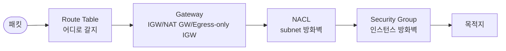
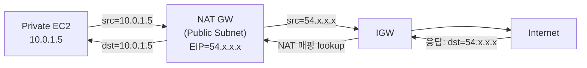
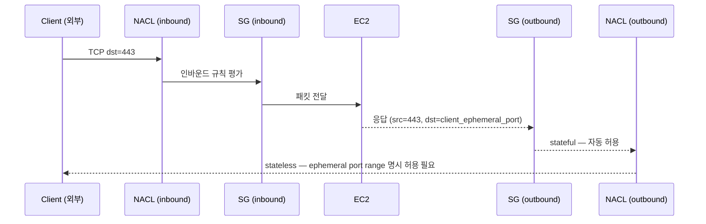
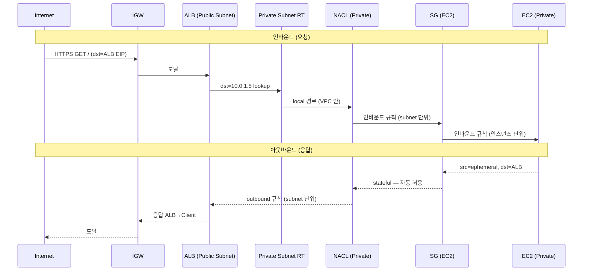

## 서론

[1편](/blog/aws-vpc-edge-routing-guide-1)에서 외부 트래픽이 VPC로 들어오는 진입점을 골랐고, [2편](/blog/aws-vpc-edge-routing-guide-2)에서 그 트래픽이 다른 VPC·AWS 서비스·온프레미스로 어떻게 이어지는지를 정리했다. 마지막 편은 그 사이 — <strong>VPC 안에서 패킷이 실제로 어떻게 흐르고 어디서 막히는가</strong>에 대한 이야기다.

이 영역은 1편·2편보다 오히려 더 자주 헷갈린다. 후보를 고르는 결정이 아니라 <strong>4개 컴포넌트가 협력해서 패킷 경로를 결정하는 메커니즘</strong>이라, "왜 안 되지?"라는 디버깅 시점에 처음 마주치는 경우가 많기 때문이다. SG는 열어뒀는데 응답이 안 가거나, Route Table을 만졌는데 라우팅이 그대로거나, NACL 규칙은 분명히 맞는데 outbound가 막히는 — 그 모든 함정이 이 4개의 협력 방식에서 비롯된다.

- 0편 — [사전편: 네트워크·AWS 기본 개념 정리](/blog/aws-vpc-edge-routing-guide-0)
- 1편 — 외부 진입점 선택: ALB / NLB / API Gateway / CloudFront / Global Accelerator
- 2편 — VPC 간·온프레미스 연결: VPC Endpoint / PrivateLink / Peering / Transit Gateway / VPN / Direct Connect
- <strong>3편 — VPC 내부 라우팅: IGW / NAT GW / Route Tables / Security Group vs NACL (이 글)</strong>
- 4편 — DNS 결정과 Route 53: Hosted Zone / Routing Policy / Alias vs CNAME / Health Check

대상 독자는 1·2편과 같다 — VPC를 만들어 본 적은 있지만 "왜 안 되지?"가 나올 때 어디부터 봐야 할지 막막한 백엔드/인프라 엔지니어. 다 읽고 나면 <strong>패킷 한 개의 경로를 머릿속으로 따라가며 디버깅이 가능한 상태</strong>가 목표다.

---

## TL;DR

- <strong>Public/Private subnet의 차이는 물리적 격리가 아니라 Route Table에 IGW 경로(0.0.0.0/0 → IGW)가 있느냐 없느냐</strong>다. 같은 VPC 안에서 한 줄 차이로 갈린다.
- <strong>패킷이 VPC를 나가는 길은 셋</strong>: IGW(Public 양방향), NAT GW(Private의 IPv4 outbound 전용), Egress-only IGW(Private의 IPv6 outbound 전용).
- <strong>Route Table은 longest-prefix match</strong>로 평가된다 — 더 구체적인 CIDR이 이긴다. local 경로(VPC CIDR)는 항상 존재하고 변경 불가.
- <strong>SG는 stateful(인스턴스 단위, allow-only), NACL은 stateless(서브넷 단위, allow+deny)</strong>. NACL은 응답까지 명시적으로 허용해야 하므로 ephemeral port range를 깜빡하면 outbound가 막힌다.
- <strong>NAT Gateway는 AZ 단위로 만들어야 한다</strong>. AZ 하나에만 NAT GW를 두면 그 AZ가 죽을 때 다른 AZ의 Private 인스턴스도 인터넷이 끊긴다.

---

## 1. VPC 내부 라우팅의 4개 컴포넌트

VPC 안에서 한 패킷이 외부로 나가거나 들어올 때, 다음 4개 컴포넌트가 협력해서 경로를 결정한다.

각자 다른 결정을 푼다.

| 컴포넌트 | 푸는 결정 | 단위 |
| --- | --- | --- |
| Route Table | "이 패킷이 어디로 가야 하나" | Subnet 단위 (또는 VPC 단위 메인 RT) |
| Gateway (IGW/NAT GW/EOIGW) | "VPC 경계를 어떻게 넘는가" | VPC 단위 |
| NACL | "이 subnet에 들어오거나 나가는 게 허용되나" | Subnet 단위, stateless |
| Security Group | "이 인스턴스/ENI에 직접 도달해도 되나" | Instance/ENI 단위, stateful |

이 4개를 모두 통과해야 패킷이 목적지에 닿는다. 디버깅할 때는 <strong>"어느 단계에서 막혔는가"</strong>를 차례로 체크하는 것이 정석.

2~4절에서 각 컴포넌트를 풀고, 5절에서 패킷 한 개의 전체 경로를 시퀀스 다이어그램으로 추적하고, 6절에서 안티패턴으로 마무리한다.

---

## 2. 패킷이 VPC를 나가는 길 — IGW / NAT GW / Egress-only IGW

VPC는 외부와의 경계를 항상 게이트웨이를 통해 넘는다. 후보가 셋이고, 결정은 <strong>"인바운드도 받을 건가"와 "IPv4인가 IPv6인가"</strong>로 갈린다.

### 2.1 Internet Gateway (IGW) — Public의 양방향 게이트웨이

IGW는 VPC와 인터넷 사이의 양방향 게이트웨이다. <strong>인바운드와 아웃바운드 모두 가능</strong>하다는 점에서 NAT GW와 결정적으로 다르다.

- VPC당 정확히 하나만 attach 가능.
- Subnet 자체가 IGW와 직접 연결되는 게 아니라, <strong>해당 subnet의 Route Table에 `0.0.0.0/0 → IGW` 경로가 있을 때만</strong> 인터넷이 통한다.
- 인스턴스가 인터넷과 통신하려면 추가로 <strong>공인 IP 또는 EIP</strong>가 필요. IGW는 Source NAT(공인 IP ↔ 사설 IP 변환)를 하는 게 아니라 단순 게이트웨이라, 인스턴스의 IP가 외부에서 도달 가능해야 한다.

### 2.2 NAT Gateway — Private의 outbound 전용 통로

NAT GW는 Private Subnet의 인스턴스가 인터넷으로 나갈 수 있게 해주는 <strong>아웃바운드 전용 통로</strong>다. 외부 → 내부 방향 접근은 불가능하다.

핵심 메커니즘:

- <strong>Source NAT</strong> — 인스턴스의 사설 IP를 NAT GW의 EIP로 바꿔서 외부로 보낸다. 외부에서 보면 모든 트래픽이 NAT GW의 EIP에서 오는 것처럼 보임.
- <strong>NAT 매핑 테이블</strong> — 응답이 돌아올 때 매핑을 lookup해서 원래 인스턴스로 라우팅.
- <strong>AZ-bound</strong> — NAT GW는 특정 AZ의 Public Subnet에 산다. Private 인스턴스의 Route Table은 같은 AZ의 NAT GW를 가리키도록 설정해야 cross-AZ 트래픽 비용을 피할 수 있다.

비용은 <strong>시간당 $0.045 + 데이터 처리당 $0.045/GB</strong>. 한국 리전에서 한 AZ만 두면 월 $32+, AZ 3개에 다 두면 월 $97+. <strong>NAT GW 비용은 1편 안티패턴(NAT으로 S3 접근)에서 반복적으로 짚었던 그 비용</strong>이다.

> <strong>참고 — NAT Gateway vs NAT Instance</strong>: 예전에는 EC2 위에 자체 NAT를 띄우는 NAT Instance도 흔했다. 비용은 EC2(t3.nano ~월 $4) 수준으로 NAT GW의 1/10. 다만 <strong>대역폭 한계, 자체 HA 구성 필요, 패치 책임</strong>까지 떠안아야 해서, 사이드 프로젝트가 아닌 이상 NAT GW가 표준 답.

### 2.3 Egress-only Internet Gateway (EOIGW) — IPv6 전용

NAT GW는 IPv4 전용이다. IPv6 트래픽에는 작동하지 않는다 — IPv6는 사설 주소 개념 자체가 없어서 NAT가 필요 없기 때문이다. 대신 "private 인스턴스가 인터넷에 outbound는 가능하되 외부에서 들어오는 건 막고 싶다"는 결정 문제가 IPv6에도 동일하게 존재하므로, <strong>Egress-only IGW</strong>가 그 자리를 채운다.

- IPv6 outbound만 허용, inbound 차단.
- NAT 변환 없음 (IPv6는 사설/공인 구분 없음). 그저 stateful 방화벽 역할.
- 비용 무료 — 데이터 전송 요금만.

### 2.4 셋의 비교

| | IGW | NAT GW | Egress-only IGW |
| --- | --- | --- | --- |
| 방향 | 양방향 | outbound 전용 | outbound 전용 |
| 프로토콜 | IPv4 + IPv6 | IPv4만 | IPv6만 |
| 위치 | VPC 단위 (1개) | Public Subnet에 attach (AZ당 권장) | VPC 단위 |
| 비용 | $0 | $0.045/시간 + $0.045/GB | $0 |
| 적합 시점 | Public Subnet의 양방향 트래픽 | Private Subnet의 IPv4 outbound | Private Subnet의 IPv6 outbound |

---

## 3. Route Tables — Public/Private의 진짜 정의

VPC는 만들어지자마자 메인 Route Table이 자동 생성되고, VPC CIDR로 가는 <strong>local 경로</strong>가 박혀 있다. 이 local 경로는 변경·삭제 불가. <strong>이 글의 가장 중요한 한 줄은 여기서 나온다 — Public Subnet과 Private Subnet의 차이는 단지 Route Table에 `0.0.0.0/0 → IGW` 경로가 있느냐 없느냐다.</strong>

### 3.1 Route Table은 무엇인가

Route Table은 <strong>(목적지 CIDR, 다음 hop)</strong>의 매핑이다 — <strong>CIDR(Classless Inter-Domain Routing)은 IP 대역을 `시작IP/prefix길이`로 표기하는 방식</strong>으로, 예를 들어 `10.0.0.0/16`은 65,536개 IP 묶음(prefix 길이가 작을수록 큰 범위), `0.0.0.0/0`은 모든 IP를 의미한다. 패킷이 들어오면 destination IP를 보고 가장 일치하는 CIDR 경로를 찾아 다음 hop으로 보낸다.

예시 (Public Subnet의 Route Table):

| Destination | Target |
| --- | --- |
| `10.0.0.0/16` | local |
| `0.0.0.0/0` | igw-abc123 |

Private Subnet의 Route Table:

| Destination | Target |
| --- | --- |
| `10.0.0.0/16` | local |
| `0.0.0.0/0` | nat-xyz789 |

차이는 단 한 줄 — `0.0.0.0/0`이 IGW로 가느냐 NAT GW로 가느냐. 이 차이만으로 한쪽은 인터넷에 바로 노출되고, 다른 쪽은 outbound만 가능한 구조가 된다.

### 3.2 평가는 longest-prefix match

Route Table에 여러 경로가 있을 때, 패킷의 destination IP와 가장 길게 일치하는 prefix가 이긴다.

| Destination | Target |
| --- | --- |
| `10.0.0.0/16` | local |
| `10.0.50.0/24` | tgw-aaa |
| `0.0.0.0/0` | igw-bbb |

패킷의 dst가 `10.0.50.7`이면:

- `10.0.0.0/16`도 매칭 (16 bits)
- `10.0.50.0/24`도 매칭 (24 bits) ← 더 구체적, 이긴다
- `0.0.0.0/0`도 매칭 (0 bits)

→ TGW로 라우팅된다.

이 규칙 덕분에 <strong>"전체는 IGW, 특정 대역만 TGW로"</strong> 같은 부분 라우팅이 가능하다.

### 3.3 local 경로는 항상 존재 + 변경 불가

VPC CIDR 안의 통신은 항상 local 경로로 처리된다. <strong>local 경로는 삭제·수정 불가</strong>이고, 다른 경로로 덮을 수도 없다 (longest-prefix가 동일하면 local이 우선).

이 규칙이 의미하는 것:

- 같은 VPC 안의 두 subnet은 Route Table 설정 없이도 자동으로 통신 가능.
- 외부 게이트웨이를 통한 우회 경로를 만들 수 없다 — 같은 VPC 안 트래픽은 무조건 local로.

---

## 4. Security Group vs NACL — 두 방화벽의 결정적 차이

VPC에는 두 종류의 방화벽이 있다. 둘은 같은 자리의 대안이 아니라 <strong>다른 단위에서 다른 책임을 진다</strong>.

### 4.1 Security Group (SG) — 인스턴스 단위, stateful

- <strong>적용 대상</strong>: ENI(Elastic Network Interface, VPC에 사설 IP를 갖고 붙는 가상 NIC — EC2 인스턴스·RDS·Lambda VPC 연결·ALB·NLB 등 VPC에 연결되는 모든 리소스가 가지는 네트워크 인터페이스).
- <strong>stateful</strong>: 인바운드를 허용하면 응답(아웃바운드)은 자동으로 허용. 반대도 마찬가지.
- <strong>allow-only</strong>: 명시적 deny 규칙은 없다. "허용 안 된 것은 거부"라는 모델.
- <strong>여러 개 attach 가능</strong>: 한 ENI에 SG 5개까지. 규칙은 union(합집합).

### 4.2 NACL — Subnet 단위, stateless

- <strong>적용 대상</strong>: Subnet 자체. Subnet에 들어오거나 나가는 모든 트래픽이 거친다.
- <strong>stateless</strong>: 응답 트래픽이 자동 허용되지 않는다. 인바운드와 아웃바운드 규칙을 모두 명시해야 한다.
- <strong>allow + deny 둘 다</strong>: 명시적 거부 규칙 가능. 특정 IP 차단 같은 시나리오에 유용.
- <strong>규칙 번호 순서대로 평가</strong>: 낮은 번호부터 평가, 처음 매칭된 규칙이 이긴다. 매칭 안 되면 기본 deny.

### 4.3 stateful vs stateless가 실무에서 어디서 갈리는가

이 차이가 가장 자주 사고를 내는 지점이다 — <strong>NACL에서 응답 포트(ephemeral port range)를 명시 허용 안 하면 응답이 막힌다</strong>.

EC2가 클라이언트의 80번 포트로 요청 받았다고 가정하면, 응답은 클라이언트의 ephemeral port(보통 1024~65535 중 하나)로 돌아간다. SG는 stateful이라 자동 허용하지만, NACL은 outbound 규칙에 ephemeral port range를 명시하지 않으면 응답이 막힌다.

> <strong>주의</strong>: AWS에서 권장하는 NACL outbound rule은 ephemeral port range로 `1024-65535`를 허용하는 것이다. 이걸 깜빡하면 인바운드는 통과하는데 응답만 안 나가는 묘한 증상이 나온다 — 디버깅에서 "왜 응답이 없지?"를 한참 추적하게 만드는 대표 함정.

### 4.4 결정 — 언제 SG, 언제 NACL을 더하나

<strong>실무 디폴트는 "SG만 쓰고 NACL은 default(전부 허용) 그대로 둔다"</strong>다. NACL은 SG로 풀 수 없는 특정 시나리오에만 추가한다.

| 상황 | 도구 |
| --- | --- |
| 서비스 단위 접근 제어 (대부분 케이스) | <strong>SG만</strong> |
| 특정 IP 또는 IP 대역을 명시적으로 차단 | <strong>NACL deny rule</strong> 추가 |
| Compliance 요구 — subnet 단위 일괄 정책 | <strong>NACL</strong> |
| Stateful 추적이 부담스러운 초고처리 환경 | NACL을 1차 필터로 |

---

## 5. 패킷 한 개의 전체 경로

위 4개 컴포넌트가 협력하는 모습을 한 시나리오로 보자 — <strong>외부 사용자가 ALB를 거쳐 Private Subnet의 EC2로 요청을 보낼 때</strong>.

각 단계에서 막히면 다음 증상이 난다.

| 막히는 곳 | 증상 |
| --- | --- |
| Route Table | `Connection timed out` — 패킷이 어디로 가야 할지 모름 |
| NACL inbound | timeout, ALB target unhealthy |
| SG inbound | 같은 timeout, target unhealthy |
| NACL outbound (ephemeral port) | 인바운드는 OK인데 응답이 안 나감 |
| SG outbound (드물게) | DB·외부 API 호출만 막힘 |

디버깅 순서는 <strong>"바깥 → 안" 또는 "안 → 바깥" 한 방향으로 일관되게</strong>: VPC Flow Logs를 활성화하고 ACCEPT/REJECT 패턴을 보면 어느 컴포넌트가 거부했는지가 거의 자동으로 드러난다.

---

## 6. 흔한 안티패턴 5가지

### 6.1 NAT Gateway를 단일 AZ에만 두기

비용 절감 명목으로 NAT GW를 한 AZ에만 두는 경우. <strong>그 AZ가 죽으면 다른 AZ의 Private 인스턴스도 인터넷이 끊긴다</strong>(다른 AZ에서 cross-AZ로 NAT GW를 쓰는 구조라). 트래픽이 살아도 OS 패치·외부 API 호출·로그 전송이 일제히 멈추고, 더 나쁘게는 cross-AZ 데이터 처리 비용이 그대로 누적된다.

표준은 <strong>AZ당 NAT GW 하나</strong>. Multi-AZ 비용이 부담스러우면 차라리 NAT Instance 하나로 시작하는 게 낫다.

### 6.2 SG로 deny를 시도

"이 IP만 차단하고 싶어요"라고 SG에 deny rule을 만들려는 시도. <strong>SG는 allow-only다 — deny 규칙 자체가 없다</strong>. 특정 IP 차단은 NACL 영역.

### 6.3 NACL의 ephemeral port range를 깜빡

4.3절에서 설명한 그 함정. SG로는 통신이 되는데 NACL을 활성화한 순간 응답이 막힌다. <strong>NACL outbound에 `1024-65535 TCP/UDP allow`를 넣지 않으면 절반의 트래픽이 그냥 사라진다</strong>.

### 6.4 Public/Private subnet을 물리적 격리로 오해

"Private subnet은 공격자가 도달할 수 없는 안전한 곳"이라는 오해. <strong>Public/Private은 Route Table 설정의 차이일 뿐</strong>이다. Route Table만 잘못 설정하면 Private subnet도 인터넷에 노출될 수 있고, SG/NACL이 허술하면 Private 안에서 도달 가능한 공격 표면이 그대로 열린다. <strong>Private subnet은 "직접 노출이 줄어드는" 구조이지 "절대 안전"이 아니다</strong>.

### 6.5 0.0.0.0/0 outbound SG를 그대로 두기

기본 SG는 outbound `0.0.0.0/0`(전체 허용)이 들어 있다. 대부분 그대로 둔다. 그러나 <strong>compromise된 인스턴스가 외부로 데이터를 빼낼 때 가장 자주 통과하는 길</strong>이 이 룰이다. 운영 인스턴스의 outbound는 필요한 도메인·IP·포트로 화이트리스트하는 게 보안 표준 — 다만 외부 의존성이 많아서 실제로는 거의 안 지켜지는 영역이기도 하다.

---

## 정리

이 글에서 다룬 핵심:

1. <strong>VPC 내부 라우팅은 4개 컴포넌트의 협력</strong>이다. Route Table(어디로) → Gateway(경계 넘기) → NACL(subnet 방화벽) → SG(인스턴스 방화벽).
2. <strong>Public/Private subnet의 차이는 Route Table에 IGW 경로가 있느냐 없느냐 한 줄</strong>이다. 이게 본 시리즈 전체의 가장 중요한 사실 중 하나.
3. <strong>패킷이 VPC를 나가는 길은 셋</strong>: IGW(양방향), NAT GW(IPv4 outbound), Egress-only IGW(IPv6 outbound).
4. <strong>Route Table은 longest-prefix match</strong>로 평가되고, local 경로는 변경 불가다.
5. <strong>SG는 stateful + 인스턴스 단위 + allow-only, NACL은 stateless + subnet 단위 + allow/deny 모두</strong>. NACL의 ephemeral port range 누락이 가장 자주 발생하는 디버깅 함정.

3편의 목표는 <strong>패킷 한 개의 경로를 머릿속으로 따라가며 디버깅이 가능한 상태</strong>를 만드는 것이었다. "왜 안 되지?"가 나올 때 4개 컴포넌트를 차례로 체크하는 패턴이 자리 잡으면 됐다.

### 시리즈 회고

이 시리즈는 AWS 네트워크의 진입과 라우팅을 <strong>"어떤 결정 문제를 푸는가"</strong>의 관점에서 3편에 걸쳐 풀었다.

- <strong>1편</strong> — 외부 트래픽이 VPC로 들어오는 진입점 (ALB / NLB / API Gateway / CloudFront / Global Accelerator). 4가지 결정 변수와 결정 트리.
- <strong>2편</strong> — VPC가 다른 VPC·AWS 서비스·온프레미스와 잇히는 방법 (VPC Endpoint / PrivateLink / Peering / Transit Gateway / VPN / Direct Connect). 1단계 분기는 "목적지 종류".
- <strong>3편</strong> — VPC 안에서 패킷이 흐르는 방식 (IGW / NAT GW / Route Tables / SG vs NACL). 결정이라기보다 메커니즘 이해.

세 편을 합치면 <strong>"외부 → VPC → 내부 → 다른 시스템"의 전 경로를 결정 트리로 따라갈 수 있는</strong> 상태가 만들어진다. 새 서비스를 그릴 때 이 셋을 머릿속에서 동시에 굴리는 게 인프라 설계의 출발점.

후속으로 다룰 만한 주제는 — 비용 최적화(VPC 트래픽 비용 패턴), 관찰성(VPC Flow Logs, Reachability Analyzer), 멀티 어카운트(AWS Organizations + Resource Access Manager). 시리즈를 한 번 더 묶을 가치가 있는 영역들.

---

## 부록. 한 페이지 요약

### A. 컴포넌트 책임 매트릭스

| 컴포넌트 | 단위 | 푸는 결정 |
| --- | --- | --- |
| Route Table | Subnet | "이 패킷이 어디로 가야 하나" |
| IGW | VPC | "Public 트래픽의 양방향 게이트웨이" |
| NAT GW | AZ | "Private의 IPv4 outbound 통로" |
| Egress-only IGW | VPC | "Private의 IPv6 outbound 통로" |
| NACL | Subnet | "이 subnet에 들어오거나 나가는 게 허용되나" (stateless) |
| Security Group | ENI | "이 인스턴스에 직접 도달해도 되나" (stateful) |

### B. 디버깅 체크리스트

"패킷이 안 가요"라는 질문이 들어오면 순서대로 확인:

1. <strong>Route Table</strong> — 목적지 CIDR 경로가 있는가? longest-prefix match에서 의도한 target이 이기는가?
2. <strong>Gateway</strong> — IGW/NAT GW가 attach·작동 중인가? Public Subnet에 있는가?
3. <strong>NACL</strong> — inbound·outbound 모두 명시 허용되어 있는가? ephemeral port range를 빼먹지 않았는가?
4. <strong>Security Group</strong> — 인스턴스 SG에 해당 포트·프로토콜 허용이 있는가? Source가 IP인가 SG ID인가?
5. <strong>VPC Flow Logs</strong> — REJECT 라인을 보면 어느 단계에서 막혔는지가 거의 자동으로 드러남.

### C. AWS 공식 문서

- VPC: <https://docs.aws.amazon.com/vpc/latest/userguide/>
- Route Tables: <https://docs.aws.amazon.com/vpc/latest/userguide/VPC_Route_Tables.html>
- NAT Gateway: <https://docs.aws.amazon.com/vpc/latest/userguide/vpc-nat-gateway.html>
- Security Groups: <https://docs.aws.amazon.com/vpc/latest/userguide/vpc-security-groups.html>
- NACLs: <https://docs.aws.amazon.com/vpc/latest/userguide/vpc-network-acls.html>
- VPC Flow Logs: <https://docs.aws.amazon.com/vpc/latest/userguide/flow-logs.html>

### D. 약어

**AWS 서비스·구성**

| 약어 | 풀이 |
| --- | --- |
| VPC | Virtual Private Cloud. AWS 안에 격리해 만드는 가상 네트워크 |
| EC2 | Elastic Compute Cloud. AWS의 가상 서버 |
| RDS | Relational Database Service. AWS 매니지드 RDB |
| Lambda | AWS 서버리스 컴퓨트 |
| S3 | Simple Storage Service. AWS의 객체 스토리지 |
| ALB / NLB | Application / Network Load Balancer (L7 / L4) |
| CloudFront | AWS의 CDN (글로벌 edge 캐싱) |
| PrivateLink | 다른 조직 서비스를 NLB 뒤에 노출하는 단방향 연결 |
| VPN | Virtual Private Network. 여기서는 Site-to-Site VPN |

**게이트웨이·방화벽**

| 약어 | 풀이 |
| --- | --- |
| IGW | Internet Gateway. VPC와 인터넷의 양방향 게이트웨이 |
| NAT GW | NAT Gateway. Private subnet의 IPv4 outbound 통로 |
| EOIGW | Egress-only Internet Gateway. Private subnet의 IPv6 outbound 통로 |
| NAT | Network Address Translation. 사설 IP ↔ 공인 IP 변환 |
| RT / Route Table | (목적지 CIDR, 다음 hop) 매핑. Subnet 단위 라우팅 결정표 |
| SG / Security Group | ENI 단위 stateful 방화벽 (인바운드 허용 시 응답 자동 허용, allow-only) |
| NACL | Network Access Control List. Subnet 단위 stateless 방화벽 (allow + deny 모두) |

**네트워크 기초**

| 약어 | 풀이 |
| --- | --- |
| ENI | Elastic Network Interface. VPC에 사설 IP를 갖고 붙는 가상 NIC |
| NIC | Network Interface Card. 네트워크 카드 (실물 또는 가상) |
| EIP | Elastic IP. 고정 공인 IP |
| CIDR | Classless Inter-Domain Routing. IP 대역을 `시작IP/prefix길이`로 표기 (예: `10.0.0.0/16`) |
| IPv4 / IPv6 | 32비트 / 128비트 IP 주소 체계. NAT GW는 IPv4 전용, Egress-only IGW는 IPv6 전용 |
| AZ | Availability Zone. 리전 안의 데이터센터 단위 |

**일반**

| 약어 | 풀이 |
| --- | --- |
| 온프렘 / 온프레미스 | On-Premises. 자사 데이터센터·사옥 서버실 등 AWS 같은 퍼블릭 클라우드 외부에서 자체 운영하는 인프라 |
