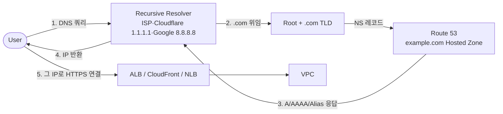
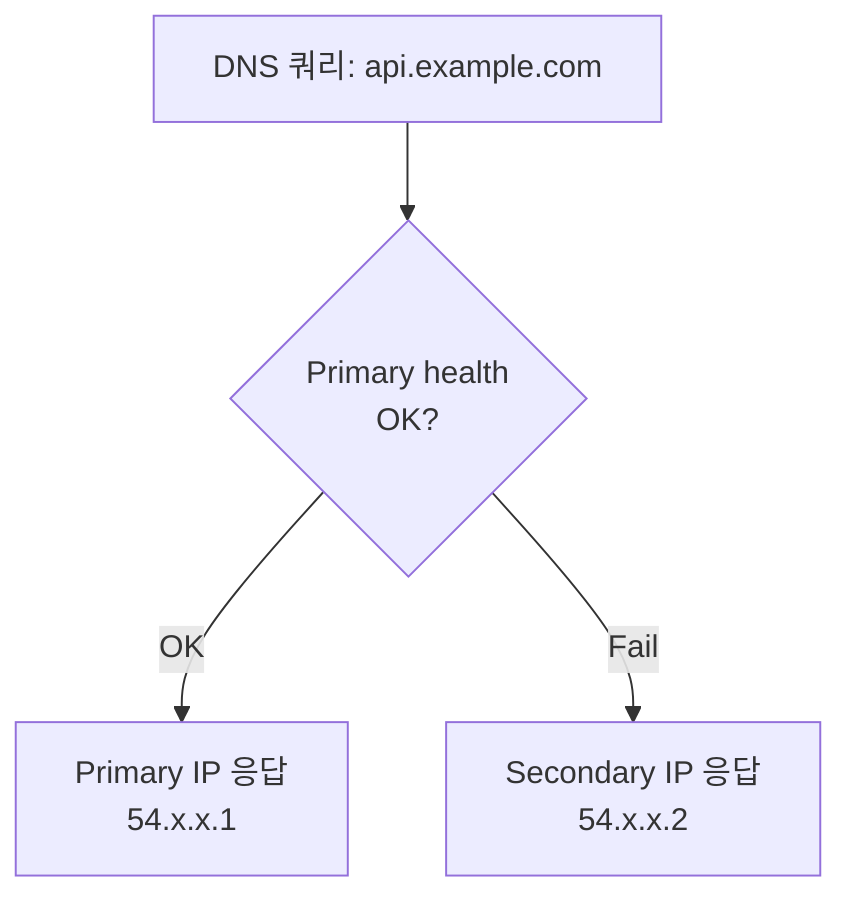
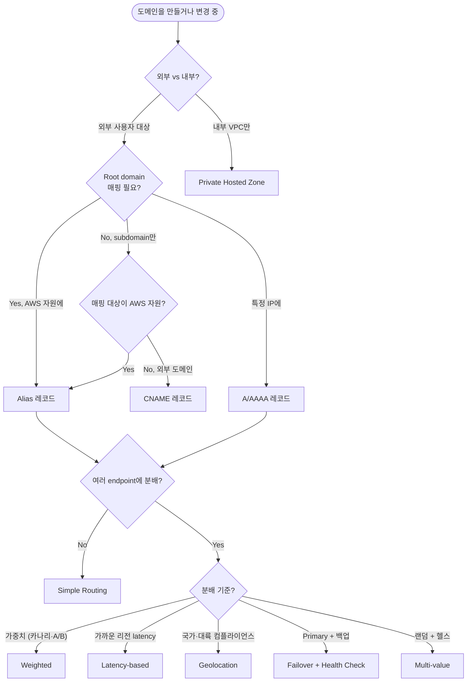

## 서론

1편에서 외부 트래픽이 VPC로 들어오는 진입점(ALB·NLB·API Gateway·CloudFront·GA)을 골랐다. 그런데 사용자가 그 진입점에 도달하기 전에 항상 먼저 일어나는 결정이 있다 — <strong>DNS 해석</strong>이다. `https://api.example.com`을 입력하면 브라우저가 IP를 알기 위해 DNS 쿼리를 날리고, 이 시점에 어떤 IP·CNAME으로 해석되는가가 트래픽이 어느 진입점·리전·인스턴스로 가는지를 좌우한다.

이 결정 layer를 책임지는 게 **Route 53**다. 시리즈를 마무리하면서 Route 53의 핵심 결정 — Hosted Zone 선택, Record type, Routing Policy, Health Check — 을 한 글에 정리한다.

- 0편 — [사전편: 네트워크·AWS 기본 개념 정리](/blog/aws-vpc-edge-routing-guide-0)
- 1편 — [외부 진입점 선택: ALB / NLB / API Gateway / CloudFront / Global Accelerator](/blog/aws-vpc-edge-routing-guide-1)
- 2편 — [VPC 간·온프레미스 연결: VPC Endpoint / PrivateLink / Peering / Transit Gateway / VPN / Direct Connect](/blog/aws-vpc-edge-routing-guide-2)
- 3편 — [VPC 내부 라우팅: IGW / NAT GW / Route Tables / Security Group vs NACL](/blog/aws-vpc-edge-routing-guide-3)
- <strong>4편 — DNS 결정과 Route 53 (이 글)</strong>
- 5편 — 표준 패턴 4가지: 결정 트리에서 처음 그릴 때까지

대상 독자는 시리즈 다른 편들과 같다 — Route 53를 콘솔에서 만져본 적은 있지만 Routing Policy 6종이 어떻게 다른지, Alias가 왜 CNAME보다 나은지, Private Hosted Zone이 VPC Endpoint와 어떻게 상호작용하는지 막막한 백엔드/인프라 엔지니어. 다 읽고 나면 <strong>DNS 결정도 결정 트리 한 장으로 처리할 수 있는</strong> 상태가 목표다.

---

## TL;DR

- <strong>Route 53는 1·2·3편의 진입점들보다 항상 먼저</strong> 일어나는 라우팅 결정이다 — 사용자 → DNS 해석 → 진입점(ALB·CloudFront 등) → VPC 순서.
- <strong>Hosted Zone은 Public vs Private</strong>으로 갈린다. Public은 인터넷에서 보이는 도메인, Private은 VPC 안에서만 해석되는 내부 도메인.
- <strong>Alias 레코드는 AWS 자원(ALB·CloudFront·S3·API Gateway 등)을 도메인 root에 연결</strong>하는 표준 답이다. CNAME은 root에 못 붙이고, 추가 DNS 쿼리(과금)가 발생한다.
- <strong>Routing Policy 6종</strong>은 트래픽 분배 전략이다 — Simple(기본) / Weighted(비율) / Latency(가까운 리전) / Geolocation(국가별) / Geoproximity(지리 + bias) / Multi-value(랜덤 + health) / Failover(주-부).
- <strong>Health Check + Failover routing이 결합되면 DNS 단에서 자동 fail-over</strong>가 가능하다. 다만 DNS TTL 때문에 분 단위 지연 — 초 단위 failover가 필요하면 Global Accelerator나 ALB 헬스체크가 더 적합.

---

## 1. Route 53가 트래픽 흐름의 어디 위치하는가

사용자가 `https://api.example.com`을 입력하는 순간부터 백엔드 EC2에 도달하기까지의 실제 흐름을 보면, **Route 53는 모든 것의 가장 앞에 있다**.

핵심 사실 셋:

- <strong>Route 53는 권한있는(Authoritative) DNS 서버</strong>다. 즉 "example.com의 NS 레코드는 Route 53를 가리켜라"는 위임이 끝나면, 그 도메인의 모든 DNS 쿼리는 Route 53에 도달.
- <strong>응답이 캐시된다</strong>. 클라이언트(브라우저·OS), 중간 resolver(ISP·Cloudflare 1.1.1.1), CDN edge 등이 응답을 TTL 시간 동안 보관. 이게 DNS 기반 routing의 결정적 특성 — DNS 변경이 즉시 전파되지 않는다.
- <strong>Route 53가 라우팅 결정을 한다</strong>. 단순한 "도메인 → IP 변환"이 아니라, Routing Policy에 따라 요청자의 위치·기존 가중치·헬스 상태 등을 보고 **응답할 IP를 골라** 반환한다. 이게 Route 53가 "DNS 서버"를 넘어 "라우팅 도구"인 이유.

---

## 2. Hosted Zone — Public vs Private

<strong>Hosted Zone(호스팅 영역)은 Route 53의 한 도메인에 대한 설정 컨테이너</strong>다. `example.com`이라는 도메인의 모든 레코드(A·CNAME·MX 등)가 Hosted Zone에 모여 있다.

종류는 **Public Hosted Zone**과 **Private Hosted Zone** 두 가지.

### 2.1 Public Hosted Zone

- 인터넷 어디서나 해석 가능한 일반 도메인.
- 도메인 등록 기관(Route 53 Domains·GoDaddy·Cloudflare 등)에서 NS 레코드를 Route 53로 위임하면 Public Hosted Zone이 활성화된다.
- 비용: 호스팅 영역당 월 $0.50 + 100만 쿼리당 $0.40.

### 2.2 Private Hosted Zone

- <strong>특정 VPC들에서만 해석되는 내부 전용 도메인</strong>.
- 예: `internal.example.com`을 Private Hosted Zone으로 설정하고 VPC A·B를 연결 → 이 도메인은 VPC A·B 안에서만 해석되고 인터넷에선 보이지 않음.
- 사용처: 마이크로서비스 내부 통신용 도메인, RDS endpoint 친근한 이름, 서비스 디스커버리.
- 같은 도메인을 Public과 Private에 모두 등록 가능 — VPC 안에서는 Private 응답, 외부에서는 Public 응답 (split-horizon DNS).

### 2.3 분기 — 언제 Public, 언제 Private

| 상황 | 선택 |
| --- | --- |
| 일반 웹 서비스 도메인 (외부 사용자 대상) | <strong>Public Hosted Zone</strong> |
| 내부 마이크로서비스 통신용 도메인 | <strong>Private Hosted Zone</strong> |
| 외부에는 광고용, VPC 안에서는 다른 백엔드로 | 둘 다 (split-horizon) |
| RDS·ElastiCache의 매니지드 endpoint | Private 사용 가능 (default DNS도 가능) |

> <strong>참고 — VPC Endpoint Private DNS와의 관계</strong>: 2편에서 "Interface Endpoint는 Private DNS를 붙여서 서비스의 공식 도메인이 ENI의 사설 IP로 해석되도록 한다"고 했다. 이때 사용되는 Private DNS는 Route 53의 Private Hosted Zone 메커니즘과 같은 것 — AWS가 Endpoint 생성 시 자동으로 Private Hosted Zone을 만들어준다.

---

## 3. Record Types와 Alias vs CNAME

DNS는 도메인 → 어떤 정보로의 매핑이고, 매핑되는 정보의 종류가 <strong>레코드 타입</strong>이다.

### 3.1 자주 쓰이는 레코드 타입

| 타입 | 매핑 대상 | 흔한 용도 |
| --- | --- | --- |
| <strong>A</strong> | 도메인 → IPv4 주소 | 가장 기본 — `api.example.com → 54.x.x.x` |
| <strong>AAAA</strong> | 도메인 → IPv6 주소 | IPv6 듀얼 스택 |
| <strong>CNAME</strong> | 도메인 → 다른 도메인 | `www.example.com → cdn.cloudfront.net` |
| <strong>MX</strong> | 도메인 → 메일 서버 | 이메일 라우팅 |
| <strong>TXT</strong> | 도메인 → 문자열 | SPF·DKIM·도메인 검증 |
| <strong>NS</strong> | 도메인 → 권한있는 nameserver | 도메인 위임 |
| <strong>Alias</strong> | 도메인 → AWS 자원 | <strong>AWS 전용. 핵심</strong> |

### 3.2 Alias 레코드 — AWS의 결정적 무기

<strong>Alias 레코드는 Route 53가 AWS 자원(ALB·CloudFront·S3·API Gateway·Global Accelerator·Elastic Beanstalk 등)을 도메인에 직접 매핑할 수 있게 해주는 비표준 레코드</strong>다.

겉보기엔 CNAME과 비슷하지만 결정적 차이가 있다.

### 3.3 Alias vs CNAME

| | CNAME | Alias |
| --- | --- | --- |
| 매핑 대상 | 임의 도메인 | <strong>AWS 자원만</strong> (ALB, CloudFront, S3, API Gateway, GA 등) |
| Root domain (`example.com`) 적용 | <strong>X (불가)</strong> | <strong>O (가능)</strong> |
| DNS 쿼리 횟수 | 2번 (CNAME → 그 도메인의 A 조회) | 1번 (Route 53가 내부에서 IP 직접 응답) |
| 비용 | 일반 쿼리 과금 | <strong>무료</strong> (Alias 쿼리는 과금 없음) |
| AWS 자원 IP 변경 추적 | X (CNAME 그대로) | O (자동 추종) |

핵심 두 가지:

- <strong>Root domain에 CNAME 못 붙이는 게 DNS 표준</strong>이다 (RFC 1034). `example.com → ALB DNS`를 하려면 CNAME으론 불가능. AWS가 이 한계를 우회하려고 만든 게 Alias.
- <strong>Alias는 추가 DNS 쿼리·과금 없음</strong>. CNAME은 클라이언트가 추가로 그 대상 도메인의 A 레코드를 조회해야 하지만, Alias는 Route 53가 내부에서 ALB·CloudFront의 실제 IP를 알아서 응답.

> <strong>실무 함정</strong>: `example.com`을 ALB에 붙이려는데 CNAME으로 해놓고 안 되는 케이스가 정말 흔하다. 답은 항상 <strong>Alias 레코드</strong> — root든 subdomain이든 AWS 자원 매핑은 Alias가 거의 항상 정답.

---

## 4. Routing Policy 6종 — Route 53의 핵심 결정

Route 53가 단순 DNS 서버를 넘어 "라우팅 도구"인 이유. 같은 도메인에 여러 레코드를 등록하고, **어떤 응답을 줄지를 정책으로 결정**한다.

### 4.1 Simple — 기본 단일 응답

- 한 레코드 = 한 응답. 라우팅 결정 없음.
- 가장 단순. `api.example.com → ALB DNS` 같은 1대1 매핑.

### 4.2 Weighted — 가중치 기반 분배

- 같은 도메인에 여러 레코드 등록 + 각각 가중치 부여.
- 예: `api.example.com → 10.0.0.1 (weight 90)`, `→ 10.0.0.2 (weight 10)` → 90%는 첫 번째, 10%는 두 번째.
- 사용처: <strong>카나리 배포</strong>(새 버전에 10%만 우선 보냄), A/B 테스트.

### 4.3 Latency-based — 가장 가까운 리전

- 여러 리전에 같은 서비스를 띄워 두고, 사용자에게 **latency가 가장 낮은 리전의 IP**를 응답.
- 사용처: 글로벌 멀티 리전 서비스. 미국 사용자는 us-east-1, 유럽은 eu-west-1, 아시아는 ap-northeast-2 응답.
- Global Accelerator의 routing과 비슷하지만 Route 53는 **DNS layer에서 결정**(GA는 anycast IP layer에서 결정).

### 4.4 Geolocation — 국가·대륙 기반

- 요청자의 지리적 위치(국가·대륙·미국 주)별로 다른 응답.
- 사용처: 국가별 컴플라이언스(EU GDPR 데이터는 EU 리전으로), 지역별 컨텐츠 라우팅(중국은 중국 리전).
- Latency-based와 다른 점: 거리 기반(latency)이 아니라 **정치·법적 경계** 기반.

### 4.5 Geoproximity — 지리 거리 + Bias

- Geolocation의 일반화. 위경도 좌표로 거리 계산 + 각 리소스에 bias(±99%)를 줘서 영역 크기 조정.
- 사용처: "텍사스 사용자는 50% 시간은 us-east, 50%는 us-west" 같은 정밀 분배.
- 가장 복잡 — 일반적인 케이스에선 거의 안 씀.

### 4.6 Multi-value Answer — 랜덤 응답 + 헬스체크

- 같은 도메인에 여러 레코드 등록, 쿼리당 **최대 8개 IP를 랜덤 순서로 응답**(헬스 체크 통과한 것만).
- 사용처: 매니지드 가벼운 로드밸런싱 — ALB가 부담스러운 환경에서.
- 클라이언트가 응답된 8개 IP 중 첫 번째에 실패하면 다음을 시도(브라우저 기본 동작).

### 4.7 Failover — 주(Primary) + 부(Secondary)

- Primary 레코드 + Secondary 레코드 + Health Check.
- Primary의 health check가 실패하면 자동으로 Secondary 응답.
- 사용처: 재해 복구(DR), 멀티 리전 active-passive.

### 4.8 비교 요약 표

| Policy | 분배 기준 | 흔한 용도 |
| --- | --- | --- |
| Simple | 단일 응답 | 일반 1:1 매핑 |
| Weighted | 가중치 비율 | 카나리·A/B 테스트 |
| Latency | 가장 가까운 리전 | 글로벌 멀티 리전 |
| Geolocation | 국가·대륙 | 컴플라이언스·지역별 컨텐츠 |
| Geoproximity | 위경도 + bias | 정밀 지리 분배 (드묾) |
| Multi-value | 랜덤 + 헬스 | 매니지드 가벼운 LB |
| Failover | Primary + Secondary | DR·active-passive |

---

## 5. Health Check — DNS 단의 자동 failover

Route 53의 Health Check는 <strong>특정 endpoint(또는 다른 헬스 체크의 조합)가 살아있는지 주기적으로 확인하고, 죽은 응답은 DNS 결과에서 빼는 메커니즘</strong>이다.

### 5.1 Health Check 3 종류

| 종류 | 동작 |
| --- | --- |
| <strong>Endpoint</strong> | 지정한 IP·도메인의 특정 포트에 HTTP/HTTPS/TCP 요청을 30초마다(또는 10초마다) 보내고 응답 코드·문자열 확인 |
| <strong>Calculated</strong> | 여러 다른 health check를 AND/OR로 조합 — "A·B·C 중 2개 이상이 OK여야 통과" |
| <strong>CloudWatch Alarm</strong> | CloudWatch 알람 상태에 연동 — CPU·custom metric 기반 헬스 |

### 5.2 Failover Routing과의 결합

- Primary의 health가 fail이면 자동으로 Secondary로 failover.
- DNS 응답 자체가 바뀌므로 클라이언트는 다음 쿼리부터 새 IP로 연결.

### 5.3 한계 — DNS TTL 지연

DNS 기반 failover의 약점은 <strong>TTL 캐시 때문에 즉시 전파되지 않는다</strong>는 것. TTL이 60초면 클라이언트가 1분간 기존 IP를 캐시한 채로 사용. 따라서:

- <strong>분 단위 failover</strong>면 DNS 기반 OK
- <strong>초 단위 failover</strong>가 필요하면 Global Accelerator(anycast IP, TTL 영향 없음)나 ALB target health check(L7 단에서 health 빠짐)로 가야 함.

---

## 6. DNS 결정 트리

위 결정 변수를 통합하면 DNS 영역의 결정 트리가 나온다.

분기 한 줄씩:

- <strong>Q1</strong>: 외부 사용자 대상이면 Public Hosted Zone, VPC 안에서만 쓸 도메인이면 Private.
- <strong>Q2-Q3</strong>: AWS 자원(ALB·CloudFront 등)을 매핑하면 거의 무조건 Alias. 외부 도메인이면 CNAME, 특정 IP면 A.
- <strong>Q4-Q5</strong>: 단일 endpoint면 Simple, 여러 곳에 분배하려면 분배 기준에 따라 Weighted/Latency/Geolocation/Failover/Multi-value 중 선택.

---

## 7. Route 53 vs Global Accelerator vs CloudFront — 같은 자리?

세 서비스 모두 "글로벌 사용자에게 적절한 endpoint를 라우팅"한다는 점에서 결정 영역이 겹친다. 하지만 동작 layer와 적합 시나리오가 다르다.

| | Route 53 (Latency Routing) | Global Accelerator | CloudFront |
| --- | --- | --- | --- |
| 동작 layer | DNS (응답 IP를 다르게) | Anycast IP (네트워크 layer) | Edge 캐싱 (HTTP layer) |
| Failover 속도 | 분 단위 (DNS TTL) | 초 단위 (anycast 자동) | 초 단위 (edge health) |
| 정적 IP | X (DNS 응답이 변동) | <strong>O (영구 anycast IP 2개)</strong> | X |
| 캐싱 | X | X | <strong>O</strong> |
| AWS 백본 사용 | (직접 관여 X) | <strong>O (전 구간)</strong> | O (cache miss 시) |
| 비용 | 호스팅 영역 + 쿼리당 | 시간당 ~$18 + 데이터 전송 | 데이터 전송 + 요청당 |
| 적합 시나리오 | 멀티 리전 일반 분배 | 정적 IP·초 단위 failover·UDP·게임 | 정적 자산·HTTP 캐싱 |

### 결정 한 줄

| 상황 | 선택 |
| --- | --- |
| 단순 글로벌 라우팅, 비용 민감 | <strong>Route 53 Latency-based</strong> |
| 정적 IP 화이트리스트·UDP·게임 | <strong>Global Accelerator</strong> |
| 정적 자산 많음·HTTP 캐싱 효과 | <strong>CloudFront</strong> |
| 셋 다 결합 가능 | DNS(Route 53) → CloudFront → ALB가 흔한 패턴 |

세 서비스는 대안이라기보다 **다른 layer에서 함께 쓰이는 경우가 많다**. Route 53로 도메인을 CloudFront에 alias로 보내고, CloudFront origin이 ALB이고, ALB 뒤에 EC2가 있는 식.

---

## 8. 흔한 안티패턴 5가지

### 8.1 Root domain에 CNAME 시도

`example.com`(root)을 ALB에 CNAME으로 붙이려는 경우. <strong>DNS 표준상 root에 CNAME 불가</strong>(RFC 1034). 답은 항상 Alias. CDN 기반 서비스에서 자주 부딪히는 첫 번째 함정.

### 8.2 TTL을 너무 짧게 설정

"빠른 failover를 위해 TTL을 5초로" 설정. <strong>모든 클라이언트가 매 요청마다 DNS 쿼리를 다시 하니 비용·지연 폭증</strong>. Route 53 쿼리당 과금 + 사용자 체감 latency 증가. 적절한 TTL은 60~300초가 일반적이고, 진짜 빠른 failover가 필요하면 Global Accelerator로.

### 8.3 Failover routing만 깔고 health check 안 붙임

Failover routing으로 Primary·Secondary를 설정해놓고 Health Check를 연결 안 하면 — <strong>Primary가 죽어도 failover가 안 일어난다</strong>. Route 53가 health 정보 없이는 Primary를 fail이라고 판단할 근거가 없음. 항상 Health Check 결합 필수.

### 8.4 CloudFront alias에 Hosted Zone ID 모름

Alias 레코드를 만들 때 CloudFront·ALB·S3별로 <strong>Hosted Zone ID가 따로 정해져 있다</strong>. CloudFront는 항상 `Z2FDTNDATAQYW2`(전역 고정), ALB는 리전마다 다름. 콘솔에선 자동 처리되지만 Terraform·CloudFormation에선 명시 필요 — 잘못 적으면 조용히 실패.

### 8.5 Private Hosted Zone 연결 누락

Private Hosted Zone을 만들고 VPC 연결을 깜빡한 경우. <strong>Hosted Zone은 만들어졌지만 VPC 안에서 해석이 안 됨</strong>. 또는 다른 계정·리전 VPC에서 같은 Private Zone을 쓰려면 명시적 association 필요. 한 VPC에만 연결한 상태로 운영하다가 새 VPC 추가 시 잊는 패턴이 흔함.

---

## 정리

이 글에서 다룬 핵심:

1. <strong>Route 53는 1·2·3편의 진입점들보다 항상 먼저</strong> 일어나는 라우팅 결정이다. DNS 해석 결과가 어느 IP·진입점에 도달할지를 좌우.
2. <strong>Hosted Zone은 Public(인터넷)과 Private(VPC 내부)으로 갈린다</strong>. 둘을 같은 도메인에 같이 두는 split-horizon도 가능.
3. <strong>AWS 자원 매핑은 거의 항상 Alias</strong>. CNAME은 root에 못 붙고 추가 쿼리·과금이 발생.
4. <strong>Routing Policy 6종</strong>은 Simple / Weighted(카나리·A/B) / Latency(글로벌 리전) / Geolocation(국가) / Multi-value(랜덤+health) / Failover(주·부) — 분배 기준에 따라 선택.
5. <strong>Health Check는 DNS 단의 자동 failover</strong>를 가능하게 한다. 다만 TTL 때문에 분 단위 — 초 단위 failover는 GA·ALB가 적합.

4편의 목표는 <strong>DNS 결정도 결정 트리 한 장으로 처리할 수 있는</strong> 상태였다. Hosted Zone 종류, 레코드 타입, Routing Policy를 차례로 묻고 답하면 거의 모든 케이스가 해결된다.

### 시리즈 회고

이 시리즈는 AWS 네트워크의 진입과 라우팅을 <strong>"어떤 결정 문제를 푸는가"</strong>의 관점에서 6편에 걸쳐 정리한다.

- <strong>0편</strong> — 사전편: 시리즈를 따라가기 위한 네트워크·AWS 기본 개념 정리
- <strong>1편</strong> — 외부 트래픽이 VPC로 들어오는 진입점 결정 (ALB / NLB / API Gateway / CloudFront / Global Accelerator). 4가지 결정 변수와 결정 트리.
- <strong>2편</strong> — VPC가 다른 VPC·AWS 서비스·온프레미스와 잇히는 방법 (VPC Endpoint / PrivateLink / Peering / Transit Gateway / VPN / Direct Connect). 1단계 분기는 "목적지 종류".
- <strong>3편</strong> — VPC 안에서 패킷이 흐르는 방식 (IGW / NAT GW / Route Tables / SG vs NACL). 결정이라기보다 메커니즘 이해.
- <strong>4편</strong> — DNS 결정과 Route 53. 모든 진입점보다 먼저 일어나는 결정 영역.
- <strong>5편</strong> — 표준 패턴 4가지. 0~4편의 결정 트리들을 "처음 그릴 때 출발점"이라는 합성 layer에서 다시 보는 마무리 편.

여섯 편을 합치면 <strong>"DNS → 외부 진입점 → VPC → 내부 → 다른 시스템"의 전 경로를 결정 트리로 따라가고, 표준 패턴 4가지를 출발점으로 처음부터 그릴 수 있는</strong> 상태가 만들어진다. 0~4편이 분해, 5편이 합성. 새 서비스를 그릴 때 이 둘을 동시에 굴리는 게 인프라 설계의 출발점이다.

후속으로 다룰 만한 주제는 — 보안 (WAF·Shield·SG·NACL·Network Firewall·GuardDuty·VPC Lattice), 비용 최적화(VPC 트래픽 비용 패턴), 관찰성(VPC Flow Logs·Reachability Analyzer·Route 53 Resolver Query Logs), 멀티 어카운트(AWS Organizations + Resource Access Manager + 도메인 위임). 보안은 별도 시리즈(<strong>AWS VPC 보안 가이드</strong>)로 분리해 다룰 예정이다 — 결정 영역과 narrative가 다르고, 한 시리즈에 묶기엔 부피가 커서.

---

## 부록. 한 페이지 요약

### A. Hosted Zone 분기

| 상황 | 선택 |
| --- | --- |
| 외부 사용자 대상 도메인 | Public Hosted Zone |
| VPC 내부 전용 도메인 | Private Hosted Zone |
| Split-horizon (외부와 내부 다른 응답) | 둘 다 |

### B. 레코드 선택

| 매핑 대상 | 사용할 레코드 |
| --- | --- |
| AWS 자원 (ALB·CloudFront·S3·API Gateway·GA) | <strong>Alias</strong> (root든 subdomain이든) |
| 외부 도메인 (subdomain) | CNAME |
| 외부 도메인 (root) | <strong>안 됨 — 다른 방법 모색</strong> |
| 특정 IP | A (IPv4) / AAAA (IPv6) |
| 메일 서버 | MX |
| 도메인 검증·SPF | TXT |

### C. Routing Policy 한 줄 요약

| Policy | 한 줄 |
| --- | --- |
| Simple | 1:1 매핑, 라우팅 없음 |
| Weighted | 가중치 비율 분배 (카나리) |
| Latency | 가까운 리전 |
| Geolocation | 국가·대륙 |
| Geoproximity | 위경도 + bias (드묾) |
| Multi-value | 랜덤 8개 + health |
| Failover | Primary + Secondary + health |

### D. AWS 공식 문서

- Route 53: <https://docs.aws.amazon.com/Route53/latest/DeveloperGuide/>
- Routing Policy 비교: <https://docs.aws.amazon.com/Route53/latest/DeveloperGuide/routing-policy.html>
- Health Check: <https://docs.aws.amazon.com/Route53/latest/DeveloperGuide/dns-failover.html>
- Hosted Zone: <https://docs.aws.amazon.com/Route53/latest/DeveloperGuide/hosted-zones-working-with.html>

### E. 약어

| 약어 | 풀이 |
| --- | --- |
| DNS | Domain Name System. 도메인 → IP 해석 |
| TTL | Time To Live. DNS 응답이 캐시되는 시간 |
| Hosted Zone | Route 53의 한 도메인 설정 컨테이너 |
| Alias | AWS 자원 직접 매핑 레코드 (Route 53 전용) |
| Health Check | endpoint 살아있음을 주기 확인하는 메커니즘 |
| TLD | Top Level Domain. `.com`, `.kr` 등 |
| NS | Name Server. 권한있는 nameserver 지정 레코드 |
