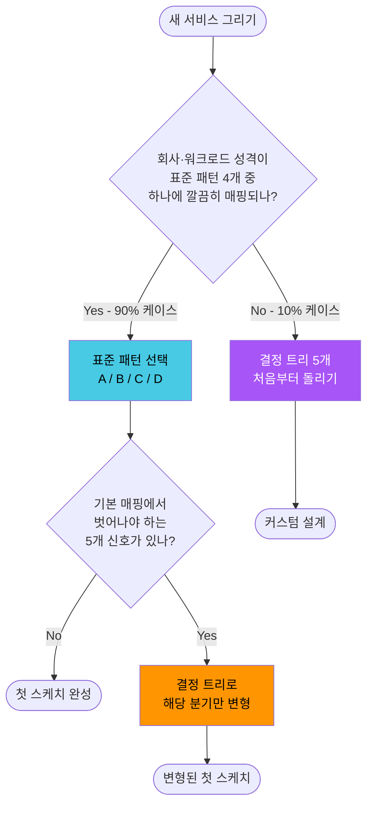

## 서론

0편에서 사전 개념을 깔고, 1·2·3편에서 외부 진입점·VPC 간 연결·내부 라우팅의 결정 트리를 풀고, 4편에서 DNS까지 마무리했다. 그런데 시리즈를 다 읽고 빈 캔버스를 마주하면 묘하게 막막하다 — <strong>"어디부터 그려야 하지?"</strong>가 답이 없기 때문이다. 결정 트리가 5장 있어도 그것들을 어떤 순서로, 어떤 의존 관계로 풀어야 할지는 분해된 트리 어디에도 없다.

이게 시리즈 결정 트리들의 본질적 한계다. <strong>결정 트리는 "후보 목록과 갈림길"을 주지만, 출발점은 주지 않는다.</strong> 실무에서 새 서비스를 그릴 때 사람들이 진짜로 하는 건 결정 트리 5개를 처음부터 동시에 돌리는 게 아니다 — <strong>비슷한 회사·비슷한 규모·비슷한 워크로드가 쓰는 표준 패턴에서 출발해, 우리 제약에 맞춰 변형</strong>한다. 결정 트리는 그 변형을 의식적으로 할 때 쓰는 도구.

이 글은 시리즈를 마무리하면서 그 합성을 한다. 실무 90%가 수렴하는 표준 패턴 4가지를 정리하고, 패턴별로 0~4편의 결정 트리가 어떤 디폴트로 채워지는지 표를 만들고, "표준에서 벗어나야 하는 신호"가 무엇인지 짚는다. 다 읽고 나면 <strong>새 서비스를 그릴 때 5분 안에 표준 패턴을 골라 첫 스케치를 그리고, 그 다음 결정 트리로 디테일을 채우는</strong> 흐름이 잡힌다.

- 0편 — [사전편: 네트워크·AWS 기본 개념 정리](/blog/aws-vpc-edge-routing-guide-0)
- 1편 — [외부 진입점 선택: ALB / NLB / API Gateway / CloudFront / Global Accelerator](/blog/aws-vpc-edge-routing-guide-1)
- 2편 — [VPC 간·온프레미스 연결: VPC Endpoint / PrivateLink / Peering / Transit Gateway / VPN / Direct Connect](/blog/aws-vpc-edge-routing-guide-2)
- 3편 — [VPC 내부 라우팅: IGW / NAT GW / Route Tables / Security Group vs NACL](/blog/aws-vpc-edge-routing-guide-3)
- 4편 — [DNS 결정과 Route 53: Hosted Zone / Routing Policy / Alias vs CNAME / Health Check](/blog/aws-vpc-edge-routing-guide-4)
- <strong>5편 — 표준 패턴 4가지: 결정 트리에서 처음 그릴 때까지 (이 글)</strong>

대상 독자는 시리즈 다른 편들과 같다 — 결정 트리 5개를 다 따라가본 백엔드/인프라 엔지니어. 다 읽고 나면 <strong>"이 회사·이 워크로드면 패턴 X에서 시작하고, 결정 트리로는 분기 Y만 다르게 채우면 된다"</strong>가 자동으로 떠오르는 상태가 목표다.

---

## TL;DR

- <strong>결정 트리는 "고를 후보"를 주지만 "출발점·결정 순서·상호 의존성"을 안 준다</strong>. 빈 캔버스 앞에서 5개 트리를 동시에 돌리는 건 비효율적이고, 실무에선 표준 패턴에서 출발해 변형한다.
- <strong>실무 90%는 4가지 표준 패턴 중 하나로 수렴한다</strong> — A) Serverless API, B) Container Web, C) 글로벌 Latency-sensitive, D) 하이브리드 엔터프라이즈. 각 패턴이 0~4편의 결정 트리를 어떤 디폴트로 채우는지가 정해져 있다.
- <strong>결정 기준은 3 layer로 합성된다</strong> — Well-Architected 5축(운영·보안·신뢰성·성능·비용) + 비즈니스 제약(예산·규제·SLO·기존 자산) + 팀 역량(익숙한 도구·운영 부담 감수 수준). 이 셋이 패턴 선택을 결정한다.
- <strong>표준에서 벗어나야 하는 신호 5가지</strong>가 따로 있다. "내 회사는 다르다"가 진짜인 케이스 vs 자기 합리화인 케이스를 구분하는 기준.
- <strong>결정 트리는 처음 그릴 때 쓰는 도구가 아니라 "패턴에서 벗어나야 할 때" 쓰는 도구</strong>다. 패턴 = 출발점, 결정 트리 = 변형 도구. 시리즈 전체가 이 합성으로 완결된다.

---

## 1. 결정 트리의 한계 — 분해는 잘 되지만 출발점이 안 보인다

0~4편의 결정 트리는 각자 자기 영역에서 잘 작동한다. 1편의 "L7 vs L4 → 인증 필요 → 정적 IP 필요" 같은 분기는 명확하고, 2편의 "목적지 종류 → AWS 관리 서비스/다른 VPC/온프레미스" 분기도 깔끔하다. 그런데 <strong>5개 트리를 동시에 들고 빈 캔버스 앞에 서면 작동 방식이 무너진다</strong>.

이유는 세 가지다.

첫째, <strong>결정 트리는 출발점을 안 알려준다</strong>. "L7인지 L4인지부터 묻는다"가 1편의 시작인데, 정작 새 서비스를 그릴 때 가장 먼저 묻는 건 그게 아니다. "이 회사는 무슨 회사인가? 트래픽 규모는? 글로벌인가?" — 이 질문들이 L7/L4 결정보다 위에 있다.

둘째, <strong>결정 트리는 결정의 순서를 안 알려준다</strong>. 진입점(1편)을 먼저 정해야 하나, DNS(4편)를 먼저 정해야 하나? VPC 구조(3편)는 진입점보다 먼저인가 나중인가? 시리즈 안에선 4편이 시간순으로 1편보다 먼저(DNS 해석이 먼저 일어남)라고 짚었지만, 실제 설계에선 거꾸로 — 진입점을 정해야 어떤 도메인 매핑을 할지 결정된다.

셋째, <strong>결정 트리는 결정 간 상호 의존성을 안 보여준다</strong>. 1편의 "CloudFront 쓸지"는 2편의 "S3 백엔드 가질지"와 맞물리고, 둘 다 4편의 "글로벌 사용자인지"에 의존한다. 트리 한 장을 따라가면 다른 트리가 이미 어떤 가정을 깔고 있어야 한다.

> <strong>핵심</strong>: 결정 트리 5장은 <strong>"개별 결정 지점의 정답"을 알려주는 도구</strong>이지 <strong>"전체 설계의 출발점"을 주는 도구가 아니다</strong>. 출발점은 다른 layer에서 와야 한다 — 그게 표준 패턴이다.

---

## 2. 실무 90%가 수렴하는 표준 패턴 4가지

새 AWS 인프라를 그리는 90%의 케이스는 다음 4개 패턴 중 하나로 수렴한다. 각 패턴이 진입점·컴퓨트·데이터 layer를 어떻게 채우는지가 정해져 있다.

| 패턴 | 진입 layer | 컴퓨트 | 데이터 |
| --- | --- | --- | --- |
| <strong>A. Serverless API</strong> | CloudFront → API Gateway HTTP API | Lambda | DynamoDB |
| <strong>B. Container Web</strong> | CloudFront → ALB | ECS / EKS | RDS |
| <strong>C. 글로벌 Latency-sensitive</strong> | Route 53 Latency → Global Accelerator | 리전별 NLB | 게임 서버 / 트레이딩 |
| <strong>D. 하이브리드 엔터프라이즈</strong> | Direct Connect → Transit Gateway | 멀티 VPC + 온프렘 | Compliance workload |

### 2.1 패턴 A — Serverless API

CloudFront → API Gateway HTTP API → Lambda → DynamoDB. 운영 부담 없이 빠르게 띄우는 표준.

- <strong>언제 고르나</strong>: 트래픽이 적거나 spiky한 워크로드, 백오피스·내부 도구, 이벤트 기반 처리, 스타트업 초기 MVP, 사이드 프로젝트.
- <strong>핵심 장점</strong>: 운영 0(서버 없음), 자동 스케일, 사용한 만큼만 과금(idle 비용 0), 인증·쓰로틀이 API Gateway에 포함.
- <strong>핵심 약점</strong>: cold start, 요청당 단가가 비쌈(트래픽 일정 수준 넘으면 ALB+ECS가 더 쌈), Lambda timeout 15분, VPC 안 백엔드 호출 시 VPC Link 필요(비용·복잡도 증가).
- <strong>전형적 회사</strong>: 초기 스타트업, 사내 어드민, 사이드 프로젝트, 이벤트 기반 자동화.

### 2.2 패턴 B — Container Web

CloudFront → ALB → ECS/EKS → RDS. 가장 흔한 표준, 일반 SaaS·웹앱의 90%.

- <strong>언제 고르나</strong>: 일정 규모 이상의 트래픽, 일반적인 웹앱·API 서비스, 컨테이너 친숙한 팀, RDB 중심 워크로드.
- <strong>핵심 장점</strong>: 트래픽이 일정 수준을 넘으면 가장 비용 효율적, 컨테이너 표준 도구(Docker·k8s) 활용, ALB의 host/path 라우팅으로 한 진입점에 여러 서비스 호스팅, RDS의 매니지드 데이터 layer.
- <strong>핵심 약점</strong>: 컨테이너 운영 부담(EKS는 특히), idle 비용 있음, 자동 스케일은 가능하지만 Lambda만큼 빠르지 않음.
- <strong>전형적 회사</strong>: 중견 SaaS, 일반 웹 서비스, B2B API, 모바일 앱 백엔드.

### 2.3 패턴 C — 글로벌 Latency-sensitive

Route 53 Latency Routing → Global Accelerator → 리전별 NLB → 게임 서버·금융 시스템. 지연이 비즈니스 가치인 워크로드.

- <strong>언제 고르나</strong>: 실시간 게임, 트레이딩·금융 시스템, 글로벌 분산 사용자가 ms 단위 지연에 민감한 SaaS, WebRTC·VoIP·라이브 스트리밍.
- <strong>핵심 장점</strong>: 사용자가 가장 가까운 AWS edge에 들어간 뒤 백본 망으로 라우팅(인터넷 hop 회피), 정적 anycast IP, 리전 장애 시 자동 failover, L4 NLB로 ultra-low latency.
- <strong>핵심 약점</strong>: 비용 비쌈(GA 시간당 $18/월 + 데이터 처리), HTTP가 아닌 워크로드라 L7 부가 기능(인증·캐시) 없음, 멀티 리전 운영 부담.
- <strong>전형적 회사</strong>: 게임 회사, 핀테크·트레이딩, 글로벌 SaaS(Notion·Figma 류).

### 2.4 패턴 D — 하이브리드 엔터프라이즈

Direct Connect → Transit Gateway → 멀티 VPC + 온프레미스 데이터센터. 규제·기존 자산 제약이 강한 워크로드.

- <strong>언제 고르나</strong>: 금융·의료·정부 등 규제 산업, 대규모 온프레미스 자산이 있는 엔터프라이즈, 멀티 어카운트·멀티 VPC 표준화가 필요한 조직, 망분리 요건.
- <strong>핵심 장점</strong>: 온프레미스와 AWS 간 일관된 사설망(Direct Connect의 정해진 대역폭·낮은 지연), Transit Gateway의 N:N 라우팅으로 멀티 VPC 표준화, 규제 요건 충족 가능.
- <strong>핵심 약점</strong>: 비용 매우 비쌈(DX 회선 + TGW attachment + Cross-AZ), 구축 lead time 길음(DX는 주~월 단위), 운영 복잡도 높음.
- <strong>전형적 회사</strong>: 은행·보험·증권, 병원·제약, 정부·공공, 제조업 IT.

> <strong>결론</strong>: 회사 성격을 한 줄로 표현해보면 거의 자동으로 패턴이 정해진다 — "스타트업 MVP" → A, "일반 SaaS" → B, "게임·금융" → C, "은행·정부" → D. 90% 케이스가 이렇게 갈린다. 나머지 10%는 다음 절의 "벗어나는 신호"에 해당.

---

## 3. 패턴별 디폴트 매핑 — 0~4편 결정 트리가 어떻게 채워지는가

각 패턴이 0~4편 결정 트리의 각 분기에서 어떤 디폴트를 가지는지 한 표로 정리하면, "패턴 = 결정 트리의 사전 채움"임이 한눈에 보인다.

| 결정 영역 (편) | A. Serverless API | B. Container Web | C. 글로벌 Latency | D. 하이브리드 엔터프라이즈 |
| --- | --- | --- | --- | --- |
| <strong>1편 진입점 (L7/L4)</strong> | API Gateway HTTP API + CloudFront | ALB + CloudFront | NLB + Global Accelerator | ALB (내부) + DX |
| <strong>1편 인증·쓰로틀</strong> | API Gateway 내장 (JWT/OIDC) | ALB → 백엔드 또는 Cognito | 백엔드 자체 처리 | IAM + AD/LDAP 통합 |
| <strong>1편 글로벌 캐시</strong> | CloudFront 표준 | CloudFront 표준 | GA 백본 (CloudFront 옵션) | 보통 불필요 (내부망) |
| <strong>2편 AWS 서비스 접근</strong> | Lambda → DynamoDB 직접 | Gateway Endpoint (S3·DDB) | Gateway Endpoint | Gateway/Interface Endpoint 표준화 |
| <strong>2편 VPC 간 연결</strong> | 보통 단일 VPC | 3 VPC 이하: Peering, 4+ VPC: TGW (2편 3.3절 분기점과 동일) | 멀티 리전: Inter-region Peering 또는 TGW | <strong>TGW 필수</strong> (10+ VPC) |
| <strong>2편 온프레미스</strong> | 거의 없음 | VPN (필요 시) | 보통 없음 | <strong>Direct Connect + VPN backup</strong> |
| <strong>3편 Public/Private subnet</strong> | Lambda는 VPC 밖 (default) | Public: ALB / Private: ECS·RDS | Public: NLB / Private: 게임 서버 | 모두 Private (망분리) |
| <strong>3편 NAT GW</strong> | 거의 없음 | AZ당 1개 표준 | 필요 시 AZ당 1개 | 표준 패턴: AZ당 1개 |
| <strong>3편 SG/NACL</strong> | API Gateway가 거의 처리 | SG 중심, NACL은 부가 | SG + NACL (게임 트래픽 보호) | SG + NACL + Network Firewall |
| <strong>4편 Hosted Zone</strong> | Public Hosted Zone | Public Hosted Zone | Public + Private | Private 중심 (Public은 외부 노출 시) |
| <strong>4편 Routing Policy</strong> | Simple (Alias) | Simple (Alias) | <strong>Latency Routing</strong> | Failover (DR) |
| <strong>4편 Health Check</strong> | API Gateway 자체 | ALB target health check | <strong>GA + Route 53 Failover</strong> | Calculated Health Check |

이 표가 시리즈 결정 트리의 사실상 정답표다. <strong>패턴이 정해지면 결정 트리의 80% 분기는 자동으로 채워진다.</strong>

> <strong>참고</strong>: 표의 셀이 "표준 패턴에서 거의 항상 이거"의 의미이지 "예외가 없다"는 뜻은 아니다. 패턴 B 회사가 글로벌 사용자를 만나면 1편 분기를 "ALB + CloudFront"에서 "ALB + GA + CloudFront"로 옮길 수도 있다. 그때 결정 트리가 도구로 등장.

---

## 4. 결정 기준 3 layer — 패턴은 어떻게 정해지는가

"우리는 어느 패턴인가?"의 답은 3개 layer가 합쳐져 나온다. 한 layer만 보면 답이 빗나간다.

### 4.1 Well-Architected 5축

AWS의 공식 설계 프레임. 모든 결정을 5개 관점에서 검증한다.

| 축 | 질문 | 패턴 선택에의 영향 |
| --- | --- | --- |
| <strong>운영 우수성</strong> | 자동화·관찰성·실패 복구가 되나? | A는 매니지드라 운영 0, D는 운영 부담 가장 큼 |
| <strong>보안</strong> | IAM·암호화·격리가 되나? | D는 망분리·규제 충족이 핵심, A는 IAM Role·VPC 밖 default |
| <strong>신뢰성</strong> | Multi-AZ·백업·장애 격리가 되나? | C는 멀티 리전 failover가 본질, A·B는 Multi-AZ가 디폴트 |
| <strong>성능 효율</strong> | 적합한 서비스·캐시·글로벌인가? | C는 ms 단위가 본질, A·B는 일반 latency로 충분 |
| <strong>비용 최적화</strong> | 사용한 만큼·예약·right-sizing? | A는 idle 비용 0, B는 트래픽 일정 시 가장 쌈 |

### 4.2 비즈니스 제약

- <strong>예산</strong> — 월 $X 한도가 있나? Reserved Instance·Savings Plan 살 여력이 있나? 스타트업이면 idle 비용을 못 견뎌서 자동 A로 갈 가능성.
- <strong>규제</strong> — PCI-DSS·HIPAA·금융권 망분리 요건이 있나? 있으면 거의 자동으로 D, 없으면 A/B/C 중 선택.
- <strong>SLO</strong> — 99.9%면 단일 리전 충분, 99.99%면 멀티 리전 필요(C 또는 D 변형). 한 자릿수 차이가 패턴을 가른다.
- <strong>기존 자산</strong> — 온프레미스 데이터 센터·VMware·기존 AWS 어카운트가 있으면 D로 끌려가는 중력. 깡통이면 A/B/C 중 자유 선택.

### 4.3 팀 역량

- <strong>Kubernetes 운영해본 사람 있나?</strong> 없으면 EKS 대신 ECS·Fargate, 또는 아예 Lambda(A로).
- <strong>IaC 표준이 있나?</strong> Terraform·CDK·콘솔. 표준 없으면 매니지드(A) 우선.
- <strong>24/7 oncall 가능?</strong> 안 되면 매니지드 우선, 그래서 A·B 디폴트.
- <strong>네트워크 엔지니어 있나?</strong> 없으면 D는 사실상 불가능 (DX·BGP·Route 53 Resolver inbound endpoint 등 깊은 네트워크 지식 필요).

> <strong>결론</strong>: 패턴 선택은 <strong>"Well-Architected 5축으로 우리 워크로드를 검증 → 비즈니스 제약으로 후보 좁힘 → 팀 역량으로 최종 결정"</strong>의 3단계 합성이다. 결정 트리를 돌리기 전에 이 3 layer를 먼저 합성해야 결정 트리가 의미 있어진다.

---

## 5. 표준 패턴에서 벗어나야 하는 신호 5가지

90%는 패턴 안에 들어가지만 10%는 표준에서 벗어난다. 그 신호가 진짜인지 자기 합리화인지 구분하는 기준이 필요하다.

1. <strong>패턴 B인데 글로벌 사용자가 있다</strong> — B의 디폴트는 단일 리전이라 글로벌 사용자에게 latency가 느려진다. 이때 1편 결정 트리로 가서 "GA를 ALB 앞에 둘지" 또는 "패턴을 C로 변형할지" 결정. 진짜 신호: 글로벌 사용자 RTT 측정해서 200ms+면 진짜.
2. <strong>패턴 A인데 트래픽이 일정 수준 이상으로 꾸준</strong> — A의 idle 0 장점이 사라지고 요청당 단가가 누적된다. 분기점은 대략 월 200만 요청 (1편 2.5절 ALB vs API Gateway 분기점과 동일 기준), 그 이상이면 B로 변형 검토. 진짜 신호: 월간 청구서에서 API Gateway·Lambda 비용이 ALB·ECS 시간 비용을 넘어서기 시작.
3. <strong>패턴 D 규모인데 DX 못 깐다</strong> — 규제는 있지만 회사 규모상 DX($300+/월) 부담스러울 때. Site-to-Site VPN으로 시작해서 DX는 1년 후 마이그레이션. 진짜 신호: 온프레미스 트래픽이 월 1TB 미만이면 VPN으로 충분.
4. <strong>패턴 B인데 컨테이너 운영 인력이 없다</strong> — EKS는 운영 부담이 크다. ECS Fargate로 변형하거나, 일부 모듈을 Lambda로 분리해서 A 하이브리드. 진짜 신호: oncall 가능한 SRE가 1명 미만.
5. <strong>패턴 C인데 멀티 리전이 아니다</strong> — 단일 리전 + GA는 거의 항상 낭비(GA 비용만 발생, 백본 효과 미미). 패턴 B로 다운그레이드하거나, 멀티 리전 인프라부터 구축. 진짜 신호: 사용자가 한 국가에 90% 몰려있으면 C 자체가 잘못된 선택.

> <strong>주의</strong>: <strong>"우리 회사는 다르다"가 진짜인 케이스는 위의 5개 정도</strong>다. 그 외엔 대부분 자기 합리화 — "다른 회사 다 쓰는 게 우리는 안 맞아"의 90%는 단순히 패턴을 잘못 골랐거나 변형을 안 한 경우다. 패턴을 다시 골라보거나 작은 변형으로 해결되는지 먼저 확인.

---

## 6. 결정 트리 vs 표준 패턴 — 언제 무엇을 쓰나

시리즈 0~4편의 결정 트리와 5편의 표준 패턴은 경쟁 관계가 아니라 <strong>역할이 다른 두 도구</strong>다.

| 도구 | 언제 쓰나 | 역할 |
| --- | --- | --- |
| <strong>표준 패턴 4가지</strong> | 처음 그릴 때 (90% 케이스) | 5분 안에 출발점 확정 |
| <strong>결정 트리 (0~4편)</strong> | 패턴에서 벗어날 때, 변경·논쟁 시점, 디버깅 시점 | 개별 분기를 의식적으로 다른 답으로 |
| <strong>둘 다 무시</strong> | 진짜 커스텀 (< 10% 케이스) | 결정 트리 5개를 처음부터 돌리고 패턴 자체를 새로 설계 |

> <strong>핵심</strong>: <strong>결정 트리는 처음 그릴 때 쓰는 도구가 아니라 변형할 때 쓰는 도구다</strong>. 빈 캔버스 앞에서 1편 트리부터 돌리는 건 비효율적이고, 90% 케이스에서 똑같은 답이 나온다. 표준 패턴으로 출발 → 결정 트리로 변형 — 이 순서가 맞다.

### 6.1 변경·논쟁 시점에서의 결정 트리

새 서비스를 그릴 때 외에도 결정 트리가 빛나는 순간이 있다.

- <strong>아키텍처 변경</strong> — "ALB를 API Gateway로 갈아탈까?" 같은 논쟁. 1편 결정 트리로 인증·쓰로틀이 정말 필요한지 다시 확인.
- <strong>비용 최적화</strong> — "NAT GW 비용이 너무 비싸다" → 2편 결정 트리로 Gateway Endpoint 적용 가능 여부 확인.
- <strong>디버깅</strong> — "왜 안 되지?" → 3편 결정 트리로 SG/NACL/Route Table 순서 따라가며 패킷 경로 추적.
- <strong>보안 강화</strong> — "WAF를 어디 둘까?" → 1편 결정 트리에서 ALB 앞·CloudFront 앞 옵션 비교.

이 케이스들은 표준 패턴이 안 도와주는 영역 — 이미 패턴은 정해져 있고, 그 안에서 한 분기만 다르게 결정해야 하는 상황. 결정 트리의 본업.

---

## 7. 흔한 안티패턴 5가지

표준 패턴과 결정 트리의 합성을 잘못 적용하면 다음 5가지 함정에 빠진다.

### 7.1 패턴 짬뽕 — B와 C를 무계획 혼합

"일반 웹앱인데 일부 API만 latency-sensitive해서…" → 패턴 B(ALB)와 패턴 C(GA + NLB)를 한 시스템에 무계획으로 섞는다. 결과는 운영·관찰성·비용 다 분열. <strong>대응</strong>: latency-sensitive API만 별도 리전·별도 진입점으로 분리하거나, latency 요건을 다시 검토(ms 단위가 진짜 필요한지). 한 시스템에 두 패턴은 거의 항상 잘못.

### 7.2 패턴 D를 패턴 B 규모에서 — Transit Gateway 과잉

"멀티 VPC가 미래에 필요할 수도 있어서" Transit Gateway부터 깐다. VPC 2~3개 규모면 TGW의 N:N은 과잉이고, 시간당 $0.05 + attachment 비용 + 처리 비용이 누적. <strong>대응</strong>: VPC 4개 미만이면 Peering, 그 이상부터 TGW로 마이그레이션. "미래 대비"는 보통 자기 합리화.

### 7.3 결정 트리만 보고 패턴 무시 — 무한 분기

5개 결정 트리를 처음부터 동시에 돌리며 모든 분기를 정당화하려 한다. 결정 마비 + 시간 낭비. <strong>대응</strong>: 빈 캔버스 앞에서는 결정 트리 대신 표준 패턴부터. 트리는 변형 시점에만.

### 7.4 "비슷한 회사 따라하기"만 — 컨텍스트 무시

"넷플릭스는 EKS 쓰니까 우리도 EKS"·"카카오는 멀티 리전이니까 우리도" — 회사 규모·트래픽·팀 역량이 다른데 도구만 따라한다. <strong>대응</strong>: 표준 패턴은 4개로 충분하고, 그 안에서 우리 컨텍스트(예산·SLO·팀)에 맞게 변형. "어떤 회사 따라하기"는 패턴 선택의 신호가 아님.

### 7.5 미래 성장 시나리오 미반영으로 1년 뒤 재구성

"지금은 작으니까 패턴 A로 가볍게" → 1년 뒤 트래픽 폭증 → 모든 걸 갈아엎는다. 또는 반대로 "곧 글로벌 갈 거니까 패턴 C부터" → 글로벌 한참 안 됨, GA 비용만 누적. <strong>대응</strong>: 6~12개월 내 명확한 성장 시나리오만 반영, 그 이상은 미래의 일. "지금 + 6개월"의 워크로드로 패턴을 정하고, 마이그레이션 경로를 한 줄로만 적어둔다 — "200만 요청 넘으면 ALB+ECS로", "글로벌 사용자 비중 30% 넘으면 GA 추가" 같은.

---

## 정리

이 글의 핵심은 <strong>"결정 트리는 분해, 표준 패턴은 합성"</strong>이라는 한 줄로 정리된다. 시리즈 0~4편이 분해를 다뤘고, 5편이 합성을 마무리한다.

1. <strong>결정 트리는 출발점·결정 순서·상호 의존성을 안 준다</strong>. 빈 캔버스 앞에서 5개 트리를 동시에 돌리는 건 비효율적이다.
2. <strong>실무 90%는 4가지 표준 패턴 중 하나로 수렴한다</strong> — A) Serverless API, B) Container Web, C) 글로벌 Latency-sensitive, D) 하이브리드 엔터프라이즈. 회사 한 줄 표현으로 거의 자동 결정.
3. <strong>패턴이 정해지면 결정 트리의 80% 분기는 자동 채워진다</strong>. 3절의 매핑 표가 사실상 정답표.
4. <strong>패턴 선택은 3 layer 합성</strong>이다 — Well-Architected 5축 + 비즈니스 제약 + 팀 역량.
5. <strong>결정 트리는 처음 그릴 때가 아니라 패턴에서 벗어날 때 쓰는 도구</strong>다. 변경·논쟁·디버깅·보안 강화 시점에 빛난다.

5편의 목표는 <strong>"새 서비스를 그릴 때 5분 안에 표준 패턴을 골라 첫 스케치를 그리고, 결정 트리는 변형 시에만 꺼내는"</strong> 흐름이었다. 이게 잡히면 시리즈 전체가 한 도구로 합성된다.

### 시리즈 회고

이 시리즈는 AWS 네트워크의 진입과 라우팅을 <strong>"어떤 결정 문제를 푸는가"</strong>의 관점에서 6편에 걸쳐 정리했다.

- <strong>0편</strong> — 사전편: 시리즈를 따라가기 위한 네트워크·AWS 기본 개념 정리
- <strong>1편</strong> — 외부 트래픽이 VPC로 들어오는 진입점 결정. 4가지 결정 변수와 결정 트리.
- <strong>2편</strong> — VPC가 다른 VPC·AWS 서비스·온프레미스와 잇히는 방법. 1단계 분기는 "목적지 종류".
- <strong>3편</strong> — VPC 안에서 패킷이 흐르는 방식. 결정이라기보다 메커니즘 이해.
- <strong>4편</strong> — DNS 결정과 Route 53. 모든 진입점보다 먼저 일어나는 결정 영역.
- <strong>5편</strong> — 표준 패턴 4가지. 0~4편의 결정 트리들을 합성해 처음 그릴 때 출발점을 주는 마무리 편.

여섯 편을 합치면 <strong>"DNS → 외부 진입점 → VPC → 내부 → 다른 시스템"의 전 경로를 결정 트리로 따라가고, 표준 패턴 4가지를 출발점으로 처음부터 그릴 수 있는</strong> 상태가 만들어진다. 0~4편이 분해, 5편이 합성. 이 둘을 동시에 굴리는 게 인프라 설계의 출발점이다.

후속으로 다룰 만한 주제는 — <strong>보안</strong> (WAF·Shield·SG·NACL·Network Firewall·GuardDuty·VPC Lattice), 비용 최적화(VPC 트래픽 비용 패턴), 관찰성(VPC Flow Logs·Reachability Analyzer·Route 53 Resolver Query Logs), 멀티 어카운트(AWS Organizations + Resource Access Manager + 도메인 위임). 보안은 별도 시리즈(<strong>AWS VPC 보안 가이드</strong>)로 분리해 다룬다 — 결정 영역과 narrative가 다르고, 한 시리즈에 묶기엔 부피가 커서.

다음 시리즈에서는 이 라우팅 패턴 위에 <strong>"방어 layer를 어디에 어떻게 끼울 것인가"</strong>를 푼다. WAF·Shield·SG·NACL·Network Firewall·GuardDuty·VPC Lattice 등 보안 도구들의 결정 트리를 같은 방식으로 풀이할 예정. 이번 5편의 표준 패턴 4가지가 보안 시리즈의 출발점으로도 그대로 이어진다 — "패턴 B 회사가 ALB 앞에 WAF·CloudFront → SG·NACL 정렬 → GuardDuty 켜는 순서" 같은 식.

---

## 부록. 한 페이지 요약

### A. 패턴 4가지 한눈에

| 패턴 | 진입 → 컴퓨트 → 데이터 | 누가 쓰나 |
| --- | --- | --- |
| A. Serverless API | CloudFront → API Gateway HTTP API → Lambda → DynamoDB | 스타트업 초기, 백오피스, 이벤트 기반 |
| B. Container Web | CloudFront → ALB → ECS/EKS → RDS | 일반 SaaS, 웹앱 (가장 흔함) |
| C. 글로벌 Latency-sensitive | Route 53 Latency → GA → 리전별 NLB → 게임/금융 | 게임, 트레이딩, 글로벌 SaaS |
| D. 하이브리드 엔터프라이즈 | Direct Connect → Transit Gateway → 멀티 VPC + 온프렘 | 금융·의료·정부 |

### B. 패턴 결정 30초 트리

1. 규제(망분리·HIPAA·PCI)·기존 온프렘 자산이 있나? → <strong>D</strong>
2. ms 단위 latency가 비즈니스 가치인가? (게임·금융) → <strong>C</strong>
3. 트래픽이 일정 수준 이상으로 꾸준한가? (월 200만 요청+ 또는 컨테이너 워크로드) → <strong>B</strong>
4. 그 외 (트래픽 spiky, 운영 부담 회피, 스타트업 초기) → <strong>A</strong>

### C. 외부 참조

- AWS Well-Architected Framework: <https://aws.amazon.com/architecture/well-architected/>
- AWS Architecture Center (Reference Architectures): <https://aws.amazon.com/architecture/>
- AWS Solutions Constructs: <https://aws.amazon.com/solutions/constructs/>
- AWS Decision Guides: <https://docs.aws.amazon.com/decision-guides/>

### D. 시리즈 한눈에 (6편)

| 편 | 주제 | 핵심 |
| --- | --- | --- |
| 0 | 사전편 | OSI 7-layer, CIDR, ENI, 핵심 AWS 서비스 |
| 1 | 외부 진입점 | ALB / NLB / API Gateway / CloudFront / GA |
| 2 | VPC 간·온프렘 | Endpoint / PrivateLink / Peering / TGW / VPN / DX |
| 3 | VPC 내부 | IGW / NAT / Route Table / SG vs NACL |
| 4 | DNS·Route 53 | Hosted Zone / Routing Policy / Alias vs CNAME / Health Check |
| 5 | 표준 패턴 (이 글) | 4가지 패턴 / Well-Architected / 패턴별 매핑 |
