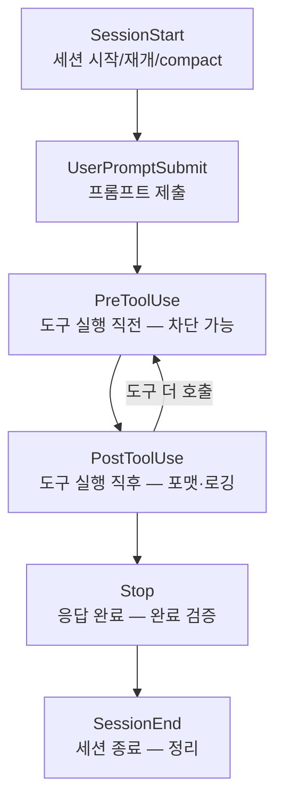

## 서론

Claude Code를 설치하고 기본적인 대화로 코딩하는 건 금방 익힌다. 하지만 대부분의 사용자는 여기서 멈춘다. "코드 짜줘", "버그 고쳐줘" 수준에서 머무는 것이다.

실제로 Claude Code에는 <strong>프로젝트별 기억</strong>, <strong>반복 작업 자동화</strong>, <strong>외부 도구 연동</strong> 같은 강력한 기능이 숨어 있다. 이 기능들을 활용하면 Claude Code가 단순 채팅봇이 아니라 <strong>나만의 코딩 파트너</strong>로 변신한다.

이 시리즈는 Claude Code를 200% 활용하는 방법을 4편에 걸쳐 다룬다:

- <strong>Part 1 — 메모리 + 스킬 + 훅 (이 글)</strong>: Claude가 나를 기억하게 하고, 반복 작업을 자동화
- Part 2 — [플러그인 + MCP + IDE 연동](/blog/claude-code-advanced-guide-2): 외부 도구와 연결하고 에디터에서 바로 사용
- Part 3 — [서브에이전트 + 에이전트 팀](/blog/claude-code-advanced-guide-3): 복잡한 작업을 분할하고 병렬 처리
- Part 4 — [워크플로 + Ultrareview + 원격 에이전트](/blog/claude-code-advanced-guide-4): 결정론적 오케스트레이션과 클라우드 자동화

> <strong>참고</strong>: 이 글은 2026년 6월 기준 Claude Code 최신 버전으로 점검했다. Claude Code는 빠르게 진화하므로, 번들 스킬 목록이나 훅 이벤트처럼 자주 늘어나는 항목은 본인 환경에서 `/help`로 직접 확인하는 것이 정확하다.

---

## TL;DR

- <strong>메모리는 두 축이다</strong> — 내가 직접 적는 `CLAUDE.md`(규칙·지침)와, Claude가 세션 중에 스스로 적는 자동 메모리(학습한 습관·빌드 명령). 매번 같은 설명을 반복하지 않게 해준다.
- <strong>스킬은 새 명령을 가르친다</strong> — 마크다운 한 장(`SKILL.md`)으로 "이 작업은 이렇게 해"를 정의한다. 기본 탑재된 번들 스킬도 많아서, 설치 없이 바로 쓸 수 있는 것이 십수 개다.
- <strong>훅은 특정 시점에 명령을 자동 실행한다</strong> — 파일 수정 후 자동 포맷, 위험한 명령 차단, 입력 대기 시 알림, 작업 완료 검증 등을 이벤트에 걸어둔다.
- <strong>차단·검증은 정해진 신호로 한다</strong> — 훅이 동작을 막거나 Claude를 계속 일하게 하려면 약속된 종료 코드나 JSON(`permissionDecision`, `decision`)을 돌려줘야 한다.
- <strong>셋을 조합하면 맞춤 파트너가 된다</strong> — 규칙은 메모리에, 반복 작업은 스킬에, 자동화는 훅에 맡기면 Claude Code가 내 프로젝트에 최적화된다.

---

## 1. 메모리 — Claude가 나를 기억하게 만들기

Claude Code는 매 세션마다 새로운 컨텍스트 윈도우로 시작한다. 어제 대화한 내용을 오늘 기억하지 못한다. <strong>메모리</strong>는 이 문제를 해결한다.

### 1.1 CLAUDE.md — 직접 작성하는 프로젝트 지침서

`CLAUDE.md`는 Claude가 세션 시작 시 자동으로 읽는 마크다운 파일이다. 코딩 규칙, 빌드 명령, 아키텍처 설명 등을 적어두면 매번 반복 설명할 필요가 없다.

#### 어디에 놓느냐에 따라 범위가 달라진다

여러 위치에 둘 수 있고, 모두 로드되어 합쳐진다. 좁은 범위(프로젝트)가 넓은 범위(사용자)보다 우선한다.

| 위치 | 범위 | 공유 |
|---|---|---|
| 관리형 정책 (`/Library/Application Support/ClaudeCode/CLAUDE.md` 등) | 조직 전체 강제 | 관리자 배포 |
| `./CLAUDE.md` 또는 `./.claude/CLAUDE.md` | 프로젝트 전체 | 팀원과 공유 (Git 커밋) |
| `./CLAUDE.local.md` | 이 프로젝트, 나만 | Git 제외 권장 |
| `~/.claude/CLAUDE.md` | 내 모든 프로젝트 | 나만 사용 |
| `.claude/rules/*.md` | 특정 파일 타입 | 팀원과 공유 |

#### 빠른 시작: `/init`

처음이라면 Claude Code에서 `/init`을 실행하자. 코드베이스를 분석해서 자동으로 `CLAUDE.md`를 생성해준다. (`/init`은 스킬이 아니라 내장 커맨드다.)

```bash
# Claude Code 안에서
/init
```

#### 좋은 CLAUDE.md 작성법

```markdown
# 프로젝트 규칙

## 빌드 & 테스트
- `pnpm dev`로 개발 서버 실행
- `pnpm test`로 테스트 실행, 커밋 전에 반드시 실행

## 코딩 규칙
- 들여쓰기 2칸
- TypeScript strict 모드 사용
- API 핸들러는 `src/api/handlers/`에 배치

## 아키텍처
- 프론트엔드: React + Vite
- 백엔드: Express + Prisma
- DB: PostgreSQL
```

<strong>핵심 포인트:</strong>

- <strong>200줄 이하</strong>로 유지하자. 길어지면 Claude의 준수율이 떨어진다(공식 권고도 "파일당 200줄 이하 목표").
- <strong>구체적으로</strong> 쓰자. "코드 잘 짜" 대신 "들여쓰기 2칸".
- <strong>모순되는 규칙</strong>은 피하자. 두 규칙이 충돌하면 Claude가 임의로 선택한다.

#### 다른 파일 임포트

`CLAUDE.md`가 커지면 `@path` 문법으로 외부 파일을 참조할 수 있다(최대 4단계까지 중첩 가능):

```markdown
# 프로젝트 규칙
@README.md
@docs/api-conventions.md

## 개인 설정
@~/.claude/my-preferences.md
```

임포트된 파일은 세션 시작 시점에 컨텍스트에 인라인으로 펼쳐진다. 홈 디렉토리 밖의 파일을 처음 임포트할 때는 승인 다이얼로그가 뜬다.

### 1.2 `.claude/rules/` — 파일 타입별 규칙

모든 파일에 적용할 필요 없는 규칙은 `.claude/rules/`에 분리하자. `paths` 프론트매터의 글로브 패턴으로 특정 파일에만 적용할 수 있다:

```markdown
---
paths:
  - "src/api/**/*.ts"
---

# API 개발 규칙
- 모든 엔드포인트에 입력 검증 포함
- 표준 에러 응답 포맷 사용
- OpenAPI 문서 주석 포함
```

이러면 Claude가 `src/api/` 아래 TypeScript 파일을 작업할 때만 이 규칙이 로드된다. 컨텍스트를 절약할 수 있다.

### 1.3 자동 메모리 — Claude가 스스로 기록

자동 메모리는 사용자가 아무것도 안 해도 Claude가 알아서 기록하는 시스템이다. 빌드 명령, 디버깅 팁, 코드 스타일 선호도 등을 세션 중에 학습하고 저장한다.

#### 저장 위치

```text
~/.claude/projects/<프로젝트>/memory/
├── MEMORY.md          # 인덱스 (매 세션 시작 시 로드)
├── debugging.md       # 디버깅 패턴
├── api-conventions.md # API 설계 결정
└── ...
```

`MEMORY.md` 인덱스는 세션 시작 시 로드되며, 200줄/25KB 중 먼저 도달하는 한도까지만 읽힌다. 나머지 파일은 필요할 때 참조된다.

#### 활성화/비활성화

```bash
# Claude Code 안에서
/memory  # 자동 메모리 토글 + 로드된 메모리/규칙 파일 목록 표시
```

```json
// settings.json
{
  "autoMemoryEnabled": false
}
```

`CLAUDE_CODE_DISABLE_AUTO_MEMORY=1` 환경변수로도 끌 수 있고, `autoMemoryDirectory` 키로 저장 위치를 바꿀 수 있다.

#### 직접 기억시키기

Claude에게 "이거 기억해"라고 말하면 자동 메모리에 저장된다:

```text
항상 pnpm을 써, npm 말고. 이거 기억해.
```

`/memory` 명령으로 저장된 내용을 확인하고 편집할 수 있다. 일반 마크다운 파일이라 직접 수정해도 된다.

### 1.4 CLAUDE.md vs 자동 메모리 — 언제 뭘 쓰나

| | CLAUDE.md | 자동 메모리 |
|---|---|---|
| <strong>누가 쓰나</strong> | 내가 직접 | Claude가 자동 |
| <strong>내용</strong> | 규칙, 지침 | 학습한 패턴 |
| <strong>범위</strong> | 프로젝트/사용자/조직 | 프로젝트별 |
| <strong>용도</strong> | 코딩 표준, 워크플로우 | 빌드 명령, 디버깅 팁, 선호도 |

> <strong>정리</strong>: 팀과 공유할 규칙은 `CLAUDE.md`에, Claude가 내 습관을 배우게 하려면 자동 메모리를 활용하자.

---

## 2. 스킬 — Claude에게 새로운 능력 부여

스킬은 Claude에게 <strong>특정 작업을 수행하는 방법</strong>을 가르치는 기능이다. `SKILL.md` 파일 하나로 Claude가 새로운 명령어를 배운다.

### 2.1 번들 스킬 — 설치 없이 바로 쓰는 것들

Claude Code에는 기본 탑재된 스킬이 여럿 있다. 설치 없이 `/` 뒤에 이름을 입력하면 바로 사용 가능하다. <strong>개수는 버전마다 늘어나므로</strong>, 본인 환경의 전체 목록은 `/help`로 확인하자. 2026년 6월 기준 주요 번들 스킬을 용도별로 정리하면:

| 분류 | 스킬 | 용도 |
|---|---|---|
| 코드 품질 | `/code-review`, `/simplify`, `/review` | 변경 리뷰·간결화, PR 리뷰 |
| 보안·검증 | `/security-review`, `/verify` | 취약점 점검, 변경이 실제로 동작하는지 검증 |
| 대규모 작업 | `/batch` | 코드베이스 전반 병렬 변경 |
| 실행·디버그 | `/run`, `/debug` | 앱 실행/확인, 세션 디버그 로그 분석 |
| 자동화 | `/loop`, `/schedule` | 반복 실행, 예약·원격 에이전트 |
| 분석·설정 | `/insights`, `/statusline`, `/claude-api` | 세션 분석, 상태바 설정, API 레퍼런스 로드 |

특히 자주 쓰는 몇 가지를 짚으면:

- <strong>`/batch`</strong> — 코드베이스 전반의 대규모 변경을 병렬로 처리한다. 작업을 독립 단위로 분해한 뒤, 승인하면 <strong>각 단위마다 별도 에이전트</strong>가 격리된 git worktree에서 구현·테스트·PR 생성까지 수행한다. 예: `/batch 모든 console.log를 구조화된 로거로 교체`.
- <strong>`/code-review`</strong> — 현재 변경(diff)의 버그와 정리 거리를 리뷰한다. `low~max` 강도를 줄 수 있고, `/code-review ultra`는 클라우드 멀티에이전트 리뷰로 확장된다(자세한 건 [Part 4](/blog/claude-code-advanced-guide-4)).
- <strong>`/loop`</strong> — 프롬프트나 슬래시 명령을 정해진 간격으로 반복 실행한다. 예: `/loop 5m 배포 상태 확인해줘`.
- <strong>`/claude-api`</strong> — Claude API/SDK 코드를 작성할 때 프로젝트 언어에 맞는 API 레퍼런스를 로드한다. 코드에서 `anthropic`을 import하면 자동 활성화되기도 한다.

> <strong>참고</strong>: 이전에 "번들 스킬은 5개"라고 알고 있었다면 오래된 정보다. `/code-review`, `/security-review`, `/run`, `/verify`, `/simplify` 등이 추가되어 현재는 십수 개에 이른다.

### 2.2 커스텀 스킬 만들기

번들 스킬 외에 <strong>나만의 스킬</strong>을 만들 수 있다. `SKILL.md` 파일 하나면 된다.

#### 스킬 저장 위치

| 위치 | 범위 |
|---|---|
| `~/.claude/skills/<이름>/SKILL.md` | 내 모든 프로젝트 |
| `.claude/skills/<이름>/SKILL.md` | 이 프로젝트만 |

#### 예시: 블로그 포스트 생성 스킬

```yaml
---
name: blog-post
description: 블로그 포스트 초안을 생성한다. 한국어와 영어 두 버전을 동시에 만든다.
disable-model-invocation: true
---

블로그 포스트를 작성한다:

1. $ARGUMENTS 주제에 대한 블로그 포스트를 작성
2. 한국어 버전을 `src/content/blog/` 에 생성
3. 영어 버전을 `src/content/blog/en/` 에 생성
4. pubDate에 현재 시간 포함 (예: 2026-03-14T18:00:00+09:00)
5. 한국어는 반말 체(~다, ~이다), 영어는 practical tone
6. heroImage 경로: 한국어 `../../assets/`, 영어 `../../../assets/`
```

사용법:

```bash
/blog-post Terraform 모듈 작성법
```

#### 프론트매터 필드

`name`과 `description`만 필수다. 그 외에 동작을 세밀하게 제어하는 필드가 많이 추가됐다:

| 필드 | 역할 |
|---|---|
| `name` / `description` | 이름과 설명 (필수). description은 자동 호출 판단의 근거 |
| `disable-model-invocation: true` | 사용자만 호출, Claude 자동 호출 금지 (배포·커밋 등 부작용 작업) |
| `user-invocable: false` | Claude만 자동 참조, 사용자 직접 호출 안 함 (배경 지식) |
| `allowed-tools` / `disallowed-tools` | 스킬 활성 중 허용/제거할 도구 |
| `model` | `haiku` / `sonnet` / `opus` / `inherit` |
| `effort` | `low` ~ `max` 추론 강도 |
| `context: fork` | 별도 서브에이전트에서 실행 (메인 대화 오염 방지) |
| `agent` | `context: fork`일 때 서브에이전트 타입 지정 |
| `when_to_use` / `argument-hint` | 자동 호출 트리거 조건 / 자동완성 힌트 |

#### 스킬 호출 제어

| 설정 | 사용자 호출 | Claude 자동 호출 |
|---|---|---|
| (기본값) | O | O |
| `disable-model-invocation: true` | O | X |
| `user-invocable: false` | X | O |

- <strong>`disable-model-invocation: true`</strong>: 배포, 커밋 같은 부작용이 있는 작업에 사용. Claude가 "코드 준비된 것 같으니 배포할게"라고 자동 실행하면 곤란하다.
- <strong>`user-invocable: false`</strong>: 레거시 시스템 컨텍스트 같은 배경 지식에 사용. 사용자가 `/legacy-context`를 직접 호출할 일은 없지만, Claude가 관련 작업 시 자동 참조하면 유용하다.

### 2.3 동적 컨텍스트 주입

`` !`command` `` 문법으로 스킬 실행 전에 셸 명령의 출력을 주입할 수 있다:

```yaml
---
name: pr-summary
description: PR 요약
context: fork
agent: Explore
---

## PR 컨텍스트
- PR diff: !`gh pr diff`
- PR 코멘트: !`gh pr view --comments`
- 변경 파일: !`gh pr diff --name-only`

## 작업
이 PR을 요약해...
```

<strong>동작 흐름:</strong>

1. `/pr-summary` 실행
2. `` !`gh pr diff` `` 등 셸 명령이 <strong>먼저</strong> 실행됨
3. 명령의 출력이 해당 위치에 텍스트로 치환됨
4. 치환된 전체 내용이 Claude에게 전달됨

`` !`command` ``는 <strong>템플릿 변수</strong>처럼 동작한다. 스킬 파일에 데이터를 직접 넣을 수 없으니, "실행 시점에 이 명령의 결과를 여기에 넣어라"는 뜻이다.

<strong>프론트매터 설명:</strong>

| 필드 | 역할 |
|---|---|
| `context: fork` | 이 스킬을 별도 서브에이전트에서 실행 (메인 대화 컨텍스트 오염 방지) |
| `agent: Explore` | fork된 서브에이전트의 타입을 Explore(읽기 전용)로 지정 |

`context: fork`가 없으면 메인 대화에서 바로 실행된다. PR diff처럼 출력이 길 수 있는 경우, fork로 격리해서 메인 대화의 컨텍스트를 절약하는 것이 좋다.

> <strong>에이전트 타입이란?</strong> Claude Code에는 용도별로 특화된 내장 에이전트 타입이 있다. `Explore`는 코드베이스 탐색 전용(읽기 전용), `Plan`은 계획 수립용, `general-purpose`는 범용(모든 도구 사용)이다. 커스텀 에이전트도 직접 만들 수 있다. 자세한 내용은 [Part 3](/blog/claude-code-advanced-guide-3)에서 다룬다.

---

## 3. 훅 — 워크플로우 자동화

훅은 Claude Code의 특정 시점에 <strong>자동으로 실행되는 명령</strong>이다. 스킬이 "Claude에게 방법을 가르치는 것"이라면, 훅은 "특정 이벤트에 코드를 자동 실행하는 것"이다.

### 3.1 훅이 뭔가

세션이 진행되는 동안 여러 시점에 훅이 끼어들 수 있다. 대표적인 자리는 다음과 같다.



- <strong>파일 수정 후</strong> → 자동으로 Prettier 실행 (PostToolUse)
- <strong>위험한 명령 실행 전</strong> → 차단 (PreToolUse)
- <strong>Claude가 입력을 기다릴 때</strong> → 데스크톱 알림 (Notification)
- <strong>세션 시작 시</strong> → 환경 변수 로드 (SessionStart)

### 3.2 첫 번째 훅 만들기

Claude가 입력을 기다릴 때 데스크톱 알림을 받아보자. `~/.claude/settings.json`에 추가:

```json
{
  "hooks": {
    "Notification": [
      {
        "matcher": "",
        "hooks": [
          {
            "type": "command",
            "command": "osascript -e 'display notification \"Claude Code needs your attention\" with title \"Claude Code\"'"
          }
        ]
      }
    ]
  }
}
```

> Linux에서는 `notify-send 'Claude Code' 'Claude Code needs your attention'`을 사용하자.

`/hooks`를 입력하면 등록된 훅을 확인할 수 있다.

### 3.3 실전 훅 레시피

#### 파일 수정 후 자동 포맷팅

`.claude/settings.json` (프로젝트 레벨):

```json
{
  "hooks": {
    "PostToolUse": [
      {
        "matcher": "Edit|Write",
        "hooks": [
          {
            "type": "command",
            "command": "jq -r '.tool_input.file_path' | xargs npx prettier --write"
          }
        ]
      }
    ]
  }
}
```

`Edit`이나 `Write` 도구가 실행된 후에만 Prettier가 동작한다. `Bash`나 `Read` 등 다른 도구에는 반응하지 않는다.

#### 보호 파일 수정 차단

`.env`, `package-lock.json`, `.git/` 같은 민감한 파일의 수정을 차단하는 훅이다. PreToolUse 훅에서 <strong>종료 코드 2</strong>로 도구 호출을 막고, stderr 메시지가 Claude에게 전달된다.

`.claude/hooks/protect-files.sh`:

```bash
#!/bin/bash
INPUT=$(cat)
FILE_PATH=$(echo "$INPUT" | jq -r '.tool_input.file_path // empty')

PROTECTED_PATTERNS=(".env" "package-lock.json" ".git/")

for pattern in "${PROTECTED_PATTERNS[@]}"; do
  if [[ "$FILE_PATH" == *"$pattern"* ]]; then
    echo "Blocked: $FILE_PATH matches protected pattern '$pattern'" >&2
    exit 2  # exit 2 = 도구 호출 차단, stderr가 Claude에 전달됨
  fi
done

exit 0
```

```bash
chmod +x .claude/hooks/protect-files.sh
```

`.claude/settings.json`:

```json
{
  "hooks": {
    "PreToolUse": [
      {
        "matcher": "Edit|Write",
        "hooks": [
          {
            "type": "command",
            "command": "\"$CLAUDE_PROJECT_DIR\"/.claude/hooks/protect-files.sh"
          }
        ]
      }
    ]
  }
}
```

> <strong>참고</strong>: 종료 코드 2로 막는 대신, 종료 코드 0으로 두고 아래 JSON을 출력해도 동일하게 차단된다. 이유 메시지를 구조화해서 전달할 때 유용하다.
>
> ```json
> {
>   "hookSpecificOutput": {
>     "hookEventName": "PreToolUse",
>     "permissionDecision": "deny",
>     "permissionDecisionReason": "보호된 파일은 수정할 수 없습니다"
>   }
> }
> ```

#### 컨텍스트 압축 후 리마인더 주입

긴 대화 후 컨텍스트가 압축(`/compact`)되면 중요한 정보가 사라질 수 있다. 압축 후 자동으로 리마인더를 주입하자:

```json
{
  "hooks": {
    "SessionStart": [
      {
        "matcher": "compact",
        "hooks": [
          {
            "type": "command",
            "command": "echo 'Reminder: pnpm 사용, npm 아님. 커밋 전 pnpm test 실행. 현재 스프린트: 인증 리팩토링.'"
          }
        ]
      }
    ]
  }
}
```

#### Bash 명령 로깅

Claude가 실행한 모든 Bash 명령을 로그 파일에 기록:

```json
{
  "hooks": {
    "PostToolUse": [
      {
        "matcher": "Bash",
        "hooks": [
          {
            "type": "command",
            "command": "jq -r '.tool_input.command' >> ~/.claude/command-log.txt"
          }
        ]
      }
    ]
  }
}
```

### 3.4 프롬프트 기반 훅 — AI가 판단하는 훅

규칙 기반(종료 코드)이 아니라 <strong>AI가 판단</strong>하는 훅도 있다. Claude가 작업을 끝냈는데, 정말 끝난 건지 확인하고 싶을 때 `type: prompt` 훅을 쓴다:

```json
{
  "hooks": {
    "Stop": [
      {
        "hooks": [
          {
            "type": "prompt",
            "prompt": "모든 요청된 작업이 완료되었는지 확인해. 완료되지 않았다면 작업을 계속하도록 차단해."
          }
        ]
      }
    ]
  }
}
```

Stop 훅이 "아직 안 끝났다"고 판단하면 다음 JSON을 돌려줘 Claude를 <strong>멈추지 않고 계속 일하게</strong> 한다:

```json
{
  "decision": "block",
  "reason": "아직 테스트가 통과하지 않았다. 실패한 테스트를 마저 고쳐라."
}
```

> <strong>주의 — 흔한 오해</strong>: 예전 자료에서 보이는 `{"ok": false, "reason": "..."}` 형식은 <strong>훅 리턴 형식이 아니다</strong>. 훅의 차단/계속 신호는 `decision`/`reason`(Stop·PostToolUse 계열)과 `hookSpecificOutput.permissionDecision`(PreToolUse)으로 표현한다.

### 3.5 훅 이벤트 — 어디에 걸 수 있나

훅 이벤트는 버전이 올라가며 계속 늘어나, 현재 30종이 넘는다. `/hooks` 명령으로 본인 버전에서 지원하는 전체 목록을 확인할 수 있다. 실무에서 가장 많이 쓰는 것들을 분류하면:

#### 세션 이벤트

| 이벤트 | 발생 시점 | 활용 예시 |
|---|---|---|
| `SessionStart` | 세션 시작, 재개, compact, clear 시 | 환경 변수 로드, 컨텍스트 주입 |
| `SessionEnd` | 세션 종료 시 | 정리 작업, 리소스 해제 |
| `PreCompact` / `PostCompact` | 컨텍스트 압축 직전/직후 | 핵심 정보 백업, 리마인더 주입 |

#### 입력·도구 이벤트

| 이벤트 | 발생 시점 | 활용 예시 |
|---|---|---|
| `UserPromptSubmit` | 사용자가 프롬프트를 제출할 때 | 입력 검증, 컨텍스트 추가 |
| `PreToolUse` | 도구 실행 직전 | 위험한 명령 차단, 파일 보호 |
| `PostToolUse` | 도구 실행 직후 | 자동 포맷팅, 로깅, 린트 실행 |

#### 응답·서브에이전트·팀 이벤트

| 이벤트 | 발생 시점 | 활용 예시 |
|---|---|---|
| `Notification` | Claude가 알림을 보낼 때 | 데스크톱 알림 |
| `Stop` | Claude가 응답을 완료할 때 | 완료 검증, 누락 작업 확인 |
| `SubagentStart` / `SubagentStop` | 서브에이전트 시작/완료 | 환경 준비, 결과 로깅 |
| `TeammateIdle` / `TaskCreated` / `TaskCompleted` | 에이전트 팀 이벤트 | 피드백 전달, 품질 게이트 |
| `Elicitation` | MCP 서버가 사용자 입력을 요청할 때 | 자동 응답 처리 |

### 3.6 훅 타입 — 무엇을 실행하나

훅은 셸 명령만 실행하는 게 아니다. 현재 다섯 가지 타입이 있다:

| 타입 | 동작 |
|---|---|
| `command` | 셸 명령 실행 (가장 일반적) |
| `prompt` | AI가 판단 (3.4절) |
| `agent` | 서브에이전트 스폰 |
| `http` | HTTP 엔드포인트로 POST |
| `mcp_tool` | MCP 서버의 도구 호출 |

### 3.7 훅 설정 위치

| 위치 | 범위 |
|---|---|
| 관리형 정책 (`/Library/Application Support/ClaudeCode/` 등) | 조직 전체 강제 |
| `~/.claude/settings.json` | 내 모든 프로젝트 |
| `.claude/settings.json` | 이 프로젝트 (팀 공유) |
| `.claude/settings.local.json` | 이 프로젝트 (나만) |
| 플러그인 `hooks/hooks.json`, 스킬·에이전트 프론트매터 `hooks:` | 해당 플러그인/스킬 활성 시 |

---

## 정리

이 글에서 다룬 세 기능을 요약하면:

| 기능 | 핵심 | 대표 사용처 |
|---|---|---|
| <strong>CLAUDE.md</strong> | 내가 적는 규칙 (세션마다 자동 로드) | 빌드 명령, 코딩 표준, 아키텍처 |
| <strong>자동 메모리</strong> | Claude가 적는 학습 내용 | 디버깅 팁, 도구 선호도 |
| <strong>스킬</strong> | 새 명령을 가르침 (`SKILL.md`) | 반복 작업, 번들 스킬 활용 |
| <strong>훅</strong> | 이벤트에 명령 자동 실행 | 포맷·차단·알림·완료 검증 |

메모리, 스킬, 훅은 각각 강력하지만, <strong>조합하면 진짜 위력</strong>을 발휘한다:

1. <strong>CLAUDE.md</strong>에 프로젝트 규칙을 정의하고
2. <strong>커스텀 스킬</strong>로 반복 작업(배포, 블로그 작성, 코드 리뷰)을 자동화하고
3. <strong>훅</strong>으로 파일 보호, 자동 포맷팅, 알림을 걸어두면

Claude Code가 단순한 AI 채팅이 아니라 <strong>프로젝트에 맞춤화된 개발 파트너</strong>가 된다.

다음 [Part 2](/blog/claude-code-advanced-guide-2)에서는 <strong>플러그인, MCP, IDE 연동</strong>을 다룬다. 마켓플레이스에서 유용한 플러그인을 설치하고, MCP로 외부 서비스를 연결하고, VS Code·JetBrains에서 Claude Code를 바로 사용하는 방법을 알아보자.

---

## 부록

### A. 용어집

| 용어 | 설명 |
|---|---|
| CLAUDE.md | 세션 시작 시 자동 로드되는 프로젝트 지침 파일 |
| 자동 메모리 | Claude가 세션 중 학습한 내용을 스스로 기록하는 시스템 |
| 스킬 | `SKILL.md`로 정의하는, Claude에게 가르치는 작업 절차 |
| 번들 스킬 | Claude Code에 기본 탑재되어 설치 없이 쓰는 스킬 |
| 훅 | 특정 이벤트 시점에 자동 실행되는 명령/판단 |
| matcher | 훅이 반응할 도구·상황을 거르는 패턴 (예: `Edit|Write`) |
| context: fork | 스킬을 별도 서브에이전트에서 실행해 메인 대화를 보호하는 설정 |

### B. 명령어·설정 치트시트

```bash
# 메모리
/init           # CLAUDE.md 자동 생성 (내장 커맨드)
/memory         # 자동 메모리 토글 + 로드된 메모리/규칙 확인

# 스킬 (번들 — 버전마다 늘어남, /help로 확인)
/code-review    # 변경 리뷰  (/code-review ultra = 클라우드 멀티에이전트)
/security-review
/simplify /review /verify /run /debug /batch
/loop 5m <명령>  # 반복 실행
/schedule       # 예약·원격 에이전트
/claude-api     # API 레퍼런스 로드

# 훅
/hooks          # 등록된 훅 확인
```

```json
// settings.json 훅 골격
{
  "hooks": {
    "<이벤트>": [
      { "matcher": "<패턴>", "hooks": [ { "type": "command|prompt|agent|http|mcp_tool", "command": "..." } ] }
    ]
  }
}
```

### C. 참고 자료

- [Claude Code 공식 문서 — 메모리](https://docs.claude.com/en/docs/claude-code/memory)
- [Claude Code 공식 문서 — 스킬](https://docs.claude.com/en/docs/claude-code/skills)
- [Claude Code 공식 문서 — 훅 가이드](https://docs.claude.com/en/docs/claude-code/hooks-guide)
- [Claude Code 공식 문서 — 훅 레퍼런스](https://docs.claude.com/en/docs/claude-code/hooks)
