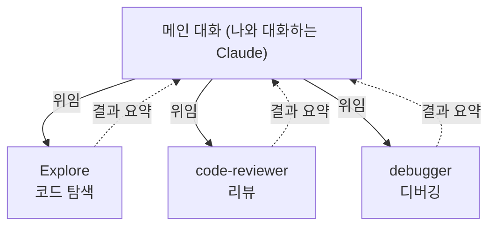
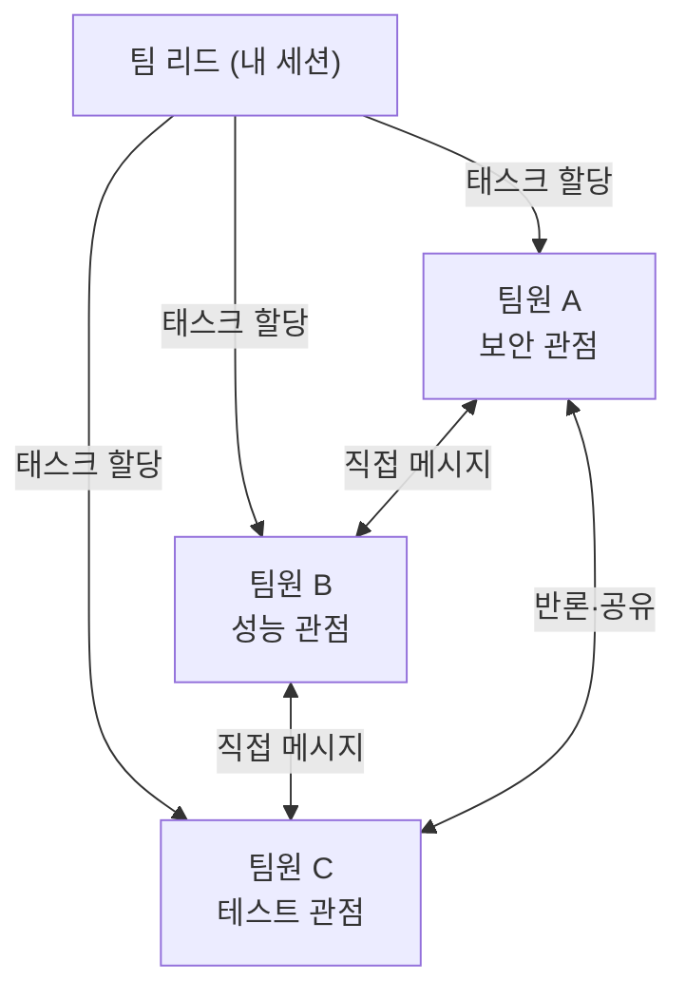

## 서론

[Part 1](/blog/claude-code-advanced-guide-1)에서 메모리·스킬·훅을, [Part 2](/blog/claude-code-advanced-guide-2)에서 플러그인·MCP·IDE 연동을 다뤘다.

이번 Part 3에서는 Claude Code가 <strong>여러 AI를 부리는</strong> 방법을 다룬다:

- Part 1 — [메모리 + 스킬 + 훅](/blog/claude-code-advanced-guide-1)
- Part 2 — [플러그인 + MCP + IDE 연동](/blog/claude-code-advanced-guide-2)
- <strong>Part 3 — 서브에이전트 + 에이전트 팀 (이 글)</strong>
- Part 4 — [워크플로 + Ultrareview + 원격 에이전트](/blog/claude-code-advanced-guide-4)

- <strong>서브에이전트</strong>: 특정 작업을 전담하는 전문 AI 보조를 만들어 위임
- <strong>에이전트 팀</strong>: 여러 Claude Code 인스턴스가 팀을 이뤄 병렬 협업

> <strong>참고</strong>: 이 글은 2026년 6월 기준 최신 버전으로 점검했다. 이어지는 [Part 4](/blog/claude-code-advanced-guide-4)에서는 같은 멀티에이전트 계열의 더 새로운 기능(결정론적 워크플로, 클라우드 멀티에이전트 리뷰, 원격·예약 에이전트)을 다룬다.

---

## TL;DR

- <strong>서브에이전트는 전문가에게 위임이다</strong> — 독립된 컨텍스트·도구 권한·시스템 프롬프트를 가진 AI 보조에게 한 작업을 맡기고, 결과 요약만 메인 대화로 받는다.
- <strong>위임의 이점은 컨텍스트 보존</strong> — 탐색·테스트처럼 출력이 큰 작업을 격리하면 메인 대화가 깨끗하게 유지된다. 빠른 모델로 라우팅하면 비용도 준다.
- <strong>에이전트 팀은 협업이다</strong> — 여러 Claude가 각자 독립 컨텍스트에서 일하며 서로 직접 메시지를 주고받는다. 토론·반론이 필요한 복잡한 작업에 강하다(실험 기능).
- <strong>둘의 차이는 소통 구조</strong> — 서브에이전트는 "결과만 가져와", 에이전트 팀은 "같이 논의하면서 해결". 팀은 토큰 비용이 더 크다.
- <strong>도메인 전문 에이전트를 직접 만든다</strong> — 마크다운+프론트매터 한 장으로 코드 리뷰어·디버거 같은 전문 에이전트를 정의한다. 내장 에이전트 외에 무제한으로 추가된다.

---

## 1. 서브에이전트 — 전문가에게 위임하기

서브에이전트는 <strong>특정 작업을 전담하는 독립 AI 보조</strong>다. 각 서브에이전트는 자신만의 컨텍스트 윈도우, 시스템 프롬프트, 도구 접근 권한을 가진다. Claude가 적합한 작업을 만나면 자동으로 해당 서브에이전트에게 위임한다.



### 1.1 왜 서브에이전트인가

- <strong>컨텍스트 보존</strong>: 탐색·조사 결과가 메인 대화를 오염시키지 않는다
- <strong>제약 강제</strong>: 특정 도구만 사용하도록 제한할 수 있다
- <strong>비용 절감</strong>: 빠르고 저렴한 모델(Haiku)로 라우팅 가능
- <strong>전문화</strong>: 도메인별 시스템 프롬프트로 정확도 향상

### 1.2 내장 서브에이전트

Claude Code에는 기본 내장된 서브에이전트가 있다. 핵심은 세 가지이며, 여기에 헬퍼 에이전트 둘이 더해진다:

| 에이전트 | 모델 | 도구 | 용도 |
|---|---|---|---|
| <strong>Explore</strong> | Haiku (빠름) | 읽기 전용 | 코드베이스 탐색, 파일 검색 |
| <strong>Plan</strong> | 상속 | 읽기 전용 | 계획 모드에서 컨텍스트 수집 |
| <strong>general-purpose</strong> | 상속 | 전체 | 복잡한 멀티스텝 작업 |
| <strong>claude-code-guide</strong> | Haiku | 읽기 전용 | Claude Code 기능 질문 응답 |
| <strong>statusline-setup</strong> | Sonnet | 제한적 | `/statusline` 실행 시 상태바 구성 |

Explore 에이전트는 코드베이스를 탐색할 때 자동으로 사용된다. 탐색 결과가 메인 대화 컨텍스트를 낭비하지 않으면서도 필요한 정보를 가져온다.

> <strong>참고 — 내장은 시작일 뿐</strong>: 위 목록은 "기본 제공"이고, 실제 위력은 <strong>커스텀 에이전트</strong>에서 나온다. 사용자·프로젝트·플러그인 범위로 도메인 전문 에이전트를 무제한 추가할 수 있다(1.3절). 또한 서브에이전트를 호출하는 도구는 예전엔 `Task`였지만 현재는 `Agent`로 이름이 바뀌었다(`Task` 표기는 별칭으로 계속 동작).

### 1.3 커스텀 서브에이전트 만들기

#### /agents 명령어

```bash
# Claude Code 안에서
/agents
# → Create new agent → User-level 또는 Project-level 선택
# → Generate with Claude 또는 직접 작성
```

#### 직접 파일로 작성

서브에이전트는 YAML 프론트매터가 있는 마크다운 파일이다.

<strong>저장 위치:</strong>

| 위치 | 범위 | 우선순위 |
|---|---|---|
| 관리형 정책 | 조직 전체 | 최상 |
| `.claude/agents/` | 이 프로젝트 | 높음 |
| `~/.claude/agents/` | 모든 프로젝트 | 중간 |
| 플러그인 `agents/` | 플러그인 활성화 시 | 낮음 |

#### 예시: 코드 리뷰어

`.claude/agents/code-reviewer.md`:

```markdown
---
name: code-reviewer
description: 코드 품질과 보안을 점검하는 전문 리뷰어. 코드 변경 후 자동으로 사용.
tools: Read, Grep, Glob, Bash
model: sonnet
---

시니어 코드 리뷰어로서 코드 품질과 보안을 검사한다.

실행 시:
1. git diff로 최근 변경사항 확인
2. 수정된 파일에 집중
3. 즉시 리뷰 시작

리뷰 체크리스트:
- 코드 가독성과 구조
- 에러 핸들링
- 보안 취약점 (API 키 노출 등)
- 테스트 커버리지

피드백은 우선순위별로 정리:
- Critical (반드시 수정)
- Warning (수정 권장)
- Suggestion (개선 제안)
```

사용:

```text
코드 리뷰어 서브에이전트로 최근 변경사항 리뷰해줘
```

### 1.4 서브에이전트 프론트매터 옵션

프론트매터로 모델, 도구, 메모리, 격리 등을 세밀하게 제어한다. 필드가 많이 추가됐다:

| 필드 | 역할 |
|---|---|
| `name` / `description` | 이름과 설명 (자동 위임 판단 근거) |
| `tools` / `disallowedTools` | 허용/금지 도구 |
| `model` | `haiku` / `sonnet` / `opus` / `inherit` |
| `effort` | 추론 강도 |
| `mcpServers` | 이 에이전트에만 MCP 서버 연결 (메인 대화 컨텍스트 절약) |
| `memory` | `user` / `project` / `local` — 대화를 넘어 지속되는 메모리 |
| `isolation: worktree` | 별도 git worktree에서 작업 (메인 코드 무영향) |
| `permissionMode` | 권한 모드 (`plan` 등) |
| `maxTurns` | 최대 턴 수 제한 |
| `skills` | 이 에이전트에 스킬 사전 주입 |
| `hooks` | 이 에이전트 스코프 훅 |
| `background` | `true`면 항상 백그라운드로 실행 |

#### 예시: 모델·도구·격리

```yaml
---
name: browser-tester
description: Playwright로 브라우저 테스트
model: sonnet
tools: Read, Bash
isolation: worktree          # 별도 worktree에서 격리 작업
mcpServers:
  - playwright:
      type: stdio
      command: npx
      args: ["-y", "@playwright/mcp@latest"]
  - github                   # 이미 설정된 서버 참조
---
```

#### 영구 메모리

`memory` 필드로 대화를 넘어 지속되는 메모리를 부여한다:

| 범위 | 위치 | 용도 |
|---|---|---|
| `user` | `~/.claude/agent-memory/` | 모든 프로젝트에서 학습 유지 |
| `project` | `.claude/agent-memory/` | 프로젝트별 지식 (Git 공유 가능) |
| `local` | `.claude/agent-memory-local/` | 프로젝트별, 나만 사용 |

### 1.5 포그라운드 vs 백그라운드

- <strong>포그라운드</strong>: 서브에이전트가 끝날 때까지 메인 대화가 대기한다. 허가 요청이 사용자에게 전달된다.
- <strong>백그라운드</strong>: 메인 대화와 병렬 실행. 프론트매터 `background: true`로 항상 백그라운드로 돌리거나, 실행 중 작업을 백그라운드로 전환할 수 있다.

진행 중인 백그라운드 에이전트는 <strong>Agent View</strong>(`claude agents`)에서 모아 관리한다.

```text
서브에이전트를 백그라운드로 테스트 실행하고, 실패한 테스트만 보고해줘
```

### 1.6 활용 패턴

#### 대용량 출력 격리

테스트 실행, 로그 분석 같은 대량 출력 작업을 서브에이전트에 위임하면, 메인 대화 컨텍스트를 낭비하지 않고 요약만 받을 수 있다:

```text
서브에이전트로 전체 테스트 스위트 실행하고, 실패한 테스트와 에러 메시지만 보고해줘
```

#### 병렬 조사

독립적인 조사는 여러 서브에이전트를 동시에 띄워 병렬로 진행한다:

```text
인증, 데이터베이스, API 모듈을 각각 별도 서브에이전트로 조사해줘
```

#### 체이닝

순차적 워크플로우에서는 서브에이전트를 연쇄적으로 사용한다:

```text
코드 리뷰어 서브에이전트로 성능 이슈를 찾고, 그 다음 옵티마이저 서브에이전트로 수정해줘
```

---

## 2. 에이전트 팀 — 여러 Claude가 함께 일하기

> <strong>주의</strong>: 에이전트 팀은 <strong>실험 기능</strong>이다. 기본적으로 비활성화되어 있다.

에이전트 팀은 <strong>여러 Claude Code 인스턴스가 팀을 이뤄 협업</strong>하는 기능이다. 한 세션이 팀 리드 역할을 하고, 팀원들은 각자의 컨텍스트 윈도우에서 독립적으로 작업하면서 서로 직접 소통한다.



### 2.1 서브에이전트 vs 에이전트 팀

|  | 서브에이전트 | 에이전트 팀 |
|---|---|---|
| <strong>컨텍스트</strong> | 독립 윈도우, 결과를 메인에 반환 | 완전히 독립 |
| <strong>소통</strong> | 메인 에이전트에만 보고 | 팀원끼리 직접 메시지 |
| <strong>조정</strong> | 메인 에이전트가 관리 | 공유 태스크 리스트로 자율 조정 |
| <strong>적합한 경우</strong> | 결과만 필요한 집중 작업 | 토론과 협업이 필요한 복잡한 작업 |
| <strong>토큰 비용</strong> | 낮음 | 높음 (각 팀원이 별도 인스턴스) |

> 서브에이전트는 "결과만 가져와" 방식. 에이전트 팀은 "같이 논의하면서 해결" 방식.

### 2.2 활성화

`settings.json`에 추가:

```json
{
  "env": {
    "CLAUDE_CODE_EXPERIMENTAL_AGENT_TEAMS": "1"
  }
}
```

### 2.3 팀 시작하기

자연어로 팀 구성을 설명하면 된다:

```text
CLI 도구를 설계하려고 해. 에이전트 팀을 만들어서 세 가지 관점에서 탐색해줘:
- 하나는 UX
- 하나는 기술 아키텍처
- 하나는 데빌스 어드보킷(반론)
```

Claude가 팀을 생성하고, 팀원을 배정하고, 작업을 조율한다.

### 2.4 디스플레이 모드

| 모드 | 설정값 | 환경 |
|---|---|---|
| <strong>in-process</strong> | `"in-process"` | 모든 팀원이 하나의 터미널에서 실행 |
| <strong>split panes</strong> | `"tmux"` | tmux 필요, 각 팀원이 별도 창 |
| <strong>auto</strong> (기본) | `"auto"` | tmux 안이면 split, 아니면 in-process |

```json
{
  "teammateMode": "auto"
}
```

`Shift+Down`으로 팀원 간 전환, `Ctrl+T`로 공유 태스크 리스트 토글. 각 팀원에게 직접 메시지를 보낼 수 있다.

### 2.5 팀원과 소통

- <strong>리드 → 팀원</strong>: 태스크 할당, 지시
- <strong>팀원 → 팀원</strong>: 직접 메시지로 발견 사항 공유, 상대방 이론에 반론
- <strong>사용자 → 팀원</strong>: `Shift+Down`으로 팀원 선택 후 직접 지시

```text
보안 리뷰어 팀원에게 인증 모듈 집중 검토하라고 해
```

### 2.6 태스크 관리

공유 태스크 리스트로 작업을 조율한다:

- 리드가 태스크를 생성하고 할당
- 팀원이 작업을 완료하면 다음 미할당 태스크를 자동으로 가져감
- 태스크 간 의존성도 관리 (선행 태스크 완료 전까지 후속 태스크 블록)
- `TeammateIdle`·`TaskCreated`·`TaskCompleted` 훅으로 품질 게이트를 걸 수 있다

### 2.7 계획 승인 모드

복잡하거나 위험한 작업에는 팀원이 먼저 계획을 세우도록 요구할 수 있다:

```text
architect 팀원이 인증 모듈을 리팩토링하되, 변경 전에 계획 승인을 받도록 해줘
```

팀원이 계획을 제출하면 리드가 검토 후 승인/반려한다. 반려 시 피드백을 반영해 수정.

### 2.8 실전 활용 사례

#### 경쟁 가설 디버깅

```text
사용자가 앱이 한 번 메시지 보내고 종료된다고 보고했어.
5명의 에이전트 팀원을 만들어 서로 다른 가설을 조사하게 해.
서로 상대방의 이론을 반증하려고 과학적 토론을 하도록 해.
```

혼자 디버깅하면 첫 번째 가설에 고착되기 쉽다. 팀원들이 서로의 이론에 반론을 제기하면서 실제 원인에 더 빨리 도달한다.

### 2.9 모범 사례

1. <strong>충분한 컨텍스트 제공</strong>: 팀원은 리드의 대화 히스토리를 상속받지 않는다. 스폰 프롬프트에 필요한 정보를 모두 포함해야 한다.
2. <strong>3-5명이 적당</strong>: 토큰 비용과 조율 오버헤드를 고려하면 이 범위가 최적이다.
3. <strong>팀원당 5-6개 태스크</strong>: 각 팀원이 너무 한가하지도 너무 바쁘지도 않게.
4. <strong>파일 충돌 방지</strong>: 같은 파일을 여러 팀원이 동시에 수정하면 덮어쓰기가 발생한다. 각 팀원이 다른 파일을 담당하도록 분배.
5. <strong>주기적 확인</strong>: 팀원의 진행 상황을 체크하고, 잘못된 방향이면 재조정.

### 2.10 제한 사항

- 세션 재개(`/resume`·`/rewind`) 시 in-process 팀원은 복원되지 않는다
- 한 세션에 하나의 팀만 운영 가능, 리드 역할은 변경 불가
- 팀원은 자기 팀이나 하위 팀을 만들 수 없다
- split pane 모드는 VS Code 통합 터미널·Windows Terminal·Ghostty에서 미지원

---

## 3. Oh My Claude Code — 커뮤니티 멀티에이전트 프레임워크

[Oh My Claude Code(OMCC)](https://github.com/Yeachan-Heo/oh-my-claudecode)는 Claude Code 위에 멀티에이전트 오케스트레이션을 올린 <strong>커뮤니티 오픈소스 프로젝트</strong>다. Oh My Zsh가 zsh를 확장하듯, OMCC는 Claude Code에 에이전트·스킬·자동 모델 라우팅을 추가한다.

### 3.1 주요 기능

- <strong>전문 에이전트 묶음</strong>: 아키텍처, 보안, 테스트, 코드 리뷰, 데이터 사이언스 등 도메인별 에이전트가 기본 포함
- <strong>다수의 스킬</strong>: 자주 쓰는 개발 작업용 스킬이 사전 설정됨
- <strong>스마트 모델 라우팅</strong>: 작업 복잡도에 따라 Haiku(단순) ↔ Opus(복잡) 자동 전환으로 토큰 절감

### 3.2 에이전트 팀 vs OMCC

|  | 에이전트 팀 (내장) | OMCC (커뮤니티) |
|---|---|---|
| <strong>설치</strong> | 환경 변수 하나로 활성화 | 플러그인 마켓플레이스에서 설치 |
| <strong>설정</strong> | 자연어로 팀 구성 | 키워드(`ralph`, `autopilot` 등)로 모드 선택 |
| <strong>모델 라우팅</strong> | 수동 (`model:` 지정) | 자동 (복잡도 기반) |
| <strong>워크플로우</strong> | 자유형 — 팀원이 자율 조정 | 구조화 — 파이프라인/검증 루프 |
| <strong>안정성</strong> | 실험 기능 | 커뮤니티 유지보수 |

> 에이전트 팀은 "여러 Claude가 토론하며 해결", OMCC는 "미리 짜인 파이프라인으로 체계적으로 처리". 둘은 상충하지 않으며 함께 쓸 수도 있다. OMCC의 대표 기능 Ralph(완료될 때까지 반복 검증/수정)는 공식 플러그인 마켓플레이스에 `ralph-wiggum`이라는 이름으로도 있다. 서드파티 프로젝트이므로 최신 상태는 [OMCC 저장소](https://github.com/Yeachan-Heo/oh-my-claudecode)에서 확인하자.

---

## 정리

| 기능 | 핵심 | 적합한 경우 |
|---|---|---|
| <strong>서브에이전트</strong> | 독립 컨텍스트에 위임, 결과만 회수 | 탐색·테스트·대용량 출력 격리 |
| <strong>내장 에이전트</strong> | Explore·Plan·general-purpose + 헬퍼 | 기본 탐색·계획 |
| <strong>커스텀 에이전트</strong> | 프론트매터로 정의하는 전문가 | 코드 리뷰어·디버거 등 도메인 특화 |
| <strong>에이전트 팀</strong> | 여러 Claude의 직접 협업 (실험) | 토론·반론이 필요한 복잡 작업 |

서브에이전트는 "결과만 가져와", 에이전트 팀은 "같이 논의하며 해결"이다. 작업의 성격에 따라 골라 쓰면 된다.

이어지는 마지막 [Part 4](/blog/claude-code-advanced-guide-4)에서는 멀티에이전트의 <strong>세 번째 패러다임</strong>을 다룬다. Claude가 직접 오케스트레이션 스크립트를 짜는 <strong>워크플로(ultracode)</strong>, 클라우드 멀티에이전트가 코드를 검증하는 <strong>Ultrareview</strong>, 노트북을 꺼도 도는 <strong>원격·예약 에이전트</strong>까지 — 자동화의 끝을 본다.

---

## 부록

### A. 용어집

| 용어 | 설명 |
|---|---|
| 서브에이전트 | 독립 컨텍스트·도구 권한을 가진 위임용 AI 보조 |
| 내장 에이전트 | 기본 제공되는 Explore·Plan·general-purpose 등 |
| Agent 도구 | 서브에이전트를 스폰하는 도구 (구 `Task`) |
| isolation: worktree | 서브에이전트를 별도 git worktree에서 격리 실행 |
| 에이전트 팀 | 여러 Claude 인스턴스가 직접 소통하며 협업하는 실험 기능 |
| teammateMode | 팀원 표시 방식 (`in-process` / `tmux` / `auto`) |
| Agent View | 백그라운드 에이전트를 모아 관리하는 화면 (`claude agents`) |

### B. 명령어·설정 치트시트

```bash
# 서브에이전트
/agents                 # 생성·관리
claude agents           # Agent View (백그라운드 에이전트 관리)

# 에이전트 팀 (실험 기능)
# settings.json: { "env": { "CLAUDE_CODE_EXPERIMENTAL_AGENT_TEAMS": "1" } }
# Shift+Down  팀원 전환 / Ctrl+T  태스크 리스트 토글
```

```yaml
# 서브에이전트 프론트매터 골격
---
name: my-agent
description: 자동 위임 판단 근거가 되는 설명
tools: Read, Grep, Glob, Bash
model: sonnet            # haiku | sonnet | opus | inherit
memory: project          # user | project | local
isolation: worktree
background: true
---
```

### C. 참고 자료

- [Claude Code Docs — Sub-agents](https://docs.claude.com/en/docs/claude-code/sub-agents)
- [Claude Code Docs — Agent Teams](https://docs.claude.com/en/docs/claude-code/agent-teams)
- [Claude Code Docs — Git Worktrees](https://docs.claude.com/en/docs/claude-code/common-workflows)
