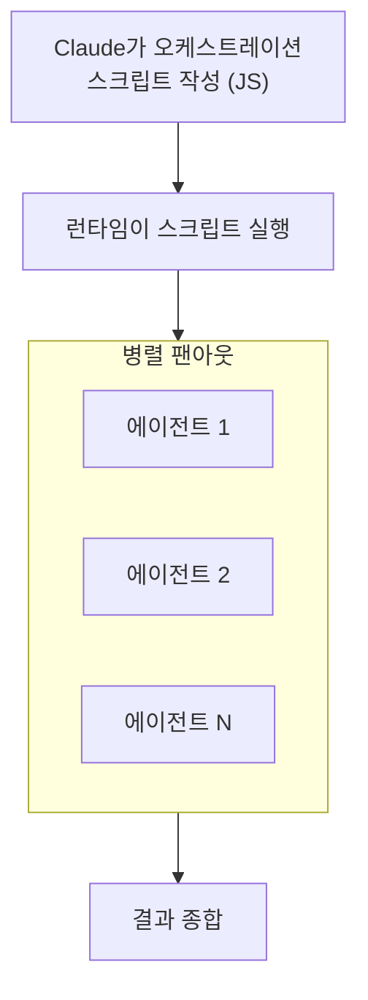

## 서론

[Part 3](/blog/claude-code-advanced-guide-3)에서 서브에이전트와 에이전트 팀을 다뤘다. "결과만 가져오는 위임"과 "토론하며 협업하는 팀", 두 가지 멀티에이전트 방식이었다.

이번 마지막 Part 4에서는 그 이후에 등장한 <strong>세 번째 패러다임과 클라우드 자동화</strong>를 다룬다:

- Part 1 — [메모리 + 스킬 + 훅](/blog/claude-code-advanced-guide-1)
- Part 2 — [플러그인 + MCP + IDE 연동](/blog/claude-code-advanced-guide-2)
- Part 3 — [서브에이전트 + 에이전트 팀](/blog/claude-code-advanced-guide-3)
- <strong>Part 4 — 워크플로 + Ultrareview + 원격 에이전트 (이 글)</strong>

- <strong>워크플로(ultracode)</strong>: Claude가 직접 오케스트레이션 스크립트를 짜서 수십~수백 에이전트를 결정론적으로 조율
- <strong>Ultrareview</strong>: 클라우드 멀티에이전트가 코드를 리뷰하고 발견 사항을 독립 검증
- <strong>원격·예약 에이전트(Routines)</strong>: cron·GitHub 이벤트로 노트북을 꺼도 실행
- <strong>Fast Mode와 모델</strong>: 속도·비용·성능을 상황에 맞게 고르기

> <strong>참고</strong>: 이 글의 기능 상당수는 2026년 6월 기준 리서치 프리뷰이거나 유료 크레딧을 소모한다. 가용 여부·과금은 플랜과 버전에 따라 다르니, 본인 환경에서 `/help`와 공식 문서로 확인하자.

---

## TL;DR

- <strong>워크플로는 "오케스트레이션을 코드로" 짠다</strong> — Claude가 자바스크립트 조율 스크립트를 직접 작성하고 런타임이 실행해, 수십~수백 에이전트를 결정론적으로(반복·조건·팬아웃) 돌린다. 코드베이스 전수 검사나 대규모 마이그레이션에 맞는다.
- <strong>세 패러다임은 목적이 다르다</strong> — 위임(서브에이전트)·협업(팀)·결정론적 조율(워크플로). 작업이 클수록, 구조가 분명할수록 워크플로가 유리하다.
- <strong>Ultrareview는 에이전트가 코드를 검증한다</strong> — 클라우드에서 멀티에이전트가 리뷰하고, 발견한 문제를 독립적으로 재현해 확인한다. 5~10분, 백그라운드, 로컬 자원 미사용.
- <strong>원격 에이전트는 노트북을 꺼도 돈다</strong> — 예약(cron)·API·GitHub 이벤트로 클라우드에서 실행된다. 백로그 정리, PR 자동 리뷰, 배포 검증을 무인으로.
- <strong>속도와 비용은 고르는 것이다</strong> — Fast Mode로 응답을 빠르게, 모델 별칭으로 성능·비용을 조절한다.

---

## 1. 워크플로 — Claude가 직접 오케스트레이션을 코딩한다

서브에이전트는 한 명에게 위임하고, 에이전트 팀은 여럿이 토론한다. <strong>워크플로</strong>는 다른 접근이다. Claude가 <strong>자바스크립트 오케스트레이션 스크립트</strong>를 직접 작성하고, 런타임이 그 스크립트를 실행하며 수십~수백 개의 에이전트를 조율한다. 조율 로직(반복문, 조건문, 팬아웃, 파이프라인)이 모델의 즉흥 판단이 아니라 <strong>코드에 담긴다</strong>는 것이 핵심이다.

### 1.1 세 번째 패러다임



세 가지 멀티에이전트 방식을 비교하면:

| 방식 | 조율 주체 | 적합한 경우 | 특징 |
|---|---|---|---|
| <strong>서브에이전트</strong> | 메인 Claude가 즉흥 위임 | 결과만 필요한 집중 작업 | 가장 가볍다 |
| <strong>에이전트 팀</strong> | 팀원들이 자율 조정 | 토론·반론이 필요한 작업 | 유연하지만 비용↑ |
| <strong>워크플로</strong> | 미리 작성된 스크립트 | 대규모·반복·구조가 분명한 작업 | 결정론적, 재현 가능 |

워크플로가 빛나는 작업: 코드베이스 전체 버그 스윕, 수백 파일 마이그레이션, 다차원 리뷰처럼 "같은 절차를 많은 대상에 반복"하는 일이다.

### 1.2 ultracode — 워크플로를 기본으로

`ultracode`는 워크플로를 적극적으로 쓰게 하는 모드다. 두 가지로 켠다:

- <strong>키워드</strong>: 프롬프트에 `ultracode`를 넣으면 해당 작업에 워크플로를 계획·실행한다.
- <strong>지속 모드</strong>: `/effort ultracode`로 설정하면 모든 실질적 요청에 자동으로 워크플로를 우선 고려한다.

```text
ultracode 이 모노레포 전체에서 deprecated API 호출을 찾아 새 API로 교체해줘
```

토큰을 많이 쓰는 대신, 한 번의 실행으로 광범위하고 철저한 결과를 노린다. 작은 작업에는 과하므로 평소엔 끄는 게 좋다.

### 1.3 진행 모니터링과 재사용

- <strong>`/workflows`</strong>: 실행 중인 워크플로의 진행 상황(에이전트 트리, 단계별 상태)을 실시간으로 본다.
- <strong>저장</strong>: 완료된 워크플로를 커스텀 명령으로 저장해 재사용할 수 있다.
- <strong>번들 워크플로</strong>: `/deep-research`(여러 소스를 팬아웃 검색→교차 검증→인용 리포트 작성)가 대표적인 기본 제공 워크플로다.

> <strong>참고</strong>: 워크플로는 강력하지만 토큰 소모가 크다. "이 작업이 정말 수십 개 병렬 에이전트가 필요한가"를 먼저 따지자. 단일 파일 수정이나 간단한 질문은 그냥 메인 대화가 빠르고 싸다.

---

## 2. Ultrareview — 클라우드 멀티에이전트 코드 리뷰

Part 1에서 본 `/code-review`는 로컬에서 현재 diff를 리뷰한다. <strong>Ultrareview</strong>는 이를 클라우드로 확장한 것이다. 멀티에이전트 플릿이 클라우드 샌드박스에서 코드를 리뷰하고, <strong>발견한 문제를 각각 독립적으로 재현·검증</strong>한 뒤 신뢰할 수 있는 것만 보고한다.

```bash
# 현재 브랜치를 클라우드 멀티에이전트로 리뷰
/code-review ultra

# GitHub PR 리뷰
/code-review ultra 142
```

특징:

- <strong>독립 검증</strong>: 단순히 "버그 같다"가 아니라, 각 발견을 재현해 진짜인지 확인한다. 거짓 양성이 적다.
- <strong>백그라운드·클라우드</strong>: 5~10분 걸리며 로컬 자원을 쓰지 않는다. 그동안 다른 일을 해도 된다.
- <strong>CI 연동</strong>: `claude ultrareview` 서브커맨드로 비대화형 실행이 가능하다.

> <strong>과금·제약</strong>: Pro·Max 구독자는 일부 무료 횟수가 주어지고, 이후에는 리뷰당 유료 크레딧을 소모한다. Bedrock·Vertex 등 일부 호스팅에서는 미지원이다. 사용자가 직접 실행하는 유료 기능이므로 Claude가 임의로 돌리지 않는다.

이 기능은 Part 3의 주제와 자연스럽게 이어진다. <strong>에이전트가 만든 코드를 다시 에이전트 플릿이 검증</strong>하는, 멀티에이전트 검증 루프의 완성이다.

---

## 3. Routines — 예약·원격 에이전트

지금까지의 기능은 모두 내가 터미널 앞에 있어야 했다. <strong>Routines</strong>는 그 전제를 깬다. Claude Code 세션 구성을 저장해두고, 트리거가 발생하면 <strong>클라우드 인프라에서 자동 실행</strong>한다. 노트북이 꺼져 있어도 돈다.

트리거 종류:

| 트리거 | 동작 | 활용 |
|---|---|---|
| <strong>예약 (cron)</strong> | 정해진 시각·주기에 실행 | 매일 아침 백로그 정리, 야간 의존성 업데이트 |
| <strong>API (HTTP POST)</strong> | 외부 시스템이 호출 | 사내 도구·파이프라인에서 트리거 |
| <strong>GitHub 이벤트</strong> | PR 오픈 등에 반응 | PR 자동 리뷰, 이슈 분류 |

`/schedule` 명령으로 대화형으로 루틴을 만들 수 있다:

```text
/schedule 매일 오전 9시에 열린 PR들을 리뷰하고 요약 코멘트를 달아줘
```

> <strong>참고</strong>: Routines는 Claude Code on the web([Part 2](/blog/claude-code-advanced-guide-2) 3.3절) 인프라 위에서 돌아간다. Pro·Max·Team·Enterprise 플랜에서 지원한다. 무인 자동화이므로, 권한 범위와 대상 저장소를 신중히 설정하자.

---

## 4. 모델과 속도 — Fast Mode, 모델 라인업

### 4.1 Fast Mode

<strong>Fast Mode</strong>는 Claude Opus의 응답을 최대 수 배 빠르게 만드는 설정이다. `/fast`로 토글한다.

- Opus 계열(4.8/4.7/4.6)에서만 지원 (Sonnet·Haiku 미지원)
- 레이턴시가 줄어드는 대신 비용이 올라가는 트레이드오프
- VS Code 익스텐션에서는 미지원
- 세션 시작 시 켜두는 것이 가장 비용 효율적

### 4.2 모델 라인업

작업에 맞게 모델을 고른다. 별칭으로 지정하면 환경에 맞는 최신 버전으로 해석된다.

| 별칭 | 해석 (2026년 6월) | 특징 |
|---|---|---|
| `opus` | Opus 4.8 | 최고 성능, 최고 강도(`xhigh`)·Fast Mode 지원 |
| `sonnet` | Sonnet 4.6 | 일상 코딩의 기본 균형 모델 |
| `haiku` | Haiku 4.5 | 빠르고 저렴, 단순 작업·서브에이전트 라우팅 |
| `opus[1m]` / `sonnet[1m]` | 해당 모델 + 100만 토큰 컨텍스트 | 초대형 코드베이스 (Max·Team·Enterprise) |
| `opusplan` | 계획은 Opus, 실행은 Sonnet | 하이브리드 자동 전환 |

> <strong>정리</strong>: 탐색·정리는 Haiku, 일상 작업은 Sonnet, 어려운 설계·리팩토링은 Opus. 서브에이전트의 `model:` 필드(3편 1.4절)로 작업별 라우팅을 걸면 비용을 최적화할 수 있다.

---

## 시리즈를 마치며

4편에 걸쳐 Claude Code의 고급 기능을 모두 다뤘다:

| Part | 주제 | 핵심 |
|---|---|---|
| <strong>Part 1</strong> | 메모리 + 스킬 + 훅 | Claude가 나를 기억하고, 반복 작업을 자동화 |
| <strong>Part 2</strong> | 플러그인 + MCP + IDE | 외부 도구를 연결하고, 에디터·웹에서 사용 |
| <strong>Part 3</strong> | 서브에이전트 + 에이전트 팀 | 작업을 위임하고, 토론하며 협업 |
| <strong>Part 4</strong> | 워크플로 + Ultrareview + 원격 에이전트 | 결정론적 조율과 클라우드 자동화 |

핵심은 멀티에이전트의 세 가지 결을 구분해 쓰는 것이다 — <strong>위임</strong>(서브에이전트), <strong>협업</strong>(에이전트 팀), <strong>결정론적 조율</strong>(워크플로). 여기에 클라우드 검증(Ultrareview)과 무인 실행(Routines)을 얹으면, Claude Code는 "내가 시키는 도구"를 넘어 <strong>스스로 일하는 시스템</strong>에 가까워진다.

이 모든 걸 한 번에 다 쓸 필요는 없다. 메모리와 스킬부터 시작해, 워크플로와 원격 에이전트까지 하나씩 자신의 흐름에 맞게 더해가면 된다.

---

## 부록

### A. 용어집

| 용어 | 설명 |
|---|---|
| 워크플로 | Claude가 작성한 JS 스크립트로 다수 에이전트를 결정론적으로 조율하는 기능 |
| ultracode | 워크플로를 적극 사용하게 하는 키워드/모드 |
| Ultrareview | 클라우드 멀티에이전트가 코드를 리뷰·독립 검증하는 기능 (`/code-review ultra`) |
| Routines | 예약·API·GitHub 이벤트로 클라우드에서 자동 실행되는 원격 에이전트 |
| Fast Mode | Opus 응답을 빠르게 하는 설정 (`/fast`) |
| opusplan | 계획은 Opus, 실행은 Sonnet으로 자동 전환하는 모델 별칭 |

### B. 명령어 치트시트

```bash
# 워크플로
ultracode <요청>        # 이 작업에 워크플로 사용
/effort ultracode       # 모든 실질 요청에 워크플로 우선 (지속 모드)
/workflows              # 실행 중 워크플로 모니터링
/deep-research <주제>    # 번들 리서치 워크플로

# 클라우드 리뷰
/code-review ultra      # 현재 브랜치 멀티에이전트 리뷰
/code-review ultra <PR#> # GitHub PR 리뷰
claude ultrareview      # CI용 비대화형 실행

# 원격·속도
/schedule               # 예약·원격 에이전트(Routine) 생성
/fast                   # Fast Mode 토글 (Opus 전용)
```

### C. 참고 자료

- [Claude Code Docs — Workflows](https://docs.claude.com/en/docs/claude-code/workflows)
- [Claude Code Docs — Ultrareview](https://docs.claude.com/en/docs/claude-code/ultrareview)
- [Claude Code Docs — Routines](https://docs.claude.com/en/docs/claude-code/routines)
- [Claude Code Docs — Fast Mode](https://docs.claude.com/en/docs/claude-code/fast-mode)
- [Claude Code Docs — Model Configuration](https://docs.claude.com/en/docs/claude-code/model-config)
