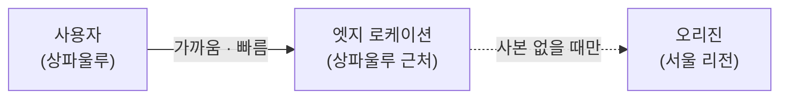
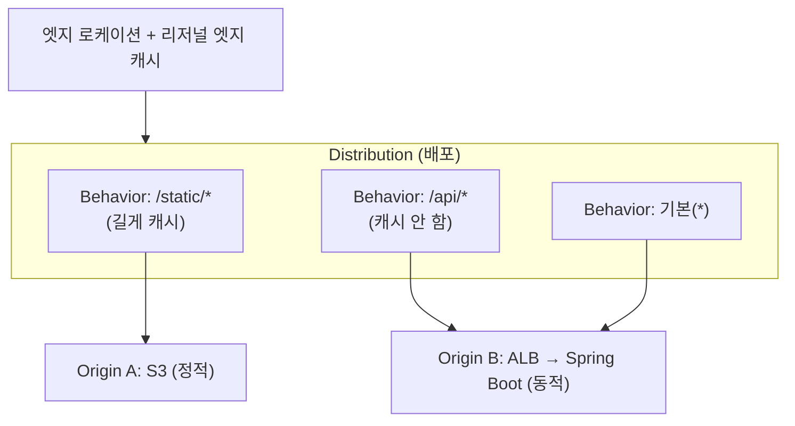
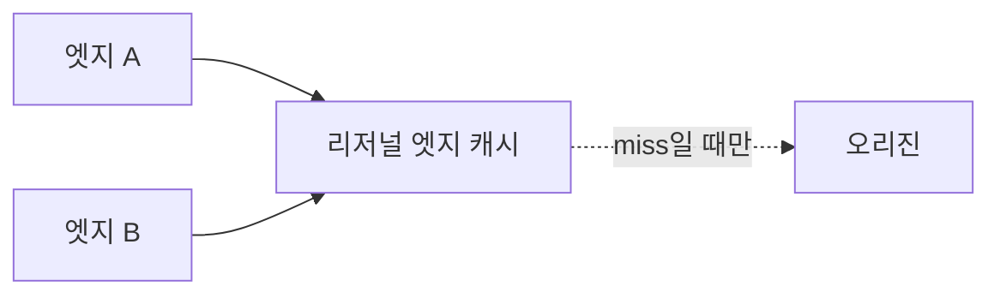
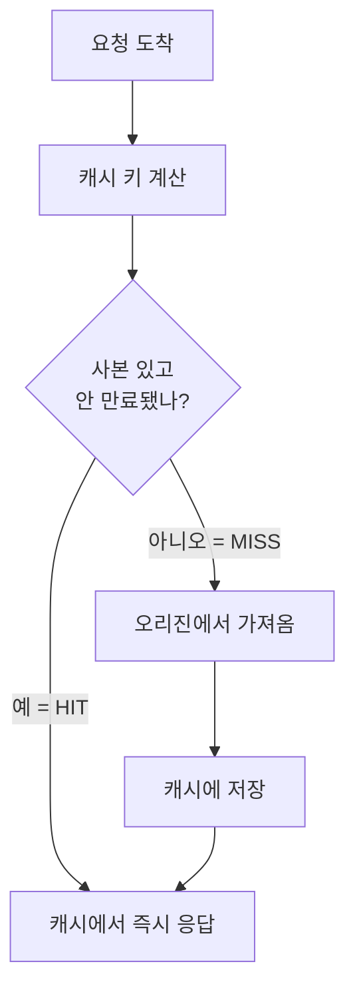

## 서론

API 서버 하나로 잘 돌아가던 서비스가, 사용자가 전 세계로 늘면 갑자기 느려진다. 서울 리전의 서버는 도쿄 사용자에겐 빠르지만 상파울루 사용자에겐 멀다. 게다가 똑같은 이미지·JS·CSS·정적 응답을 매 요청마다 원본 서버가 직접 내려주느라 부하도 쌓인다.

<strong>CDN(콘텐츠 전송 네트워크)</strong>은 이 두 문제를 동시에 푼다. 사용자와 가까운 곳에 사본을 캐싱해두고, 원본 서버 대신 그 사본을 내려준다. AWS의 CDN이 바로 <strong>CloudFront</strong>다.

이 시리즈는 CloudFront를 개념부터 실습까지 다룬다. 실습은 <strong>Spring Boot + Kotlin 오리진을 CloudFront 뒤에 두는</strong> 예제로, Terraform으로 재현 가능하게 구성한다.

- <strong>1편 — CDN과 CloudFront 동작 원리 (이 글)</strong>
- 2편 — [Spring Boot + Kotlin 오리진을 CloudFront로 (Terraform 실습)](/blog/cloudfront-cdn-guide-2)
- 3편 — [사설 콘텐츠·엣지 로직·보안·모니터링](/blog/cloudfront-cdn-guide-3)
- 4편 — [이미지 리사이징과 영상 트랜스코딩](/blog/cloudfront-cdn-guide-4)

이 글은 2편 실습에 들어가기 전에 반드시 알아야 할 개념을 정리한다. 캐시가 왜 맞고 왜 틀리는지를 모르면, 실습에서 "왜 캐시가 안 되지", "왜 옛날 응답이 계속 나오지"에 부딪힌다.

---

## TL;DR

- <strong>CDN은 사용자 근처에 사본을 둔다</strong> — 원본 서버(오리진) 대신, 사용자와 가까운 엣지 서버가 캐싱된 사본을 내려준다. 지연시간이 줄고 원본 부하가 빠진다.
- <strong>CloudFront는 분배 단위로 동작한다</strong> — 하나의 배포(Distribution)가 오리진을 가리키고, 경로 패턴별 동작 규칙(Behavior)으로 "무엇을 캐시하고 무엇을 원본으로 보낼지" 정한다.
- <strong>캐시는 키로 찾고, 보관 시간으로 만료된다</strong> — 요청을 캐시 키로 바꿔 사본을 찾는다(hit). 없으면 원본에서 가져온다(miss). 보관 시간은 원본이 보내는 `Cache-Control` 헤더로 정한다.
- <strong>정적은 캐시, 동적은 통과</strong> — 이미지·JS·CSS는 길게 캐시하고, 사용자별 API 응답은 캐시하지 않고 원본으로 보낸다. 경로별로 규칙을 나눈다.
- <strong>바꾸려면 무효화보다 버저닝</strong> — 캐시된 사본을 갈아끼우는 방법은 무효화와 파일명 버저닝 두 가지. 정적 자산은 버저닝이 더 싸고 안전하다.

---

## 1. CDN이 왜 필요한가

원본 서버(<strong>오리진, origin</strong>) 하나로 전 세계 트래픽을 받으면 두 가지 문제가 생긴다.

| 문제 | 설명 |
|------|------|
| <strong>지연시간(latency)</strong> | 물리적으로 먼 사용자는 왕복 시간이 길다. 서울 서버 ↔ 상파울루 사용자는 수백 ms |
| <strong>원본 부하</strong> | 똑같은 정적 파일을 매 요청마다 원본이 직접 내려주면 대역폭·CPU가 낭비된다 |

CDN은 전 세계에 흩어진 <strong>엣지 로케이션(edge location)</strong>에 사본을 캐싱한다. 사용자 요청은 가장 가까운 엣지로 라우팅되고, 엣지에 사본이 있으면 원본까지 가지 않고 즉시 응답한다.



핵심은 "사본 없을 때만 원본으로 간다"는 점선이다. 대부분의 정적 요청이 엣지에서 끝나면, 원본은 한가해지고 사용자는 빨라진다.

---

## 2. CloudFront 구성요소

CloudFront를 설정하려면 네 가지 개념을 구분해야 한다.



| 구성요소 | 역할 |
|------|------|
| <strong>Distribution(배포)</strong> | CloudFront 설정의 최상위 단위. 도메인 하나(`d123.cloudfront.net` 또는 커스텀 도메인)를 가진다 |
| <strong>Origin(오리진)</strong> | 원본 서버. S3 버킷, ALB, 또는 임의의 HTTP 서버 |
| <strong>Behavior(동작)</strong> | 경로 패턴(`/static/*`, `/api/*` 등)별로 어떤 오리진으로 보낼지, 캐시할지, 어떤 헤더·쿠키를 전달할지 정하는 규칙 |
| <strong>엣지 로케이션</strong> | 전 세계 사용자와 가까운 캐시 서버(PoP). 1차 캐시 |

### 2.1 엣지 로케이션과 리저널 엣지 캐시

CloudFront 캐시는 2계층이다. 사용자와 가장 가까운 <strong>엣지 로케이션</strong>에서 miss가 나면, 곧장 오리진으로 가지 않고 더 큰 <strong>리저널 엣지 캐시(Regional Edge Cache)</strong>를 한 번 더 거친다. 여러 엣지가 같은 리저널 캐시를 공유하므로, 한 엣지에서 채운 사본을 다른 엣지가 재활용해 오리진 부하가 더 줄어든다.



---

## 3. 캐싱 동작 원리

### 3.1 요청 흐름 — hit와 miss

엣지에 도착한 요청은 <strong>캐시 키(cache key)</strong>로 변환되어 사본을 조회한다.



응답 헤더의 `X-Cache`로 결과를 확인할 수 있다 — `Hit from cloudfront` 또는 `Miss from cloudfront`. 2편 실습에서 이 헤더로 캐시 동작을 검증한다.

### 3.2 캐시 키 — 무엇이 같은 요청인가

CloudFront는 캐시 키가 같으면 "같은 요청"으로 보고 같은 사본을 준다. 기본 키는 <strong>경로(path)</strong>뿐이지만, 캐시 정책으로 다음을 키에 포함할 수 있다.

| 키 구성 요소 | 포함하면 |
|------|------|
| 경로 | 항상 포함 (`/img/logo.png`) |
| 쿼리스트링 | `?v=2`마다 별도 사본. 버저닝에 사용 |
| 헤더 | 예: `Accept-Encoding`(압축 변형), `Accept-Language`(언어별) |
| 쿠키 | 사용자별로 달라지는 응답에. 단, 캐시 적중률이 급락하므로 주의 |

> <strong>핵심</strong>: 캐시 키에 변수를 많이 넣을수록 사본이 잘게 쪼개져 <strong>적중률(hit ratio)</strong>이 떨어진다. "정말 응답을 다르게 만드는 요소"만 키에 넣어야 한다. 예컨대 모든 쿠키를 키에 넣으면 사용자마다 사본이 달라져 캐시가 사실상 무력화된다.

### 3.3 TTL과 Cache-Control — 얼마나 보관하나

사본을 얼마나 오래 보관할지는 <strong>TTL(보관 시간, Time To Live)</strong>로 정한다. TTL은 주로 오리진이 보내는 `Cache-Control` 응답 헤더로 결정된다.

> <strong>참고 — Cache-Control은 양방향 헤더</strong>: `Cache-Control`은 요청·응답 모두에 실릴 수 있지만, "얼마나 캐시할지(수명)"를 정하는 건 <strong>응답(서버/오리진)</strong>이다. 요청 측 `Cache-Control`(예: 브라우저 강력 새로고침의 `no-cache`)은 "이번엔 새로 받아달라"는 신호일 뿐이다. 그래서 CDN 캐싱 수명은 2편에서 오리진(Spring Boot) 응답에 헤더를 붙여 결정한다.

```text
Cache-Control: public, max-age=31536000, immutable   # 1년 캐시 (정적 자산)
Cache-Control: no-store                              # 캐시 금지 (개인 API)
Cache-Control: no-cache                              # 매번 원본에 재검증
```

CloudFront Behavior에는 <strong>Min/Default/Max TTL</strong> 설정이 있어 오리진 헤더와 상호작용한다.

| 설정 | 의미 |
|------|------|
| Min TTL | 최소 보관 시간. 오리진이 더 짧게 줘도 이만큼은 보관 |
| Max TTL | 최대 보관 시간. 오리진이 더 길게 줘도 이 값으로 제한 |
| Default TTL | 오리진이 `Cache-Control`을 안 줬을 때 적용 |

> <strong>주의</strong>: "왜 옛날 응답이 계속 나오지?"의 90%는 오리진이 긴 `max-age`를 보냈거나, Behavior의 Min TTL이 길게 잡혀서다. 동적 응답에는 오리진에서 `no-store`/`no-cache`를 명확히 보내야 한다(2편에서 Kotlin으로 설정).

---

## 4. 캐시 무효화 vs 버저닝

배포된 사본을 갈아끼우는 방법은 두 가지다.

| 방법 | 동작 | 장단점 |
|------|------|------|
| <strong>무효화(Invalidation)</strong> | `/static/app.js` 같은 경로를 지정해 엣지 캐시에서 제거 | 즉시성 있지만, 경로가 많으면 비용·지연 발생. 월 무료 건수 초과 시 과금 |
| <strong>버저닝(Versioning)</strong> | 파일명/쿼리에 버전을 넣어 새 URL로 배포 (`app.abc123.js`, `app.js?v=2`) | 새 URL이라 캐시 미스가 자연스럽게 새 사본을 받음. 무효화 불필요, 롤백 쉬움 |

> <strong>결론</strong>: 정적 자산은 <strong>버저닝이 정석</strong>이다. 빌드 시 파일명에 해시를 박고(`app.[hash].js`) `Cache-Control: immutable, max-age=1년`으로 길게 캐시한다. 내용이 바뀌면 해시가 바뀌어 URL이 바뀌므로, 무효화 없이 새 버전이 즉시 반영된다. 무효화는 HTML처럼 URL을 못 바꾸는 소수 파일에만 쓴다.

---

## 5. 무엇을 캐시하고 무엇을 안 하나

CDN 설계의 핵심 결정은 "경로별로 캐시 정책을 나누는 것"이다.

| 콘텐츠 | 예시 경로 | 정책 |
|------|------|------|
| 정적 자산 | `/static/*`, `/assets/*` | 길게 캐시 + 버저닝 (`max-age=1년, immutable`) |
| 공개·동일 응답 | `/`, `/about` (모두 같은 HTML) | 짧게 캐시 (`max-age=수 분`) |
| 사용자별 동적 | `/api/*`, `/me` | 캐시 안 함 (`no-store`), 오리진으로 통과 |

이 분리를 CloudFront에서는 <strong>경로 패턴별 Behavior</strong>로 구현한다. `/api/*`는 캐시를 끄고 모든 헤더·쿠키를 오리진에 전달하는 Behavior, `/static/*`는 길게 캐시하고 쿠키를 무시하는 Behavior로 나눈다. 2편에서 Spring Boot 오리진과 함께 이 Behavior 분리를 Terraform으로 구성한다.

---

## 정리

| 개념 | 한 줄 요약 |
|------|----------|
| <strong>CDN</strong> | 사용자 근처 엣지에 사본을 캐싱해 지연·원본 부하를 줄인다 |
| <strong>Distribution</strong> | CloudFront 설정의 최상위 단위, 도메인 하나 |
| <strong>Origin</strong> | 원본 서버 (S3, ALB, HTTP 서버) |
| <strong>Behavior</strong> | 경로 패턴별 캐시·전달 규칙 |
| <strong>캐시 키</strong> | 무엇을 "같은 요청"으로 볼지 — 적게 넣을수록 적중률↑ |
| <strong>Cache-Control / TTL</strong> | 사본 보관 시간. 동적은 `no-store` 명시 |
| <strong>버저닝</strong> | 정적 자산 갱신의 정석, 무효화보다 우선 |

다음 [2편](/blog/cloudfront-cdn-guide-2)에서는 이 개념들을 실제로 적용한다. Spring Boot + Kotlin 앱을 오리진으로 띄우고, Kotlin 코드로 `Cache-Control`·ETag를 설정하고, CloudFront Behavior를 `/api/*`(무캐시)와 `/static/*`(캐시)로 나눠 Terraform으로 구성한 뒤, `X-Cache` 헤더로 hit/miss를 직접 검증한다.

---

## 부록

### A. 용어집

| 용어 | 설명 |
|------|------|
| CDN | 콘텐츠 전송 네트워크. 사용자 근처에 사본을 캐싱해 전송하는 시스템 |
| 오리진(Origin) | 원본 콘텐츠를 가진 서버 (S3·ALB·HTTP) |
| 엣지 로케이션 | 사용자와 가까운 캐시 서버(PoP). CloudFront의 1차 캐시 |
| 리저널 엣지 캐시 | 엣지와 오리진 사이의 2차 대형 캐시 |
| Distribution | CloudFront 배포 단위 (도메인 1개) |
| Behavior | 경로 패턴별 캐시·라우팅 규칙 |
| 캐시 키 | 요청을 식별해 사본을 찾는 키 (경로·쿼리·헤더·쿠키 조합) |
| TTL | 사본 보관 시간 (Time To Live) |
| hit / miss | 캐시에 사본이 있음 / 없어 오리진에서 가져옴 |
| 적중률(hit ratio) | 전체 요청 중 캐시 hit 비율 |
| 무효화(Invalidation) | 엣지 캐시에서 특정 경로의 사본을 제거 |

### B. 참고 자료

- [Amazon CloudFront 개발자 가이드](https://docs.aws.amazon.com/AmazonCloudFront/latest/DeveloperGuide/Introduction.html)
- [CloudFront 캐시 정책과 오리진 요청 정책](https://docs.aws.amazon.com/AmazonCloudFront/latest/DeveloperGuide/controlling-the-cache-key.html)
- [MDN — HTTP Cache-Control](https://developer.mozilla.org/en-US/docs/Web/HTTP/Headers/Cache-Control)
