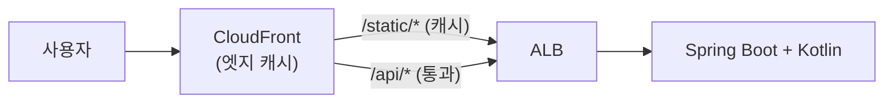

## 서론

[1편](/blog/cloudfront-cdn-guide-1)에서 CDN과 CloudFront의 동작 원리(캐시 키·`Cache-Control`·TTL·hit/miss, 무효화 vs 버저닝)를 다뤘다. 이번 2편은 그 개념을 실제 코드로 옮긴다.

목표는 <strong>Spring Boot + Kotlin 앱을 오리진으로 두고, 앞단에 CloudFront를 붙이는 것</strong>이다. 핵심은 두 가지다.

1. <strong>오리진이 올바른 `Cache-Control`을 보내게</strong> 만든다 (Kotlin) — 정적은 길게, 동적은 캐시 금지.
2. <strong>CloudFront가 경로별로 다르게 동작하게</strong> 만든다 (Terraform) — `/static/*`는 캐시, `/api/*`는 통과.

- 1편 — [CDN과 CloudFront 동작 원리](/blog/cloudfront-cdn-guide-1)
- <strong>2편 — Spring Boot + Kotlin 오리진을 CloudFront로 (이 글)</strong>
- 3편 — [사설 콘텐츠·엣지 로직·보안·모니터링](/blog/cloudfront-cdn-guide-3)

---

## TL;DR

- <strong>오리진이 캐시 의도를 헤더로 말한다</strong> — Kotlin에서 정적 리소스엔 `Cache-Control: max-age=1년, immutable`, 동적 API엔 `no-store`를 명시한다. CloudFront는 이 헤더를 따른다.
- <strong>Behavior를 경로별로 나눈다</strong> — `/static/*`는 캐시 정책(CachingOptimized), `/api/*`와 기본은 무캐시 정책(CachingDisabled)으로 분리한다.
- <strong>오리진 요청 정책으로 무엇을 넘길지 정한다</strong> — 동적 경로는 쿠키·헤더·쿼리를 오리진에 전달해야 하므로 AllViewerExceptHostHeader를, 정적은 최소만 전달한다.
- <strong>Terraform으로 재현한다</strong> — `aws_cloudfront_distribution`에 origin 하나(ALB)와 ordered_cache_behavior로 경로 규칙을 선언한다.
- <strong>X-Cache로 검증한다</strong> — `curl -I`로 정적은 두 번째 요청에 `Hit`, 동적은 항상 `Miss`임을 확인한다.

---

## 1. 아키텍처

이번 실습 구성은 단순하다. 사용자 → CloudFront → ALB → Spring Boot 앱. 앱이 정적 리소스(`/static/*`)와 동적 API(`/api/*`)를 모두 제공한다.



> <strong>참고</strong>: 정적 자산을 S3에 따로 두는 구성도 흔하다(오리진 2개). 여기서는 "앱 하나가 정적+동적을 모두 제공"하는 가장 단순한 형태로 시작한다. S3 + OAC 구성은 3편에서 보안과 함께 다룬다.

---

## 2. Spring Boot + Kotlin 오리진 — 올바른 Cache-Control 보내기

CloudFront는 똑똑하지 않다. <strong>오리진이 보내는 `Cache-Control` 헤더를 그대로 따를 뿐</strong>이다. 그래서 캐싱의 절반은 앱 코드에서 결정된다.

### 2.1 정적 리소스 — 길게, immutable

`WebMvcConfigurer`로 정적 경로에 `Cache-Control`을 건다. 파일명에 해시가 박힌 자산(`app.abc123.js`)이라는 전제로 `immutable` + 1년을 준다(1편 4절의 버저닝 전략).

```kotlin
import org.springframework.context.annotation.Configuration
import org.springframework.http.CacheControl
import org.springframework.web.servlet.config.annotation.ResourceHandlerRegistry
import org.springframework.web.servlet.config.annotation.WebMvcConfigurer
import java.util.concurrent.TimeUnit

@Configuration
class WebConfig : WebMvcConfigurer {
    override fun addResourceHandlers(registry: ResourceHandlerRegistry) {
        registry.addResourceHandler("/static/**")
            .addResourceLocations("classpath:/static/")
            .setCacheControl(
                CacheControl.maxAge(365, TimeUnit.DAYS)
                    .cachePublic()
                    .immutable(),
            )
    }
}
```

응답 헤더는 이렇게 나간다:

```text
Cache-Control: max-age=31536000, public, immutable
```

### 2.2 동적 API — 캐시 금지 명시

사용자별로 달라지는 응답은 <strong>반드시 `no-store`</strong>를 보내야 한다. 안 보내면 CloudFront Behavior의 Default TTL에 따라 엉뚱하게 캐시될 수 있다.

```kotlin
import org.springframework.http.CacheControl
import org.springframework.http.ResponseEntity
import org.springframework.web.bind.annotation.GetMapping
import org.springframework.web.bind.annotation.RestController

@RestController
class ApiController(private val userService: UserService) {

    // 사용자별 응답 → 절대 캐시 금지
    @GetMapping("/api/me")
    fun me(): ResponseEntity<UserDto> =
        ResponseEntity.ok()
            .cacheControl(CacheControl.noStore())
            .body(userService.currentUser())

    // 모두에게 동일하고 자주 안 바뀌는 공개 데이터 → 짧게 캐시 허용
    @GetMapping("/api/products")
    fun products(): ResponseEntity<List<ProductDto>> =
        ResponseEntity.ok()
            .cacheControl(CacheControl.maxAge(60, TimeUnit.SECONDS).cachePublic())
            .body(userService.products())
}
```

> <strong>핵심</strong>: `/api/*`라고 전부 무캐시일 필요는 없다. "모두에게 같고 잠깐 묵혀도 되는" 공개 목록은 `max-age=60s`로 짧게 캐시하면 원본 부하가 크게 준다. "사용자별"인 것만 `no-store`다.

### 2.3 ETag로 대역폭 절약 (선택)

`ShallowEtagHeaderFilter`를 켜면 응답 본문 해시를 `ETag`로 붙여준다. 클라이언트/CDN이 `If-None-Match`로 재검증할 때 내용이 같으면 본문 없이 `304 Not Modified`만 돌아가 대역폭을 아낀다.

```kotlin
import org.springframework.boot.web.servlet.FilterRegistrationBean
import org.springframework.context.annotation.Bean
import org.springframework.context.annotation.Configuration
import org.springframework.web.filter.ShallowEtagHeaderFilter

@Configuration
class EtagConfig {
    @Bean
    fun shallowEtagFilter(): FilterRegistrationBean<ShallowEtagHeaderFilter> =
        FilterRegistrationBean(ShallowEtagHeaderFilter()).apply {
            addUrlPatterns("/api/*")
        }
}
```

> <strong>주의</strong>: `ETag`(재검증)는 `no-store`(저장 자체 금지)와 목적이 다르다. `no-store` 응답엔 ETag가 의미 없다. ETag는 "캐시는 하되 바뀌었는지 확인하고 싶은" `no-cache`/짧은 `max-age` 응답에 어울린다.

---

## 3. CloudFront Behavior 설계

이제 CloudFront가 경로별로 다르게 동작하도록 정책을 고른다. AWS가 제공하는 <strong>관리형 정책(managed policy)</strong>을 쓰면 직접 만들 필요가 없다.

| 경로 | 캐시 정책 | 오리진 요청 정책 | 의도 |
|------|------|------|------|
| `/static/*` | `CachingOptimized` | (불필요) | 길게 캐시, 쿠키 무시, 압축 |
| `/api/*` | `CachingDisabled` | `AllViewerExceptHostHeader` | 캐시 안 함, 쿠키·헤더·쿼리 전달 |
| 기본(`*`) | `CachingDisabled` | `AllViewerExceptHostHeader` | 안전한 기본값(통과) |

- <strong>CachingOptimized</strong>: 쿠키를 캐시 키에서 빼고 `Accept-Encoding`만 본다 → 적중률이 높다. 정적 자산용.
- <strong>CachingDisabled</strong>: 캐시하지 않는다. 동적 경로용.
- <strong>AllViewerExceptHostHeader</strong>: 뷰어의 헤더·쿠키·쿼리를 오리진에 모두 전달하되 `Host`만 제외한다. ALB 같은 커스텀 오리진은 자신의 Host로 라우팅하므로, 뷰어 Host를 넘기면 안 되기에 이 정책을 쓴다.

> <strong>왜 Host를 빼나</strong>: CloudFront가 뷰어의 `Host`(예: `cdn.example.com`)를 그대로 ALB에 넘기면, ALB의 호스트 기반 라우팅이나 백엔드 가상호스트가 깨질 수 있다. `AllViewerExceptHostHeader`는 Host를 오리진 도메인으로 두고 나머지만 전달한다.

---

## 4. Terraform으로 구성

ALB·앱·네트워크는 이미 있다고 보고(이전 Terraform 가이드 참조), CloudFront 배포에 집중한다.

### 4.1 관리형 정책 조회

```hcl
data "aws_cloudfront_cache_policy" "optimized" {
  name = "Managed-CachingOptimized"
}

data "aws_cloudfront_cache_policy" "disabled" {
  name = "Managed-CachingDisabled"
}

data "aws_cloudfront_origin_request_policy" "all_viewer_except_host" {
  name = "Managed-AllViewerExceptHostHeader"
}
```

### 4.2 배포 (Distribution)

```hcl
resource "aws_cloudfront_distribution" "app" {
  enabled = true
  comment = "spring-boot-kotlin-origin"

  origin {
    domain_name = aws_lb.app.dns_name   # ALB DNS 이름
    origin_id   = "alb-origin"

    custom_origin_config {
      http_port              = 80
      https_port             = 443
      origin_protocol_policy = "https-only"   # CloudFront ↔ ALB 구간도 HTTPS
      origin_ssl_protocols   = ["TLSv1.2"]
    }
  }

  # 기본: 캐시하지 않고 통과 (가장 안전한 기본값)
  default_cache_behavior {
    target_origin_id         = "alb-origin"
    viewer_protocol_policy   = "redirect-to-https"
    allowed_methods          = ["GET", "HEAD", "OPTIONS", "PUT", "POST", "PATCH", "DELETE"]
    cached_methods           = ["GET", "HEAD"]
    cache_policy_id          = data.aws_cloudfront_cache_policy.disabled.id
    origin_request_policy_id = data.aws_cloudfront_origin_request_policy.all_viewer_except_host.id
  }

  # /static/* : 길게 캐시 + 압축
  ordered_cache_behavior {
    path_pattern           = "/static/*"
    target_origin_id       = "alb-origin"
    viewer_protocol_policy = "redirect-to-https"
    allowed_methods        = ["GET", "HEAD"]
    cached_methods         = ["GET", "HEAD"]
    cache_policy_id        = data.aws_cloudfront_cache_policy.optimized.id
    compress               = true
  }

  # /api/* : 캐시 안 함 + 뷰어 요청 전달
  ordered_cache_behavior {
    path_pattern             = "/api/*"
    target_origin_id         = "alb-origin"
    viewer_protocol_policy   = "redirect-to-https"
    allowed_methods          = ["GET", "HEAD", "OPTIONS", "PUT", "POST", "PATCH", "DELETE"]
    cached_methods           = ["GET", "HEAD"]
    cache_policy_id          = data.aws_cloudfront_cache_policy.disabled.id
    origin_request_policy_id = data.aws_cloudfront_origin_request_policy.all_viewer_except_host.id
  }

  restrictions {
    geo_restriction {
      restriction_type = "none"
    }
  }

  viewer_certificate {
    cloudfront_default_certificate = true   # 커스텀 도메인·ACM은 3편에서
  }
}

output "cdn_domain" {
  value = aws_cloudfront_distribution.app.domain_name
}
```

`terraform apply` 후 `cdn_domain`(예: `d123abc.cloudfront.net`)으로 접속하면 CloudFront를 통해 앱에 닿는다. 배포 전파에 보통 수 분 걸린다.

---

## 5. 검증 — X-Cache로 hit/miss 확인

`curl -I`로 응답 헤더만 보면 캐시 동작이 드러난다.

### 정적 자산 — 두 번째부터 Hit

```bash
$ curl -sI https://d123abc.cloudfront.net/static/app.abc123.js | grep -iE 'x-cache|cache-control|age'
cache-control: max-age=31536000, public, immutable
x-cache: Miss from cloudfront          # 첫 요청: 엣지에 사본 없음 → 오리진

$ curl -sI https://d123abc.cloudfront.net/static/app.abc123.js | grep -iE 'x-cache|age'
x-cache: Hit from cloudfront           # 두 번째: 엣지 사본 사용
age: 12                                # 캐시에 머문 시간(초)
```

### 동적 API — 항상 Miss

```bash
$ curl -sI https://d123abc.cloudfront.net/api/me | grep -iE 'x-cache|cache-control'
cache-control: no-store
x-cache: Miss from cloudfront          # no-store라 매번 오리진으로
```

> <strong>해석</strong>: 정적은 두 번째 요청에서 `Hit`로 바뀌고 `Age`가 올라간다 → 캐시 정상. 동적은 `no-store`라 영원히 `Miss`(=항상 오리진) → 의도대로. 만약 `/api/me`가 `Hit`로 나오면, 오리진이 `no-store`를 안 보냈거나 Behavior 정책이 잘못 매칭된 것이다.

---

## 6. 무효화 실습

HTML처럼 URL을 못 바꾸는 파일을 갱신했다면 무효화한다(1편 4절). 정적 해시 자산은 무효화가 필요 없다.

```bash
# index.html만 무효화 (와일드카드도 가능: "/*")
aws cloudfront create-invalidation \
  --distribution-id E123ABCDEF456 \
  --paths "/index.html"
```

Terraform으로도 트리거할 수 있지만, 무효화는 배포 시점의 일회성 작업이라 보통 CI 파이프라인에서 CLI로 호출한다.

> <strong>비용 주의</strong>: 무효화는 월 1,000경로까지 무료, 이후 경로당 과금이다. `"/*"` 한 줄도 1경로로 치지만 광범위 무효화는 적중률을 떨어뜨린다. 그래서 정적 자산은 무효화가 아니라 버저닝이 정석이다.

---

## 정리

| 단계 | 한 일 |
|------|------|
| <strong>오리진(Kotlin)</strong> | 정적엔 `max-age=1년 immutable`, 동적엔 `no-store`를 명시 |
| <strong>Behavior 설계</strong> | `/static/*`=CachingOptimized, `/api/*`·기본=CachingDisabled + AllViewerExceptHostHeader |
| <strong>Terraform</strong> | `aws_cloudfront_distribution`에 ALB 오리진 + ordered_cache_behavior로 선언 |
| <strong>검증</strong> | `X-Cache`로 정적=Hit, 동적=Miss 확인 |
| <strong>갱신</strong> | 해시 자산은 버저닝, HTML은 무효화 |

캐싱의 절반은 오리진 헤더, 절반은 CloudFront Behavior다. 둘이 어긋나면(오리진은 캐시하라는데 Behavior가 끄거나, 그 반대) 캐시가 의도대로 안 된다.

다음 [3편](/blog/cloudfront-cdn-guide-3)에서는 운영·심화를 다룬다. <strong>Signed URL/쿠키</strong>로 사설 콘텐츠를 보호하고, <strong>CloudFront Functions와 Lambda@Edge</strong>로 엣지에서 로직을 돌리고, <strong>커스텀 도메인(ACM)·S3 OAC·WAF</strong>로 보안을 강화하고, <strong>캐시 적중률·CloudWatch·로그</strong>로 운영을 모니터링한다.

---

## 부록

### A. CacheControl 빌더 치트시트 (Spring)

| 목적 | Kotlin |
|------|------|
| 1년 불변 정적 | `CacheControl.maxAge(365, DAYS).cachePublic().immutable()` |
| 짧은 공개 캐시 | `CacheControl.maxAge(60, SECONDS).cachePublic()` |
| 캐시 금지(개인) | `CacheControl.noStore()` |
| 매번 재검증 | `CacheControl.noCache()` |

### B. 트러블슈팅

| 증상 | 흔한 원인 |
|------|------|
| 동적 API가 캐시됨 | 오리진이 `no-store` 미전송 → Behavior Default TTL 적용 |
| 정적이 계속 Miss | 쿠키가 캐시 키에 포함됨(잘못된 정책) → CachingOptimized 사용 |
| 옛날 HTML이 계속 나옴 | 긴 `max-age` + 무효화 안 함 → 무효화 또는 짧은 TTL |
| ALB 503/라우팅 깨짐 | 뷰어 Host 전달 → AllViewerExceptHostHeader 사용 |

### C. 참고 자료

- [aws_cloudfront_distribution (Terraform Registry)](https://registry.terraform.io/providers/hashicorp/aws/latest/docs/resources/cloudfront_distribution)
- [CloudFront 관리형 캐시 정책](https://docs.aws.amazon.com/AmazonCloudFront/latest/DeveloperGuide/using-managed-cache-policies.html)
- [Spring Framework — CacheControl](https://docs.spring.io/spring-framework/reference/web/webmvc/mvc-caching.html)
