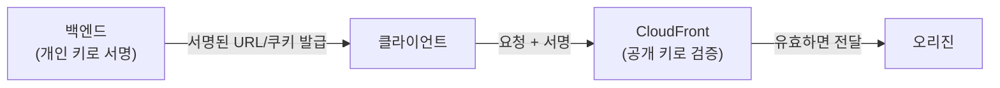
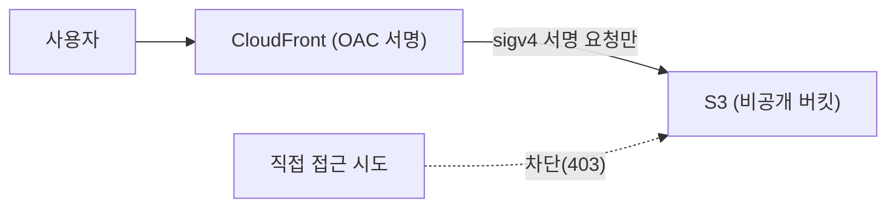

## 서론

[1편](/blog/cloudfront-cdn-guide-1)에서 개념을, [2편](/blog/cloudfront-cdn-guide-2)에서 Spring Boot + Kotlin 오리진을 CloudFront로 올리는 실습을 했다. 기본 동작은 갖췄으니, 이번 3편은 실제 운영에 필요한 네 가지를 다룬다.

- 1편 — [CDN과 CloudFront 동작 원리](/blog/cloudfront-cdn-guide-1)
- 2편 — [Spring Boot + Kotlin 오리진을 CloudFront로](/blog/cloudfront-cdn-guide-2)
- <strong>3편 — 사설 콘텐츠·엣지 로직·보안·모니터링 (이 글)</strong>
- 4편 — [이미지 리사이징과 영상 트랜스코딩](/blog/cloudfront-cdn-guide-4)

다룰 주제: <strong>① 사설 콘텐츠(Signed URL/쿠키), ② 엣지 로직(Functions vs Lambda@Edge), ③ 보안(커스텀 도메인·OAC·WAF), ④ 모니터링·비용.</strong>

---

## TL;DR

- <strong>비공개 콘텐츠는 서명으로 보호한다</strong> — 서명된 URL(파일 1개)이나 서명된 쿠키(여러 파일)로, 권한 있는 사용자만 일정 시간 동안 접근하게 한다.
- <strong>엣지에서 가벼운 로직을 돌린다</strong> — 단순 헤더 조작·리다이렉트는 초경량 CloudFront Functions, 네트워크 호출·복잡한 로직은 Lambda@Edge.
- <strong>둘의 분기 기준은 무게</strong> — Functions는 1ms·뷰어 단계만·매우 저렴, Lambda@Edge는 더 무겁고 4개 트리거에 네트워크 가능.
- <strong>보안은 세 겹</strong> — TLS 인증서로 커스텀 도메인(HTTPS), S3는 오리진 접근 제어(OAC)로 직접 접근 차단, 웹 방화벽(WAF)·지역 차단으로 트래픽 필터.
- <strong>운영은 적중률로 본다</strong> — 캐시 적중률·에러율·전송량을 지표로 보고, 가격 등급·압축·적중률로 비용을 줄인다.

---

## 1. 사설 콘텐츠 — Signed URL과 Signed Cookie

기본 CloudFront 배포는 누구나 URL만 알면 접근할 수 있다. 유료 동영상, 회원 전용 파일처럼 <strong>권한 있는 사용자만</strong> 접근시키려면 서명(signing)이 필요하다.

| 방식 | 적합한 경우 | 특징 |
|------|------|------|
| <strong>Signed URL</strong> | 파일 하나 (특정 동영상·다운로드 링크) | URL에 서명·만료시각 포함. URL이 길어짐 |
| <strong>Signed Cookie</strong> | 여러 파일·경로 전체 (회원 전용 섹션) | 쿠키로 권한 부여, URL은 그대로. 다수 자산에 적합 |

동작 원리: 백엔드(신뢰 서버)가 개인 키로 정책(만료시각·허용 경로)에 서명하고, CloudFront는 등록된 공개 키로 검증한다. 서명이 유효하고 안 만료됐을 때만 콘텐츠를 내려준다.



Terraform으로 공개 키와 키 그룹을 등록하고, Behavior에 연결한다.

```hcl
resource "aws_cloudfront_public_key" "app" {
  name        = "app-public-key"
  encoded_key = file("public_key.pem")   # RSA 공개 키 (PEM)
}

resource "aws_cloudfront_key_group" "app" {
  name  = "app-key-group"
  items = [aws_cloudfront_public_key.app.id]
}

# 보호할 Behavior에 추가:
#   trusted_key_groups = [aws_cloudfront_key_group.app.id]
```

`trusted_key_groups`가 걸린 Behavior는 유효한 서명 없이는 `403`을 반환한다. 서명 생성은 백엔드(예: AWS SDK의 CloudFront signer)에서 개인 키로 수행한다.

---

## 2. 엣지 로직 — CloudFront Functions vs Lambda@Edge

엣지에서 요청·응답을 가로채 로직을 실행할 수 있다. 두 가지 수단이 있고, <strong>"무게"</strong>로 나뉜다.

| 기준 | CloudFront Functions | Lambda@Edge |
|------|------|------|
| 언어 | JavaScript (경량 런타임) | Node.js / Python |
| 실행 위치 | 모든 엣지 로케이션 | 리저널 엣지 캐시(+뷰어) |
| 트리거 | viewer-request, viewer-response | viewer/origin × request/response (4종) |
| 실행 시간 | 1ms 미만 | 최대 수~수십 초 |
| 네트워크 호출 | 불가 | 가능 (외부 API·DB) |
| 비용 | 매우 저렴 | 더 비쌈 |
| 용도 | 헤더 조작, 리다이렉트, URL 재작성, 토큰 형식 검사 | 오리진 분기, 외부 인증, 이미지 변환 등 무거운 로직 |

> <strong>고르는 법</strong>: "헤더 손보기·간단 리다이렉트·URL 정규화"면 거의 항상 <strong>CloudFront Functions</strong>(싸고 빠르다). "외부 호출·복잡한 분기·오리진 응답 가공"이 필요할 때만 <strong>Lambda@Edge</strong>.

### 예시 — viewer-request에서 보안 헤더 검사 (CloudFront Functions)

```js
// auth.js — Authorization 헤더 없으면 401
function handler(event) {
  var request = event.request;
  if (!request.headers['authorization']) {
    return {
      statusCode: 401,
      statusDescription: 'Unauthorized',
    };
  }
  return request; // 통과
}
```

```hcl
resource "aws_cloudfront_function" "auth" {
  name    = "viewer-auth"
  runtime = "cloudfront-js-2.0"
  publish = true
  code    = file("auth.js")
}

# Behavior에 연결:
#   function_association {
#     event_type   = "viewer-request"
#     function_arn = aws_cloudfront_function.auth.arn
#   }
```

---

## 3. 보안 — 커스텀 도메인, OAC, WAF

### 3.1 커스텀 도메인 + TLS 인증서 (ACM)

`d123.cloudfront.net` 대신 `cdn.example.com`을 쓰려면 ACM 인증서가 필요하다. <strong>CloudFront용 인증서는 반드시 `us-east-1` 리전</strong>에 있어야 한다(글로벌 서비스라 버지니아 북부에서 관리).

```hcl
# CloudFront용 인증서는 us-east-1 고정
resource "aws_acm_certificate" "cdn" {
  provider          = aws.us_east_1
  domain_name       = "cdn.example.com"
  validation_method = "DNS"
}

# 배포에 추가:
#   aliases = ["cdn.example.com"]
#   viewer_certificate {
#     acm_certificate_arn      = aws_acm_certificate.cdn.arn
#     ssl_support_method       = "sni-only"
#     minimum_protocol_version = "TLSv1.2_2021"
#   }
```

이후 Route53(또는 DNS 제공자)에서 `cdn.example.com`을 배포 도메인으로 CNAME/별칭 연결한다.

### 3.2 S3 오리진 — OAC로 직접 접근 차단

정적 자산을 S3에 둔다면(2편 1절의 옵션), 버킷을 공개하면 안 된다. <strong>OAC(Origin Access Control)</strong>로 "CloudFront만 S3에 접근"하게 하고 버킷은 비공개로 둔다. (구형 OAI는 더 이상 권장되지 않는다.)

```hcl
resource "aws_cloudfront_origin_access_control" "s3" {
  name                              = "s3-oac"
  origin_access_control_origin_type = "s3"
  signing_behavior                  = "always"
  signing_protocol                  = "sigv4"
}

# S3 오리진에 origin_access_control_id 연결 + 버킷 정책에서
# cloudfront.amazonaws.com 서비스 주체에 AWS:SourceArn(배포 ARN) 조건으로만 허용
```



### 3.3 WAF·지역 차단

웹 방화벽(<strong>WAF</strong>)으로 SQL 인젝션·악성 봇·요청 폭주(rate limit)를 엣지에서 거른다. CloudFront용 WAF는 `scope = "CLOUDFRONT"`로 만들고 `us-east-1`에 둔다.

```hcl
resource "aws_wafv2_web_acl" "cdn" {
  provider = aws.us_east_1
  name     = "cdn-waf"
  scope    = "CLOUDFRONT"
  # ... 관리형 규칙 그룹(AWSManagedRulesCommonRuleSet 등) + rate-based 규칙 ...
}

# 배포에 추가: web_acl_id = aws_wafv2_web_acl.cdn.arn
```

특정 국가만 허용/차단하려면 배포의 `geo_restriction`을 쓴다.

```hcl
restrictions {
  geo_restriction {
    restriction_type = "whitelist"
    locations        = ["KR", "US", "JP"]
  }
}
```

---

## 4. 모니터링·비용

### 4.1 무엇을 보나

CloudFront는 CloudWatch로 핵심 지표를 노출한다.

| 지표 | 의미 | 본다는 것은 |
|------|------|------|
| <strong>캐시 적중률(Cache Hit Rate)</strong> | hit / 전체 비율 | 낮으면 오리진 부하·비용↑ → 캐시 키·TTL 점검 |
| <strong>4xx / 5xx 에러율</strong> | 오류 응답 비율 | 5xx 급증 = 오리진 장애, 4xx = 권한·경로 문제 |
| <strong>BytesDownloaded</strong> | 전송량 | 비용·트래픽 추세 |
| <strong>OriginLatency</strong> | 오리진 응답 지연 | 높으면 오리진 병목 |

> <strong>참고</strong>: 적중률 같은 상세 지표는 배포의 <strong>추가 지표(additional metrics)</strong>를 켜야 CloudWatch에 올라온다. 기본 지표만으로는 적중률을 정확히 못 본다.

로그는 두 가지다 — S3로 떨구는 <strong>표준 로그</strong>(사후 분석용)와, 초 단위로 흘려보내는 <strong>실시간 로그</strong>(Kinesis 등으로). 캐시 miss가 잦은 경로를 찾을 때 로그가 결정적이다.

### 4.2 비용 줄이기

CloudFront 비용은 크게 <strong>전송량 + 요청 수 + (무효화·Lambda@Edge)</strong>다.

- <strong>적중률을 올린다</strong>: 캐시 키를 최소화하고(쿠키 제거), 정적은 길게 캐시. 적중률이 곧 비용이다.
- <strong>압축을 켠다</strong>: `compress = true`로 전송량을 줄인다.
- <strong>가격 등급(Price Class)</strong>: 전 세계 엣지가 필요 없으면 `PriceClass_100`(북미·유럽) 등으로 제한해 비용을 낮춘다.
- <strong>Origin Shield</strong>: 오리진 앞에 한 겹 더 두면 오리진 적중을 줄여 부하·전송을 절감(트래픽 큰 경우).

---

## 정리

여기까지 CloudFront를 개념부터 운영까지 다뤘다.

| Part | 주제 | 핵심 |
|------|------|------|
| <strong>1편</strong> | 개념 | 엣지 캐시·캐시 키·Cache-Control/TTL·무효화 vs 버저닝 |
| <strong>2편</strong> | 실습 | Spring Boot+Kotlin 오리진 + Behavior 분리 + Terraform + X-Cache 검증 |
| <strong>3편</strong> | 운영 | 사설 콘텐츠·엣지 로직·보안(도메인·OAC·WAF)·모니터링 |

CDN 설계의 본질은 한 문장이다 — <strong>"무엇을, 누구에게, 얼마나 오래 캐시할지"를 경로별로 분리하고, 그 의도를 오리진 헤더와 CloudFront Behavior에 일관되게 박는 것.</strong> 여기에 서명·엣지 로직·보안·모니터링을 얹으면 프로덕션 CDN이 완성된다.

마지막 [4편](/blog/cloudfront-cdn-guide-4)에서는 <strong>미디어</strong>를 다룬다. 사용자가 올린 이미지를 온디맨드로 리사이징해 캐싱하고(Lambda@Edge), 영상은 MediaConvert로 트랜스코딩해 HLS/DASH로 CloudFront에서 전송하는 — 정적·동적을 넘어선 미디어 서빙을 정리한다.

---

## 부록

### A. 의사결정 치트시트

| 상황 | 선택 |
|------|------|
| 비공개 파일 1개 | Signed URL |
| 비공개 경로 전체 | Signed Cookie |
| 헤더 조작·리다이렉트 | CloudFront Functions |
| 외부 호출·복잡 로직 | Lambda@Edge |
| 커스텀 도메인 HTTPS | ACM 인증서(us-east-1) + sni-only |
| S3 정적 비공개 | OAC + 비공개 버킷 정책 |
| 봇·인젝션·폭주 방어 | WAF (scope=CLOUDFRONT) |
| 비용 절감 | 적중률↑ + 압축 + Price Class + Origin Shield |

### B. 용어집

| 용어 | 설명 |
|------|------|
| Signed URL/Cookie | 서명·만료로 권한 있는 사용자만 접근시키는 비공개 콘텐츠 방식 |
| CloudFront Functions | 모든 엣지에서 도는 초경량 JS (헤더·리다이렉트) |
| Lambda@Edge | 리저널 엣지에서 도는 Node/Python (네트워크·복잡 로직) |
| ACM | AWS Certificate Manager. TLS 인증서 관리 (CloudFront는 us-east-1) |
| OAC | Origin Access Control. CloudFront만 S3에 접근하게 하는 제어 |
| WAF | 웹 애플리케이션 방화벽. 엣지에서 악성 트래픽 필터 |
| Origin Shield | 오리진 앞 추가 캐시 계층. 오리진 적중·부하 절감 |
| Price Class | 사용할 엣지 지역 범위. 좁히면 비용↓ |

### C. 참고 자료

- [CloudFront — 비공개 콘텐츠 서빙(Signed URL/Cookie)](https://docs.aws.amazon.com/AmazonCloudFront/latest/DeveloperGuide/PrivateContent.html)
- [CloudFront Functions vs Lambda@Edge](https://docs.aws.amazon.com/AmazonCloudFront/latest/DeveloperGuide/edge-functions-choosing.html)
- [CloudFront — OAC로 S3 오리진 제한](https://docs.aws.amazon.com/AmazonCloudFront/latest/DeveloperGuide/private-content-restricting-access-to-s3.html)
- [CloudFront 모니터링 지표](https://docs.aws.amazon.com/AmazonCloudFront/latest/DeveloperGuide/monitoring-using-cloudwatch.html)
