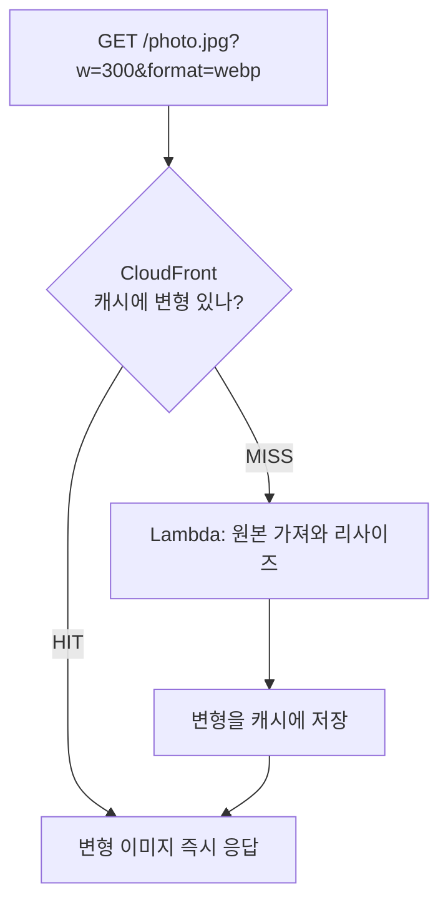
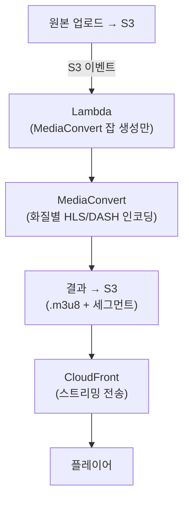

## 서론

[3편](/blog/cloudfront-cdn-guide-3)까지 정적·동적 콘텐츠를 CloudFront로 캐싱·보호·모니터링하는 법을 다뤘다. 그런데 실서비스엔 한 가지가 더 있다 — <strong>미디어</strong>. 사용자가 올린 이미지를 화면 크기에 맞게 줄여 보내야 하고, 영상은 기기·네트워크에 맞는 화질로 변환해 끊김 없이 재생시켜야 한다.

이번 마지막 4편은 <strong>이미지 리사이징</strong>과 <strong>영상 트랜스코딩</strong>을 CloudFront 아키텍처 안에서 어떻게 푸는지 다룬다. 핵심은 "둘은 이름만 변환이지 무게가 정반대"라는 점이다.

- 1편 — [CDN과 CloudFront 동작 원리](/blog/cloudfront-cdn-guide-1)
- 2편 — [Spring Boot + Kotlin 오리진을 CloudFront로](/blog/cloudfront-cdn-guide-2)
- 3편 — [사설 콘텐츠·엣지 로직·보안·모니터링](/blog/cloudfront-cdn-guide-3)
- <strong>4편 — 이미지 리사이징과 영상 트랜스코딩 (이 글)</strong>

---

## TL;DR

- <strong>두 변환은 무게가 정반대다</strong> — 이미지 리사이징은 가볍다(밀리초). 영상 변환은 무겁다(분 단위). 그래서 처리 방식도 정반대다.
- <strong>이미지는 온디맨드 변환 후 캐싱</strong> — 요청이 올 때 한 번 변환하고 그 결과를 CloudFront가 캐싱한다. Lambda@Edge나 S3 Object Lambda로 처리한다.
- <strong>변형은 쿼리스트링으로, 단 허용 목록만</strong> — `?w=300` 같은 파라미터를 캐시 키에 넣어 크기별로 캐싱하되, 허용한 값만 받는다(무한 변형 폭증 방지).
- <strong>영상은 전용 서비스로 미리 변환</strong> — Lambda로 직접 트랜스코딩하지 않는다. 업로드 시 MediaConvert가 여러 화질의 스트리밍 포맷으로 변환해 S3에 저장한다. Lambda는 잡을 트리거만.
- <strong>영상도 전송은 CloudFront</strong> — 변환 결과(스트리밍 조각)는 S3의 정적 파일이라 CloudFront로 캐싱·전송한다. 대용량이라 오히려 CDN 효과가 더 크다.

---

## 1. 두 변환은 무게가 다르다

미디어 변환을 설계할 때 가장 먼저 할 일은 "이게 가벼운 작업인가, 무거운 작업인가"를 가르는 것이다.

| 기준 | 이미지 리사이징 | 영상 트랜스코딩 |
|------|------|------|
| 소요 시간 | 밀리초~수백 ms | 수십 초~수 분 |
| 처리 시점 | 요청 시 동기 변환 | 업로드 시 사전 비동기 변환 |
| 실행 수단 | Lambda@Edge / S3 Object Lambda | MediaConvert (Lambda는 트리거만) |
| 결과 | 변형 이미지 1개 | 화질별 스트리밍 조각 여러 개 |
| CloudFront | 변형을 쿼리스트링 키로 캐싱 | 스트리밍 조각을 정적 캐싱 |

이 표가 4편 전체의 요약이다. 이미지는 "그때그때 만들고 캐싱", 영상은 "미리 다 만들어두고 전송"이다.

---

## 2. 이미지 리사이징 — 온디맨드 변환 후 캐싱

### 2.1 원칙: 첫 요청에만 변환, 변형을 캐싱

원본 하나(`photo.jpg`)를 두고, `?w=300&format=webp` 요청이 오면 그때 변환한다. <strong>매번 변환하면 안 된다.</strong> 첫 요청(miss)에만 변환하고, 그 변형을 CloudFront가 캐싱해 이후 요청(hit)은 변환 없이 응답한다.



### 2.2 어떤 수단으로 변환하나

| 방법 | 특징 |
|------|------|
| <strong>Lambda@Edge</strong> (origin-response) | CloudFront miss 시 S3 원본을 가져와 `sharp`로 변환 후 반환. 가장 흔한 패턴. 생성 응답 크기 제한(~1MB)·콜드스타트 주의 |
| <strong>S3 Object Lambda</strong> | S3 GetObject를 가로채 변환. 큰 출력에 더 견고 |
| <strong>Serverless Image Handler</strong> | AWS 공식 솔루션(CloudFront+Lambda+sharp). thumbor 스타일 URL 지원, 바로 배포 |
| <strong>3rd-party</strong> | Cloudinary·imgix — 직접 운영하지 않음 |

> <strong>참고</strong>: Spring Boot 앱에서 직접 리사이즈하는 건 비추다. 앱 부하가 커지고, 변형마다 앱을 거치면 엣지 캐싱 이점이 줄어든다. "변환 전용 함수 + CloudFront 캐싱"으로 분리하는 게 정석이다.

### 2.3 캐시 키에 쿼리스트링 — 단, 허용 목록만

크기·포맷별로 다른 사본을 캐싱하려면 캐시 키에 쿼리스트링을 포함해야 한다. 하지만 <strong>아무 쿼리나 받으면 안 된다.</strong> `?w=1`, `?w=2`, … 무한히 다른 변형을 만들어 캐시가 폭증하고, 공격자가 캐시를 오염시킬 수 있다(캐시 폭증 공격). 반드시 <strong>허용한 파라미터만</strong> 키에 넣는다.

```hcl
resource "aws_cloudfront_cache_policy" "image" {
  name        = "image-resize"
  default_ttl = 86400
  max_ttl     = 31536000
  min_ttl     = 0

  parameters_in_cache_key_and_forwarded_to_origin {
    enable_accept_encoding_gzip   = true
    enable_accept_encoding_brotli = true

    query_strings_config {
      query_string_behavior = "whitelist"
      query_strings {
        items = ["w", "h", "format", "q"]   # 허용한 변형 파라미터만
      }
    }
    cookies_config  { cookie_behavior  = "none" }
    headers_config  { header_behavior  = "none" }
  }
}
```

추가로 앱·람다 쪽에서 `w`/`h`/`q` 값의 범위와 `format`의 종류를 검증해, 허용 외 값은 거부하거나 기본값으로 정규화한다.

### 2.4 Lambda@Edge 리사이즈 예시 (개념)

```javascript
// origin-response Lambda@Edge — sharp로 리사이즈
const sharp = require('sharp');

exports.handler = async (event) => {
  const response = event.Records[0].cf.response;
  const request = event.Records[0].cf.request;
  const params = new URLSearchParams(request.querystring);
  const width = parseInt(params.get('w') || '0', 10);

  // 허용 범위 밖이면 원본 그대로
  if (!width || width > 2000) return response;

  // (S3에서 가져온 원본 바이트를 리사이즈 — 실제 구현은 원본 fetch 포함)
  const resized = await sharp(originalBuffer)
    .resize({ width })
    .webp({ quality: 80 })
    .toBuffer();

  response.body = resized.toString('base64');
  response.bodyEncoding = 'base64';
  response.headers['content-type'] = [{ key: 'Content-Type', value: 'image/webp' }];
  response.headers['cache-control'] = [{ key: 'Cache-Control', value: 'public, max-age=31536000, immutable' }];
  return response;
};
```

> <strong>주의</strong>: Lambda@Edge의 생성 응답 크기 제한(약 1MB) 때문에 큰 이미지엔 부적합할 수 있다. 그럴 땐 S3 Object Lambda나 리저널 Lambda(함수 URL)로 변환하고 CloudFront를 앞에 두는 구성이 더 견고하다.

---

## 3. 영상 트랜스코딩 — MediaConvert로 미리 변환

### 3.1 왜 Lambda로 직접 트랜스코딩하면 안 되나

영상 인코딩은 수십 초~수 분이 걸리고 CPU를 많이 쓴다. Lambda는 실행 시간·리소스 제한이 있어 실제 트랜스코딩 워크로드에 부적합하다(Lambda@Edge는 더더욱). 트랜스코딩은 <strong>전용 관리형 서비스</strong>가 맡고, Lambda는 "잡을 시작시키는" 오케스트레이션만 한다.

### 3.2 VOD 파이프라인 (녹화·업로드 영상)

<strong>AWS Elemental MediaConvert</strong>가 파일 기반 영상을 여러 화질(360p~1080p)의 스트리밍 포맷(HLS/DASH)으로 변환한다. 적응형 비트레이트(네트워크에 맞춰 화질 자동 전환)를 위해 여러 렌디션을 만든다.



Lambda는 S3 업로드 이벤트를 받아 MediaConvert 잡을 생성할 뿐이다(개념):

```javascript
// S3 업로드 트리거 → MediaConvert 잡 생성 (Lambda는 트랜스코딩 안 함)
const { MediaConvertClient, CreateJobCommand } = require('@aws-sdk/client-mediaconvert');

exports.handler = async (event) => {
  const key = event.Records[0].s3.object.key;
  const client = new MediaConvertClient({ endpoint: process.env.MC_ENDPOINT });

  await client.send(new CreateJobCommand({
    Role: process.env.MC_ROLE_ARN,
    Settings: {
      Inputs: [{ FileInput: `s3://uploads-bucket/${key}` }],
      OutputGroups: [/* HLS 그룹: 1080p/720p/480p 렌디션, 세그먼트 길이 등 */],
    },
  }));
};
```

MediaConvert 큐와 IAM 역할 정도만 Terraform으로 잡아두고, 실제 잡은 런타임에 SDK로 생성한다.

```hcl
resource "aws_media_convert_queue" "vod" {
  name = "vod-queue"
}
# + MediaConvert가 S3를 읽고 쓸 수 있는 IAM 역할(aws_iam_role)
```

### 3.3 라이브 스트리밍

라이브는 파이프라인이 다르다. <strong>MediaLive</strong>(실시간 인코딩) → <strong>MediaPackage</strong>(패키징·오리진) → CloudFront 순이다. 인코더가 보낸 라이브 신호를 MediaLive가 인코딩하고, MediaPackage가 HLS/DASH로 패키징해 CloudFront가 시청자에게 전송한다.

```text
인코더 → MediaLive(인코딩) → MediaPackage(패키징/오리진) → CloudFront → 시청자
```

---

## 4. CloudFront로 영상 서빙

트랜스코딩 결과물 — 플레이리스트(`.m3u8`)와 세그먼트(`.ts`/`.m4s`) — 는 결국 <strong>S3의 정적 파일</strong>이다. 그래서 1편의 정적 캐싱 원리가 그대로 적용된다. 다만 영상 특유의 캐싱 포인트가 있다.

### 4.1 세그먼트는 길게, 라이브 플레이리스트는 짧게

| 파일 | VOD | 라이브 |
|------|------|------|
| 세그먼트(`.ts`/`.m4s`) | 안 바뀜 → 길게 캐시 | 안 바뀜 → 길게 캐시 |
| 플레이리스트(`.m3u8`) | 안 바뀜 → 길게 캐시 | <strong>계속 갱신됨 → 짧게(수 초)</strong> |

라이브에서 플레이리스트를 길게 캐시하면 새 세그먼트가 안 보여 재생이 멈춘다. 라이브 `.m3u8`만 TTL을 수 초로 짧게 둔다.

```hcl
# 세그먼트: 길게 캐시
ordered_cache_behavior {
  path_pattern    = "*.ts"
  target_origin_id = "s3-media"
  viewer_protocol_policy = "redirect-to-https"
  allowed_methods = ["GET", "HEAD"]
  cached_methods  = ["GET", "HEAD"]
  cache_policy_id = data.aws_cloudfront_cache_policy.optimized.id
  compress        = false   # 영상은 이미 압축됨
}

# 라이브 플레이리스트: 짧게 캐시 (별도 짧은 TTL 정책)
ordered_cache_behavior {
  path_pattern     = "*.m3u8"
  target_origin_id = "s3-media"
  viewer_protocol_policy = "redirect-to-https"
  allowed_methods  = ["GET", "HEAD"]
  cached_methods   = ["GET", "HEAD"]
  cache_policy_id  = aws_cloudfront_cache_policy.short_playlist.id   # default_ttl 수 초
}
```

> <strong>참고</strong>: 영상 세그먼트는 이미 압축된 바이너리라 `compress`(gzip/brotli)는 꺼두는 게 맞다. 텍스트인 `.m3u8`은 켜도 된다.

### 4.2 영상도 전송은 CloudFront — 오히려 더 중요하다

영상은 트래픽이 크고 같은 세그먼트를 여러 시청자가 반복 요청한다. 그래서 엣지 캐싱 효과가 이미지보다 훨씬 크다.

- <strong>대용량·고대역폭</strong>: S3에서 직접 내려주면 비용·지연 폭증 → 엣지 캐싱으로 절감
- <strong>세그먼트 반복</strong>: 인기 영상의 같은 조각을 여러 시청자가 받음 → 적중률 높음
- <strong>글로벌 시청</strong>: 엣지 분산이 곧 재생 품질(버퍼링 감소)
- <strong>Range 요청</strong>: 플레이어가 구간 요청을 쓰며, S3 오리진은 기본 지원

### 4.3 사설 영상 — Signed Cookie

유료·회원 영상은 3편의 <strong>Signed URL/쿠키</strong>로 보호한다. HLS는 플레이리스트·세그먼트가 여러 파일이라 매 파일에 서명하는 Signed URL보다, <strong>경로 전체를 한 번에 인가하는 Signed Cookie</strong>가 편하다. "이 사용자는 `/premium/movie123/*` 경로를 1시간 동안 볼 수 있다"를 쿠키 하나로 처리한다.

---

## 5. 실무에서는 — 직접 구축 vs 관리형·사전 생성

지금까지 본 Lambda@Edge·MediaConvert는 <strong>"AWS로 직접 만드는"</strong> 방식이다. 하지만 실무에서 더 흔한 선택은 팀 규모·스택에 따라 다르며, <strong>4편 방식이 유일한 정답은 아니다.</strong>

<strong>이미지</strong>

| 접근 | 실무 빈도 | 적합한 경우 |
|------|------|------|
| 업로드 시 <strong>사전 생성</strong>(썸네일/중/대 고정 사이즈) | 매우 흔함 | 사이즈가 정해진 상품·아바타 |
| <strong>관리형</strong>(Cloudinary·imgix) | 흔함 | 직접 안 만들고 비용으로 해결 |
| <strong>프론트 내장</strong>(Next.js Image 등) | 요즘 흔함 | 프론트가 Next/Vercel |
| <strong>온디맨드 Lambda@Edge</strong>(2절) | 보통 | 동적 사이즈가 많고 AWS 직접 구축 |

사이즈가 몇 개로 고정이라면 온디맨드보다 <strong>사전 생성이 더 단순하고 흔하다</strong>.

<strong>영상</strong>

| 접근 | 실무 빈도 | 적합한 경우 |
|------|------|------|
| <strong>관리형 플랫폼</strong>(Mux·Cloudflare Stream·api.video) | 흔함 | 작은~중간 팀, 빠른 도입 |
| <strong>MediaConvert+S3+CloudFront 직접</strong>(3절) | 규모 크거나 AWS 올인 | 통제·비용·트래픽 규모가 큼 |
| <strong>YouTube/Vimeo 임베드</strong> | 비핵심 영상이면 흔함 | 영상이 제품 핵심이 아닐 때 |

영상은 직접 파이프라인이 손이 많이 가서, 작은 팀은 <strong>관리형(Mux·Cloudflare Stream)으로 시작</strong>하는 경우가 많다. MediaConvert 직접 구축은 규모·통제가 필요할 때의 선택이다.

> <strong>결론</strong>: parts 1~3(정적·동적 캐싱)은 거의 모든 서비스의 기본기지만, 미디어 변환은 <strong>"직접 만들기 vs 관리형·사전 생성"의 트레이드오프</strong>다. 작은 팀일수록 관리형(이미지=Cloudinary, 영상=Mux/Cloudflare Stream)으로 시작하고, 규모·통제·비용이 커질 때 직접 파이프라인으로 내재화하는 흐름이 흔하다. "무조건 Lambda@Edge/MediaConvert를 직접 짜야 한다"는 오해는 버리자.

---

## 정리 — 시리즈를 마치며

4편에 걸쳐 CloudFront를 개념부터 미디어 서빙까지 다뤘다.

| Part | 주제 | 핵심 |
|------|------|------|
| <strong>1편</strong> | 개념 | 엣지 캐시·캐시 키·Cache-Control/TTL·무효화 vs 버저닝 |
| <strong>2편</strong> | 실습 | Spring Boot+Kotlin 오리진 + Behavior 분리 + Terraform + X-Cache 검증 |
| <strong>3편</strong> | 운영 | 사설 콘텐츠·엣지 로직·보안(도메인·OAC·WAF)·모니터링 |
| <strong>4편</strong> | 미디어 | 이미지 리사이징(온디맨드+캐싱)·영상 트랜스코딩(MediaConvert)·HLS/DASH 서빙 |

미디어 서빙의 결론은 한 문장이다 — <strong>"가벼운 이미지는 그때그때 변환해 캐싱하고, 무거운 영상은 MediaConvert로 미리 변환해두되, 둘 다 전송은 CloudFront로 한다."</strong> 트랜스코딩 서비스(MediaConvert/MediaLive)와 전송 계층(CloudFront)을 분리해 생각하면 미디어 파이프라인이 명확해진다.

---

## 부록

### A. 의사결정 치트시트

| 상황 | 선택 |
|------|------|
| 이미지 크기·포맷 변형 | Lambda@Edge / S3 Object Lambda + 쿼리스트링 캐싱(허용 목록) |
| 큰 이미지 변환 | S3 Object Lambda / 리저널 Lambda (Lambda@Edge 크기 제한 회피) |
| 바로 쓰는 이미지 솔루션 | AWS Serverless Image Handler |
| 녹화 영상(VOD) 변환 | MediaConvert (Lambda는 트리거만) |
| 라이브 스트리밍 | MediaLive + MediaPackage |
| 영상 전송 | CloudFront (세그먼트 길게, 라이브 플레이리스트 짧게) |
| 사설 영상 보호 | Signed Cookie (경로 전체 인가) |

### B. 용어집

| 용어 | 설명 |
|------|------|
| 트랜스코딩 | 영상을 다른 코덱·해상도·비트레이트로 변환 |
| HLS/DASH | 영상을 작은 조각으로 나눠 전송하는 스트리밍 포맷 |
| 적응형 비트레이트(ABR) | 네트워크 상황에 따라 화질을 자동 전환 |
| 세그먼트 | 수 초 길이의 영상 조각(`.ts`/`.m4s`) |
| 플레이리스트(`.m3u8`) | 세그먼트 목록·순서를 담은 인덱스 파일 |
| MediaConvert | 파일 기반 영상 트랜스코딩 관리형 서비스(VOD) |
| MediaLive / MediaPackage | 라이브 인코딩 / 패키징 서비스 |
| S3 Object Lambda | S3 객체를 가져올 때 변환을 끼워넣는 기능 |

### C. 참고 자료

- [Serverless Image Handler (AWS Solution)](https://aws.amazon.com/solutions/implementations/serverless-image-handler/)
- [S3 Object Lambda](https://docs.aws.amazon.com/AmazonS3/latest/userguide/transforming-objects.html)
- [AWS Elemental MediaConvert](https://docs.aws.amazon.com/mediaconvert/latest/ug/what-is.html)
- [CloudFront로 영상 스트리밍 전송](https://docs.aws.amazon.com/AmazonCloudFront/latest/DeveloperGuide/on-demand-streaming-video.html)
