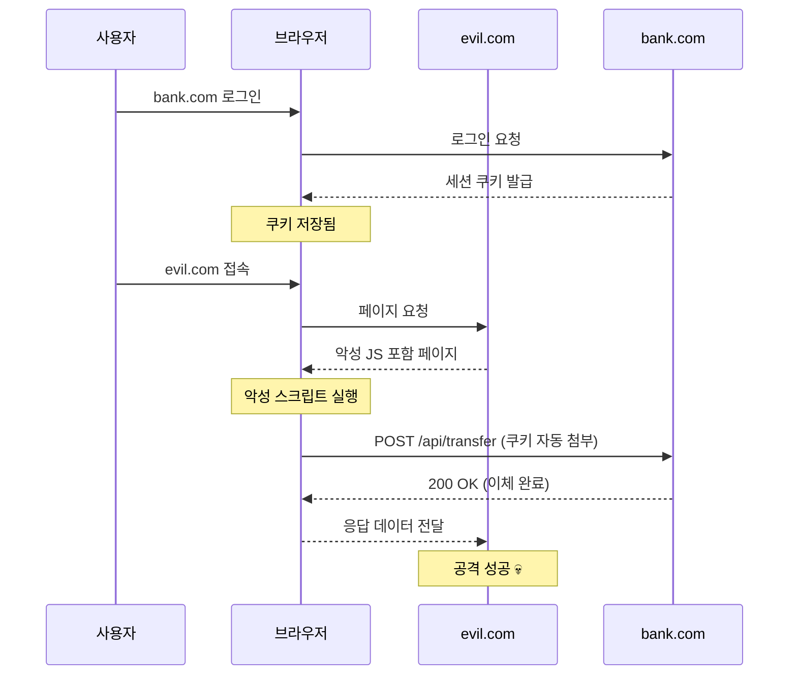
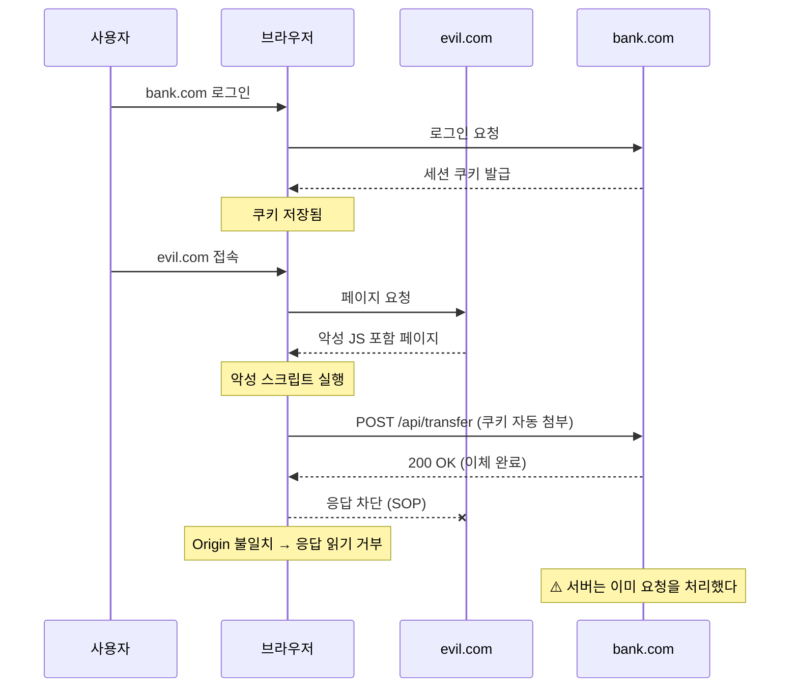
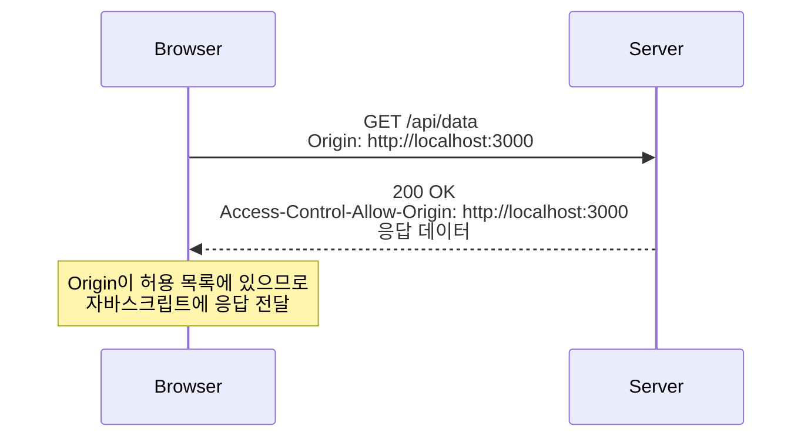
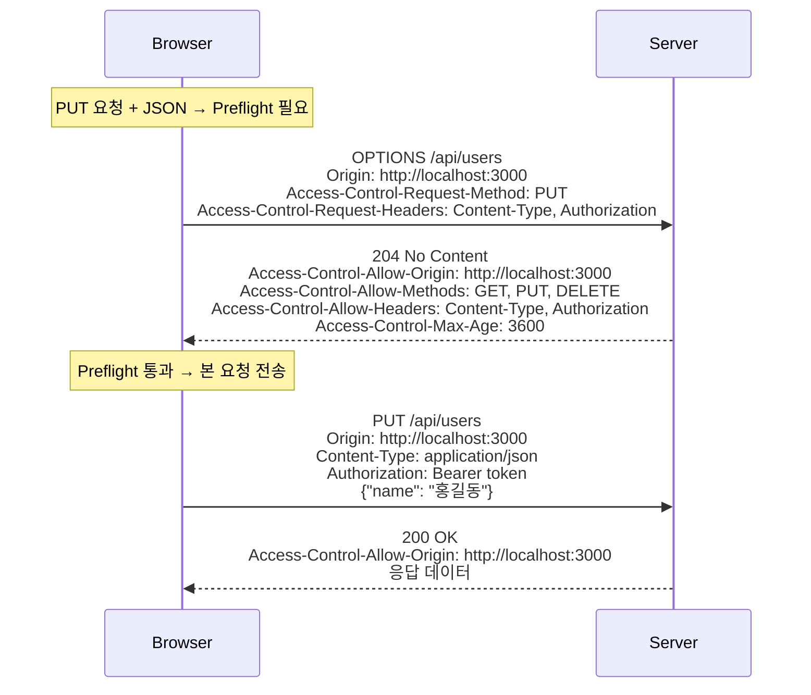
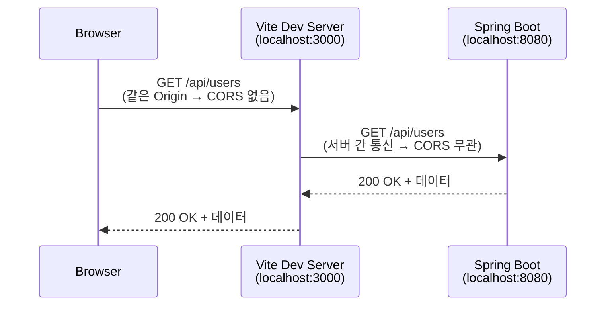

## 서론

프론트엔드와 백엔드를 분리해서 개발하다 보면, 거의 반드시 한 번은 만나게 되는 에러가 있다.

```
Access to fetch at 'http://localhost:8080/api/users' from origin 'http://localhost:3000'
has been blocked by CORS policy: No 'Access-Control-Allow-Origin' header is present
on the requested resource.
```

처음 이 에러를 만나면 당황스럽다. 분명 서버는 정상 동작하고, Postman으로 테스트하면 멀쩡하게 응답이 온다.
그런데 브라우저에서만 안 된다. 왜 그럴까?

이 글에서는 CORS가 무엇이고, 왜 존재하며, 어떻게 동작하는지를 차근차근 정리한다.
그리고 Spring Boot에서 실제로 CORS를 설정하는 방법까지 다룬다.

---

## 1. Origin이란?

CORS를 이해하려면 먼저 **Origin(출처)**이 뭔지 알아야 한다.

Origin은 URL에서 **Protocol + Host + Port**를 합친 것이다.

```
https://example.com:443/api/users?name=hong
└─┬──┘ └───┬──────┘└┬─┘└─────────┬────────┘
Protocol   Host    Port      Path + Query

Origin = https://example.com:443
```

### 같은 Origin vs 다른 Origin

| URL A | URL B | 같은 Origin? | 이유 |
|-------|-------|:---:|------|
| `http://example.com/a` | `http://example.com/b` | O | Path만 다르다 |
| `http://example.com` | `https://example.com` | X | Protocol이 다르다 |
| `http://example.com` | `http://api.example.com` | X | Host가 다르다 |
| `http://localhost:3000` | `http://localhost:8080` | X | Port가 다르다 |

마지막 예시가 바로 프론트엔드(3000)와 백엔드(8080) 개발 환경에서 CORS 에러가 발생하는 이유다.
localhost라는 같은 호스트인데도, **포트가 다르면 다른 Origin**이다.

---

## 2. Same-Origin Policy (SOP)

### 브라우저의 기본 보안 정책

**Same-Origin Policy(동일 출처 정책, SOP)**는 브라우저가 기본적으로 적용하는 보안 정책이다.
핵심 규칙은 단순하다: **다른 Origin으로의 요청에 대한 응답을 브라우저가 차단한다.**

여기서 중요한 포인트가 있다.

> **서버는 요청을 정상적으로 받고, 정상적으로 응답한다.**
> **브라우저가 그 응답을 자바스크립트에 전달하지 않는 것이다.**

이것이 바로 "Postman에서는 되는데 브라우저에서는 안 되는" 이유다.
Postman은 브라우저가 아니기 때문에 SOP를 적용하지 않는다.

### 왜 SOP가 필요한가?

SOP가 없다면 어떤 일이 벌어지는지 시나리오로 살펴보자.

#### SOP가 없는 세상 (공격 성공)



#### SOP가 있는 세상 (응답 읽기 차단)



여기서 중요한 점은, **SOP가 막는 건 "응답 읽기"이지 "요청 자체"가 아니라는 것**이다. 위 시나리오에서 이체 요청은 서버까지 도달하고, 서버는 정상 처리한다. SOP는 `evil.com`의 스크립트가 응답 데이터(잔액, 계좌 정보 등)를 **읽지 못하게** 막을 뿐이다.

그래서 SOP만으로는 이 공격을 완전히 막을 수 없다. **요청 자체를 차단하려면** 별도의 방어가 필요하다:

| 방어 메커니즘 | 역할 |
|--------------|------|
| **SOP** | 응답 읽기 차단 (데이터 탈취 방지) |
| **CSRF 토큰** | 서버가 위조된 요청인지 검증 (요청 자체 거부) |
| **SameSite 쿠키** | 다른 사이트에서의 요청 시 쿠키 자동 첨부 차단 |
| **Preflight (CORS)** | `PUT`/`DELETE` 등 위험한 메서드는 사전 허가 없이 보내지 않음 |

실제로 단순 요청 조건(`POST` + `application/x-www-form-urlencoded`)을 만족하면 Preflight 없이 서버까지 요청이 도달할 수 있다. 이것이 바로 CSRF 공격이 여전히 위험한 이유이며, 서버 측에서 CSRF 토큰 검증이 필요한 이유다.

> 참고: 위 시나리오는 CSRF(Cross-Site Request Forgery) 공격과도 연관된다. CSRF는 사용자가 인증된 상태를 악용해, 사용자 모르게 다른 사이트에서 위조된 요청을 보내는 공격이다. 예를 들어 로그인된 은행 사이트의 쿠키를 이용해 악성 사이트가 송금 요청을 대신 보내는 식이다. SOP는 응답 읽기를 차단해 공격 표면을 줄여주지만, 요청 자체는 나갈 수 있으므로 CSRF를 완전히 막지는 못한다. 이를 방어하려면 CSRF 토큰, SameSite 쿠키 등의 추가 대책이 필요하다.

> **"JWT를 쓰면 SOP/CORS와 상관없지 않나?"**
>
> 아니다. SOP와 CORS는 **인증 방식과 무관하게 동작**한다. 세션 쿠키든 JWT든, 브라우저에서 다른 Origin으로 요청을 보내면 동일하게 CORS 정책이 적용된다. 위 시나리오에서는 쿠키를 예로 들었지만, JWT를 `Authorization` 헤더로 전달하는 경우에도 SOP는 동일하게 응답을 차단한다.
>
> 다만 인증 방식에 따라 **CORS 설정에서 달라지는 점**이 있다:
>
> | | 세션 쿠키 | JWT (`Authorization` 헤더) |
> |--|----------|--------------------------|
> | 전송 방식 | 브라우저가 자동 첨부 | JS가 직접 헤더에 추가 |
> | `allowCredentials` | `true` 필요 | 불필요 (쿠키를 안 쓰므로) |
> | Preflight 발생 | 쿠키 자체로는 발생 안 함 | `Authorization`이 커스텀 헤더이므로 **항상 발생** |
> | `allowedHeaders` | 기본값으로 충분할 수 있음 | `Authorization` 포함 필요 |
>
> JWT를 쓰면 `Authorization` 헤더 때문에 GET 요청이라도 **무조건 Preflight가 발생**한다. 오히려 세션 쿠키보다 Preflight를 더 자주 만나게 된다.

> **"그러면 JWT를 쓰면 CSRF는 걱정 안 해도 되나?"**
>
> **JWT를 어디에 저장하고 어떻게 전달하느냐에 따라 다르다.** CSRF가 성립하려면 브라우저가 인증 정보를 **자동으로 첨부**해야 한다. 쿠키는 자동 첨부되지만, `Authorization` 헤더는 JS가 직접 넣어야 한다. `evil.com`의 스크립트는 SOP 때문에 `bank.com`의 `localStorage`에 접근할 수 없으므로, JWT를 가져올 방법이 없다.
>
> | 인증 방식 | CSRF 위험 | 이유 |
> |-----------|:---------:|------|
> | 세션 쿠키 | **있음** | 브라우저가 쿠키를 자동 첨부 |
> | JWT를 쿠키에 저장 | **있음** | 결국 쿠키이므로 자동 첨부됨 |
> | JWT를 `Authorization` 헤더로 전달 | **없음** | JS가 수동으로 추가, 다른 Origin에서 접근 불가 |
> | JWT를 `HttpOnly` 쿠키에 저장 | **있음** | 쿠키 자동 첨부 + JS에서 읽지도 못함 |
>
> 핵심은 JWT 자체가 아니라 **전달 방식**이다. JWT를 쿠키에 담으면 세션 쿠키와 동일하게 CSRF에 취약하고, `Authorization` 헤더로 보내면 CSRF 걱정이 없는 대신 XSS로 `localStorage`의 토큰이 탈취될 수 있다. 어떤 방식이든 트레이드오프가 있다.

### 왜 서버가 아니라 브라우저에서 차단하는가?

"서버에서 막으면 되지 않나?"라는 의문이 들 수 있다. 하지만 서버 측에서 처리할 수 없는 구조적인 이유가 있다.

**서버는 요청자를 구분할 수 없다.** HTTP 요청의 `Origin` 헤더는 브라우저가 붙이는 것이고, curl이나 Postman 같은 클라이언트는 아무 값이나 보낼 수 있다. 서버가 이를 기준으로 차단해봐야 우회가 너무 쉽다. 또한 유효한 쿠키가 달려 오면 서버 입장에선 정상 사용자의 요청과 악성 사이트가 보낸 요청을 구분할 방법이 없다.

반면 **브라우저는 유일한 신뢰 경계(trust boundary)**다. 브라우저는 어떤 탭(Origin)에서 어떤 스크립트가 실행됐고, 어디로 요청을 보냈는지 정확히 알고 있다. "이 스크립트는 `evil.com`에서 로드됐고, `bank.com`의 응답을 읽으려 한다" — 이 판단은 브라우저만 할 수 있다.

| | 서버 | 브라우저 |
|--|------|----------|
| 요청의 Origin 확인 | `Origin` 헤더에 의존 (위조 가능) | 실제 실행 컨텍스트를 정확히 안다 |
| 쿠키 자동 전송 제어 | 할 수 없음 | SameSite 등으로 제어 가능 |
| 응답 읽기 차단 | 할 수 없음 (이미 응답을 보냄) | JS에 응답 전달 여부를 결정 |

정리하면, 서버는 "허용할 Origin을 CORS 헤더로 선언"하는 역할이고, 그 선언을 보고 **실제로 차단을 집행하는 건 브라우저**다. 역할 분담인 셈이다.

---

## 3. CORS란?

**CORS(Cross-Origin Resource Sharing)**는 SOP의 예외를 안전하게 허용하는 메커니즘이다.

현실에서는 프론트엔드와 백엔드가 다른 Origin에서 동작하는 경우가 대부분이다.
SPA(Single Page Application)가 API 서버와 통신하려면 Cross-Origin 요청이 필수다.

CORS의 핵심 아이디어는 간단하다:

> **서버가 브라우저에게 "이 Origin에서 오는 요청은 허용해도 괜찮다"고 알려주는 것이다.**

서버가 응답 헤더에 허용할 Origin 정보를 담아서 보내면, 브라우저는 그 정보를 보고 응답을 자바스크립트에 전달할지 결정한다.

### 핵심 HTTP 헤더

**요청 헤더** (브라우저가 자동으로 추가):

| 헤더 | 설명 |
|------|------|
| `Origin` | 요청을 보내는 페이지의 Origin |

**응답 헤더** (서버가 설정):

| 헤더 | 설명 | 예시 |
|------|------|------|
| `Access-Control-Allow-Origin` | 허용할 Origin | `https://frontend.com` 또는 `*` |
| `Access-Control-Allow-Methods` | 허용할 HTTP 메서드 | `GET, POST, PUT, DELETE` |
| `Access-Control-Allow-Headers` | 허용할 요청 헤더 | `Content-Type, Authorization` |
| `Access-Control-Allow-Credentials` | 쿠키/인증 정보 허용 여부 | `true` |
| `Access-Control-Max-Age` | Preflight 결과 캐시 시간(초) | `3600` |

---

## 4. CORS 동작 방식

CORS 요청은 세 가지 유형으로 나뉜다.

### 4.1 Simple Request (단순 요청)

다음 조건을 **모두** 만족하면 단순 요청으로 분류된다:

- 메서드: `GET`, `HEAD`, `POST` 중 하나
- Content-Type: `application/x-www-form-urlencoded`, `multipart/form-data`, `text/plain` 중 하나
- 커스텀 헤더 없음 (Accept, Accept-Language, Content-Language 등 표준 헤더만 사용)

세 조건을 **모두** 만족해야 단순 요청이다. 하나라도 벗어나면 Preflight가 발생한다. 메서드별로 정리하면:

| 메서드 | 단순 요청 가능? | 조건 |
|--------|----------------|------|
| `GET`, `HEAD` | 가능 | 커스텀 헤더 없을 때만 |
| `POST` | 가능 | Content-Type이 위 3가지 + 커스텀 헤더 없을 때만 |
| `PUT`, `DELETE`, `PATCH` | **불가능** | 항상 Preflight |

즉, `PUT`/`DELETE`는 무조건 Preflight이고, `GET`이라도 `Authorization` 헤더를 붙이면 Preflight가 된다. 실무에서는 거의 모든 API가 `Authorization` 헤더나 `Content-Type: application/json`을 사용하기 때문에, **메서드와 무관하게 대부분 Preflight가 발생**한다.

단순 요청은 **Preflight 없이** 바로 서버로 전송된다. 서버의 응답에 포함된 `Access-Control-Allow-Origin`을 브라우저가 확인하고, 허용 여부를 결정한다.



만약 서버가 `Access-Control-Allow-Origin` 헤더를 포함하지 않거나, 요청의 Origin과 일치하지 않으면 브라우저가 응답을 차단한다.

### 4.2 Preflight Request (사전 요청)

단순 요청 조건을 하나라도 벗어나면 **Preflight 요청**이 먼저 발생한다.
실무에서는 대부분의 API 요청이 여기에 해당한다. `application/json`을 Content-Type으로 쓰거나, `Authorization` 헤더를 추가하거나, `PUT`/`DELETE` 메서드를 쓰면 전부 Preflight 대상이다.

브라우저는 본 요청을 보내기 전에, `OPTIONS` 메서드로 **"이 요청을 보내도 되는지"** 서버에 먼저 확인한다.



`Access-Control-Max-Age: 3600`은 Preflight 결과를 3600초(1시간) 동안 캐시하라는 의미다.
이 시간 동안 같은 URL에 대해 Preflight를 다시 보내지 않아 성능이 개선된다.

> **팁**: Preflight 캐싱을 설정하지 않으면, 매 요청마다 OPTIONS + 본 요청이 2번씩 나간다. API 호출이 많은 서비스라면 반드시 `Access-Control-Max-Age`를 설정하자.

### 4.3 Credentialed Request

쿠키나 `Authorization` 헤더 같은 인증 정보를 포함하는 요청이다.

클라이언트 측에서 명시적으로 **인증 정보를 포함하겠다고 설정**해야 하고, 서버도 이에 맞는 응답을 해야 한다.

**클라이언트 (fetch API)**:
```javascript
fetch('http://localhost:8080/api/users', {
  credentials: 'include'  // 쿠키를 포함하여 전송
})
```

**클라이언트 (axios)**:
```javascript
axios.get('http://localhost:8080/api/users', {
  withCredentials: true
})
```

**서버 응답에 필요한 조건**:
- `Access-Control-Allow-Credentials: true` 필수
- `Access-Control-Allow-Origin: *` 사용 불가 — **구체적인 Origin을 명시**해야 한다

```
// 이렇게 하면 안 된다
Access-Control-Allow-Origin: *
Access-Control-Allow-Credentials: true

// 이렇게 해야 한다
Access-Control-Allow-Origin: http://localhost:3000
Access-Control-Allow-Credentials: true
```

이 제약은 보안을 위한 것이다. 인증 정보가 포함된 요청인데 모든 Origin을 허용하면, 아까 살펴본 `evil.com` 시나리오가 그대로 가능해진다.

---

## 5. 실무에서 자주 만나는 CORS 에러 패턴

### 패턴 1: Access-Control-Allow-Origin 헤더 누락

```
Access to fetch at 'http://localhost:8080/api/users' from origin 'http://localhost:3000'
has been blocked by CORS policy: No 'Access-Control-Allow-Origin' header is present
on the requested resource.
```

**원인**: 서버에 CORS 설정 자체가 없다.

**해결**: 서버에 CORS 설정을 추가한다. Spring Boot라면 `@CrossOrigin` 어노테이션이나 `WebMvcConfigurer`로 설정한다 (6장에서 자세히 다룬다).

### 패턴 2: 와일드카드와 credentials 충돌

```
Access to fetch at 'http://localhost:8080/api/users' from origin 'http://localhost:3000'
has been blocked by CORS policy: The value of the 'Access-Control-Allow-Origin' header
in the response must not be the wildcard '*' when the request's credentials mode is 'include'.
```

**원인**: 서버가 `Access-Control-Allow-Origin: *`로 설정했는데, 클라이언트가 `credentials: 'include'`로 요청했다.

**해결**: 서버에서 `*` 대신 구체적인 Origin(`http://localhost:3000`)을 지정한다.

### 패턴 3: 허용되지 않은 헤더

```
Access to fetch at 'http://localhost:8080/api/users' from origin 'http://localhost:3000'
has been blocked by CORS policy: Request header field authorization is not allowed
by Access-Control-Allow-Headers in preflight response.
```

**원인**: Preflight 응답에서 `Authorization` 헤더를 허용하지 않았다.

**해결**: 서버의 CORS 설정에서 `Access-Control-Allow-Headers`에 `Authorization`을 추가한다.

### 패턴 4: 허용되지 않은 메서드

```
Access to fetch at 'http://localhost:8080/api/users' from origin 'http://localhost:3000'
has been blocked by CORS policy: Method DELETE is not allowed by
Access-Control-Allow-Methods in preflight response.
```

**원인**: Preflight 응답에서 `DELETE` 메서드를 허용하지 않았다.

**해결**: 서버의 CORS 설정에서 `Access-Control-Allow-Methods`에 `DELETE`를 추가한다.

> **디버깅 팁**: CORS 에러가 발생하면 브라우저 개발자 도구의 **네트워크 탭**을 확인하자. Preflight(OPTIONS) 요청과 그 응답 헤더를 직접 확인할 수 있다. 서버가 200을 응답했는데 브라우저에서 에러가 나면 십중팔구 CORS 헤더 문제다.

---

## 6. Spring Boot에서 CORS 설정

### 6.1 @CrossOrigin 어노테이션 (컨트롤러 단위)

가장 간단한 방법이다. 특정 컨트롤러나 메서드에 직접 어노테이션을 붙인다.

```kotlin
@RestController
@RequestMapping("/api/users")
@CrossOrigin(origins = ["http://localhost:3000"])
class UserController(
    private val userService: UserService
) {

    @GetMapping
    fun getUsers(): List<UserResponse> {
        return userService.findAll()
    }

    // 메서드 단위로도 적용 가능
    @CrossOrigin(origins = ["http://localhost:3000", "https://admin.example.com"])
    @DeleteMapping("/{id}")
    fun deleteUser(@PathVariable id: Long) {
        userService.delete(id)
    }
}
```

장점은 간단하다는 것이고, 단점은 **컨트롤러마다 반복해야 한다**는 것이다.
API가 많아지면 빠뜨리기 쉽고 유지보수도 불편하다. 대부분의 프로젝트에서는 글로벌 설정을 권장한다.

### 6.2 WebMvcConfigurer (글로벌 설정)

전체 애플리케이션에 일괄 적용하는 방법이다.

```kotlin
@Configuration
class WebConfig : WebMvcConfigurer {

    override fun addCorsMappings(registry: CorsRegistry) {
        registry.addMapping("/api/**")
            .allowedOrigins("http://localhost:3000")
            .allowedMethods("GET", "POST", "PUT", "DELETE", "PATCH")
            .allowedHeaders("*")
            .allowCredentials(true)
            .maxAge(3600)
    }
}
```

| 설정 | 설명 |
|------|------|
| `addMapping("/api/**")` | `/api/`로 시작하는 모든 경로에 CORS 적용 |
| `allowedOrigins(...)` | 허용할 Origin 목록 |
| `allowedMethods(...)` | 허용할 HTTP 메서드 |
| `allowedHeaders("*")` | 모든 요청 헤더 허용 |
| `allowCredentials(true)` | 쿠키/인증 정보 허용 |
| `maxAge(3600)` | Preflight 캐시 시간 1시간 |

> **Q: `allowedMethods`에 `OPTIONS`를 안 넣어도 되나?**
>
> 된다. Preflight(`OPTIONS`) 요청은 Spring의 CORS 처리 메커니즘(`CorsFilter` 또는 `DispatcherServlet`)이 자동으로 가로채서 응답한다. 컨트롤러까지 도달하지 않기 때문에, `allowedMethods`에 `OPTIONS`를 명시할 필요가 없다. `allowedMethods`는 **본 요청에서 허용할 메서드**를 선언하는 것이다.
>
> 단, 모든 `OPTIONS` 요청이 Preflight인 것은 아니다. Spring은 내부적으로 아래 **세 가지 조건을 모두 확인**해서 Preflight 여부를 판단한다.
>
> 1. HTTP 메서드가 `OPTIONS`
> 2. `Origin` 헤더 존재
> 3. `Access-Control-Request-Method` 헤더 존재
>
> 이 조건을 충족하지 않는 순수 `OPTIONS` 요청(예: API 디스커버리 용도)은 CorsFilter를 그대로 통과하고 컨트롤러까지 도달한다. 만약 컨트롤러에 `OPTIONS` 매핑이 없으면 `405 Method Not Allowed`가 응답될 수 있으니, 순수 `OPTIONS`를 지원해야 한다면 별도 핸들러를 만들어야 한다. 다만 실무에서 순수 `OPTIONS`를 쓰는 경우는 거의 없다.

> **참고: Spring Framework 7.0 (Spring Boot 4.0) 동작 변경**
>
> `WebMvcConfigurer`의 `addCorsMappings` API 자체는 Spring Boot 2.x → 3.x → 4.x 전 버전에서 변경 없이 동일하게 사용할 수 있다. 단, Spring Framework 7.0부터 한 가지 **동작 변경**이 있다: CORS 설정이 비어 있을 때 Preflight 요청을 **더 이상 거부하지 않는다.** 기존에는 CORS 미설정 상태에서 Preflight가 오면 자동으로 거부했지만, 7.0부터는 그대로 통과시킨다. CORS 미설정 상태에서의 Preflight 거부에 보안을 의존하고 있었다면 확인이 필요하다.

### 6.3 Spring Security와 함께 사용할 때 (실무 권장)

Spring Security를 쓰고 있다면, 위의 `WebMvcConfigurer` 설정만으로는 **CORS가 동작하지 않을 수 있다**.

이유는 Spring Security의 필터 체인이 `WebMvcConfigurer`보다 **먼저** 요청을 처리하기 때문이다.
Preflight(OPTIONS) 요청이 Spring Security에서 인증 실패로 거부되는 경우가 많다.

```kotlin
@Configuration
@EnableWebSecurity
class SecurityConfig {

    @Bean
    fun securityFilterChain(http: HttpSecurity): SecurityFilterChain {
        http {
            // Spring Security에서 CORS 활성화 — 이 설정이 반드시 필요하다
            cors { }

            csrf { disable() }

            authorizeHttpRequests {
                authorize("/api/public/**", permitAll)
                authorize(anyRequest, authenticated)
            }
        }
        return http.build()
    }

    // CorsConfigurationSource를 Bean으로 등록하면
    // Spring Security의 cors { }가 자동으로 이 설정을 사용한다
    @Bean
    fun corsConfigurationSource(): CorsConfigurationSource {
        val configuration = CorsConfiguration().apply {
            allowedOrigins = listOf("http://localhost:3000")
            allowedMethods = listOf("GET", "POST", "PUT", "DELETE", "PATCH")
            allowedHeaders = listOf("*")
            allowCredentials = true
            maxAge = 3600
        }

        return UrlBasedCorsConfigurationSource().apply {
            registerCorsConfiguration("/api/**", configuration)
        }
    }
}
```

**핵심**: `cors { }`를 Security 설정에 포함해야 Spring Security가 CORS Preflight 요청을 정상 처리한다. 이걸 빠뜨리면 OPTIONS 요청이 401/403으로 거부된다.

> **6.2와 6.3을 둘 다 설정해야 하나?**
>
> 아니다. Spring Security를 사용하는 프로젝트라면 **6.3만으로 충분하다.** `CorsConfigurationSource`를 `@Bean`으로 등록하면 Spring Security의 `CorsFilter`가 모든 CORS 처리를 담당하기 때문에, `WebMvcConfigurer`의 `addCorsMappings`는 중복 설정이 된다. 둘 다 설정하면 동작은 하지만, 같은 CORS 정책을 두 곳에서 관리하게 되어 설정 불일치 버그가 생길 수 있다.
>
> | 구성 | `WebMvcConfigurer` (6.2) | `CorsConfigurationSource` (6.3) |
> |------|:------------------------:|:-------------------------------:|
> | Spring Security **없음** | 이것만 사용 | - |
> | Spring Security **있음** | 불필요 (중복) | **이것만 사용** |

### 6.4 환경별 설정 (개발 vs 프로덕션)

개발 환경과 프로덕션 환경에서 허용할 Origin이 다른 게 일반적이다.
Spring의 Profile과 `application.yml`을 활용하면 깔끔하게 분리할 수 있다.

```yaml
# application.yml
app:
  cors:
    allowed-origins: ${CORS_ALLOWED_ORIGINS:http://localhost:3000}

---
# application-prod.yml
app:
  cors:
    allowed-origins: https://frontend.example.com,https://admin.example.com
```

```kotlin
@Configuration
class WebConfig(
    @Value("\${app.cors.allowed-origins}")
    private val allowedOrigins: String
) : WebMvcConfigurer {

    override fun addCorsMappings(registry: CorsRegistry) {
        registry.addMapping("/api/**")
            .allowedOrigins(*allowedOrigins.split(",").toTypedArray())
            .allowedMethods("GET", "POST", "PUT", "DELETE", "PATCH")
            .allowedHeaders("*")
            .allowCredentials(true)
            .maxAge(3600)
    }
}
```

> **주의: `Access-Control-Allow-Origin: *`의 위험성**
>
> 개발 편의를 위해 `allowedOrigins("*")`를 쓰는 경우가 있다. 개발 환경에서야 상관없지만, **프로덕션에서는 절대 사용하지 말자**. 모든 Origin을 허용한다는 것은 어떤 사이트에서든 우리 API에 접근할 수 있다는 뜻이다. 특히 인증이 필요한 API라면 심각한 보안 위험이 된다.

### 6.5 와일드카드 서브도메인 허용 (`allowedOriginPatterns`)

`https://app.example.com`, `https://admin.example.com` 등 여러 서브도메인을 허용해야 할 때, 하나씩 나열하는 대신 패턴을 쓸 수 있다.

CORS 스펙의 `Access-Control-Allow-Origin` 헤더 자체는 와일드카드 서브도메인을 지원하지 않는다 — 정확한 Origin(`https://app.example.com`) 또는 `*`만 가능하다. 하지만 **Spring은 `allowedOriginPatterns`로 서버 측 패턴 매칭을 지원**한다.

```kotlin
// WebMvcConfigurer 방식
registry.addMapping("/api/**")
    .allowedOriginPatterns("https://*.example.com")

// CorsConfigurationSource 방식
val configuration = CorsConfiguration().apply {
    allowedOriginPatterns = listOf("https://*.example.com")
}
```

동작 원리:
1. 브라우저가 `Origin: https://app.example.com` 헤더를 보낸다
2. Spring이 `https://*.example.com` 패턴과 매칭한다
3. 매칭되면 응답에 `Access-Control-Allow-Origin: https://app.example.com`을 **구체적인 값으로** 내려준다

> **주의: `allowedOrigins`와 `allowedOriginPatterns`는 다르다**
>
> | 메서드 | 패턴 지원 | `allowCredentials(true)` + `*` |
> |--------|:---------:|:------------------------------:|
> | `allowedOrigins("https://*.example.com")` | 리터럴로 취급 (동작 안 함) | 사용 불가 (`*`와 credentials 동시 불가) |
> | `allowedOriginPatterns("https://*.example.com")` | **패턴 매칭** | `allowedOriginPatterns("*")`로 가능 |
>
> `allowedOrigins`에 `*`를 넣으면 `allowCredentials(true)`와 함께 사용할 수 없지만, `allowedOriginPatterns("*")`는 가능하다. 이유는 패턴 매칭 시 응답에 실제 Origin 값을 구체적으로 내려주기 때문이다.

---

## 7. 프록시로 CORS 우회하기

CORS는 **브라우저의 정책**이다. 서버 간 통신에는 적용되지 않는다.
이 특성을 이용하면, **프록시 서버를 중간에 두어 같은 Origin으로 만들 수 있다**.

### 개발 환경: 프론트엔드 개발 서버 프록시

대부분의 프론트엔드 빌드 도구는 개발 서버에 프록시 기능을 내장하고 있다.

**Vite (vite.config.ts)**:
```typescript
export default defineConfig({
  server: {
    proxy: {
      '/api': {
        target: 'http://localhost:8080',
        changeOrigin: true
      }
    }
  }
})
```

**Next.js (next.config.js)**:
```javascript
module.exports = {
  async rewrites() {
    return [
      {
        source: '/api/:path*',
        destination: 'http://localhost:8080/api/:path*'
      }
    ]
  }
}
```

이렇게 설정하면, 프론트엔드 코드에서 `/api/users`로 요청하면 프론트엔드 개발 서버(`localhost:3000`)가 받아서 백엔드(`localhost:8080`)로 대신 전달한다. 브라우저 입장에서는 같은 Origin(`localhost:3000`)으로 요청하는 것이므로 CORS가 발생하지 않는다.



### 프로덕션 환경: Nginx 리버스 프록시

프로덕션에서는 Nginx 같은 리버스 프록시를 사용해서, 프론트엔드와 백엔드를 같은 도메인 아래에 배치하는 방법이 있다.

```nginx
server {
    listen 80;
    server_name example.com;

    # 프론트엔드 (SPA)
    location / {
        root /usr/share/nginx/html;
        try_files $uri $uri/ /index.html;
    }

    # 백엔드 API → 프록시
    location /api/ {
        proxy_pass http://backend:8080;
        proxy_set_header Host $host;
        proxy_set_header X-Real-IP $remote_addr;
    }
}
```

`example.com/api/*` 요청은 백엔드로 프록시되고, 나머지는 프론트엔드 정적 파일을 서빙한다.
브라우저 입장에서는 모두 `example.com`이라는 같은 Origin이므로 CORS 자체가 발생하지 않는다.

### 프록시 vs CORS 설정, 뭘 써야 할까?

| 구분 | 프록시 | CORS 설정 |
|------|--------|-----------|
| 개발 환경 | 프론트엔드 프록시로 간편하게 해결 | 서버 설정이 필요 |
| 프로덕션 | Nginx 등으로 같은 Origin 구성 가능 | 서버에서 허용 Origin 명시 |
| 적합한 경우 | 같은 도메인으로 통합 가능한 구조 | API를 여러 도메인에서 호출하는 경우 |

실무에서는 보통 **두 가지를 함께** 사용한다. 개발 환경에서는 프론트엔드 프록시로 편하게 개발하고, 프로덕션에서는 Nginx 프록시와 CORS 설정을 모두 적용한다 (프록시를 경유하지 않는 직접 호출이 있을 수 있으므로).

---

## 8. 흔한 실수와 주의사항

### `Access-Control-Allow-Origin: *` + `credentials: include` 조합 불가

앞서 4.3에서 다뤘지만, 가장 흔한 실수이므로 다시 한 번 강조한다.

```kotlin
// 이 조합은 동작하지 않는다
val configuration = CorsConfiguration().apply {
    allowedOrigins = listOf("*")       // 와일드카드
    allowCredentials = true             // credentials 허용
}
```

브라우저가 에러를 발생시킨다. `allowCredentials(true)`를 사용할 때는 반드시 구체적인 Origin을 지정해야 한다.

### Preflight 캐싱 미설정

`maxAge`를 설정하지 않으면, 브라우저는 매번 Preflight(OPTIONS) 요청을 보낸다.
API 호출이 많은 페이지에서는 요청 수가 2배로 늘어나 성능에 영향을 준다.

```kotlin
// maxAge를 반드시 설정하자
registry.addMapping("/api/**")
    .allowedOrigins("http://localhost:3000")
    .maxAge(3600)  // 1시간 동안 Preflight 캐시
```

### Spring Security에서 `.cors()` 빠뜨리기

`WebMvcConfigurer`로 CORS를 설정했는데 Spring Security를 사용 중이라면, Security 설정에서 `cors { }`를 추가하지 않으면 Preflight가 401/403으로 거부된다.

```kotlin
// Spring Security 설정에서 cors를 빼먹으면 안 된다
http {
    cors { }  // 이 한 줄이 없으면 CORS가 동작하지 않는다
    // ...
}
```

### 서버는 200인데 브라우저에서 에러

이 상황이 가장 혼란스럽다. 서버 로그에는 200 OK가 찍히는데 프론트엔드에서 에러가 난다.

**디버깅 순서**:
1. 브라우저 개발자 도구 → 네트워크 탭 열기
2. 실패한 요청 클릭 → 응답 헤더 확인
3. `Access-Control-Allow-Origin` 헤더가 있는지, 값이 올바른지 확인
4. Preflight(OPTIONS) 요청이 있다면, 그 응답도 함께 확인
5. Console 탭의 CORS 에러 메시지를 꼼꼼히 읽기 — 원인이 거기에 적혀있다

### 서버 측에서 CORS 설정 검증하기

CORS 에러는 브라우저가 응답 헤더를 검사해서 JS 전달을 차단하는 것이므로, **서버 로그에는 아무 에러도 남지 않는다.** 서버 입장에서는 정상 응답(200 OK)을 보낸 것이기 때문이다.

대신, 서버가 CORS 헤더를 제대로 내려주는지를 검증할 수 있다.

#### curl로 Preflight 시뮬레이션

```bash
# Preflight 요청 시뮬레이션
curl -v -X OPTIONS http://localhost:8080/api/users \
  -H "Origin: http://localhost:3000" \
  -H "Access-Control-Request-Method: PUT" \
  -H "Access-Control-Request-Headers: Authorization, Content-Type"
```

응답에서 확인할 것:
- `Access-Control-Allow-Origin`이 요청한 Origin과 일치하는지
- `Access-Control-Allow-Methods`에 원하는 메서드가 포함됐는지
- `Access-Control-Allow-Headers`에 원하는 헤더가 포함됐는지

```bash
# 단순 요청 시뮬레이션
curl -v http://localhost:8080/api/users \
  -H "Origin: http://localhost:3000"
```

`Access-Control-Allow-Origin` 헤더가 응답에 있는지 확인한다.

#### 통합 테스트로 자동화

배포 전에 CI에서 CORS 설정이 의도대로 동작하는지 자동으로 검증할 수 있다.

```kotlin
@SpringBootTest
@AutoConfigureMockMvc
class CorsTest {

    @Autowired
    lateinit var mockMvc: MockMvc

    @Test
    fun `preflight 요청에 CORS 헤더가 정상 응답된다`() {
        mockMvc.perform(
            options("/api/users")
                .header("Origin", "http://localhost:3000")
                .header("Access-Control-Request-Method", "PUT")
                .header("Access-Control-Request-Headers", "Authorization")
        )
            .andExpect(status().isOk)
            .andExpect(header().string("Access-Control-Allow-Origin", "http://localhost:3000"))
            .andExpect(header().string("Access-Control-Allow-Methods", containsString("PUT")))
    }

    @Test
    fun `허용하지 않은 Origin은 CORS 헤더가 없다`() {
        mockMvc.perform(
            options("/api/users")
                .header("Origin", "http://evil.com")
                .header("Access-Control-Request-Method", "GET")
        )
            .andExpect(header().doesNotExist("Access-Control-Allow-Origin"))
    }
}
```

---

## 정리

### 핵심 개념 요약

| 개념 | 설명 |
|------|------|
| **Origin** | Protocol + Host + Port. 셋 중 하나라도 다르면 다른 Origin이다 |
| **SOP** | 브라우저의 기본 보안 정책. 다른 Origin의 응답을 차단한다 |
| **CORS** | SOP의 예외를 허용하는 메커니즘. 서버가 허용할 Origin을 지정한다 |

### 요청 유형 비교

| 유형 | 조건 | Preflight | 주의사항 |
|------|------|:---------:|----------|
| **Simple Request** | GET/HEAD/POST + 표준 헤더 + 특정 Content-Type | 없음 | 실무에서는 거의 해당하지 않는다 |
| **Preflight Request** | 위 조건 외 (PUT, DELETE, custom header, JSON 등) | OPTIONS 먼저 | `maxAge`로 캐싱 권장 |
| **Credentialed Request** | 쿠키/인증 정보 포함 | 있음 | `*` 사용 불가, 구체적 Origin 필수 |

### Spring Boot 설정 방법

| 방법 | 적합한 경우 |
|------|-------------|
| `@CrossOrigin` | 특정 컨트롤러만 CORS 필요할 때 |
| `WebMvcConfigurer` | 전체 API에 일괄 적용할 때 |
| `CorsConfigurationSource` + Security `cors { }` | Spring Security 사용 시 (권장) |
| 환경별 설정 분리 | 개발/프로덕션 Origin이 다를 때 |

CORS 에러를 만났을 때 당황하지 않으려면, **"브라우저가 차단하는 것이지 서버 문제가 아니다"**라는 점을 항상 기억하자. 네트워크 탭을 열고, 응답 헤더를 확인하고, 에러 메시지를 읽으면 대부분의 문제는 금방 해결된다.
