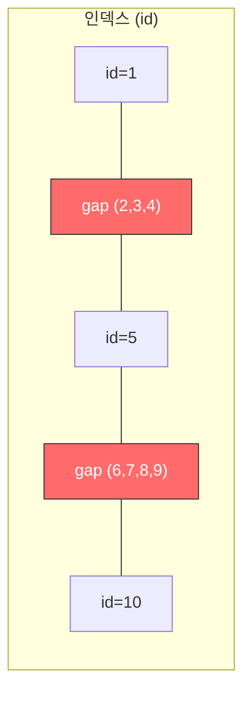
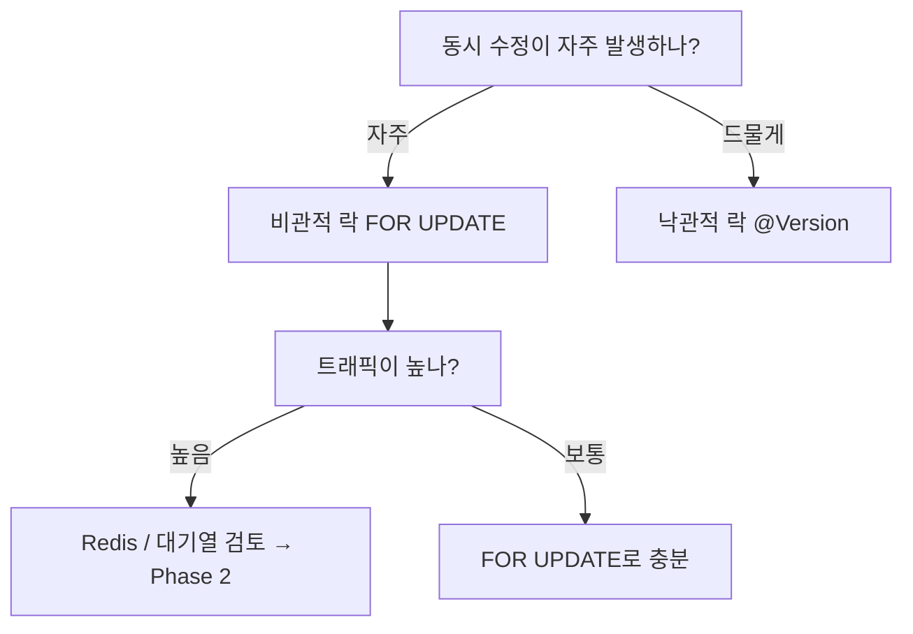

## 서론

[이전 글](/blog/db-isolation-level-guide)에서 격리 수준과 동시성 이상 현상을 다뤘다. 이번 글에서는 한 단계 더 들어가서 — **"그래서 실제로 데드락은 언제 발생하고, 어떻게 막아야 하나?"** 를 다룬다.

"격리 수준을 높이면 안전해지는 거 아니야?" — 반은 맞고 반은 틀리다. 격리 수준을 높이면 이상 현상은 줄어들지만, **락을 더 많이 잡기 때문에 데드락 위험은 오히려 증가**한다.

---

## 1. 데드락이란?

두 트랜잭션이 서로 상대방이 가진 락을 기다리면서 **영원히 진행하지 못하는 상태**다.

| 단계 | TX1 | TX2 | 상태 |
|:---:|------|------|:----:|
| 1 | `UPDATE ... WHERE id = 1` (id=1 락 획득) | | |
| 2 | | `UPDATE ... WHERE id = 2` (id=2 락 획득) | |
| 3 | `UPDATE ... WHERE id = 2` → id=2 락 대기 ⏳ | | |
| 4 | | `UPDATE ... WHERE id = 1` → id=1 락 대기 ⏳ | 💀 Deadlock! |

> **비유**: 좁은 골목에서 두 차가 마주보고 달리는 상황이다. 둘 다 "너 먼저 비켜"라고 하면서 아무도 움직이지 않는다. DB는 이걸 감지하면 **한쪽을 강제 롤백**시켜서 해결한다.

---

## 2. 격리 수준별 데드락 케이스

### 2.1 Read Committed에서의 데드락

Read Committed는 가장 느슨한 편인데도 데드락이 발생한다. 왜? **읽기 시 락을 안 걸 뿐, 쓰기(UPDATE/DELETE)는 여전히 행 락을 잡기 때문이다.**

#### 케이스 1: 교차 업데이트

가장 흔한 패턴이다. 송금 시스템에서 A→B, B→A 이체가 동시에 일어나는 상황:

| 단계 | TX1 (A→B 이체) | TX2 (B→A 이체) | 상태 |
|:---:|-----------|-----------|:----:|
| 1 | `UPDATE balance WHERE id='A'` (A 락 획득) | | |
| 2 | | `UPDATE balance WHERE id='B'` (B 락 획득) | |
| 3 | `UPDATE balance WHERE id='B'` → B 락 대기 ⏳ | | |
| 4 | | `UPDATE balance WHERE id='A'` → A 락 대기 ⏳ | 💀 Deadlock! |

#### 케이스 2: FK 제약 조건으로 인한 암묵적 락

명시적으로 UPDATE하지 않아도 데드락이 발생할 수 있다. FK가 걸린 테이블에 INSERT하면 **부모 테이블에 공유 락**이 걸리기 때문이다:

```sql
-- orders 테이블에 user_id FK가 있다고 가정

-- TX1: 사용자 1의 주문 삽입 → users(id=1)에 공유 락
INSERT INTO orders (user_id, product_id) VALUES (1, 100);

-- TX2: 사용자 1의 정보 수정 → users(id=1)에 배타 락 필요
UPDATE users SET updated_at = now() WHERE id = 1;
-- → TX1의 공유 락과 충돌!
```

> FK가 많은 테이블에서 INSERT와 UPDATE가 동시에 빈번한 경우, 생각지 못한 데드락이 발생할 수 있다.

### 2.2 Repeatable Read에서의 데드락

Repeatable Read는 Read Committed보다 **더 많은 락을 더 오래 잡는다.** MySQL InnoDB에서는 **Gap Lock**이라는 추가 락이 발생해서 데드락 위험이 높아진다.

#### Gap Lock이란?

Gap Lock은 인덱스 레코드 **사이의 간격(gap)** 을 잠그는 락이다. Phantom Read를 방지하기 위해 InnoDB가 Repeatable Read에서 사용한다.

```sql
-- products 테이블: id = 1, 5, 10이 존재

-- TX1: id가 3~7 사이인 행을 조회 (FOR UPDATE)
SELECT * FROM products WHERE id BETWEEN 3 AND 7 FOR UPDATE;
-- → id 1~5 사이의 gap, id 5~10 사이의 gap 모두 잠금!
-- → id=3, 4, 6, 7에 INSERT 불가능
```



실제로 존재하지 않는 행(id=3, 4, 6, 7)까지 잠기기 때문에, **예상보다 넓은 범위가 잠겨서 데드락이 발생**한다.

#### 케이스: Gap Lock으로 인한 데드락

> products 테이블: id = 1, 5, 10이 존재

| 단계 | TX1 | TX2 | 상태 |
|:---:|------|------|:----:|
| 1 | `SELECT ... WHERE id = 3 FOR UPDATE` → id 1~5 gap 락 획득 | | |
| 2 | | `SELECT ... WHERE id = 7 FOR UPDATE` → id 5~10 gap 락 획득 | |
| 3 | `INSERT (id=8)` → id 5~10 gap 대기 ⏳ | | |
| 4 | | `INSERT (id=2)` → id 1~5 gap 대기 ⏳ | 💀 Deadlock! |

두 트랜잭션이 각각 다른 gap을 잠그고, 상대방의 gap에 INSERT하려다 데드락이 발생한다. **Read Committed에서는 Gap Lock이 없으므로 이 데드락은 발생하지 않는다.**

### 2.3 Serializable에서의 데드락

Serializable은 가장 엄격하고 **가장 데드락이 빈번한** 격리 수준이다.

#### MySQL: 모든 SELECT가 FOR SHARE로 변환

```sql
-- Serializable에서는 이 쿼리가
SELECT balance FROM accounts WHERE id = 1;

-- 내부적으로 이렇게 변환된다
SELECT balance FROM accounts WHERE id = 1 FOR SHARE;
```

읽기만 해도 **공유 락**을 잡기 때문에, 이후 UPDATE 시 배타 락으로 업그레이드할 때 충돌이 빈번하다:

| 단계 | TX1 | TX2 | 상태 |
|:---:|------|------|:----:|
| 1 | `SELECT balance WHERE id=1` (공유 락 획득) | | |
| 2 | | `SELECT balance WHERE id=1` (공유 락 획득) | |
| 3 | `UPDATE balance WHERE id=1` → 배타 락 필요, TX2 공유 락 대기 ⏳ | | |
| 4 | | `UPDATE balance WHERE id=1` → 배타 락 필요, TX1 공유 락 대기 ⏳ | 💀 Deadlock! |

읽기-쓰기 패턴만으로도 데드락이 발생한다. **Serializable에서는 동시성이 극도로 낮아진다.**

#### PostgreSQL: SSI는 다르다

PostgreSQL의 Serializable은 SSI(Serializable Snapshot Isolation)로 구현되어 있다. 락 기반이 아니라 **충돌 감지 기반**이라서 데드락은 적지만, 대신 **직렬화 실패(serialization failure)** 가 발생한다:

```
ERROR: could not serialize access due to concurrent update
```

데드락은 아니지만 한쪽 트랜잭션이 롤백되므로, 재시도 로직이 반드시 필요하다.

---

## 3. 비관적 락 vs 낙관적 락

데드락과 동시성을 다루는 두 가지 철학이 있다.

### 3.1 비관적 락 (Pessimistic Lock)

**"충돌이 발생할 거라고 가정하고, 미리 잠근다."**

```sql
BEGIN;
SELECT * FROM products WHERE id = 1 FOR UPDATE;  -- 먼저 잠금!
-- 다른 트랜잭션은 이 행을 읽지도 수정하지도 못함
UPDATE products SET stock = stock - 1 WHERE id = 1;
COMMIT;
```

```java
// Spring Boot
@Lock(LockModeType.PESSIMISTIC_WRITE)
@Query("SELECT p FROM Product p WHERE p.id = :id")
Product findByIdForUpdate(@Param("id") Long id);
```

| 장점 | 단점 |
|------|------|
| 충돌 시 데이터 정합성 확실 | 동시성 낮음 (락 대기) |
| 구현이 단순 | 데드락 위험 |
| | 커넥션 점유 시간 증가 |

**적합한 경우**: 충돌이 자주 발생하는 경우 (재고 차감, 좌석 선택)

### 3.2 낙관적 락 (Optimistic Lock)

**"충돌이 드물다고 가정하고, 일단 진행한 뒤 충돌을 감지한다."**

테이블에 `version` 컬럼을 추가하고, UPDATE 시 버전이 변경되었는지 확인한다:

```sql
-- 1. 읽기 (락 없음)
SELECT id, stock, version FROM products WHERE id = 1;
-- → stock=10, version=3

-- 2. 수정 시도 (version 확인)
UPDATE products
SET stock = 9, version = 4
WHERE id = 1 AND version = 3;
-- → 영향받은 행이 0이면? 다른 트랜잭션이 먼저 수정한 것 → 재시도
```

```java
// Spring Boot - @Version 애노테이션
@Entity
public class Product {
    @Id
    private Long id;
    private int stock;

    @Version
    private Long version;  // JPA가 자동으로 관리
}
```

```java
// 재시도 로직
@Retryable(value = OptimisticLockingFailureException.class, maxAttempts = 3)
@Transactional
public void deductStock(Long productId) {
    Product product = productRepository.findById(productId).orElseThrow();
    if (product.getStock() <= 0) throw new SoldOutException();
    product.decreaseStock();
    // COMMIT 시 version 불일치하면 OptimisticLockingFailureException 발생 → 재시도
}
```

| 장점 | 단점 |
|------|------|
| 락을 안 잡아서 동시성 높음 | 충돌 시 재시도 비용 |
| 데드락 없음 | 충돌이 잦으면 재시도 폭발 |
| 커넥션 점유 짧음 | 재시도 로직 구현 필요 |

**적합한 경우**: 충돌이 드문 경우 (게시글 수정, 설정 변경)

### 3.3 어떤 걸 써야 하나?



| 상황 | 추천 |
|------|------|
| 재고 차감, 좌석 선택 | 비관적 락 (`FOR UPDATE`) |
| 게시글 수정, 프로필 업데이트 | 낙관적 락 (`@Version`) |
| 초당 수천 건 이상 동시 접근 | Redis (다음 시리즈) |

---

## 4. 데드락 방지 전략

### 4.1 락 순서 통일

데드락의 근본 원인은 **다른 순서로 락을 잡는 것**이다. 항상 같은 순서로 잠그면 교차가 발생하지 않는다.

```java
// 나쁜 예: 순서가 보장되지 않음
public void transfer(Long fromId, Long toId, int amount) {
    Account from = accountRepo.findByIdForUpdate(fromId);  // fromId 락
    Account to = accountRepo.findByIdForUpdate(toId);      // toId 락
}

// 좋은 예: ID 오름차순으로 항상 정렬
public void transfer(Long fromId, Long toId, int amount) {
    Long firstId = Math.min(fromId, toId);
    Long secondId = Math.max(fromId, toId);

    Account first = accountRepo.findByIdForUpdate(firstId);   // 항상 작은 ID 먼저
    Account second = accountRepo.findByIdForUpdate(secondId);  // 항상 큰 ID 나중에

    // 이후 from/to 판별해서 이체 로직 수행
}
```

### 4.2 락 타임아웃 설정

영원히 기다리지 않도록 타임아웃을 건다.

```sql
-- MySQL: 5초 후 락 대기 포기
SET innodb_lock_wait_timeout = 5;

-- PostgreSQL: 5초 후 포기
SET lock_timeout = '5s';
```

```java
// Spring Boot에서 JPA 힌트로 설정
@QueryHints(@QueryHint(name = "jakarta.persistence.lock.timeout", value = "5000"))
@Lock(LockModeType.PESSIMISTIC_WRITE)
@Query("SELECT p FROM Product p WHERE p.id = :id")
Product findByIdForUpdate(@Param("id") Long id);
```

### 4.3 재시도 로직

데드락은 완전히 막을 수 없다. DB가 데드락을 감지하면 한쪽을 롤백하는데, **롤백된 쪽이 재시도**하면 된다.

```java
@Retryable(
    value = {DeadlockLoserDataAccessException.class, CannotAcquireLockException.class},
    maxAttempts = 3,
    backoff = @Backoff(delay = 100, multiplier = 2)  // 100ms, 200ms, 400ms
)
@Transactional
public void deductStock(Long productId) {
    Product product = productRepository.findByIdForUpdate(productId);
    if (product.getStock() <= 0) throw new SoldOutException();
    product.decreaseStock();
}
```

> **주의**: `@Retryable`은 `@Transactional`보다 바깥에 있어야 한다. 트랜잭션이 롤백된 후 새 트랜잭션으로 재시도해야 하기 때문이다. 같은 클래스 내 호출이면 프록시 문제로 동작하지 않을 수 있다.

### 4.4 트랜잭션을 짧게

락 보유 시간이 길수록 데드락 확률이 올라간다. 트랜잭션 안에서 **외부 API 호출, 파일 I/O, 무거운 연산**을 하지 않는다.

```java
// 나쁜 예: 트랜잭션 안에서 외부 API 호출
@Transactional
public void processOrder(Long productId) {
    Product p = productRepo.findByIdForUpdate(productId);  // 락 획득
    p.decreaseStock();
    externalPaymentApi.charge(order);  // 💀 외부 API가 3초 걸리면 락도 3초 유지
    emailService.sendConfirmation(order);  // 💀 추가 지연
}

// 좋은 예: 트랜잭션은 DB 작업만
@Transactional
public void deductStock(Long productId) {
    Product p = productRepo.findByIdForUpdate(productId);
    p.decreaseStock();
}

// 외부 호출은 트랜잭션 밖에서
public void processOrder(Long productId) {
    deductStock(productId);  // 트랜잭션 짧게
    externalPaymentApi.charge(order);  // 락 해제된 후
    emailService.sendConfirmation(order);
}
```

---

## 5. REPEATABLE READ만으로 재고 차감이 안전한가?

1편에서 다룬 질문을 여기서 명확히 답한다.

### 답: 안전하지 않다 (MySQL 기준)

Repeatable Read는 **"읽은 값이 바뀌지 않는다"** 는 보장이지, **"동시에 수정하는 걸 막아준다"** 는 보장이 아니다.

| 단계 | TX1 (주문 A) | TX2 (주문 B) | 재고 |
|:---:|-----------|-----------|:----:|
| 1 | `SELECT stock` → **1** (스냅샷) | | 1 |
| 2 | | `SELECT stock` → **1** (스냅샷) | 1 |
| 3 | `UPDATE stock = 0` (1-1) | | 0 |
| 4 | `COMMIT` | | 0 |
| 5 | | `UPDATE stock = -1` (1로 알고 있으므로 1-1) 💀 | -1 |
| 6 | | `COMMIT` | -1 |

재고가 음수! **Lost Update** 발생.

### FOR UPDATE를 추가하면 해결된다

| 단계 | TX1 (주문 A) | TX2 (주문 B) | 재고 |
|:---:|-----------|-----------|:----:|
| 1 | `SELECT stock FOR UPDATE` → **1** (행 락 획득) | | 1 |
| 2 | | `SELECT stock FOR UPDATE` → 락 대기 ⏳ | 1 |
| 3 | `UPDATE stock = 0` | | 0 |
| 4 | `COMMIT` (락 해제) | | 0 |
| 5 | | → **0** (최신 값!) → 품절 처리 | 0 |
| 6 | | `ROLLBACK` | 0 |

### 격리 수준은 중요하지 않다

`FOR UPDATE`를 쓰면 **Read Committed에서도 Repeatable Read에서도 동일하게 동작**한다. 락이 핵심이지 격리 수준이 핵심이 아니다.

```java
// 이 두 코드의 재고 차감 동작은 사실상 동일
@Transactional(isolation = Isolation.READ_COMMITTED)
public void deductStock(Long id) {
    Product p = repo.findByIdForUpdate(id);  // FOR UPDATE가 핵심
    if (p.getStock() <= 0) throw new SoldOutException();
    p.decreaseStock();
}

@Transactional(isolation = Isolation.REPEATABLE_READ)
public void deductStock(Long id) {
    Product p = repo.findByIdForUpdate(id);  // 위와 동일하게 동작
    if (p.getStock() <= 0) throw new SoldOutException();
    p.decreaseStock();
}
```

**실무 권장: `Isolation.DEFAULT` + `FOR UPDATE`** — DB 기본값 그대로 두고 명시적 락으로 제어.

---

## 6. FOR UPDATE의 한계

FOR UPDATE는 재고 차감 문제를 해결하지만, **트래픽이 높아지면 3가지 병목**이 생긴다.

### 6.1 동시 요청 직렬화

```
동시 100명 → FOR UPDATE → 1명만 처리, 99명 대기 → 순서대로 1명씩

TPS 예시:
  트랜잭션 처리 시간 50ms × 100명 = 최대 5초 대기
  트랜잭션 처리 시간 200ms × 1000명 = 최대 200초 대기 💀
```

### 6.2 데드락 위험

하나의 주문에서 재고 차감 + 쿠폰 사용 + 포인트 차감을 한다면, 여러 행을 잠그게 되고 데드락 가능성이 높아진다.

### 6.3 DB 커넥션 풀 고갈

락 대기 중인 트랜잭션은 **DB 커넥션을 물고 있다.** 일반적으로 HikariCP 기본 풀 크기는 10개인데, 10개가 전부 락 대기 중이면 새로운 요청은 커넥션조차 얻지 못한다.

```
[요청 101] → 커넥션 풀 비어있음 → HikariCP timeout → 에러!
```

### 그래서 다음 단계가 필요하다

| 한계 | 대안 |
|------|------|
| 직렬화 병목 | Redis 원자 연산 (DECR) — 락 없이 초당 수만 건 처리 |
| 데드락 | Redis Lua 스크립트 — 단일 스레드로 원자적 실행 |
| 커넥션 고갈 | 대기열 시스템 — DB 접근 자체를 줄임 |

**이 내용이 다음 시리즈(Phase 2: 선착순 시스템 설계)의 출발점이 된다.**

---

## 정리

| 핵심 포인트 | 내용 |
|------------|------|
| **데드락은 모든 격리 수준에서 발생** | 쓰기 락은 격리 수준과 무관하게 존재 |
| **격리 수준이 높을수록 데드락 위험 증가** | Gap Lock (Repeatable Read), 공유 락 (Serializable) |
| **비관적 락 vs 낙관적 락** | 충돌 빈번 → 비관적 락, 충돌 드묾 → 낙관적 락 |
| **데드락 방지 4원칙** | 락 순서 통일, 타임아웃, 재시도, 트랜잭션 짧게 |
| **재고 차감의 핵심은 FOR UPDATE** | 격리 수준이 아니라 명시적 락이 안전성을 보장 |
| **FOR UPDATE의 한계** | 직렬화 병목, 데드락, 커넥션 고갈 → Redis/대기열 필요 |

다음 글부터는 **Phase 2: 선착순 시스템 설계** 시리즈로 넘어간다. DB 락의 한계를 넘어서 Redis, 메시지 큐, 토큰 발급 등 다양한 방식으로 선착순 시스템을 구현해본다.
