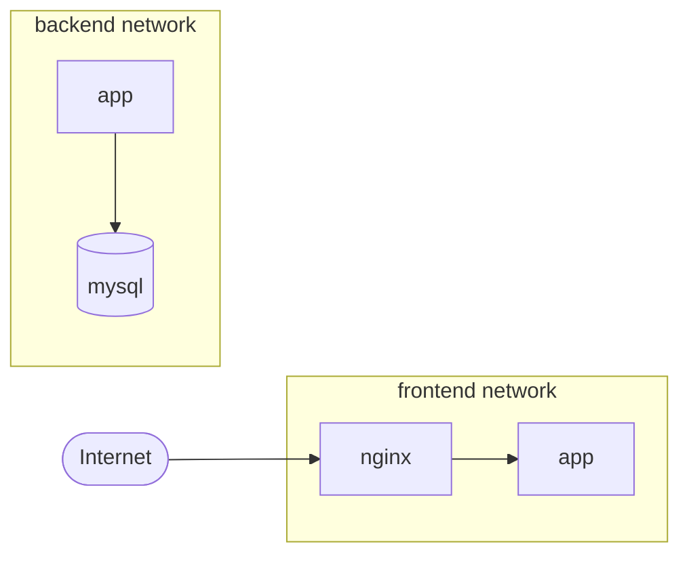
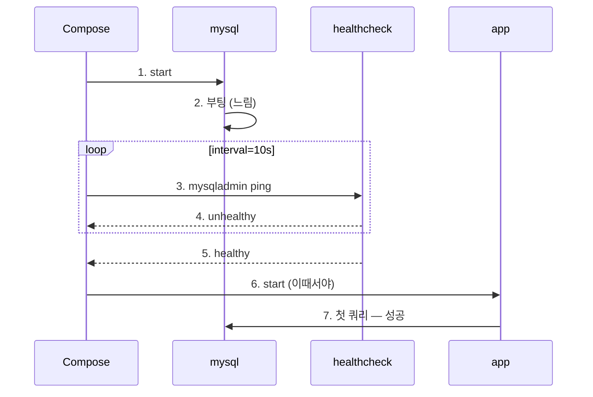

## 서론

"로컬에서 Spring Boot 띄우려면 MySQL부터 켜고, Redis도 켜고, 앱 빌드하고, 환경 변수 export하고…" — 이 과정이 결국 `start-local.sh`로 끝난다. 다음 사람한테 넘겨주면 또 디버깅이 시작된다.

Docker Compose는 그 `.sh`를 <strong>선언형 YAML</strong>로 바꿔주는 도구다. "어떤 컨테이너가 어떤 네트워크에 있고, 어떤 볼륨을 쓰고, 어떤 순서로 떠야 하는지"를 한 파일에 적어두면 `docker compose up -d` 한 줄로 끝난다.

이 글은 Compose를 처음 쓰는 주니어, 또는 "그냥 따라치기만 했지 services/networks/volumes가 정확히 뭔지는 모르겠다"는 사람을 대상으로 한다. 다 읽고 나면 <strong>왜 그렇게 써야 하는지</strong>, 그리고 흔히 빠지는 함정 — `depends_on`만 걸고 안심하다가 앱이 DB보다 먼저 죽는 식의 — 까지 함께 잡힌다.

---

## TL;DR

- <strong>Compose의 본질</strong>은 `docker run`의 줄세우기를 YAML 선언으로 바꾸고, 같은 프로젝트의 컨테이너들을 <strong>같은 네트워크/같은 라이프사이클</strong>로 묶는 것이다.
- <strong>`services` / `networks` / `volumes`</strong>가 최상위 키 3대장. 한 파일 안의 서비스는 자동으로 한 네트워크에 묶여 <strong>서비스명 = DNS</strong>로 서로를 찾는다.
- <strong>`depends_on`만 걸면 시작 순서만 보장된다.</strong> "DB가 쿼리 받을 준비가 됐다"는 보장이 아니다. `condition: service_healthy` + `healthcheck`를 함께 걸어야 진짜 의존성이 표현된다.
- <strong>dev와 prod를 한 파일로 욱여넣지 않는다.</strong> 베이스 + override(`-f` 합치기) 또는 `profiles`로 분리. 핫 리로드용 bind mount는 dev에만, 리소스 제한은 prod에만 둔다.
- <strong>실전 함정 4개</strong>: `.env` 깃 커밋, macOS bind mount의 I/O 비용, 무한히 커지는 컨테이너 로그, 그리고 `version: "3.8"`을 아직도 쓰는 것 — V2부터는 그 필드 자체가 무시된다.

---

## 1. Compose가 풀어주는 문제

### 1.1 `docker run` 줄세우기의 한계

같은 환경을 `docker run`만으로 띄우면 이런 모양이 된다.

```bash
docker network create app-net
docker volume create mysql-data

docker run -d --name mysql --network app-net \
  -e MYSQL_ROOT_PASSWORD=rootpw -e MYSQL_DATABASE=mydb \
  -v mysql-data:/var/lib/mysql mysql:8.0

docker run -d --name redis --network app-net redis:7-alpine

docker run -d --name app --network app-net -p 8080:8080 \
  -e SPRING_DATASOURCE_URL=jdbc:mysql://mysql:3306/mydb \
  -e SPRING_DATA_REDIS_HOST=redis myapp:latest
```

문제는 명령어가 길어서가 아니다. <strong>이 상태가 어디에 적혀있느냐</strong>가 문제다. 누가 어떤 순서로 무엇을 띄웠는지, 어떤 환경 변수를 줬는지가 셸 히스토리에만 남는다. 다음 사람은 처음부터 디버깅한다.

### 1.2 같은 그림을 Compose로

위 셋업을 Compose로 옮기면 이렇게 된다.

```yaml
services:
  mysql:
    image: mysql:8.0
    environment:
      MYSQL_ROOT_PASSWORD: rootpw
      MYSQL_DATABASE: mydb
    volumes:
      - mysql-data:/var/lib/mysql

  redis:
    image: redis:7-alpine

  app:
    image: myapp:latest
    ports: ["8080:8080"]
    environment:
      SPRING_DATASOURCE_URL: jdbc:mysql://mysql:3306/mydb
      SPRING_DATA_REDIS_HOST: redis
    depends_on: [mysql, redis]

volumes:
  mysql-data:
```

핵심은 5가지가 한꺼번에 일어난다는 점이다.

- <strong>네트워크 자동 생성</strong> — 같은 파일의 서비스들은 자동으로 한 네트워크에 묶인다. `docker network create` 불필요.
- <strong>서비스명 = DNS</strong> — `app` 컨테이너에서 `mysql:3306`으로 바로 접근. `--link`나 IP 하드코딩 없음.
- <strong>볼륨/네트워크 라이프사이클이 프로젝트 단위</strong> — `docker compose down`이면 전부 정리.
- <strong>선언이 곧 문서</strong> — `docker-compose.yml`만 보면 누구든 같은 환경을 띄울 수 있다.
- <strong>차이만 적는다(diff 친화)</strong> — Git에 올려두고 PR로 변경 이력을 남길 수 있다.

### 1.3 참고: Compose v1(`docker-compose`) vs v2(`docker compose`)

명령어 표기가 두 가지인 이유가 있다.

| 구분 | v1 | v2 |
| --- | --- | --- |
| 호출 | `docker-compose` (하이픈) | `docker compose` (공백) |
| 구현 | Python 별도 바이너리 | Docker CLI 플러그인 (Go) |
| 상태 | 2023년 EOL | 현재 표준 |
| `version:` 필드 | 의미 있음 | <strong>무시됨</strong> |

지금 새로 쓰는 글이라면 무조건 <strong>v2 기준</strong>이다. `version: "3.8"`은 v1 시절의 스키마 호환성 표식이고, v2는 무시한다. 인터넷 옛날 글을 따라치다가 `docker-compose: command not found`가 뜨면 그냥 공백 버전을 쓰면 된다.

---

## 2. services — 컨테이너 정의의 핵심

`services` 아래에 적힌 한 항목 = 한 컨테이너(또는 `replicas`만큼의 컨테이너 집합)다.

### 2.1 image vs build — 두 가지 출발점

| 방식 | 언제 쓰나 | 예 |
| --- | --- | --- |
| `image:` | 외부 이미지를 그대로 쓸 때 (DB, 캐시, 메시지 브로커 등) | `image: mysql:8.0` |
| `build:` | 이 프로젝트의 코드로 이미지를 만들어야 할 때 | `build: .` |
| 둘 다 | 빌드한 이미지를 특정 태그로 캐시하고 재사용 | `image: myapp:dev` + `build: .` |

```yaml
services:
  app:
    image: myapp:dev          # 빌드 결과물에 붙일 태그
    build:
      context: .              # Dockerfile이 있는 경로
      dockerfile: Dockerfile  # 기본값이라 보통 생략
      args:
        JAR_FILE: build/libs/*.jar
      target: runtime         # 멀티스테이지 빌드의 최종 stage
```

### 2.2 자주 쓰는 옵션 한눈에

| 옵션 | 역할 | 메모 |
| --- | --- | --- |
| `container_name` | 컨테이너 이름 고정 | 보통 안 쓰는 게 낫다. 같은 이름 충돌 → scale 불가 |
| `restart` | 종료 시 정책 | `no` / `always` / `on-failure` / `unless-stopped` |
| `ports` | 호스트:컨테이너 포트 매핑 | 외부에서 접근해야 할 때만 |
| `expose` | 같은 네트워크에만 포트 공개 | 호스트엔 매핑 안 함 |
| `environment` | 환경 변수 | 리스트/맵 둘 다 가능 (2.4절) |
| `env_file` | `.env` 파일에서 읽어오기 | 비밀값 분리에 유용 |
| `volumes` | 볼륨/마운트 | 3절 |
| `depends_on` | 시작 순서 / 헬스 게이트 | 5절 |
| `command` | CMD 덮어쓰기 | Dockerfile의 `CMD`를 교체 |
| `entrypoint` | ENTRYPOINT 덮어쓰기 | 디버깅용으로 자주 쓴다 |
| `healthcheck` | 헬스 판정 룰 | 5절 |

> <strong>참고</strong>: `container_name`은 한 호스트에 같은 이름이 두 개 못 산다는 제약을 만든다. `docker compose up --scale app=3`처럼 같은 서비스를 여러 개 띄우거나 같은 머신에서 두 환경을 동시에 돌릴 때 곧장 충돌이 난다. 디버깅 편의 외에는 빼두는 편이 안전하다.

### 2.3 환경 변수 4가지 방식

같은 변수를 넣는 방법이 여러 개라서 헷갈린다. 정리하면 4가지다.

```yaml
services:
  app:
    # 1) 인라인 맵 — 가장 명확
    environment:
      SPRING_PROFILES_ACTIVE: local
      DB_HOST: mysql

    # 2) 인라인 리스트 — 비슷하지만 = 표기
    # environment:
    #   - SPRING_PROFILES_ACTIVE=local
    #   - DB_HOST=mysql

    # 3) 파일 분리
    env_file:
      - .env
      - .env.local

    # 4) Compose 파일 안에서 변수 치환 (호스트 셸/.env 참조)
    image: myapp:${APP_VERSION:-latest}
    ports:
      - "${APP_PORT:-8080}:8080"
```

규칙 하나만 기억하면 된다. <strong>비밀값은 `.env` 또는 시크릿 매니저, 일반 설정은 `environment`</strong>. 4번의 `${VAR:-default}`는 <strong>Compose 파일이 파싱될 때</strong> 호스트 셸과 같은 디렉토리의 `.env`에서 채워지고, 1·2·3번은 <strong>컨테이너 안 환경 변수</strong>로 들어간다 — 헷갈리면 이 차이부터 잡고 시작.

### 2.4 참고: `environment`의 리스트 vs 맵

같은 결과를 만드는 두 표기 사이 차이가 한 줄 있다.

```yaml
# 리스트
environment:
  - DB_HOST=mysql
  - JAVA_TOOL_OPTIONS=-Xms256m -Xmx512m

# 맵
environment:
  DB_HOST: mysql
  JAVA_TOOL_OPTIONS: "-Xms256m -Xmx512m"
```

- <strong>맵 표기</strong>는 키와 값이 분리되어 있어 IDE 자동완성·정렬·diff가 깔끔하다.
- <strong>리스트 표기</strong>는 값에 `=`가 들어가도 문제 없고, `KEY` 한 줄로 호스트 셸 변수를 그대로 전달할 수도 있다 (예: `- HOME`).

기본은 맵, 특수 케이스에 리스트 — 이 정도 기준이면 충분하다.

---

## 3. volumes — 영속성과 마운트 모드

컨테이너는 죽으면 디스크가 사라진다. DB 데이터·로그·소스코드 핫리로드 등 "호스트나 다른 곳에 살아남아야 하는 데이터"는 볼륨으로 빼야 한다.

### 3.1 Named Volume vs Bind Mount

| 종류 | 어디에 산다 | 장점 | 단점 | 용도 |
| --- | --- | --- | --- | --- |
| Named Volume | Docker가 관리 (`/var/lib/docker/volumes/...`) | 이식성, 권한 자동 처리 | 호스트에서 직접 편집 불편 | DB 데이터 디렉터리 |
| Bind Mount | 호스트 임의 경로 | 호스트 파일을 그대로 봄 | OS별 권한·성능 이슈 | 소스코드 핫 리로드, 설정 파일 |

```yaml
services:
  mysql:
    image: mysql:8.0
    volumes:
      - mysql-data:/var/lib/mysql           # Named volume

  app:
    build: .
    volumes:
      - ./src:/app/src                      # Bind mount
      - ./config:/app/config:ro             # 읽기 전용

volumes:
  mysql-data:                               # Named volume 선언
```

### 3.2 Long Syntax — 옵션이 필요할 때

짧은 표기로 안 되는 옵션이 필요할 땐 long syntax를 쓴다.

```yaml
services:
  app:
    volumes:
      - type: volume
        source: mysql-data
        target: /var/lib/mysql
      - type: bind
        source: ./logs
        target: /app/logs
        read_only: false
        bind:
          create_host_path: true            # 호스트 경로 자동 생성
```

### 3.3 참고: macOS/Windows에서 bind mount가 느린 이유

macOS·Windows의 Docker Desktop은 컨테이너를 <strong>경량 VM 안</strong>에서 돌린다. 호스트의 `./src`는 그 VM 경계를 넘어가는 공유 파일시스템이고, 매 read/write가 호환 레이어를 거친다. `node_modules`처럼 작은 파일이 수만 개인 디렉토리는 이 비용이 그대로 빌드/기동 시간에 쌓인다.

대응 카드 3장:

- <strong>마운트 자체를 줄인다</strong> — 빌드 산출물이나 의존성 디렉토리는 named volume으로 빼고, 소스만 bind mount.
- <strong>`:cached` / `:delegated`</strong> — macOS 한정으로 일관성 보장을 약화시켜 성능을 챙기는 옵션. `read_only`라면 `:cached`가 가장 안전.
- <strong>VirtioFS / 가상화 백엔드 변경</strong> — Docker Desktop / Orbstack의 최신 백엔드는 그 자체로 큰 폭 개선이 있다.

```yaml
volumes:
  - ./src:/app/src:cached     # macOS에서 자주 쓰는 옵션
```

---

## 4. networks — 서비스 간 통신

### 4.1 기본 네트워크 — 따로 안 적어도 만들어진다

`networks:` 키 자체를 생략해도 Compose는 프로젝트 단위로 <strong>기본 bridge 네트워크</strong>를 하나 만들고 모든 서비스를 거기에 붙인다. 그래서 `app`에서 `mysql:3306`이 그냥 된다.

```yaml
services:
  app:
    image: myapp
  mysql:
    image: mysql:8.0
# networks 키 없어도 두 서비스는 같은 네트워크에 붙음
```

### 4.2 커스텀 네트워크로 격리

DMZ/내부망처럼 통신 범위를 나누고 싶을 때.



`app`은 양쪽에 다리를 걸치고, `nginx`는 frontend만, `mysql`은 backend만 본다.

```yaml
services:
  nginx:
    image: nginx
    networks: [frontend]

  app:
    image: myapp
    networks: [frontend, backend]

  mysql:
    image: mysql:8.0
    networks: [backend]

networks:
  frontend:
    driver: bridge
  backend:
    driver: bridge
```

### 4.3 외부 네트워크에 붙기

이미 다른 Compose 프로젝트가 만들어둔 네트워크에 합류하고 싶을 때.

```yaml
networks:
  shared-net:
    external: true     # 이 네트워크는 외부에서 이미 만들어졌다고 선언
```

`external: true`면 Compose는 그 네트워크를 만들지도, `down` 시 지우지도 않는다. 여러 Compose 프로젝트가 한 네트워크를 공유하는 패턴(예: 공용 Redis 한 대를 여러 앱이 붙어 쓰기)에 쓴다.

---

## 5. depends_on + healthcheck — 안정적인 시작 순서

여기가 Compose에서 가장 자주 헷갈리는 지점이다.

### 5.1 단순 `depends_on`은 "시작 순서"만 보장한다

```yaml
services:
  app:
    depends_on:
      - mysql
```

이 설정은 <strong>"`mysql` 컨테이너가 `start` 된 다음에 `app`을 `start`한다"</strong>까지만 보장한다. MySQL이 부팅을 마치고 쿼리를 받을 준비가 됐다는 보장은 없다. 그래서 앱이 먼저 떠서 `Connection refused`로 죽고 재시작 루프에 빠진다.

### 5.2 `condition: service_healthy` — 헬스 게이트

진짜로 "DB가 쿼리 받을 준비"를 기다리려면 헬스체크와 묶어야 한다.

```yaml
services:
  app:
    depends_on:
      mysql:
        condition: service_healthy
      redis:
        condition: service_started

  mysql:
    image: mysql:8.0
    healthcheck:
      test: ["CMD", "mysqladmin", "ping", "-h", "localhost"]
      interval: 10s
      timeout: 5s
      retries: 5
      start_period: 30s
```



`condition`에 들어갈 수 있는 값은 3가지.

| 값 | 의미 |
| --- | --- |
| `service_started` | 컨테이너가 `start`만 되면 OK (기본값과 같음) |
| `service_healthy` | `healthcheck`가 healthy로 판정될 때까지 대기 |
| `service_completed_successfully` | 일회성 작업 컨테이너가 정상 종료될 때까지 대기 (마이그레이션 러너 등) |

### 5.3 healthcheck 작성 요령

`healthcheck`의 4개 타이밍 파라미터는 의미가 다 다르다.

| 파라미터 | 의미 | 일반적인 값 |
| --- | --- | --- |
| `interval` | 검사 주기 | 10s |
| `timeout` | 한 번 검사할 때 허용 시간 | 5s |
| `retries` | 연속 실패 몇 번이면 unhealthy | 5 |
| `start_period` | 시작 직후 실패는 카운트하지 않는 유예 | 30s (DB는 더 길게) |

`start_period`를 빼먹는 사례가 흔한데, MySQL·Postgres 첫 부팅(초기화 스크립트 포함)이 30~60초 걸리는 일이 흔해서 이 값이 짧으면 멀쩡한 컨테이너가 unhealthy로 떨어진다.

### 5.4 참고: depends_on이 풀어주지 못하는 것 — 앱 레벨 재시도

`depends_on + healthcheck`도 만능은 아니다.

- <strong>운영 중 DB 재시작</strong>: 한 번 떠 있는 동안 DB가 잠깐 끊기면 `depends_on`은 다시 발동하지 않는다.
- <strong>분산 환경(Compose 밖)</strong>: 컨테이너가 다른 호스트에 살면 Compose는 그 의존성을 모른다.

그래서 운영 코드에는 항상 <strong>커넥션 풀의 retry / 백오프</strong>(HikariCP의 `connectionTimeout`, Lettuce의 reconnect, Spring `@Retryable` 등)를 같이 둔다. Compose의 헬스 게이트는 <strong>"기동 시점 한정"</strong>의 안전장치라고 보면 된다.

---

## 6. 실전 예시 — Spring Boot + MySQL + Redis

위 1~5절을 모두 합친 실제 사용 가능한 셋업이다.

<details>
<summary><strong>docker-compose.yml — 전체</strong></summary>

```yaml
services:
  app:
    image: myapp:dev
    build:
      context: .
      dockerfile: Dockerfile
    restart: unless-stopped
    ports:
      - "${APP_PORT:-8080}:8080"
    environment:
      SPRING_PROFILES_ACTIVE: local
      SPRING_DATASOURCE_URL: jdbc:mysql://mysql:3306/mydb?useSSL=false&allowPublicKeyRetrieval=true
      SPRING_DATASOURCE_USERNAME: ${DB_USER:-user}
      SPRING_DATASOURCE_PASSWORD: ${DB_PASSWORD:-password}
      SPRING_DATA_REDIS_HOST: redis
      SPRING_DATA_REDIS_PORT: 6379
    depends_on:
      mysql:
        condition: service_healthy
      redis:
        condition: service_started
    networks: [app-network]

  mysql:
    image: mysql:8.0
    restart: unless-stopped
    environment:
      MYSQL_ROOT_PASSWORD: ${DB_ROOT_PASSWORD:-rootpassword}
      MYSQL_DATABASE: mydb
      MYSQL_USER: ${DB_USER:-user}
      MYSQL_PASSWORD: ${DB_PASSWORD:-password}
      TZ: Asia/Seoul
    volumes:
      - mysql-data:/var/lib/mysql
      - ./init.sql:/docker-entrypoint-initdb.d/init.sql:ro
    healthcheck:
      test: ["CMD", "mysqladmin", "ping", "-h", "localhost"]
      interval: 10s
      timeout: 5s
      retries: 5
      start_period: 30s
    networks: [app-network]

  redis:
    image: redis:7-alpine
    restart: unless-stopped
    command: redis-server --appendonly yes
    volumes:
      - redis-data:/data
    networks: [app-network]

networks:
  app-network:
    driver: bridge

volumes:
  mysql-data:
  redis-data:
```

</details>

<details>
<summary><strong>Dockerfile — 멀티스테이지 빌드</strong></summary>

```dockerfile
FROM eclipse-temurin:17-jdk AS builder
WORKDIR /app
COPY gradlew .
COPY gradle gradle
COPY build.gradle settings.gradle ./
COPY src src
RUN chmod +x ./gradlew && ./gradlew bootJar --no-daemon

FROM eclipse-temurin:17-jre AS runtime
WORKDIR /app
COPY --from=builder /app/build/libs/*.jar app.jar
EXPOSE 8080
ENTRYPOINT ["java", "-jar", "app.jar"]
```

</details>

<details>
<summary><strong>.env — 비밀값 분리</strong></summary>

```properties
DB_ROOT_PASSWORD=rootpassword
DB_USER=user
DB_PASSWORD=password
APP_PORT=8080
```

</details>

> <strong>주의</strong>: `.env`는 무조건 `.gitignore`. 이 글의 예시값을 그대로 운영에 올리지 말 것 — 비밀값은 시크릿 매니저(AWS Secrets Manager, HashiCorp Vault 등)로 빼는 게 표준이다.

---

## 7. 환경 분리 — dev와 prod를 한 파일로 욱여넣지 않기

같은 YAML 안에 if-else로 환경을 분기하면 곧 읽을 수 없는 상태가 된다. 표준 패턴이 두 가지 있다.

### 7.1 베이스 + 오버라이드 (`-f` 합치기)

```bash
# 개발
docker compose -f docker-compose.yml -f docker-compose.dev.yml up -d

# 운영
docker compose -f docker-compose.yml -f docker-compose.prod.yml up -d
```

같은 키는 <strong>뒤에 오는 파일이 이긴다</strong>(deep merge). 베이스에 공통, override에 환경별 차이만 적는다.

<details>
<summary><strong>docker-compose.dev.yml — 핫 리로드 + 디버그</strong></summary>

```yaml
services:
  app:
    build:
      target: builder           # 멀티스테이지의 빌더 stage 사용
    volumes:
      - ./src:/app/src:cached   # 소스 핫 리로드
    environment:
      SPRING_PROFILES_ACTIVE: dev
      JAVA_TOOL_OPTIONS: "-agentlib:jdwp=transport=dt_socket,server=y,suspend=n,address=*:5005"
    ports:
      - "5005:5005"             # 디버거 포트
```

</details>

<details>
<summary><strong>docker-compose.prod.yml — 리소스 제한, 고정 태그</strong></summary>

```yaml
services:
  app:
    image: myregistry/myapp:${TAG:-latest}
    build: !reset null          # 운영에선 빌드하지 않고 레지스트리에서 pull
    restart: always
    deploy:
      resources:
        limits:
          cpus: "2"
          memory: 2G
    logging:
      driver: json-file
      options:
        max-size: "10m"
        max-file: "3"
```

</details>

### 7.2 Profiles — 같은 파일 안에서 토글

서비스에 `profiles:`를 붙이면 <strong>해당 프로파일이 켜졌을 때만</strong> 그 서비스가 뜬다.

```yaml
services:
  app-dev:
    build: .
    volumes: ["./src:/app/src"]
    profiles: [dev]

  app-prod:
    image: myapp:${TAG:-latest}
    profiles: [prod]

  mysql:
    image: mysql:8.0
    # profiles 없음 = 항상 뜸
```

```bash
docker compose --profile dev up -d
docker compose --profile prod up -d
```

| 패턴 | 적합한 상황 |
| --- | --- |
| `-f` 베이스 + override | 차이가 많을 때 (포트, 마운트, 빌드 타겟까지 다름) |
| `profiles` | 차이가 "켤지 끌지" 수준일 때 (e.g. 옵션 도구만 토글) |

---

## 8. 운영에서 자주 마주치는 함정 4가지

기능보다 더 자주 발목 잡는 항목들.

### 8.1 `.env` 깃 커밋

`.env`는 처음에는 더미값이라 무심코 커밋되기 쉽다. 한 번 푸시되면 git history에 영원히 남는다.

- `.env`는 <strong>반드시</strong> `.gitignore`.
- 팀원 공유용으로는 `.env.example`만 커밋(값은 placeholder).
- 이미 커밋해버렸다면 키 회전 + `git filter-repo` / BFG로 히스토리 정리.

### 8.2 macOS bind mount의 I/O 비용

3.3절에서 봤듯이 macOS는 bind mount 비용이 비싸다. 증상은 <strong>로컬에서만 비정상적으로 느린 빌드/기동</strong>으로 나타난다. `node_modules`, `target/`, `.gradle/`처럼 호스트에서 안 봐도 되는 디렉토리는 named volume으로 빼는 게 정석.

### 8.3 무한히 커지는 컨테이너 로그

기본 로그 드라이버(`json-file`)는 회전 옵션이 없으면 <strong>그냥 계속 쌓인다</strong>. 며칠 후 `/var/lib/docker`가 꽉 차서 디스크가 죽는다.

```yaml
services:
  app:
    logging:
      driver: json-file
      options:
        max-size: "10m"
        max-file: "3"
```

운영에선 데몬 레벨 (`/etc/docker/daemon.json`)에 같은 값을 기본으로 박아두는 게 더 안전하다.

### 8.4 리소스 제한 없는 컨테이너

`deploy.resources.limits`를 안 걸면 컨테이너 하나의 메모리 누수가 호스트 전체를 잡아먹는다. 특히 JVM은 컨테이너 안에서도 호스트 전체 메모리를 보고 힙을 잡으려 하는 버전이 있어, 명시적 제한이 안전망이다.

```yaml
services:
  app:
    deploy:
      resources:
        limits:
          cpus: "1"
          memory: 1G
        reservations:
          cpus: "0.5"
          memory: 512M
```

> <strong>참고</strong>: `deploy:` 블록은 원래 Swarm 전용으로 도입됐지만, Compose v2부터 일반 `up`에서도 `limits`/`reservations`가 적용된다. 운영 환경 가정이라면 이 표기를 그대로 써도 된다.

---

## 9. 자주 쓰는 명령어 치트시트

```bash
# 라이프사이클
docker compose up -d               # 백그라운드 기동
docker compose up                  # 포어그라운드(로그 같이 보기)
docker compose down                # 컨테이너 + 네트워크 정리
docker compose down -v             # 볼륨까지 같이 삭제 (주의!)
docker compose restart app         # 특정 서비스만 재시작

# 빌드
docker compose build               # 이미지 빌드
docker compose build --no-cache    # 캐시 무시 빌드
docker compose up -d --build       # 빌드 후 기동

# 관찰
docker compose ps                  # 서비스 상태
docker compose logs -f app         # 실시간 로그 추적
docker compose top                 # 프로세스 보기
docker compose config              # 최종 머지된 설정 출력 (디버깅 1순위)

# 들어가기
docker compose exec app /bin/sh    # 실행 중 컨테이너 셸
docker compose run --rm app gradle test   # 일회성 실행
```

> <strong>핵심</strong>: 무언가 이상할 때 가장 먼저 해야 할 일은 <strong>`docker compose config`</strong>다. 변수 치환·파일 합치기·기본값까지 모두 적용된 "Compose가 실제로 보는 YAML"이 출력된다. 환경 변수가 비어있는지, 마운트 경로가 의도한대로 풀렸는지 한눈에 잡힌다.

---

## 정리

이 글에서 다룬 핵심:

1. <strong>Compose의 본질은 `docker run` 줄세우기를 선언형으로 바꾸고 컨테이너를 프로젝트 단위로 묶는 것</strong>이다. 같은 파일의 서비스는 자동으로 한 네트워크에 들어가고 서비스명으로 서로를 찾는다.
2. <strong>`services` / `networks` / `volumes`</strong>가 최상위 키 3대장. 대부분의 디버깅은 이 셋의 멘탈 모델만 잘 잡혀 있어도 풀린다.
3. <strong>`depends_on`만 걸면 시작 순서만 보장된다.</strong> "DB가 쿼리 받을 준비가 됐다"를 표현하려면 `condition: service_healthy` + `healthcheck` + 적절한 `start_period`가 함께 가야 한다. 그래도 운영 중 끊김에 대비한 앱 레벨 재시도는 별도로 둬야 한다.
4. <strong>dev와 prod를 한 파일로 욱여넣지 않는다.</strong> 베이스 + override 또는 profiles로 분리. 핫 리로드 bind mount는 dev에만, 리소스 제한·로그 회전·고정 태그는 prod에만 둔다.
5. <strong>가장 자주 잡히는 함정 4개</strong>: `.env` 커밋, macOS bind mount 성능, 무한히 커지는 로그, 리소스 제한 누락. 기능보다 이 운영 항목이 사고를 만든다.

처음 쓰는 사람이라면 1~3절(services·volumes·networks)만 잡고 4·5절(`-f` 합치기, profiles, 함정)은 필요할 때 다시 펴는 식으로 써도 충분하다. 핵심은 <strong>`docker compose config`로 항상 "내가 의도한 게 진짜 그대로 적용됐는지" 확인하는 습관</strong>이다.

---

## 부록. 자주 나오는 옵션·약어 치트시트

읽다가 헷갈리면 여기로 돌아와서 참고.

| 항목 | 풀이 |
| --- | --- |
| Compose v2 | Docker CLI에 통합된 Go 구현. 명령은 `docker compose ...`. v1(`docker-compose`)은 EOL |
| `services` | 띄울 컨테이너 정의의 최상위 키 |
| `networks` | 컨테이너 간 통신 네트워크 정의 |
| `volumes` | 영속 데이터 정의(Named Volume / 외부 등) |
| `depends_on` | 시작 순서 + 옵션으로 헬스 게이트 |
| `healthcheck` | 컨테이너 헬스 판정 룰. `test` / `interval` / `timeout` / `retries` / `start_period` |
| `restart` | 종료 시 정책. `no` / `always` / `on-failure` / `unless-stopped` |
| `expose` vs `ports` | `expose`는 같은 네트워크에만 공개, `ports`는 호스트에 매핑 |
| Named Volume | Docker가 관리하는 볼륨. 이식성·권한이 편하다 |
| Bind Mount | 호스트 임의 경로 마운트. 핫 리로드·설정 파일에 |
| `.env` | Compose가 자동으로 읽는 변수 파일. 깃 커밋 금지 |
| `${VAR:-default}` | Compose 파일 안 변수 치환. 값 없을 때 기본값 |
| `-f` 합치기 | 여러 Compose 파일을 deep merge. 베이스 + override 패턴 |
| `profiles` | 한 파일 안에서 서비스를 토글. `--profile <name>`으로 선택 |
| `deploy.resources` | CPU/메모리 제한·예약. v2에선 `up`에서도 적용 |
