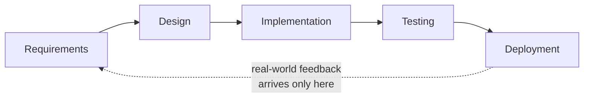
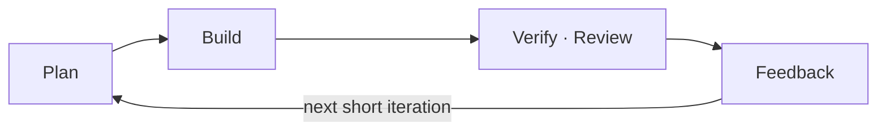

## Introduction

The daily standup has become a daily status report to the manager. The sprint is a two-week mini-waterfall, and the retrospective ends with a quick "nothing much, right?" The team clearly says "we do Agile" — yet ask *why* it does any of this, and there is no answer.

This is not one team's story. Agile started with a manifesto in 2001, but more than twenty years later "doing Agile" has become a more confusing phrase, not a clearer one. Teams adopt the events — daily, sprint, retro — but the <strong>why</strong> behind them is missing.

This series fills in that <strong>why</strong>. It is not a textbook for memorizing terms and ceremonies; its throughline is "why we do this, and why it breaks down in practice." Part 1 covers the roots: why waterfall broke down, the 2001 manifesto, the four values and twelve principles, and the five most common misconceptions.

The target reader is a practitioner who adopted Agile but isn't sure why, someone worn out by fake Agile, or anyone who wants to once and for all sort out the philosophy behind the process. No prior knowledge required.

- <strong>Part 1 — Why Agile Emerged — Manifesto · 4 Values · 12 Principles (this post)</strong>
- [Part 2 — Scrum — Empirical Process Control and the 3-5-3](/blog/en/agile-guide-2)
- [Part 3 — Kanban · Lean · Flow](/blog/en/agile-guide-3)
- [Part 4 — Practices and Measurement — From XP to Velocity · DORA](/blog/en/agile-guide-4)
- [Part 5 — Scaling and Fake Agile](/blog/en/agile-guide-5)
- [Part 6 — Hands-On: From User Story to Release](/blog/en/agile-guide-6)

---

## TL;DR

- <strong>Agile is a value system, not a methodology</strong> — Scrum, Kanban, and XP are different ways to implement those values. The manifesto is not a procedure ("do this") but a value statement ("value this more").
- <strong>It emerged as a reaction to waterfall's limits</strong> — feedback arrived only at the very end (late feedback), and the cost of change spiked the further you went. Agile answers this with short iterative loops.
- <strong>The four values = prefer the left over the right</strong> — "individuals over processes/tools," "working software over documentation," "collaboration over contract negotiation," "responding to change over following a plan." The right side still has value; the left is valued more.
- <strong>The twelve principles are the values translated into practice</strong> — deliver early and often, welcome change, sustainable pace, self-organizing teams, regular retrospectives. Everything in later parts (Scrum, XP, measurement) derives from these twelve lines.
- <strong>The five common misconceptions are all wrong</strong> — "no docs / no planning / just go faster / no process / startups only" are the result of reading only half the manifesto.

---

## 1. Why Did Waterfall Break Down?

To understand Agile, you first have to see what it was a reaction against. That target is <strong>waterfall</strong>. Waterfall runs requirements → design → implementation → testing → deployment in one direction, sequentially, and only moves on once each phase is fully complete.

### 1.1 The Structure of Waterfall

Each phase is handed off as a document, and the model assumes you never return to a phase once it is done. The name comes from water falling only downward, top to bottom.

The trouble is that this structure rests on two dangerous assumptions.

- <strong>The assumption that requirements are fully knowable up front</strong> — it assumes customer and developer can completely agree on what to build at project kickoff. Real software reveals its true requirements only once it is built and used.
- <strong>The assumption that each phase is done correctly in one pass</strong> — once design is finished, you don't look at it again. Yet implementation exposes holes in the design, and testing exposes misunderstandings in the requirements.

### 1.2 Late Feedback and the Cost-of-Change Curve

Waterfall's real weakness is that <strong>feedback arrives only at the very end</strong>. The moment real users touch a working product is the testing/deployment phase — nearly the end of the project. Only then does "this isn't what we wanted" surface.

The bigger problem is that the cost of change rises steeply as phases advance. Fixing one line in the requirements phase and fixing the same thing in production after release have completely different costs. The <strong>cost-of-change curve</strong> documented by Barry Boehm shows this classically (rough relative costs below).

| Phase where change is found | Relative cost to fix |
|---|---|
| Requirements | 1× |
| Design | ~5× |
| Implementation | ~10× |
| Testing | ~20× |
| Production (post-release) | ~100× |

Feedback comes late, and the later the change, the more expensive it is. When those two overlap, a problem found in waterfall is almost always "a problem found at the most expensive moment possible." Agile's core idea is simple: <strong>make the feedback loop short, so change is pulled into a cheap moment.</strong>

Two words are worth distinguishing here. <strong>Iterative</strong> means refining the same thing across multiple passes; <strong>incremental</strong> means slicing functionality into pieces and adding them one at a time. Agile usually does both — adding small slices (incremental) while refining each through feedback (iterative).

### 1.3 Aside: Waterfall Was Actually an Example of "Don't Do This"

The 1970 paper by Winston Royce is commonly cited as the origin of waterfall. Yet Royce drew that pure sequential model and warned, "doing it exactly like this is risky." He recommended iteration between phases and prototyping. The name "waterfall" and the "strictly sequential" reading were attached later, by people who read only half the paper.

<strong>More detail — why waterfall became the standard anyway</strong>

The sequential model is <strong>easy to manage and easy to contract.</strong> Each phase ends in a deliverable document, which is great for reporting progress and great for slicing an outsourcing contract into "this much for design, this much for implementation." Waterfall became the de facto standard in large SI, defense, and government projects of the 1980s–90s not for technical merit but for this <strong>contracting and management convenience</strong>. That is exactly the context in which Agile raised "customer collaboration over contract negotiation" (the third value in Section 3).

---

## 2. The Year 2001: A Manifesto

### 2.1 The 17 Who Gathered at Snowbird

In February 2001, seventeen developers gathered at a ski resort in Snowbird, Utah. At the time each was advocating some <strong>lightweight methodology</strong>. Lightweight methodologies were a movement emphasizing short cycles and fast feedback over heavy documents and process — XP (Extreme Programming), Scrum, Crystal, DSDM, FDD, and others belonged here.

They used different methods, but they discovered a shared set of beliefs. The one-page distillation of that common ground is the <strong>Manifesto for Agile Software Development</strong>. Instead of the weak-sounding "lightweight," they chose "Agile," meaning nimble.

> <strong>Key</strong>: the manifesto does not prescribe any specific method (Scrum or XP). It merely declares the <strong>values</strong> that flow in common across many methods. So "Agile = Scrum" is a false equation. Scrum is one way to implement Agile.

### 2.2 The Manifesto Itself

The body of the manifesto is remarkably short. Four lines is the whole of it.

| We value this less | Over this more |
|---|---|
| Processes and tools | <strong>Individuals and interactions</strong> |
| Comprehensive documentation | <strong>Working software</strong> |
| Contract negotiation | <strong>Customer collaboration</strong> |
| Following a plan | <strong>Responding to change</strong> |

And one decisive sentence follows.

> That is, while there is value in the items on the left, we value the items on the right more.

This final sentence is the most frequently ignored part of the entire manifesto. <strong>It does not say to discard the left side.</strong> Documents, plans, tools, contracts all have value. It only sets out which to prioritize when the two collide. The next section unpacks the four values one line at a time.

---

## 3. The Four Values, One Line at a Time

| Value | What it means | It does NOT mean discarding the left |
|---|---|---|
| Individuals & interactions > processes & tools | However good your tools and process, it is conversation between people that ultimately gets work done | Not "don't use tools," but "don't let tools replace conversation" |
| Working software > comprehensive documentation | The evidence of progress is a working feature, not a 500-page design spec | Not "eliminate docs," but "don't write documents for documentation's sake" |
| Customer collaboration > contract negotiation | Collaborating on direction while building beats a contract that nails down scope | Not "eliminate contracts," but "don't hide behind the contract and turn against the customer" |
| Responding to change > following a plan | Markets and requirements shift. Adjusting the plan to change beats clinging to a stale plan | Not "don't plan," but "use the plan as a tool, not as the goal" |

One sentiment runs through all four values: <strong>they admit uncertainty.</strong> You can't know everything to build up front, people make mistakes, and the world changes — so rather than trying to get it all right in one pass, confirm often and correct often. This attitude leads directly into Scrum's "empirical process control" in Part 2.

---

## 4. The Twelve Principles — The Values Translated into Practice

After the four values, the manifesto lists twelve principles. If the values say "what to consider important," the twelve principles are closer to "so how do you actually behave." Listing twelve lines verbatim doesn't stick, so let's group them by theme.

| Theme | Principles (number) | One-line summary |
|---|---|---|
| Deliver value early and often | 1 · 3 · 7 | Deliver working software early, in short cycles. The measure of progress is working software |
| Welcome change | 2 | Welcome changing requirements even late. Change is the customer's competitive advantage |
| People and collaboration first | 4 · 5 · 6 · 11 | Work together daily, trust motivated people, communicate face-to-face; the best designs emerge from self-organizing teams |
| Sustainability and craft | 8 · 9 · 10 | Maintain a constant pace, attend continuously to technical excellence, and maximize the work not done (simplicity) |
| Learning and improvement | 12 | Reflect at regular intervals (retrospective) and adjust behavior |

This table is also a map of the whole series. A few highlights:

- <strong>"The measure of progress is working software" (principle 7)</strong> — meaning, don't measure progress in lines of code or hours. This single line leads into Part 4's "velocity is not value" discussion.
- <strong>"Technical excellence" (principle 9)</strong> — Agile explicitly demands clean code and good design. This is the basis for Part 4's XP engineering practices (TDD, refactoring).
- <strong>"Reflect at regular intervals" (principle 12)</strong> — the engine of Agile. As we'll see, when this inspect-and-adapt loop is missing, that is precisely fake Agile (Part 5).

> <strong>Note</strong>: principle 8's "sustainable pace" means just that — not grinding people through short sprints, but maintaining the same pace over months and years. It directly refutes the misconception that "Agile = just go faster."

> <strong>Note — "maximizing the work not done" (principle 10)</strong>: this means "don't do work that doesn't need doing," not "do less work." Aim for the most un-built features and un-written code — every line of code carries the debt of maintenance, bugs, and complexity. It is the spirit of <strong>YAGNI (You Aren't Gonna Need It — build it when you actually need it)</strong>: don't build for a hypothetical "we might need it later." It leads into XP's simple design in Part 4, and it differs from laziness (cutting corners on needed work) — it reduces the amount of unnecessary work, not the quality.

---

## 5. Five Common Misconceptions

Almost every misconception about Agile comes from reading only half the manifesto — seeing only the left side and concluding the right was discarded.

| Misconception | Reality |
|---|---|
| Agile = no documentation | "Working software over comprehensive documentation," not abolishing docs. Write the docs you need, but don't let docs become the goal |
| Agile = no planning | "Responding to change over following a plan," not no plan at all. If anything, you plan more often — every iteration |
| Agile = just go faster | Principle 8 is "sustainable pace." Speed isn't the goal; a tireless pace that adapts to change is |
| Agile = no process/discipline | XP and Scrum demand strict discipline (TDD, DoD, timeboxes). They put "people over process," not abolish process |
| Agile = startups only | Scaling frameworks for large organizations exist (SAFe, LeSS). But scaling is genuinely hard, and this is where fake Agile is often born (Part 5) |

The last two are especially dangerous. The "no discipline" misconception leads teams to skip engineering practices, and mimicking the events without those practices is what we call <strong>cargo cult Agile</strong> — imitation that believes results will follow if you copy the form. Dissecting and recovering from this fake Agile is the destination of the series, covered in depth in Part 5.

> <strong>Note — Cargo cult</strong>: the term comes from Pacific islanders in WWII who, hoping to summon back the cargo that military planes once delivered, mimicked the soldiers' rituals — lighting the runways, building mock control towers out of wood, fashioning headphones from straw. The cargo never came, because they copied the form while missing the real cause (factories, supply chains). It denotes behavior that believes results will follow from rituals alone; physicist Richard Feynman popularized it to criticize "research that has only the form of science."

---

## Recap

The essentials of Part 1, one line each:

- <strong>Agile is a value system, not a methodology</strong> — the manifesto is a declaration of "what to value more," not a procedure. Scrum, Kanban, and XP are different ways to implement those values.
- <strong>Agile is an answer to waterfall's two weaknesses</strong> — late feedback and a steep cost-of-change curve. The answer is "shorten the feedback loop to pull change into a cheap moment."
- <strong>The four values prefer the left over the right</strong> — not discarding the right (docs, plans, tools, contracts), but setting priority when they collide.
- <strong>The twelve principles translate the values into practice, and map the whole series</strong> — deliver early and often, welcome change, sustainable pace, self-organizing teams, regular retrospectives. Every later topic derives from here.
- <strong>The five misconceptions all come from reading half the manifesto</strong> — especially "no discipline," which leads teams to skip engineering practices and gives birth to fake Agile.

Part 2 is <strong>Scrum</strong>. We'll see how the framework that most widely implements Agile's values turns Part 1's "admit uncertainty" attitude into <strong>empirical process control</strong> (transparency, inspection, adaptation), and what problem each piece of the 3-5-3 structure (3 roles, 5 events, 3 artifacts) actually solves. That is also where we'll address why the daily should not be a status report.

---

## Appendix

### A. The Twelve Principles in Full

<strong>Expand — the twelve principles</strong>

1. Our highest priority is to satisfy the customer through early and continuous delivery of valuable software.
2. Welcome changing requirements, even late in development. Agile processes harness change for the customer's competitive advantage.
3. Deliver working software frequently, from a couple of weeks to a couple of months, with a preference to the shorter timescale.
4. Business people and developers must work together daily throughout the project.
5. Build projects around motivated individuals. Give them the environment and support they need, and trust them to get the job done.
6. The most efficient and effective method of conveying information to and within a development team is face-to-face conversation.
7. Working software is the primary measure of progress.
8. Agile processes promote sustainable development. The sponsors, developers, and users should be able to maintain a constant pace indefinitely.
9. Continuous attention to technical excellence and good design enhances agility.
10. Simplicity — the art of maximizing the amount of work not done — is essential.
11. The best architectures, requirements, and designs emerge from self-organizing teams.
12. At regular intervals, the team reflects on how to become more effective, then tunes and adjusts its behavior accordingly.

### B. Glossary

| Term | One-line definition |
|---|---|
| Waterfall | A development model running requirements→design→implementation→testing→deployment one-directionally, moving on only after each phase completes |
| Agile Manifesto | A one-page declaration, distilled by 17 people in 2001, of Agile's four values and twelve principles |
| Lightweight methodology | A 1990s movement emphasizing short cycles and fast feedback over heavy documents/process (XP, Scrum, Crystal, etc.) |
| Iterative | Refining the same thing across multiple passes |
| Incremental | Slicing functionality into pieces and adding them one at a time |
| Cost-of-change curve | Barry Boehm's classic observation that the later a defect/change is found, the steeper the cost to fix it |
| Sustainable pace | A work pace maintainable over months and years, not short bursts (principle 8) |
| Self-organizing team | A team that divides work and decides methods itself, rather than by external command (principle 11) |
| Cargo cult Agile | Fake Agile that mimics only the events/form, believing results will follow (Part 5) |
| TDD | Test-Driven Development — write a failing test first, then make it pass (Part 4) |
| DoD | Definition of Done — the shared criteria for what counts as "finished" (Part 2) |
| Timebox | A rule to spend only a fixed amount of time and then stop — applied to sprints/meetings (Part 2) |
| Velocity | How much work a team completes per iteration — a planning tool, not a productivity KPI (Part 4) |
| SAFe (Scaled Agile Framework) · LeSS (Large-Scale Scrum) | Large-scale frameworks for scaling Agile across many teams (Part 5) |
| DORA (DevOps Research and Assessment) | Four metrics — deployment frequency, change lead time, mean time to recovery, change failure rate — measuring delivery performance (Part 4) |

### C. External References

- [Manifesto for Agile Software Development](https://agilemanifesto.org/) — the original manifesto (with translations)
- [Principles behind the Agile Manifesto](https://agilemanifesto.org/principles.html) — the twelve principles
- [Winston Royce, "Managing the Development of Large Software Systems" (1970)](https://www.praxisframework.org/files/royce1970.pdf) — the paper often cited as waterfall's origin (which actually warns against pure sequence)
