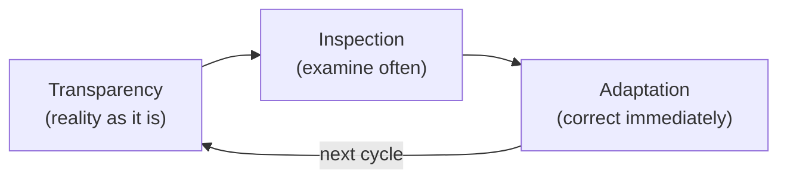
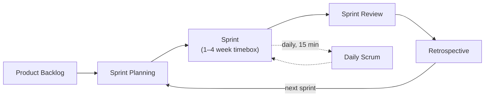

## Introduction

In the [previous post](/blog/en/agile-guide-1) we said the sentiment running through Agile's four values is that it <strong>admits uncertainty</strong>: you can't know everything to build up front, so rather than getting it all right in one pass, confirm often and correct often.

Scrum turns that attitude into the most widely used concrete skeleton. Yet in practice Scrum is often misread as <strong>"a process that's just a lot of meetings."</strong> The *why* of the daily, planning, review, and retro drops out, and the events run on autopilot because "that's how it's done."

Part 2 nails down that <strong>why</strong> first. There is a single key: every role, event, and artifact in Scrum derives from one idea — <strong>empirical process control</strong>. Grasp it, and the 3-5-3 (3 roles, 5 events, 3 artifacts) stops being a list to memorize and reads as machinery for inspecting and adapting.

The target reader runs Scrum but struggles to explain why each event exists, or whose daily has become a reporting session. You don't need Part 1, but it helps.

- [Part 1 — Why Agile Emerged — Manifesto · 4 Values · 12 Principles](/blog/en/agile-guide-1)
- <strong>Part 2 — Scrum — Empirical Process Control and the 3-5-3 (this post)</strong>
- [Part 3 — Kanban · Lean · Flow](/blog/en/agile-guide-3)
- [Part 4 — Practices and Measurement — From XP to Velocity · DORA](/blog/en/agile-guide-4)
- [Part 5 — Scaling and Fake Agile](/blog/en/agile-guide-5)
- [Part 6 — Hands-On: From User Story to Release](/blog/en/agile-guide-6)

---

## TL;DR

- <strong>Scrum's root is empirical process control</strong> — when uncertainty is too high to define everything up front, you inspect frequently and adapt as you go. Every event, role, and artifact comes from this.
- <strong>Three pillars = transparency · inspection · adaptation</strong> — make reality visible as it is (transparency), check it often (inspection), and fix course immediately when it drifts (adaptation). Drop any one and Scrum spins its wheels.
- <strong>3-5-3 = 3 roles · 5 events · 3 artifacts</strong> — roles are "who is accountable," events are "the fixed places where inspection and adaptation happen," artifacts are "what you inspect transparently."
- <strong>Each artifact carries a commitment</strong> — Product Backlog→Product Goal, Sprint Backlog→Sprint Goal, Increment→Definition of Done. Without the commitment, an artifact is just a list.
- <strong>Daily-as-status-report and sprint-as-mini-waterfall are decay signals</strong> — the form is Scrum but inspection and adaptation are gone. This is the core symptom of fake Agile in Part 5.

---

## 1. Empirical Process Control — Why Scrum Is Shaped This Way

### 1.1 Defined vs Empirical Process

In manufacturing, if inputs and the process are clear, you can predict the output. Same materials through the same process yield the same product. This is <strong>defined process control</strong> — a world where planning precisely and executing to plan is best.

Software is different. Requirements reveal themselves only once built, technology is known only once attempted, and people behave differently each time. Inputs are uncertain, so outputs aren't predictable. In such a world, precise planning becomes poison — which is exactly waterfall's failure from Part 1.

| Aspect | Defined process control | Empirical process control |
|---|---|---|
| Premise | Clear inputs/process → predictable output | Uncertain → unpredictable output |
| Approach | Plan precisely up front, execute to plan | Inspect frequently, adjust as you go |
| Fits | Repetitive, standardized manufacturing | High-uncertainty work like software |
| Part 1 mapping | Waterfall | Agile (short iterative loop) |

<strong>Empirical process control</strong> means "control by experience, not prediction." You look at what you actually built (experience) and decide the next step from that. Scrum is a bundle of devices for running this empirical control at the team level.

### 1.2 The Three Pillars — Transparency · Inspection · Adaptation

For empirical control to work, three things must hold it up. Scrum calls them the <strong>three pillars</strong>.

- <strong>Transparency</strong> — the true state of the work must be visible to everyone, as it is. Inflate progress or hide problems and the other two pillars collapse.
- <strong>Inspection</strong> — examine artifacts and progress frequently — but only as much as doesn't obstruct the flow of work.
- <strong>Adaptation</strong> — when inspection shows you've drifted, fix it <strong>right now</strong>. Not next quarter, not next release.

These don't operate alone. <strong>Without transparency, inspection sees a fiction; without inspection, there's no basis to adapt; without adaptation, inspection is just reporting.</strong> Every event below exists to trigger one or more of the three. Nearly every case of Scrum spinning its wheels is diagnosed by which of the three is missing (Section 6).

The Scrum Guide names <strong>five values</strong> that uphold the three pillars. If the pillars are "what you do," the five values are the "team attitude" that makes them possible.

| Value | Meaning | Link to the three pillars |
|---|---|---|
| Commitment | Commit to the goal and to one another | Inspection/adaptation only matter if there's commitment |
| Focus | Focus on the Sprint Goal and the work at hand | Keeps what you inspect from blurring |
| Openness | Surface the work and its problems honestly, as they are | The direct premise of transparency |
| Respect | Respect one another as capable, independent peers | The foundation a self-managing team runs on |
| Courage | Face hard problems and do the right thing | Needed to surface problems (openness) and change course (adaptation) |

<strong>Openness and courage</strong> in particular underpin transparency — without the courage to surface problems honestly, transparency stays a slogan, and then inspection sees a fiction and adaptation can't happen.

---

## 2. The 3-5-3 at a Glance

Scrum's components are memorized as 3-5-3 — <strong>3 roles · 5 events · 3 artifacts</strong>. But before memorizing, see which pillar each group serves, and the structure clicks.

| Group | Items | Role in the three pillars |
|---|---|---|
| 3 roles (accountabilities) | PO · Scrum Master · Developers | Split accountability for what · keeping it running · how |
| 5 events | Sprint · Planning · Daily · Review · Retro | The fixed places where inspection and adaptation happen |
| 3 artifacts (+commitment) | Product Backlog · Sprint Backlog · Increment | What you inspect transparently |

One sprint cycle looks like this.

Inside the big box of a sprint, you start with planning, check in daily, and end with a review (inspect what you built) and a retro (inspect how you work) before moving to the next sprint. This loop is the Scrum version of Part 1's "short iterative feedback loop."

---

## 3. The Three Roles — Who Is Accountable for What

The 2020 Scrum Guide calls these <strong>accountabilities</strong>, not roles — meaning "this person is accountable for this outcome," not a job title. Within one <strong>Scrum Team</strong> there are three, with no sub-teams beneath it.

- <strong>Product Owner (PO)</strong> — accountable for <strong>what</strong> gets built. Manages the Product Backlog and orders it to maximize the product's value. The PO is one person, not a committee.
- <strong>Scrum Master (SM)</strong> — accountable for Scrum <strong>working well</strong>. Not a schedule manager but a coach who helps the team do empirical control properly and removes impediments.
- <strong>Developers</strong> — accountable for <strong>how</strong> it's built. They create a usable Increment each sprint. "Developers" aren't "coders" but everyone doing the work an Increment needs (design, development, testing, and so on).

A principle runs through all three: <strong>self-managing</strong>. Who does what, when, and how is decided by the team itself, not external command. This directly implements Part 1's principle 11 (best designs emerge from self-organizing teams).

> <strong>Caution</strong>: the moment you make the Scrum Master "the one who manages the sprint schedule and reports progress upward," that's a PM, not a Scrum Master. This decay is the first step toward turning the daily into a reporting session (Section 6).

---

## 4. The Five Events — Where Inspection and Adaptation Happen

What the five events share is that they are all <strong>timeboxed</strong>. A timebox is a rule to spend only a fixed amount of time and then stop (Part 1 appendix). Nailing down the time structurally prevents "meetings that drag on without a conclusion."

| Event | Timebox (for a 1-month sprint) | What it inspects/adapts |
|---|---|---|
| Sprint | ≤ 1 month | The container holding all other events |
| Sprint Planning | ≤ 8 hours | What · why · how for this sprint |
| Daily Scrum | 15 min | Progress toward the Sprint Goal, today's plan |
| Sprint Review | ≤ 4 hours | The Increment, with stakeholders; the Product Backlog |
| Retrospective | ≤ 3 hours | How the last sprint went — the way of working itself |

The essence of each, one line at a time:

- <strong>Sprint</strong> — a fixed-length cycle of one month or less. The PO can cancel it if the goal goes stale, but you never extend the length mid-sprint. Fixing the length creates rhythm and predictability.
- <strong>Sprint Planning</strong> — decides three things: <strong>why</strong> (the Sprint Goal), <strong>what</strong> (backlog items for this sprint), and <strong>how</strong> (the work plan). Pre-2020 the "why" was weak; it was strengthened when the Sprint Goal became explicit.
- <strong>Daily Scrum</strong> — 15 minutes for Developers to inspect progress against the Sprint Goal and adapt today's plan. <strong>It is not a report to a manager.</strong> The format (the yesterday/today/blockers three questions) was removed in 2020 — meet the purpose and the format is yours.
- <strong>Sprint Review</strong> — a <strong>working session</strong> where you examine the Increment with stakeholders and adjust the Product Backlog. Not an approval presentation or a demo show.
- <strong>Retrospective</strong> — reflect on the way of working (people, relationships, process, tools, DoD) and decide improvements. It is the seat of Part 1's principle 12 (reflect regularly and adjust), and Agile's learning engine.

> <strong>Note — what the daily's "three questions" were</strong>: through the 2017 guide, Scrum recommended a daily format where each person answered three questions — ① what I did yesterday, ② what I'll do today, ③ any blockers. But it ossified into a ritual that turned the daily into a status report to a manager. So the 2020 revision deleted the three questions and kept only the purpose (inspect and adapt against the Sprint Goal) — you may still use them, but they are no longer mandatory.

> <strong>Note — why the Sprint Review isn't a "presentation"</strong>: a common misconception treats the review as a demo show where the team shows what it built and stakeholders approve it. That makes it one-directional (team → stakeholders) and turns inspection into a spectacle. A real review is a <strong>two-way working session</strong>. Together you look at the already-Done (usable) Increment, factor in market and context changes, discuss "what's most valuable next," and revise the Product Backlog right there. So the Increment isn't "approved" at the review — it's already Done, so no stamp is needed, and the review's output is an adjusted Product Backlog. In short, review = inspecting the Increment + adapting the Product Backlog; ossify it into a presentation and you get a decay signal with adaptation missing (Section 6.2).

---

## 5. The Three Artifacts and Their Commitments

An artifact is "what you inspect transparently." The 2020 Scrum Guide attached one <strong>commitment</strong> to each. Without the commitment, an artifact is just a directionless list.

| Artifact | What it is | Commitment |
|---|---|---|
| Product Backlog | An ordered list of everything the product needs | <strong>Product Goal</strong> — the long-term goal the team heads toward |
| Sprint Backlog | Items for this sprint + the plan | <strong>Sprint Goal</strong> — the single purpose of this sprint |
| Increment | A usable result produced this sprint | <strong>Definition of Done</strong> — the shared standard for "finished" |

### 5.1 What an Increment Is — Not "Added Functionality"

The word "increment" makes it easy to read as "the functionality added this time = the chunk of new code." Only half right. The crux of an Increment is <strong>not quantity (a delta) but state</strong>.

<strong>An Increment is a usable result that is added to everything before it and works as one whole.</strong> Three things must hold at once for it to be an Increment.

- <strong>Additive (cumulative)</strong> — this Increment is added on top of all prior Increments, verified together so they work together. Add a new feature but break an existing one, and it is not an Increment.
- <strong>In a usable state</strong> — integrated and tested, ready to use (release) right now (it meets the DoD). Whether to actually release is the PO's separate call, but the state itself must be "usable."
- <strong>A step toward the goal</strong> — an Increment is a stepping stone toward the Product Goal. Not "code grew" but "usable value grew by one step."

So "the feature is fully coded but not integrated or tested" is not an Increment — it is undone work. Multiple Increments can appear in one sprint, and the Sprint Review presents their sum (the usable whole so far).

> <strong>Key</strong>: an Increment is not the amount of new code, but the state of the product that is "usable as a whole right now" once that code is folded in. The standard that guarantees this "state" is the Definition of Done, which we look at next.

### 5.2 Why Definition of Done Is the Crux

<strong>Definition of Done (DoD) is the shared standard a piece of work must meet to be called "done."</strong> It includes not just writing code but testing, review, documentation, deployable state — whatever quality conditions the team has agreed on.

What happens without a DoD? Everyone calls things "done" by a different bar, and <strong>undone work</strong> — untested, unintegrated — piles up. The Increment is claimed "usable" yet can't actually be used. This is the channel through which a sprint decays into a mini-waterfall: with no real Increment to inspect, the review becomes a formality.

> <strong>Key</strong>: only work that meets the DoD counts as an Increment. Work that doesn't isn't brought to the Sprint Review. This discipline upholds transparency — guaranteeing the Increment is genuinely usable.

---

## 6. The Scrum Guide 2020 Changes and Decay Signals

### 6.1 What Changed in 2020

The 2020 revision made the Scrum Guide lighter and less prescriptive. The main changes:

| Item | Through 2017 | 2020 |
|---|---|---|
| Team structure | Development Team as a sub-team inside the Scrum Team | One Scrum Team (no sub-teams), members are Developers |
| Product Goal | No such concept | Product Goal introduced |
| Commitments | Not made explicit | A commitment per artifact (Product Goal, Sprint Goal, DoD) |
| Daily three questions | Recommended (yesterday/today/blockers) | Removed — format free as long as the purpose holds |
| Self-organizing | self-organizing | self-managing (who/when/how, all by the team) |
| Length | 19 pages | Trimmed to 13 pages |

The overall direction is <strong>"fewer rules, purpose kept."</strong> Removing the daily three questions is emblematic — it guards against forgetting the purpose (inspect progress, adapt the plan) while mimicking the form.

### 6.2 Decay Signals — Form Is Scrum, Substance Is Gone

The symptoms of a team where Scrum spins its wheels are diagnosed precisely by Section 1's three pillars. Just look at what's missing.

| Decay signal | Missing pillar | What it should be |
|---|---|---|
| Daily becomes a status report to a manager | Inspection · adaptation | Developers self-check and adjust against the Sprint Goal |
| Sprint is a mini-waterfall (plan-only, no mid-feedback) | Inspection · adaptation | Inspect daily and each sprint, adapt as you go |
| Retro is a formality (no actions / same talk every time) | Adaptation | A learning engine that actually changes how you work |
| "Done" claimed without a DoD | Transparency | Only a genuinely usable Increment counts as done |
| Scrum Master manages schedule / collects reports | Adaptation (no coaching) | A coach who aids empirical control and removes impediments |

The common thread is clear: <strong>the form of the events is intact, but the substance — transparency, inspection, adaptation — is gone.</strong> This form-only state is the fake Agile foreshadowed in Part 1, and its dissection and recovery is the subject of Part 5.

---

## Recap

The essentials of Part 2, one line each:

- <strong>Everything in Scrum comes from empirical process control</strong> — when uncertainty is high, control by experience instead of prediction. Grasp this and the 3-5-3 reads as inspect-and-adapt machinery, not a list to memorize.
- <strong>The three pillars (transparency, inspection, adaptation) are a diagnostic tool</strong> — nearly every case of Scrum spinning its wheels is explained by which of the three is missing.
- <strong>3 roles are accountabilities, 5 events are the seats of inspection/adaptation, 3 artifacts are the objects of transparency</strong> — and each artifact needs a commitment (Product Goal, Sprint Goal, DoD) to have direction.
- <strong>Definition of Done protects the integrity of the Increment</strong> — without a DoD, "done" piles up as undone work and the review becomes a formality.
- <strong>Daily-as-report and sprint-as-mini-waterfall are decay signals</strong> — the archetypal fake Agile where the form is Scrum but the substance is gone, the subject of Part 5.

Part 3 is <strong>Kanban and Flow</strong>. If Scrum makes rhythm with fixed-length sprints, Kanban keeps the flow unbroken and limits work in progress (WIP). We'll cover Lean's legacy (the Toyota Production System), why limiting WIP raises throughput (Little's Law), and how to choose between Scrum and Kanban for the situation at hand.

---

## Appendix

### A. Glossary

| Term | One-line definition |
|---|---|
| Empirical process control | Controlling by frequent inspection and adaptation rather than up-front definition, when things are too uncertain to predict |
| Defined process control | Planning up front and executing to plan, when clear inputs/process make the output predictable |
| Three pillars | Transparency, inspection, and adaptation — what hold up empirical control |
| Accountability | Not a title but "this person/role is accountable for this outcome" |
| Scrum Team | One team of PO, Scrum Master, and Developers, with no sub-teams |
| Timebox | A rule to spend only a fixed amount of time and then stop — structurally prevents dragging meetings |
| Increment | A usable, whole state added on top of prior work — a state, not a code delta, and only what meets the DoD |
| Definition of Done | The team-agreed quality standard a piece of work must meet to be called "done" |
| Product Goal / Sprint Goal | The Product Backlog's long-term goal / this sprint's single purpose |
| Undone work | Work that didn't meet the DoD but got classified as "done," piling up hidden |

### B. External References

- [The 2020 Scrum Guide](https://scrumguides.org/scrum-guide.html) — the official definition of Scrum (2020 revision)
- [Scrum Guide 2020 revision summary](https://scrumguides.org/revisions.html) — the main 2017→2020 changes
- [Manifesto for Agile Software Development](https://agilemanifesto.org/) — the Agile Manifesto covered in Part 1
