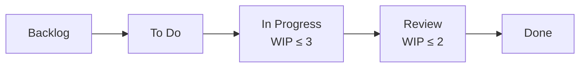

## Introduction

In the [previous post](/en/blog/agile-guide-2) we said Scrum is an approach that makes rhythm with fixed-length sprints. But not all work fits that rhythm.

Think of operations, incident response, customer support, infrastructure work. Work arrives irregularly, priorities shift constantly, and an urgent item that didn't exist yesterday becomes today's top priority. Cram that into a two-week sprint and every interruption breaks the Sprint Goal.

<strong>Kanban</strong> answers differently. It runs no fixed iterations; it visualizes the <strong>flow</strong> of work and then limits <strong>work in progress (WIP)</strong> to manage that flow. Its root is Toyota's Lean. So Part 3 starts from Lean's legacy, moves through Kanban's six practices and WIP limits, "why lowering WIP makes things faster" (Little's Law), the flow metrics, and how to choose between Scrum and Kanban.

The target reader is a team of an operations/support nature whose sprints keep breaking, or anyone who wants an option besides Scrum. You don't need Parts 1–2, but they make the connection ("flow is also inspect-and-adapt") clearer.

- [Part 1 — Why Agile Emerged — Manifesto · 4 Values · 12 Principles](/en/blog/agile-guide-1)
- [Part 2 — Scrum — Empirical Process Control and the 3-5-3](/en/blog/agile-guide-2)
- <strong>Part 3 — Kanban · Lean · Flow (this post)</strong>
- [Part 4 — Practices and Measurement — From XP to Velocity · DORA](/en/blog/agile-guide-4)
- [Part 5 — Scaling and Fake Agile](/en/blog/agile-guide-5)
- [Part 6 — Hands-On: From User Story to Release](/en/blog/agile-guide-6)
- [Part 7 — Discovery: Where Do User Stories Come From](/en/blog/agile-guide-7)

---

## TL;DR

- <strong>Kanban is flow-based</strong> — no fixed iterations (sprints); it visualizes the flow of work and limits work in progress to manage it. Strong for work that arrives irregularly with shifting priorities.
- <strong>Its root is Lean (the Toyota Production System)</strong> — eliminate waste and let work flow by pull, not push. You pull the next item only when a slot frees up.
- <strong>Limiting work in progress is the key lever</strong> — by Little's Law (lead time = work in progress ÷ throughput), lowering work in progress shortens lead time even at the same throughput. Reducing the multitasking tax usually raises throughput too.
- <strong>You watch flow metrics, not velocity</strong> — lead time, cycle time, throughput, and the cumulative flow diagram to read bottlenecks.
- <strong>Scrum and Kanban aren't either/or</strong> — Scrum for planned feature work, Kanban for irregular intake (ops/support), and Scrumban when you mix the two.

---

## 1. Lean's Legacy — From Toyota to Software

### 1.1 Starting from the Toyota Production System

<strong>Lean</strong> is a production philosophy distilled from the Toyota Production System (TPS). It boils down to two things — <strong>eliminate waste, and never break the flow.</strong>

The word "Kanban" (看板) came from here too. On the Toyota floor, a kanban was a <strong>visual signal card</strong> saying "refill this part." An upstream step makes parts only when a downstream step sends the signal (kanban). That is, you don't stockpile inventory in advance; you pull and make only as much as needed.

Crossing into software, it split into two streams. One is <strong>Lean Software Development</strong> (Mary & Tom Poppendieck, 2003), applying Lean thinking to development; the other is the <strong>Kanban method</strong> (David Anderson), applying the kanban signal to knowledge work. Section 1 covers the former (the mindset), Section 2 the latter (the practice).

### 1.2 The Seven Lean Software Development Principles

The Poppendiecks translated Lean into seven software principles. You needn't memorize them all; read them grouped as "eliminate waste + fast flow + trust people + see the whole."

| Principle | One-line meaning |
|---|---|
| Eliminate waste | Cut everything that adds no value (undone work, extra features, waiting, rework) |
| Amplify learning | Learn by building in short cycles — Part 1's short iterative loop |
| Decide as late as possible | Defer hard-to-reverse decisions to the moment you have the most information |
| Deliver as fast as possible | Flowing fast means feedback comes fast (the crux of flow) |
| Empower the team | The people doing the work decide how — Part 2's self-management |
| Build integrity in | Don't inspect quality in later; build it into the process |
| See the whole | Optimize the whole flow, not a single step |

The first, <strong>waste</strong>, is Lean's starting point. Software's typical wastes are <strong>undone work</strong> (inventory worth zero until finished), <strong>extra features</strong> (things no one uses — Part 1's principle 10, simplicity), <strong>task switching</strong> (the multitasking cost), and <strong>waiting</strong> (time spent waiting for the next step). The WIP limit is a device that reduces both undone work and task switching at once (Section 3).

### 1.3 Push vs Pull

The most common pattern that wrecks flow is <strong>push</strong>. When an upstream step shoves work downstream regardless of downstream capacity, work piles up in front of the downstream step and the whole thing clogs.

| Mode | How work flows | Result |
|---|---|---|
| Push | Upstream shoves on completion (ignores capacity) | Undone work piles before the bottleneck, lead time spikes |
| Pull | Downstream pulls from upstream only when it has capacity | WIP stays bounded, flow is steady, bottlenecks surface |

Kanban is thoroughly <strong>pull</strong>-based. Not "there's work to do, so start it," but "pull the next item only when a slot of mine frees up." This single rule is made concrete by the WIP limit in the next section.

---

## 2. Kanban — Visualize Flow and Limit WIP

### 2.1 What the Kanban Method Is

The <strong>Kanban method</strong> doesn't tear up your existing process; it <strong>"starts from what you do now and evolves it incrementally."</strong> Unlike Scrum, it imposes no new roles or events. You draw your current flow onto a board as-is, then improve a little at a time.

That's why Kanban faces less adoption resistance than Scrum. Without changing roles or sprints, you can start with "let's just make how our work flows visible."

### 2.2 The Six Practices

Kanban distills into six practices.

| Practice | What |
|---|---|
| Visualize | Surface the flow of work on a board (columns per stage) |
| Limit WIP | Cap how many items can be in each stage at once |
| Manage flow | See where work clogs and smooth the flow |
| Make policies explicit | Write down rules like "when does an item move to the next stage" |
| Implement feedback loops | Review the flow regularly (the flow version of Part 2's inspect-and-adapt) |
| Improve collaboratively, evolve experimentally | Change in small steps and judge by results |

### 2.3 The Kanban Board and WIP Limits

A Kanban board draws the flow of work as columns by stage. A card (a work item) flows left to right.



The <strong>WIP ≤ N</strong> above each column is the crux. <strong>WIP (Work In Progress) is "the number of items in progress at once,"</strong> and a WIP limit is the cap on it. If the "In Progress" column has a WIP limit of 3, you cannot start a new item while three cards sit there. Only when one moves to the next stage and a slot frees up do you pull one from "To Do" (pull).

The rule is one line, but the effect is large. <strong>A WIP limit structurally prevents the habit of "starting everything at once."</strong> Why this makes you finish faster instead is what the next section's Little's Law explains.

---

## 3. Why Lowering WIP Makes Things Faster — Little's Law

### 3.1 Little's Law

Flow has a simple but powerful identity: <strong>Little's Law</strong>.

```text
average lead time = average WIP ÷ average throughput
```

Lead time is the time from when an item starts to when it finishes; throughput is items finished per unit time. The intuition is like a queue — the more people in line ahead of you (WIP↑), the longer until your turn (lead time↑), if processing speed is the same.

The numbers make it clear.

- A team holds <strong>30 items</strong> at once (WIP=30) and finishes <strong>10/week</strong> (throughput=10/week) → average lead time = 30 ÷ 10 = <strong>3 weeks</strong>.
- Keep throughput the same but cut WIP to <strong>15</strong> → lead time = 15 ÷ 10 = <strong>1.5 weeks</strong>. Halved.

So the most direct lever for shortening lead time isn't doing the work faster — it's <strong>reducing how much you have in progress at once</strong>.


### 3.2 Lowering WIP Usually Raises Throughput Too

Little's Law assumes "the same throughput," but in practice lowering WIP often raises throughput itself. Four reasons.

- <strong>Less multitasking tax</strong> — holding many items at once slows each one through task-switching (context-switching) cost. Hold fewer and each finishes faster.
- <strong>Bottlenecks surface</strong> — limiting WIP makes it immediately visible when work clogs at a stage. Swarm people onto that stage to clear it.
- <strong>Faster feedback</strong> — fewer things open means defects surface sooner and rework drops (Lean's waste elimination).
- <strong>Less undone inventory</strong> — unfinished work is worth zero and only ages, raising the risk of staleness and conflicts over time.

> <strong>Key</strong>: "being busy with everything started" and "finishing fast" are different. Lowering WIP isn't laziness — it's the surest knob for making flow fast.

---

## 4. Flow Metrics — What You Measure

If Scrum watches velocity (completed per sprint), Kanban watches <strong>flow metrics</strong> — values that directly measure whether flow is fast and steady.

| Metric | Definition | What it tells you |
|---|---|---|
| Lead time | From when an item is requested/committed to done | The total wait the customer feels |
| Cycle time | From when actual work started to done | The time the team is actively on it |
| Throughput | Items completed per unit time | The rate the team actually ships |
| WIP | Items in progress right now | The amount of inventory tied up in flow |

> <strong>Note</strong>: the boundary between lead time and cycle time is defined slightly differently per team. What matters is that the team explicitly agrees "where it starts and where it ends" (Kanban's 4th practice, make policies explicit).

The tool for seeing all this in one picture is the <strong>cumulative flow diagram (CFD)</strong>. It plots, over time, the count of items in each stage as a stacked area, and reading it is simple.

- <strong>Band width</strong> = WIP of that stage. A band that keeps widening marks that stage as the bottleneck.
- <strong>Horizontal distance between the arrival and departure lines</strong> ≈ average lead time.
- <strong>Slope of the two lines</strong> = the rate work enters and exits. If arrivals are steeper than departures, WIP keeps piling.

Which is the more honest measure — velocity or flow metrics — and why measurement breaks when it becomes a KPI, is covered in depth in <strong>Part 4 (Practices and Measurement)</strong>.

---

## 5. Scrum vs Kanban — When to Use Which

The two aren't either/or. But their characters differ clearly, so choose by the kind of work.

| Aspect | Scrum | Kanban |
|---|---|---|
| Rhythm | Fixed-length sprint (timebox) | Continuous flow, no fixed iterations |
| Accepting change | Scope fixed mid-sprint (protect the goal) | Swap the next item anytime priorities shift |
| Roles | PO, SM, Developers prescribed | No prescribed roles (keep existing ones) |
| WIP limit | Sprint Backlog is an implicit cap | Explicit per-column WIP limits |
| Core metric | Velocity | Lead time, cycle time, throughput |
| Mode of change | Adopt a defined framework | Evolve incrementally from what you do now |
| Fits | Planned new feature development | Irregular intake (ops, support, bugs, infra) |

Rough selection guide:

- <strong>Scrum</strong> — a team building new features in a planned way, focused on one goal. Rhythm and goal protection help.
- <strong>Kanban</strong> — work with irregular intake and frequently shifting priorities. Fits ops, maintenance, support, platform teams.

In reality the mix, <strong>Scrumban</strong>, is common too. You keep Scrum's roles and events (sprint, retro) but bring in per-column WIP limits and pull on the board. It's the natural compromise when "sprints are good, but we can't see where work clogs mid-sprint."

What matters isn't the framework's name. Scrum or Kanban, the essence is whether you're actually running Part 1's short feedback loop and Part 2's inspect-and-adapt.

---

## Recap

The essentials of Part 3, one line each:

- <strong>Kanban manages flow</strong> — no fixed iterations; visualize the flow and limit WIP. Strong for work that arrives irregularly with frequently shifting priorities.
- <strong>Its root is Lean</strong> — eliminate waste and flow work by pull, not push. The WIP limit makes that pull concrete.
- <strong>WIP limit is the key lever</strong> — Little's Law (lead time = WIP ÷ throughput) shortens lead time directly and, by cutting the multitasking tax, raises throughput too.
- <strong>You watch flow metrics</strong> — lead time, cycle time, throughput, CFD. Measure the speed and bottlenecks of flow directly, instead of velocity.
- <strong>Choose Scrum vs Kanban by the kind of work</strong> — Scrum for planned features, Kanban for irregular intake, Scrumban for the mix. The essence is the inspect-and-adapt loop, not the framework.

Part 4 is <strong>Practices and Measurement</strong>. If so far has been "what frame do you work in," Part 4 is "what and how you build within it (XP's engineering practices — TDD, CI, refactoring)" and "how you measure it (story points, the velocity trap, DORA)." In particular, this post's flow metrics meet Part 4's velocity and DORA, leading into "why measurement breaks when it becomes a KPI."

---

## Appendix

### A. Glossary

| Term | One-line definition |
|---|---|
| Lean | A production philosophy distilled from the Toyota Production System — eliminate waste, never break flow |
| Toyota Production System (TPS) | Toyota's production system built on just-in-time, pull, and continuous improvement |
| Waste | Everything that adds no value — undone work, extra features, waiting, task switching, rework |
| Kanban (看板) | Originally Toyota's "refill this" visual signal card; in knowledge work, a method to visualize and manage flow |
| Pull system | Downstream pulls work from upstream only when it has capacity (the opposite of push) |
| WIP (Work In Progress) | The number of items in progress at once; a WIP limit is its cap |
| Little's Law | The identity that, in steady state, average lead time = average WIP ÷ average throughput |
| Lead time / cycle time | From request/commitment to done / from actual work start to done |
| Throughput | Items completed per unit time |
| Cumulative flow diagram (CFD) | A flow-analysis chart plotting the count of items in each stage as a stacked area over time |
| Scrumban | A hybrid mixing Scrum's roles and events with Kanban's flow and WIP limits |

### B. External References

- [Kanban: Successful Evolutionary Change (David J. Anderson)](https://kanbanbooks.com/) — the formulation of the Kanban method
- [Lean Software Development (Mary & Tom Poppendieck)](https://www.oreilly.com/library/view/lean-software-development/0321150783/) — applying the seven Lean principles to software
- [Little's Law overview](https://en.wikipedia.org/wiki/Little%27s_law) — the relationship between lead time, WIP, and throughput
