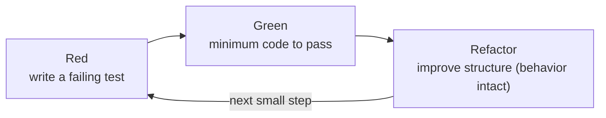
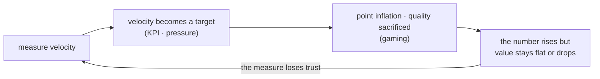

## Introduction

If everything through the [previous post](/en/blog/agile-guide-3) was "what frame do you work in" (Scrum, Kanban), Part 4 takes on two questions that play out inside that frame.

First, <strong>how do you actually build the code in there?</strong> Run every Scrum event you like — if you can't change the code safely and fast, the short iterative loop itself stalls. What owns this "how you build" is XP's engineering practices.

Second, <strong>how do you measure it?</strong> Numbers like story points, velocity, and DORA are useful, but the moment a number becomes a target, the team starts gaming it.

Two warnings run through both questions. <strong>Adopt the process but skip the engineering practices, and Agile collapses</strong> (Section 1). And <strong>when measurement becomes a KPI, the measurement itself breaks</strong> (Section 4). Both are core causes of the fake Agile in Part 5.

The target reader is a team that runs Scrum but is increasingly afraid to touch the code, or someone pressured to use velocity as a productivity metric.

- [Part 1 — Why Agile Emerged — Manifesto · 4 Values · 12 Principles](/en/blog/agile-guide-1)
- [Part 2 — Scrum — Empirical Process Control and the 3-5-3](/en/blog/agile-guide-2)
- [Part 3 — Kanban · Lean · Flow](/en/blog/agile-guide-3)
- <strong>Part 4 — Practices and Measurement — From XP to Velocity · DORA (this post)</strong>
- [Part 5 — Scaling and Fake Agile](/en/blog/agile-guide-5)
- [Part 6 — Hands-On: From User Story to Release](/en/blog/agile-guide-6)

---

## TL;DR

- <strong>XP is the technical heart of Agile</strong> — engineering practices like TDD, CI, refactoring, and pairing keep code "in a state you can keep changing safely." It's the implementation of Part 1's principle 9 (technical excellence enhances agility).
- <strong>Adopt the process but skip the practices, and it collapses</strong> — run only Scrum events and skip the practices, and technical debt piles up, change slows, and the short iterative loop itself stalls. The #1 cause of fake Agile.
- <strong>Story points are relative size, not time</strong> — humans are weak at absolute time estimates but better at relative comparison. You estimate together with planning poker.
- <strong>Velocity is a planning tool, not a KPI</strong> — use it to compare teams or as a productivity target and, by Goodhart's Law, it breaks through point inflation.
- <strong>To measure, look at DORA (DevOps Research and Assessment)</strong> — deployment frequency, change lead time, change failure rate, time to restore. Measure delivery outcomes, not an internal score (velocity). Velocity ≠ value.

---

## 1. XP — The Technical Heart of Agile

### 1.1 What XP Is

<strong>XP (eXtreme Programming)</strong>, distilled by Kent Beck in the late 1990s, is the idea of "pushing good development practices to the extreme." If code review is good, do it continuously (pair programming); if testing is good, write it before the code (TDD); if integration is good, do it many times a day (continuous integration).

XP has five values (communication, simplicity, feedback, courage, respect), but what sets it apart from other frameworks is that it tackles <strong>concrete engineering practices</strong> head-on. If Scrum and Kanban are "how you organize the work," XP is "how you build the code."

### 1.2 Why Engineering Practices Are the Crux

Part 1's principle 9 said "continuous attention to technical excellence and good design enhances agility." That's not decoration — it's a condition for Agile to work.

The core of Agile is changing often in short iterations. But <strong>to change often, the code must stay in a changeable state.</strong> If there are no tests so change is scary, and the structure is so tangled that fixing one place breaks another, then "change often" becomes impossible.

So process and practices are one body. What happens if you adopt only Scrum events (process) and skip TDD, CI, and refactoring (practices)?

- Technical debt piles up and <strong>change gets slower and slower.</strong>
- As change slows, <strong>velocity drops.</strong>
- Unable to change code safely, <strong>the short iterative loop stalls.</strong>

You end up with events running but nothing agile about it. <strong>This is the #1 path by which Agile collapses</strong>, and we meet it again in Part 5 as the core symptom of fake Agile. The process is the skeleton; engineering practices are the muscle that moves it.

---

## 2. The Core Engineering Practices

Here are the six most widely used XP practices today.

| Practice | What | Why it matters |
|---|---|---|
| TDD | Write a failing test first, make it pass, then refactor | Makes change safe and drives the design |
| Continuous Integration (CI) | Integrate small changes into the mainline many times a day | Avoids integration hell, fast feedback |
| Refactoring | Improve internal structure without changing behavior | Keeps code in a state you can keep changing |
| Pair programming | Two people write one piece of code together | Continuous review, knowledge sharing, no silos |
| Simple design (YAGNI, You Aren't Gonna Need It) | Build only what's needed now | Prevents complexity from piling up (Part 1 principle 10) |
| Collective code ownership | Anyone can change any code | Removes bottlenecks and silos |

### 2.1 TDD — Tests Drive the Design

<strong>TDD (Test-Driven Development)</strong> writes the test before the code. It repeats three short steps, Red-Green-Refactor.

The crux is that the tests become a regression safety net that <strong>makes refactoring possible</strong>. With tests behind you, you can improve structure fearlessly, so the code stays "in a state you can keep changing." TDD also dovetails with Part 1's principle 10 (simplicity) — you write only the minimum code to pass the test.

### 2.2 CI and Trunk-Based Development

<strong>Continuous Integration (CI)</strong> is the practice of integrating small changes into a shared mainline often (many times a day) and catching problems immediately with an automated build and tests on every integration.

On the opposite side is the <strong>long-lived branch</strong>. Work separately for weeks, then merge all at once, and conflicts and integration bugs explode at that point (integration hell). So CI usually goes hand in hand with <strong>trunk-based development</strong> — merging to the mainline frequently via short-lived branches.

These practices connect directly to measurement. The more a team integrates and deploys often and small, the better its DORA metrics (deployment frequency, change lead time) from Section 4. <strong>Engineering practices show up as delivery performance.</strong>

---

## 3. Estimation — Story Points and Planning Poker

### 3.1 Why Story Points Aren't Time

The most common misconception is trying to convert "1 story point = N hours." <strong>Story points are not time but relative size</strong> — a "sense of size" of one chunk, combining complexity, uncertainty, and effort.

Why relative size and not time? Because humans are <strong>terrible at absolute time estimates</strong> ("this'll take a few days") but <strong>much better at relative comparison</strong> ("this is about twice that"). So you fix one reference item and size the rest against it.

### 3.2 Planning Poker and Fibonacci

<strong>Planning poker</strong> is a technique for estimating together as a team. Each person reveals a size card simultaneously, and when values diverge, you discuss why. More valuable than the estimate itself is the <strong>difference in understanding</strong> the discussion exposes.

Cards usually use a Fibonacci-like sequence (1, 2, 3, 5, 8, 13, …). The gaps widen as numbers grow, reflecting that larger work carries more uncertainty, making fine distinctions meaningless.

> <strong>Note — #NoEstimates</strong>: a movement that sees estimation as often wasteful. Not "never estimate," but closer to "slice work small and uniform and <strong>forecast from throughput</strong> (count of completed items)." It's the same idea as forecasting from Part 3's flow metrics (throughput, lead time). Read it as a challenge to ask whether detailed estimates really add value.

---

## 4. Measurement — The Velocity Trap and DORA

### 4.1 The Right and Wrong Uses of Velocity

<strong>Velocity</strong> is the sum of story points completed in a sprint. The problem is where you use it.

| Use | Where |
|---|---|
| Right use | Forecasting the team's own capacity for the next sprint (a planning tool) |
| Wrong use | Comparing teams, a productivity KPI, a management target |

Because each team estimates on a different scale, <strong>comparing velocity across teams is inherently impossible</strong> — one team's 8 may be another's 3. It's only meaningful within the same team, to gauge "how much can we take on next."

### 4.2 Goodhart's Law — Measurement Breaks When It Becomes a Target

<strong>Goodhart's Law</strong> warns that "when a measure becomes a target, it ceases to be a good measure." Make velocity a KPI and exactly this happens.

Once it's a target, the team assigns more points to the same work (point inflation) and skips "no-points work" like refactoring and testing. The number rises but real value stays flat or falls. Part 1's principle 7 ("the measure of progress is working software") rings here again — measure progress by working results, not by points.

> <strong>Note — burndown and burnup</strong>: a burndown chart draws remaining work down to zero; a burnup chart stacks completed work up toward a scope line. The burnup also shows scope growth, so it distinguishes "why aren't we done" between not working enough and the scope having grown.

### 4.3 DORA — Four Metrics for Delivery Performance

If velocity is an internal score, the <strong>DORA (DevOps Research and Assessment) four metrics</strong> measure delivery outcomes. Distilled in the *Accelerate* research, they represent software delivery performance.

| Metric | What it measures | Axis |
|---|---|---|
| Deployment frequency | How often you deploy to production | Speed |
| Change lead time | Time from commit to running in production | Speed |
| Change failure rate | Share of deployments that cause a failure | Stability |
| Time to restore (MTTR, Mean Time To Restore) | Time to recover from a failure | Stability |

The first two are speed, the last two stability. The key finding is that <strong>speed and stability don't trade off</strong> — high performers (elite) do well on both. Deploying often and small makes each change small, so failures are fewer and recovery faster. Section 2's CI and trunk-based development are exactly the practices that lift these four metrics.

DORA is more honest than velocity because <strong>it measures actual delivered results, not internal estimates</strong>. "Change lead time" is the same kind of measure as Part 3's flow lead time. Still, even DORA, nailed down as a KPI and forced as a target, can't escape Goodhart's Law. <strong>Measurement should be a signal the team uses to improve itself, not a target imposed from above.</strong>

---

## Recap

The essentials of Part 4, one line each:

- <strong>XP's engineering practices are the technical heart of Agile</strong> — TDD, CI, refactoring, and pairing keep code "in a state you can keep changing safely." This is the substance of Part 1's principle 9 (technical excellence).
- <strong>Adopt the process but skip the practices, and it collapses</strong> — technical debt slows change and the short iterative loop stalls. The #1 cause of fake Agile.
- <strong>Story points are relative size; velocity is a planning tool</strong> — converting to time, or comparing teams, was never the point.
- <strong>When measurement becomes a KPI, Goodhart's Law breaks it</strong> — point inflation and sacrificed quality follow. Measurement should be a signal, not a target.
- <strong>To measure, look at DORA</strong> — deployment frequency, change lead time, change failure rate, time to restore. Measure delivery outcomes, not an internal score; speed and stability don't trade off.

Part 5 is the destination of the series — <strong>Scaling and Fake Agile</strong>. We'll synthesize what gets hard when you scale Agile beyond one team to many (SAFe, LeSS, Spotify, Conway's Law), how the decay signals from Parts 1–4 harden into "fake Agile" in a real team, and how to recover from there.

---

## Appendix

### A. Glossary

| Term | One-line definition |
|---|---|
| XP (eXtreme Programming) | An Agile methodology that pushes good development practices to the extreme (Kent Beck) |
| TDD (Test-Driven Development) | Write a failing test first (Red), make it pass (Green), then improve structure (Refactor) |
| Continuous Integration (CI) | Integrating small changes into the mainline often, validated by automated build and tests each time |
| Trunk-based development | Merging to the mainline frequently via short-lived branches (opposite of long-lived branches) |
| Refactoring | Improving the internal structure of code without changing its behavior |
| Pair programming | Two people writing one piece of code together, reviewing continuously |
| Simple design / YAGNI | Build only what's needed now (You Aren't Gonna Need It, Part 1 principle 10) |
| Story point | Relative size combining complexity, uncertainty, and effort — not time |
| Planning poker | A technique where the team reveals size cards simultaneously and discusses the differences |
| Velocity | The sum of story points completed in a sprint — the team's planning tool, not a productivity KPI |
| Goodhart's Law | The warning that "when a measure becomes a target, it ceases to be a good measure" |
| #NoEstimates | A movement that doubts the value of detailed estimates and forecasts from throughput instead |
| DORA (DevOps Research and Assessment) four metrics | Deployment frequency, change lead time, change failure rate, time to restore — software delivery performance |
| MTTR | Mean Time To Restore — the time to recover from a failure |

### B. External References

- [Extreme Programming Explained (Kent Beck)](https://www.oreilly.com/library/view/extreme-programming-explained/0201616416/) — XP's values and practices
- [Accelerate / DORA State of DevOps](https://dora.dev/) — the DORA four metrics and delivery-performance research
- [Goodhart's Law](https://en.wikipedia.org/wiki/Goodhart%27s_law) — the trap of a measure becoming a target
