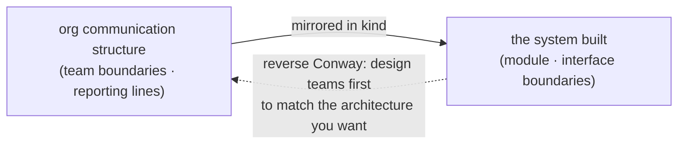
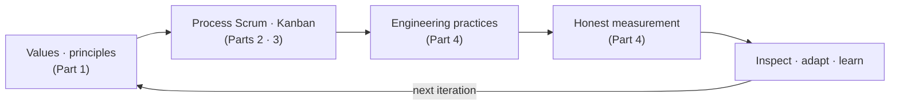

## Introduction

Through the [previous post](/en/blog/agile-guide-4) we covered values (Part 1), Scrum (Part 2), Kanban (Part 3), and practices and measurement (Part 4). All of it assumed <strong>one team</strong>.

In reality two things remain. First, what gets hard when a team grows beyond one into <strong>many teams</strong>. Second, why the Agile you've built so often decays into <strong>"fake Agile,"</strong> and how to climb back out.

Part 5, the destination of the series, synthesizes both. We look at scaling frameworks (SAFe, LeSS, Spotify) and Conway's Law, gather the decay signals scattered across Parts 1–4 into one diagnosis, and close with a recovery prescription. At the end we tie the whole series into one sentence — <strong>Agile is not a toolset to copy but an inspect-and-adapt learning loop.</strong>

The target reader is an organization that tried to run Agile across many teams and only got heavier, or someone wondering "is what we do even real Agile?"

- [Part 1 — Why Agile Emerged — Manifesto · 4 Values · 12 Principles](/en/blog/agile-guide-1)
- [Part 2 — Scrum — Empirical Process Control and the 3-5-3](/en/blog/agile-guide-2)
- [Part 3 — Kanban · Lean · Flow](/en/blog/agile-guide-3)
- [Part 4 — Practices and Measurement — From XP to Velocity · DORA](/en/blog/agile-guide-4)
- <strong>Part 5 — Scaling and Fake Agile (this post)</strong>
- [Part 6 — Hands-On: From User Story to Release](/en/blog/agile-guide-6)
- [Part 7 — Discovery: Where Do User Stories Come From](/en/blog/agile-guide-7)

---

## TL;DR

- <strong>Beyond one team, dependencies, alignment, and integration become the problem</strong> — what worked for one team collapses under cross-team coordination cost. And by Conway's Law, the system mirrors the org structure.
- <strong>Three scaling frameworks dominate</strong> — SAFe (Scaled Agile Framework, prescriptive and hierarchical), LeSS (Large-Scale Scrum, minimal scaling), and the Spotify model (autonomous culture). But "even Spotify doesn't use the Spotify model."
- <strong>The scaling paradox</strong> — pile on coordination to scale Agile, and it turns heavy like waterfall again. Real scaling isn't adding coordination but reducing dependencies.
- <strong>Fake Agile = the form exists but inspection and adaptation are gone</strong> — daily-as-report, sprint-as-mini-waterfall, retro-as-formality, velocity pressure, skipped practices. The decay signals from Parts 1–4, all going off in one team at once.
- <strong>Recovery isn't doing more events</strong> — restore engineering practices first, shrink the learning loop, return measurement to a signal, and re-anchor on the values.

---

## 1. Beyond One Team — The Scaling Problem

Inside one team (5–9 people) almost everything resolves through conversation. You share one goal, sit face to face daily, and unblock on the spot. Parts 1–4 all rested on this premise.

Grow to five, ten, twenty teams and new costs appear.

- <strong>Dependencies</strong> — Team A stalls waiting on Team B's output. As teams grow, the ways they block each other grow combinatorially.
- <strong>Alignment</strong> — getting everyone to face the same direction gets hard. Each team drifts to its own priorities.
- <strong>Integration</strong> — the cost of combining each team's output rises (the org-scale version of Part 4's integration hell).

The decisive insight here is <strong>Conway's Law</strong>. Observed by Melvin Conway in 1967, it states that <strong>"a system's structure mirrors the communication structure of the organization that built it."</strong> Split teams by function (front-end, back-end, DBA — database administrators) and the system splits the same way; if cross-team communication is slow, the interfaces at those boundaries come out flimsy.

So scaling is, before it's a question of "how do I add process," a question of <strong>"how do I draw team boundaries."</strong> Designing teams to fit the architecture you want (the <strong>reverse Conway maneuver</strong>), and designing team types to reduce inter-team dependencies and cognitive load (<strong>Team Topologies</strong>), are extensions of this insight.

---

## 2. Scaling Frameworks — SAFe · LeSS · Spotify

There are many frameworks claiming to handle multi-team Agile; we look at the three representative ones. Their characters differ sharply.

| Framework | One line | Strength | Criticism |
|---|---|---|---|
| SAFe (Scaled Agile Framework) | The most prescriptive and hierarchical (team → program → portfolio) | Provides structure and a common language for big enterprises | Heavy and top-down; large up-front planning turns waterfall-like again |
| LeSS (Large-Scale Scrum) | Scales Scrum with minimal change (one Product Owner, one Product Backlog) | Stays lightweight, true to Scrum | Demands deep org change; few prescriptions make adoption hard |
| Spotify model | The autonomous culture of squads, tribes, chapters, guilds | Famous for emphasizing team autonomy and culture | Just a point-in-time snapshot — "even Spotify doesn't use it" |

Each has its trap.

- <strong>SAFe</strong> sells the most but is criticized the most. When layers like the ART (Agile Release Train, a unit grouping several teams) and PI (Program Increment, a quarterly cadence) planning drift into "giant up-front planning," it becomes waterfall in an Agile name.
- <strong>LeSS</strong> is light, which makes it harder. The org change you must figure out yourself is large, with fewer ready-made procedures than SAFe.
- The <strong>Spotify model</strong> is the most imitated and the most dangerous. A 2012 write-up of one moment in time hardened into a "framework," and Spotify itself doesn't use it as-is. Copying someone else's org chart is Part 1's cargo cult itself.

---

## 3. The Scaling Paradox

The most common failure in scaling is intuitive: <strong>piling on more coordination to scale Agile</strong>. Teams grew so alignment slips — add alignment meetings. Dependencies tangle — add coordinators. Integration breaks — grow the up-front plan.

The end is paradoxical. The Agile you adopted to be faster and more flexible, crushed under the weight of coordination, <strong>turns heavy like waterfall again.</strong> You make a giant plan each quarter, and keeping to that plan becomes the goal.

The fix points the other way. <strong>Real scaling isn't adding coordination — it's reducing the need to coordinate at all.</strong>

- Draw boundaries so teams work <strong>as independently as possible</strong> (use Conway's Law in reverse).
- Structurally reduce inter-team dependencies (clear APIs, platform teams, loose coupling).
- Only then can each team run the small loop of Parts 1–4 as-is.

> <strong>Key</strong>: the scaling frameworks themselves aren't the problem. The problem is the illusion that "installing a framework scales you." A tool can aid the intent to reduce dependencies; it can't substitute for that intent.

---

## 4. Fake Agile — Signals and Diagnosis

Now we collect the foreshadowing laid throughout the series. <strong>Fake Agile is the state where the form (events, frameworks) exists but the substance (inspection, adaptation, values) is gone.</strong> Gather the decay signals scattered across Parts 1–4 in one place and you get a diagnostic table.

| Decay signal | Missing substance | Where covered |
|---|---|---|
| Daily is a status report to a manager | Inspection · adaptation | Part 2 |
| Sprint is a mini-waterfall (plan-only) | Inspection · adaptation | Part 2 |
| Retro is a formality (nothing changes) | Adaptation (learning) | Part 2 |
| Velocity pressured as a productivity KPI | Honest measurement | Part 4 |
| Engineering practices skipped (tech debt) | Technical foundation | Part 4 |
| Command-and-control Scrum (no self-management) | Trust in people | Part 2 |
| "Agile = faster and cheaper" misconception | Understanding the values | Part 1 |

When these go off in one team at once, you get an organization that looks Agile but is a control-driven waterfall inside. It's the finished form of what Part 1 named <strong>cargo cult Agile</strong> — mimicking only the form while dropping the meaning.

There's one more decay at the organizational level: the <strong>Agile Industrial Complex</strong>. Martin Fowler's term for the phenomenon where Agile becomes an industry selling certifications, consulting, and tools, and gets <strong>imposed on teams from above</strong>. The opposite of the manifesto that put "individuals and interactions over processes and tools" (Part 1's first value) — Agile turned into a tool to bludgeon teams.

The key to diagnosis is Part 2's three pillars. Any signal reduces to <strong>which of transparency, inspection, adaptation is missing.</strong> Polishing the form more finely never fixes it — what's missing isn't the form but the substance.

---

## 5. Recovery — How to Climb Back

The prescription for fake Agile is counterintuitive. <strong>It isn't doing more events.</strong> A more frequent daily and a longer retro won't bring back the substance. You have to restore what's missing.

| Prescription | What | Source part |
|---|---|---|
| Restore engineering practices first | Start with TDD, CI, refactoring. If you can't change the code, no loop turns | Part 4 |
| Shrink the learning loop | Make the retro actually change at least one thing | Parts 1 · 2 |
| Return measurement to a signal | Strip away velocity-as-KPI pressure; let DORA and flow metrics be signals the team reads | Parts 3 · 4 |
| Re-anchor on the values | Ask "why are we doing this" against the four values again | Part 1 |

Order matters. <strong>Engineering practices come first.</strong> As Part 4 showed, if you can't change code safely, the short iterative loop itself is impossible, and the rest of the prescription is empty words. Only on the foundation of practices does the inspect-and-adapt loop finally turn.

And all of these prescriptions restore one thing — <strong>restarting a learning loop that had stopped.</strong> Fake Agile is the loop stopped; recovery is the loop restarted.

---

## Recap

The essentials of Part 5, one line each:

- <strong>Beyond one team, dependencies/alignment/integration become the problem, and Conway's Law kicks in</strong> — the system mirrors the org. So scaling is a question of team-boundary design before process.
- <strong>SAFe, LeSS, and the Spotify model differ in character and each has a trap</strong> — copying someone else's org chart, in particular, is cargo cult.
- <strong>The scaling paradox — add coordination and it becomes waterfall again</strong> — real scaling reduces the need to coordinate at all.
- <strong>Fake Agile is the form without inspection and adaptation</strong> — the decay signals of Parts 1–4 going off in one team at once, diagnosed by the three pillars.
- <strong>Recovery isn't doing more events but restoring the substance</strong> — practices first, shrink the learning loop, measurement as a signal, re-anchor on the values.

And to tie the whole series into one sentence: <strong>Agile is not a toolset to copy (events, frameworks) but a loop of inspecting and adapting.</strong> Part 1's values gave the why, Parts 2–3's process gave the skeleton, Part 4's practices and measurement gave the muscle and the dashboard — and all of it was, in the end, in service of turning this one loop. When the loop turns, it's Agile; when it stops, whatever you call it, it's fake Agile.

That's one lap around the concepts of "what Agile is, why it's done that way, and why it breaks." The next post, <strong>Part 6 (hands-on)</strong>, walks how these concepts actually run in order from user story to release — through user stories, acceptance criteria (Given/When/Then), MoSCoW, and MVP, watching the inspect-and-adapt loop make one full turn.

---

## Appendix

### A. Glossary

| Term | One-line definition |
|---|---|
| Conway's Law | The observation that a system's structure mirrors the communication structure of the organization that built it (Melvin Conway, 1967) |
| Reverse Conway maneuver | Designing the organization and team boundaries first to fit the architecture you want |
| Team Topologies | A methodology for designing team types and interactions to reduce inter-team dependencies and cognitive load |
| SAFe (Scaled Agile Framework) | The most prescriptive framework for scaling Agile across team → program → portfolio layers |
| LeSS (Large-Scale Scrum) | A framework that scales Scrum with minimal change, keeping one Product Owner and one Product Backlog |
| Spotify model | A 2012 case of autonomous teams (squads, tribes, chapters, guilds) — not a framework |
| Fake Agile | The state where the form of events/frameworks exists but the substance of inspection, adaptation, and values is gone |
| Agile Industrial Complex | The phenomenon where Agile becomes a certification/consulting/tool industry imposed on teams from above (Martin Fowler) |

### B. External References

- [Conway's Law](https://en.wikipedia.org/wiki/Conway%27s_law) — the relationship between org structure and system structure
- [Team Topologies (Skelton & Pais)](https://teamtopologies.com/) — the reverse Conway maneuver and team-type design
- [Martin Fowler, "The State of Agile Software in 2018"](https://martinfowler.com/articles/agile-aus-2018.html) — the Agile Industrial Complex critique
- [Manifesto for Agile Software Development](https://agilemanifesto.org/) — the starting point of the series, the Agile Manifesto
