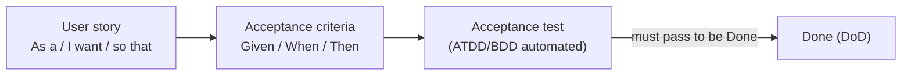
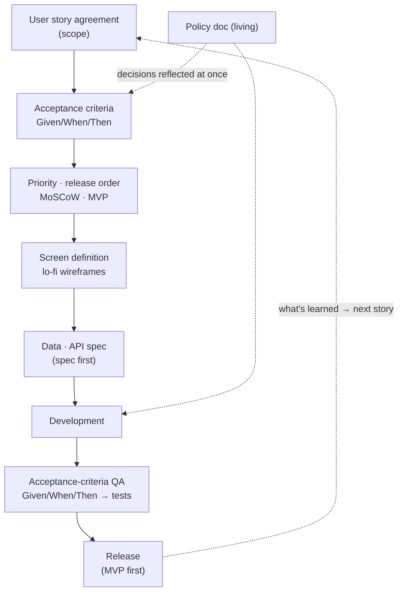

## Introduction

Through the [previous post](/en/blog/agile-guide-5), five parts went once around "what Agile is, why it's done that way, and why it breaks." All of it was <strong>concept</strong>.

But sit down with your team on a Monday morning and the questions get more concrete. "How do I write a story?", "How does an acceptance criterion become a QA test?", "Where does the MVP stop?", "Do we need event storming?" Even knowing the concepts, <strong>the order they run in — from user story to release — has to be drawn out separately</strong> to stick.

Part 6 walks that practical flow once around. It's not a specific business but a general delivery flow that applies to any team. And at each step it maps where the concepts from Parts 1–5 are working. Topics the series hasn't tackled head-on — <strong>user stories, acceptance criteria (Given/When/Then), MoSCoW, MVP, event storming</strong> — get absorbed naturally within this flow.

The target reader is someone who has the concepts but is stuck on "so what does our team do first tomorrow."

- [Part 1 — Why Agile Emerged — Manifesto · 4 Values · 12 Principles](/en/blog/agile-guide-1)
- [Part 2 — Scrum — Empirical Process Control and the 3-5-3](/en/blog/agile-guide-2)
- [Part 3 — Kanban · Lean · Flow](/en/blog/agile-guide-3)
- [Part 4 — Practices and Measurement — From XP to Velocity · DORA](/en/blog/agile-guide-4)
- [Part 5 — Scaling and Fake Agile](/en/blog/agile-guide-5)
- <strong>Part 6 — Hands-On: From User Story to Release (this post)</strong>
- [Part 7 — Discovery: Where Do User Stories Come From](/en/blog/agile-guide-7)

---

## TL;DR

- <strong>Every flow starts from a user story</strong> — "As a…, I want…, so that…" in one line. Not a spec but a promise to talk, with the criteria a good user story should meet and acceptance criteria attached.
- <strong>Acceptance criteria are written as Given/When/Then and carry straight into QA</strong> — they are both the Definition of Done and the seed of the acceptance test (acceptance test-driven development/behavior-driven development). That's what "validate via user stories in QA" means.
- <strong>Prioritize with a must/should/could/won't scheme, size with story points, scope with a minimum viable product</strong> — not building everything and shipping at once, but releasing the most valuable minimum first.
- <strong>Fix the spec (screens, data, APIs) first and build in parallel — but parallel isn't siloed</strong> — the API contract, acceptance criteria, and living policy doc bind backend and frontend together. "Throw the spec over the wall and go quiet" is waterfall.
- <strong>Policy and the data model aren't nailed down all at once</strong> — seeded while writing stories and acceptance criteria, then updated as a living document throughout dev and QA. Fixed, but not frozen.
- <strong>This whole flow is Parts 1–5 in practice</strong> — story → acceptance criteria → priority → spec → dev → QA → release is, in the end, one lap of Part 5's inspect-and-adapt learning loop.

---

## 1. User Story — The Starting Point of Everything

### 1.1 As a / I want / so that

A <strong>user story</strong> describes a feature from the user's perspective in one line. It has a fixed shape.

```text
As a <role>,
I want <goal>,
so that <reason / value>.
```

For example:

```text
As a user, I want to reset my password, so that I can regain access to my account.
```

The key is that a user story <strong>is not a spec</strong>. A story is closer to a promise — "let's be sure to have this conversation later" (a placeholder). So you write it short and fill in the detail with acceptance criteria and conversation. Part 1's first value (individuals and interactions over processes and tools) works here — leave a conversation, not a thick spec.

### 1.2 INVEST — What Makes a Good Story

The checklist for whether a story is good is <strong>INVEST</strong>.

| Letter | Meaning | One line |
|---|---|---|
| Independent | Independent | Can be handled without ordering/dependency on other stories |
| Negotiable | Negotiable | Not a fixed spec but adjustable through conversation |
| Valuable | Valuable | Delivers value to the user/business |
| Estimable | Estimable | Its size can be gauged (Part 4 story points) |
| Small | Small | Finishable within one sprint (or shorter) |
| Testable | Testable | Completion can be verified objectively (→ acceptance criteria) |

Two letters lead straight into what's next. <strong>Independent and Small</strong> breaking is the signal to split a story (Section 1.3); <strong>Testable</strong> leads to the acceptance criteria that judge "done" (Section 2).

### 1.3 Story Splitting — Breaking Up a Compound Story

A story that breaks INVEST's <strong>I (Independent) or S (Small)</strong> — one that won't fit in a sprint, or mixes two kinds of value — gets <strong>split</strong> (story splitting). The moment you think "wait, this user story is really two stories" is exactly that signal.

First, distinguish two kinds of large story (Mike Cohn).

| Kind | Definition | How to split |
|---|---|---|
| <strong>Compound story</strong> | Really several small stories bundled into one | Decompose into the stories inside it |
| <strong>Complex story</strong> | No sub-stories to extract; inherently large (uncertain) on its own | Remove the uncertainty with a spike first, then split |

The common "one story has two stories in it" is exactly a <strong>compound story</strong> (when both are big enough, the umbrella term is an <strong>epic</strong>).

The practical signal is simple: if the story sentence or an acceptance criterion contains <strong>"and,"</strong> it's almost certainly compound. "A user can search <strong>and</strong> save results to favorites" is two stories — search / favorites.

When splitting feels hard, use the <strong>SPIDR</strong> patterns (Richard Lawrence). Pick whichever axis fits.

| Axis | Basis | Example |
|---|---|---|
| <strong>S</strong>pike | Investigate first when uncertain | "Research whether the payment provider integrates" |
| <strong>P</strong>ath | By workflow path | Happy path first, exception flows later |
| <strong>I</strong>nterface | By UI / input method | Web first, mobile and API later |
| <strong>D</strong>ata | By data type / range | Domestic cards first, foreign cards later |
| <strong>R</strong>ules | By business rule | Base discount first, coupon-stacking rules later |

One trap: each split piece must still satisfy INVEST — especially <strong>Valuable</strong>. So <strong>don't split by technical layer</strong> ("frontend / backend / DB"): such a slice delivers no user value on its own. Cut along a <strong>value unit (vertical slice)</strong> that runs from screen to data, so that releasing even one piece lets the user do something.

> <strong>Note</strong>: splitting pairs with prioritization (Section 3). Only after a compound story is broken up can you sort it with MoSCoW — "this piece is a Must, that one a Won't." You can't prioritize one big lump.

---

## 2. From Story to Acceptance Criteria — Given/When/Then

One line of story can't decide "done." So you attach <strong>acceptance criteria</strong> — the list of conditions that, once all met, mean the story is accepted.

Acceptance criteria are commonly written in <strong>Given/When/Then</strong> form. Coming from <strong>BDD (Behavior-Driven Development)</strong>, it separates context, action, and result.

```text
Given a registered email,
When a password reset is requested,
Then an email with a reset link is sent.

Given an expired reset link,
When it is opened,
Then an expiry notice and a re-request button are shown.
```

This form is powerful because <strong>it becomes a test as-is</strong>. Each Given/When/Then line maps to a step of the acceptance test.



Two things lock into the series here. First, acceptance criteria are a concrete form of Part 2's <strong>Definition of Done</strong> — "pass these to count as an Increment." Second, writing the acceptance test first and making it pass is <strong>ATDD (Acceptance Test-Driven Development)</strong>, the acceptance-level version of Part 4's TDD. "Validate via user stories in QA" ultimately means <strong>turning acceptance criteria into tests and checking story by story</strong>.

> <strong>Note</strong>: sometimes an open policy blocks an acceptance criterion ("how many minutes until expiry?"). Decide the policy, write it in the <strong>living policy document</strong>, and reflect that decision into the acceptance criteria. The policy doc isn't written once — it keeps updating as you go (Section 5).

---

## 3. Priority and Release Order — MoSCoW · Story Points · MVP

Once stories pile up, you must decide "what first, what not this time." The most common tool is <strong>MoSCoW</strong>.

| Grade | Meaning | What it means |
|---|---|---|
| Must | Must have | The core without which a release is pointless |
| Should | Should have | Important but the release survives without it |
| Could | Could have | Included if there's room; dropped first |
| Won't | Won't (this time) | Deliberately excluded from scope (for later) |

The key is the last one, <strong>Won't</strong>. Explicitly writing "not this time" is MoSCoW's real value — it executes Part 1's principle 10 (simplicity, minimize the work to be done) at the priority level.

Size with Part 4's <strong>story points</strong> (relative estimation, planning poker), and combine the two to cut the scope of the <strong>MVP (Minimum Viable Product)</strong>. The MVP is "the smallest thing that still delivers value to users and lets you learn." Not building everything and shipping at once (that's waterfall, Part 1), but grouping the Musts to release first and following with the rest.

> <strong>Key</strong>: an MVP is not "a hastily built half." Its scope is narrow, but within that scope it must be a <strong>usable Increment</strong> (Part 2) that meets the acceptance criteria. Narrow, but done right.

---

## 4. Making It Concrete via Screens, Data, and APIs

Once stories and acceptance criteria are set, make them buildable. Order matters.

### 4.1 Lo-Fi Wireframes

First sketch the key screens roughly as <strong>low-fidelity wireframes</strong>. Not color and font, but only "what's on which screen and where it goes." The reason for sketching rough is straight from Part 1's values — getting feedback by showing quickly is cheaper than pouring time into a polished mockup first (the cost-of-change curve).

### 4.2 Spec First — Data and API Specs

Once the screens are set, <strong>fix the entities/fields and agree the API spec first</strong>. The data model doesn't appear out of nowhere at this step — the user stories and domain concepts already hint at "what entities exist," and for a complex domain Section 4.3's event storming feeds the model. This step is where you <strong>fix that accumulated understanding just enough to start</strong>.

Nail down the API contract first and web, app, and server can work <strong>in parallel</strong> — from Part 3's flow perspective, reducing dependencies and removing bottlenecks. But don't mistake "parallel" for "everyone goes quiet on their own"; that distinction is covered separately in Section 5.

Load the data in a <strong>form that's easy to migrate</strong> from the start. Assuming the schema will change (admitting uncertainty, Part 1), pick a structure that's easy to reverse — the data model is fixed, not frozen.

### 4.3 Event Storming — Decide Whether to Use It

<strong>Event storming</strong> is a workshop where you lay out the "events" that happen in a domain on sticky notes and explore the domain together (Alberto Brandolini). It's powerful for getting the team to a shared picture of a complex domain.

But not every project needs it. For a simple domain it's overhead. Treat it as <strong>a tool you pull out only when it pays off</strong> — judge by "is this domain complex enough to be worth mapping together," not by "we're supposed to."

---

## 5. Policy and Collaboration — When to Decide, and How to Go Parallel

Following the steps so far raises two natural questions. "When do we decide policy?" and "Once the spec is handed off, do backend and frontend just go on their own?" These are the two spots that most often go wrong in practice.

### 5.1 Policy Isn't Decided All at Once

Open policies (expiry times, duplicate handling, permission rules) usually surface first <strong>while writing stories and acceptance criteria</strong> — the moment an acceptance criterion stalls on "what happens in this case?" Deciding it, writing it into the <strong>living policy doc</strong>, and reflecting it into the acceptance criteria is the start.

But policy doesn't end there. New gaps keep surfacing during development and QA — edge cases invisible at first show only once you write the code (admitting uncertainty, Part 1). So the policy doc isn't a spec written once and frozen, but a <strong>living document where decisions keep accumulating</strong> throughout. When a new policy is decided, reflect it into the doc immediately and fix the affected acceptance criteria, code, and tests together.

The data model is the same (Section 4.2). It takes shape from user stories and domain concepts and gets fixed at the spec step, but is kept in a migration-easy form — <strong>fixed, but not frozen.</strong>

> <strong>Key</strong>: treating policy and the data model as "must be fully nailed down up front" is waterfall. Plant the seed while writing stories and acceptance criteria, and keep growing it through release.

### 5.2 After the Spec, Parallel Isn't Siloed

Once the API spec is agreed, backend, frontend (and app) run in parallel. The common misconception here is "the spec's handed off, so it's everyone on their own now." That's not parallel but <strong>siloed</strong>, and the moment you integrate, integration hell (Part 4) breaks out.

What separates parallel from siloed is <strong>three shared anchors</strong>.

| Siloed (waterfall / fake Agile) | Parallel (Agile) |
|---|---|
| Nail the whole spec, "throw it over," and go quiet | Agree just enough to start, then go parallel |
| First meeting is at integration → integration hell | Keep aligning via the API contract + acceptance criteria |
| Find out about a policy change much later | The living policy doc reflects to both sides at once |
| Spec is frozen; deviating is wrong | Renegotiate the spec when reality diverges |

The three shared anchors:

- <strong>API contract</strong> — the coordinate that keeps people from waiting on each other (Part 3's flow, reducing dependencies).
- <strong>Acceptance criteria (Given/When/Then)</strong> — backend and frontend aim at the same "definition of done," and QA validates against the same bar (Section 2).
- <strong>Living policy doc + the daily</strong> — sync changed decisions to both sides immediately.

The crux is the same as Part 5's scaling lesson. <strong>Not piling on more coordination, but reducing the need to coordinate — via the contract, acceptance criteria, and policy doc — so each team can move independently and fast.</strong> So it looks like "everyone on their own," but in fact the shared anchors stand in for coordination. Throw the spec over the wall and have everyone go quiet, and that's not parallel — it's waterfall, and fake Agile.

---

## 6. One Lap of Delivery — and the Map to Parts 1–5

Now connect the whole into one flow.



Two dotted lines matter in this picture. The <strong>living policy doc</strong> keeps flowing decisions into both acceptance criteria and development (policies reflected as decided). And what's learned at release returns to the next user story — this is the real-world face of Part 5's <strong>inspect-and-adapt learning loop</strong>.

Mapping each step to the series concept:

| Step | What you do | Connected part |
|---|---|---|
| User story agreement | Fix stories, scope, acceptance criteria | Part 1 value (collaboration) · Part 2 backlog |
| Acceptance criteria · policy | Given/When/Then, promote to policy doc | Part 2 DoD · transparency |
| Priority | MoSCoW · story points · MVP | Part 4 estimation · Part 1 simplicity |
| Wireframes | Lo-fi screens | Part 1 show fast, get feedback |
| Data · API | Spec first · parallelize | Part 3 flow (reduce dependencies) · Part 4 practices |
| QA | Acceptance criteria → acceptance tests | Part 4 TDD/ATDD |
| Dev · release | MVP first · living policy | Part 3 flow · Part 5 learning loop |

The mapping says it plainly. <strong>The practical flow isn't something new — it's Parts 1–5's concepts working in order.</strong> The user story carries "why and for whom" (values), acceptance criteria give "the definition of the end" (DoD), MoSCoW/MVP give "what first" (priority), spec and QA give "how to do it safely" (practices), and release turns "learn and go again" (the learning loop).

---

## Recap

The essentials of Part 6, one line each:

- <strong>The user story is the starting point</strong> — not a spec but a promise to talk (As a/I want/so that), checked with INVEST and given acceptance criteria.
- <strong>Acceptance criteria (Given/When/Then) are the DoD and the seed of QA</strong> — they become acceptance tests as-is (ATDD/BDD); that's what "validate via user stories in QA" means.
- <strong>Cut scope with MoSCoW, story points, and MVP</strong> — especially, making "Won't (this time)" explicit is simplicity in action.
- <strong>Fix the spec first and build in parallel — but parallel isn't siloed</strong> — the API contract, acceptance criteria, and living policy doc bind backend and frontend. Throw it over the wall and go quiet, and that's waterfall.
- <strong>Policy and the data model aren't nailed down all at once</strong> — seeded while writing stories and acceptance criteria, updated as a living doc through release (fixed, not frozen).
- <strong>All of it is one lap of the inspect-and-adapt loop</strong> — the practical flow is just Parts 1–5's concepts working in order.

Part 6 wrapped Part 1's values through Part 5's scaling into one flow, from user story to release. The first step is to look at whether that loop is turning in your team right now, and if it isn't, revive even one step.

But one thing remains — where does that starting point, the user story, even come from? The next post, [Part 7 (Discovery)](/en/blog/agile-guide-7), covers the stretch right before Part 6: the upstream work from problem discovery through research, hypotheses, and opportunities until a user story is born. Joined with Part 6's delivery, it forms one picture — <strong>dual-track Agile</strong> — and that's what closes the series.

---

## Appendix

### A. Glossary

| Term | One-line definition |
|---|---|
| User story | A feature written from the user's perspective as "As a…, I want…, so that…" — a promise to talk, not a spec |
| INVEST | Criteria for a good story — Independent, Negotiable, Valuable, Estimable, Small, Testable |
| Compound story | Several small stories bundled into one — split by decomposing into the stories inside |
| Complex story | Inherently large and uncertain with no sub-stories — remove uncertainty with a spike first |
| Epic | Umbrella term for a story too big to fit in one sprint (covers both compound and complex) |
| Story splitting | Breaking a large story into small value units that each satisfy INVEST |
| SPIDR | Story-splitting patterns — Spike, Path, Interface, Data, Rules |
| Acceptance criteria | The list of conditions a story must meet to be accepted |
| Given/When/Then | A form for writing acceptance criteria as context, action, result (from BDD) |
| BDD (Behavior-Driven Development) | Developing and validating around behavior (scenarios) |
| ATDD (Acceptance Test-Driven Development) | Writing the acceptance test first and making it pass (TDD at the acceptance level) |
| MoSCoW | Priority classification — Must, Should, Could, Won't (this time) |
| MVP (Minimum Viable Product) | The smallest product that still delivers value and lets you learn |
| Lo-fi wireframe | A screen definition sketched roughly with only layout and flow, no color/font |
| Event storming | A workshop laying out domain events on sticky notes to explore the domain together (Alberto Brandolini) |
| Living policy doc | A living document where decided policies and acceptance criteria keep accumulating and updating |

### B. External References

- [Bill Wake, INVEST in Good Stories](https://xp123.com/articles/invest-in-good-stories-and-smart-tasks/) — the source of the INVEST criteria
- [Mike Cohn, User Stories Applied](https://www.mountaingoatsoftware.com/books/user-stories-applied) — user stories in practice, compound vs complex stories
- [Richard Lawrence, Patterns for Splitting User Stories](https://www.richardlawrence.info/2009/10/28/patterns-for-splitting-user-stories/) — story-splitting patterns including SPIDR
- [Dan North, Introducing BDD](https://dannorth.net/introducing-bdd/) — the origin of Given/When/Then and BDD
- [Alberto Brandolini, EventStorming](https://www.eventstorming.com/) — event storming
