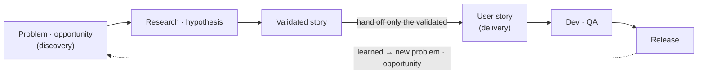
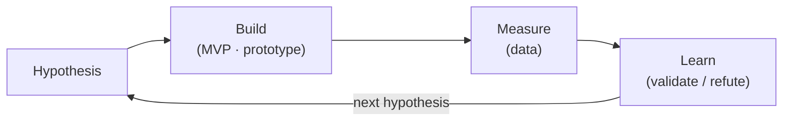
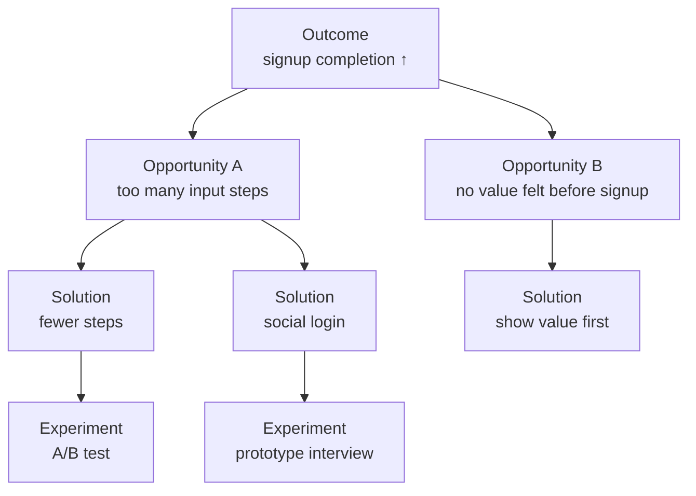
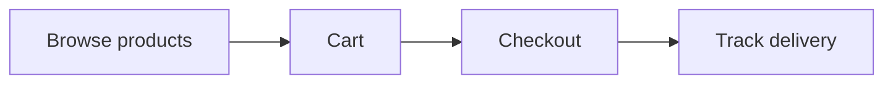
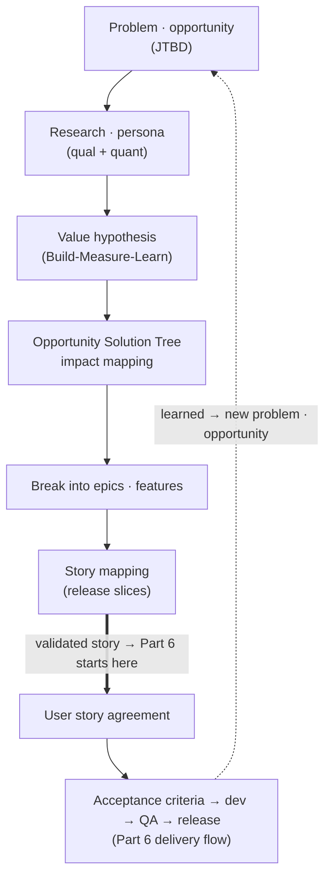

## Introduction

In the [previous post](/en/blog/agile-guide-6) we walked the delivery flow once around, from user story to release. The starting point of that flow was <strong>agreeing on the user story</strong>.

But try to follow it and you get stuck one step earlier. "Who writes that user story, and based on what?" Stories don't fall from the sky. Before them is a step where you <strong>figure out what's worth building</strong>, and the user story is the output of that step. Skip this upstream work and you ship a product that's well built but nobody uses.

Part 7 covers the stretch right before Part 6. It starts at problem discovery and runs through research, hypotheses, and opportunities until a user story is born. If Part 6 was "build the thing right" (delivery), Part 7 is "figure out the right thing to build" (discovery). The picture that joins the two is <strong>dual-track Agile</strong>, and that's what closes the series.

The target reader is someone who read Part 6 and is stuck on "so where does that user story come from." This isn't only the job of a PM or PO. A developer who wants good stories also needs to know how this upstream work runs.

- [Part 1 — Why Agile Emerged — Manifesto · 4 Values · 12 Principles](/en/blog/agile-guide-1)
- [Part 2 — Scrum — Empirical Process Control and the 3-5-3](/en/blog/agile-guide-2)
- [Part 3 — Kanban · Lean · Flow](/en/blog/agile-guide-3)
- [Part 4 — Practices and Measurement — From XP to Velocity · DORA](/en/blog/agile-guide-4)
- [Part 5 — Scaling and Fake Agile](/en/blog/agile-guide-5)
- [Part 6 — Hands-On: From User Story to Release](/en/blog/agile-guide-6)
- <strong>Part 7 — Discovery: Where Do User Stories Come From (this post)</strong>

---

## TL;DR

- <strong>A user story is the output of discovery</strong> — it doesn't fall from the sky. It emerges only after problem discovery, research, hypotheses, and opportunities yield something worth writing down.
- <strong>Start from the problem, not the solution</strong> — "add a social login button" is a solution; "users abandon signup" is the problem. Skip the problem and you just pile up features (the job a customer is actually trying to get done: customers hire a product to get a "job" done).
- <strong>What you know is a hypothesis, not a fact</strong> — validate with qualitative (interviews) and quantitative (data) research. The Build-Measure-Learn loop is the engine of discovery.
- <strong>You don't break the big chunks down all at once</strong> — theme/initiative → epic → feature → story, slicing only the near-term work fine and leaving the far-off in chunks (progressive refinement).
- <strong>Story mapping is the bridge between discovery and delivery</strong> — the horizontal axis is the user journey, the vertical is release slices. The first slice is exactly Part 6's minimum viable product.
- <strong>Discovery and delivery aren't sequential — they run as dual tracks at the same time</strong> — discovery isn't done once; what's learned at release returns as the next problem.

---

## 1. Discovery vs Delivery — Dual-Track Agile

<strong>Discovery</strong> is the step of figuring out "what's worth building." <strong>Delivery</strong> is the step of "building well what's been decided." The user-story-to-release flow Part 6 covered was delivery end to end; Part 7 is the discovery before it.

Split into one line: <strong>delivery is "build the thing right," discovery is "pick the right thing to build."</strong> You need both. Do only delivery well, without discovery, and you ship a flawless product nobody wanted.

### 1.1 The Build Trap — Building Well vs Building the Right Thing

Skip discovery and a team falls into the <strong>build trap</strong> — mistaking "shipping lots of features fast" for success itself (Marty Cagan, Melissa Perri). Speed and output go up, but actual user value or business outcome stays flat.

The way out is simple: redefine success not by the number of features shipped but by <strong>the outcome those features produce</strong>. That requires confirming, before you build, "what problem does this solve, and for whom" — and that's discovery.

### 1.2 Dual-Track — The Two Tracks Run at the Same Time

A common misconception is the sequential model: "finish discovery, then start delivery." That's just waterfall (Part 1). In reality the two tracks run <strong>at the same time</strong>. This is <strong>dual-track Agile</strong> (Jeff Patton, Marty Cagan).



| | Discovery track | Delivery track |
|---|---|---|
| Question | What's worth building | How to build it right |
| Deals with | Problems, hypotheses, opportunities, experiments | User stories, code, tests, releases |
| Does it end? | Never (keeps exploring what's next) | Completes story by story |
| Part 6/7 | Part 7 (this post) | Part 6 |

The crux is the dotted line joining the tracks. What's learned at release returns as the next problem and opportunity, and discovery takes it to explore what to build next. This is Part 5's <strong>inspect-and-adapt learning loop</strong> turning once more at the discovery level. Discovery is the process of admitting uncertainty (Part 1) and chipping away at it.

---

## 2. Start from the Problem — Don't Jump to the Solution

Discovery's first rule is to <strong>put the problem before the solution</strong>. The most common mistake in practice is flipping that order.

```text
Solution jump:  "Add a social login button to the signup screen."
Problem first:  "Users abandon signup partway through. Why?"
```

Social login is a <strong>solution</strong>, not a problem. Define the real problem first ("signup abandonment") and the solutions are many — fewer input steps, guest checkout, showing value first. Lock in a solution up front and all those options vanish.

### 2.1 Problem Statement — Nail It in One Sentence

So discovery starts with a <strong>problem statement</strong> — one or two sentences capturing "who, in what situation, what isn't working, and what harm it causes."

```text
New users abandon during signup because there are too many fields,
and as a result we lose 40% of day-one active users.
```

There's no "how" here yet. Deliberately so. The how is decided in Section 4 (opportunities and solutions).

### 2.2 JTBD — Customers Hire a Product to Get a Job Done

A lens that pushes the problem further into the user's perspective is <strong>JTBD (Jobs to be Done)</strong>. Its core thesis: <strong>customers don't buy a product — they hire it to get a "job" done.</strong>

Clayton Christensen's famous example is the milkshake. People don't buy "a milkshake"; they hire one for the job of "something to make a boring morning commute bearable, that lasts a long time one-handed." The competition isn't other milkshakes but bananas, donuts, and coffee.

This lens is powerful because it strips away the solution trap. Instead of "a tastier milkshake" (solution), it makes you ask "how do I make a boring commute bearable" (the job). Part 1's first value (customer collaboration over contract negotiation) works here — understand the real job the customer is trying to do first.

> <strong>Caution</strong>: a problem statement and JTBD aren't about transcribing "what the user said they want." Users often speak in solutions ("please add a button"). Digging out the job or problem behind it is discovery's work ("what were you trying to do with that button?").

---

## 3. For Whom — Users, Personas, Research

Once the problem is defined, the next question is "whose problem is it?" A product for everyone easily becomes a product for no one.

### 3.1 Personas — Make the Representative User Concrete

A <strong>persona</strong> describes a representative user as a concrete, fictional individual. Not an abstract segment like "office workers in their 20s–40s," but one person with a name, goals, context, and frustrations. It's a tool that makes the team judge while picturing the same person ("would Jisoo actually use that feature?").

### 3.2 Qualitative and Quantitative — Seeing with Two Eyes

A persona is also a hypothesis. Validating it takes research, and research splits into two axes.

| | Qualitative research | Quantitative research |
|---|---|---|
| Answers | Why? In what context? | How much? What percentage? |
| Methods | User interviews, observation, shadowing | Analytics, funnels, A/B data |
| Strength | Depth of motivation and context | Objective scale and trend |
| Weakness | Small sample, risk of overgeneralizing | Can't explain "why" |

The two aren't rivals but complements. Quantitative pins down <strong>where</strong> the problem occurs (40% drop at signup step 3); qualitative explains <strong>why</strong> (entering an address is annoying). Look at only one and you reach a half-baked conclusion.

The crux is simple — <strong>what we know is a hypothesis, not a fact.</strong> The moment you lock a meeting-room guess in as fact, discovery dies. Part 1's spirit (real users in the field over documents in the meeting room) works here as-is.

---

## 4. What's Worth Building — Value Hypotheses and Opportunities

With the problem and the users in hand, now you judge "so what's worth building." Here too, don't jump straight to a solution.

### 4.1 Value Hypothesis and Build-Measure-Learn

When you decide what to build, it isn't certainty but a <strong>value hypothesis</strong> — a claim to be validated: "build this, and this user's problem is solved, producing this outcome." Because it's a hypothesis, you validate it, and the engine for that is the <strong>Lean Startup</strong>'s Build-Measure-Learn loop (Eric Ries).



This loop has the same shape as Part 5's inspect-and-adapt loop. The difference is what it turns on: not "the quality of an already-decided product" but "the hypothesis about what to build." The cheapest minimum that validates a hypothesis is Part 6's <strong>MVP</strong>, and sometimes you validate with a landing page or prototype without a line of code.

### 4.2 Impact Mapping — From Goal to Deliverable

A tool that connects a hypothesis to a business goal is <strong>impact mapping</strong> (Gojko Adzic). Four questions join goal to deliverable in one tree.

| Step | Question | Example |
|---|---|---|
| Why | What's the goal? | Day-one retention +10% |
| Who | Who influences that goal? | New signups, referrers |
| How | How do we change their behavior? | Finish signup faster |
| What | What do we build to do that? | Fewer steps, social login |

The value of impact mapping is that <strong>What (the deliverable) comes last</strong>. Features are derived backward from the goal (Why), not decided first with a goal pinned on after. It's the opposite direction of the build trap (Section 1.1).

### 4.3 Opportunity Solution Tree — One Outcome, Many Opportunities, Many Solutions

A more exploratory tool for the same problem is the <strong>Opportunity Solution Tree</strong> (Teresa Torres). Under one outcome you hang several opportunities (user needs/frustrations), under each opportunity several solutions, and under each solution a validating experiment.



This tree is exactly what blocks the solution jump (Section 2). Instead of fixating on one solution, it lets you see at a glance that "there are several opportunities to reach this outcome, and several solutions per opportunity." Compare, then pick the branch with the best value-to-cost ratio to experiment on.

---

## 5. Breaking Down the Big Chunks — Theme · Epic · Feature · Story

A validated opportunity or solution is still bigger than a user story. You break it down to story size in stages. The common hierarchy:

| Unit | Sense of size | Example |
|---|---|---|
| Theme / initiative | Quarter-to-half-year goal | "Improve new-user onboarding" |
| Epic | Several sprints | "Shorten the signup flow" |
| Feature | One or two sprints | "Social login" |
| User story | One sprint or less | "As a user, I want to log in with Google" |

An <strong>epic</strong> is a bundle of stories too big to finish in one sprint. Being too large, it fails INVEST's Small and Estimable, so you split it into smaller stories before starting work. That splitting point is the entrance down into Part 6's user stories.

### 5.1 Progressive Refinement — Don't Break It All Down at Once

The trap here is "break everything down into fine stories up front and then start." That's a waterfall backlog — detail far-future stories in advance and you'll mostly rewrite them because of what you learn in the meantime.

Instead, use <strong>progressive refinement</strong>. Refine only the near-term work (the next sprint or two) into fine stories, and leave the far-off coarse as epics and themes. Refining the backlog isn't a one-time act but continuous, and it maps directly to Part 2's backlog refinement activity.

> <strong>Key</strong>: a backlog isn't "a spec you fill out once and freeze." It's a <strong>living list</strong> — coarse at the top, finely refined at the bottom (the near-term). Same spirit as Part 6's living policy doc — fixed, but not frozen.

---

## 6. Story Mapping — The Bridge from Discovery to Delivery

Stack the broken-down stories in a flat list and you can't see "in what order, and how far do we bundle for a release." The tool that fixes this is <strong>story mapping</strong> (Jeff Patton).

A story map lays out stories in two dimensions. <strong>The horizontal axis is the user journey</strong> (the order of activities the user does), and <strong>the vertical axis is priority and release slices</strong>.



That top horizontal row is the <strong>backbone</strong> — the big activities of the user journey. Under each activity you stack the stories that make it up, in priority order, and you draw a horizontal line across to slice off "enough to ship this release."

| Release slice | Browse products | Cart | Checkout | Track delivery |
|---|---|---|---|---|
| MVP (slice 1) | Keyword search | Add / remove | Card payment | Check status |
| Slice 2 | Filter · recommend | Wishlist | One-tap pay | Push alerts |
| Later (Won't yet) | Personalized recs | Share cart | Pay with points | Return request |

Here it connects directly to Part 6. <strong>The top row (the MVP slice) is exactly Part 6's MVP, and each cell within it is a user story Part 6 took as its starting point.</strong> Which stories to bundle as Must and ship first (Part 6's MoSCoW/MVP) becomes, on a story map, the act of drawing one horizontal slice line.

A story map beats a flat backlog for two reasons. First, the user-journey context stays alive, so you see at a glance "can the user complete a full lap with this slice?" (the walking skeleton). Second, release slicing is visual, so "what first, what later" reveals itself in a single line.

> <strong>Note</strong>: the first slice of a story map is "the most valuable minimum," not "half of every feature." Even if it's shallow vertically, it must reach end to end horizontally (search → checkout → delivery) so the user can actually use it as an Increment — the same as Part 6's "narrow, but done right."

---

## 7. One Lap of Discovery — and the Connection to Part 6

Now connect all of discovery into one flow, and see how it hands off to Part 6's delivery.



Two things are key in this picture. First, the thick arrow is the <strong>handoff from discovery to delivery</strong> — the validated slice of the story map enters Part 6's "user story agreement" box. Second, the dotted line returns what's learned at release back to problem and opportunity. The two tracks mesh and turn endlessly this way (Section 1.2, dual-track).

Mapping each discovery step to the series concept it touches:

| Discovery step | What you do | Connected part |
|---|---|---|
| Problem · JTBD | Define the problem/job before the solution | Part 1 value (why · collaboration) |
| Research · persona | Validate hypotheses with qual + quant | Part 1 field-first · Part 5 learning |
| Value hypothesis · opportunity | Build-Measure-Learn, opportunity tree | Part 5 inspect-and-adapt loop |
| Epic · feature breakdown | Big chunks → stories, progressive refinement | Part 2 backlog · Part 1 simplicity |
| Story mapping | User journey + release slices | Part 6 MVP · MoSCoW |
| Handoff | Validated story → delivery | All of Part 6 |

The mapping says the same thing Part 6 did. <strong>Discovery isn't something new either — it's Part 1's values (why, for whom) and Part 5's learning loop working at the level of "picking what to build."</strong> If Part 6 turned those concepts at the "building" level, Part 7 turned the same concepts once around at the "picking" level.

---

## Recap

The essentials of Part 7, one line each:

- <strong>A user story is the output of discovery</strong> — it doesn't fall from the sky. It's made through problem → research → hypothesis → opportunity → breakdown.
- <strong>Start from the problem, not the solution</strong> — catch "the job the customer is really trying to do" with JTBD and you avoid the solution jump and the build trap.
- <strong>What you know is a hypothesis, not a fact</strong> — validate with qualitative and quantitative research, and turn hypotheses with the Build-Measure-Learn loop.
- <strong>Break the big chunks down progressively</strong> — theme, epic, feature, story; only the near-term fine. A backlog is a living list, not a frozen spec.
- <strong>Story mapping is the bridge between the two tracks</strong> — horizontal is the journey, vertical is release slices. The first slice is Part 6's MVP.
- <strong>Discovery and delivery run as dual tracks at the same time</strong> — the discovery version of Part 5's learning loop, where what's learned at release returns as the next problem.

This truly closes the <strong>Practical Guide to Agile</strong> series. Starting from Part 1's values, through Parts 2–3's process, Part 4's practices and measurement, Part 5's scaling and fake Agile, and Part 6's delivery flow, Part 7 filled in discovery — the starting point of every flow. If Part 6 was "from user story to release," Part 7 is "from problem to user story," and joining the two completes the full lap from problem to release. One thing remains — look at whether both tracks are turning together in your team right now, or whether only delivery is busy while discovery has stalled.

---

## Appendix

### A. Glossary

| Term | One-line definition |
|---|---|
| Discovery | The step of figuring out "what's worth building" — problems, hypotheses, opportunities, experiments |
| Delivery | The step of "building well what's been decided" — stories, code, tests, releases (Part 6) |
| Dual-track Agile | Running the discovery and delivery tracks at the same time, not sequentially |
| Build trap | Mistaking output (feature count, shipping speed) for outcome |
| Problem statement | One or two sentences on who, in what situation, what isn't working, and what harm it causes |
| JTBD (Jobs to be Done) | The lens that customers don't buy a product but hire it to get a "job" done |
| Persona | A representative user described as a concrete fictional individual with a name, goals, and context |
| Qualitative research | Research seeing "why / in what context" in depth via interviews and observation |
| Quantitative research | Research seeing "how much / what %" objectively via analytics, funnels, A/B |
| Value hypothesis | The claim to be validated: "build this and this problem is solved, producing this outcome" |
| Lean Startup / Build-Measure-Learn | Validating a hypothesis by building a minimum (MVP) and learning from measurement (Eric Ries) |
| Impact mapping | A tree joining goal to deliverable via Why → Who → How → What (Gojko Adzic) |
| Opportunity Solution Tree | A tree exploring solutions via outcome → opportunity → solution → experiment (Teresa Torres) |
| Theme / initiative | A large goal bundle at the quarter-to-half-year scale |
| Epic | A bundle of stories too big to finish in one sprint |
| Feature | A capability smaller than an epic and larger than a story, at the one-to-two-sprint scale |
| Story mapping | Laying out stories in 2D — horizontal = user journey, vertical = release slices (Jeff Patton) |
| Backbone | The row of big user activities along a story map's horizontal axis |
| Walking skeleton | A minimal working slice that goes thinly end to end across the journey |
| Progressive refinement | Running a backlog by refining only the near-term fine, leaving the far-off coarse |
| MVP (Minimum Viable Product) | The smallest product that still delivers value and lets you learn (Part 6) |
| MoSCoW | Priority classification — Must, Should, Could, Won't (this time) (Part 6) |
| INVEST | Criteria for a good story — Independent, Negotiable, Valuable, Estimable, Small, Testable (Part 6) |

### B. External References

- [Jeff Patton, User Story Mapping](https://www.jpattonassociates.com/the-new-backlog/) — the source of story mapping
- [Teresa Torres, Continuous Discovery Habits](https://www.producttalk.org/opportunity-solution-tree/) — the Opportunity Solution Tree
- [Marty Cagan, Inspired / SVPG](https://www.svpg.com/) — product discovery and dual-track
- [Gojko Adzic, Impact Mapping](https://www.impactmapping.org/) — impact mapping
- [Eric Ries, The Lean Startup](http://theleanstartup.com/) — Build-Measure-Learn, MVP
- [Clayton Christensen, Competing Against Luck](https://claytonchristensen.com/books/competing-against-luck/) — JTBD and the milkshake case
