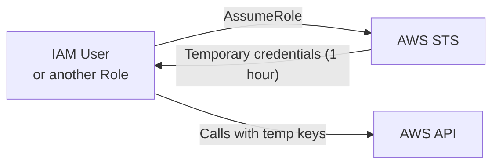
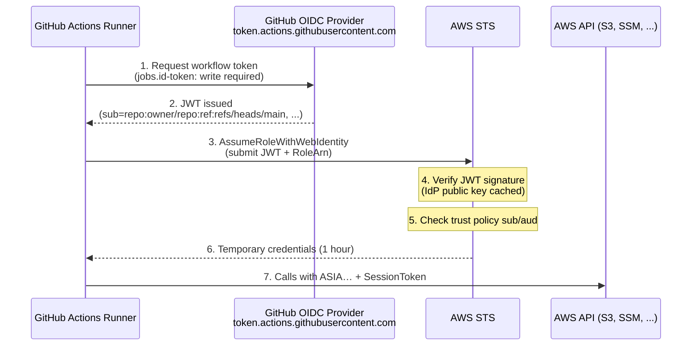
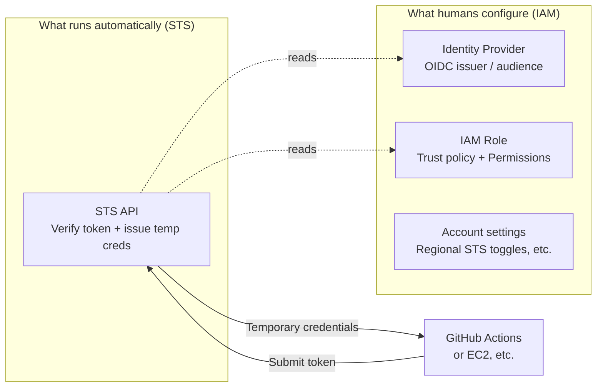
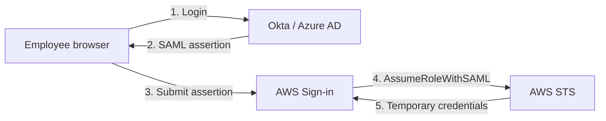
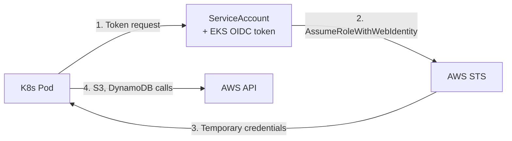

## Introduction

[AWS Private EC2 Operations Guide Part 4](/blog/en/aws-private-ec2-guide-4) introduces OIDC federation as the way to permanently delete AWS access keys from GitHub Actions. The recipe works if you follow it — but surprisingly few engineers can draw what's actually happening underneath.

The four most common questions:

- <strong>What is OIDC federation, exactly, and why is the word "federation" attached?</strong>
- <strong>Why does STS have no standalone console page? Where do you actually configure it?</strong>
- <strong>Why is the `sub` condition in the trust policy emphasized so heavily?</strong>
- <strong>Where else does federation show up beyond GitHub Actions? (SAML, IAM Identity Center, EKS IRSA, Cognito…)</strong>

This post answers all four in one place. If Part 4 was about "how to apply this pattern to our environment," this one is <strong>"what parts fit together underneath, and how"</strong>. By the end you can diagnose Part 4, EKS, cross-account AssumeRole, and corporate SSO with the same mental model.

The target reader is <strong>someone who has used AWS for a while but never built a foundational understanding of IAM, STS, and OIDC</strong>. You don't need to have read the AWS Private EC2 series, but pairing this post with Part 4's OIDC section gives you the abstraction and the implementation at the same time.

---

## TL;DR

- <strong>Every AWS credential flow ultimately funnels into STS.</strong> STS = Security Token Service, a stateless API that issues temporary credentials. EC2 instance profiles, OIDC, SAML, IAM Identity Center — all of them end with an STS call.
- <strong>Long-lived keys (`AKIA…`) → short-lived keys (`ASIA…`) + SessionToken</strong> is the major direction in AWS credential security. Temporary keys expire on their own, and incident blast radius decays naturally with time.
- <strong>"Federation" means AWS trusts the identity verification done by an external provider</strong> and issues temporary credentials based on that trust. OIDC, SAML, and Cognito are all variants of this pattern.
- <strong>STS itself has nothing to configure.</strong> The lack of a standalone console page is not a bug — it's by design. What people call "STS configuration" is entirely IAM work: identity providers, roles, and trust policies.
- <strong>The `sub` condition in the trust policy is the lock on federation.</strong> Drop it and any external identity trusted by the same provider can assume your role — the number-one cause of OIDC incidents.

---

## 1. The Evolution of Credentials — Why Federation Exists

### 1.1 The starting point — IAM User + long-lived access key

Early AWS credential models were straightforward. <strong>You created an IAM User, generated an access key pair, and embedded it in your application.</strong> Keys were valid forever, and one key equaled one identity.

```hcl
# Legacy approach
resource "aws_iam_user" "ci"        { name = "github-ci" }
resource "aws_iam_access_key" "ci"  { user = aws_iam_user.ci.name }
# AccessKeyId / SecretAccessKey stored in GitHub Secrets
```

Familiar but accumulates four pain points in production:

| Problem | What it actually looks like |
| --- | --- |
| <strong>Unbounded validity</strong> | A key pushed to git or caught in a screenshot is a permanent breach until manually revoked |
| <strong>Sharing is hard</strong> | One person's key embedded in many places must be rotated everywhere simultaneously |
| <strong>Limited traceability</strong> | CloudTrail only tells you "which IAM User called" — not which workflow / instance / session |
| <strong>No time-bounded permissions</strong> | "Read-only most of the time, write only during deploy" can't be expressed at the key level |

### 1.2 One step forward — IAM Role

To address these pain points, AWS introduced <strong>IAM Roles</strong>. A Role is <strong>a "persona that holds permissions"</strong> — no long-lived key attached, and a Trust Policy defines who (which Principal) can borrow it temporarily.



Three pivotal changes:

- <strong>You can borrow a Role without long-lived keys</strong> — EC2 instance profiles are the canonical example.
- <strong>Permissions are issued in time-bounded grants</strong> — automatic expiry after one hour, automatic rotation.
- <strong>Calling context becomes rich</strong> — CloudTrail records who assumed which Role under which session name.

But Roles still have a limit. <strong>Calling AssumeRole still requires that someone has credentials to start with.</strong> EC2 has the instance profile (IMDS); a local machine has IAM User keys. So Roles only cover <strong>"flows that originate inside AWS."</strong> What about identities outside AWS (GitHub Actions workflows, corporate SSO users, mobile app users)?

### 1.3 Federation — accepting identities from outside AWS

The answer is to <strong>have AWS trust an external Identity Provider (IdP)</strong>. The IdP issues a signed proof saying "this user/workflow has been verified by us," AWS receives the proof, and STS issues temporary credentials in return. This model is <strong>federation</strong>.

The mental model flips once here. <strong>Federation isn't "register users in AWS" — it's "trust an identity system outside AWS."</strong> If 1.1's IAM User approach means creating 100 IAM Users for 100 employees, federation lets AWS accept identities that already live in the company SSO (Okta, Azure AD), keeping just <strong>one IdP registration and a handful of Roles</strong> in IAM. AWS doesn't know those 100 people as IAM Users — it only holds rules like "if a token signed by Okta with `sub = X` arrives, lend out this Role for one hour."

> <strong>Note</strong>: IAM Identity Center (formerly AWS SSO) <strong>looks like console login</strong> on the surface — there's a browser sign-in page. But what happens behind it is federation. Users are not registered as IAM Users; STS mints fresh temporary credentials on every sign-in.

| Federation type | IdP examples | AWS API |
| --- | --- | --- |
| <strong>OIDC</strong> | GitHub Actions, GitLab, EKS, Auth0 | `AssumeRoleWithWebIdentity` |
| <strong>SAML 2.0</strong> | Okta, Azure AD, ADFS, Google Workspace | `AssumeRoleWithSAML` |
| <strong>Cognito Identity Pool</strong> | Cognito User Pool, social login | `GetCredentialsForIdentity` |
| <strong>IAM Identity Center</strong> | AWS-managed directory or external IdP | Console / CLI handles automatically |

The names vary, but <strong>the essence is identical</strong>:

1. An external IdP verifies the user / workflow's identity.
2. It issues a signed token (JWT, SAML assertion, etc.).
3. AWS STS validates the signature and conditions on that token.
4. STS issues temporary credentials.

This flow is <strong>the standard for AWS credential operations in 2026</strong>. Long-lived keys are increasingly an anti-pattern.

### 1.4 Aside: OAuth 2.0 / OIDC / SAML — where each one sits

Three protocols keep showing up in federation discussions. Mixing them up muddies later sections, so a quick orientation:

| Protocol | Original purpose | Usable for sign-in alone? | Where it shows up in AWS |
| --- | --- | --- | --- |
| <strong>OAuth 2.0</strong> | API call <strong>authorization</strong> — "let this app read the user's Drive" | ❌ no standard for representing the user's identity | Not used directly |
| <strong>OIDC</strong> | An <strong>authentication layer</strong> built on top of OAuth 2.0. An `id_token` (JWT) proves who the user is | ✅ | GitHub Actions, EKS IRSA, Cognito — machine/app federation (§3) |
| <strong>SAML 2.0</strong> | XML-based SSO standard. Predates OAuth | ✅ | Okta, Azure AD, Google Workspace → IAM Identity Center / console sign-in (§5.1, §5.2) |

Two takeaways:

- <strong>"OAuth2 vs SAML" is the wrong framing.</strong> OAuth 2.0 is an authorization framework — by itself it has no notion of "who the user is." The correct comparison is <strong>"OIDC vs SAML"</strong>, and OAuth 2.0 is the substrate underneath OIDC.
- <strong>AWS picks one protocol per scenario.</strong> Humans signing into the console go through SAML; CI / Pods / apps calling the API go through OIDC. Same federation idea, but different entry APIs (`AssumeRoleWithSAML` vs `AssumeRoleWithWebIdentity`).

---

## 2. STS — the Issuance Counter for Temporary Credentials

### 2.1 What STS is, and why you don't see it

<strong>STS (Security Token Service)</strong> is AWS's <strong>"API service dedicated to issuing temporary credentials"</strong>. Whenever any AWS service validates credentials, the issuance step at the end was STS.

A summary:

| Aspect | Detail |
| --- | --- |
| Role | Issues temporary credentials |
| State | Stateless — does not store the issued tokens |
| Endpoint | `sts.amazonaws.com` (global) or `sts.<region>.amazonaws.com` (regional) |
| Resources to create | <strong>None</strong> |
| Console page | <strong>None</strong> (only a few settings live inside IAM) |
| Cost | Calls themselves are free |

If other AWS services are buildings, STS is closer to <strong>"the badge issuance counter inside the building"</strong>. You stop by, get a pass, and leave — there's nothing to build or store there. That's why "STS" returns nothing useful in the console search bar.

### 2.2 Four issuance APIs

STS APIs split into four actions based essentially on <strong>"who's collecting the token"</strong>.

| API | Caller | Scenario |
| --- | --- | --- |
| `AssumeRole` | Another IAM User / Role | Cross-account, privilege escalation |
| `AssumeRoleWithWebIdentity` | <strong>OIDC token holder</strong> | <strong>GitHub Actions, EKS Pod</strong> |
| `AssumeRoleWithSAML` | SAML assertion holder | Console login from corporate SSO |
| `GetSessionToken` | The IAM User itself | Enforce MFA, convert one's own keys to temporary |

The most common in this article is the second — <strong>`AssumeRoleWithWebIdentity`</strong>. The GitHub Actions OIDC flow in Part 4 is exactly that call. EKS IRSA (service account federation) uses the same API.

### 2.3 What temporary credentials look like

When issued, they look like this:

```json
{
  "AccessKeyId": "ASIAXXXX...",
  "SecretAccessKey": "abc123...",
  "SessionToken": "FwoGZXIvYXdzE...",
  "Expiration": "2026-04-28T11:30:00Z"
}
```

Two decisive differences from long-lived keys:

- <strong>The `SessionToken` field is added.</strong> You must include it on AWS API calls or validation fails. After expiry, it's rejected.
- <strong>The Access Key prefix is `ASIA…`.</strong> Long-lived keys start with `AKIA…`. The prefix alone tells you at a glance whether a credential is permanent or temporary.

> <strong>Key point</strong>: from a security standpoint, the core value of temporary credentials is <strong>"blast radius that decays with time"</strong>. Long-lived keys accumulate damage until the breach is discovered; temporary keys simply die on their own. You're outsourcing the operational burden to time itself.

---

## 3. How OIDC Federation Actually Works

### 3.1 What OIDC is

<strong>OIDC (OpenID Connect)</strong> is an authentication standard layered on top of OAuth 2.0. The relevant piece for us is its core: <strong>"a short-lived JWT signed by a trusted issuer"</strong>.

A JWT splits into three parts (delimited by `.`):

```text
eyJhbGciOiJSUzI1NiIs...     ← Header (signing algorithm)
.eyJzdWIiOiJyZXBvOl...      ← Payload (sub, aud, exp claims)
.SflKxwRJSMeKKF2QT4f...     ← Signature (signed with IdP's private key)
```

AWS validates two things:

- <strong>Does the signature verify against the IdP's public key</strong> — confirming the IdP actually issued the token.
- <strong>Do the `sub` and `aud` claims in the payload match the trust policy's conditions</strong> — confirming "this is the workflow/repo I authorized."

### 3.2 Decomposing the GitHub Actions → AWS flow



The decisive branch is <strong>step 5</strong>. STS reads the IAM Role's trust policy and checks the JWT's claims against the conditions. A mismatch means rejection in step 6.

### 3.3 The trust policy — `sub` and `aud`

A typical trust policy:

```json
{
  "Version": "2012-10-17",
  "Statement": [{
    "Effect": "Allow",
    "Principal": {
      "Federated": "arn:aws:iam::123456789012:oidc-provider/token.actions.githubusercontent.com"
    },
    "Action": "sts:AssumeRoleWithWebIdentity",
    "Condition": {
      "StringEquals": {
        "token.actions.githubusercontent.com:aud": "sts.amazonaws.com"
      },
      "StringLike": {
        "token.actions.githubusercontent.com:sub": "repo:rhcwlq89/myrepo:ref:refs/heads/main"
      }
    }
  }]
}
```

The two key condition keys:

- <strong>`aud` (audience)</strong> — "Who is the intended recipient of this token?" When GitHub Actions mints a token for AWS STS, it stamps `aud=sts.amazonaws.com`. The first lock against someone bringing a token meant for another system and using it to assume an AWS role.
- <strong>`sub` (subject)</strong> — "Who is allowed to claim this token?" GitHub Actions formats `sub` as `repo:<owner>/<repo>:ref:<ref>` or `repo:<owner>/<repo>:environment:<env>`. <strong>Without narrowing this, every GitHub repo trusted by the same OIDC provider can pull your token.</strong>

### 3.4 The most common incident — missing `sub`

The number-one incident pattern in production:

```json
"StringLike": {
  "token.actions.githubusercontent.com:sub": "repo:*"
}
```

Or a trust policy with no `sub` condition at all. With this, <strong>any workflow run from any GitHub repository</strong> can assume the role through your OIDC provider. Someone could mint an `aud=sts.amazonaws.com` token from their own repo, target your role ARN, and walk into your account.

The correct pattern:

```json
"StringLike": {
  "token.actions.githubusercontent.com:sub": [
    "repo:rhcwlq89/myrepo:ref:refs/heads/main",
    "repo:rhcwlq89/myrepo:environment:prod"
  ]
}
```

Tighten down to repo + branch + environment. Splitting PR-build roles from prod-deploy roles is part of the same hygiene.

> <strong>Caution</strong>: Use `StringLike` (rather than `StringEquals`) only when environment matching genuinely requires wildcards (`repo:owner/repo:environment:prod*`). For exact matches, prefer `StringEquals` — it removes the wildcard footgun.

### 3.5 How signature verification actually works — RS256, JWKS, and why KMS isn't involved

Step 4 of the §3.2 sequence diagram ("verify JWT signature") was a single line, but what happens inside is the heart of the OIDC security model. Let's go one level deeper.

<strong>① How the signature is created</strong>

A GitHub OIDC Provider holds an RSA key pair.

- <strong>Private key</strong> — held only by GitHub, used to generate signatures when issuing tokens
- <strong>Public key</strong> — anyone can fetch it, used only for verification

The algorithm is <strong>RS256</strong> (RSA + SHA-256). The flow:

1. SHA-256 hash of `header.payload` (the first two dot-separated segments)
2. Encrypt the hash with GitHub's private key — that's the signature (the third segment)
3. AWS hashes the same `header.payload`
4. Decrypt the signature with GitHub's <strong>public key</strong>
5. If the two hashes match, verification passes

The asymmetry is the whole point. <strong>Generating a signature requires the private key</strong>, but <strong>verifying only needs the public key</strong>. AWS can verify with the public key but cannot forge new signatures with it.

<strong>② How AWS gets GitHub's public key — JWKS</strong>

Standard OIDC discovery, in three lines:

```text
https://token.actions.githubusercontent.com/.well-known/openid-configuration
   → jwks_uri field points to:
   → https://token.actions.githubusercontent.com/.well-known/jwks
   → { "keys": [ { "kty": "RSA", "kid": "...", "n": "...", "e": "AQAB" }, ... ] }
```

AWS STS periodically fetches and caches this JWKS. When a token arrives, STS reads the `kid` in its header to identify which key signed it, then verifies with the cached public key.

> <strong>Note</strong>: humans don't register the public key in IAM. STS derives the JWKS location from the OIDC Provider's URL alone and fetches it automatically.

<strong>③ STS does not use KMS — a common point of confusion</strong>

After reading the above, a natural question arises — <strong>"isn't signing/verifying = KMS?"</strong> The answer is a clear <strong>no</strong>.

| Operation | Tool used | KMS? |
| --- | --- | --- |
| GitHub signs the JWT | RSA private key in GitHub's internal HSM | <strong>N/A</strong> (outside AWS) |
| AWS verifies the JWT | Cached GitHub public key + standard library | <strong>No</strong> |
| Client signs AWS API requests | SecretAccessKey + HMAC-SHA256 (SigV4) | <strong>No</strong> |
| SessionToken integrity | AWS internal infrastructure (opaque) | <strong>No</strong> (not customer KMS) |

KMS shows up when <strong>"the application layer encrypts / decrypts / signs data"</strong>: S3 SSE-KMS, RDS encryption, Secrets Manager secret decryption, KMS Sign API for digitally signing documents — that domain.

The signatures in the credential issuance flow use only <strong>public-key verification (JWT)</strong> or <strong>HMAC (SigV4)</strong>. KMS doesn't appear anywhere in that chain. <strong>STS is the badge issuance counter; KMS is the vault</strong> — both are security infrastructure, but they handle different jobs.

### 3.6 What signature verification doesn't catch — the real role of `exp`, `aud`, and `sub`

Signature verification is powerful but only catches <strong>tampering</strong>. The JWT security model addresses other threats with separate mechanisms.

| Threat | Caught by signature alone? | Mitigation |
| --- | --- | --- |
| <strong>Tampering</strong> | ✅ | RS256 itself |
| <strong>Token theft & replay</strong> | ❌ | Short <strong>`exp`</strong> (5–15 min) |
| <strong>Reusing tokens for other systems</strong> | ❌ | <strong>`aud`</strong> validation |
| <strong>Reusing tokens from other repos / branches</strong> | ❌ | <strong>`sub`</strong> condition (trust policy) |
| <strong>`alg: none` bypass</strong> | ❌ | Library's algorithm allowlist |
| <strong>JWKS endpoint forgery</strong> | ❌ | HTTPS certificates + Provider thumbprint |

Briefly on each.

<strong>① Tampering — fully covered by signature</strong>

If an attacker changes a single byte in the payload, the SHA-256 hash changes. The original signature won't match the new hash, so verification fails. <strong>Forging a valid signature requires GitHub's private key</strong>, which exists only inside GitHub's infrastructure. Brute-forcing RSA-2048 takes universe-lifetime scales — effectively impossible.

<strong>② Theft and replay — `exp` shrinks the window</strong>

What if an attacker grabs a valid JWT from someone's workflow logs? The signature is valid, so AWS will accept it. That's why GitHub OIDC tokens carry a short <strong>`exp` of 5–15 minutes</strong>. The window for stolen-token use is narrow. AWS STS always checks `exp` as part of verification.

<strong>③ Tokens minted for other systems — `aud` blocks them</strong>

GitHub Actions can mint OIDC tokens for <strong>multiple destination systems</strong> in the same workflow — `aud=sts.amazonaws.com` for AWS, `aud=api://AzureADTokenExchange` for Azure, etc. AWS STS rejects tokens whose `aud` isn't its own. An Azure-bound token cannot be reused to assume an AWS role.

<strong>④ Tokens from other repos — `sub` is the lock</strong>

All GitHub repos receive tokens through the same OIDC provider. The signature can be perfectly valid even when `sub` is from someone else's repo. The IAM Role's trust policy must reject those. <strong>The missing-`sub` incident from §3.4 is exactly this lock unlocked</strong> — a perfectly-signed token from another repo just walks through.

<strong>⑤ `alg: none` bypass — a historical pitfall</strong>

The JWT spec includes an `alg: none` option (no signature). Some older libraries treated this as "verification passed" and accepted unsigned tokens. An attacker would set the header to `{"alg":"none"}`, blank out the signature, and slip through. Every well-built verifier today (AWS included) uses an <strong>algorithm allowlist</strong> (e.g., RS256-only) and rejects `none`.

<strong>⑥ JWKS endpoint forgery — the certificate trust chain</strong>

The deepest layer. For signature verification to be meaningful, <strong>AWS must hold the genuine GitHub public key</strong>. If an attacker could intercept the connection and inject a fake public key, they could mint their own valid signatures freely. Two safeguards prevent this:

- <strong>HTTPS / TLS certificates</strong>: AWS validates the standard TLS chain when fetching JWKS, blocking man-in-the-middle attacks.
- <strong>OIDC Provider thumbprint</strong>: registering the provider in IAM pins GitHub's certificate thumbprint (the `thumbprint_list` field in [Part 4](/blog/en/aws-private-ec2-guide-4)'s Terraform). If the cert changes unexpectedly, the call is rejected. AWS now auto-validates this so it's largely vestigial, but the original intent was this layer of defense.

<strong>Summary — JWT security is a five-piece set</strong>

Signature verification is sufficient and powerful for tampering. But it doesn't cover token theft, context misuse, `alg: none` bypass, or JWKS forgery on its own. So the OIDC security model relies on:

- <strong>Signature verification (RS256)</strong> — prevents tampering
- <strong>Short `exp`</strong> — narrows theft windows
- <strong>`aud` validation</strong> — blocks cross-system token misuse
- <strong>`sub` condition</strong> — blocks other identities sharing the same IdP
- <strong>Algorithm allowlist + JWKS HTTPS trust</strong> — prevents bypass and forgery

All five together. Drop any one and the whole posture weakens — which is why [Part 4](/blog/en/aws-private-ec2-guide-4) emphasized the missing-`sub` case so heavily.

---

## 4. Where Do You Configure STS — the Mental Model of an "Invisible" Service

### 4.1 STS itself has nothing to configure

Search "STS" in the console and no standalone page appears. That's correct. STS is <strong>an always-on global API server</strong> with no resources for humans to touch.

| What humans configure | Console location |
| --- | --- |
| Register an OIDC Identity Provider | <strong>IAM → Identity providers</strong> |
| Create the IAM Role to be assumed | <strong>IAM → Roles → Create role → Web identity</strong> |
| Trust policy with `sub` condition | <strong>IAM → Roles → that Role → Trust relationships</strong> |
| Attach permission policies | <strong>IAM → Roles → that Role → Permissions</strong> |
| Issue temporary credentials | <strong>No setting — done at runtime</strong> |

In other words, <strong>everything you call "OIDC configuration" is IAM work</strong>. There is no STS menu anywhere.

### 4.2 The three settings genuinely related to STS

Three places hold settings that actually affect STS behavior.

<strong>① IAM → Account settings → Security Token Service</strong>

Toggles to enable or disable the STS endpoint per region. Defaults are all enabled. Some teams disable STS in regions they don't use as a hardening step. The same screen has a <strong>global endpoint token compatibility v1/v2</strong> setting — new accounts default to v2 (region-bound tokens).

<strong>② Maximum session duration on an IAM Role</strong>

Console: IAM → Roles → that Role → Edit. Sets the maximum lifetime of temporary credentials issued by AssumeRole, between 1 and 12 hours. Default is 1 hour. CI/CD roles typically stay at 1 hour; manual operator roles often run 4–8 hours.

<strong>③ Organizations SCP — restricting STS calls themselves</strong>

In multi-account setups, this is where you place guardrails like <strong>"accounts in this OU may not AssumeRole into external OIDC providers."</strong> Irrelevant for single-account setups.

### 4.3 The mental model — humans vs. runtime



The <strong>"What humans configure (IAM)" box</strong> is what we touch in the console or Terraform; the <strong>"What runs automatically (STS)" box</strong> runs on its own at request time. STS is just that single box — your intuition that it's "invisible" was correct.

---

## 5. Federation Patterns Beyond OIDC

The same federation skeleton appears in many contexts as variants. Once you see where STS and IAM Role sit in each, you won't get lost when you encounter the next one.

### 5.1 SAML 2.0 — corporate SSO into the AWS Console

Logging into the AWS Console via Okta, Azure AD, or Google Workspace.



Only the token format differs — XML-based SAML assertion instead of a JWT. The skeleton is identical to OIDC. The AWS API is `AssumeRoleWithSAML`.

### 5.2 IAM Identity Center (formerly AWS SSO)

AWS's own SSO solution. Internally it's <strong>a layer that maps IAM Roles across multiple accounts in one place</strong>.

- Users log in once and pick an account + role from a portal
- The backend ultimately calls STS `AssumeRole`
- The `aws sso login` CLI rides on top of this

Effectively required once an organization grows past five or so accounts. Lighter to operate than vanilla SAML.

### 5.3 EKS IRSA / Pod Identity

How Kubernetes Pods call AWS services. <strong>The EKS cluster itself acts as an OIDC provider</strong>.



If GitHub Actions receives temporary keys <strong>per workflow run</strong>, IRSA receives them <strong>per Pod</strong>. Map a ServiceAccount in the Pod spec and the SDK handles the rest. Permission isolation is far finer-grained than a node-wide IAM Role.

### 5.4 Cognito Identity Pool

The pattern for <strong>handing temporary AWS credentials to unauthenticated guest users or social-login users</strong> in mobile/web apps. Common for direct-to-S3 uploads.

The skeleton is the same, with Cognito acting as one extra hop in front of STS.

| Pattern | IdP | STS API |
| --- | --- | --- |
| OIDC | GitHub, EKS, Auth0 | `AssumeRoleWithWebIdentity` |
| SAML | Okta, Azure AD | `AssumeRoleWithSAML` |
| IAM Identity Center | AWS itself or external | Internally AssumeRole |
| EKS IRSA | EKS cluster | `AssumeRoleWithWebIdentity` |
| Cognito Identity Pool | Cognito + social | `GetCredentialsForIdentity` |

Five different contexts, but the skeleton — <strong>"external identity verification → STS → temporary keys"</strong> — is identical. Internalize this one pattern and the same diagnostic flow applies in all five.

---

## 6. Field Notes — Common Failure Points

### 6.1 A 5-step debug ladder for credential flows

When OIDC or AssumeRole fails, walk through these in order.

| Step | Check | Command / location |
| --- | --- | --- |
| 1 | Was a token issued? | GitHub Actions: `id-token: write` permission, post `actions/checkout` |
| 2 | Are the token claims what you expected? | Decode the token in the workflow (jwt.io, etc. — beware secret leakage) |
| 3 | Is the IAM Identity Provider registered? | <strong>IAM → Identity providers</strong>, check the thumbprint |
| 4 | Does the Role's trust policy sub/aud match? | <strong>IAM → Roles → Trust relationships</strong> |
| 5 | Is the Role's permission policy sufficient? | <strong>IAM Policy Simulator</strong> against the action you're calling |

The biggest snag is step 4. GitHub Actions's `sub` shape changes depending on the trigger — `pull_request` events become `pull_request`, while `push` becomes `ref:refs/heads/<branch>`. If you change the trigger, update the trust policy too.

### 6.2 Common errors and what they mean

| Error | Meaning | First diagnostic |
| --- | --- | --- |
| `Not authorized to perform sts:AssumeRoleWithWebIdentity` | Trust policy sub/aud doesn't match | Decode the sub claim and compare patterns |
| `InvalidIdentityToken: ... incorrect token audience` | aud isn't `sts.amazonaws.com` | Check `configure-aws-credentials` audience option |
| `ExpiredToken` | Temporary credential exceeded 1 hour | For long workflow steps, re-issue per step |
| `AccessDenied: ... is not authorized to perform: ...` | Role's permission policy is insufficient | Inspect Permissions policy (not Trust policy) |

### 6.3 Touching federation by hand

Calling the flow end-to-end yourself is the fastest way to internalize it.

```bash
# 1. Inspect current credentials — what ARN, temporary (ASIA) or permanent (AKIA)?
aws sts get-caller-identity

# 2. Assume a different role — receive temporary credentials
aws sts assume-role \
  --role-arn arn:aws:iam::123456789012:role/ReadOnlyRole \
  --role-session-name my-session

# 3. List registered OIDC providers in this account
aws iam list-open-id-connect-providers

# 4. Log in via SSO (IAM Identity Center)
aws sso login --profile my-profile
```

These four commands are the fastest hands-on path to seeing <strong>how STS and IAM cooperate</strong>. Step 1 in particular gives an instant answer when you're unsure where your current credentials came from (instance profile? SSO? a long-lived key?).

---

## Recap

What to take away:

1. <strong>Every AWS credential flow funnels into STS.</strong> EC2 instance profiles, IAM Role AssumeRole, OIDC, SAML, Cognito — they all end with STS issuing a temporary key.
2. <strong>The shift from long-lived to short-lived keys is the larger direction in credential security.</strong> Temporary keys die on their own; incident blast radius decays naturally with time.
3. <strong>Federation is the model where AWS trusts an external identity verification.</strong> OIDC, SAML, and Cognito are variants — the IdP and token format change, but the skeleton doesn't.
4. <strong>STS has nothing to configure.</strong> The lack of a console page is by design — what you call "STS configuration" is IAM Identity Provider, Role, and trust-policy work.
5. <strong>The trust policy's `sub` / `aud` conditions are the lock on federation.</strong> Drop them and any external identity trusted by the same provider can take your role — the number-one cause of OIDC incidents.
6. <strong>OIDC is one of five patterns sharing the same skeleton — alongside SAML, IAM Identity Center, EKS IRSA, and Cognito.</strong> Internalize the pattern once and reuse it in five places.

If [AWS Private EC2 Operations Guide Part 4](/blog/en/aws-private-ec2-guide-4) was the code that applies this pattern in our environment, this post is the look at what parts fit together underneath. The next time you encounter EKS IRSA, corporate SSO, or cross-account AssumeRole, the same mental model applies.

---

## Appendix

### A. Glossary

| Term | Definition |
| --- | --- |
| <strong>IAM</strong> | Identity and Access Management — AWS's identity and permissions service |
| <strong>STS</strong> | Security Token Service — temporary-credentials issuance API |
| <strong>IdP</strong> | Identity Provider — an external identity issuer (GitHub, Okta, ...) |
| <strong>JWT</strong> | JSON Web Token — the signed token format OIDC uses |
| <strong>OIDC</strong> | OpenID Connect — authentication protocol layered on OAuth 2.0 |
| <strong>SAML</strong> | Security Assertion Markup Language — XML-based SSO protocol |
| <strong>Trust Policy</strong> | The JSON policy defining who can assume an IAM Role |
| <strong>`sub` claim</strong> | The token's subject — "whose token is this?" |
| <strong>`aud` claim</strong> | The token's audience — "what is this token meant for?" |
| <strong>IRSA</strong> | IAM Roles for Service Accounts — per-Pod federation in EKS |
| <strong>AssumeRole</strong> | The STS API that temporarily borrows another Role's permissions |

### B. References

- AWS Docs — [Temporary security credentials in IAM](https://docs.aws.amazon.com/IAM/latest/UserGuide/id_credentials_temp.html)
- AWS Docs — [Creating OpenID Connect identity providers](https://docs.aws.amazon.com/IAM/latest/UserGuide/id_roles_providers_create_oidc.html)
- GitHub Docs — [Configuring OpenID Connect in Amazon Web Services](https://docs.github.com/en/actions/deployment/security-hardening-your-deployments/configuring-openid-connect-in-amazon-web-services)
- AWS Blog — [IAM Roles for Service Accounts (IRSA)](https://aws.amazon.com/blogs/opensource/introducing-fine-grained-iam-roles-service-accounts/)

### C. Sister post

- [AWS Private EC2 Operations Guide Part 4 — Applying GitHub Actions OIDC in production](/blog/en/aws-private-ec2-guide-4)
