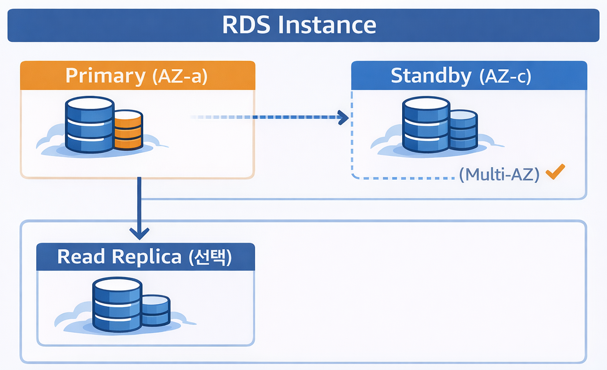
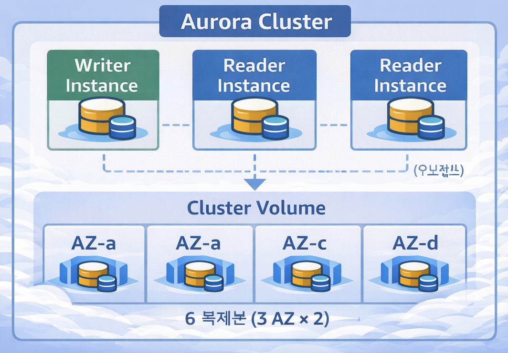

## Introduction

When running a database on AWS, there are broadly five options to choose from:

1. **EC2 + Docker**: Install and operate the DB yourself
2. **RDS**: AWS managed relational database
3. **Aurora**: AWS-developed cloud-native DB
4. **Aurora + Read Replica**: Aurora extended with read replicas for distributing read load
5. **Aurora Serverless v2**: Auto-scaling serverless Aurora

"Isn't RDS convenient but expensive?", "When should I use Aurora?", "Can't I just run it in Docker on EC2?", "When is Serverless the right call?"

If you're wrestling with these questions, this guide is for you.

---

## Comparison at a Glance

### Basic Options Comparison

| Category | EC2 + Docker | RDS | Aurora |
|----------|-------------|-----|--------|
| **Management** | Self-managed | AWS-managed | AWS-managed |
| **Cost** | Low (labor costs extra) | Medium | High |
| **Availability** | Self-configured | Multi-AZ option | 3 AZ replication by default |
| **Performance** | Depends on instance | Depends on instance | 5x MySQL, 3x PostgreSQL |
| **Scalability** | Manual | Easy vertical scaling | Easy vertical/horizontal scaling |
| **Backup/Recovery** | Self-implemented | Automated | Automated + fast recovery |
| **Recommended For** | Learning/Testing | Small-mid production | Large-scale production |

### Aurora Detailed Options Comparison

Once you've decided on Aurora, choose the configuration that fits your workload.

| Category | Provisioned | + Read Replica | Serverless v2 |
|----------|-------------|----------------|---------------|
| **Configuration** | Writer only | Writer + N Readers | Auto-scaling |
| **Cost** | Fixed | Proportional to Reader count | Usage-based |
| **Read Scaling** | Limited | Up to 15 replicas | Automatic |
| **Traffic Handling** | Manual scaling | Add Readers | Auto-scaling |
| **Recommended For** | Stable traffic | 80%+ reads | Highly variable traffic |
| **Monthly Cost Example** | ~$250 | ~$700 (2 Readers) | $50~400 (variable) |

### Storage Architecture Comparison

| Service | Storage | Billing Model |
|---------|---------|---------------|
| **EC2 + Docker** | EBS (gp2, gp3, etc.) | Based on provisioned size |
| **RDS** | EBS (gp2, gp3, io1) | Based on provisioned size |
| **Aurora** | Custom distributed storage | Based on actual usage |

- **EC2/RDS**: If you provision 100GB, you pay for 100GB even if you only use 30GB
- **Aurora**: Pay only for what you actually use, auto-scales from 10GB to 128TB

```
Aurora Storage Characteristics:
- 6 replicas automatically stored across 3 AZs (high availability built-in)
- No need to pre-specify size (auto-expanding)
- Seoul Region: $0.12/GB/month
- I/O cost separate: $0.24 per million requests

Cost Example (100GB basis):
- RDS (gp3): 100GB x $0.131 = $13.1/month (fixed)
- Aurora: 100GB x $0.12 = $12/month + I/O costs (variable)
```

> Aurora Provisioned and Serverless v2 use the same storage, so the storage cost structure is identical. The only difference is in compute costs (instances vs ACU).

### I/O-Optimized Option

Aurora charges I/O costs separately, and for I/O-heavy workloads, the I/O-Optimized option may be more cost-effective.

| Option | Storage | I/O Cost |
|--------|---------|----------|
| **Standard** | $0.12/GB/month | $0.24/million requests |
| **I/O-Optimized** | $0.15/GB/month | Free (included) |

```
Selection Criteria:
- I/O costs are less than 25% of total Aurora cost -> Standard
- I/O costs are 25% or more of total Aurora cost -> I/O-Optimized

How to Check:
- View Aurora I/O costs in AWS Cost Explorer
- Or monitor VolumeReadIOPs, VolumeWriteIOPs in CloudWatch
```

---

## Option 1: EC2 + Docker DB

Run MySQL, PostgreSQL, etc. directly on an EC2 instance using Docker.

### Configuration Example

```yaml
# docker-compose.yml
version: '3.8'
services:
  mysql:
    image: mysql:8.0
    container_name: mysql
    restart: unless-stopped
    environment:
      MYSQL_ROOT_PASSWORD: ${DB_ROOT_PASSWORD}
      MYSQL_DATABASE: ${DB_NAME}
      MYSQL_USER: ${DB_USER}
      MYSQL_PASSWORD: ${DB_PASSWORD}
    ports:
      - "3306:3306"
    volumes:
      - mysql_data:/var/lib/mysql
      - ./my.cnf:/etc/mysql/conf.d/my.cnf
    command: --default-authentication-plugin=mysql_native_password

volumes:
  mysql_data:
```

### Advantages

- **Cost savings**: 30-50% cheaper than RDS (same specs)
- **Full control**: Control everything from OS level to DB configuration
- **Flexible configuration**: Custom plugins, special settings possible
- **Multi-service**: Run multiple containers on a single EC2 instance

### Disadvantages

- **Operational burden**: Patching, backups, monitoring, and incident response all on you
- **Difficult high availability**: Must implement replication and failover yourself
- **Security responsibility**: Security patches and encryption managed manually
- **Incident response**: If the DB dies at 3 AM, you handle it yourself

### Things You Must Implement Yourself

```bash
# 1. Automated backup script (crontab)
0 3 * * * /home/ec2-user/scripts/mysql-backup.sh

# 2. Monitoring (CloudWatch Agent or Prometheus)
# 3. Log rotation
# 4. Security patch application
# 5. Disk capacity management
# 6. Replication setup (if high availability is needed)
```

### Cost Example (Seoul Region)

```
t3.medium (2 vCPU, 4GB) + 100GB gp3
- EC2: $0.052/hour x 730 hours = ~$38/month (~50,000 won)
- EBS: 100GB x $0.096 = ~$10/month (~13,000 won)
- Total: ~$48/month (~63,000 won)
```

### Recommended Scenarios

- Development/testing environments
- Early-stage startups where cost is the top priority
- DB tuning/learning purposes
- Cases requiring special DB configurations

---

## Option 2: Amazon RDS

A managed relational database service operated by AWS.
Supports MySQL, PostgreSQL, MariaDB, Oracle, and SQL Server.

### Architecture



### Advantages

- **Automated management**: Patching, backups, and monitoring are automated
- **High availability**: Automatic failover with Multi-AZ deployment
- **Security**: Data-at-rest encryption, IAM integration
- **Scalability**: Change specs with just a few clicks
- **Point-in-Time Recovery**: Restore to a specific point in time

### Disadvantages

- **Cost**: 1.5-2x more expensive than running on EC2 directly
- **Limited customization**: No OS access, some configuration restrictions
- **Vendor lock-in**: Tied to AWS

### What AWS Handles for You

| Item | Description |
|------|-------------|
| **Automatic Backups** | Daily snapshots, transaction logs every 5 minutes |
| **Patch Management** | Automatic minor version upgrades |
| **Monitoring** | Automatic CloudWatch metric collection |
| **Failover** | Automatic failover with Multi-AZ (60-120 seconds) |
| **Encryption** | Data-at-rest encryption with KMS |
| **Snapshots** | Manual/automatic snapshot support |

### Cost Example (Seoul Region)

```
db.t3.medium (2 vCPU, 4GB) + 100GB gp2, Single-AZ
- Instance: $0.073/hour x 730 hours = ~$53/month (~70,000 won)
- Storage: 100GB x $0.131 = ~$13/month (~17,000 won)
- Total: ~$66/month (~87,000 won)

Multi-AZ:
- Instance: $0.146/hour x 730 hours = ~$107/month (~140,000 won)
- Storage: 100GB x $0.262 = ~$26/month (~34,000 won)
- Total: ~$133/month (~175,000 won)
```

### Key Configuration

```bash
# Parameter group configuration example
max_connections = 150
innodb_buffer_pool_size = {DBInstanceClassMemory*3/4}
slow_query_log = 1
long_query_time = 2
```

### Recommended Scenarios

- Small to mid-scale production environments
- Teams with limited operations staff
- Services where stability is critical
- Standard RDBMS use cases

---

## Option 3: Amazon Aurora

A cloud-native database developed in-house by AWS.
Compatible with MySQL and PostgreSQL.

### Architecture



### Advantages

- **Performance**: 5x faster than MySQL, 3x faster than PostgreSQL
- **High availability**: 6 replicas across 3 AZs, automatic recovery
- **Fast failover**: Failover within 30 seconds
- **Auto-expanding storage**: Automatic scaling from 10GB to 128TB
- **Fast replication**: Quick Read Replica addition
- **Backtrack**: Rewind the database to a past point in time

### Disadvantages

- **Cost**: 20-30% more expensive than RDS
- **Minimum cost**: Base cost incurred even for small workloads
- **Complexity**: Overkill for small projects

### Aurora-Exclusive Features

| Feature | Description |
|---------|-------------|
| **Aurora Serverless v2** | Auto-scaling, pay-per-use |
| **Global Database** | Cross-region replication under 1 second |
| **Backtrack** | Rewind up to 72 hours back |
| **Clone** | Full DB clone in minutes |
| **Parallel Query** | Query processing at the storage layer |

### Cost Example (Seoul Region)

```
db.r6g.large (2 vCPU, 16GB) + 100GB storage
- Instance: $0.313/hour x 730 hours = ~$229/month (~30만원, approx. $229)
- Storage: 100GB x $0.12 = ~$12/month (~16,000 won)
- I/O: $0.24 per million requests (varies with usage)
- Total: ~$250/month (~33만원) (excluding I/O)

Aurora Serverless v2 (min 0.5 ACU ~ max 16 ACU)
- Per ACU: $0.12/hour
- Storage: 100GB x $0.12 = ~$12/month
- Minimum cost (holding 0.5 ACU): ~$44/month + storage
```

### Recommended Scenarios

- Large-scale traffic services
- Write-heavy workloads
- Services where high availability is mandatory
- Stable traffic patterns

---

## Option 4: Aurora + Read Replica

A configuration that adds Read Replicas to Aurora to maximize read performance.
Ideal for services with heavy read traffic.

### Architecture

```
                    +------------------+
                    |   Application    |
                    +--------+---------+
                             |
              +--------------+--------------+
              |              |              |
              v              v              v
        +----------+   +----------+   +----------+
        |  Writer  |   |  Reader  |   |  Reader  |
        | Instance |   | Replica 1|   | Replica 2|
        +----+-----+   +----+-----+   +----+-----+
             |              |              |
             +--------------+--------------+
                            |
                    +-------v-------+
                    | Aurora Shared |
                    |   Storage     |
                    |   (3 AZ)      |
                    +---------------+
```

### Advantages

- **Maximized read performance**: Add up to 15 Read Replicas
- **Millisecond replication lag**: Fast synchronization through shared storage layer
- **Automatic load balancing**: Reader Endpoint automatically distributes read traffic
- **Fast failover**: Reader promoted to Writer within 30 seconds
- **Cost-effective**: Read scaling is cheaper than write scaling

### Disadvantages

- **Increased cost**: Cost incurred per additional Reader instance
- **Increased complexity**: Application must separate read/write endpoints
- **Write performance limitations**: Writes still depend on a single Writer

### Endpoint Configuration

```yaml
# Application configuration example
datasource:
  writer:
    url: jdbc:mysql://mydb.cluster-xxxx.ap-northeast-2.rds.amazonaws.com:3306/mydb
  reader:
    url: jdbc:mysql://mydb.cluster-ro-xxxx.ap-northeast-2.rds.amazonaws.com:3306/mydb
```

### Cost Example (Seoul Region)

```
Writer: db.r6g.large (2 vCPU, 16GB)
Reader: db.r6g.large x 2

- Writer: $0.313/hour x 730 hours = ~$229/month
- Reader: $0.313/hour x 730 hours x 2 = ~$458/month
- Storage: 100GB x $0.12 = ~$12/month
- I/O: Varies with usage
- Total: ~$700/month (~92만원, approx. $700) (excluding I/O)
```

### Recommended Scenarios

- Services with a read:write ratio of 80:20 or higher
- Services with heavy reporting/analytics queries
- Services with high API query traffic
- Services that need fast responses even on cache misses

---

## Option 5: Aurora Serverless v2

A serverless Aurora that auto-scales based on usage.
Ideal for services with large traffic fluctuations or unpredictable traffic.

### Architecture

```
Low Traffic                          High Traffic
    |                                    |
    v                                    v
+--------+                      +----------------+
| 0.5 ACU|  ---- Auto Scale --> |    128 ACU     |
+--------+                      +----------------+
    |                                    |
    +----------------+-------------------+
                     |
             +-------v-------+
             | Aurora Shared |
             |   Storage     |
             +---------------+

ACU (Aurora Capacity Unit) = approx. 2GB memory
```

### Advantages

- **Auto-scaling**: Automatically adjusts between 0.5 ACU and 128 ACU
- **Per-second billing**: You only pay for the ACUs you use
- **Fast scaling**: Capacity adjusts within seconds
- **Minimal operational burden**: No need to worry about instance sizing
- **Mix with Provisioned**: Writer as Provisioned, Reader as Serverless

### Disadvantages

- **Minimum cost exists**: 0.5 ACU is always maintained (cannot reach absolute $0)
- **No cold start**: Unlike v1, always keeps a warm state
- **Inefficient for predictable traffic**: Provisioned is cheaper for stable traffic

### What Is an ACU?

ACU (Aurora Capacity Unit) is the capacity unit for Serverless v2.
1 ACU = approximately 2GB RAM + proportional vCPU allocation.

| ACU | Memory | Comparable Provisioned Instance |
|-----|--------|--------------------------------|
| 0.5 | 1GB | Below db.t3.micro |
| 2 | 4GB | db.t3.medium (2 vCPU, 4GB) |
| 4 | 8GB | db.t3.large (2 vCPU, 8GB) |
| 8 | 16GB | db.r6g.large (2 vCPU, 16GB) |
| 16 | 32GB | db.r6g.xlarge (4 vCPU, 32GB) |
| 32 | 64GB | db.r6g.2xlarge (8 vCPU, 64GB) |

### Traffic Capacity by ACU

These are rough estimates based on simple CRUD operations. Actual performance varies significantly depending on the workload.

| ACU | Concurrent Connections | Queries Per Second (QPS) | Service Scale Example |
|-----|----------------------|--------------------------|----------------------|
| 0.5 | ~50 | ~100 | Development/testing |
| 2 | ~200 | ~500 | Small service, DAU < 1K |
| 4 | ~400 | ~1,000 | Small production, DAU 1-5K |
| 8 | ~800 | ~3,000 | Mid-scale service, DAU 10-50K |
| 16 | ~1,500 | ~6,000 | Mid-to-large service, DAU 50-200K |
| 32 | ~3,000 | ~12,000 | Large-scale service, DAU 200K+ |

> Warning: The figures above are for reference only. Depending on query complexity, index optimization, and read/write ratio, actual numbers can differ by 10x or more. Load testing before production deployment is essential.

### ACU Scaling Configuration

```
Minimum ACU: 0.5 (approx. 1GB memory)
Maximum ACU: 128 (approx. 256GB memory)

Recommended Settings:
- Development/Testing: 0.5 ~ 4 ACU
- Small Production: 0.5 ~ 16 ACU
- Mid-scale Production: 2 ~ 32 ACU
- Large-scale Production: 8 ~ 128 ACU
```

### Cost Example (Seoul Region)

```
Per ACU: $0.12/hour

Scenario 1: Almost no traffic at night
- Daytime (12 hours): avg 8 ACU x $0.12 x 12 = $11.52/day
- Nighttime (12 hours): avg 0.5 ACU x $0.12 x 12 = $0.72/day
- Monthly: ~$367/month (~48만원) + storage

Scenario 2: Event-driven traffic
- Normal: 2 ACU x $0.12 x 700 hours = $168/month
- Event (30 hours): 32 ACU x $0.12 x 30 = $115/month
- Monthly: ~$283/month (~37만원) + storage

vs Provisioned (always running db.r6g.xlarge)
- $0.626/hour x 730 hours = ~$457/month (~60만원)
```

### Mixed Configuration with Provisioned

```
Writer: Provisioned (db.r6g.large) - Stable write processing
Reader: Serverless v2 (0.5 ~ 16 ACU) - Auto-scales with read traffic

Benefits:
- Guaranteed write performance
- Optimized read costs
- Peak traffic handling
```

### Recommended Scenarios

- Services with large traffic fluctuations (day/night, weekday/weekend differences)
- Services with event-driven traffic spikes
- New services (difficult to predict traffic)
- Development/testing environments (cost optimization)
- B2B SaaS (different usage patterns per client)

---

## Scenario-Based Selection Guide

### 1. Cost Is the Top Priority (Early-Stage Startup)

```
Recommendation: EC2 + Docker (or RDS Free Tier)

Reason:
- Can operate for under $50/month (~6.5만원)
- Low traffic in the early stages means low operational burden
- RDS Free Tier: db.t3.micro 750 hours/month free (12 months)
```

### 2. Stable Operations with Limited Staff

```
Recommendation: RDS (Multi-AZ)

Reason:
- Automated backups, patching, and failover
- No night/weekend incident response burden
- Manageable with just 1 operations person
```

### 3. Service with Heavy Read Traffic

```
Recommendation: Aurora + Read Replica

Reason:
- Add up to 15 Read Replicas
- Millisecond replication lag (shared storage)
- Automatic load balancing via Reader Endpoint
- Effective when read:write ratio is 80:20 or higher

Configuration Example:
- Start with 1 Writer + 2 Readers
- Add Readers as traffic increases
```

### 4. Service with Highly Variable Traffic

```
Recommendation: Aurora Serverless v2

Reason:
- Auto-scaling from 0.5 ACU to 128 ACU
- Minimal cost during low traffic periods
- Per-second billing
- No need to worry about instance sizing

Suitable Cases:
- Large day/night traffic differences
- Event-driven traffic spikes
- New services (difficult to predict traffic)
```

### 5. Heavy Read Traffic + Highly Variable

```
Recommendation: Aurora Provisioned (Writer) + Serverless v2 (Reader)

Reason:
- Writer: Guaranteed stable write performance
- Reader: Auto-scales with traffic
- Costs increase only during peak times
- Optimal cost-to-performance ratio
```

### 6. Global Service

```
Recommendation: Aurora Global Database

Reason:
- Read Replicas in up to 5 regions
- Cross-region replication under 1 second
- Automatic failover on regional failures
```

### 7. Development/Testing Environment

```
Recommendation: EC2 + Docker or RDS (Single-AZ)

Reason:
- Cost savings
- High availability not needed
- Quick creation/deletion
```

---

## Decision Flowchart

```
Start
  |
  v
Is this a production environment? --- No --> EC2 + Docker or RDS Single-AZ
  |
 Yes
  |
  v
Monthly budget under $100? --- Yes --> RDS Single-AZ
  |
 No
  |
  v
Is high availability required? --- No --> RDS Single-AZ
  |
 Yes
  |
  v
Is traffic highly variable? --- Yes --+-> Heavy reads? --- Yes --> Provisioned + Serverless v2 Mixed
  |                                   |
 No                                   +-- No --> Aurora Serverless v2
  |
  v
Is read traffic heavy? --- Yes --> Aurora + Read Replica
  |
 No
  |
  v
Is it large-scale traffic? --- Yes --> Aurora (Provisioned)
  |
 No
  |
  v
RDS Multi-AZ
```

---

## Migration Paths

### EC2 -> RDS

```bash
# 1. Backup with mysqldump
mysqldump -h ec2-host -u user -p database > backup.sql

# 2. Create RDS instance

# 3. Restore to RDS
mysql -h rds-endpoint -u user -p database < backup.sql

# Or use AWS DMS (minimizes downtime)
```

### RDS -> Aurora

```
1. Create an RDS snapshot
2. Restore an Aurora cluster from the snapshot (available in the console)
3. Update application endpoints
```

### Direct Migration to Aurora

```bash
# Use AWS DMS (recommended)
# - Online migration
# - Minimizes downtime
# - Real-time replication via CDC, then switch over
```

---

## Cost Optimization Tips

### EC2 + Docker

```
- Use Spot Instances (development/testing)
- Reserved Instances (1-year/3-year)
- Use GP3 storage (20% cheaper than GP2)
- Clean up unnecessary snapshots
```

### RDS

```
- Reserved Instances (1-year: 30%, 3-year: 50% discount)
- Use Single-AZ for development environments
- Choose the right instance size
- Enable Storage Auto Scaling
- Optimize with Performance Insights
```

### Aurora

```
- Reserved Instances (for Provisioned usage)
- Aurora Serverless v2 (for variable traffic)
- I/O-Optimized storage (I/O costs included)
- Clean up unnecessary Reader instances
```

---

## Production Checklist

### Security

- [ ] Deploy in a private subnet within a VPC
- [ ] Restrict access with security groups (allow only specific IPs/SGs)
- [ ] Enable data-at-rest encryption
- [ ] Enforce SSL/TLS connections
- [ ] Consider IAM authentication (RDS/Aurora)
- [ ] Store sensitive information in Secrets Manager

### Operations

- [ ] Set up CloudWatch alarms (CPU, memory, connections, storage)
- [ ] Enable slow query logging
- [ ] Configure backup retention period (minimum 7 days)
- [ ] Set maintenance window (during low-traffic hours)
- [ ] Tune parameter groups

### Cost

- [ ] Review instance size appropriateness (monthly)
- [ ] Consider Reserved Instances (for stable workloads)
- [ ] Consider stopping dev/test environments at night
- [ ] Clean up unnecessary snapshots

---

## Summary

| Scenario | Recommendation |
|----------|---------------|
| Learning/Testing | EC2 + Docker |
| Early-stage startup | RDS Single-AZ (Free Tier) |
| Small-scale production | RDS Single-AZ |
| Mid-scale production | RDS Multi-AZ |
| Large-scale production | Aurora (Provisioned) |
| Heavy read traffic | Aurora + Read Replica |
| Highly variable traffic | Aurora Serverless v2 |
| Heavy reads + variable | Provisioned + Serverless v2 Mixed |
| Global service | Aurora Global Database |

**EC2 + Docker**: When you have the time and expertise to manage it yourself, and cost is the top priority

**RDS**: When you want to reduce management overhead and need stability at a reasonable cost

**Aurora (Provisioned)**: When you need top-tier performance and availability, and traffic is stable

**Aurora + Read Replica**: When read traffic far exceeds write traffic

**Aurora Serverless v2**: When traffic is unpredictable or highly variable

Ultimately, there is no single right answer. Choose based on your team's capabilities, budget, and service requirements.
Starting with RDS and migrating to Aurora as traffic grows is also a solid strategy.
Even within Aurora, you can progressively scale: Provisioned -> Add Read Replicas -> Mix in Serverless.

---

## Reference: Other Cloud Platform Comparison

If you are considering Azure or GCP in addition to AWS, refer to the corresponding services below.

| Type | AWS | Azure | GCP |
|------|-----|-------|-----|
| **Managed RDBMS** | RDS | Azure SQL Database | Cloud SQL |
| **Cloud-Native** | Aurora | Azure SQL Hyperscale | AlloyDB |
| **Serverless** | Aurora Serverless | Azure SQL Serverless | Cloud SQL (auto storage) |
| **Global Distributed** | Aurora Global Database | Azure Cosmos DB | Cloud Spanner |
| **MySQL Compatible** | RDS MySQL, Aurora MySQL | Azure Database for MySQL | Cloud SQL for MySQL |
| **PostgreSQL Compatible** | RDS PostgreSQL, Aurora PostgreSQL | Azure Database for PostgreSQL | Cloud SQL for PostgreSQL, AlloyDB |

### Platform-Specific Strengths

- **Azure**: Familiar for existing SQL Server users, excellent integration with the Microsoft ecosystem
- **GCP**: Strong BigQuery integration, AlloyDB is a high-performance PostgreSQL-compatible DB
- **AWS**: Widest variety of options, Aurora's performance/availability is a key strength

> Tip: If you are already using a particular cloud provider, using that platform's managed DB service is generally the most operationally efficient choice.
