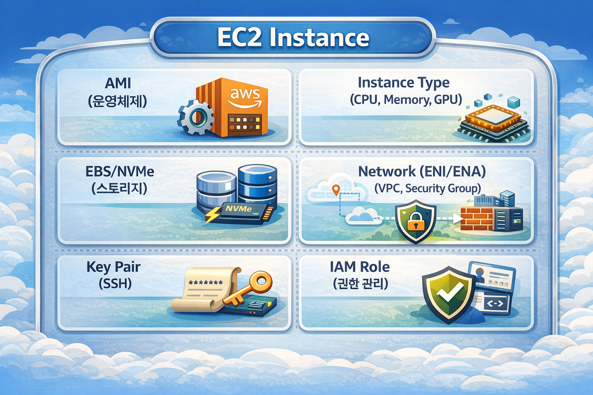
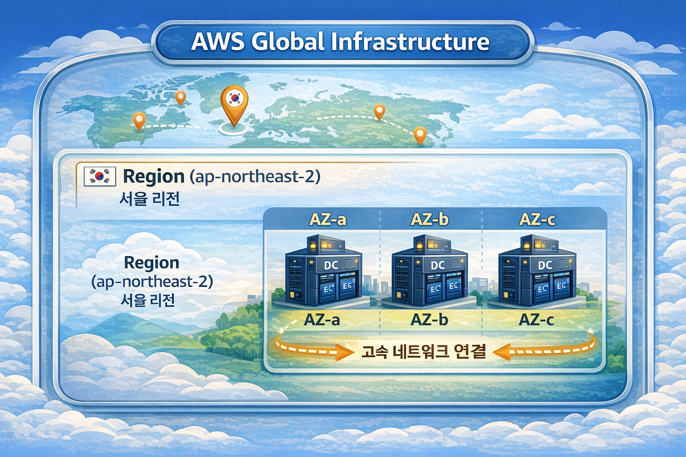
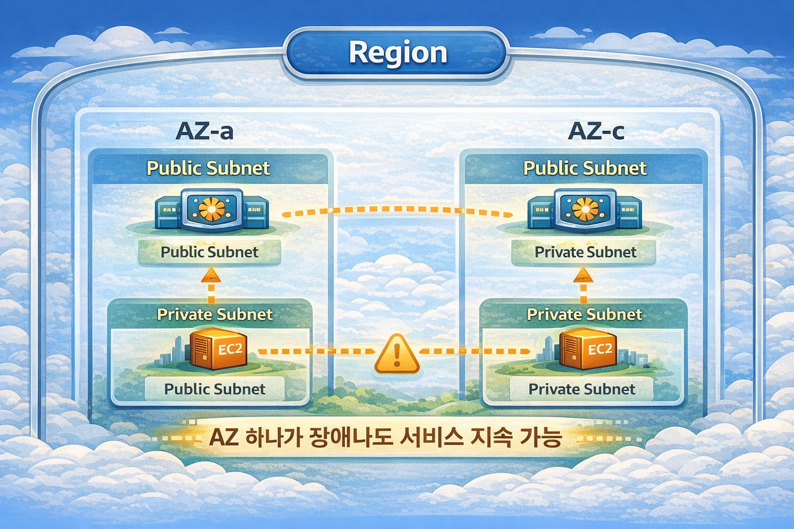

## Introduction

AWS EC2 (Elastic Compute Cloud) is AWS's core compute service.
It allows you to create and manage virtual servers in the cloud,
and you can provision thousands of servers within minutes as needed.

This article covers everything from EC2 fundamentals to instance selection, storage, networking,
security, cost optimization, and production operations best practices.

---

## EC2 Basic Architecture

### EC2 Components

An EC2 instance is composed of the following components.




### Instance Lifecycle

```
pending → running ⇄ stopping → stopped
                 ↓
            shutting-down → terminated
```

| State | Description | Billing |
|------|------|------|
| `pending` | Preparing to start the instance | X |
| `running` | Running | O |
| `stopping` | Stopping in progress | X |
| `stopped` | Stopped (only EBS is billed) | △ |
| `shutting-down` | Terminating | X |
| `terminated` | Completely deleted | X |

> **Important**: In the `stopped` state, there is no instance cost, but **EBS volume costs** continue to accrue.

---

## Region & Availability Zone

### AWS Global Infrastructure




### Region

A Region is a geographically separated AWS infrastructure area.

| Region Code | Location | Characteristics |
|-----------|------|------|
| `ap-northeast-2` | Seoul | Default for Korean services |
| `ap-northeast-1` | Tokyo | Asia Pacific hub |
| `us-east-1` | Virginia | First AWS region, most services available |
| `eu-west-1` | Ireland | European hub |

**Region Selection Criteria**:
```
1. Latency
   → Choose a region close to your users
   → For Korean users, use ap-northeast-2

2. Compliance
   → Verify data sovereignty requirements
   → Financial institutions may require domestic data storage

3. Service Availability
   → Some services are only available in certain regions
   → us-east-1 is always first to launch new services

4. Cost
   → Pricing varies by region
   → Generally, us-east-1 is the cheapest
```

### Availability Zone (AZ)

An AZ is a group of physically separated data centers within a Region.

```
Seoul Region (ap-northeast-2) AZs:
├── ap-northeast-2a
├── ap-northeast-2b
├── ap-northeast-2c
└── ap-northeast-2d
```

**AZ Characteristics**:
- Each AZ has independent power, cooling, and networking
- Latency between AZs: less than 1ms
- An AZ failure does not affect other AZs
- Data transfer costs apply between AZs within the same region

**AZ ID vs AZ Name**:
```bash
# AZ Names may map differently per account
# Account A's ap-northeast-2a ≠ Account B's ap-northeast-2a

# AZ ID represents the physical location (consistent across accounts)
aws ec2 describe-availability-zones \
  --query 'AvailabilityZones[*].[ZoneName,ZoneId]' \
  --output table

# Example output:
# ap-northeast-2a  |  apne2-az1
# ap-northeast-2b  |  apne2-az2
# ap-northeast-2c  |  apne2-az3
```

### Multi-AZ Architecture

**Multi-AZ deployment for high availability**:



**Multi-AZ Design Principles**:
```
1. Distribute resources across at least 2 AZs
2. Distribute traffic with load balancers
3. Deploy evenly across AZs with Auto Scaling
4. Configure databases with Multi-AZ as well
5. Automatic failover during AZ failures
```

### Cross-Region Architecture

**Multi-Region for global services**:

```bash
# Cross-region VPC peering
aws ec2 create-vpc-peering-connection \
  --vpc-id vpc-seoul \
  --peer-vpc-id vpc-tokyo \
  --peer-region ap-northeast-1

# Copy AMI to another region
aws ec2 copy-image \
  --source-region ap-northeast-2 \
  --source-image-id ami-xxx \
  --region ap-northeast-1 \
  --name "my-ami-tokyo"

# Copy snapshot to another region (for DR)
aws ec2 copy-snapshot \
  --source-region ap-northeast-2 \
  --source-snapshot-id snap-xxx \
  --destination-region ap-northeast-1
```

---

## AMI (Amazon Machine Image)

### What is an AMI?

An AMI is a template that contains all the information needed to launch an instance.

```
AMI = OS + Software + Configuration + Permission information
```

### AMI Types

| Type | Description | Examples |
|------|------|------|
| **AWS Provided** | Official images managed by AWS | Amazon Linux 2023, Ubuntu |
| **Marketplace** | Images provided by vendors | WordPress, Jenkins |
| **Community** | Images shared by the community | Various open source |
| **Custom** | Self-created images | Custom-configured servers |

### Amazon Linux vs Ubuntu

Here we compare the two most commonly used options in production.

**Amazon Linux 2023**
```
Advantages:
- Optimized integration with AWS services
- Includes AWS CLI and SSM Agent by default
- Long-term support (LTS)
- AWS-optimized kernel

Disadvantages:
- RHEL/CentOS-based, learning curve if familiar with Ubuntu
- Some packages may not be available in yum/dnf
```

> **What is yum/dnf?**
> These are package managers used in RHEL/CentOS/Amazon Linux distributions.
> They serve the same role as Ubuntu's `apt`, managing software installation/updates/removal.
> - `yum`: Legacy package manager (used up to Amazon Linux 2)
> - `dnf`: Next-generation package manager (default from Amazon Linux 2023)
> - Example: `sudo dnf install nginx`, `sudo yum update`

**Ubuntu**
```
Advantages:
- Rich community and documentation
- Latest package support
- Familiar to developers
- Easy software installation with apt package manager

Disadvantages:
- AWS optimization is less than Amazon Linux
- Additional configuration needed for some AWS features
```

> **What is apt?**
> A package manager used in Debian/Ubuntu distributions.
> - Example: `sudo apt install nginx`, `sudo apt update`

### Creating Custom AMIs

Create custom AMIs to speed up deployments.

```bash
# 1. Create AMI from existing instance
aws ec2 create-image \
  --instance-id i-0123456789abcdef0 \
  --name "my-app-v1.0.0" \
  --description "Production ready app server" \
  --no-reboot

# 2. List AMIs
aws ec2 describe-images \
  --owners self \
  --query 'Images[*].[ImageId,Name,CreationDate]' \
  --output table
```

**AMI Creation Best Practices**:
- Include version info in the name (e.g., `my-app-v1.0.0-2024-01-15`)
- Clean up unnecessary logs and cache before creation
- Be careful about filesystem consistency when using `--no-reboot`
- Regularly delete old AMIs

---

## EC2 Instance Types in Detail

### Naming Convention

```
[Family][Generation][Additional Attributes].[Size]

Example: m7g.2xlarge
    │││  └── Size: 2xlarge
    ││└── Additional Attribute: g (Graviton)
    │└── Generation: 7
    └── Family: m (General Purpose)
```

### Additional Attributes (Processor & Features)

The characters after the generation number in the instance name indicate processor type and additional features.

#### Processor Attributes

| Attribute | Meaning | Description | Examples |
|------|------|------|------|
| **i** | Intel | Intel Xeon processors | m6i, c6i, r6i |
| **a** | AMD | AMD EPYC processors (~10% cheaper than Intel) | m6a, c6a, r6a |
| **g** | Graviton | AWS custom ARM processors (up to 40% cheaper) | m7g, c7g, r7g |

```
Price Comparison (same specs):
┌─────────────────────────────────────────────────────┐
│  m6i.large (Intel)   ████████████████████  $0.096  │
│  m6a.large (AMD)     █████████████████     $0.086  │
│  m7g.large (Graviton)████████████          $0.082  │
└─────────────────────────────────────────────────────┘

Selection Criteria:
- Intel (i): Best compatibility, safe for legacy apps
- AMD (a): Similar compatibility to Intel, cost savings
- Graviton (g): Best price-performance, requires ARM compatibility
```

#### Feature Attributes

| Attribute | Meaning | Description | Examples |
|------|------|------|------|
| **d** | NVMe SSD | Includes local instance storage | m6id, c6id, r6id |
| **n** | Network | Network optimized (up to 200 Gbps) | m5n, c5n, r5n |
| **z** | High Frequency | High CPU clock (up to 4.5 GHz) | m5zn |
| **e** | Extra Memory | Additional memory (2x standard) | r6i**e**n |
| **flex** | Flexible | Mixed processor usage | m7i-flex |

#### Attribute Combination Examples

```
m6i.large      → M series, 6th gen, Intel
m6a.large      → M series, 6th gen, AMD
m7g.large      → M series, 7th gen, Graviton (ARM)
m6id.large     → M series, 6th gen, Intel + NVMe SSD
m5n.large      → M series, 5th gen, Network optimized
m5zn.large     → M series, 5th gen, High frequency + Network
c6in.large     → C series, 6th gen, Intel + Network optimized
r6idn.large    → R series, 6th gen, Intel + NVMe + Network
```

#### Detailed Processor Comparison

**Intel (i) Instances**:
```
Processor: Intel Xeon Scalable (Ice Lake, Sapphire Rapids)
Advantages:
- Widest software compatibility
- AVX-512 instruction support (scientific computing, ML)
- Stable and proven performance

Use Cases:
- Legacy applications
- Windows workloads
- x86-only software
- Cases where licenses are tied to specific processors
```

**AMD (a) Instances**:
```
Processor: AMD EPYC (Milan, Genoa)
Advantages:
- About 10% cheaper than Intel
- Higher core count (advantageous for large-scale parallel processing)
- Compatible with most Linux workloads

Use Cases:
- Cost-sensitive workloads
- Containers/Microservices
- Batch processing
- Web servers

Caveats:
- Performance differences possible with some Intel-optimized libraries
- Verify Windows licensing policies
```

**Graviton (g) Instances**:
```
Processor: AWS Graviton2/Graviton3 (ARM-based)
Advantages:
- Up to 40% lower cost
- Up to 60% better energy efficiency
- High performance/watt ratio
- Designed by AWS, optimized for AWS environments

Use Cases:
- Container workloads (Docker, Kubernetes)
- Web servers (Nginx, Apache)
- Microservices
- Open-source databases (MySQL, PostgreSQL)
- Java, Python, Node.js applications

Caveats:
- Cannot run x86-only binaries
- Some commercial software not supported
- Docker images require ARM64 versions
```

#### Graviton Compatibility Verification

```bash
# 1. Check Docker image architecture
docker manifest inspect nginx:latest | grep architecture
# If "arm64" appears in the result, it's Graviton compatible

# 2. Check package ARM support (Amazon Linux)
dnf search <package-name> --forcearch aarch64

# 3. Java applications
# OpenJDK supports ARM64, Oracle JDK requires version verification
java -version
# If aarch64 is displayed, it's the ARM version

# 4. Node.js
# v16+ has full ARM64 support
node -p "process.arch"
# Verify arm64 output
```

#### Instance Type Selection Flow

```
┌─────────────────────────────────────────────────────────────┐
│             Instance Processor Selection Guide               │
├─────────────────────────────────────────────────────────────┤
│                                                              │
│  Is ARM64 (Graviton) compatible?                            │
│       │                                                      │
│       ├── Yes ──→ Choose Graviton (g) (best value)          │
│       │           e.g., m7g, c7g, r7g                        │
│       │                                                      │
│       └── No ──→ Do you need Intel-specific features?       │
│                       │                                      │
│                       ├── Yes ──→ Choose Intel (i)           │
│                       │           e.g., m6i, c6i, r6i        │
│                       │                                      │
│                       └── No ──→ Choose AMD (a) (cost saving)│
│                                   e.g., m6a, c6a, r6a        │
│                                                              │
│  If additional features are needed:                          │
│  ├── Fast local storage ──→ add d (e.g., m6id)              │
│  ├── High-performance network ──→ add n (e.g., c5n)         │
│  └── High CPU clock ──→ add z (e.g., m5zn)                  │
│                                                              │
└─────────────────────────────────────────────────────────────┘
```

### Detailed Analysis by Family

#### M Series (General Purpose)

```
CPU : Memory = 1 : 4 ratio
Example: m6i.large = 2 vCPU, 8 GiB Memory
```

| Instance | vCPU | Memory | Network | Price (Seoul, per hour) |
|---------|------|--------|----------|-------------------|
| m6i.large | 2 | 8 GiB | Up to 12.5 Gbps | ~$0.096 |
| m6i.xlarge | 4 | 16 GiB | Up to 12.5 Gbps | ~$0.192 |
| m6i.2xlarge | 8 | 32 GiB | Up to 12.5 Gbps | ~$0.384 |
| m7g.large | 2 | 8 GiB | Up to 12.5 Gbps | ~$0.082 |

**Use Cases**:
- Web servers, API servers
- Small to medium databases
- Development/Test environments
- Enterprise applications

#### C Series (Compute Optimized)

```
CPU : Memory = 1 : 2 ratio
Example: c6i.large = 2 vCPU, 4 GiB Memory
High-performance Intel/AMD/Graviton processors
```

| Instance | vCPU | Memory | Characteristics |
|---------|------|--------|------|
| c6i.large | 2 | 4 GiB | Intel Ice Lake |
| c6a.large | 2 | 4 GiB | AMD EPYC (cheaper) |
| c7g.large | 2 | 4 GiB | Graviton3 (best value) |

**Use Cases**:
- Batch processing
- Media transcoding
- High-performance web servers
- Scientific modeling
- Game servers

#### R Series (Memory Optimized)

```
CPU : Memory = 1 : 8 ratio
Example: r6i.large = 2 vCPU, 16 GiB Memory
```

**Use Cases**:
- In-memory databases (Redis, Memcached)
- Real-time big data analytics
- High-performance relational databases
- In-memory caching

#### T Series (Burstable)

The T series operates on a **CPU credit** system.


| Instance | Baseline | Credits/Hour | Max Credits |
|---------|-----------|------------|------------|
| t3.micro | 10% | 6 | 144 |
| t3.small | 20% | 12 | 288 |
| t3.medium | 20% | 24 | 576 |
| t3.large | 30% | 36 | 864 |

**Unlimited Mode**:
```bash
# Change T instance to unlimited mode
aws ec2 modify-instance-credit-specification \
  --instance-credit-specification "InstanceId=i-xxx,CpuCredits=unlimited"
```

> **Caution**: In Unlimited mode, additional charges apply when credits are exceeded

**T Series Selection Criteria**:
```
Average CPU utilization < 20% → T series is suitable
Average CPU utilization > 40% → M/C series is more efficient
```

#### I Series (Storage Optimized)

Instances with local NVMe SSDs included.

```
i3.xlarge: 1 x 950 GB NVMe SSD
i3.2xlarge: 1 x 1900 GB NVMe SSD
i3.4xlarge: 2 x 1900 GB NVMe SSD
```

**Characteristics**:
- Local storage **data is lost** when instance is stopped/terminated
- Very fast I/O (hundreds of thousands of IOPS)
- Lower latency than EBS

**Use Cases**:
- Elasticsearch, OpenSearch
- Kafka
- Cassandra, ScyllaDB
- Log analytics systems

#### G/P Series (GPU)

| Series | GPU | Purpose |
|-------|-----|------|
| p4d | NVIDIA A100 | Large-scale ML training |
| p3 | NVIDIA V100 | ML training |
| g5 | NVIDIA A10G | Inference, graphics |
| g4dn | NVIDIA T4 | Inference, small-scale training |
| inf1 | AWS Inferentia | Inference only (low cost) |

### Generational Changes

Performance and cost efficiency improve with each newer generation.

```
m5 → m6i: ~15% performance improvement, similar price
m6i → m7i: ~15% performance improvement, similar price

Conclusion: 15% performance gain per generation at the same price
      = Staying on old generations wastes 10-15% in costs annually
```

### Graviton (ARM) Instances

AWS's custom-designed ARM processor with excellent price-performance.

```
Compared to Intel/AMD:
- Up to 40% cheaper
- Up to 60% better energy efficiency
- Compatible with most Linux workloads
```

**Graviton Compatibility Check**:
```bash
# Check if Docker image supports ARM
docker manifest inspect nginx:latest | grep architecture

# If "arm64" appears in the result, it can run on Graviton
```

**Graviton Migration Checklist**:
- [ ] Verify application supports ARM64
- [ ] Verify dependency library ARM64 compatibility
- [ ] Verify Docker image multi-arch support
- [ ] Validate performance in test environment
- [ ] Gradual migration (Canary deployment)

---

## EBS (Elastic Block Store) in Detail

EBS is **block storage** attached to EC2.
It is used as root volumes and additional data volumes for instances.

### EBS vs Instance Store

| Category | EBS | Instance Store |
|------|-----|----------------|
| **Persistence** | Independent of instance | Deleted on instance termination |
| **Size** | Up to 64TB | Fixed based on instance type |
| **Performance** | Depends on volume type | Very fast (NVMe) |
| **Snapshots** | Supported | Not supported |
| **Cost** | Billed separately | Included in instance cost |
| **Use Case** | Persistent data | Cache, temporary data |

### EBS Volume Types in Detail

| Type | Use Case | Max IOPS | Max Throughput | Price (GB/month) |
|------|------|----------|------------|--------------|
| **gp3** | General Purpose SSD | 16,000 | 1,000 MB/s | ~$0.08 |
| **gp2** | General Purpose SSD (legacy) | 16,000 | 250 MB/s | ~$0.10 |
| **io2** | High Performance SSD | 256,000 | 4,000 MB/s | ~$0.125 |
| **io2 Block Express** | Ultra High Performance SSD | 256,000 | 4,000 MB/s | ~$0.125 |
| **st1** | Throughput Optimized HDD | 500 | 500 MB/s | ~$0.045 |
| **sc1** | Cold HDD | 250 | 250 MB/s | ~$0.025 |

#### Volume Type Details

**gp3 (General Purpose SSD)**:
```
Baseline Performance:
- IOPS: 3,000 (free)
- Throughput: 125 MB/s (free)

Additional Provisioning (extra cost):
- IOPS: up to 16,000 (charged above 3,000)
- Throughput: up to 1,000 MB/s (charged above 125)

Use Cases:
- Boot volumes
- General workloads
- Development/Test environments
```

**io2 (Provisioned IOPS SSD)**:
```
Characteristics:
- Directly provision IOPS
- 99.999% durability (gp3 is 99.8~99.9%)
- Multi-Attach supported

Performance:
- IOPS: up to 500 IOPS per GB
- Example: 100GB volume → up to 50,000 IOPS

Use Cases:
- High-performance databases (Oracle, SQL Server)
- Latency-sensitive transactional workloads
- I/O-intensive NoSQL databases
```

**st1 (Throughput Optimized HDD)**:
```
Characteristics:
- Optimized for large sequential read/write
- Cannot be used as boot volume

Performance:
- Baseline throughput: 40 MB/s per TB
- Burst throughput: 250 MB/s per TB
- Max throughput: 500 MB/s

Use Cases:
- Big data (Hadoop, Kafka)
- Log processing
- Data warehouses
```

**sc1 (Cold HDD)**:
```
Characteristics:
- Cheapest option
- Suitable for infrequent access
- Cannot be used as boot volume

Performance:
- Baseline throughput: 12 MB/s per TB
- Burst throughput: 80 MB/s per TB
- Max throughput: 250 MB/s

Use Cases:
- Archive data
- Infrequently accessed large data
```

### EBS Volume Selection Guide

```
┌────────────────────────────────────────────────────────────┐
│                  EBS Volume Selection Flow                   │
├────────────────────────────────────────────────────────────┤
│                                                            │
│  Is it a boot volume?                                      │
│       │                                                    │
│       ├── Yes → gp3 (default choice)                      │
│       │                                                    │
│       └── No → What is the data access pattern?           │
│                    │                                       │
│                    ├── Random I/O (DB) → IOPS needed?      │
│                    │       │                               │
│                    │       ├── ≤16,000 → gp3              │
│                    │       └── >16,000 → io2              │
│                    │                                       │
│                    ├── Sequential I/O (Big Data)           │
│                    │       │                               │
│                    │       └── st1                         │
│                    │                                       │
│                    └── Infrequent access (Archive)         │
│                            │                               │
│                            └── sc1                         │
│                                                            │
└────────────────────────────────────────────────────────────┘
```

### EBS Volume Attachment and Management

```bash
# Create EBS volume
aws ec2 create-volume \
  --volume-type gp3 \
  --size 100 \
  --iops 3000 \
  --throughput 125 \
  --availability-zone ap-northeast-2a \
  --encrypted \
  --tag-specifications 'ResourceType=volume,Tags=[{Key=Name,Value=my-data-volume}]'

# Attach volume to EC2
aws ec2 attach-volume \
  --volume-id vol-xxx \
  --instance-id i-xxx \
  --device /dev/sdf

# Mount the volume inside the instance
# 1. Create filesystem (one-time only)
sudo mkfs -t xfs /dev/xvdf

# 2. Create mount point
sudo mkdir /data

# 3. Mount
sudo mount /dev/xvdf /data

# 4. Configure persistent mount (/etc/fstab)
echo '/dev/xvdf /data xfs defaults,nofail 0 2' | sudo tee -a /etc/fstab
```

### EBS Volume Expansion

You can change volume size and performance online (no downtime).

```bash
# Modify volume size and IOPS
aws ec2 modify-volume \
  --volume-id vol-xxx \
  --size 200 \
  --iops 6000 \
  --throughput 250

# Check modification status
aws ec2 describe-volumes-modifications \
  --volume-ids vol-xxx

# Extend partition inside the instance
sudo growpart /dev/xvda 1

# Extend filesystem
sudo xfs_growfs /dev/xvda1    # XFS
sudo resize2fs /dev/xvda1     # ext4
```

**Volume Modification Limitations**:
```
- Can only modify once every 6 hours
- Size can only increase (cannot shrink)
- gp2 → gp3 type change is possible
- io1 → io2 type change is possible
```

### EBS Multi-Attach

Attach a single io2 volume to multiple EC2 instances simultaneously.

```bash
# Create volume with Multi-Attach enabled
aws ec2 create-volume \
  --volume-type io2 \
  --size 100 \
  --iops 50000 \
  --multi-attach-enabled \
  --availability-zone ap-northeast-2a
```

**Multi-Attach Limitations**:
```
- Only io2 volumes supported
- Can only attach instances in the same AZ
- Maximum 16 instances attached
- Cluster-aware filesystem required (GFS2, OCFS2)
- Risk of data corruption with regular filesystems
```

### EBS Encryption

```bash
# Enable default encryption (region-level)
aws ec2 enable-ebs-encryption-by-default

# Create encrypted volume
aws ec2 create-volume \
  --volume-type gp3 \
  --size 100 \
  --encrypted \
  --kms-key-id alias/my-key \
  --availability-zone ap-northeast-2a

# Convert unencrypted volume to encrypted
# 1. Create snapshot
aws ec2 create-snapshot --volume-id vol-unencrypted-xxx

# 2. Copy as encrypted snapshot
aws ec2 copy-snapshot \
  --source-region ap-northeast-2 \
  --source-snapshot-id snap-xxx \
  --encrypted \
  --kms-key-id alias/my-key

# 3. Create volume from encrypted snapshot
aws ec2 create-volume \
  --snapshot-id snap-encrypted-xxx \
  --availability-zone ap-northeast-2a
```

**Encryption Characteristics**:
```
- AES-256 encryption
- Uses AWS managed keys or CMK (Customer Managed Key)
- Encryption/decryption is handled on the EC2 host (no performance impact)
- Snapshots of encrypted volumes are also encrypted
- Can re-encrypt with a different key when copying snapshots across regions
```

### gp3 vs gp2

**Why you should choose gp3**:
```
gp2: IOPS scales with volume size (3 IOPS/GB)
     → 1TB volume = 3,000 IOPS

gp3: 3,000 IOPS provided by default regardless of size
     → Even a 100GB volume gets 3,000 IOPS

Conclusion: gp3 is cheaper and more flexible in most cases
```

**gp3 Configuration Example**:
```bash
aws ec2 create-volume \
  --volume-type gp3 \
  --size 100 \
  --iops 3000 \
  --throughput 125 \
  --availability-zone ap-northeast-2a
```

### EBS-Optimized Instances

EBS-optimized instances provide dedicated bandwidth for EBS.

```
Non-optimized: Network and EBS share bandwidth
Optimized:     Dedicated bandwidth for EBS

Latest generations (5th gen and above) are EBS-optimized by default
```

---

## Backup & Snapshot

### EBS Snapshots in Detail

EBS snapshots are **point-in-time copies** of EBS volumes.
They are stored in S3 and use incremental backups for efficiency.

#### Snapshot Operating Principle

```
┌─────────────────────────────────────────────────────────────┐
│                  Incremental Snapshots                        │
├─────────────────────────────────────────────────────────────┤
│                                                              │
│  EBS Volume: [A][B][C][D][E][F][G][H]                       │
│                                                              │
│  Snapshot 1: [A][B][C][D][E][F][G][H]  ← Full copy          │
│              (10GB stored)                                   │
│                                                              │
│  --- Blocks C, F modified ---                                │
│                                                              │
│  EBS Volume: [A][B][C'][D][E][F'][G][H]                     │
│                                                              │
│  Snapshot 2: [C'][F']  ← Only changed blocks stored          │
│              (2GB stored, rest references Snapshot 1)         │
│                                                              │
│  Even if Snapshot 1 is deleted, Snapshot 2 retains full data │
│  (Required blocks automatically move to Snapshot 2)          │
│                                                              │
└─────────────────────────────────────────────────────────────┘
```

#### Creating and Managing Snapshots

```bash
# Create snapshot
aws ec2 create-snapshot \
  --volume-id vol-xxx \
  --description "Daily backup $(date +%Y-%m-%d)" \
  --tag-specifications 'ResourceType=snapshot,Tags=[{Key=Name,Value=my-app-backup},{Key=Environment,Value=production}]'

# List snapshots
aws ec2 describe-snapshots \
  --owner-ids self \
  --query 'Snapshots[*].[SnapshotId,VolumeId,StartTime,State,VolumeSize]' \
  --output table

# Check snapshot status
aws ec2 describe-snapshots \
  --snapshot-ids snap-xxx \
  --query 'Snapshots[0].State'

# Delete snapshot
aws ec2 delete-snapshot --snapshot-id snap-xxx
```

#### Restoring Volumes from Snapshots

```bash
# Restore to same AZ
aws ec2 create-volume \
  --snapshot-id snap-xxx \
  --availability-zone ap-northeast-2a \
  --volume-type gp3 \
  --tag-specifications 'ResourceType=volume,Tags=[{Key=Name,Value=restored-volume}]'

# Restore to different AZ
aws ec2 create-volume \
  --snapshot-id snap-xxx \
  --availability-zone ap-northeast-2c \
  --volume-type gp3

# Restore with larger size
aws ec2 create-volume \
  --snapshot-id snap-xxx \
  --size 200 \
  --availability-zone ap-northeast-2a \
  --volume-type gp3
```

#### Cross-Region Snapshot Copy

Copy snapshots to other regions for DR (Disaster Recovery).

```bash
# Copy snapshot to another region
aws ec2 copy-snapshot \
  --source-region ap-northeast-2 \
  --source-snapshot-id snap-xxx \
  --destination-region us-east-1 \
  --description "DR copy from Seoul"

# Copy with encryption (can use different KMS key)
aws ec2 copy-snapshot \
  --source-region ap-northeast-2 \
  --source-snapshot-id snap-xxx \
  --destination-region us-east-1 \
  --encrypted \
  --kms-key-id alias/dr-key
```

#### Snapshot Sharing

```bash
# Share snapshot with specific AWS account
aws ec2 modify-snapshot-attribute \
  --snapshot-id snap-xxx \
  --attribute createVolumePermission \
  --operation-type add \
  --user-ids 123456789012

# Check shared accounts
aws ec2 describe-snapshot-attribute \
  --snapshot-id snap-xxx \
  --attribute createVolumePermission

# Revoke sharing
aws ec2 modify-snapshot-attribute \
  --snapshot-id snap-xxx \
  --attribute createVolumePermission \
  --operation-type remove \
  --user-ids 123456789012
```

### EBS Snapshots Archive

Archive infrequently accessed snapshots to reduce costs.

```bash
# Move snapshot to Archive tier
aws ec2 modify-snapshot-tier \
  --snapshot-id snap-xxx \
  --storage-tier archive

# Restore from Archive (takes 24-72 hours)
aws ec2 restore-snapshot-tier \
  --snapshot-id snap-xxx \
  --temporary-restore-days 7

# Check Archive status
aws ec2 describe-snapshots \
  --snapshot-ids snap-xxx \
  --query 'Snapshots[0].StorageTier'
```

**Archive Cost Comparison**:
```
Standard snapshot:  ~$0.05/GB/month
Archive snapshot:   ~$0.0125/GB/month (75% cheaper)

However, restoring from Archive:
- Restore cost: ~$0.03/GB
- Restore time: 24-72 hours
- Minimum 90-day retention required

Suitable cases for Archive:
- Snapshots retained for 90+ days
- Backups that don't need instant recovery
- Long-term retention for compliance
```

### Amazon Data Lifecycle Manager (DLM)

Automatically create and manage EBS snapshots.

```bash
# Create snapshot lifecycle policy
aws dlm create-lifecycle-policy \
  --description "Daily snapshots with 7-day retention" \
  --state ENABLED \
  --execution-role-arn arn:aws:iam::xxx:role/AWSDataLifecycleManagerDefaultRole \
  --policy-details '{
    "PolicyType": "EBS_SNAPSHOT_MANAGEMENT",
    "ResourceTypes": ["VOLUME"],
    "TargetTags": [{"Key": "Backup", "Value": "true"}],
    "Schedules": [{
      "Name": "DailySnapshots",
      "CreateRule": {
        "Interval": 24,
        "IntervalUnit": "HOURS",
        "Times": ["09:00"]
      },
      "RetainRule": {
        "Count": 7
      },
      "CopyTags": true
    }]
  }'
```

**DLM Policy Examples**:
```
1. Daily Backup (7-day retention)
   - Create snapshot daily at 09:00 UTC
   - Keep the latest 7

2. Weekly Backup (4-week retention)
   - Create snapshot every Sunday
   - Keep the latest 4

3. Monthly Backup (12-month retention)
   - Create snapshot on the 1st of every month
   - Keep the latest 12

4. Cross-Region Copy for DR
   - Automatically copy daily snapshots to another region
```

### AWS Backup

Centrally manage backups for multiple AWS services.

```
Supported Services:
- EC2 (AMI-based)
- EBS
- RDS
- DynamoDB
- EFS
- FSx
- S3
- Storage Gateway
```

#### AWS Backup Setup

```bash
# Create backup vault
aws backup create-backup-vault \
  --backup-vault-name my-backup-vault \
  --encryption-key-arn arn:aws:kms:ap-northeast-2:xxx:key/xxx

# Create backup plan
aws backup create-backup-plan \
  --backup-plan '{
    "BackupPlanName": "DailyBackupPlan",
    "Rules": [{
      "RuleName": "DailyRule",
      "TargetBackupVaultName": "my-backup-vault",
      "ScheduleExpression": "cron(0 5 ? * * *)",
      "StartWindowMinutes": 60,
      "CompletionWindowMinutes": 180,
      "Lifecycle": {
        "DeleteAfterDays": 30
      }
    }]
  }'

# Assign resources
aws backup create-backup-selection \
  --backup-plan-id plan-xxx \
  --backup-selection '{
    "SelectionName": "EC2Selection",
    "IamRoleArn": "arn:aws:iam::xxx:role/AWSBackupDefaultServiceRole",
    "Resources": [
      "arn:aws:ec2:ap-northeast-2:xxx:instance/i-xxx"
    ]
  }'
```

#### Backup Plan Design Example

```
┌─────────────────────────────────────────────────────────────┐
│                    Backup Plan Example                        │
├─────────────────────────────────────────────────────────────┤
│                                                              │
│  Production Environment:                                     │
│  ├── Daily Backup                                            │
│  │   ├── Time: Every day at 05:00 UTC                       │
│  │   ├── Retention: 30 days                                  │
│  │   └── Region: Seoul                                       │
│  │                                                           │
│  ├── Weekly Backup                                           │
│  │   ├── Time: Every Sunday at 05:00 UTC                    │
│  │   ├── Retention: 12 weeks                                 │
│  │   └── Region: Seoul + Tokyo (DR)                         │
│  │                                                           │
│  └── Monthly Backup                                          │
│      ├── Time: 1st of every month at 05:00 UTC              │
│      ├── Retention: 1 year                                   │
│      └── Move to Cold Storage: after 90 days                │
│                                                              │
│  Development Environment:                                    │
│  └── Daily Backup                                            │
│      ├── Time: Every day at 05:00 UTC                       │
│      └── Retention: 7 days                                   │
│                                                              │
└─────────────────────────────────────────────────────────────┘
```

### EC2 AMI Backup

Create an AMI to back up an entire EC2 instance.

```bash
# Create AMI (without instance reboot)
aws ec2 create-image \
  --instance-id i-xxx \
  --name "my-app-backup-$(date +%Y%m%d)" \
  --description "Weekly backup" \
  --no-reboot

# Restore instance from AMI
aws ec2 run-instances \
  --image-id ami-xxx \
  --instance-type m6i.large \
  --key-name my-key \
  --security-group-ids sg-xxx \
  --subnet-id subnet-xxx

# Clean up old AMIs (older than 30 days)
aws ec2 describe-images \
  --owners self \
  --query 'Images[?CreationDate<=`2024-01-01`].[ImageId,Name]' \
  --output table
```

**AMI vs EBS Snapshot**:
```
AMI:
- Entire instance (root volume + additional volumes + metadata)
- Can start an EC2 instance directly
- Requires more storage space

EBS Snapshot:
- Individual volumes only
- Need to restore volume and attach to instance
- More granular management possible
```

### Backup Best Practices

```
1. 3-2-1 Rule
   - 3 copies of data
   - 2 different storage media
   - 1 offsite (different region)

2. Backup Testing
   - Perform regular restore tests
   - Simulate DR (Disaster Recovery) scenarios
   - Verify RTO (Recovery Time Objective) / RPO (Recovery Point Objective)

3. Encryption
   - Apply encryption to all backups
   - Establish KMS key management policies
   - Manage keys for cross-region copies

4. Retention Policy
   - Verify compliance requirements
   - Optimize retention period vs. cost
   - Actively use Archive tier

5. Monitoring
   - Set up backup failure alerts
   - Verify backup completion
   - Monitor storage costs
```

### Snapshot Cost Optimization

```bash
# Find unused snapshots
aws ec2 describe-snapshots \
  --owner-ids self \
  --query 'Snapshots[?StartTime<=`2024-01-01`].[SnapshotId,VolumeId,StartTime,VolumeSize]' \
  --output table

# Find orphaned snapshots (volume deleted)
# 1. List all snapshot VolumeIds
SNAP_VOLS=$(aws ec2 describe-snapshots --owner-ids self --query 'Snapshots[*].VolumeId' --output text)

# 2. List currently existing volumes
CURRENT_VOLS=$(aws ec2 describe-volumes --query 'Volumes[*].VolumeId' --output text)

# Bulk delete snapshots (use with caution)
aws ec2 describe-snapshots \
  --owner-ids self \
  --query 'Snapshots[?StartTime<=`2024-01-01`].SnapshotId' \
  --output text | xargs -n 1 aws ec2 delete-snapshot --snapshot-id
```

**Cost Reduction Checklist**:
```
- [ ] Clean up old snapshots
- [ ] Clean up orphaned snapshots (volume deleted)
- [ ] Move snapshots retained 90+ days to Archive
- [ ] Apply automatic cleanup policies with DLM
- [ ] Delete unnecessary AMIs and associated snapshots
- [ ] Shorten retention period for development environments
```

---

### EBS Volume Resizing

```bash
# Expand volume size online (no downtime)
aws ec2 modify-volume \
  --volume-id vol-xxx \
  --size 200

# Extend filesystem (inside the instance)
sudo growpart /dev/xvda 1
sudo xfs_growfs /dev/xvda1  # For XFS
sudo resize2fs /dev/xvda1   # For ext4
```

---

## Networking

### VPC (Virtual Private Cloud) in Detail

A VPC is a logically isolated virtual network within the AWS cloud.
EC2 instances must run within a VPC.

#### VPC Core Concepts

```
┌─────────────────────────────────────────────────────────────────┐
│                        VPC (10.0.0.0/16)                         │
│                       65,536 IP addresses                        │
│                                                                  │
│  ┌────────────────────────────┐  ┌────────────────────────────┐ │
│  │     Public Subnet          │  │     Public Subnet          │ │
│  │     10.0.1.0/24           │  │     10.0.2.0/24           │ │
│  │     (256 IPs, AZ-a)       │  │     (256 IPs, AZ-c)       │ │
│  │                            │  │                            │ │
│  │  ┌──────┐  ┌──────┐       │  │  ┌──────┐  ┌──────┐       │ │
│  │  │ NAT  │  │ ALB  │       │  │  │ NAT  │  │ ALB  │       │ │
│  │  │ GW   │  │      │       │  │  │ GW   │  │      │       │ │
│  │  └──────┘  └──────┘       │  │  └──────┘  └──────┘       │ │
│  │       ↑                    │  │       ↑                    │ │
│  │       │ IGW connected      │  │       │ IGW connected      │ │
│  └───────┼────────────────────┘  └───────┼────────────────────┘ │
│          │                               │                       │
│  ┌───────┼────────────────────┐  ┌───────┼────────────────────┐ │
│  │     Private Subnet         │  │     Private Subnet         │ │
│  │     10.0.11.0/24          │  │     10.0.12.0/24          │ │
│  │     (256 IPs, AZ-a)       │  │     (256 IPs, AZ-c)       │ │
│  │                            │  │                            │ │
│  │  ┌──────┐  ┌──────┐       │  │  ┌──────┐  ┌──────┐       │ │
│  │  │ EC2  │  │ EC2  │       │  │  │ EC2  │  │ EC2  │       │ │
│  │  │ App  │  │ App  │       │  │  │ App  │  │ App  │       │ │
│  │  └──────┘  └──────┘       │  │  └──────┘  └──────┘       │ │
│  │       ↑                    │  │       ↑                    │ │
│  │       │ External via NAT GW│  │       │ External via NAT GW│ │
│  └───────┼────────────────────┘  └───────┼────────────────────┘ │
│          │                               │                       │
│  ┌───────┼────────────────────┐  ┌───────┼────────────────────┐ │
│  │     DB Subnet              │  │     DB Subnet              │ │
│  │     10.0.21.0/24          │  │     10.0.22.0/24          │ │
│  │                            │  │                            │ │
│  │  ┌──────┐                  │  │  ┌──────┐                  │ │
│  │  │ RDS  │                  │  │  │ RDS  │                  │ │
│  │  │Standby│                 │  │  │Primary│                 │ │
│  │  └──────┘                  │  │  └──────┘                  │ │
│  │       ↑                    │  │       ↑                    │ │
│  │       │ No external access │  │       │ No external access │ │
│  └────────────────────────────┘  └────────────────────────────┘ │
│                                                                  │
│  ┌────────────────────────────────────────────────────────────┐ │
│  │                    Internet Gateway                         │ │
│  └────────────────────────────────────────────────────────────┘ │
└─────────────────────────────────────────────────────────────────┘
```

#### CIDR Block Design

```
VPC CIDR Example: 10.0.0.0/16 (65,536 IPs)

Subnet Design:
├── Public Subnets
│   ├── 10.0.1.0/24  (AZ-a) - 256 IPs
│   ├── 10.0.2.0/24  (AZ-b) - 256 IPs
│   └── 10.0.3.0/24  (AZ-c) - 256 IPs
├── Private Subnets (App)
│   ├── 10.0.11.0/24 (AZ-a) - 256 IPs
│   ├── 10.0.12.0/24 (AZ-b) - 256 IPs
│   └── 10.0.13.0/24 (AZ-c) - 256 IPs
└── Private Subnets (DB)
    ├── 10.0.21.0/24 (AZ-a) - 256 IPs
    ├── 10.0.22.0/24 (AZ-b) - 256 IPs
    └── 10.0.23.0/24 (AZ-c) - 256 IPs
```

**CIDR Design Considerations**:
- VPC CIDR cannot be changed after creation (secondary CIDRs can be added)
- Avoid IP range conflicts with on-premises and other VPCs
- Design large enough for future expansion
- Range: /16 ~ /28 (65,536 ~ 16 IPs)

#### VPC Creation

```bash
# Create VPC
aws ec2 create-vpc \
  --cidr-block 10.0.0.0/16 \
  --tag-specifications 'ResourceType=vpc,Tags=[{Key=Name,Value=my-vpc}]'

# Create subnet (Public)
aws ec2 create-subnet \
  --vpc-id vpc-xxx \
  --cidr-block 10.0.1.0/24 \
  --availability-zone ap-northeast-2a \
  --tag-specifications 'ResourceType=subnet,Tags=[{Key=Name,Value=public-subnet-a}]'

# Create and attach internet gateway
aws ec2 create-internet-gateway \
  --tag-specifications 'ResourceType=internet-gateway,Tags=[{Key=Name,Value=my-igw}]'

aws ec2 attach-internet-gateway \
  --internet-gateway-id igw-xxx \
  --vpc-id vpc-xxx

# Add internet route to route table
aws ec2 create-route \
  --route-table-id rtb-xxx \
  --destination-cidr-block 0.0.0.0/0 \
  --gateway-id igw-xxx
```

#### Public vs Private Subnet

| Category | Public Subnet | Private Subnet |
|------|---------------|----------------|
| **Internet Access** | Direct (IGW) | Only through NAT GW |
| **External Access** | Possible | Not possible |
| **Use Case** | ALB, NAT GW, Bastion | EC2 App, DB |
| **Routing** | 0.0.0.0/0 → IGW | 0.0.0.0/0 → NAT GW |

#### NAT Gateway

Used when EC2 in Private Subnets needs internet access.

```bash
# Allocate Elastic IP (for NAT GW)
aws ec2 allocate-address --domain vpc

# Create NAT Gateway (in Public Subnet)
aws ec2 create-nat-gateway \
  --subnet-id subnet-public-xxx \
  --allocation-id eipalloc-xxx \
  --tag-specifications 'ResourceType=natgateway,Tags=[{Key=Name,Value=nat-gw-a}]'

# Add NAT GW route to Private Subnet route table
aws ec2 create-route \
  --route-table-id rtb-private-xxx \
  --destination-cidr-block 0.0.0.0/0 \
  --nat-gateway-id nat-xxx
```

**NAT Gateway Cost Optimization**:
```
NAT Gateway Cost = Hourly fee + Data processing fee

Cost Reduction Methods:
1. Use VPC Endpoints (S3, DynamoDB, etc.)
   → Direct connection without going through NAT GW
2. Use NAT Instance for development environments
   → Set up cheaply with t3.micro
3. Minimize unnecessary external traffic
```

#### VPC Endpoint

Connect privately to AWS services (NAT GW not required).

```bash
# S3 Gateway Endpoint (free)
aws ec2 create-vpc-endpoint \
  --vpc-id vpc-xxx \
  --service-name com.amazonaws.ap-northeast-2.s3 \
  --route-table-ids rtb-xxx

# ECR Interface Endpoint (has cost)
aws ec2 create-vpc-endpoint \
  --vpc-id vpc-xxx \
  --vpc-endpoint-type Interface \
  --service-name com.amazonaws.ap-northeast-2.ecr.api \
  --subnet-ids subnet-xxx \
  --security-group-ids sg-xxx
```

**Key VPC Endpoints**:

| Service | Endpoint Type | Cost |
|--------|---------------|------|
| S3 | Gateway | Free |
| DynamoDB | Gateway | Free |
| ECR | Interface | Paid |
| SSM | Interface | Paid |
| CloudWatch | Interface | Paid |

---

### Security Groups in Detail

A Security Group is an **instance-level firewall** for EC2 instances.

#### Security Group vs NACL

| Category | Security Group | NACL |
|------|----------------|------|
| **Level** | Instance | Subnet |
| **State** | Stateful | Stateless |
| **Rules** | Allow only | Allow/Deny |
| **Evaluation** | All rules evaluated | Evaluated in order |
| **Default** | Deny all | Allow all |

#### What Stateful Means

```
Stateful (Security Group):
  Inbound allowed → Response outbound automatically allowed

  Example: Allow inbound 443
  Client → EC2:443 (allowed)
  EC2 → Client (response automatically allowed, no separate rule needed)

Stateless (NACL):
  Separate rules needed for inbound and outbound

  Example: Allow inbound 443
  Inbound: Allow 443
  Outbound: Must allow 1024-65535 (Ephemeral ports)
```

#### Writing Security Group Rules

```bash
# Create security group
aws ec2 create-security-group \
  --group-name web-server-sg \
  --description "Security group for web servers" \
  --vpc-id vpc-xxx

# Allow HTTPS (from everywhere)
aws ec2 authorize-security-group-ingress \
  --group-id sg-xxx \
  --protocol tcp \
  --port 443 \
  --cidr 0.0.0.0/0

# Allow traffic from another security group
aws ec2 authorize-security-group-ingress \
  --group-id sg-app-xxx \
  --protocol tcp \
  --port 8080 \
  --source-group sg-alb-xxx

# Allow SSH from specific IP range
aws ec2 authorize-security-group-ingress \
  --group-id sg-xxx \
  --protocol tcp \
  --port 22 \
  --cidr 10.0.0.0/8
```

#### Security Group Design Patterns

```
┌─────────────────────────────────────────────────────────┐
│                    3-Tier Architecture                   │
│                                                          │
│  ┌─────────────┐                                        │
│  │  ALB SG     │  Inbound: 443 from 0.0.0.0/0          │
│  │             │  Outbound: All                         │
│  └──────┬──────┘                                        │
│         │                                                │
│         ▼                                                │
│  ┌─────────────┐                                        │
│  │  App SG     │  Inbound: 8080 from ALB SG            │
│  │             │  Outbound: All                         │
│  └──────┬──────┘                                        │
│         │                                                │
│         ▼                                                │
│  ┌─────────────┐                                        │
│  │  DB SG      │  Inbound: 3306 from App SG            │
│  │             │  Outbound: All                         │
│  └─────────────┘                                        │
│                                                          │
│  Security Group Chaining: Implement least privilege      │
│  through SG cross-references                             │
└─────────────────────────────────────────────────────────┘
```

**Security Group Best Practices**:

```
# Good example: Cross-reference between security groups
App SG:
  - Inbound: 8080 from sg-alb-xxx (ALB SG)
  - Inbound: 22 from sg-bastion-xxx (Bastion SG)

DB SG:
  - Inbound: 3306 from sg-app-xxx (App SG)

# Bad example: Direct IP specification
App SG:
  - Inbound: 8080 from 0.0.0.0/0  # Accessible from everywhere!
  - Inbound: 22 from 0.0.0.0/0    # SSH open to all!
```

#### Security Group Limits

```
Default Limits:
- Security groups per VPC: 2,500
- Inbound rules per security group: 60
- Outbound rules per security group: 60
- Security groups per ENI: 5

Rule Count Calculation:
- 1 security group reference = 1 rule
- 1 CIDR = 1 rule
```

---

### Elastic IP (EIP)

An Elastic IP is a static public IPv4 address.

#### When is an Elastic IP Needed?

```
Needed when:
1. Same IP must persist after instance restart
2. IP must be registered with external systems (whitelisting)
3. Domain is directly mapped to an IP (not recommended)
4. NAT Gateway requires a static IP

Not needed when:
1. EC2 behind ALB/NLB (load balancer handles traffic)
2. Auto Scaling environment (instances change dynamically)
3. Access through DNS/Route53
```

#### Elastic IP Management

```bash
# Allocate Elastic IP
aws ec2 allocate-address --domain vpc

# Output:
# {
#   "PublicIp": "52.78.xxx.xxx",
#   "AllocationId": "eipalloc-xxx"
# }

# Associate with EC2 instance
aws ec2 associate-address \
  --instance-id i-xxx \
  --allocation-id eipalloc-xxx

# Disassociate Elastic IP
aws ec2 disassociate-address --association-id eipassoc-xxx

# Release Elastic IP
aws ec2 release-address --allocation-id eipalloc-xxx
```

#### Elastic IP Costs

```
When associated:
  - Associated with running instance: Free
  - Only one EIP associated: Free

Costs incurred:
  - Unassociated EIP: ~$0.005/hour
  - EIP associated with stopped instance: ~$0.005/hour
  - Second or more EIP per instance: ~$0.005/hour
  - EIP remapping (over 100/month): ~$0.10/each

Warning: Always release unused EIPs!
   → An idle EIP costs ~$3.6 per month
```

#### Elastic IP vs Auto-assigned Public IP

| Category | Elastic IP | Auto-assigned Public IP |
|------|------------|------------------------|
| **Persistence** | Permanent (until released) | Changes on instance stop |
| **Cost** | Charged when unused | Free |
| **Limit** | 5 per region (default) | No limit |
| **Use Case** | When static IP is needed | General web servers |

#### Elastic IP Alternatives

```
1. Application Load Balancer (ALB)
   - Provides static DNS name
   - Distributes traffic across multiple EC2s
   - SSL termination capable

2. Network Load Balancer (NLB)
   - Provides static IP (1 per AZ)
   - Ultra-low latency, high performance
   - TCP/UDP support

3. Global Accelerator
   - Provides 2 global static IPs
   - Leverages edge locations worldwide
   - Automatic failover on regional failure

4. Route 53 (DNS)
   - Set CNAME/Alias to EC2 public DNS
   - Health check-based failover
```

---

### ENI (Elastic Network Interface)

An ENI is a virtual network card.

```
Multiple ENIs can be attached to a single EC2 instance
→ Separate management network from service network
→ Configure network appliances
```

**ENI Use Cases**:
```
1. Dual-homed Instance
   - eth0: Private subnet (application traffic)
   - eth1: Management subnet (SSH, monitoring)

2. High Availability
   - Move ENI to another instance on failure
   - IP address is preserved
```

### ENA (Elastic Network Adapter)

A high-performance network adapter used by latest instances.

```
Legacy driver: Up to 10 Gbps
ENA: Up to 100 Gbps (depending on instance type)
ENA Express: Up to 25 Gbps single flow (SRD protocol)
```

---

## Placement Groups

### Cluster Placement Group

```
┌─────────────────────────────────────────┐
│           Cluster Placement Group        │
│  ┌─────┐ ┌─────┐ ┌─────┐ ┌─────┐        │
│  │ EC2 │─│ EC2 │─│ EC2 │─│ EC2 │        │
│  └─────┘ └─────┘ └─────┘ └─────┘        │
│      Same rack, ultra-low latency network│
└─────────────────────────────────────────┘

Characteristics:
- Physically close placement within a single AZ
- 10 Gbps+ network bandwidth
- Microsecond-level latency

Use Cases:
- HPC (High Performance Computing)
- Distributed training
- Low-latency applications
```

### Spread Placement Group

```
┌─────────────────────────────────────────┐
│          Spread Placement Group          │
│                                          │
│  Rack1    Rack2    Rack3    Rack4       │
│  ┌─────┐ ┌─────┐ ┌─────┐ ┌─────┐        │
│  │ EC2 │ │ EC2 │ │ EC2 │ │ EC2 │        │
│  └─────┘ └─────┘ └─────┘ └─────┘        │
│                                          │
│   Each instance placed on different HW   │
└─────────────────────────────────────────┘

Characteristics:
- Maximum 7 instances per AZ
- Hardware failure isolation

Use Cases:
- Applications requiring high availability
- Distributed databases
```

### Partition Placement Group

```
┌─────────────────────────────────────────────────┐
│            Partition Placement Group             │
│                                                  │
│  Partition1     Partition2     Partition3       │
│  ┌─────────┐   ┌─────────┐   ┌─────────┐        │
│  │ EC2 EC2 │   │ EC2 EC2 │   │ EC2 EC2 │        │
│  │ EC2 EC2 │   │ EC2 EC2 │   │ EC2 EC2 │        │
│  └─────────┘   └─────────┘   └─────────┘        │
│                                                  │
│  Each partition is placed on independent racks   │
└─────────────────────────────────────────────────┘

Characteristics:
- Maximum 7 partitions per AZ
- No limit on instances within a partition
- Partition information available via metadata

Use Cases:
- HDFS, HBase, Cassandra
- Kafka brokers
```

---

## Auto Scaling

### Auto Scaling Components

```
┌──────────────────────────────────────────────────────┐
│                   Auto Scaling Group                  │
│                                                       │
│  ┌─────────────────────────────────────────────────┐ │
│  │            Launch Template                       │ │
│  │  - AMI                                          │ │
│  │  - Instance Type                                │ │
│  │  - Security Groups                              │ │
│  │  - User Data                                    │ │
│  └─────────────────────────────────────────────────┘ │
│                                                       │
│  ┌─────────────────────────────────────────────────┐ │
│  │            Scaling Policy                        │ │
│  │  - Target Tracking                              │ │
│  │  - Step Scaling                                 │ │
│  │  - Scheduled Scaling                            │ │
│  └─────────────────────────────────────────────────┘ │
│                                                       │
│  Min: 2  /  Desired: 4  /  Max: 10                   │
└──────────────────────────────────────────────────────┘
```

### Writing Launch Templates

```bash
aws ec2 create-launch-template \
  --launch-template-name my-app-template \
  --version-description "v1.0" \
  --launch-template-data '{
    "ImageId": "ami-xxx",
    "InstanceType": "m6i.large",
    "KeyName": "my-key",
    "SecurityGroupIds": ["sg-xxx"],
    "IamInstanceProfile": {
      "Arn": "arn:aws:iam::xxx:instance-profile/my-role"
    },
    "UserData": "BASE64_ENCODED_SCRIPT",
    "BlockDeviceMappings": [
      {
        "DeviceName": "/dev/xvda",
        "Ebs": {
          "VolumeSize": 50,
          "VolumeType": "gp3",
          "DeleteOnTermination": true
        }
      }
    ],
    "TagSpecifications": [
      {
        "ResourceType": "instance",
        "Tags": [{"Key": "Name", "Value": "my-app"}]
      }
    ]
  }'
```

### Scaling Policy Strategies

#### Target Tracking (Recommended)

```bash
# Maintain 50% CPU utilization
aws autoscaling put-scaling-policy \
  --auto-scaling-group-name my-asg \
  --policy-name cpu-target-tracking \
  --policy-type TargetTrackingScaling \
  --target-tracking-configuration '{
    "PredefinedMetricSpecification": {
      "PredefinedMetricType": "ASGAverageCPUUtilization"
    },
    "TargetValue": 50.0
  }'
```

**Predefined Metrics**:
- `ASGAverageCPUUtilization`: CPU utilization
- `ASGAverageNetworkIn`: Network inbound
- `ASGAverageNetworkOut`: Network outbound
- `ALBRequestCountPerTarget`: Requests per target

#### Step Scaling

```bash
# Step scaling based on CPU
aws autoscaling put-scaling-policy \
  --auto-scaling-group-name my-asg \
  --policy-name cpu-step-scaling \
  --policy-type StepScaling \
  --adjustment-type ChangeInCapacity \
  --step-adjustments '[
    {"MetricIntervalLowerBound": 0, "MetricIntervalUpperBound": 20, "ScalingAdjustment": 1},
    {"MetricIntervalLowerBound": 20, "MetricIntervalUpperBound": 40, "ScalingAdjustment": 2},
    {"MetricIntervalLowerBound": 40, "ScalingAdjustment": 3}
  ]'
```

#### Scheduled Scaling

```bash
# Scale out every morning at 9 AM
aws autoscaling put-scheduled-update-group-action \
  --auto-scaling-group-name my-asg \
  --scheduled-action-name scale-out-morning \
  --recurrence "0 9 * * *" \
  --min-size 4 \
  --desired-capacity 8

# Scale in every evening at 9 PM
aws autoscaling put-scheduled-update-group-action \
  --auto-scaling-group-name my-asg \
  --scheduled-action-name scale-in-evening \
  --recurrence "0 21 * * *" \
  --min-size 2 \
  --desired-capacity 2
```

### Predictive Scaling

Uses ML to predict traffic patterns and scale proactively.

```bash
aws autoscaling put-scaling-policy \
  --auto-scaling-group-name my-asg \
  --policy-name predictive-scaling \
  --policy-type PredictiveScaling \
  --predictive-scaling-configuration '{
    "MetricSpecifications": [{
      "TargetValue": 50,
      "PredefinedMetricPairSpecification": {
        "PredefinedMetricType": "ASGCPUUtilization"
      }
    }],
    "Mode": "ForecastAndScale"
  }'
```

### Warm Pool

Pre-provision instances to reduce scale-out time.

```bash
aws autoscaling put-warm-pool \
  --auto-scaling-group-name my-asg \
  --pool-state Stopped \
  --min-size 2 \
  --max-group-prepared-capacity 5
```

```
┌─────────────────────────────────────────┐
│              Auto Scaling Group          │
│                                          │
│  Running Instances: [EC2] [EC2] [EC2]   │
│                                          │
│  Warm Pool (Stopped):                    │
│    [EC2] [EC2]  ← Pre-provisioned        │
│                                          │
│  On scale out:                           │
│    Warm Pool → Running (within seconds) │
└─────────────────────────────────────────┘
```

---

## Instance Metadata

### IMDS (Instance Metadata Service)

You can query your own information from within an EC2 instance.

```bash
# IMDSv2 (recommended) - token-based
TOKEN=$(curl -X PUT "http://169.254.169.254/latest/api/token" \
  -H "X-aws-ec2-metadata-token-ttl-seconds: 21600")

# Query instance ID
curl -H "X-aws-ec2-metadata-token: $TOKEN" \
  http://169.254.169.254/latest/meta-data/instance-id

# Query instance type
curl -H "X-aws-ec2-metadata-token: $TOKEN" \
  http://169.254.169.254/latest/meta-data/instance-type

# Query IAM Role credentials
curl -H "X-aws-ec2-metadata-token: $TOKEN" \
  http://169.254.169.254/latest/meta-data/iam/security-credentials/my-role

# Query user data
curl -H "X-aws-ec2-metadata-token: $TOKEN" \
  http://169.254.169.254/latest/user-data
```

### Enforcing IMDSv2

Configure to allow only IMDSv2 for security.

```bash
# Enforce IMDSv2 on existing instance
aws ec2 modify-instance-metadata-options \
  --instance-id i-xxx \
  --http-tokens required \
  --http-endpoint enabled

# Configure in Launch Template
"MetadataOptions": {
  "HttpTokens": "required",
  "HttpPutResponseHopLimit": 1,
  "HttpEndpoint": "enabled"
}
```

---

## Cost Optimization in Detail

### Purchase Option Comparison

```
┌────────────────────────────────────────────────────────────┐
│                  Price Order (most expensive first)          │
├────────────────────────────────────────────────────────────┤
│  On-Demand  >  Savings Plans  >  Reserved  >  Spot        │
│    (100%)        (up to 72%)     (up to 72%)  (up to 90%) │
└────────────────────────────────────────────────────────────┘
```

### Savings Plans in Detail

| Type | Discount | Flexibility | Recommended When |
|------|--------|--------|----------|
| **Compute** | Medium | High | Possibility of changing instance type/region |
| **EC2 Instance** | High | Medium | Continuing to use a specific family |

```bash
# Query Savings Plans recommendations
aws ce get-savings-plans-purchase-recommendation \
  --savings-plans-type COMPUTE_SP \
  --term-in-years ONE_YEAR \
  --payment-option NO_UPFRONT \
  --lookback-period-in-days THIRTY_DAYS
```

### Spot Instances in Detail

#### Checking Spot Price History

```bash
aws ec2 describe-spot-price-history \
  --instance-types m6i.large \
  --product-descriptions "Linux/UNIX" \
  --start-time $(date -u -d '1 day ago' +%Y-%m-%dT%H:%M:%S) \
  --query 'SpotPriceHistory[*].[Timestamp,SpotPrice,AvailabilityZone]' \
  --output table
```

#### Spot Fleet Configuration

```bash
aws ec2 request-spot-fleet \
  --spot-fleet-request-config '{
    "IamFleetRole": "arn:aws:iam::xxx:role/spot-fleet-role",
    "TargetCapacity": 10,
    "SpotPrice": "0.05",
    "AllocationStrategy": "capacityOptimized",
    "LaunchTemplateConfigs": [
      {
        "LaunchTemplateSpecification": {
          "LaunchTemplateId": "lt-xxx",
          "Version": "1"
        },
        "Overrides": [
          {"InstanceType": "m6i.large", "AvailabilityZone": "ap-northeast-2a"},
          {"InstanceType": "m6i.large", "AvailabilityZone": "ap-northeast-2c"},
          {"InstanceType": "m5.large", "AvailabilityZone": "ap-northeast-2a"},
          {"InstanceType": "m5.large", "AvailabilityZone": "ap-northeast-2c"}
        ]
      }
    ]
  }'
```

#### Handling Spot Interruptions

```bash
# Check interruption notice (2-minute warning)
curl -H "X-aws-ec2-metadata-token: $TOKEN" \
  http://169.254.169.254/latest/meta-data/spot/termination-time

# Interruption handling script example
#!/bin/bash
while true; do
  TERMINATION_TIME=$(curl -s -H "X-aws-ec2-metadata-token: $TOKEN" \
    http://169.254.169.254/latest/meta-data/spot/termination-time)

  if [ ! -z "$TERMINATION_TIME" ]; then
    # Graceful shutdown handling
    echo "Spot termination notice received: $TERMINATION_TIME"
    /opt/scripts/graceful-shutdown.sh
    break
  fi
  sleep 5
done
```

### Right Sizing

#### Using Compute Optimizer

```bash
# Query recommendations
aws compute-optimizer get-ec2-instance-recommendations \
  --filters '[{"name":"Finding","values":["OVER_PROVISIONED"]}]' \
  --query 'instanceRecommendations[*].[instanceArn,finding,recommendationOptions[0].instanceType]'
```

#### CloudWatch-Based Analysis

```bash
# Check CPU utilization over the last 14 days
aws cloudwatch get-metric-statistics \
  --namespace AWS/EC2 \
  --metric-name CPUUtilization \
  --dimensions Name=InstanceId,Value=i-xxx \
  --start-time $(date -u -d '14 days ago' +%Y-%m-%dT%H:%M:%S) \
  --end-time $(date -u +%Y-%m-%dT%H:%M:%S) \
  --period 3600 \
  --statistics Average Maximum \
  --query 'Datapoints[*].[Timestamp,Average,Maximum]'
```

**Right Sizing Criteria**:
```
CPU avg < 5%, max < 30%  → Recommend downsizing instance
CPU avg > 80%            → Recommend upsizing instance
Memory utilization < 20% → Memory can be reduced
```

---

## Security Best Practices

### 1. Principle of Least Privilege

```json
// Bad example: Excessive permissions
{
  "Effect": "Allow",
  "Action": "ec2:*",
  "Resource": "*"
}

// Good example: Only necessary permissions
{
  "Effect": "Allow",
  "Action": [
    "ec2:DescribeInstances",
    "ec2:StartInstances",
    "ec2:StopInstances"
  ],
  "Resource": "arn:aws:ec2:ap-northeast-2:xxx:instance/i-xxx"
}
```

### 2. Enforce IMDSv2

```bash
# Require IMDSv2 for all new instances
aws ec2 modify-instance-metadata-defaults \
  --region ap-northeast-2 \
  --http-tokens required
```

### 3. Enable EBS Encryption by Default

```bash
# Enable default encryption at region level
aws ec2 enable-ebs-encryption-by-default --region ap-northeast-2

# Set default KMS key
aws ec2 modify-ebs-default-kms-key-id \
  --kms-key-id arn:aws:kms:ap-northeast-2:xxx:key/xxx
```

### 4. Security Group Rules

```yaml
# Required Checks
- [ ] Is SSH (22) port open to 0.0.0.0/0?
- [ ] Is RDP (3389) port open to 0.0.0.0/0?
- [ ] Are any unnecessary ports open?
- [ ] Are security group cross-references being used?
```

### 5. Systems Manager (SSM)

Use SSM Session Manager instead of SSH.

```bash
# Connect to instance via SSM (no SSH key required)
aws ssm start-session --target i-xxx

# Advantages:
# - No need to open SSH port (22)
# - IAM-based access control
# - All sessions logged in CloudTrail
# - Easy audit trail
```

### 6. VPC Flow Logs

```bash
# Enable VPC Flow Logs
aws ec2 create-flow-logs \
  --resource-type VPC \
  --resource-ids vpc-xxx \
  --traffic-type ALL \
  --log-destination-type cloud-watch-logs \
  --log-group-name /aws/vpc/flow-logs
```

---

## Monitoring

### CloudWatch Basic Metrics

EC2 provides the following metrics by default (5-minute intervals).

| Metric | Description |
|--------|------|
| CPUUtilization | CPU utilization |
| NetworkIn/Out | Network traffic |
| DiskReadOps/WriteOps | Disk I/O operation count |
| StatusCheckFailed | Status check failures |

### CloudWatch Detailed Monitoring

```bash
# Enable detailed monitoring (1-minute intervals, additional cost)
aws ec2 monitor-instances --instance-ids i-xxx
```

### CloudWatch Agent (Memory, Disk)

**Memory and disk utilization are not included** in basic metrics. You must install the CloudWatch Agent.

```bash
# Install on Amazon Linux 2023
sudo yum install amazon-cloudwatch-agent

# Run configuration wizard
sudo /opt/aws/amazon-cloudwatch-agent/bin/amazon-cloudwatch-agent-config-wizard

# Start the agent
sudo systemctl start amazon-cloudwatch-agent
```

**Configuration File Example** (`/opt/aws/amazon-cloudwatch-agent/etc/amazon-cloudwatch-agent.json`):
```json
{
  "metrics": {
    "namespace": "CustomMetrics/EC2",
    "metrics_collected": {
      "mem": {
        "measurement": ["mem_used_percent"],
        "metrics_collection_interval": 60
      },
      "disk": {
        "measurement": ["disk_used_percent"],
        "resources": ["/"],
        "metrics_collection_interval": 60
      }
    }
  }
}
```

### CloudWatch Alarms

```bash
# Alert when CPU exceeds 80%
aws cloudwatch put-metric-alarm \
  --alarm-name "High-CPU-i-xxx" \
  --metric-name CPUUtilization \
  --namespace AWS/EC2 \
  --statistic Average \
  --period 300 \
  --threshold 80 \
  --comparison-operator GreaterThanThreshold \
  --dimensions Name=InstanceId,Value=i-xxx \
  --evaluation-periods 2 \
  --alarm-actions arn:aws:sns:ap-northeast-2:xxx:my-topic

# Auto-recover on status check failure
aws cloudwatch put-metric-alarm \
  --alarm-name "Auto-Recover-i-xxx" \
  --metric-name StatusCheckFailed_System \
  --namespace AWS/EC2 \
  --statistic Maximum \
  --period 60 \
  --threshold 1 \
  --comparison-operator GreaterThanOrEqualToThreshold \
  --dimensions Name=InstanceId,Value=i-xxx \
  --evaluation-periods 2 \
  --alarm-actions arn:aws:automate:ap-northeast-2:ec2:recover
```

---

## Troubleshooting

### Unable to Connect to Instance

```bash
# 1. Check instance status
aws ec2 describe-instance-status --instance-ids i-xxx

# 2. Check system log
aws ec2 get-console-output --instance-id i-xxx

# 3. Check screenshot (GUI boot issues)
aws ec2 get-console-screenshot --instance-id i-xxx

# Checklist:
# - [ ] Is the instance in running state?
# - [ ] Does it have a public IP or Elastic IP?
# - [ ] Is SSH (22) port open in the security group?
# - [ ] Does the route table have an internet gateway?
# - [ ] Is traffic allowed in the NACL?
# - [ ] Is the SSH key correct?
```

### Disk Space Full

```bash
# 1. Check disk usage
df -h

# 2. Find large files
sudo du -sh /* 2>/dev/null | sort -hr | head -20

# 3. Clean up old logs
sudo journalctl --vacuum-time=7d
sudo find /var/log -type f -name "*.gz" -delete

# 4. Clean package cache
sudo yum clean all  # Amazon Linux
sudo apt clean      # Ubuntu

# 5. Expand EBS volume (if needed)
aws ec2 modify-volume --volume-id vol-xxx --size 100
```

### High CPU Utilization

```bash
# 1. Check processes using the most CPU
top -b -n 1 | head -20

# 2. Detailed per-process analysis
pidstat -u 1 5

# 3. Trace specific process
strace -p <PID> -c

# 4. For T series, check CPU credits
aws cloudwatch get-metric-statistics \
  --namespace AWS/EC2 \
  --metric-name CPUCreditBalance \
  --dimensions Name=InstanceId,Value=i-xxx \
  --start-time $(date -u -d '1 hour ago' +%Y-%m-%dT%H:%M:%S) \
  --end-time $(date -u +%Y-%m-%dT%H:%M:%S) \
  --period 300 \
  --statistics Average
```

### High Memory Utilization

```bash
# 1. Check memory usage
free -h

# 2. Memory usage by process
ps aux --sort=-%mem | head -20

# 3. Check OOM Killer logs
dmesg | grep -i "out of memory"

# 4. Check swap
swapon --show
```

### Network Issues

```bash
# 1. Check connection status
ss -tuln

# 2. Check specific port listening
ss -tuln | grep :8080

# 3. Check packet loss
ping -c 100 <target_ip>

# 4. DNS check
nslookup example.com
dig example.com

# 5. Routing check
traceroute <target_ip>

# 6. Check iptables rules
sudo iptables -L -n
```

---

## Production Checklist

### Instance Selection

- [ ] Analyze workload characteristics (CPU/Memory/I/O intensive)
- [ ] Choose latest generation instances
- [ ] Review Graviton compatibility
- [ ] Start small with sizing

### Security

- [ ] Enforce IMDSv2
- [ ] Enable EBS encryption by default
- [ ] Least privilege security groups
- [ ] Use SSM Session Manager instead of SSH
- [ ] Enable VPC Flow Logs

### Cost Optimization

- [ ] Check Compute Optimizer recommendations
- [ ] Use Spot instances for development/testing
- [ ] Review Savings Plans for production
- [ ] Perform regular Right Sizing

### High Availability

- [ ] Multi-AZ deployment
- [ ] Configure Auto Scaling
- [ ] Review placement groups
- [ ] Set up auto-recovery alarms

### Monitoring

- [ ] Install CloudWatch Agent (memory, disk)
- [ ] Set up alarms for key metrics
- [ ] Auto-recovery on status check failures

---

## Conclusion

EC2 is the most fundamental AWS service, but proper utilization requires deep understanding.

**Key Points**:

1. **Instance Selection**: Choose the right family for your workload, leverage latest generations and Graviton
2. **Storage**: Default to gp3, choose io2 or instance storage based on workload
3. **Networking**: VPC design, least-privilege security groups, placement group utilization
4. **Auto Scaling**: Default to Target Tracking, consider Predictive Scaling and Warm Pool
5. **Cost Optimization**: Combine Spot + Savings Plans, perform regular Right Sizing
6. **Security**: IMDSv2, EBS encryption, SSM Session Manager
7. **Monitoring**: Collect memory/disk with CloudWatch Agent, automate alarms

---

## References

- [AWS EC2 Official Documentation](https://docs.aws.amazon.com/ec2/)
- [EC2 Instance Types](https://aws.amazon.com/ec2/instance-types/)
- [AWS Graviton](https://aws.amazon.com/ec2/graviton/)
- [EC2 Auto Scaling](https://docs.aws.amazon.com/autoscaling/ec2/userguide/)
- [AWS Compute Optimizer](https://aws.amazon.com/compute-optimizer/)
- [EC2 Pricing](https://aws.amazon.com/ec2/pricing/)
- [AWS Well-Architected Framework](https://aws.amazon.com/architecture/well-architected/)
