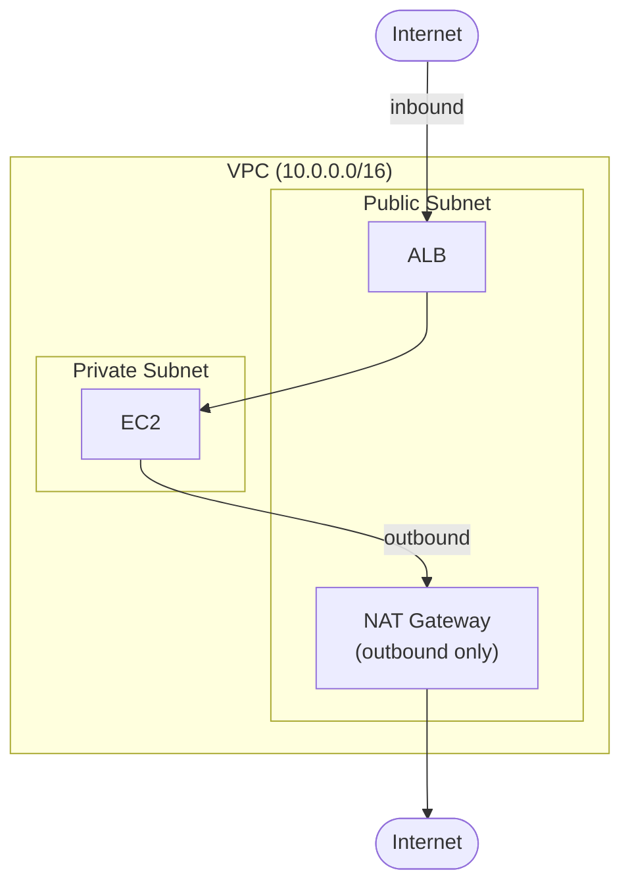
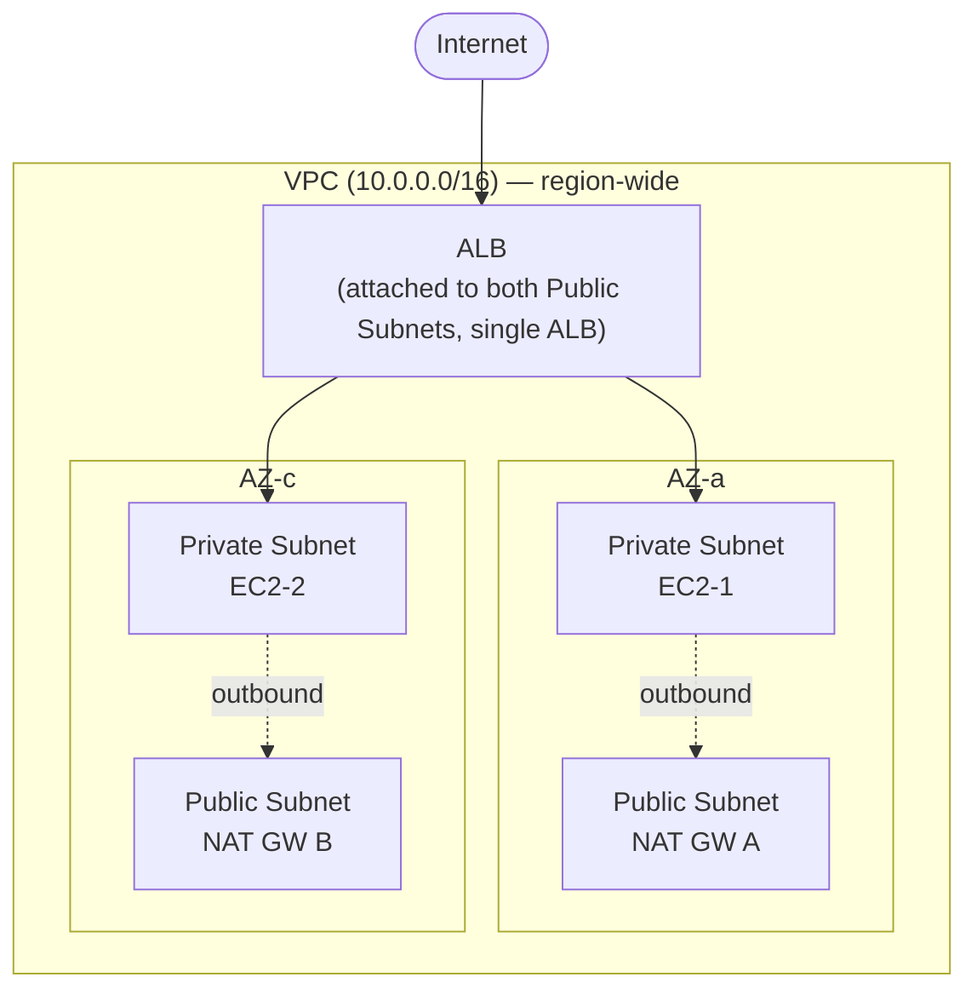
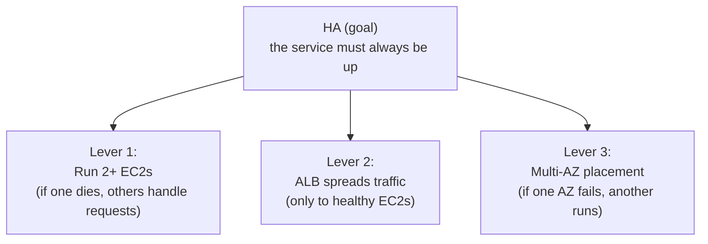

## Introduction

"Put your EC2 in a Private Subnet and wrap it with an ALB and a NAT Gateway" — you'll see this advice after a few minutes of Googling AWS. But most guides jump straight to Terraform code without explaining <strong>why</strong>. This series starts with that missing piece.

Over five parts, we cover a practical playbook for running EC2 in a Private Subnet on AWS: connecting without a Bastion via SSM, deploying with GitHub Actions, and optimizing cost. Part 1 is <strong>about the "why"</strong> — the groundwork you need before moving on to Part 2.

- <strong>Part 1 — Why Private Subnet? (this post)</strong>
- Part 2 — Building the VPC infrastructure with Terraform
- Part 3 — Connecting without Bastion using SSM Session Manager
- Part 4 — CI/CD pipeline with GitHub Actions + SSM/CodeDeploy
- Part 5 — Cost analysis and optimization strategies

The target reader is a junior engineer who has "followed a tutorial to launch an EC2 but doesn't really understand why Private Subnet or NAT Gateway are needed." After this post, you should walk away thinking <strong>"ah, so that's why we do it this way."</strong>

---

## TL;DR

- <strong>Standard architecture</strong>: `Internet → ALB (Public) → EC2 (Private) → NAT (Public) → Internet`. All inside one VPC. Public/Private is not physical isolation — just a <strong>route table</strong> difference (whether the subnet has a route to the Internet Gateway).
- <strong>Multi-AZ</strong>: a single ALB spans multiple AZs. Subnets must be created per AZ, but <strong>never create an ALB per AZ</strong>.
- <strong>This setup is not always required</strong>: for side projects, a ~$40/month Public Subnet + SG is plenty. A full Private Subnet architecture runs $100~320/month.
- <strong>When it becomes mandatory</strong>: 2+ EC2s with HA / PII / payment / compliance (ISMS, PCI DSS, etc.) / 99.9% SLA — any one of these and you need to move.
- <strong>Putting PII on Public Subnet = three real risks</strong>: direct attack exposure, compliance violations, broader liability after incidents. Past that line, Private Subnet is "insurance, not cost."

---

## 1. The Standard Architecture

### 1.1 Topology

### 1.2 Role of Each Component

First, a common point of confusion. <strong>The VPC is the outer box enclosing ALB, NAT Gateway, and EC2 — all three</strong>. Saying "ALB and NAT live in the Public Subnet" doesn't mean they sit outside the VPC; they're placed in a Public Subnet, <strong>a zone inside the same VPC</strong>.

Public vs Private is not physical isolation — it's a <strong>route table</strong> difference. Public Subnets have a route to the Internet Gateway; Private Subnets don't. (The actual route table code comes in Part 2.)

- <strong>EC2 lives in the Private Subnet.</strong> It has no public IP and cannot be reached directly from the internet. Inbound traffic arrives only through the ALB.
- <strong>ALB lives in the Public Subnet.</strong> It accepts HTTP/HTTPS traffic from the internet and routes it to the Private EC2s behind it. It is the "front door" for your service.
- <strong>NAT Gateway also lives in the Public Subnet.</strong> It is an <strong>outbound-only</strong> channel so EC2 can call external APIs, pull OS patches, or ship logs outward. Reverse access (internet → EC2) is not possible through it.
- <strong>Multi-AZ is the production baseline.</strong> ALB, NAT Gateway, and EC2 are all spread across at least two AZs so that a single AZ failure doesn't take the service down.

One principle sums it up: <strong>"Inbound only via ALB, outbound only via NAT, everything else blocked."</strong>

### 1.3 Aside: Subnet ↔ AZ Relationship, and What Multi-AZ Actually Means

We said "Multi-AZ is the production baseline." Here's what that actually looks like — the short version.

<strong>Three key facts</strong>:

1. <strong>A Subnet belongs to exactly one AZ.</strong> You pick the AZ at creation time. You cannot mix EC2s from different AZs into the same Subnet.
2. <strong>A VPC spans the entire region.</strong> Create a Subnet per AZ inside one VPC and you naturally have a Multi-AZ setup.
3. <strong>A single ALB spans multiple AZs.</strong> Attach it to Public Subnets across multiple AZs and AWS automatically handles cross-AZ routing. <strong>Do not create an ALB per AZ.</strong>

<strong>What a 2-AZ setup looks like</strong>:

- 1 VPC (region-wide)
- 1 ALB (attached to both Public Subnets)
- 1 Public/Private Subnet per AZ
- 1 NAT Gateway per AZ (a single-AZ NAT is cheaper — covered in Part 5)
- EC2s spread across the Private Subnets

<strong>More detail — what happens when an AZ dies, why not one ALB per AZ</strong>

<strong>When one AZ dies</strong>: if AZ-a goes down entirely, the Subnets and EC2s in AZ-c keep running. The ALB routes only to the surviving AZ and users barely notice. That's the practical meaning of "HA via Multi-AZ."

<strong>Why you should not create an ALB per AZ</strong>:

- One ALB = one DNS endpoint. Two ALBs means you have to manage routing between them in Route 53 (weighted or failover policies).
- You lose the ALB's built-in cross-AZ HA — it's already Multi-AZ internally.
- Double the cost, double the operational overhead.

---

---

## 2. Aside: Public IPv4 vs Elastic IP

In this architecture, EC2 has no public IP at all. But for readers who've only used Public Subnets, it's worth clarifying the difference.

When an EC2 sits in a Public Subnet, it gets a public IP — and that comes in two flavors.

|  | Public IPv4 | Elastic IP (EIP) |
| --- | --- | --- |
| Allocation | Auto-assigned when EC2 starts | Manually allocated by the user |
| Lifetime | Changes on stop/start | Fixed until explicitly released |
| Cost | $0.005/hour (since Feb 2024) | Same when attached to a running EC2. <strong>Also billed while unattached</strong> |
| Use case | Temporary testing; no need for a stable IP | DNS records, IP allowlists, external integrations |
| Attaches to | Automatically to an EC2 | Manually to EC2, NAT Gateway, NLB, etc. |

> <strong>Note</strong>: Stop → start an EC2 and the Public IPv4 changes. If you pointed DNS at that IP, the connection breaks. Use an EIP when you need a stable IP. But watch out: EIPs allocated without being attached still incur charges. AWS added this penalty because IPv4 is scarce — "don't hoard addresses you don't use."

<strong>Relation to this architecture</strong>: EC2 in a Private Subnet has neither a Public IPv4 nor an EIP, because there's no external exposure in the first place. Inbound is handled by the ALB, outbound by the NAT Gateway. This is one of the reasons Private Subnets are more secure by design.

---

## 3. Do You Actually Need This Architecture? — Sizing-Based Judgment

> <strong>Note</strong>: Honestly, for small-scale systems, ALB + Private Subnet + NAT Gateway can be over-engineering. NAT Gateway alone costs $43+/month, and ALB adds $20+ — infrastructure can end up costing more than the service itself.

"Standard architecture" doesn't mean every service must adopt it. Shoving production topology into a side project wastes money, but cutting corners on a service that handles PII creates real risk. Here's where the boundary actually sits.

### 3.1 Recommended Setups by Scale

| Setup | Approx. monthly cost | Best fit |
| --- | --- | --- |
| EC2 Public Subnet + Security Group | ~$40 | Side projects, solo operators. SG-based port restrictions are enough |
| EC2 + Nginx (reverse proxy) | ~$40 | No ALB — handle routing directly with Nginx on EC2 |
| Lightsail | $10~40 | Cheapest. Flat rate, no VPC design required |
| ALB + Private EC2 + NAT Instance | ~$60 | Keep the security posture, cut NAT Gateway cost with a NAT Instance |
| ALB + Private EC2 + NAT Gateway (this series) | $100~320 | Mid-scale and up, compliance requirements, multi-person teams |

### 3.2 Aside: Nginx (Reverse Proxy) vs ALB — What's the Difference?

The table lists "EC2 + Nginx (reverse proxy)" as an option, so let's clear that up.

- <strong>Nginx</strong> = open-source web server / reverse proxy. Takes client requests and forwards them to the real app (Node.js, Spring, etc.). Handles HTTPS termination, static file serving, caching, and L7 routing — all inside a single EC2.
- <strong>ALB</strong> is also a reverse proxy, really — AWS's managed L7 reverse proxy + load balancer.

<strong>Feature comparison</strong>:

| Feature | Nginx (on EC2) | ALB |
| --- | --- | --- |
| L7 routing, HTTPS termination | O | O |
| Static file serving | O | X (use S3/CloudFront) |
| Multi-AZ availability | Dies with the EC2 | AWS handles it |
| Health checks / Auto Scaling | Manual | Automatic |
| WAF, Shield integration | Build it yourself | One click |
| Monthly cost | Included in EC2 | $20+ separate |
| Operational burden | You manage it | None (managed) |

L7 routing, HTTPS termination, and reverse-proxying overlap. <strong>With just one EC2, ALB is overkill</strong> — there's nothing to load-balance across.

<strong>Which one to pick</strong>:

| Situation | Pick |
| --- | --- |
| 2+ EC2s with HA | <strong>ALB</strong> (Nginx alone can't provide Multi-AZ HA) |
| Auto Scaling / WAF · Shield · Cognito integration | <strong>ALB</strong> |
| Small-scale, one EC2 is enough | <strong>Nginx</strong> |
| Direct static-file serving / Lua · ngx_module customization | <strong>Nginx</strong> |
| Slow-client / large-static / zero-downtime-deploy pain actually hits | <strong>ALB → EC2 (Nginx) → app</strong> (situational addition) |

They operate at different layers and are <strong>complementary rather than competing</strong>. In production, ALB handles HA, health checks, and WAF. Nginx inside the EC2 is an <strong>optional layer</strong> you add when slow-client protection, buffering large static assets, a zero-downtime deploy buffer, or complex rewrites actually hurt — plenty of stacks ship with just Spring Boot + CloudFront + ALB.

### 3.3 When Does a Private Subnet Become Necessary?

Concrete criteria for drawing the line between small-scale and mid-scale:

| Metric | Small-scale (Public Subnet OK) | Mid-scale and up (Private Subnet recommended) |
| --- | --- | --- |
| Daily traffic | ~100K requests or fewer | 100K+ requests |
| EC2 count | 1 instance | 2+ instances (HA needed) |
| Operators | 1–2 people | 3+ (access control required) |
| Budget ratio | Infra is 10%+ of revenue | Infra is 5% or less of revenue |
| Compliance | None | Financial, healthcare, PII regulations |
| Availability requirement | Downtime tolerable | 99.9%+ SLA |
| Data sensitivity | Mostly public data | PII, payment data |

If even one row lands on the right side, it's time to consider a Private Subnet — especially <strong>compliance and data sensitivity</strong>, which push you to the mid-scale column regardless of traffic volume.

### 3.4 Aside: What Is Compliance?

<strong>Compliance = adhering to laws, regulations, and industry standards.</strong> For a backend engineer, the regulations that most directly shape infrastructure decisions are:

| Regulation | Applies to | Core infrastructure requirement |
| --- | --- | --- |
| PIPA (Korea) | Any business handling personal information | Access control, encryption, log retention, network separation |
| ISMS / ISMS-P (Korea) | IT companies above a size threshold | Network segmentation, access control, audit logs |
| e-Financial Supervision (Korea) | Financial services | Internal network isolation, DR, encryption key management |
| HIPAA (US) | Healthcare data | Encryption, access logs, BAA-covered services only |
| PCI DSS (global) | Credit card processing | Card number encryption, network isolation, vulnerability scans |
| GDPR (EU) | EU citizen data | Data residency, right to deletion, consent management |
| SOC 2 (global) | B2B SaaS | Access control, audit logs, change management |

<strong>Common requirement</strong>: nearly every regulation demands <strong>network separation</strong>. "PII / payment servers must not be directly reachable from the internet" = <strong>no EC2 dropped straight into a Public Subnet</strong>. Private Subnet + ALB is the <strong>standard answer</strong>.

<strong>When juniors hit this</strong>:

- Company preparing for ISMS certification
- Startup chasing enterprise customers and needing SOC 2
- Launching a financial or healthcare service

Once any of these kick in, the Private Subnet architecture reclassifies from "infra cost" to <strong>"compliance cost"</strong> — non-negotiable.

### 3.5 Aside: What Is HA (High Availability)?

The table above mentions "2+ EC2 instances" and "99.9%+ SLA." Both tie directly to HA, so a quick primer.

HA means <strong>"the service stays alive and doesn't die."</strong> ALB is one of the tools that help achieve HA.

If you run a single EC2, the moment it dies the service is gone. With two or more, one can die and the rest keep serving — that "can survive one death" state is HA. ALB distributes traffic across them and automatically drops unhealthy instances out of rotation.

> <strong>Core decision point</strong>: Can you justify the $60–140/month that Private Subnet architecture adds? Spending $140 on a side project that runs fine on $40 is wasteful. Spending $40 on a service that handles PII just to save money is reckless. Detailed cost analysis comes in Part 5.

Concretely, you need a Private Subnet when:

- Traffic is high enough that ALB's load balancing is actually doing work
- You run 2+ EC2 instances and availability matters
- You have compliance requirements (finance, healthcare, PII)
- Team size grew and you need access control

---

## 4. PII + Public Subnet: Three Concrete Risks

Above we said "cutting costs by leaving PII-handling servers in a Public Subnet is a risk." That's not a vague warning — it breaks down into three specific risks.

### 4.1 Direct Attack Surface Exposure

- <strong>Public IPs are automatic scanner targets</strong> — within minutes of spinning up an EC2, bots start SSH brute-force attempts.
- <strong>One SG mistake = DB/SSH exposed to the world</strong> — this misconfig causes real incidents every year.
- <strong>Direct exposure = direct data exfiltration</strong> — attackers skip the "web → internal network → DB" pivot.
- <strong>Private Subnet + ALB adds a defense layer</strong> — ALB blocks anomalies at L7; attach WAF and you also get attack detection and blocking.

### 4.2 Compliance Violations

- <strong>Regulations mandate network separation</strong> — Korea's PIPA and ISMS-P: "systems processing PII must be physically or logically separated from external networks."
- <strong>Instant audit finding</strong> — "PII server in a Public Subnet with a public IP" is classified as insufficient technical safeguards.
- <strong>Evidence of failing reasonable protection duty</strong> after an incident — widens the scope of legal liability.

### 4.3 Broader Liability After Incidents

- <strong>Private Subnet + ALB</strong> → you can argue "we applied the standard security architecture" (Well-Architected as evidence).
- <strong>Public Subnet neglect</strong> → opens the judgment "security was sacrificed for cost."
- <strong>This judgment directly affects fines and damages</strong> — the wider the fault, the bigger the payout.

> <strong>Bottom line</strong>: For a side project that only handles public data, Public Subnet + Security Group is fine. But the moment PII (user data, payment information, sensitive records) is involved, network-level isolation (Private Subnet) is <strong>insurance, not cost</strong>. Weigh the extra $60–100/month against potential fines and reputational damage, and the direction is obvious.

In practice, the pragmatic path is: <strong>start with Public Subnet + SG for small scale, and migrate to Private Subnet architecture when scale or data sensitivity changes</strong>. You don't need to go full-fledged from day one — but when the nature of your data shifts, don't hesitate.

---

## Recap

Key takeaways from this post:

1. <strong>The standard architecture is "ALB + Private EC2 + NAT Gateway."</strong> Inbound only via ALB, outbound only via NAT, everything else blocked.
2. <strong>Understand Public IPv4 vs EIP</strong> to see why neither is needed in this architecture — there's no external exposure at all.
3. <strong>Not every service needs this setup.</strong> A $40/month Public Subnet + SG is reasonable for small side projects. Move to Private Subnet when scale or compliance demands it.
4. <strong>HA means "2+ EC2s + ALB + Multi-AZ."</strong> This is often the practical tipping point that forces you into a Private Subnet architecture.
5. <strong>PII + Public Subnet has three concrete risks</strong>: direct attack exposure, compliance violations, and broader liability after incidents. The moment PII is involved, Private Subnet is insurance, not cost.

Part 1 had one goal — <strong>making the architecture make sense</strong>. If you now think "oh, that's why we do it this way" when you see a Private Subnet diagram, we're done here. Part 2 starts building this architecture in actual code.

In the next post — <strong>Building VPC Infrastructure with Terraform</strong> — we design the VPC CIDR, lay out 2AZ Public/Private subnets, wire up route tables, use the "SG-references-SG" pattern for Security Groups, and stand up ALB and EC2 in a single `main.tf` that comes up with one `terraform apply`.

---

## Appendix: Glossary for This Series

Bookmark this table and come back when acronyms blur together.

| Acronym | Meaning |
| --- | --- |
| VPC | Virtual Private Cloud. Your own virtual network inside AWS |
| Subnet | An IP range inside a VPC. Split into Public (internet-connected) and Private (internal only) |
| ALB | Application Load Balancer. An L7 load balancer that distributes traffic across multiple EC2s |
| NAT | Network Address Translation. Lets Private Subnet EC2s reach the internet outbound |
| AZ | Availability Zone. A physically separated datacenter inside a region. Seoul has 2a, 2b, 2c, 2d |
| SG | Security Group. Instance-level firewall attached to EC2/ALB/etc. |
| NACL | Network Access Control List. Subnet-level firewall |
| IAM | Identity and Access Management. AWS's permissions system |
| SSM | AWS Systems Manager. An umbrella service for EC2 management (Session Manager, Run Command, etc.) |
| CloudTrail | AWS API call audit log — automatically records who did what, when |
