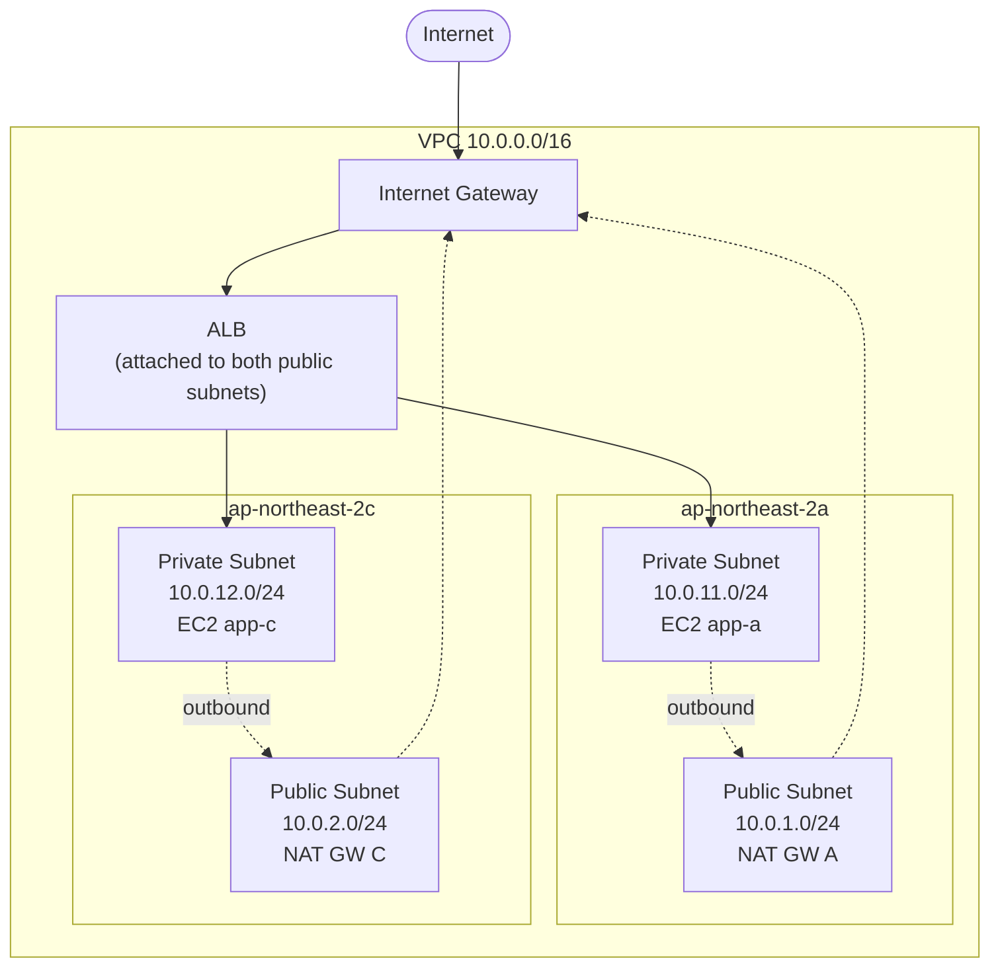
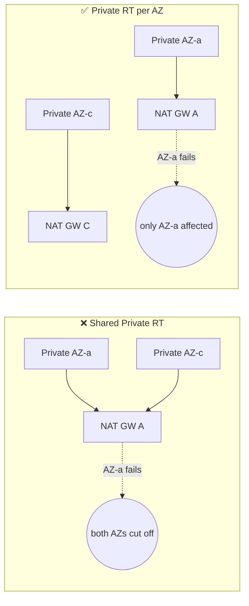
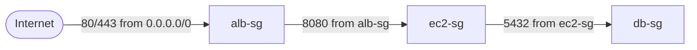

## Introduction

If [Part 1](/blog/en/aws-private-ec2-guide-1) convinced you of <strong>why</strong> Private Subnet, Part 2 is where we <strong>actually stand it up</strong>. This isn't a read-and-move-on post — paste the code in this article into a `main.tf`, run `terraform apply`, and the diagram from Part 1 materializes in your AWS account.

The approach is deliberate — <strong>a single `main.tf`</strong>. Telling a junior "split it into files first" burns mental energy tracking which variable lives where. Reading the file top-to-bottom should expose the dependency chain; we only divide regions with comment blocks (`# ===== VPC =====`). Production-grade module splitting comes in the final section.

- [Part 1 — Why Private Subnet?](/blog/en/aws-private-ec2-guide-1)
- <strong>Part 2 — Building VPC infrastructure with Terraform (this post)</strong>
- Part 3 — Connecting without Bastion using SSM Session Manager
- Part 4 — CI/CD pipeline with GitHub Actions + SSM/CodeDeploy
- Part 5 — Cost analysis and optimization strategies

This post targets a <strong>junior who's done `hello_world` in Terraform but hasn't stood up a full VPC on their own</strong>. After reading, two ideas should stick: "ah, so this is what 'SG references SG' actually means" and "this is why Route Tables are per-AZ, not shared."

---

## TL;DR

- <strong>Design locked</strong>: `VPC 10.0.0.0/16` + 4 `/24` subnets (2 Public + 2 Private), 2 AZs (`ap-northeast-2a`, `2c`), 1 NAT Gateway per AZ.
- <strong>Key pattern</strong>: SGs reference <strong>other SGs, not IP CIDRs</strong>. Chain it — `alb-sg` → `ec2-sg` → `db-sg` — and you have real-world SG design.
- <strong>Private Route Tables must be split per AZ.</strong> A single shared Private RT breaks AZ failure isolation because NAT Gateway is an AZ-scoped resource.
- <strong>Leave NACL at its defaults.</strong> SG is stateful (return traffic auto-allowed), NACL is stateless — for 99% of workloads, SG-only is the right call.
- <strong>Start with a single `main.tf`.</strong> The community module `terraform-aws-modules/vpc/aws` is great in production but hides too much for learning — reach for modules after you've typed every resource at least once.

---

## 1. Design Decisions at a Glance

Before the body, one table that shows every resource we'll create. The <strong>why</strong> of each choice is explained in its section.

| Item | Decision | Rationale |
| --- | --- | --- |
| VPC CIDR | `10.0.0.0/16` | 60K+ IPs. A unit a junior can reason about in their head |
| Subnets | 4 `/24` (Public 2 + Private 2) | 254 IPs each. AZ identifiable from CIDR alone |
| AZ count | 2 (`ap-northeast-2a`, `2c`) | Keeps Part 1's Multi-AZ baseline |
| IGW | 1 | One per region is enough |
| NAT Gateway | 1 per AZ (2 total) | AZ failure isolation — see §3 |
| Route Tables | 1 Public + 1 Private per AZ | Required to point at per-AZ NATs |
| Security Groups | `alb-sg`, `ec2-sg`, `db-sg` | The SG reference chain |
| NACL | Defaults, untouched | Stateless overhead — see §5 |
| EC2 | 2 × `t3.micro` (one per Private Subnet) | IAM role attached for SSM |
| ALB | Internet-facing, attached to both public subnets | "Never one ALB per AZ" from Part 1 |

The topology, once more:



---

## 2. VPC and Subnets — CIDR Design and 2-AZ Layout

### 2.1 Why 10.0.0.0/16 + four /24s

<strong>CIDR notation indicates "how many IPs this range covers."</strong> `/16` gives you 65,536 IPs; `/24` gives 256 (AWS reserves 5 per subnet, leaving 251 usable).

- <strong>`/16` VPC</strong> — You won't run out of IPs even if a few services pile on. `172.16.0.0/16` or `192.168.0.0/16` work too, but `10.0.0.0/16` collides less with AWS examples and corporate networks, so it's the friendliest starting point.
- <strong>`/24` subnets</strong> — 254 IPs per subnet. Unless you're stuffing hundreds of EC2s into one subnet, it's plenty, and you can tell the subnet at a glance from the third octet.
- <strong>AZ-friendly numbering</strong> — Public as `10.0.1.x`, `10.0.2.x` (single digit) and Private as `10.0.11.x`, `10.0.12.x` (two digits). The CIDR alone tells you "Private AZ-c" without looking anything up.

> <strong>Note</strong>: Changing a VPC CIDR after creation is painful (secondary CIDRs are allowed, but shifting the primary range effectively means rebuilding). In practice, <strong>oversize the VPC at `/16`</strong> and carve subnets narrowly.

### 2.2 Provider and VPC Skeleton

```hcl
# ===== Terraform & Provider =====
terraform {
  required_version = ">= 1.5.0"
  required_providers {
    aws = {
      source  = "hashicorp/aws"
      version = "~> 5.0"  # 5.x: current major at the time of writing
    }
  }
}

provider "aws" {
  region = "ap-northeast-2"  # Seoul region — matches Part 1
}

# ===== VPC =====
resource "aws_vpc" "main" {
  cidr_block           = "10.0.0.0/16"   # 65K+ IPs. Hard to change later, so oversize upfront
  enable_dns_support   = true             # In-VPC DNS resolution (default true)
  enable_dns_hostnames = true             # Default false — required for ALB DNS and Part 3's SSM Endpoint Private DNS
  tags = { Name = "private-ec2-vpc" }
}
```

`enable_dns_hostnames = true` is required later for ALB DNS resolution and for SSM VPC Endpoints using Private DNS. It defaults to `false`, so skipping it comes back to bite you in Part 3 when you attach SSM endpoints.

### 2.3 The Four Subnets

```hcl
# ===== Public Subnets =====
resource "aws_subnet" "public_a" {
  vpc_id                  = aws_vpc.main.id
  cidr_block              = "10.0.1.0/24"       # Third octet 1 = Public by convention
  availability_zone       = "ap-northeast-2a"   # A subnet belongs to exactly one AZ — this one is AZ-a
  map_public_ip_on_launch = true                 # ★ This switch IS what makes a subnet "Public" — EC2 auto-gets a public IP
  tags = { Name = "private-ec2-public-a" }
}

resource "aws_subnet" "public_c" {
  vpc_id                  = aws_vpc.main.id
  cidr_block              = "10.0.2.0/24"
  availability_zone       = "ap-northeast-2c"   # Second AZ for Multi-AZ
  map_public_ip_on_launch = true
  tags = { Name = "private-ec2-public-c" }
}

# ===== Private Subnets =====
resource "aws_subnet" "private_a" {
  vpc_id            = aws_vpc.main.id
  cidr_block        = "10.0.11.0/24"            # Third octet 11 = Private by convention
  availability_zone = "ap-northeast-2a"
  # map_public_ip_on_launch omitted = default false → no public IP (= what "Private" really means)
  tags              = { Name = "private-ec2-private-a" }
}

resource "aws_subnet" "private_c" {
  vpc_id            = aws_vpc.main.id
  cidr_block        = "10.0.12.0/24"
  availability_zone = "ap-northeast-2c"
  tags              = { Name = "private-ec2-private-c" }
}
```

<strong>`map_public_ip_on_launch`</strong> decides whether an EC2 launched in this subnet gets a public IPv4 automatically. Set `true` only on Public Subnets; leave it at its default (`false`) on Private Subnets. This is the actual switch behind "Private EC2 has no public IP" from Part 1.

> <strong>Note</strong>: Seoul has four AZs — `2a, 2b, 2c, 2d`. Skipping `2b` and using `2a` + `2c` has no technical reason; it's a convention inherited from AWS docs (and from regions like `us-east-1` where `b` historically had account restrictions). Any two work equally well for this lab.

---

## 3. Routing — IGW, NAT Gateway, Route Table

### 3.1 Internet Gateway and Public Route Table

<strong>The Internet Gateway (IGW) is the door between a VPC and the internet.</strong> One per VPC, and it's free.

```hcl
# ===== Internet Gateway =====
# The door between the VPC and the internet. One per VPC, free.
resource "aws_internet_gateway" "main" {
  vpc_id = aws_vpc.main.id
  tags   = { Name = "private-ec2-igw" }
}

# ===== Public Route Table =====
# Any subnet attached to this RT becomes "Public" — the key is the 0.0.0.0/0 → IGW route below
resource "aws_route_table" "public" {
  vpc_id = aws_vpc.main.id
  route {
    cidr_block = "0.0.0.0/0"                    # All outbound destinations
    gateway_id = aws_internet_gateway.main.id   # sent to the IGW → reaches the internet
  }
  tags = { Name = "private-ec2-public-rt" }
}

# Subnet ↔ RT binding — without this association, a Subnet has no character
resource "aws_route_table_association" "public_a" {
  subnet_id      = aws_subnet.public_a.id
  route_table_id = aws_route_table.public.id
}

resource "aws_route_table_association" "public_c" {
  subnet_id      = aws_subnet.public_c.id
  route_table_id = aws_route_table.public.id
}
```

"A Public Subnet is Public because its route table has an IGW route" — the claim from Part 1 boils down to these four lines inside `route { ... }`. Subnets themselves carry no Public/Private attribute. Their character is decided the moment a route table attaches.

### 3.2 NAT Gateway and Private Route Tables (Per-AZ)

<strong>A NAT Gateway is the outbound-only exit for Private Subnet EC2s.</strong> Allocate an `aws_eip` (Elastic IP) and drop the NAT into a Public Subnet.

```hcl
# ===== NAT Gateways (one per AZ) =====
# NAT needs a stable public IP to egress — allocate an EIP first
resource "aws_eip" "nat_a" {
  domain = "vpc"
  tags   = { Name = "private-ec2-nat-eip-a" }
}

resource "aws_eip" "nat_c" {
  domain = "vpc"
  tags   = { Name = "private-ec2-nat-eip-c" }
}

resource "aws_nat_gateway" "a" {
  allocation_id = aws_eip.nat_a.id
  subnet_id     = aws_subnet.public_a.id       # NAT itself lives in a Public Subnet (it needs IGW to reach the internet)
  tags          = { Name = "private-ec2-nat-a" }
  depends_on    = [aws_internet_gateway.main]  # IGW must exist first for NAT to have an outbound path
}

resource "aws_nat_gateway" "c" {
  allocation_id = aws_eip.nat_c.id
  subnet_id     = aws_subnet.public_c.id
  tags          = { Name = "private-ec2-nat-c" }
  depends_on    = [aws_internet_gateway.main]
}

# ===== Private Route Tables (split per AZ) =====
# ★ AZ failure isolation — each AZ's Private Subnet only points at its own NAT
resource "aws_route_table" "private_a" {
  vpc_id = aws_vpc.main.id
  route {
    cidr_block     = "0.0.0.0/0"
    nat_gateway_id = aws_nat_gateway.a.id     # AZ-a Private → AZ-a NAT (no cross-AZ)
  }
  tags = { Name = "private-ec2-private-rt-a" }
}

resource "aws_route_table" "private_c" {
  vpc_id = aws_vpc.main.id
  route {
    cidr_block     = "0.0.0.0/0"
    nat_gateway_id = aws_nat_gateway.c.id     # AZ-c Private → AZ-c NAT
  }
  tags = { Name = "private-ec2-private-rt-c" }
}

resource "aws_route_table_association" "private_a" {
  subnet_id      = aws_subnet.private_a.id
  route_table_id = aws_route_table.private_a.id
}

resource "aws_route_table_association" "private_c" {
  subnet_id      = aws_subnet.private_c.id
  route_table_id = aws_route_table.private_c.id
}
```

### 3.3 Aside: Why Split Private Route Tables by AZ?

This is where juniors most often trip. "The Public RT is one, so why are there two Private RTs?"

<strong>The answer is AZ failure isolation.</strong> A NAT Gateway is <strong>tied to a single subnet (and therefore a single AZ)</strong>. If AZ-c's EC2s route through AZ-a's NAT and AZ-a fails, healthy AZ-c loses outbound too.



<details>
<summary><strong>More detail — a single NAT is fine if you're cost-sensitive</strong></summary>

In dev/staging where availability requirements are low, it's common to run a single NAT Gateway and have both Private Route Tables point at it. That cuts NAT cost in half ($43 saved). Just document that you've knowingly accepted the "Bad" scenario above. Part 5 covers NAT Gateway cost optimization in detail.

</details>

---

## 4. Security Group — The SG-References-SG Pattern

### 4.1 The core idea

<strong>A Security Group is an instance-level firewall attached to EC2/ALB and friends.</strong> The most basic usage is "allow a port from an IP CIDR," but in practice the <strong>pattern that matters is "an SG references another SG"</strong>.



- <strong>`alb-sg`</strong>: accepts 80/443 from the internet. The outer boundary.
- <strong>`ec2-sg`</strong>: accepts "8080 coming from `alb-sg`." <strong>No IPs are involved.</strong>
- <strong>`db-sg`</strong>: accepts "5432 coming from `ec2-sg`." Again, no IPs.

### 4.2 Why reference an SG instead of an IP?

| IP-based | SG reference |
| --- | --- |
| Managing IPs by hand as EC2s grow | Attach the SG and it just works |
| EC2 restart can change IPs | SG IDs are durable |
| Bad fit for Auto Scaling | Natural fit for Auto Scaling |
| ALB's internal IPs rotate — untrackable | Bind to `alb-sg` and you're done |

Imagine you run 10 EC2s and add an 11th. With IP rules you'd open the DB SG one more time. With SG references, <strong>attaching `ec2-sg` to the new EC2 automatically grants it DB access</strong>. This is what "SG-driven control in Private Subnets" from Part 1 actually looks like in code.

### 4.3 The code

```hcl
# ===== ALB SG — outer boundary =====
# The only SG that faces the internet. IP-based allow (0.0.0.0/0) is unavoidable here.
resource "aws_security_group" "alb" {
  name        = "private-ec2-alb-sg"
  description = "ALB: HTTP/HTTPS from the internet"
  vpc_id      = aws_vpc.main.id

  ingress {
    description = "HTTP"
    from_port   = 80
    to_port     = 80
    protocol    = "tcp"
    cidr_blocks = ["0.0.0.0/0"]            # Inbound from the internet = IP-based allow is inevitable
  }

  ingress {
    description = "HTTPS"
    from_port   = 443
    to_port     = 443
    protocol    = "tcp"
    cidr_blocks = ["0.0.0.0/0"]
  }

  egress {
    from_port   = 0
    to_port     = 0
    protocol    = "-1"                      # -1 = all protocols
    cidr_blocks = ["0.0.0.0/0"]
  }

  tags = { Name = "private-ec2-alb-sg" }
}

# ===== EC2 SG — accepts only from ALB =====
# ★ Here is where "SG references SG" begins — no IPs involved
resource "aws_security_group" "ec2" {
  name        = "private-ec2-app-sg"
  description = "EC2: app port from ALB SG only"
  vpc_id      = aws_vpc.main.id

  ingress {
    description     = "App port from ALB"
    from_port       = 8080
    to_port         = 8080
    protocol        = "tcp"
    security_groups = [aws_security_group.alb.id]  # ★ SG ID instead of cidr — immune to ALB IP churn
  }

  egress {
    from_port   = 0
    to_port     = 0
    protocol    = "-1"
    cidr_blocks = ["0.0.0.0/0"]                    # Outbound via NAT Gateway — needed for dnf install, etc.
  }

  tags = { Name = "private-ec2-app-sg" }
}

# ===== DB SG — accepts only from EC2 (illustrates the SG chain) =====
resource "aws_security_group" "db" {
  name        = "private-ec2-db-sg"
  description = "DB: Postgres from EC2 SG only"
  vpc_id      = aws_vpc.main.id

  ingress {
    description     = "Postgres from EC2"
    from_port       = 5432
    to_port         = 5432
    protocol        = "tcp"
    security_groups = [aws_security_group.ec2.id]  # ★ Last link in the chain: alb-sg → ec2-sg → db-sg
  }

  tags = { Name = "private-ec2-db-sg" }
}
```

We don't actually run a database in this series — the reason `db-sg` is included anyway is that it's the <strong>clearest illustration of the SG reference chain</strong>. Seeing a 2-step chain (ALB → EC2) is fine; seeing a <strong>3-step chain (ALB → EC2 → DB)</strong> makes it click how far this pattern scales.

---

## 5. Aside: Why Leave NACL at Defaults?

### 5.1 Stateful (SG) vs Stateless (NACL)

- <strong>SG is stateful.</strong> Allow "inbound traffic to port 80" and <strong>the return traffic (coming back on an ephemeral port) is automatically allowed</strong>.
- <strong>NACL is stateless.</strong> Even if you allow inbound, <strong>you must separately allow the outbound return traffic</strong>. In practice that means manually opening the `1024-65535` ephemeral range, which is tedious.

### 5.2 Practical guidance

| Situation | Tool |
| --- | --- |
| 99% of regular services | SG only — fine-grained per instance |
| Regulated (finance, public sector) with defense-in-depth requirements | SG + custom NACL (extra subnet-level layer) |
| Blocking an entire IP range (botnet ASN, etc.) | NACL deny rules — SG has no deny primitive |

Conclusion: <strong>this guide leaves the default NACL (allow all) as-is</strong>. Concentrating all firewall rules in the SG is simpler to learn and simpler to operate. You reach for NACL when regulation explicitly requires a subnet-level defense layer — and by that point you already have a dedicated network team.

---

## 6. ALB + EC2 + IAM Role (SSM Setup)

### 6.1 IAM Role — groundwork for Part 3

A Private EC2 has no public IP, so SSH is off the table. We'll use <strong>SSM Session Manager</strong> (Part 3), but for that the EC2 must carry an IAM Role with `AmazonSSMManagedInstanceCore` attached. We wire it now so Part 3 can plug in cleanly.

```hcl
# ===== IAM Role for EC2 (SSM) =====
# EC2 uses the Role attached via its "instance profile" when calling AWS APIs — not user credentials
resource "aws_iam_role" "ec2_ssm" {
  name = "private-ec2-ssm-role"
  assume_role_policy = jsonencode({
    Version = "2012-10-17"
    Statement = [{
      Effect    = "Allow"
      Principal = { Service = "ec2.amazonaws.com" }  # Trust policy: "EC2 service may assume this role"
      Action    = "sts:AssumeRole"
    }]
  })
}

# AWS-managed policy — the minimum permission set for SSM Session Manager (this alone suffices for Part 3)
resource "aws_iam_role_policy_attachment" "ec2_ssm" {
  role       = aws_iam_role.ec2_ssm.name
  policy_arn = "arn:aws:iam::aws:policy/AmazonSSMManagedInstanceCore"
}

# Instance Profile wrapper that actually attaches the Role to an EC2 — pass this name to aws_instance.iam_instance_profile
resource "aws_iam_instance_profile" "ec2_ssm" {
  name = "private-ec2-ssm-profile"
  role = aws_iam_role.ec2_ssm.name
}
```

### 6.2 Two EC2 instances

```hcl
# ===== AMI (Amazon Linux 2023) =====
# al2023 = SSM Agent preinstalled + dnf. AMI IDs rotate, so resolve the latest via a data source
data "aws_ami" "al2023" {
  most_recent = true
  owners      = ["amazon"]                         # Only images owned by Amazon's official account
  filter {
    name   = "name"
    values = ["al2023-ami-*-x86_64"]
  }
}

# ===== EC2 Instances (Private Subnet, Multi-AZ) =====
resource "aws_instance" "app_a" {
  ami                    = data.aws_ami.al2023.id
  instance_type          = "t3.micro"              # Lab-sized (near free tier)
  subnet_id              = aws_subnet.private_a.id # ★ Placed in Private Subnet → no public IP, SSH not possible
  vpc_security_group_ids = [aws_security_group.ec2.id]
  iam_instance_profile   = aws_iam_instance_profile.ec2_ssm.name  # ★ The Role that enables SSM access in Part 3
  user_data = <<-EOT
    #!/bin/bash
    dnf install -y nginx
    # Demo only — flip Nginx to listen on 8080 so it matches the ALB target port
    sed -i 's/listen\s*80;/listen 8080;/' /etc/nginx/nginx.conf
    echo "Hello from AZ-a ($(hostname))" > /usr/share/nginx/html/index.html
    systemctl enable --now nginx
  EOT
  tags = { Name = "private-ec2-app-a" }
}

resource "aws_instance" "app_c" {
  ami                    = data.aws_ami.al2023.id
  instance_type          = "t3.micro"
  subnet_id              = aws_subnet.private_c.id # Private Subnet on the AZ-c side — Multi-AZ spread
  vpc_security_group_ids = [aws_security_group.ec2.id]
  iam_instance_profile   = aws_iam_instance_profile.ec2_ssm.name
  user_data = <<-EOT
    #!/bin/bash
    dnf install -y nginx
    sed -i 's/listen\s*80;/listen 8080;/' /etc/nginx/nginx.conf
    echo "Hello from AZ-c ($(hostname))" > /usr/share/nginx/html/index.html
    systemctl enable --now nginx
  EOT
  tags = { Name = "private-ec2-app-c" }
}
```

The Nginx port swap in `user_data` is a <strong>demo-level trick</strong> — just enough to prove ALB targets land on 8080. Real app deployments come in Part 4 (CI/CD).

### 6.3 ALB + Target Group + Listener

```hcl
# ===== ALB =====
resource "aws_lb" "app" {
  name               = "private-ec2-alb"
  internal           = false                                              # false = internet-facing (true = VPC-internal only)
  load_balancer_type = "application"                                      # L7 — supports path/host-based routing
  security_groups    = [aws_security_group.alb.id]
  subnets            = [aws_subnet.public_a.id, aws_subnet.public_c.id]   # ★ One ALB, attached to both Public Subnets — never one-per-AZ (Part 1 rule)
  tags               = { Name = "private-ec2-alb" }
}

# Target Group: the backend pool ALB forwards to + the health check definition
resource "aws_lb_target_group" "app" {
  name     = "private-ec2-tg"
  port     = 8080
  protocol = "HTTP"
  vpc_id   = aws_vpc.main.id

  health_check {
    path                = "/"
    matcher             = "200"                   # Only 200 OK counts as healthy
    interval            = 30                      # Check every 30s
    timeout             = 5
    healthy_threshold   = 2                       # 2 consecutive OKs → flip to healthy
    unhealthy_threshold = 3                       # 3 consecutive fails → out of rotation
  }
}

# Register each EC2 with the Target Group manually (static — we aren't using Auto Scaling)
resource "aws_lb_target_group_attachment" "app_a" {
  target_group_arn = aws_lb_target_group.app.arn
  target_id        = aws_instance.app_a.id
  port             = 8080
}

resource "aws_lb_target_group_attachment" "app_c" {
  target_group_arn = aws_lb_target_group.app.arn
  target_id        = aws_instance.app_c.id
  port             = 8080
}

# Listener: which port ALB accepts and where it forwards. Lab only — production adds 443 + ACM
resource "aws_lb_listener" "http" {
  load_balancer_arn = aws_lb.app.arn
  port              = 80
  protocol          = "HTTP"
  default_action {
    type             = "forward"
    target_group_arn = aws_lb_target_group.app.arn
  }
}

# ===== Outputs =====
# Printed at the end of apply — paste the values directly into the next step
output "alb_dns_name" {
  value       = aws_lb.app.dns_name
  description = "ALB public DNS — open this directly in a browser"
}

output "ec2_ids" {
  value = {
    app_a = aws_instance.app_a.id
    app_c = aws_instance.app_c.id
  }
  description = "Instance IDs for SSM Session Manager in Part 3"
}
```

> <strong>Note</strong>: HTTPS (443) listener is intentionally omitted for brevity. In production, request an ACM cert, add a 443 listener, and redirect 80 → 443.

---

## 7. terraform apply, Then Verify in the Console

### 7.1 Apply

Paste the blocks above into a single `main.tf` in the order shown, then:

```bash
# 1. install the provider plugin
terraform init

# 2. preview what will be created
terraform plan

# 3. actually create it (type Y)
terraform apply
```

When apply finishes you'll see `alb_dns_name = "private-ec2-alb-xxxxxxxxxx.ap-northeast-2.elb.amazonaws.com"` at the bottom. <strong>Paste that DNS into a browser and you should see `Hello from AZ-a` or `Hello from AZ-c` alternating — that's the success signal</strong>.

### 7.2 Console verification checklist

Even if apply succeeded, walk the AWS console once to confirm Part 1's architecture actually stood up.

| Service | Menu | What to check |
| --- | --- | --- |
| VPC | Your VPCs | `private-ec2-vpc`, CIDR `10.0.0.0/16` |
| VPC | Subnets | 2 Public (`10.0.1.0/24`, `10.0.2.0/24`) + 2 Private (`10.0.11.0/24`, `10.0.12.0/24`) |
| VPC | Route Tables | 1 Public (→ IGW) + 2 Private (→ their own NAT), with subnet associations |
| VPC | NAT Gateways | 2, status `Available`, EIPs attached |
| VPC | Internet Gateways | 1, attached to the VPC |
| EC2 | Security Groups | 3 (`alb-sg`, `ec2-sg`, `db-sg`); Inbound Source shows SG IDs, not IPs |
| EC2 | Instances | 2, no Public IP, Private IPs in `10.0.11.x` / `10.0.12.x` |
| EC2 | Load Balancers | 1 ALB, 2 availability zones active |
| EC2 | Target Groups | 2 healthy (initially `unhealthy` — turns healthy in 1–2 minutes) |

If Target Group stays `unhealthy`, it's almost always one of three:

1. Nginx not listening on 8080 → hop onto the EC2 via SSM (Part 3) and `curl localhost:8080`.
2. `ec2-sg` inbound source is something other than `alb-sg`.
3. Private Subnet's route table doesn't point at NAT, so `dnf install nginx` failed — check `/var/log/cloud-init-output.log` via SSM.

---

## 8. How Production Differs — Modularization and the Community Module

### 8.1 Limits of a single `main.tf`

The code in this post is ideal for learning but you wouldn't ship it verbatim. Reasons:

- <strong>Hard to replicate environments</strong> — dev/staging/prod become copy-pasted `main.tf`s that drift apart.
- <strong>PR diffs balloon</strong> — a one-line VPC tweak shows the full 400-line file in the diff.
- <strong>One state, one blast radius</strong> — `terraform apply` touches everything from VPC to EC2. It's easy to accidentally destroy the VPC.

### 8.2 The real-world refactor

```text
infra/
├── modules/
│   ├── network/    # VPC, Subnet, IGW, NAT, Route Table
│   ├── security/   # the three SGs
│   └── compute/    # EC2, ALB, Target Group
└── envs/
    ├── dev/        # module calls + dev variables
    ├── staging/
    └── prod/       # prod uses 2 NAT Gateways; dev uses 1, etc.
```

- <strong>`terraform_remote_state`</strong> lets the compute module consume outputs from the network module.
- <strong>S3 backend + DynamoDB lock</strong> for shared state and concurrency.
- <strong>Per-environment variables</strong> (`instance_type`, `az_count`, `enable_nat_ha`, etc.) capture the dev/prod difference.

### 8.3 What about `terraform-aws-modules/vpc/aws`?

The most-used community module on the Terraform Registry. Excellent for production — but <strong>not recommended while learning</strong>. Why:

| Aspect | Community module | Single `main.tf` |
| --- | --- | --- |
| Resource understanding | `aws_vpc`/`aws_subnet` are hidden inside the module | Every resource sits in front of you |
| Debugging | You guess from module variable names | `terraform state list` maps 1:1 |
| Learning value | Weak sense of "why NAT matters" | Every line maps back to the Part 1 diagram |
| Production convenience | Dozens of flags ready to flip | You have to port by hand |

In short: <strong>type every resource by hand once, feel the VPC structure, then migrate to a community module.</strong> Starting from the community module often traps you in "it kinda works, I just tweak variables" mode forever.

---

## Recap

Key takeaways:

1. <strong>Keep the design simple — `/16` VPC + four `/24` subnets + 2 AZs.</strong> The numbering should let you read Public/Private and the AZ straight off the CIDR.
2. <strong>Subnet character comes from the route table, not the subnet.</strong> Point at IGW → Public; point at NAT → Private. Subnets themselves are neutral.
3. <strong>Split Private Route Tables per AZ.</strong> A shared Private RT breaks AZ failure isolation because NAT Gateway is AZ-scoped.
4. <strong>SGs reference other SGs, not IPs.</strong> The `alb-sg` → `ec2-sg` → `db-sg` chain is the real-world pattern and meshes naturally with Auto Scaling and shifting IPs.
5. <strong>Leave NACL at defaults.</strong> Concentrating firewall rules in the stateful SG layer is simpler end-to-end.
6. <strong>Pre-attach `AmazonSSMManagedInstanceCore` to EC2.</strong> It's the groundwork for SSM-based access in Part 3 with no public IP and no SSH.
7. <strong>Learn in a single `main.tf`; modularize for production.</strong> Community modules come after this one hands-on round.

Part 2's goal was just as specific as Part 1's — <strong>actually standing up the diagram</strong>. VPC, Subnets, Route Tables, SGs, ALB, EC2 are all live in your account now, and `alb_dns_name` is serving responses.

Next up: <strong>connecting to these Private EC2s with SSM Session Manager — no Bastion, no open port 22</strong>. We'll shell in, push files, tail logs — all without ever opening SSH, and explore how an outbound-only 443 connection supports a bidirectional session, and exactly how this differs from SSH.

---

## Appendix. Cost Warnings and Variable Tips

### A. Mind the bill while practicing

Even for a lab, <strong>2 NAT Gateways + 1 ALB + 2 EC2s</strong> cost roughly $0.25/hour — <strong>about $6/day</strong> if you leave them running. When you're done:

```bash
terraform destroy
```

Don't forget. NAT Gateway and EIP are the classic "billed while idle" resources — easy to leave behind and expensive.

### B. Running the lab on the cheap

Comment out `aws_nat_gateway.c`, `aws_eip.nat_c`, and `aws_route_table.private_c`, then point `private_c`'s route table association at `aws_route_table.private_a`. You're down to a single NAT Gateway (saves ~$43/month). Just accept the "you broke AZ failure isolation" trade-off — knowingly.

### C. Variable tips

This post hardcodes on purpose. If you want to start pulling values into variables immediately, these three already pay for themselves:

```hcl
variable "project"  { default = "private-ec2" }
variable "region"   { default = "ap-northeast-2" }
variable "vpc_cidr" { default = "10.0.0.0/16" }
```

The next step is a list like `azs = ["ap-northeast-2a", "ap-northeast-2c"]` plus `for_each` to generate subnets, NAT Gateways, and route tables. By the time you've gone that far, the limits of a single `main.tf` become obvious — that's when you split into modules.
