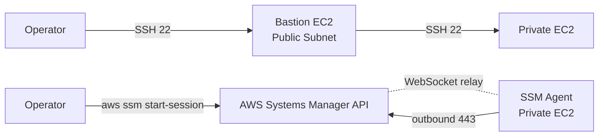
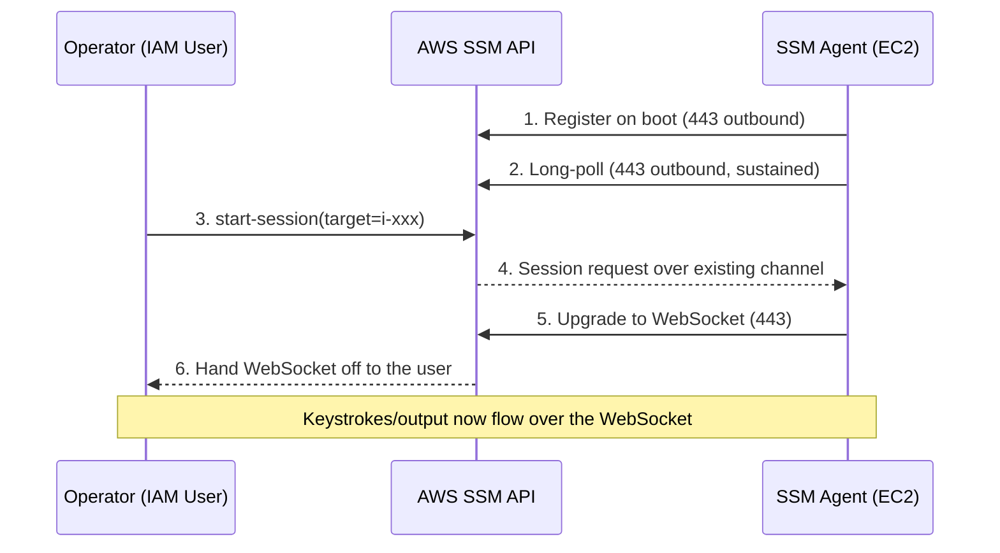
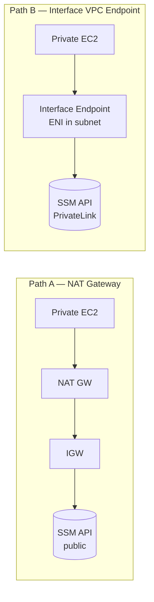
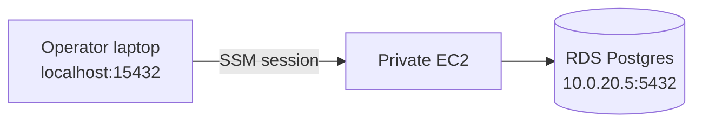

## Introduction

The Private EC2 we built in [Part 2](/blog/en/aws-private-ec2-guide-2) has no public IP. That means you cannot SSH into it directly. The traditional answer is a <strong>Bastion (jump host)</strong> — drop one EC2 into a Public Subnet, open port 22, and SSH from there to the Private EC2.

This series rejects that answer. We will land a shell, run commands, and even port-forward to RDS — <strong>without ever opening port 22</strong>. The answer is SSM Session Manager.

- [Part 1 — Why Private Subnet?](/blog/en/aws-private-ec2-guide-1)
- [Part 2 — Building VPC infrastructure with Terraform](/blog/en/aws-private-ec2-guide-2)
- <strong>Part 3 — Connecting without Bastion via SSM Session Manager (this post)</strong>
- Part 4 — CI/CD pipeline with GitHub Actions + SSM/CodeDeploy
- Part 5 — Cost analysis and optimization strategies

This post targets <strong>juniors who have run a Bastion once or twice and gotten tired of key rotation, audit gaps, and the exposure risk</strong>. After reading, you should be able to answer two things: "why does SSM work this way?" and "is it worth swapping NAT for VPC Endpoints in my environment?"

---

## TL;DR

- <strong>SSM is a reverse tunnel.</strong> The SSM Agent on EC2 polls the AWS API <strong>outbound on 443</strong> — that's the actual reason no inbound port 22 is required.
- <strong>You need three things</strong>: ① the SSM Agent (preinstalled on AL2023) ② an `AmazonSSMManagedInstanceCore` IAM Role (already attached in Part 2) ③ a network path to the SSM endpoints (NAT or VPC Endpoint).
- <strong>Two network options</strong>: NAT Gateway (free if you already have one) vs three Interface VPC Endpoints (`ssm`, `ssmmessages`, `ec2messages`). Reuse NAT if it exists; switch to Endpoints when you want EC2 truly off the internet.
- <strong>Two flavors of Port Forwarding</strong>: to the instance's own port (`AWS-StartPortForwardingSession`), or beyond it to a remote host (`AWS-StartPortForwardingSessionToRemoteHost`). The latter is the de facto standard for reaching RDS / ElastiCache.
- <strong>What you gain over Bastion</strong>: SSH keys, port 22, the jump-host EC2 itself, and the key-rotation drudgery all disappear at once — and every session is automatically audited per IAM user.

---

## 1. Why Drop the Bastion

### 1.1 The five operational costs of a Bastion

| Burden | What it actually looks like |
| --- | --- |
| <strong>Port 22 exposed</strong> | `0.0.0.0/0:22` (or a corporate range) on a Public-Subnet Bastion. First-class scanning and brute-force target |
| <strong>Key management</strong> | Refresh `authorized_keys` on every join/leave, rotation policy, re-issue on loss — without automation it just festers |
| <strong>Instance cost & HA</strong> | The Bastion is itself an EC2 + EIP. For availability you need one per AZ behind an ALB or in an ASG |
| <strong>Audit gaps</strong> | "Who did what when" depends on the Bastion's shell history — operators can edit it themselves |
| <strong>The jump host is the target</strong> | Compromise the Bastion and you're inside Private. One leaked key equals total breach |

### 1.2 How SSM rewrites the question

SSM collapses all five into one sentence — <strong>it inverts the connection from inbound to outbound</strong>. The EC2 connects out to the AWS API first; the operator hooks into that session through the same API. No port 22, no keys, no Bastion EC2.



The top half is the Bastion model, the bottom half SSM. The difference is where the arrows <strong>start</strong>.

---

## 2. How SSM Session Manager Works

### 2.1 The core flow — the agent polls AWS

The <strong>SSM Agent</strong> (`amazon-ssm-agent`) running on the EC2 keeps a persistent <strong>outbound HTTPS (443)</strong> connection to the AWS Systems Manager API from boot. When you call `aws ssm start-session`, the API bridges a bidirectional stream over that already-open channel.



Two takeaways:

- All traffic is <strong>outbound from EC2's point of view</strong>. The SG needs no inbound 22.
- The user never connects to the EC2 directly. <strong>The AWS API sits in the middle</strong> — which is exactly why IAM permissions and CloudTrail audit happen automatically.

### 2.2 The three components involved

| Component | Role | Location |
| --- | --- | --- |
| <strong>SSM Agent</strong> | Polls and handles sessions | Inside the EC2 (`amazon-ssm-agent` daemon) |
| <strong>SSM Service</strong> | Routes messages, relays sessions, audits | AWS-managed (per region) |
| <strong>Session Manager Plugin</strong> | WebSocket I/O on the operator's side | Operator's laptop |

A session needs all three. Most troubleshooting collapses to "which of the three failed."

### 2.3 Aside: why no inbound port 22 is needed

SSH has the client knock on the server's port 22 directly, so the server must allow inbound 22. SSM flips it — <strong>the EC2 becomes the client and knocks on the AWS API's port 443</strong>. From the API's perspective, the EC2 and the operator's laptop are both just "API callers."

It's the same model as corporate Slack or Google Meet punching through a corporate firewall. The corporate network has no inbound ports open from the outside, but outbound 443 is allowed. Two-way messaging happens over that. SSM is the same idea.

---

## 3. The Three Prerequisites for a Session

### 3.1 The SSM Agent

Recent AMIs of Amazon Linux 2, Amazon Linux 2023, Ubuntu 18.04+, and Windows Server <strong>ship with the SSM Agent preinstalled</strong>. The AL2023 EC2 from Part 2 is good as-is. To check:

```bash
# from inside the EC2
systemctl status amazon-ssm-agent
```

It should be `active (running)`. If you use a custom golden AMI that drops the agent, add `dnf install -y amazon-ssm-agent && systemctl enable --now amazon-ssm-agent` to your user_data.

### 3.2 The IAM Role

For the EC2 to call the AWS API, it needs credentials. The right answer is <strong>an IAM Role attached via the EC2 instance profile</strong> — already done in Part 2 §6.1.

```hcl
resource "aws_iam_role_policy_attachment" "ec2_ssm" {
  role       = aws_iam_role.ec2_ssm.name
  policy_arn = "arn:aws:iam::aws:policy/AmazonSSMManagedInstanceCore"
}
```

This managed policy contains the minimum set the agent needs (API calls, message exchange, KMS decrypt). You can write a tighter custom policy later, but <strong>the managed policy is the right call while you're learning</strong>.

> <strong>Note</strong>: "How does an EC2 receive an IAM Role?" The answer is an Instance Metadata Service (IMDS) call. From inside the EC2, `curl http://169.254.169.254/latest/meta-data/iam/info` shows the attached role. The SSM Agent picks up its credentials the same way at boot.

### 3.3 The network path

This is the part most people get stuck on. The agent must reach <strong>three endpoints</strong> when polling:

- `ssm.<region>.amazonaws.com` — command metadata API
- `ssmmessages.<region>.amazonaws.com` — Session Manager bidirectional channel
- `ec2messages.<region>.amazonaws.com` — Run Command messaging

There are two ways to get there — <strong>via NAT Gateway out to the internet</strong>, or via <strong>Interface VPC Endpoints</strong> staying inside the VPC. Picking which is the central decision in §4.

### 3.4 The client — Session Manager Plugin

The operator's laptop needs the <strong>Session Manager Plugin</strong> on top of the AWS CLI. The CLI only knows how to call APIs; the plugin handles the WebSocket where keystrokes flow.

```bash
# macOS
brew install --cask session-manager-plugin

# verify
session-manager-plugin --version
```

Without the plugin, `aws ssm start-session` returns `SessionManagerPlugin is not found`.

---

## 4. NAT Gateway vs VPC Endpoint — How to Choose

### 4.1 The two paths



| Item | NAT Gateway | Interface VPC Endpoint |
| --- | --- | --- |
| Traffic path | Public internet | AWS PrivateLink (private) |
| Extra EC2 permissions | None (works out of the box) | None |
| Extra resources | 0 (reused) | 3 endpoints + ENIs |
| Hourly cost | ~$0.045/AZ + data | ~$0.01/AZ × endpoint + data |
| Internet package downloads | Possible (`dnf update` etc.) | Not possible (need a separate NAT or mirror) |
| Compliance | Traffic exits and re-enters | Stays inside the VPC |

### 4.2 The actual numbers

Seoul region (2026):

- <strong>1 NAT Gateway</strong>: ~$32/month ($0.045/hour) + data processing
- <strong>2 NAT Gateways (2-AZ HA, the Part 2 layout)</strong>: ~$64/month
- <strong>3 Interface VPC Endpoints × 2 AZs</strong>: 3 × 2 × $0.01 × 720h ≈ <strong>~$43/month</strong> + data

On paper a single NAT is cheaper. But <strong>if you already run two NATs (Part 2), routing SSM traffic through them costs zero extra</strong>. Adding Endpoints on top means you pay for both.

### 4.3 Decision criteria

| Situation | Recommendation |
| --- | --- |
| Learning / dev / staging, NAT already present | <strong>NAT path</strong> — zero extra work |
| Production, NAT already needed for outbound API calls | <strong>NAT path</strong> — most cost-efficient |
| Hardening: cut Private EC2 off the internet | <strong>VPC Endpoint + remove NAT</strong> — only SSM is reachable |
| Compliance (PCI, ISMS-P, finance) | <strong>VPC Endpoint</strong> — keeping traffic inside AWS is an explicit requirement |
| Air-gapped / no-internet VPC | <strong>VPC Endpoint, no alternative</strong> |

This series uses the first option — <strong>NAT path</strong>. SSM works on the Part 2 setup as-is. The endpoint code in §4.4 is reference material for "how do I add this when I need it."

### 4.4 Aside: Terraform to add Interface VPC Endpoints

To turn off NAT and run SSM-only:

```hcl
resource "aws_security_group" "vpc_endpoints" {
  name        = "private-ec2-vpce-sg"
  description = "Allow 443 from VPC CIDR to interface endpoints"
  vpc_id      = aws_vpc.main.id

  ingress {
    description = "HTTPS from VPC"
    from_port   = 443
    to_port     = 443
    protocol    = "tcp"
    cidr_blocks = [aws_vpc.main.cidr_block]
  }

  egress {
    from_port   = 0
    to_port     = 0
    protocol    = "-1"
    cidr_blocks = ["0.0.0.0/0"]
  }
}

locals {
  ssm_endpoints = ["ssm", "ssmmessages", "ec2messages"]
}

resource "aws_vpc_endpoint" "ssm" {
  for_each            = toset(local.ssm_endpoints)
  vpc_id              = aws_vpc.main.id
  service_name        = "com.amazonaws.ap-northeast-2.${each.key}"
  vpc_endpoint_type   = "Interface"
  subnet_ids          = [aws_subnet.private_a.id, aws_subnet.private_c.id]
  security_group_ids  = [aws_security_group.vpc_endpoints.id]
  private_dns_enabled = true
}
```

`private_dns_enabled = true` is the magic. With it, `ssm.ap-northeast-2.amazonaws.com` resolves automatically to the endpoint's private IP from inside the EC2 — the SSM Agent keeps working with no code changes. Setting `enable_dns_hostnames = true` on the VPC back in Part 2 pays off here.

### 4.5 Aside: in practice you usually run both

The table in §4.3 reads like an either/or, but once you move past the learning phase into <strong>container-based operations</strong>, the default becomes <strong>running NAT and VPC Endpoints side by side</strong>. The reason is that outbound traffic naturally splits into two kinds.

| Traffic | Path | Why |
| --- | --- | --- |
| AWS service APIs (ECR, S3, Logs, Secrets Manager, ...) | <strong>VPC Endpoint</strong> | Cheaper, never touches the internet, better compliance posture |
| External APIs (Stripe, Slack, OpenAI, ...) | <strong>NAT Gateway</strong> | No Endpoint exists — there's no alternative |
| OS / language packages (`dnf update`, `pip install`, ...) | <strong>NAT Gateway</strong> | External mirrors require internet egress |

Routing splits automatically. An S3 Gateway Endpoint adds the S3 prefix list to the route table; Interface Endpoints replace public DNS answers with private IPs. Everything else (`0.0.0.0/0`) still flows through NAT. Application code keeps using the SDK exactly as before.

> <strong>Key point</strong>: it's not "Endpoint replaces NAT" — it's <strong>"Endpoint absorbs NAT's traffic bill"</strong>. Container image pulls (ECR), log shipping (CloudWatch Logs), and secret fetches (Secrets Manager) — most operational traffic moves to the Endpoint side, and NAT data-processing charges drop sharply. The savings strategy in Part 5 §2 leans on this exact principle.

This split fits <strong>container / k8s workloads</strong> especially well, because build time and runtime are already separated.

- <strong>Build time</strong>: in CI (GitHub Actions, etc., where internet is available) you `dnf install` / `pip install` everything into the image, then push to ECR.
- <strong>Runtime</strong>: EKS/ECS nodes in the private subnet pull images via the ECR Endpoint, ship logs via the CloudWatch Logs Endpoint, and fetch secrets via the Secrets Manager Endpoint.

The runtime barely needs the internet at all — packages are already baked into the image. <strong>This is precisely where the "VPC Endpoint can't download packages" constraint becomes irrelevant in the container era</strong>.

In strictly hardened environments (finance, healthcare, government) operators sometimes drop NAT entirely and force external APIs through a PrivateLink-partner service or a dedicated proxy VPC. For typical backend operations, though, the right mental model is <strong>"Endpoint + NAT side-by-side is the default; Endpoint-only is the special case"</strong>.

---

## 5. Hands-On — Connecting and Running Commands

### 5.1 The simplest start — `start-session`

Pick one of the `ec2_ids` Part 2 emitted as output:

```bash
aws ssm start-session --target i-0123456789abcdef0
```

On success you get a shell like `sh-5.2$`. `whoami` is `ssm-user` (an SSM-managed sudo-capable account). Type `exit` to leave.

| Symptom | Cause |
| --- | --- |
| `TargetNotConnected` | EC2 is not Online — IAM Role or network path issue |
| `AccessDeniedException` | Operator IAM lacks `ssm:StartSession` |
| `SessionManagerPlugin is not found` | Client plugin not installed (§3.4) |
| Session opens but `dnf install` fails | NAT exists but Private RT doesn't point to it (Part 2 §3.3) |

The EC2 should show as `Online` under <strong>Systems Manager → Fleet Manager</strong>, or via CLI:

```bash
aws ssm describe-instance-information \
  --filters "Key=InstanceIds,Values=i-0123456789abcdef0"
```

### 5.2 SSH and ssh config integration

You don't have to abandon `ssh ec2-user@host`. Layer it on top of SSM by adding to `~/.ssh/config`:

```text
Host i-* mi-*
  ProxyCommand sh -c "aws ssm start-session --target %h \
    --document-name AWS-StartSSHSession --parameters 'portNumber=%p'"
```

Now this just works:

```bash
ssh ec2-user@i-0123456789abcdef0
scp ./deploy.tar.gz ec2-user@i-0123456789abcdef0:/tmp/
```

Internally, SSH rides on top of the SSM channel. For this mode the instance does need an SSH daemon running (AL2023 has it by default). The SG still does not need port 22 open — the bytes traverse the SSM channel.

> <strong>Note</strong>: `scp` matters in real life — pulling a big log dump, pushing a build artifact. Pipelines use other answers (Part 4), but for one-off operator tasks this is the fast path.

---

## 6. Port Forwarding — Reaching RDS and Internal Services

### 6.1 Two flavors of port forwarding

This is where SSM really earns its keep. You connect a local port on the operator's laptop directly to a resource inside the VPC — no VPN.



AWS provides two SSM documents:

| Document | Use |
| --- | --- |
| `AWS-StartPortForwardingSession` | To a port on the instance itself (e.g. EC2 8080 → local 8080) |
| `AWS-StartPortForwardingSessionToRemoteHost` | To a port on something behind the instance (e.g. RDS 5432 → local 15432) |

The latter is the de facto standard for RDS, ElastiCache, and internal microservices.

### 6.2 To a port on the instance

Pull EC2's 8080 (the Nginx from Part 2's user_data) onto local 8080:

```bash
aws ssm start-session \
  --target i-0123456789abcdef0 \
  --document-name AWS-StartPortForwardingSession \
  --parameters '{"portNumber":["8080"],"localPortNumber":["8080"]}'
```

In another terminal: `curl localhost:8080` → `Hello from AZ-a`. You've inspected the instance directly without going through the ALB.

### 6.3 To RDS — the bread-and-butter pattern

Use the EC2 as a jump point and forward RDS 5432 to local 15432:

```bash
aws ssm start-session \
  --target i-0123456789abcdef0 \
  --document-name AWS-StartPortForwardingSessionToRemoteHost \
  --parameters '{
    "host":["mydb.cluster-xxxxx.ap-northeast-2.rds.amazonaws.com"],
    "portNumber":["5432"],
    "localPortNumber":["15432"]
  }'
```

Then locally:

```bash
psql -h localhost -p 15432 -U app_user -d app
```

Traffic flows: laptop → SSM channel → EC2 → RDS. <strong>RDS stays in the Private Subnet, 5432 is open only to the EC2 SG</strong>, and the operator still gets to connect. No VPN required — that's the value of this pattern.

| Security angle | Effect |
| --- | --- |
| RDS Public Access | Stays `false` — no external exposure |
| DB SG | Allows EC2 SG only (Part 2 §4.3 pattern unchanged) |
| Operator auth | Per IAM user — no shared keys |
| Audit | `StartSession` events in CloudTrail — who forwarded where, when |

### 6.4 Aside: alias the long commands

That command line is verbose. Put an alias in `~/.aws/cli/alias`:

```text
[toplevel]
db = !f() { aws ssm start-session --target $1 \
  --document-name AWS-StartPortForwardingSessionToRemoteHost \
  --parameters host=$2,portNumber=5432,localPortNumber=15432; }; f
```

```bash
aws db i-0123456789abcdef0 mydb.cluster-xxxxx.ap-northeast-2.rds.amazonaws.com
```

---

## 7. Audit and Logging — Who Did What When

### 7.1 What you get for free

Two layers of logs appear the moment you enable SSM:

- <strong>CloudTrail API events</strong> — `StartSession`, `TerminateSession`, `SendCommand`. Per IAM user, you see who attached to which instance and when.
- <strong>Session metadata</strong> — Systems Manager → Session Manager → Session History.

That much is on by default. To capture <strong>the actual keystrokes and output</strong>, you opt into one more thing.

### 7.2 Session body logging (S3 + CloudWatch)

Configure <strong>Session Manager → Preferences</strong> with an S3 bucket and/or a CloudWatch Log Group. From then on every session's shell I/O is persisted.

```hcl
resource "aws_ssm_document" "session_prefs" {
  name            = "SSM-SessionManagerRunShell"
  document_type   = "Session"
  document_format = "JSON"
  content = jsonencode({
    schemaVersion = "1.0"
    description   = "Session Manager preferences"
    sessionType   = "Standard_Stream"
    inputs = {
      s3BucketName                = aws_s3_bucket.ssm_logs.id
      s3KeyPrefix                 = "session-logs"
      cloudWatchLogGroupName      = aws_cloudwatch_log_group.ssm.name
      cloudWatchEncryptionEnabled = true
    }
  })
}
```

This single document applies to every SSM session in the region. Operators should be told that their keystrokes are recorded — put it in your acceptable use policy.

### 7.3 Run As — map IAM users to OS accounts

By default everyone enters as `ssm-user`, so OS-level logs can't tell who is who. Turn on <strong>Run As</strong> and the IAM user tag (`SSMSessionRunAs = alice`) maps to OS account `alice` on the EC2.

| Mode | Effect |
| --- | --- |
| Default (Run As off) | Everyone is `ssm-user`. Fastest to start |
| Run As on | 1:1 mapping IAM user ↔ OS account. `last`, `who`, sudo logs become accurate |

Small teams stay on the default; once you have 5+ operators or a strict audit requirement, Run As is the standard upgrade.

---

## 8. Compared to SSH/Bastion — and Where SSM Falls Short

### 8.1 One-glance comparison

| Item | Traditional Bastion | SSM Session Manager |
| --- | --- | --- |
| Inbound port | 22 (Bastion) | None |
| Key management | SSH keypair | IAM users/roles |
| Extra instances | Bastion EC2 (+EIP) required | None |
| HA | Bastion per AZ + ALB | AWS-managed (automatic) |
| Audit | Bastion shell history | CloudTrail + session body logs |
| Port forwarding | Possible via `ssh -L` | More powerful via SSM documents |
| Learning curve | SSH familiarity | aws CLI + plugin |
| Cost | Bastion EC2 + EIP (~$15/month) | $0 (when reusing NAT) |

### 8.2 Where SSM is weaker

It's not magic. Knowing the rough edges speeds up troubleshooting.

- <strong>Bulk file transfer</strong> — `scp` mimicry works but throughput isn't great. Big artifacts should go via S3.
- <strong>Graphical / desktop</strong> — Session Manager is shell-centric. RDP/VNC needs SSM Port Forwarding to briefly punch 3389/5901 through, as a workaround.
- <strong>Latency</strong> — every keystroke goes through the AWS API once. Slightly slower than direct SSH. Rarely noticeable interactively, but worth knowing for keystroke-sensitive work.
- <strong>Offline mode</strong> — if the AWS API is unreachable, you can't connect. If both NAT and Endpoint are down, even a healthy EC2 is unreachable. A Bastion has the same problem in different words, but the "depends on AWS API" angle can also block your last-resort access path.

### 8.3 Still — SSM is the answer

All of the above are <strong>edge cases</strong>. For 95% of backend operations, SSM is safer, cheaper, and more automated. <strong>"Default to SSM, treat the exceptions as exceptions"</strong> is the standard 2026 mindset for AWS operations.

---

## Recap

What to take away:

1. <strong>SSM is a reverse tunnel.</strong> The EC2 polls the AWS API outbound on 443, which is why no inbound 22 is needed. Every reason for a Bastion evaporates here.
2. <strong>Three prerequisites: Agent, IAM Role, network path.</strong> Part 2's user_data and IAM role attachment already cover the first two. All that remains is choosing NAT (already present) or VPC Endpoints.
3. <strong>NAT vs VPC Endpoint is decided by cost, compliance, and intent to cut internet access.</strong> Reuse NAT for learning and general ops; pick Endpoints for security, finance, and air-gap.
4. <strong>Of the two port-forwarding documents, the RemoteHost variant is the operational workhorse.</strong> It connects RDS / ElastiCache / internal services with IAM-only auth, no VPN.
5. <strong>Every session is automatically audited via IAM, CloudTrail, and session-body logs.</strong> Lightyears beyond the editable shell history of a Bastion.
6. <strong>SSM isn't perfect, but 95% of the time it's the answer.</strong> Carve out separate paths for the exceptions (graphical sessions, very high-throughput file transfer).

The single goal of Part 3 was this — <strong>make it possible to operate with port 22 closed forever</strong>. Shell access, command execution, and RDS port forwarding now all run on top of IAM and SSM.

In the next post we pull this SSM channel into the <strong>deployment pipeline</strong>. GitHub Actions, via SSM Run Command or CodeDeploy, propagates code changes to Private EC2 — replacing the Jenkins-plus-SSH workflow with OIDC federation and SSM.

---

## Appendix

### A. Five-minute checklist for first-time SSM

```bash
# 1. CLI and plugin
aws --version
session-manager-plugin --version

# 2. Is the instance registered with SSM?
aws ssm describe-instance-information \
  --query "InstanceInformationList[*].[InstanceId,PingStatus]" \
  --output table

# 3. Does your IAM user have permission?
aws iam simulate-principal-policy \
  --policy-source-arn "arn:aws:iam::ACCOUNT:user/$USER" \
  --action-names ssm:StartSession ssm:TerminateSession

# 4. First session
aws ssm start-session --target i-...
```

### B. Key AWS-managed SSM Documents

| Name | Use |
| --- | --- |
| `SSM-SessionManagerRunShell` | Default shell session (override with this name to customize) |
| `AWS-StartSSHSession` | SSH-compatible mode (ssh config ProxyCommand) |
| `AWS-StartPortForwardingSession` | Forwarding to a port on the instance |
| `AWS-StartPortForwardingSessionToRemoteHost` | Forwarding to a remote host via the instance (RDS etc.) |
| `AWS-RunShellScript` | Non-interactive command execution (covered in Part 4) |

### C. Minimal IAM policy for operators

```json
{
  "Version": "2012-10-17",
  "Statement": [
    {
      "Effect": "Allow",
      "Action": [
        "ssm:StartSession",
        "ssm:TerminateSession",
        "ssm:DescribeInstanceInformation",
        "ssm:DescribeSessions",
        "ssm:GetConnectionStatus"
      ],
      "Resource": "*"
    },
    {
      "Effect": "Allow",
      "Action": "ssm:StartSession",
      "Resource": [
        "arn:aws:ssm:*:*:document/AWS-StartSSHSession",
        "arn:aws:ssm:*:*:document/AWS-StartPortForwardingSession",
        "arn:aws:ssm:*:*:document/AWS-StartPortForwardingSessionToRemoteHost"
      ]
    }
  ]
}
```

To narrow targets by tag, add `arn:aws:ec2:*:*:instance/*` to `Resource` and a `Condition: { StringEquals: { "ssm:resourceTag/Env": "dev" } }` clause — this lets operators attach to dev but not prod.
