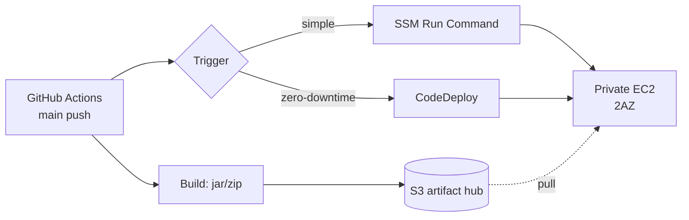
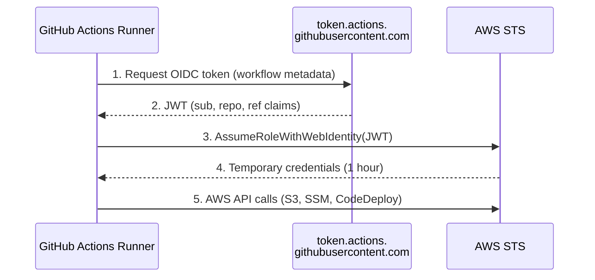
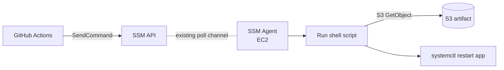
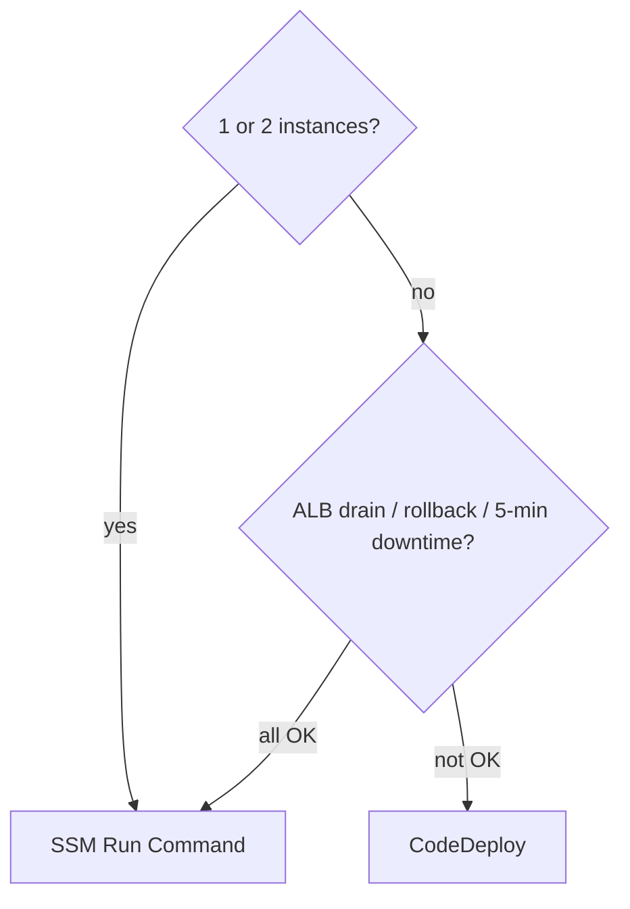

## Introduction

In [Part 3](/blog/en/aws-private-ec2-guide-3) we closed port 22 forever. Operators get a shell via SSM. But <strong>deployment is a different problem</strong>. How does GitHub Actions propagate code to the EC2 on every push?

The traditional answers were two. One: store an AWS Access Key as a GitHub Secret and `ssh`/`scp` a jar to the EC2. Two: stand up Jenkins inside the EC2 and have it do the same. Both <strong>park long-lived credentials somewhere</strong>, which is why key leaks have been the most common pipeline-security failure.

This post drops both. <strong>OIDC federation</strong> removes the key from GitHub, and <strong>S3 + SSM/CodeDeploy</strong> removes the open port — a deployment pipeline that needs neither.

- [Part 1 — Why Private Subnet?](/blog/en/aws-private-ec2-guide-1)
- [Part 2 — Building VPC infrastructure with Terraform](/blog/en/aws-private-ec2-guide-2)
- [Part 3 — Connecting without Bastion via SSM Session Manager](/blog/en/aws-private-ec2-guide-3)
- <strong>Part 4 — CI/CD pipeline with GitHub Actions + SSM/CodeDeploy (this post)</strong>
- Part 5 — Cost analysis and optimization strategies

This post targets <strong>juniors who have run GitHub Actions but get stuck on AWS credential handling</strong>. After reading you should know "why OIDC is the right answer" and "is SSM Run Command enough for me, or do I need CodeDeploy?"

---

## TL;DR

- <strong>OIDC federation is the de facto standard.</strong> GitHub Actions mints a fresh OIDC token per run, hands it to AWS, and AWS returns short-lived STS credentials — no AWS keys live in GitHub Secrets.
- <strong>S3 is the artifact hub.</strong> GitHub Actions uploads jars/zips to S3; EC2 pulls them with an IAM Role. SSH and scp never appear.
- <strong>SSM Run Command is the right answer for simple deploys.</strong> `aws ssm send-command` pushes a shell script to the instance — the agent picks it up over the existing poll channel, so inbound ports remain at zero.
- <strong>CodeDeploy is the right answer when you need zero-downtime, rollback, or hooks.</strong> Define stages (Stop → Install → Start → Validate) in `appspec.yml` and roll out In-Place or Blue/Green.
- <strong>One-line decision rule</strong>: a single jar on 1–2 boxes? SSM. ALB drain, health-checked rollback, no user-visible 503s? CodeDeploy.

---

## 1. The Deployment Model — Getting Code Into a Private EC2

### 1.1 The four-step skeleton

Every variant of this pipeline has the same backbone.



- <strong>Build</strong>: produce a jar/zip in GitHub Actions.
- <strong>Upload</strong>: push the artifact to S3 (key by SHA).
- <strong>Trigger</strong>: GitHub Actions calls SSM Run Command or CodeDeploy.
- <strong>Apply</strong>: EC2 fetches the artifact from S3 and swaps the running service.

### 1.2 Two branches

The split is in step three. <strong>SSM Run Command</strong> is the simplest path — it pushes a shell script to the instance and runs it. <strong>CodeDeploy</strong> adds operational features (rolling, rollback, hooks). §4–§5 cover them; §6 is the decision matrix.

---

## 2. OIDC Federation — Don't Put Long-Lived Keys in GitHub

### 2.1 What was wrong before

Calling AWS from GitHub Actions traditionally meant creating an IAM user, issuing Access Key/Secret Key, and storing both as GitHub Secrets. Problems with that:

- <strong>Keys are permanent.</strong> Without rotation they live forever — a leak means unbounded use.
- <strong>Scope tends to widen.</strong> One key feeding multiple workflows drifts toward AdminAccess.
- <strong>Audit is shallow.</strong> CloudTrail records the IAM user but not "which workflow run on which commit called this."

### 2.2 How OIDC reframes it

OIDC (OpenID Connect) <strong>mints a short-lived token per workflow run</strong>, hands it to AWS, and AWS returns STS credentials.



- The token is minted once per run and <strong>expires within minutes to an hour</strong>.
- Claims include `repo:my-org/my-repo:ref:refs/heads/main`, so the IAM trust policy can <strong>narrow access to a specific repo and branch</strong>.
- CloudTrail records the OIDC `sub` claim, so you know which workflow run made the call.

> <strong>Going deeper</strong>: A separate post unpacks STS internals, the federation skeleton, and how SAML / IAM Identity Center / EKS IRSA are variants of the same pattern — [Understanding AWS Credential Federation](/blog/en/aws-credential-federation-deep-dive). Pair it with this section if you want to step beyond the recipe and build the foundation.

### 2.3 Register the OIDC Provider in IAM

Register GitHub's OIDC issuer (`token.actions.githubusercontent.com`) in IAM once. With Terraform:

```hcl
resource "aws_iam_openid_connect_provider" "github" {
  url             = "https://token.actions.githubusercontent.com"
  client_id_list  = ["sts.amazonaws.com"]
  thumbprint_list = ["6938fd4d98bab03faadb97b34396831e3780aea1"]
}
```

`thumbprint_list` is GitHub's certificate fingerprint. AWS now validates it automatically; just keep the slot filled and follow the latest AWS docs for the canonical value.

### 2.4 The IAM Role GitHub Actions assumes

Create a role that accepts OIDC tokens. The trust policy's heart is the <strong>`sub` condition</strong> — it scopes which repo and branch may assume the role.

```hcl
resource "aws_iam_role" "github_actions_deploy" {
  name = "GitHubActionsDeploy"

  assume_role_policy = jsonencode({
    Version = "2012-10-17"
    Statement = [{
      Effect    = "Allow"
      Principal = { Federated = aws_iam_openid_connect_provider.github.arn }
      Action    = "sts:AssumeRoleWithWebIdentity"
      Condition = {
        StringEquals = {
          "token.actions.githubusercontent.com:aud" = "sts.amazonaws.com"
        }
        StringLike = {
          "token.actions.githubusercontent.com:sub" = "repo:my-org/my-repo:ref:refs/heads/main"
        }
      }
    }]
  })
}

resource "aws_iam_role_policy" "github_actions_deploy" {
  role = aws_iam_role.github_actions_deploy.id
  policy = jsonencode({
    Version = "2012-10-17"
    Statement = [
      {
        Effect   = "Allow"
        Action   = ["s3:PutObject", "s3:GetObject"]
        Resource = "${aws_s3_bucket.artifacts.arn}/*"
      },
      {
        Effect   = "Allow"
        Action   = ["ssm:SendCommand", "ssm:GetCommandInvocation", "ssm:DescribeInstanceInformation"]
        Resource = "*"
      },
      {
        Effect   = "Allow"
        Action   = ["codedeploy:CreateDeployment", "codedeploy:GetDeployment", "codedeploy:GetDeploymentConfig"]
        Resource = "*"
      }
    ]
  })
}
```

Without a `sub` condition, any GitHub repo trusting the same OIDC provider could steal this role — <strong>missing `sub` is the most common OIDC accident</strong>.

### 2.5 Assuming the Role from GitHub Actions

The workflow YAML hinges on two things — `id-token: write` permission and the `aws-actions/configure-aws-credentials` action.

```yaml
permissions:
  id-token: write   # required to mint OIDC tokens
  contents: read

jobs:
  deploy:
    runs-on: ubuntu-latest
    steps:
      - uses: actions/checkout@v4
      - uses: aws-actions/configure-aws-credentials@v4
        with:
          role-to-assume: arn:aws:iam::123456789012:role/GitHubActionsDeploy
          aws-region: ap-northeast-2
      - run: aws sts get-caller-identity
```

If `get-caller-identity` prints the temporary credential ARN, the OIDC flow is wired up correctly.

> <strong>Note</strong>: Migrating legacy workflows from "AWS keys in secrets" to OIDC is the 2026 standard. Both AWS security guidance and GitHub Actions docs recommend OIDC.

---

## 3. The Artifact Hub — S3

### 3.1 Why S3

You need a <strong>middle store</strong> between GitHub Actions and Private EC2. EC2 doesn't reach GitHub directly (auth and trust boundary), and the GitHub Actions runner doesn't reach the Private EC2 (no inbound). S3:

- <strong>Reaches both</strong> — IAM permissions only; both sides see the same bucket.
- <strong>Versions easily</strong> — keys like `app/${SHA}.jar` make every build immortal.
- <strong>Trivial rollback</strong> — re-trigger with the previous SHA.

### 3.2 Granting EC2 read access

Add S3 GetObject to the `private-ec2-ssm-role` from Part 3.

```hcl
resource "aws_s3_bucket" "artifacts" {
  bucket = "my-private-ec2-artifacts"
}

resource "aws_iam_role_policy" "ec2_artifacts_read" {
  role = aws_iam_role.ec2_ssm.id
  policy = jsonencode({
    Version = "2012-10-17"
    Statement = [{
      Effect   = "Allow"
      Action   = ["s3:GetObject"]
      Resource = "${aws_s3_bucket.artifacts.arn}/*"
    }]
  })
}
```

EC2 reaches S3 over NAT, so no extra networking is needed (for fully air-gapped setups, add an S3 Gateway VPC Endpoint).

> <strong>Note</strong>: S3 Gateway Endpoint costs $0/hour. If NAT data-processing fees bite, adding it is a win on both cost and security.

---

## 4. Path A — SSM Run Command

### 4.1 Why SSM Run Command

If Part 3's Session Manager was the interactive shell, <strong>Run Command is the non-interactive sibling</strong>. The same SSM Agent picks up commands over the same poll channel — meaning zero new infrastructure (Agent + IAM Role + network path are already there).



### 4.2 The GitHub Actions workflow

```yaml
name: Deploy via SSM
on:
  push:
    branches: [main]

permissions:
  id-token: write
  contents: read

jobs:
  deploy:
    runs-on: ubuntu-latest
    steps:
      - uses: actions/checkout@v4
      - uses: actions/setup-java@v4
        with:
          java-version: '21'
          distribution: 'temurin'
      - run: ./gradlew bootJar

      - uses: aws-actions/configure-aws-credentials@v4
        with:
          role-to-assume: arn:aws:iam::123456789012:role/GitHubActionsDeploy
          aws-region: ap-northeast-2

      - name: Upload artifact
        run: |
          aws s3 cp build/libs/app.jar \
            s3://my-private-ec2-artifacts/app/${{ github.sha }}.jar

      - name: Send deploy command
        id: deploy
        run: |
          CMD_ID=$(aws ssm send-command \
            --document-name AWS-RunShellScript \
            --targets "Key=tag:App,Values=myapp" "Key=tag:Env,Values=prod" \
            --parameters commands='[
              "set -e",
              "aws s3 cp s3://my-private-ec2-artifacts/app/${{ github.sha }}.jar /opt/app/app.jar.new",
              "mv /opt/app/app.jar.new /opt/app/app.jar",
              "systemctl restart app",
              "sleep 5",
              "curl -fsS http://localhost:8080/health"
            ]' \
            --comment "Deploy ${{ github.sha }}" \
            --query "Command.CommandId" --output text)
          echo "command_id=$CMD_ID" >> "$GITHUB_OUTPUT"

      - name: Wait for completion
        run: |
          for INSTANCE in $(aws ec2 describe-instances \
              --filters "Name=tag:App,Values=myapp" "Name=tag:Env,Values=prod" \
              --query "Reservations[].Instances[].InstanceId" --output text); do
            aws ssm wait command-executed \
              --command-id "${{ steps.deploy.outputs.command_id }}" \
              --instance-id "$INSTANCE"
          done
```

Key patterns:

- <strong>Targets are tags.</strong> Tag instances `App=myapp` and `Env=prod` and Auto Scaling additions are picked up automatically.
- <strong>`set -e`</strong> aborts on the first failure — no partial-apply state.
- <strong>The trailing `curl` is the health check.</strong> A non-200 marks SSM failure → red CI.

### 4.3 Instance-side prerequisites

`/opt/app` and the `app.service` systemd unit go in via user_data or a golden AMI.

```text
[Unit]
Description=My App
After=network.target

[Service]
ExecStart=/usr/bin/java -jar /opt/app/app.jar
Restart=on-failure
User=app

[Install]
WantedBy=multi-user.target
```

> <strong>Note</strong>: SSM Run Command's stdout/stderr returns only the first slice by default. Pass `--output-s3-bucket-name` to ship long output to S3 or CloudWatch Logs automatically.

---

## 5. Path B — CodeDeploy

### 5.1 Why learn CodeDeploy on top

SSM Run Command works well. You still learn CodeDeploy because:

- <strong>Zero-downtime deploys</strong> — In-Place rolling and Blue/Green out of the box. Traffic shifts in stages.
- <strong>Explicit hook stages</strong> — `ApplicationStop → BeforeInstall → AfterInstall → ApplicationStart → ValidateService` are standardized.
- <strong>Automatic rollback</strong> — `ValidateService` failure → previous version returns automatically.
- <strong>ALB integration</strong> — instances are pulled from the Target Group during deploy and re-added after. Users never see 503.

Once scale and SLA grow, Run Command is no longer enough. CodeDeploy is the tool for that level.

### 5.2 The four resources you need

| Resource | Role |
| --- | --- |
| <strong>CodeDeploy Agent</strong> | Daemon on the EC2. Installed via user_data or SSM Run Command |
| <strong>CodeDeploy Service Role</strong> | Permission for CodeDeploy to manipulate EC2/ALB/ASG |
| <strong>CodeDeploy Application</strong> | The deployment unit (app name) — a container |
| <strong>Deployment Group</strong> | Which instances (by tag) and which strategy (In-Place/Blue-Green) |

### 5.3 Add agent install to user_data

Append to the Part 3 EC2 user_data:

```bash
#!/bin/bash
dnf install -y ruby wget nginx
cd /tmp
wget https://aws-codedeploy-ap-northeast-2.s3.amazonaws.com/latest/install
chmod +x ./install
./install auto
systemctl enable --now codedeploy-agent
```

For already-running instances, run the same script via SSM Run Command — the Part 4 tool bootstraps itself.

### 5.4 Terraform — Application and Deployment Group

```hcl
resource "aws_iam_role" "codedeploy" {
  name = "CodeDeployServiceRole"
  assume_role_policy = jsonencode({
    Version = "2012-10-17"
    Statement = [{
      Effect    = "Allow"
      Principal = { Service = "codedeploy.amazonaws.com" }
      Action    = "sts:AssumeRole"
    }]
  })
}

resource "aws_iam_role_policy_attachment" "codedeploy" {
  role       = aws_iam_role.codedeploy.name
  policy_arn = "arn:aws:iam::aws:policy/service-role/AWSCodeDeployRole"
}

resource "aws_codedeploy_app" "app" {
  name             = "myapp"
  compute_platform = "Server"
}

resource "aws_codedeploy_deployment_group" "prod" {
  app_name              = aws_codedeploy_app.app.name
  deployment_group_name = "myapp-prod"
  service_role_arn      = aws_iam_role.codedeploy.arn

  ec2_tag_set {
    ec2_tag_filter {
      key   = "App"
      type  = "KEY_AND_VALUE"
      value = "myapp"
    }
    ec2_tag_filter {
      key   = "Env"
      type  = "KEY_AND_VALUE"
      value = "prod"
    }
  }

  load_balancer_info {
    target_group_info {
      name = aws_lb_target_group.app.name
    }
  }

  deployment_style {
    deployment_option = "WITH_TRAFFIC_CONTROL"
    deployment_type   = "IN_PLACE"
  }

  auto_rollback_configuration {
    enabled = true
    events  = ["DEPLOYMENT_FAILURE"]
  }
}
```

`WITH_TRAFFIC_CONTROL` is the magic — instances under deploy are auto-removed from the Target Group, then re-added after the new jar passes health checks.

### 5.5 appspec.yml and hook scripts

At the repo root, `appspec.yml`:

```yaml
version: 0.0
os: linux
files:
  - source: app.jar
    destination: /opt/app
hooks:
  ApplicationStop:
    - location: scripts/stop.sh
      timeout: 30
  BeforeInstall:
    - location: scripts/before_install.sh
      timeout: 30
  ApplicationStart:
    - location: scripts/start.sh
      timeout: 60
  ValidateService:
    - location: scripts/validate.sh
      timeout: 60
```

`scripts/start.sh`:

```bash
#!/bin/bash
systemctl restart app
```

`scripts/validate.sh`:

```bash
#!/bin/bash
for i in $(seq 1 10); do
  if curl -fsS http://localhost:8080/health; then
    exit 0
  fi
  sleep 3
done
exit 1
```

If `validate.sh` fails, `auto_rollback_configuration` reinstates the previous version automatically.

### 5.6 The GitHub Actions workflow

```yaml
      - name: Package for CodeDeploy
        run: |
          mkdir -p deploy/scripts
          cp build/libs/app.jar deploy/
          cp appspec.yml deploy/
          cp scripts/*.sh deploy/scripts/
          chmod +x deploy/scripts/*.sh
          cd deploy && zip -r ../app.zip .

      - name: Upload bundle
        run: |
          aws s3 cp app.zip \
            s3://my-private-ec2-artifacts/app/${{ github.sha }}.zip

      - name: Trigger CodeDeploy
        id: deploy
        run: |
          DEPLOY_ID=$(aws deploy create-deployment \
            --application-name myapp \
            --deployment-group-name myapp-prod \
            --s3-location bucket=my-private-ec2-artifacts,key=app/${{ github.sha }}.zip,bundleType=zip \
            --description "Deploy ${{ github.sha }}" \
            --query "deploymentId" --output text)
          echo "deployment_id=$DEPLOY_ID" >> "$GITHUB_OUTPUT"

      - name: Wait for completion
        run: |
          aws deploy wait deployment-successful \
            --deployment-id "${{ steps.deploy.outputs.deployment_id }}"
```

If `wait deployment-successful` exits non-zero (rollback included) the workflow goes red. Operators inspect the CodeDeploy console to see exactly which stage failed and why.

### 5.7 Aside: when do you need Blue/Green?

In-Place deploys on the same instances (brief 503 possible). Blue/Green spins up a new fleet and shifts traffic — zero user-visible downtime, but cost is temporarily doubled. <strong>Most backends are fine with In-Place + ALB integration</strong>; reserve Blue/Green for payment, real-time, or genuine zero-downtime requirements.

---

## 6. How to Choose — SSM vs CodeDeploy

| Criterion | SSM Run Command | CodeDeploy |
| --- | --- | --- |
| Learning curve | One page of shell | appspec + 5 hooks + 4 resources |
| Extra infra | None (Part 3 covers it) | Agent + Service Role + App + Deployment Group |
| Stage definition | Inline shell | Standard hooks in `appspec.yml` |
| Zero-downtime | DIY | In-Place + ALB drain, automatic |
| Rollback | DIY | One line via `auto_rollback` |
| Observability | stdout in SSM console | Stage-by-stage in CodeDeploy console |
| ALB health-check integration | Manual | Automatic |

### 6.1 A short decision guide



- <strong>Learning, side-projects, internal tools</strong> → SSM. A well-written shell script is enough.
- <strong>Real user traffic + ALB</strong> → CodeDeploy. drain, rollback, hooks pay for the complexity.
- <strong>SLA 99.9%+, zero-downtime requirement</strong> → CodeDeploy + Blue/Green.

This series ends at Part 5, and Part 4 covers both because <strong>juniors should be able to move between the two on demand</strong>. Stand it up with SSM first; once traffic appears, swing the same S3 artifacts onto CodeDeploy.

---

## 7. Observability and Deployment Guards

### 7.1 Where to look when it fails

| Stage | First check | Then |
| --- | --- | --- |
| Red CI in GitHub Actions | Step log in the Actions tab | If OIDC step, verify the IAM trust `sub` |
| `aws s3 cp` failure | `GitHubActionsDeploy` role's S3 permissions | Bucket policy, KMS |
| `send-command` failure | Run Command console → command ID | Confirm instance is SSM Online (Part 3 §5.1) |
| CodeDeploy stage failure | Console → Deployments → failing stage | EC2's `/var/log/aws/codedeploy-agent/codedeploy-agent.log` |
| Health-check failure | `validate.sh` or `curl` output | The app's own logs |

The point is that each stage has a different first-look location. Jumping straight to the workflow YAML when CI is red sends you down the wrong path more often than not.

### 7.2 Four guards that prevent accidents

- <strong>Branch protection</strong> — no direct push to `main`; PR + review + green CI required.
- <strong>Environment + Required Reviewer</strong> — the `prod` Environment requires manual approval. The workflow pauses just before the prod step.
- <strong>OIDC `sub` condition</strong> — only `refs/heads/main` may assume the role, so PR builds can't hijack prod.
- <strong>Deployment notifications</strong> — push start/success/failure to Slack/Teams. Failures must be noticed by humans.

### 7.3 Aside: phased deploys (staging → prod)

Deploy to `Env=staging` first; advance to `Env=prod` only after the staging health check passes. Express it with `needs:` and `environments:` in GitHub Actions, or with two Deployment Groups in CodeDeploy.

---

## Recap

What to take away:

1. <strong>OIDC is the right answer.</strong> Remove AWS Access Keys from GitHub Secrets forever and run on per-workflow temporary credentials — including narrowing repo and branch with `sub`.
2. <strong>S3 is the artifact hub.</strong> Both GitHub Actions and EC2 use the same bucket via IAM. SSH and scp do not appear.
3. <strong>SSM Run Command is right for simple deploys.</strong> It reuses Part 3's SSM Agent, so extra infra is zero. Shell-script the stop → fetch → start → health-check.
4. <strong>CodeDeploy is right for zero-downtime, rollback, and hooks.</strong> `appspec.yml` standardizes five stages and integrates with ALB Target Groups so users never see 503.
5. <strong>The choice follows scale and SLA.</strong> 1–2 boxes / internal tools → SSM. Traffic + health checks + rollback → CodeDeploy. Zero-downtime requirement → Blue/Green.
6. <strong>Guards = OIDC `sub` + Environment approvals + branch protection + alerts.</strong> Get all four locks in place before automation gathers speed.

The single goal of Part 4 was this — <strong>a pipeline where neither port 22 nor a static AWS key is anywhere on the path, yet a GitHub push lands in production EC2</strong>. Combined with Parts 1–3, the infrastructure plus auto-deploy is now complete.

In Part 5 we break down the <strong>cost structure</strong> of everything Parts 1–4 produced. What does NAT Gateway / ALB / EC2 / CodeDeploy each cost per month? Where can you cut? And how do side-project and production budgets actually compare?

---

## Appendix

### A. Quick pipeline diagnostics

```bash
# OIDC flow check (run inside the workflow)
aws sts get-caller-identity
# If the ARN is a temporary credential, OIDC is good

# SSM instance registration
aws ssm describe-instance-information \
  --filters "Key=tag:App,Values=myapp" \
  --query "InstanceInformationList[].[InstanceId,PingStatus]" \
  --output table

# Last CodeDeploy deployment
aws deploy list-deployments \
  --application-name myapp \
  --deployment-group-name myapp-prod \
  --query "deployments[0]"

# Last Run Command output
aws ssm list-command-invocations \
  --details \
  --query "CommandInvocations[0].CommandPlugins[].Output"
```

### B. Tightening the GitHubActionsDeploy IAM policy

§2.4 keeps the policy broad for clarity. In production tighten at least these two:

- `s3:PutObject` → `Resource = "arn:aws:s3:::my-private-ec2-artifacts/app/*"` to limit by prefix.
- `ssm:SendCommand` → instance ARNs in `Resource` plus `Condition: ssm:resourceTag/Env: prod` so only prod is targetable.

### C. With Auto Scaling

When ASG scales in and out, <strong>new instances must pull the latest version on boot</strong>.

- SSM Run Command path: bake "fetch latest jar from S3" into the ASG user_data.
- CodeDeploy path: register the ASG with the Deployment Group; new instances automatically pull the artifact from the most recent successful deployment.

The ASG integration is one more reason CodeDeploy wins as scale grows.
