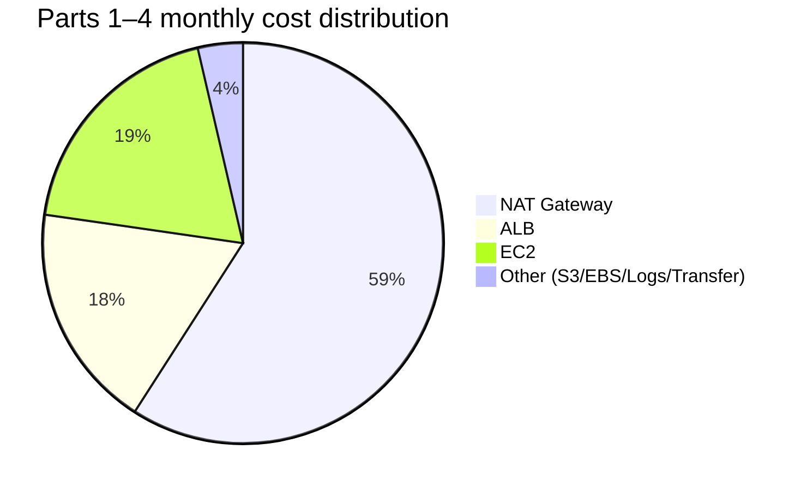
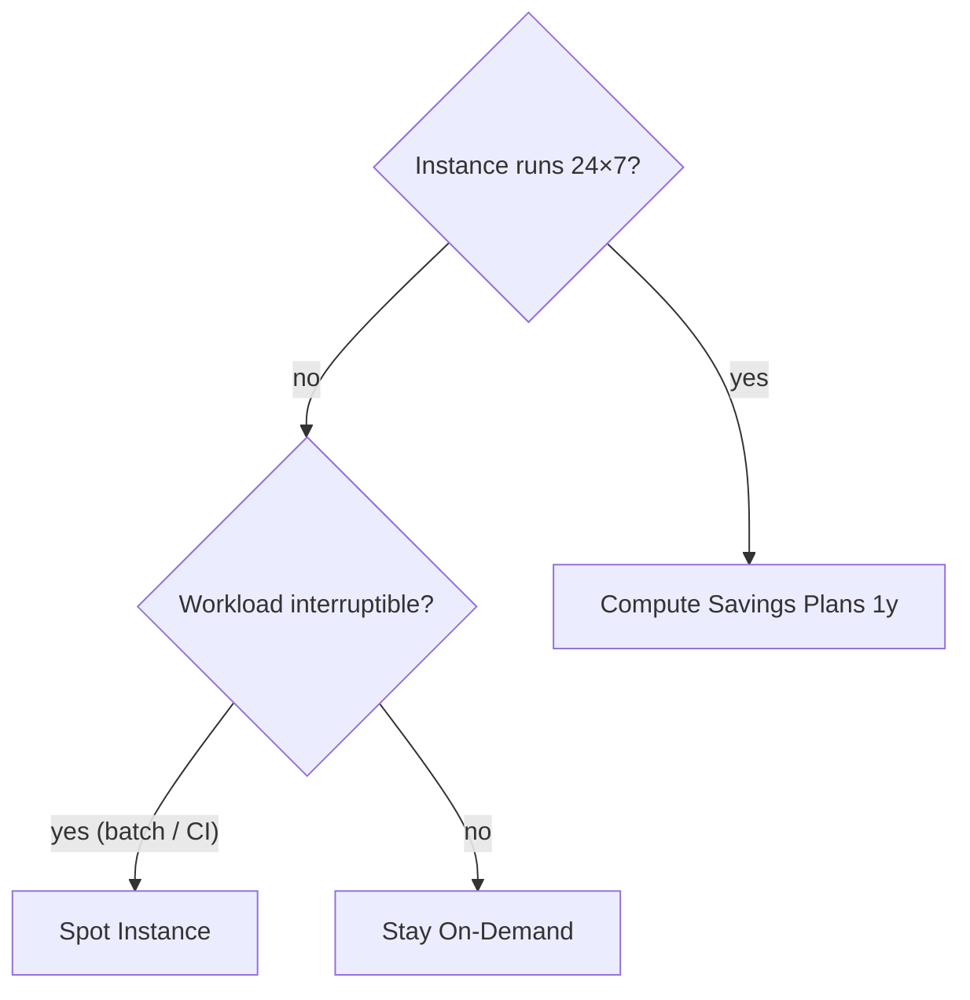

## Introduction

By the end of [Part 1](/blog/en/aws-private-ec2-guide-1) through [Part 4](/blog/en/aws-private-ec2-guide-4) you have a full set of infrastructure. A month later the bill arrives, and the first reaction is almost always the same — <strong>"why is NAT Gateway so high?"</strong>

This final post tears that bill apart. What costs what, where it leaks, and the levers that cut a month's spend roughly in half without giving up security or availability.

- [Part 1 — Why Private Subnet?](/blog/en/aws-private-ec2-guide-1)
- [Part 2 — Building VPC infrastructure with Terraform](/blog/en/aws-private-ec2-guide-2)
- [Part 3 — Connecting without Bastion via SSM Session Manager](/blog/en/aws-private-ec2-guide-3)
- [Part 4 — CI/CD pipeline with GitHub Actions + SSM/CodeDeploy](/blog/en/aws-private-ec2-guide-4)
- <strong>Part 5 — Cost analysis and optimization strategies (this post)</strong>

This post targets <strong>juniors who got their first surprising AWS bill</strong>. After reading you should know where each dollar went, which one-line change sweeps $5–$30 off this month immediately, and which scenario your environment fits into.

---

## TL;DR

- <strong>NAT Gateway is half the bill.</strong> The Parts 1–4 baseline is ~$110/month and ~$65 of that is NAT — the first place to look.
- <strong>The fastest free win: an S3 Gateway Endpoint.</strong> Keep EC2's S3 traffic off NAT — $0/hour, $5–$30/month off instantly.
- <strong>For EC2, go Right-size → Graviton → Savings Plans, in that order.</strong> 30–50% off with little to no code change. The 1-year No-Upfront Compute Savings Plan is the sweet spot.
- <strong>ALB is about consolidation.</strong> Five services × five ALBs is $80/month leaking. Combine into one with Listener Rules → ~$25.
- <strong>Memorize budgets by scenario</strong>: side-project ~$40, startup ~$110, enterprise $300+. Knowing which tier you're in makes every next decision easier.

---

## 1. Decomposing the Monthly Bill of the Parts 1–4 Environment

### 1.1 The breakdown table

Baseline scenario: Part 2's layout (Multi-AZ HA, two NATs, ALB, two EC2s) + Part 4's pipeline + light user traffic (10 GB/month egress). Seoul region, 2026 prices.

| Item | Unit | Monthly | Share |
| --- | --- | --- | --- |
| 2× NAT Gateway (per AZ) | $32.40 × 2 | $64.80 | 58% |
| ALB (hours + LCU) | $20 (low traffic) | $20.00 | 18% |
| 2× EC2 t3.micro (on-demand) | $10.50 × 2 | $21.00 | 19% |
| 2× EBS gp3 8GB | $0.80 × 2 | $1.60 | 1% |
| S3 (1GB artifacts + requests) | - | $0.50 | 0.5% |
| Data Transfer Out (10GB) | $0.114/GB | $1.14 | 1% |
| CloudWatch Logs (1GB) | $0.80 | $0.80 | 1% |
| <strong>Total</strong> | | <strong>~$110</strong> | 100% |

### 1.2 Free items vs billed items

A first read of the bill produces two simultaneous reactions: "why so much?" and "why is this $0?" The pattern is simple.

| Free (no per-hour charge) | Billed (per-hour or per-GB) |
| --- | --- |
| VPC, Subnet, Route Table, IGW | NAT Gateway, ALB, EC2 |
| Security Group, NACL | EBS Volume, EBS Snapshot |
| IAM Role, OIDC Provider | Interface VPC Endpoint, EIP / public IPv4 |
| S3 Gateway Endpoint | S3 Storage, S3 Request |
| SSM Session Manager (managed EC2) | CloudWatch Logs Ingest/Storage |
| CodeDeploy (EC2/Lambda) | Data Transfer (Out, Cross-AZ, NAT processing) |

The trick is identifying <strong>resources that bill per hour even when idle</strong>. NAT Gateway, ALB, EC2 instances, EBS, EIP — these five make 90% of the bill.

### 1.3 Where the money leaks

That table as a distribution:



<strong>NAT alone is half the spend</strong> — true for almost every variation of this series environment. Hence §2 is the single biggest line.

---

## 2. NAT Gateway — The Biggest Lever

### 2.1 NAT bills two ways

- <strong>Hourly</strong>: $0.045/hour × 720h ≈ $32.40/month — billed even at zero traffic.
- <strong>Data processing</strong>: $0.045/GB — every GB that flows through.
- On top of that, anything that exits to the internet pays <strong>Data Transfer Out separately</strong>.

In other words, <strong>1 GB through NAT costs ~$0.045 (NAT processing) + ~$0.114 (egress) ≈ $0.16/GB</strong>. The same 1 GB pulled from S3 in the same region is $0 (via S3 Gateway Endpoint).

### 2.2 Single NAT vs Multi-AZ NAT

| Environment | NAT layout | Monthly (hourly only) |
| --- | --- | --- |
| Learning / dev / staging | Single AZ | $32.40 |
| Standard production (HA recommended) | One per AZ (2 total) | $64.80 |
| High-traffic production | One per AZ + heavy data processing | $100+ |

Multi-AZ NAT preserves the AZ-failure isolation we discussed in Part 2 §3.3. If cost is painful, the standard split is single NAT for dev/stage, Multi-AZ only for prod.

### 2.3 S3 Gateway Endpoint — the fastest free cut

Keeping EC2-to-S3 traffic off NAT is the single biggest one-liner you can apply.

```hcl
resource "aws_vpc_endpoint" "s3" {
  vpc_id            = aws_vpc.main.id
  service_name      = "com.amazonaws.ap-northeast-2.s3"
  vpc_endpoint_type = "Gateway"
  route_table_ids   = [
    aws_route_table.private_a.id,
    aws_route_table.private_c.id,
  ]
}
```

- <strong>Gateway Endpoints cost $0/hour</strong> — no extra charge.
- The Private Route Tables get an S3 prefix-list route added automatically.
- Part 4's artifact downloads, CloudWatch Logs S3 export, and every other S3 hit bypass NAT.

If artifact traffic is 100 GB/month, that's $4.50 NAT processing + $11.40 egress = ~$16/month off. Even tiny environments save $5+/month from a five-minute change.

### 2.4 SSM Interface Endpoint — when is it worth it?

Same comparison as Part 3 §4.2:

- If NAT already exists and you also need general internet egress: <strong>reuse NAT</strong> — cheaper.
- If you want NAT off entirely and only SSM/S3/core AWS reachable: <strong>3 Interface Endpoints + S3 Gateway Endpoint</strong> can replace NAT. 3 × 2 AZ × $0.011/h × 720h ≈ ~$48/month vs Multi-AZ NAT $64/month — slightly cheaper, plus the security upside that Private EC2 has no internet path at all.

### 2.5 Aside: NAT Instance?

A "NAT Instance" pattern (run NAT yourself on a t4g.nano with iptables) costs ~$5/month — dramatically cheaper. Drawbacks:

- You build HA and automatic failover yourself.
- Throughput caps to the instance size.
- You own the security patches and operations.

<strong>Recommended only for learning and personal projects.</strong> For real workloads, NAT Gateway wins — operator hours are also money.

---

## 3. EC2 — Right-size, Graviton, Savings Plans

### 3.1 Right-size first

The fastest one-line cut to EC2 cost is <strong>dropping a size</strong>. From CloudWatch:

- Average CPU < 20% → candidate to size down.
- Memory > 70% → cut CPU but switch to a memory-rich family (e.g. `r`).

`aws ce get-rightsizing-recommendation` produces automatic suggestions — usually one or two 30–40% candidates show up.

### 3.2 Graviton (t4g/m7g) — ~20% off with little effort

ARM Graviton instances are <strong>~20% cheaper</strong> than the equivalent x86, and JVM, Node, Python, Go all run as-is. Switching Part 2's t3.micro → t4g.micro:

- $10.50/month → $8.40/month (≈ $4/month off across two instances)
- Just point at the ARM AL2023 AMI.

> <strong>Note</strong>: Native dependencies (some Python libs, old .NET) need a rebuild. The exception is x86-only commercial software with binding licenses.

### 3.3 Savings Plans / Reserved Instances / Spot

For always-on EC2, the next step is committed-use discount.

| Option | Term | Discount | Flexibility |
| --- | --- | --- | --- |
| <strong>Spot Instance</strong> | None | Up to 90% | Reclaimed on 2-min notice — non-interactive / batch only |
| <strong>Reserved Instance</strong> | 1 / 3 yr | Up to 72% | Fixed family |
| <strong>Compute Savings Plans</strong> | 1 / 3 yr | Up to 66% | Free across family/region/OS |
| <strong>EC2 Instance Savings Plans</strong> | 1 / 3 yr | Up to 72% | Fixed family/region, free across size |

For most workloads, a <strong>1-year No-Upfront Compute Savings Plan</strong> is the sweet spot — low commit risk, and it survives migrations to Graviton or different families.

### 3.4 Quick decision



---

## 4. Data Transfer — Invisible but Often a Top Line

### 4.1 Which traffic actually costs

| Path | Rate | Note |
| --- | --- | --- |
| EC2 → internet (out) | $0.114/GB | First 100 GB/month free |
| EC2 → EC2 same AZ (private IP) | Free | |
| EC2 → EC2 different AZ | $0.01/GB × 2 | $0.02/GB combined |
| ALB → EC2 (cross-AZ) | $0.01/GB | ALB to backend across AZ |
| EC2 → S3 same region (Gateway Endpoint) | Free | <strong>The key</strong> |
| EC2 → S3 same region (via NAT) | $0.045/GB (NAT processing) | When no Endpoint |
| EC2 → another region | $0.02/GB | Most cross-region |

### 4.2 ALB cost — hours + LCU

ALB bills two ways:

- <strong>Hourly</strong>: $0.0225/hour × 720h ≈ $16.20/month — billed at zero traffic.
- <strong>LCU (Load Balancer Capacity Unit)</strong>: $0.008/LCU-hour — the max of four dimensions (new connections, active connections, processed bytes, rule evaluations).

Light traffic: ~$20/month. As traffic grows, LCU is the only thing that scales. Instead of running 5 ALBs for 5 small services, the usual answer is <strong>1 ALB + Listener Rules for host- and path-based routing</strong> — $80/month → $25/month.

### 4.3 ALB consolidation — group with Listener Rules

```hcl
resource "aws_lb_listener_rule" "service_a" {
  listener_arn = aws_lb_listener.https.arn
  priority     = 10
  action {
    type             = "forward"
    target_group_arn = aws_lb_target_group.service_a.arn
  }
  condition {
    host_header {
      values = ["a.example.com"]
    }
  }
}
```

Five services → one ALB + five Listener Rules. One of the highest-impact single changes you can make. Caveat: stuffing too many rules into one ALB makes the rule-evaluation LCU dimension expensive — re-split once you pass ~50 rules.

---

## 5. Cost Visibility — Tags, Budgets, Anomaly Detection

### 5.1 Tag policy first

To see cost you need cost to carry labels. Tag every resource with at least these four:

| Tag key | Example | Use |
| --- | --- | --- |
| `Env` | `dev`, `staging`, `prod` | Cost per environment |
| `App` | `myapp`, `internal-tool` | Cost per service |
| `Owner` | `team-platform` | Who's responsible |
| `CostCenter` | `R&D`, `Marketing` | Accounting category |

You can enforce via Tag Policies, and you must activate the tag in Cost Explorer (Settings → Cost Allocation Tags → Activate) before it shows up as a cost dimension.

### 5.2 AWS Budgets — proactive alerts

The simplest way to be warned before the budget breaks.

```hcl
resource "aws_budgets_budget" "monthly" {
  name         = "monthly-cap"
  budget_type  = "COST"
  limit_amount = "150"
  limit_unit   = "USD"
  time_unit    = "MONTHLY"

  notification {
    comparison_operator        = "GREATER_THAN"
    threshold                  = 80
    threshold_type             = "PERCENTAGE"
    notification_type          = "FORECASTED"
    subscriber_email_addresses = ["ops@example.com"]
  }
}
```

`FORECASTED` fires when "current trajectory exceeds the cap by month-end" — no more bill-day surprises.

### 5.3 Cost Anomaly Detection — automatic outlier alerts

AWS uses ML to learn your normal pattern and alerts when costs <strong>spike unexpectedly</strong> (five accidental NATs, an unstopped t3.xlarge). Once enabled, monitoring runs itself.

In the console: Cost Management → Cost Anomaly Detection → create a Monitor. If you've ever had a runaway-cost incident, this is non-negotiable.

---

## 6. Budgets by Scenario

### 6.1 Side project — ~$40/month

No HA, no Multi-AZ. One NAT, one EC2.

| Item | Monthly |
| --- | --- |
| 1× NAT Gateway | $32.40 |
| 1× t4g.nano (Graviton) | $4.20 |
| 8 GB EBS | $0.80 |
| Public IP / EIP | $3.60 |
| <strong>Total</strong> | <strong>~$41</strong> |

Drop the ALB; point a domain at the EC2 directly. Skip Multi-AZ. To go lower, move to Public Subnet and remove NAT entirely — down to ~$15/month (the "side project on Public Subnet + SG is enough" path from Part 1).

### 6.2 Startup / MVP — ~$110/month

The Parts 1–4 baseline, unchanged. Multi-AZ HA + ALB + 2 EC2s + pipeline.

| Item | Monthly |
| --- | --- |
| 2× NAT Gateway | $64.80 |
| ALB | $20.00 |
| 2× t4g.micro (Graviton) | $16.80 |
| EBS, S3, Logs, Transfer | ~$5 |
| <strong>Total</strong> | <strong>~$107</strong> |

Apply a 1-year Compute Savings Plan and the EC2 line drops ~30%; add an S3 Gateway Endpoint and NAT data processing falls — all the way to ~$95/month.

### 6.3 Enterprise / compliance — $300+/month

Add Interface VPC Endpoints, larger EC2, RDS Multi-AZ, KMS, WAF, 1-year CloudWatch Logs retention.

| Item | Monthly |
| --- | --- |
| 2× NAT Gateway | $64.80 |
| 3× Interface VPC Endpoint × 2 AZ | $48 |
| ALB + WAF | $35 |
| 2× t4g.medium + Savings Plans | $50 |
| RDS Multi-AZ (db.t4g.medium) | $80+ |
| CloudWatch Logs (10 GB/month) | $10 |
| KMS, Secrets Manager | $5 |
| <strong>Total</strong> | <strong>$300+</strong> |

At this tier the conversation shifts from line-by-line trimming to <strong>cost visibility and governance</strong>. The tags / Budgets / Anomaly trio in §5 becomes mandatory infrastructure.

---

## 7. Common Traps — Checklist

When the bill jumps unexpectedly, run through this list in order:

- ☐ <strong>Unattached EIP / unused public IPv4</strong> — $0.005/hour ≈ $3.60/month each. Pile up fast.
- ☐ <strong>EBS on stopped EC2</strong> — stopped instances still pay for their volumes.
- ☐ <strong>Old EBS snapshots</strong> — automated backups accumulate at GB × $0.05/month.
- ☐ <strong>S3 traffic going via NAT</strong> — without a Gateway Endpoint you pay both NAT processing and egress.
- ☐ <strong>CloudWatch Logs with no retention</strong> — default is "Never expire". Set 30 or 90 days.
- ☐ <strong>S3 Versioning without Lifecycle</strong> — versions stack up explosively. With SHA-keyed artifacts, lifecycle to Glacier IR or Delete after 90 days.
- ☐ <strong>Cross-AZ chatty traffic</strong> — two components of the same service across AZs, talking heavily, racks up inter-AZ costs.
- ☐ <strong>Forgotten dev/stage</strong> — dev kept 24×7 spends about a third of prod. Use Instance Scheduler to stop nights/weekends.
- ☐ <strong>Five+ ALBs</strong> — check whether host/path routing can collapse them (§4.3).
- ☐ <strong>Cross-region traffic</strong> — confirm you haven't accidentally been hitting S3 or DynamoDB in another region.

---

## Recap

What to take away:

1. <strong>NAT Gateway is half the bill.</strong> Top candidate, top weapon — S3 Gateway Endpoint (free) earns you $5+/month with five minutes of work.
2. <strong>Multi-AZ HA is a value-vs-cost trade-off.</strong> Single NAT for dev/stage, Multi-AZ for prod — the standard split.
3. <strong>EC2 cost order: Right-size → Graviton → Savings Plans.</strong> 30–50% off with little to no code change is normal.
4. <strong>ALB is about consolidation.</strong> Per-service ALBs leak tens of dollars a month; Listener Rules collapse them to a quarter of the cost.
5. <strong>Visibility precedes savings.</strong> Without tags / Budgets / Anomaly, you don't even know where to cut.
6. <strong>Memorize budgets by scenario.</strong> Side ~$40, Startup ~$110, Enterprise $300+ — knowing your tier makes the next decision easier.

The single goal of Part 5 was this — <strong>read the bill from the Parts 1–4 environment and make confident savings decisions</strong>. From here, a single NAT, one EC2 size, one ALB swap each move $30–$50/month at will.

That closes the series. From Part 1's "why Private Subnet?" to Part 5's "decompose the bill," the start and end of operating Private EC2 are both in your hands. When you stand up a new service, when a friend forwards their AWS bill, when you sketch a VPC at an interview — if you can pull a one-line conclusion from each part on demand, the series has done its job.

---

## Appendix

### A. Five commands to read your bill quickly

```bash
# 1. Cost so far this month
aws ce get-cost-and-usage \
  --time-period Start=$(date -u +%Y-%m-01),End=$(date -u +%Y-%m-%d) \
  --granularity MONTHLY \
  --metrics UnblendedCost \
  --query "ResultsByTime[0].Total.UnblendedCost"

# 2. Cost by service
aws ce get-cost-and-usage \
  --time-period Start=$(date -u +%Y-%m-01),End=$(date -u +%Y-%m-%d) \
  --granularity MONTHLY \
  --metrics UnblendedCost \
  --group-by Type=DIMENSION,Key=SERVICE

# 3. Find unattached EIPs
aws ec2 describe-addresses \
  --query "Addresses[?AssociationId==null].[PublicIp,AllocationId]" \
  --output table

# 4. CloudWatch log groups with no retention
aws logs describe-log-groups \
  --query "logGroups[?retentionInDays==null].logGroupName" \
  --output table

# 5. Right-sizing recommendations
aws ce get-rightsizing-recommendation \
  --service AmazonEC2 \
  --query "RightsizingRecommendations[].[CurrentInstance.ResourceId,RightsizingType]"
```

### B. Free Tier quick reference — first 12 months

| Service | Free quota |
| --- | --- |
| EC2 | t2.micro / t3.micro 750h/month |
| EBS | 30 GB gp2/gp3 |
| S3 | 5 GB Standard |
| Data Transfer Out | 100 GB/month (across all services) |
| CloudWatch | 10 metrics + 5 GB logs |
| ELB / ALB | 750h |

If you stand up Part 1's environment for learning, almost everything except NAT Gateway lands inside the Free Tier. NAT alone is ~$32/month and the single biggest line.

### C. The next single command

The first thing to do after closing this post is to find <strong>where last month's spend actually went</strong>.

```bash
aws ce get-cost-and-usage \
  --time-period Start=$(date -u -v-1m +%Y-%m-01),End=$(date -u +%Y-%m-01) \
  --granularity MONTHLY \
  --metrics UnblendedCost \
  --group-by Type=DIMENSION,Key=SERVICE
```

The top three services tell you where to start. Apply §2–§4 in order from there — the entire series, in a sense, has been preamble to that one line.
