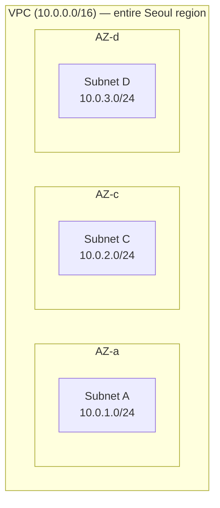
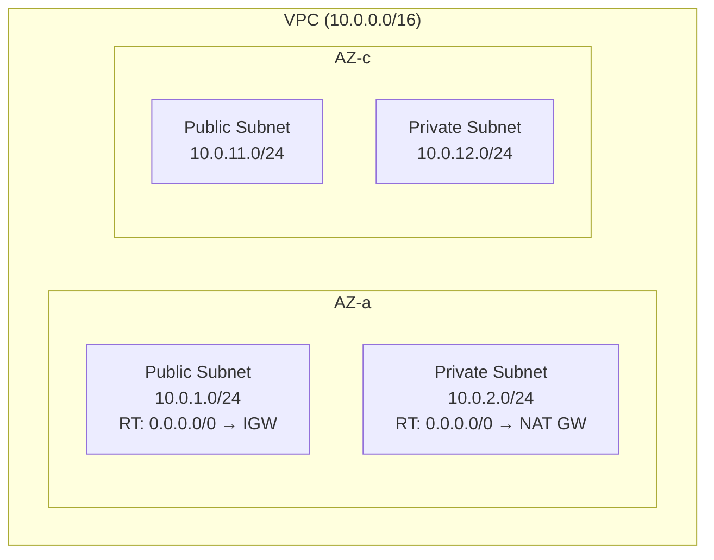
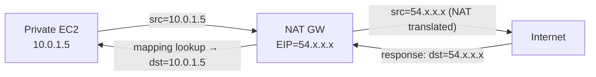
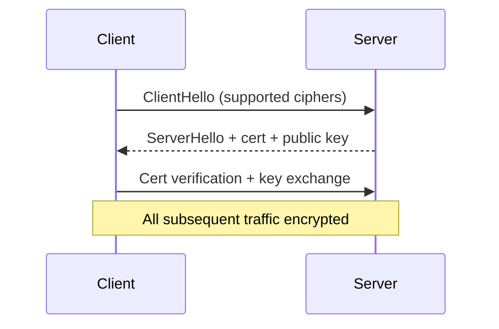
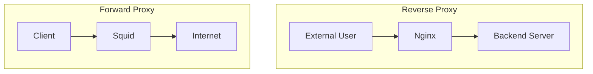

## Introduction

Open any AWS networking post and more than half of it is acronyms and jargon — ALB, NLB, API Gateway, VPC Endpoint, CIDR, ENI, NAT GW, NACL — thrown at you with no place that defines them. <strong>"How do I follow the decision tree if I don't know what these things are?"</strong> is the natural reaction.

This post starts there. Before diving into the decision trees of Parts 1, 2, and 3, here's <strong>a single primer that gathers the network fundamentals plus the core AWS services on one page</strong>. After this, almost no term in the rest of the series should stop you cold.

- <strong>Part 0 — Primer: network and AWS fundamentals (this post)</strong>
- Part 1 — Picking the entry point: ALB / NLB / API Gateway / CloudFront / Global Accelerator
- Part 2 — VPC-to-VPC and on-prem connectivity: VPC Endpoint / PrivateLink / Peering / Transit Gateway / VPN / Direct Connect
- Part 3 — Inside the VPC: IGW / NAT GW / Route Tables / Security Group vs NACL
- Part 4 — DNS decisions and Route 53: Hosted Zone / Routing Policy / Alias vs CNAME / Health Check
- Part 5 — Four standard patterns: from decision tree to first sketch

The target reader is a backend or infrastructure engineer who's clicked through the AWS console but isn't quite sure about OSI L4/L7, how to read a CIDR notation, or what an ENI is. The goal is to make Parts 1, 2, and 3 readable without stalling on a single term.

---

## TL;DR

- <strong>The OSI 7-layer model — specifically L4 (transport — TCP/UDP) vs L7 (application — HTTP) — is the first split in the series</strong>. NLB is L4; ALB, API Gateway, CloudFront are all L7.
- <strong>VPC = a virtual network you build inside AWS</strong>. CIDR notation expresses IP ranges, Subnets are sliced per AZ, and <strong>the difference between Public and Private subnets is just whether the Route Table has a `0.0.0.0/0 → IGW` entry</strong>.
- <strong>An ENI (Elastic Network Interface) is a virtual NIC attached inside a VPC with a private IP</strong>. EC2, RDS, Lambda, ALB — anything in a VPC has at least one. Private IPs, Security Groups, and EIPs all bind to the ENI.
- <strong>A reverse proxy is the intermediary that takes incoming client requests and dispatches them to the right backend</strong>. ALB, API Gateway, and CloudFront are all "AWS-managed reverse proxies + extras."
- <strong>Core AWS services fall into roughly compute (EC2/ECS/EKS/Lambda), storage/DB (S3/EBS/RDS/DynamoDB), messaging (SQS/SNS), load balancers (ALB/NLB), CDN (CloudFront), and auth (IAM/Cognito/KMS)</strong>.

---

## 1. OSI 7-layer model — L4 vs L7 is the first split

The most common abstraction for network communication is the <strong>OSI (Open Systems Interconnection) 7-layer model</strong>, an ISO standard from the 1980s that splits communication into seven layers, each handling its own concern.

| Layer | Name | Core responsibility | Representative protocols | In this series |
| --- | --- | --- | --- | --- |
| L7 | Application | Messages applications speak directly | HTTP, gRPC, WebSocket, DNS, SMTP | <strong>ALB · API Gateway · CloudFront</strong> |
| L6 | Presentation | Encryption, encoding, format translation | TLS, SSL | TLS termination (related) |
| L5 | Session | Connection setup / maintenance / teardown | NetBIOS, RPC | Rarely shows up |
| L4 | Transport | Ports, reliability, flow control | <strong>TCP, UDP</strong> | <strong>NLB</strong> |
| L3 | Network | IP addressing and routing | <strong>IP, ICMP</strong> | VPC Peering · Route Table |
| L2 | Data Link | MAC addresses, frames | Ethernet, ARP | Rarely shows up |
| L1 | Physical | Cables, electrical signals | Ethernet cabling, Wi-Fi radio | — |

For this series, only <strong>L3, L4, and L7</strong> matter. The rest barely come up.

### 1.1 L3 — Network (IP)

- <strong>IP addresses</strong> identify devices and route packets.
- IPv4 (32-bit, ~4.3 billion addresses) and IPv6 (128-bit, effectively unlimited).
- VPC Peering, Route Tables, and similar concepts are L3 routing decisions.

### 1.2 L4 — Transport (TCP/UDP)

- <strong>TCP</strong> (Transmission Control Protocol): connection-based and reliable. Retransmits on loss, preserves order. Used by HTTP, database connections, etc.
- <strong>UDP</strong> (User Datagram Protocol): connectionless and unreliable. Faster but lossy. Used by DNS queries, gaming, VoIP, real-time streaming.
- L4 routing means <strong>looking only at the packet's IP and port</strong> to decide where it goes. The HTTP message contents are invisible.
- The flagship AWS service: <strong>NLB</strong> (Network Load Balancer).

### 1.3 L7 — Application (HTTP)

- The layer applications speak directly. HTTP, gRPC, WebSocket, DNS, SMTP — all L7.
- L7 routing means <strong>seeing the HTTP message's host, path, header, and cookie</strong> to decide.
- Flagship AWS services: <strong>ALB, API Gateway, CloudFront</strong>.

### 1.4 L4 vs L7 comparison — and why it drives decisions

| | L4 | L7 |
| --- | --- | --- |
| Decision unit | IP, port | host, path, header, cookie |
| Speed | Fast (header-only) | Slower (parses messages) |
| Protocols handled | TCP / UDP / arbitrary binary | HTTP / HTTPS / gRPC / WebSocket |
| Routing flexibility | Low | High |
| Flagship AWS services | NLB, Global Accelerator | ALB, API Gateway, CloudFront |
| Cost (broadly) | Cheaper than L7 | More expensive |

In one line: <strong>"Does the entry point need to understand HTTP?"</strong> is the gate. Yes → L7 (host/path routing, HTTPS termination). No → L4.

> <strong>Note — URI vs URL</strong>: When the table says "L7 routes by host / path / header / cookie," <strong>path technically refers to the URI path component</strong>. A URI (Uniform Resource Identifier) is any string that identifies a resource; a URL (Uniform Resource Locator) is the subset that includes location info — so <strong>URI ⊃ URL</strong>. In `https://api.example.com/users/123?id=42`, the `/users/123` portion is what ALB or API Gateway uses for routing. "URL path" works fine in everyday speech, but HTTP RFCs (7230, 9110) and standard libraries like Java's `java.net.URI`/`URL` use URI as the more precise term — knowing the distinction stops you stalling on RFC or library docs.

> <strong>Note — TLS: L4 or L7?</strong> Strictly TLS is L6 (presentation), but in practice it's referred to as "an encryption layer over L4 (TCP)." NLB also supports TLS listeners, so "L4 entry point that still terminates TLS" is a valid scenario — and it shows up often in this series.

---

## 2. VPC and its building blocks

<strong>VPC (Virtual Private Cloud) = an isolated virtual network you build inside AWS</strong>. Each AWS account can hold many VPCs, and each VPC has its own IP range, routing, and security policies.

### 2.1 A VPC spans an entire region

A VPC <strong>covers an entire region</strong>. So a VPC in Seoul (ap-northeast-2) potentially spans every AZ in that region.



- <strong>Region</strong>: a geographically separate cluster of datacenters. About 30 worldwide (Seoul, Tokyo, Virginia, Frankfurt, etc.).
- <strong>AZ (Availability Zone)</strong>: a physically isolated datacenter unit within one region. Seoul has <strong>4 physical AZs</strong> — the console shows them as `ap-northeast-2a/b/c/d`, but those names are <strong>mapped to different physical AZs per account</strong>; some accounts won't see `b` and only show `a, c, d`. The global identifier is `apne2-az1~az4`; run `aws ec2 describe-availability-zones` to see your account's mapping.
- <strong>Multi-AZ</strong>: distributing across multiple AZs so a single AZ failure doesn't take you down — the foundation of HA (High Availability).

### 2.2 CIDR — the notation for IP ranges

<strong>CIDR (Classless Inter-Domain Routing) writes IP ranges as `startIP/prefix-length`</strong>. Anywhere a VPC, Subnet, Route Table, or SG specifies a range of IPs, this is the notation.

`10.0.0.0/16` reads as:
- `10.0.0.0` = starting IP
- `/16` = first 16 bits are the network portion (fixed); remaining 16 bits are host portion (varies)
- → covers `10.0.0.0` to `10.0.255.255`, a block of 65,536 IPs

### Common prefix lengths

| Notation | IP count | Common use |
| --- | --- | --- |
| `/8` | 16,777,216 | Huge private networks (e.g., `10.0.0.0/8`) |
| `/16` | 65,536 | <strong>Standard VPC size</strong> |
| `/20` | 4,096 | Larger Subnets |
| `/24` | 256 | <strong>Standard Subnet size</strong> |
| `/28` | 16 | Smallest AWS Subnet |
| `/32` | 1 | Single-IP allowlist |
| `/0` | All 4.3B | Default route (`0.0.0.0/0` = "every IP") |

Key intuitions:
- <strong>Smaller prefix = bigger range</strong> (so `/16` is 256× bigger than `/24`)
- <strong>`0.0.0.0/0` means "every IP"</strong> — appears constantly in default routes
- <strong>Longest-prefix match</strong>: when a packet matches multiple routes, the more specific (longer prefix) wins

> <strong>Note — CIDR vs netmask</strong>: CIDR and netmask are <strong>two notations for the same information</strong>. Both describe the network/host bit split of an IP — `/16` (CIDR) = `255.255.0.0` (netmask), `/24` = `255.255.255.0`. The conversion rule is "count the consecutive 1 bits in the netmask binary form to get the CIDR prefix length" (`255.255.0.0` = `11111111.11111111.00000000.00000000` = sixteen 1s → `/16`). Before CIDR was introduced (RFC 1518/1519, 1993), IP was <strong>classful</strong> with fixed sizes (A=`/8`, B=`/16`, C=`/24` only) — a 1,000-person company found C (256) too small and B (65K) wasteful, which forced the move to arbitrary prefix lengths under CIDR. Modern AWS and Linux tooling default to CIDR; netmask still shows up in older Windows configs and home-router admin pages — this series uses CIDR exclusively.

### 2.3 Subnet — VPC slice + a single AZ

<strong>A Subnet is a piece of the VPC's IP space carved out for a specific AZ</strong>. Each Subnet belongs to exactly one AZ.



### Public vs Private Subnet — the real difference

A common misconception: "Public/Private is some physical isolation." <strong>The actual difference is one row in the Route Table</strong>, in the same VPC.

| | Public Subnet | Private Subnet |
| --- | --- | --- |
| Route Table has `0.0.0.0/0 → IGW` | <strong>Yes</strong> | No |
| Route Table has `0.0.0.0/0 → NAT GW` | No | <strong>Yes</strong> |
| External inbound possible | Yes (if instance has public IP) | No |
| Instance outbound | Direct via IGW | Via NAT GW |
| Typical residents | ALB, NAT GW, Bastion | EC2 app servers, RDS, ECS Tasks |

Internalize this and the rest of the series gets a lot easier — Public and Private are routing policies, not physical compartments.

### 2.4 Route Table — what decides where a packet goes

<strong>A Route Table is a mapping of (destination CIDR, next hop)</strong>. Each Subnet is associated with one (or shares the VPC's main RT). When a packet arrives, its destination IP is matched against the entries; the matching CIDR's target is the next hop.

```text
| Destination | Target |
| 10.0.0.0/16 | local |          ← within the VPC (immutable)
| 10.1.0.0/16 | tgw-aaa |        ← to the Transit Gateway
| 0.0.0.0/0   | igw-bbb |        ← everything else to IGW (Public Subnet)
```

Key points:
- <strong>The local route</strong> (VPC CIDR) is auto-created and cannot be deleted. Same-VPC traffic always uses local.
- <strong>Longest-prefix match</strong> decides the winner — `/24` beats `/16`.
- A Subnet maps to one RT, but one RT can be shared by many Subnets.

---

## 3. Network interfaces — ENI / EIP / Source NAT

All VPC traffic flows through a network interface. AWS exposes this as the <strong>ENI (Elastic Network Interface)</strong> abstraction.

### 3.1 ENI — virtual NIC inside a VPC

<strong>ENI (Elastic Network Interface) = a virtual NIC (Network Interface Card) attached inside a VPC with a private IP</strong>. The cloud-virtualized version of a physical server's NIC.

### What has an ENI

Almost everything you put in a VPC has at least one:

| Resource | ENI count |
| --- | --- |
| EC2 instance | At least 1 per instance, more can be attached |
| RDS instance | 1 (service-side) |
| Lambda (with VPC config) | Created automatically |
| ALB / NLB | One per attached AZ |
| Interface Endpoint | Its own ENI |
| ECS Task (awsvpc mode) | One per task |

### Why it's a separate abstraction — "IPs and SGs are decoupled from the instance"

The headline win: <strong>the ENI survives instance replacement</strong>:

- If the IP were embedded in the EC2, replacing the instance would change the IP — every DB connection string would need updating.
- With an ENI you create and attach to the EC2, the new EC2 can take the same ENI, keeping the IP, SG, and EIP intact.

Other capabilities:

- <strong>Multi-homing</strong>: multiple ENIs on one EC2 (for example, one for management traffic and one for serving)
- <strong>SGs attach to ENIs</strong>, not instances — so per-interface, not per-instance
- <strong>EIPs attach to ENIs</strong>, not directly to instances

### 3.2 EIP — static public IP

<strong>EIP (Elastic IP) = a public IPv4 address you explicitly allocate and that stays allocated until you explicitly release it</strong>. Different from the auto-assigned EC2 public IPv4:

| | Auto Public IPv4 | EIP |
| --- | --- | --- |
| Allocation | Auto-assigned at instance start | User-allocated |
| Lifetime | Changes on EC2 stop/start | Stays until explicit release |
| Cost | $0.005/hour | Same when attached to a running EC2; charged even when unattached |
| Use case | Throwaway / testing | DNS, allowlists, NAT GW's external IP |

> <strong>Note — Allocating an EIP without using it is more expensive</strong>: Because of the IPv4 shortage, AWS bills you for unattached EIPs to discourage hoarding. If you're not using one, release it.

### 3.3 NAT — Source Network Address Translation

<strong>NAT (Network Address Translation) = a technique that rewrites IP addresses</strong>. When a privately addressed instance talks to the outside world, NAT swaps the private IP for a public IP on the way out.



- <strong>Source NAT</strong>: outbound traffic gets its source IP rewritten from private to public. From outside it looks like all traffic comes from the NAT GW's EIP.
- <strong>NAT mapping table</strong>: when responses come back, look up the mapping to find the original instance.
- <strong>Outbound only</strong>: external systems can't initiate inbound — the mapping only exists from the moment of an outbound packet.

This is the mechanism behind NAT GW. It's how a Private Subnet EC2 can reach external APIs, OS package mirrors, and external log destinations.

> <strong>Note — Why IPv6 doesn't need NAT</strong>: IPv6 has no public/private split and addresses are effectively unlimited, so every instance can carry a public address directly. No translation needed — but the "outbound OK, inbound blocked" decision still applies, and that's what <strong>Egress-only IGW</strong> covers.

---

## 4. Encryption and auth basics

The security and auth jargon that comes up repeatedly when picking API entry points.

### 4.1 HTTP / HTTPS / TLS

- <strong>HTTP</strong> (HyperText Transfer Protocol): plaintext web protocol. L7.
- <strong>HTTPS</strong> (HTTP Secure): HTTP encrypted via TLS. Standard port 443.
- <strong>TLS</strong> (Transport Layer Security): the encryption protocol; previously called SSL.

### TLS handshake in brief



- <strong>Certificate</strong>: a public key signed by a CA (Certificate Authority) confirming domain ownership. On AWS, ACM (AWS Certificate Manager) handles it.
- <strong>RTT (Round Trip Time)</strong>: latency for one packet round trip. A TLS handshake costs 2~3 RTTs.

### TLS termination

The pattern where an entry point unwraps TLS so that traffic to the backend is plaintext (or freshly re-encrypted). ALB, API Gateway, and CloudFront all support TLS termination — the backend stays light, and certificate management lives in one place.

### 4.2 mTLS — mutual TLS

<strong>mTLS (Mutual TLS) = both server AND client present certificates</strong> to authenticate. Two-way TLS.

| | Plain TLS (server auth) | mTLS (mutual) |
| --- | --- | --- |
| Server → client auth | Yes | Yes |
| Client → server auth | No (separate token/session) | <strong>Yes (via cert)</strong> |
| Use cases | General web traffic | B2B APIs, service mesh, government / finance |

API Gateway REST API supports mTLS; HTTP API doesn't — one of the variables when deciding REST vs HTTP API in Part 1.

### 4.3 Auth jargon — JWT / OIDC / SAML / OAuth / IAM / Cognito

The terms that show up when managed entry points like API Gateway advertise their "auth" features.

#### Authentication vs Authorization

- <strong>Authentication</strong>: "Who are you?" → login.
- <strong>Authorization</strong>: "What are you allowed to do?" → permissions.

The two are often conflated but they're distinct decisions, usually handled together.

#### Standard protocols

| Acronym | What it is | Where it shows up |
| --- | --- | --- |
| <strong>OAuth 2.0</strong> | Authorization-delegation standard — "the user lets service X access their data on Y" | Google / Facebook / GitHub login backends |
| <strong>OIDC</strong> (OpenID Connect) | An authentication layer on top of OAuth 2.0 — "confirm who this user is." JSON / JWT-based | Mobile, SPA, API-friendly modern SSO |
| <strong>SAML</strong> (Security Assertion Markup Language) | An OASIS-standardized XML-based SSO protocol from 2002. Older than OIDC and the de facto enterprise standard | <strong>AWS IAM Identity Center</strong> (formerly AWS SSO), IAM SAML Federation, Okta / Azure AD-style enterprise IdP integration |
| <strong>JWT</strong> (JSON Web Token) | A signed JSON token. Server issues it; client attaches it to every request — "this is verified" | OIDC responses, session tokens, API Gateway Authorizers |
| <strong>IAM</strong> (Identity and Access Management) | AWS's permissions and access system. Users, Roles, Policies | Access control across every AWS service |
| <strong>Cognito</strong> | AWS-managed user pools and authentication. Supports OIDC and SAML as IdPs | The login backend for mobile / web apps |

> <strong>OIDC vs SAML</strong> — both are SSO standards but their fits differ. <strong>OIDC is JSON / JWT-based</strong>, mobile- and SPA-friendly, and has become the standard for consumer apps and new systems. <strong>SAML is XML-based</strong> and has been the enterprise SSO standard since the early 2000s — Okta, Microsoft Azure AD, OneLogin, Ping Identity all use SAML as their backbone. On AWS, <strong>IAM Identity Center is built on SAML</strong>, and Cognito User Pools accept both as IdPs. The decision rule is simple: <strong>internal SSO and B2B integration → SAML; external users and mobile apps → OIDC</strong>.

> <strong>One-line summary</strong>: A user logs in with ID/PW → the server issues a JWT (per OIDC standard) → the client attaches the JWT to every API request → API Gateway verifies the JWT to authenticate. Inside AWS, IAM controls access to resources.

---

## 5. Reverse proxies — the shared backbone of the entry-point candidates

ALB, API Gateway, CloudFront — the three L7 candidates of Part 1 are all, fundamentally, <strong>reverse proxies</strong>. Pinning down this concept once makes the differences among them much clearer.

### 5.1 Forward vs reverse



- <strong>Forward proxy</strong>: stands in for clients reaching out — for example, the corporate squid relay for outbound traffic. Protects clients, filters egress.
- <strong>Reverse proxy</strong>: stands in front of servers, receives external requests, and dispatches to backends. Protects servers, load-balances, terminates HTTPS.

### 5.2 The four core responsibilities

1. <strong>HTTPS termination</strong> — certificate management in one place; backend stays plaintext.
2. <strong>Host / path routing</strong> — `api.x.com` to server A, `admin.x.com` to server B.
3. <strong>Load balancing</strong> — distribute traffic across backends, health-check out the dead ones.
4. <strong>Shielding the backend from direct exposure</strong> — external clients don't know the backend's IP. Smaller attack surface.

### 5.3 Open-source canonical implementations

| Tool | Strengths |
| --- | --- |
| <strong>Nginx</strong> | C-based, the most famous. Static serving, HTTPS, routing, caching |
| <strong>HAProxy</strong> | C-based, load-balancing focused. High performance and HA |
| <strong>Envoy</strong> | C++, modern (Lyft / Istio sidecar). Strong gRPC and HTTP/2 |
| <strong>Traefik</strong> | Go, container-friendly. Auto-configures from Docker / Kubernetes |

### 5.4 AWS-managed = reverse proxy + extras

Mapping the L7 candidates of this series to the abstraction:

| AWS service | Reverse proxy basics + the extras layered on top |
| --- | --- |
| <strong>ALB</strong> | The four basics + AWS-managed HA, SG integration, gRPC, WebSocket |
| <strong>API Gateway</strong> | Basics + auth, throttling, usage plans, Lambda integration, OpenAPI import |
| <strong>CloudFront</strong> | Basics + global edge caching, DDoS protection, signed URLs |

L4-domain <strong>NLB</strong> isn't a reverse proxy in the strict sense, but lives in the same neighborhood — an L4 load balancer that dispatches based on IP and port only.

---

## 6. Core AWS services on one page

AWS has 200+ services, but only about 30 show up in this series. One-line definitions, by category.

### 6.1 Compute

Where code runs.

| Service | Description |
| --- | --- |
| <strong>EC2</strong> | Elastic Compute Cloud. Virtual servers (you pick instance types, storage, networking) |
| <strong>ECS</strong> | Elastic Container Service. Container orchestration (AWS-native, simpler than EKS) |
| <strong>EKS</strong> | Elastic Kubernetes Service. Managed Kubernetes |
| <strong>Lambda</strong> | Serverless functions. Upload code; pay per invocation |
| <strong>Fargate</strong> | The serverless execution mode for ECS / EKS — no node management |

### 6.2 Storage

| Service | Description |
| --- | --- |
| <strong>S3</strong> | Simple Storage Service. Object storage (files, images, backups, logs). Effectively unlimited capacity |
| <strong>EBS</strong> | Elastic Block Store. Block storage attached to EC2 (the disk) |
| <strong>EFS</strong> | Elastic File System. NFS shared across EC2s |

### 6.3 Database

| Service | Description |
| --- | --- |
| <strong>RDS</strong> | Relational Database Service. Managed MySQL, PostgreSQL, MariaDB, etc. |
| <strong>Aurora</strong> | RDS-compatible + AWS's own engine (better performance and scale) |
| <strong>DynamoDB</strong> | Managed NoSQL key-value DB. Practically unlimited scale |
| <strong>ElastiCache</strong> | Managed Redis or Memcached |

### 6.4 Messaging / events

| Service | Description |
| --- | --- |
| <strong>SQS</strong> | Simple Queue Service. Managed message queue (Standard / FIFO) |
| <strong>SNS</strong> | Simple Notification Service. pub/sub. Fan out to SMS, email, HTTP, SQS |
| <strong>EventBridge</strong> | Event bus that routes events between AWS services, SaaS, and your own apps |
| <strong>Kinesis</strong> | Real-time streaming (Data Streams, Firehose, Analytics) |

### 6.5 Load balancers / CDN / DNS / API

| Service | Description |
| --- | --- |
| <strong>ALB</strong> | L7 load balancer. Topic of Part 1 |
| <strong>NLB</strong> | L4 load balancer. Topic of Part 1 |
| <strong>API Gateway</strong> | Managed API entry point (REST, HTTP, WebSocket). Topic of Part 1 |
| <strong>CloudFront</strong> | CDN. Global edge caching. Topic of Part 1 |
| <strong>Global Accelerator</strong> | AWS-backbone-based global accelerator. Topic of Part 1 |
| <strong>Route 53</strong> | Managed DNS. Health checks, failover, geo-routing |

### 6.6 Auth / encryption / secret management

| Service | Description |
| --- | --- |
| <strong>IAM</strong> | Identity and Access Management. AWS permissions system |
| <strong>Cognito</strong> | Managed user pools and auth |
| <strong>KMS</strong> | Key Management Service. Encryption keys, encrypt / decrypt / sign |
| <strong>Secrets Manager</strong> | Manages DB passwords, API keys, etc., with auto-rotation |
| <strong>ACM</strong> | AWS Certificate Manager. Free TLS certificate issuance and renewal |

### 6.7 Operations / observability

| Service | Description |
| --- | --- |
| <strong>CloudWatch</strong> | Metrics, logs, alarms, dashboards |
| <strong>CloudTrail</strong> | Audit log of AWS API calls |
| <strong>X-Ray</strong> | Distributed tracing |
| <strong>SSM</strong> | Systems Manager. Unified EC2 ops (Session Manager, Run Command, Parameter Store) |

### 6.8 Network (the heart of the series)

| Service | Description |
| --- | --- |
| <strong>VPC</strong> | Virtual Private Cloud. Your virtual network |
| <strong>VPC Peering</strong> | A direct L3 routing connection between two VPCs (1:1). Each side adds a route for the other's CIDR. Non-transitive (A↔B + B↔C does NOT give you A↔C); CIDRs cannot overlap (Part 2) |
| <strong>VPC Endpoint</strong> | Path inside the VPC to AWS services without going through the internet (Part 2) |
| <strong>PrivateLink</strong> | One-way exposure of another org's service to your VPC (Part 2) |
| <strong>Transit Gateway</strong> | N:N hub for VPCs and on-prem (Part 2) |
| <strong>Direct Connect</strong> | Dedicated fiber to AWS (Part 2) |
| <strong>Site-to-Site VPN</strong> | IPsec VPN over the public internet (Part 2) |

---

## Recap

What this primer covered:

1. <strong>OSI L4 vs L7 is the first split in the series</strong>. NLB is L4; ALB, API Gateway, CloudFront are L7. "Does the entry point need to understand HTTP?" decides the branch.
2. <strong>VPC = your virtual network in AWS</strong>. CIDR notates IP ranges, Subnets are sliced per AZ. <strong>Public vs Private = one row in the Route Table</strong>: whether `0.0.0.0/0 → IGW` exists.
3. <strong>An ENI is the virtual NIC inside a VPC</strong>. EC2, RDS, Lambda, ALB — every VPC resident has at least one. Private IPs, SGs, and EIPs all bind to the ENI.
4. <strong>A reverse proxy is the intermediary that dispatches client requests to backends</strong>. ALB, API Gateway, and CloudFront are all "AWS-managed reverse proxies + extras."
5. <strong>Core AWS services fall into seven categories</strong>: compute, storage, database, messaging, load balancers / CDN, auth, operations.

The goal was to lower the barrier into the rest of the series. Part 1's decision tree should now read smoothly even when terms like OSI, CIDR, ENI, or "reverse proxy" come up.

Up next: <strong>picking the entry point that fronts a VPC</strong> — which of the five candidates (ALB, NLB, API Gateway, CloudFront, Global Accelerator) wins, given the four decision variables. A single decision tree resolves the question.

---

## Appendix. Series master glossary

Every acronym in the series, organized by category. When something stops making sense in Part 1, 2, or 3, this is where to come back.

### A. AWS services and components

| Acronym | Meaning |
| --- | --- |
| VPC | Virtual Private Cloud. An isolated virtual network inside AWS |
| EC2 | Elastic Compute Cloud. AWS virtual servers |
| ECS / EKS | Elastic Container Service / Elastic Kubernetes Service |
| Lambda | AWS serverless compute |
| Fargate | The serverless execution mode for ECS / EKS |
| S3 | Simple Storage Service. Object storage |
| EBS | Elastic Block Store. EC2-attached block storage |
| EFS | Elastic File System. Shared NFS |
| RDS | Relational Database Service. Managed RDB |
| Aurora | RDS-compatible + AWS's own engine |
| DynamoDB | Managed NoSQL key-value DB |
| ElastiCache | Managed Redis / Memcached |
| SQS | Simple Queue Service. Message queue |
| SNS | Simple Notification Service. pub/sub |
| EventBridge | Event bus |
| Kinesis | Real-time streaming |

### B. Entry points / load balancers / CDN

| Acronym | Meaning |
| --- | --- |
| ALB | Application Load Balancer. L7 load balancer |
| NLB | Network Load Balancer. L4 load balancer |
| API Gateway | Managed API entry point (REST / HTTP / WebSocket) |
| CloudFront | AWS CDN (global edge caching) |
| GA / Global Accelerator | AWS-backbone-based global accelerator |
| Route 53 | Managed DNS |
| LCU / NLCU | Load Balancer Capacity Unit. ALB / NLB usage billing unit |
| TG | Target Group. ALB / NLB backend pool |
| OAC | Origin Access Control. CloudFront-to-S3 access protection |

### C. Connectivity and routing (Parts 2 & 3)

| Acronym | Meaning |
| --- | --- |
| VPC Peering | A direct L3 routing connection between two VPCs. 1:1, non-transitive, CIDRs cannot overlap |
| VPC Endpoint | Path inside the VPC to AWS services without going through the internet (Gateway / Interface) |
| PrivateLink | One-way exposure of another org's service through an NLB |
| TGW | Transit Gateway. N:N VPC and on-prem hub |
| DX | Direct Connect. Dedicated fiber to AWS |
| VPN | Virtual Private Network. Site-to-Site VPN |
| VGW | Virtual Private Gateway. AWS-side VPN endpoint |
| IGW | Internet Gateway. Bidirectional VPC-to-internet gateway |
| NAT GW | NAT Gateway. IPv4 outbound path for Private subnets |
| EOIGW | Egress-only Internet Gateway. IPv6 outbound for Private subnets |
| NAT | Network Address Translation. Private-IP-to-public-IP translation |
| RT / Route Table | (destination CIDR, next hop) mapping |
| SG / Security Group | ENI-level stateful firewall |
| NACL | Network Access Control List. Subnet-level stateless firewall |

### D. Network basics

| Acronym | Meaning |
| --- | --- |
| OSI | Open Systems Interconnection. The 7-layer abstraction model |
| L3 | OSI network layer (IP) |
| L4 | OSI transport layer (TCP / UDP). Routes by IP / port only |
| L7 | OSI application layer (HTTP). Routes by message contents |
| TCP / UDP | Transmission / User Datagram Protocol |
| IP / IPv4 / IPv6 | Internet Protocol. 32-bit / 128-bit addressing |
| CIDR | Classless Inter-Domain Routing. IP-range notation `startIP/prefix-length` |
| ENI | Elastic Network Interface. Virtual NIC inside a VPC |
| EIP | Elastic IP. Static public IPv4 |
| NIC | Network Interface Card. Network adapter (physical or virtual) |
| BGP | Border Gateway Protocol. Dynamic routing protocol |
| IPsec | IP Security. Network-layer encryption / integrity protocol |
| AZ | Availability Zone. Datacenter unit within a region |
| Region | Geographically isolated cluster of datacenters |
| RTT | Round Trip Time. Round-trip latency |
| DNS | Domain Name System. Domain-to-IP resolution |

### E. Encryption and auth

| Acronym | Meaning |
| --- | --- |
| HTTP / HTTPS | HyperText Transfer Protocol (Secure) |
| TLS | Transport Layer Security. The encryption protocol behind HTTPS |
| mTLS | Mutual TLS. Both server and client authenticate |
| OAuth | Authorization-delegation standard |
| OIDC | OpenID Connect. Auth layer on top of OAuth (JSON / JWT-based, mobile / SPA-friendly) |
| SAML | Security Assertion Markup Language. XML-based SSO protocol (enterprise standard, AWS IAM Identity Center backbone) |
| JWT | JSON Web Token. Signed JSON for auth/session |
| IAM | Identity and Access Management. AWS permissions system |
| Cognito | AWS-managed user pools and auth |
| KMS | Key Management Service. Encryption key management |
| ACM | AWS Certificate Manager. Managed TLS certs |
| WAF | Web Application Firewall. L7 firewall |
| DDoS | Distributed Denial of Service |

### F. APIs and protocols

| Acronym | Meaning |
| --- | --- |
| REST | Representational State Transfer. HTTP-based API style |
| OpenAPI | API specification standard (formerly Swagger) |
| WebSocket | Bidirectional real-time protocol over TCP |
| gRPC | Google RPC. HTTP/2 + Protocol Buffers RPC |
| VTL | Velocity Template Language. API Gateway REST API transform DSL |

### G. General

| Acronym | Meaning |
| --- | --- |
| CDN | Content Delivery Network |
| HA | High Availability |
| SLA | Service Level Agreement |
| SaaS | Software as a Service |
| PoC | Proof of Concept |
| On-prem / On-premises | Your own datacenter or office server room — infrastructure outside the public cloud |

### H. AWS operations / observability

| Acronym | Meaning |
| --- | --- |
| CloudWatch | Metrics, logs, alarms, dashboards |
| CloudTrail | AWS API audit log |
| X-Ray | Distributed tracing |
| SSM | Systems Manager. Unified EC2 ops |
| Secrets Manager | Secret management with rotation |

### I. Internet egress cost at a glance

Cost varies dramatically depending on which path a resource inside a VPC takes to talk to the outside world. The recurring NAT GW data-processing charges throughout this series come from exactly this asymmetry.

| Path | Hourly | Data processing | Outbound transfer | Scenario |
| --- | --- | --- | --- | --- |
| <strong>Gateway Endpoint</strong> (S3, DynamoDB) | $0 | <strong>$0</strong> | $0 (same region) | Private Subnet → S3 / DynamoDB. The cheapest path |
| <strong>Interface Endpoint</strong> (KMS, ECR, SSM, etc.) | $0.01 per AZ | $0.01/GB | Standard outbound | Private Subnet → other AWS services |
| <strong>NAT Gateway</strong> | $0.045 | <strong>$0.045/GB</strong> | Standard outbound | Private Subnet → internet, cross-region AWS services |
| <strong>IGW</strong> (direct) | $0 | $0 | Standard outbound | Public Subnet → internet |
| <strong>VPC Peering / TGW</strong> | TGW only: $0.05/hour per attachment | TGW only: $0.02/GB | Small cross-AZ charges | VPC-to-VPC traffic |

Key intuitions:
- <strong>For S3 and DynamoDB, Gateway Endpoint is always the answer</strong> (free and fast).
- <strong>NAT GW's $0.045/GB stacks linearly</strong> with traffic volume, so the bill explodes at scale. That's why Part 1 anti-pattern 5.5 and Part 2 anti-pattern 7.1 keep flagging it.
- <strong>Within a region, avoid going through the public internet at all if possible</strong> — prefer Endpoints, Peering, or PrivateLink.
