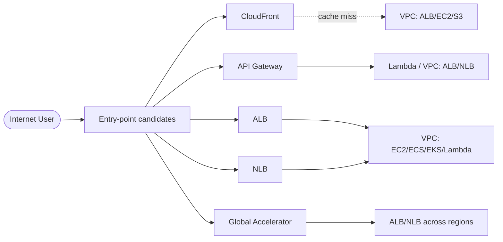
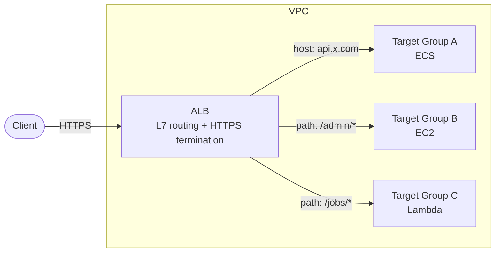
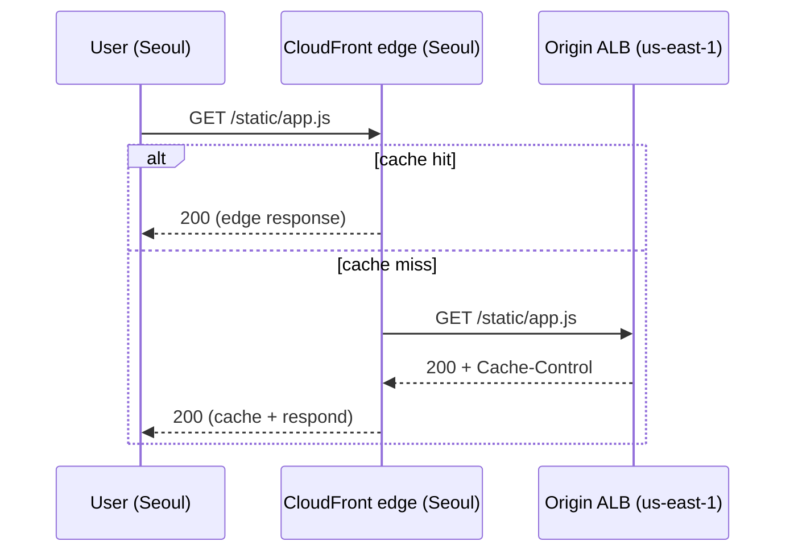
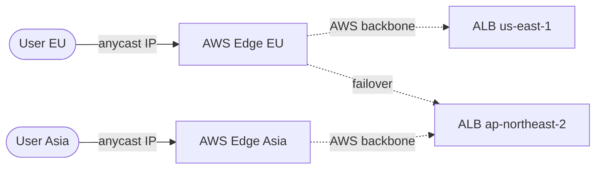
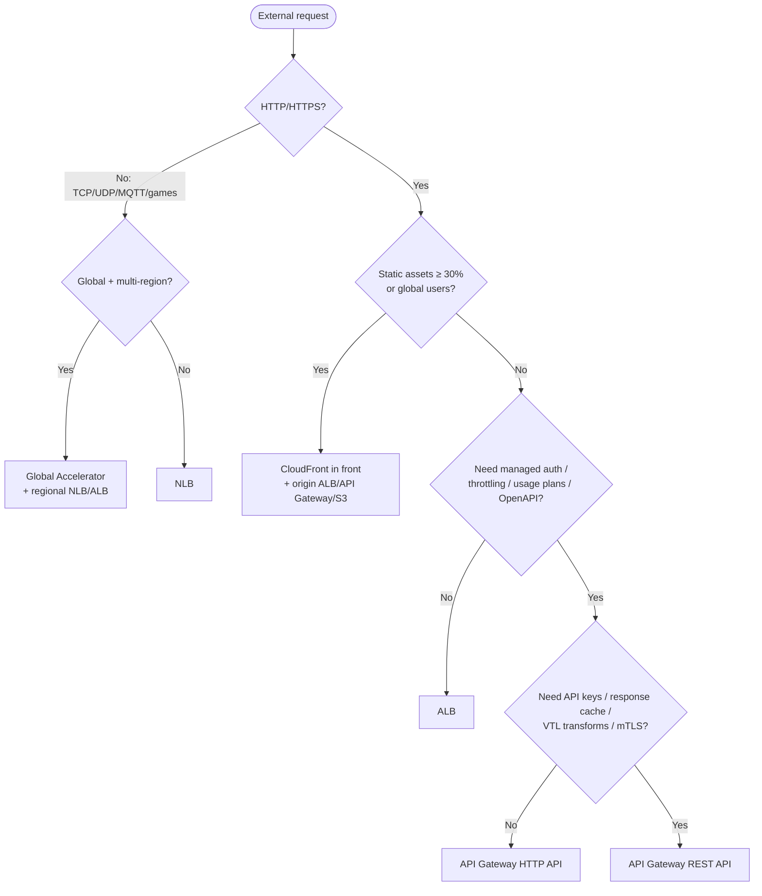

## Introduction

"What should I put in front of this VPC?" is the question that comes back every time you sketch an AWS architecture, because there are five candidates: ALB, NLB, API Gateway, CloudFront, Global Accelerator. You know the names. But the moment you have to pick one for a new service, if the answer doesn't surface within a second, the decision usually defaults to "whatever someone else picked last time."

This series starts there. We walk through AWS network service blocks framed as <strong>"what decision problem does this solve?"</strong>, in three parts. Part 1 covers the most frequent decision — <strong>picking an entry point that fronts your VPC</strong>.

- <strong>Part 1 — Picking the entry point: ALB / NLB / API Gateway / CloudFront / Global Accelerator (this post)</strong>
- Part 2 — VPC-to-VPC and on-prem connectivity: VPC Endpoint / PrivateLink / Transit Gateway / Peering / Direct Connect
- Part 3 — Inside the VPC: IGW / NAT GW / Route Tables / Security Group vs NACL

The target reader is a backend or infrastructure engineer who has "spun up an ALB in the console but isn't sure when to reach for API Gateway or CloudFront." After this post, the goal is that <strong>picking the entry point for a new service stops being a thing you stall on.</strong>

---

## TL;DR

- <strong>The first split is L7 (HTTP/HTTPS) vs L4 (TCP/UDP)</strong>. L7 → ALB · API Gateway · CloudFront. L4 → NLB · Global Accelerator.
- <strong>API Gateway only earns its price tag</strong> when you actually use its built-in auth, throttling, usage plans, or managed integrations. As a plain HTTP proxy, ALB is almost always cheaper and faster.
- <strong>CloudFront is not an entry point — it's a caching layer</strong> in front of an ALB, an API Gateway, or S3. You almost never use it standalone.
- <strong>NLB is the answer when you need a static IP, ultra-low latency, or non-HTTP TCP/UDP</strong>. WebSocket and gRPC are technically possible at L4, but ALB does both better at L7.
- <strong>Global Accelerator only pays off with multi-region + worldwide users</strong>. Tacking it onto a single-region service just burns ~$18/month.

---

## 1. Why this decision is hard

AWS gives you five entry-point candidates, and they differ across OSI layer, routing granularity, auth/cache features, and pricing model. <strong>Two services that look similar on the surface diverge on a single critical variable</strong>, so a surface-level pick tends to bite you months later when cost or feature gaps force a rewrite.

The trick is that an entry point isn't just "where traffic arrives" — it's <strong>a component that adds processing on top of the request.</strong> So the decision narrows to four variables:

| Variable | Meaning | Where it points |
| --- | --- | --- |
| Protocol layer | HTTP/HTTPS = L7, anything else TCP/UDP = L4 | L7 → ALB / API Gateway / CloudFront, L4 → NLB / Global Accelerator |
| Global distribution | Users spread across continents | CloudFront (L7) / Global Accelerator (L4) |
| Managed extras | Auth, throttling, API keys, usage plans, cache | API Gateway (auth/throttle) / CloudFront (cache) |
| Static IP / ultra-low latency | IP allowlists, finance/game traffic | NLB |

Walk these four in order and the candidate set almost always collapses to one or two. The decision tree in §4 captures that flow on a single page; the sections before that explain how each candidate actually behaves.

---

## 2. L7 entry points — ALB / API Gateway / CloudFront

L7 means the entry point can route on the contents of the HTTP message (host, path, header, cookie). ALB, API Gateway, and CloudFront are all L7, but <strong>what they add at L7</strong> is completely different.

### 2.1 ALB — the most ordinary L7 load balancer

ALB (Application Load Balancer) is AWS's managed L7 reverse proxy. <strong>It's the default entry point sitting in front of EC2 / ECS / EKS / Lambda inside a VPC</strong>, handling host/path/header-based routing and HTTPS termination.

The features that matter:

- <strong>Host/path routing</strong> — one ALB fans multiple domains and paths out to different backends.
- <strong>HTTPS termination</strong> — terminate TLS with an ACM cert and either talk plaintext to the backend or re-encrypt.
- <strong>WebSocket / HTTP/2 / gRPC</strong> — all native. For gRPC, set the Target Group to `HTTP` + `Protocol version: gRPC`.
- <strong>Managed HA</strong> — Multi-AZ internally. ALB itself failing is essentially not your problem.

Pricing has two axes: <strong>hourly LB cost + LCU</strong> (Load Balancer Capacity Units). Roughly $16~20/month sits there as a fixed cost regardless of traffic. That's the key catch — even with zero traffic, an idle ALB still bills monthly.

### 2.2 API Gateway — when you need the managed extras

API Gateway is also L7, but it's <strong>an entry point that wraps "everything you need to operate an API"</strong> in one box. Don't think of it as a router — think of it as "auth, throttling, usage plans, response cache, custom domain, OpenAPI import, all in one service."

There are two variants and they get confused all the time.

| | HTTP API | REST API |
| --- | --- | --- |
| Released | v2 (2019~) | v1 (2015~) |
| Pricing | $1.00 per million requests | $3.50 per million requests |
| Auth | JWT / OIDC / Lambda Authorizer | IAM / API Key / Cognito / Lambda Authorizer |
| Response caching | No | Yes (separate hourly instance fee) |
| Request/response transforms | Limited | Powerful (Velocity templates) |
| When to pick | Most new APIs | API keys / usage plans / cache / VTL transforms |

<strong>For a new API, default to HTTP API.</strong> Reach for REST API only when you need its specific features — usage-plan-based API keys, response cache, request/response transforms, mTLS.

> <strong>Note</strong>: There's a third type, WebSocket API, for bidirectional messaging (chat, real-time notifications). ALB also handles WebSocket, but if you want Lambda backends and want AWS to manage the connection state, WebSocket API is the answer.

API Gateway costs more than ALB, so the rule is simple: <strong>if you aren't actually using the features that justify the price, you're wasting money.</strong> The most common waste pattern is "I want something in front of Lambda" — Lambda Function URLs or ALB + Lambda targets are almost always cheaper.

### 2.3 CloudFront — not an entry point, a cache + global accelerator

CloudFront is AWS's CDN. It caches content at 600+ edge locations worldwide and serves users from the closest one. <strong>You almost never use CloudFront standalone</strong> — there's always an origin behind it (S3, ALB, API Gateway, an external HTTP server).

CloudFront pays off in three scenarios:

- <strong>Lots of static assets</strong> — JS, CSS, images, fonts. Edge cache cuts origin traffic to nearly zero.
- <strong>Global users</strong> — TLS handshake terminates at the closest edge, then traffic rides the AWS backbone to the origin (faster than the public-internet path).
- <strong>API needs caching or DDoS protection</strong> — putting CloudFront in front of an API Gateway or ALB gives you short-TTL response caching and free AWS Shield Standard.

The mistake people make most often is <strong>forgetting it's a caching layer.</strong> CloudFront on its own can't handle a dynamic request — on a cache miss, it just forwards to the origin, and that origin (ALB, S3, whatever) is the one doing real work.

### 2.4 The L7 comparison table

| | ALB | API Gateway HTTP API | API Gateway REST API | CloudFront |
| --- | --- | --- | --- | --- |
| Where it runs | Inside VPC (regional) | AWS-managed (regional) | AWS-managed (regional/edge) | Global edge |
| Routing unit | host / path / header | route → integration | route → integration | path / behavior |
| Built-in auth | OIDC / Cognito | JWT / OIDC / Lambda | IAM / API Key / Cognito / Lambda | signed URL / signed cookie |
| Caching | No | No | Yes (optional) | Yes (the whole point) |
| WebSocket | Yes | Separate WebSocket API | No | No |
| gRPC | Yes | No | No | No |
| Idle cost | $16~20/month (LB hour) | $0 | $0 (cache adds hourly instance) | $0 |
| Per-request cost | Very low (LCU) | $1.00 / million | $3.50 / million | Very low + data transfer |
| Strength | Containers/EC2 standard | Serverless API + auth/throttle | Usage plans / cache / VTL | Global cache / static assets |

The two confusions that come up most often:

- <strong>ALB vs API Gateway HTTP API</strong>: Steady traffic above some threshold → ALB is cheaper (idle cost exists, but per-request is essentially zero). Low or spiky traffic → API Gateway is cheaper (no idle, only per-request). The crossover is roughly <strong>~2M requests/month</strong>. Beyond cost, pick API Gateway when you need auth/throttling, ALB when you need containers/gRPC/WebSocket.
- <strong>CloudFront vs the other two</strong>: CloudFront is not an alternative — it's <strong>a layer you put on top</strong>. The question isn't "ALB or CloudFront", it's "CloudFront + ALB or just ALB."

---

## 3. L4 entry points — NLB / Global Accelerator

L4 means the entry point routes on TCP/UDP packet headers (IP, port) only. <strong>It doesn't understand HTTP, but it's very fast and accepts any protocol.</strong>

### 3.1 NLB — static IPs and ultra-low latency

NLB (Network Load Balancer) is the L4 load balancer. It fills the gaps that ALB can't:

- <strong>Static IPs</strong> — assign an EIP per AZ. Often the only answer when an external system requires IP allowlisting (banking, payment gateways).
- <strong>TCP / UDP / TLS</strong> — anything that isn't HTTP. Game servers (UDP), MQTT, custom binary protocols.
- <strong>Ultra-low latency</strong> — packet-level processing means single-digit-ms lower latency than ALB.
- <strong>Preserve client IP</strong> — Target Group in IP mode + Cross-Zone disabled passes the client IP straight through.

ALB vs NLB in one line: <strong>does the entry point need to understand HTTP?</strong> Yes → ALB. No → NLB.

> <strong>Note</strong>: NLB also supports TLS termination via TLS listener. So "HTTPS but routing on IP/port is enough" (e.g., a single backend with no host routing) is a legitimate NLB scenario.

### 3.2 Global Accelerator — multi-region + AWS backbone

Global Accelerator (GA) hands out two anycast IPs. Users send traffic to those IPs, <strong>enter at the closest AWS edge, then ride the AWS backbone</strong> to the actual backend (ALBs / NLBs / EC2 / EIPs in any region).

Two concrete benefits:

- <strong>AWS backbone from the first hop</strong> — similar to CloudFront riding the backbone on cache miss, but GA does it for every packet. Public-internet routing volatility doesn't affect you.
- <strong>Cross-region automatic failover</strong> — when a region dies, traffic shifts to another region. Similar to Route 53 health-check routing, but you don't wait for DNS TTL.

The cost: $0.025/hour (~$18/month) fixed + extra data transfer. <strong>Almost always wasted on a single-region service.</strong> GA is justified roughly when "global users + multi-region backends already exist + DNS-based failover lag actually hurts."

### 3.3 NLB vs Global Accelerator

| | NLB | Global Accelerator |
| --- | --- | --- |
| Layer | L4 | L4 (anycast) |
| Scope | Single region | Global |
| IP | EIP (static) per AZ | Two anycast IPs (permanent) |
| AWS backbone | Last hop only | First hop onward |
| Multi-region failover | No (Route 53 separately) | Yes (automatic) |
| Idle cost | $0.0225/hr | $0.025/hr + data transfer |
| When to pick | Static IP, ultra-low latency, TCP/UDP | Global users + multi-region |

---

## 4. The decision tree

Walk the four variables above in order and almost any case resolves.

Each branch in one line:

- <strong>Q1 (L7 vs L4)</strong>: anything not HTTP is L4. WebSocket and gRPC ride on top of HTTP, so they're L7.
- <strong>Q2 (multi-region global)</strong>: single region → NLB and you're done. IP-allowlist scenarios that need a static IP also land here.
- <strong>Q3 (static assets / global)</strong>: heavy static or users across continents → CloudFront in front. CloudFront is never standalone — there's always an origin.
- <strong>Q4 (managed extras)</strong>: no auth/throttling needs → ALB nearly always wins. Containers, EKS, gRPC live here too.
- <strong>Q5 (REST-specific)</strong>: usage-plan API keys, response cache, request/response transforms, mTLS — any one of these → REST API. Otherwise HTTP API.

> <strong>Key</strong>: The branches are ordered by feature, not cost, because <strong>missing features force a rewrite, but cost can be optimized after the fact.</strong> Picking the cheapest entry point only to find it can't handle WebSocket means starting over from scratch.

---

## 5. Five common anti-patterns

Mistakes here repeat in predictable shapes. Walking through them once is usually enough to dodge the same trap later.

### 5.1 NLB in front of an ALB

"I need a static IP, so I'll put an NLB in front, and I still need host routing so I'll put an ALB behind it..." — <strong>chaining NLB → ALB makes no sense.</strong> The NLB just forwards IP/port to the ALB, which is the one doing the actual work, so the static-IP allowlist now points at... still the ALB. The standard answer when you need a static IP in front of an ALB is <strong>Global Accelerator in front of the ALB</strong> — GA gives you anycast IPs and forwards to the ALB.

### 5.2 Serving static assets from API Gateway

"I want the API and static files coming from the same origin, so I'll let API Gateway handle the static stuff too." <strong>That $1~3.50 per million requests now applies to every JS/CSS/image hit</strong>, and a single page load with dozens of asset requests blows up the bill. Standard pattern: static assets on S3 + CloudFront, API on API Gateway, with CloudFront path behaviors picking the right origin.

### 5.3 Serving global users without CloudFront

ALB only in Seoul, users in the US and Europe crossing the Pacific or Indian Ocean every request. <strong>The TLS handshake alone costs ~4 RTTs, so the latency hit is severe.</strong> Even for a fully dynamic API with no static assets, <strong>putting CloudFront in front with a 0-second cache moves TLS termination to the edge</strong> and noticeably reduces perceived latency.

### 5.4 ALB in front of a single EC2

A single EC2 instance behind an ALB. <strong>There's nothing to load-balance, so the ALB is just an expensive HTTPS terminator</strong> — $20/month with no HA gain (when the EC2 dies, the ALB has nowhere to send traffic). Cheaper alternatives at this stage: terminate HTTPS on the EC2 with Nginx, or use Lightsail / Cloudflare Tunnel. ALB starts paying off from two EC2 instances onward.

### 5.5 Polling REST instead of using WebSocket

"I need real-time notifications, I'll poll the REST endpoint." It works at first, but as traffic grows, polling explodes both cost and server load. WebSocket scenarios should be drawn from the start with <strong>ALB (native WebSocket) or API Gateway WebSocket API</strong>. The split is about where connection state lives — backend (ALB) vs AWS-managed (API Gateway WebSocket).

---

## Recap

What this post covered:

1. <strong>Entry-point selection collapses to four variables</strong>: protocol layer / global distribution / managed extras / static IP & ultra-low latency. Walk them in order and the candidate set drops to one or two.
2. <strong>What separates the L7 candidates is "what processing they add"</strong> — ALB does host/path routing, API Gateway adds auth and throttling, CloudFront caches globally. Same layer, different jobs.
3. <strong>CloudFront is a caching layer, not an entry point.</strong> There's always an origin behind it; it almost never runs alone.
4. <strong>L4 splits between NLB (single-region static IP / ultra-low latency) and Global Accelerator (multi-region global)</strong>. GA carries a fixed cost, so it's nearly always wasted in a single-region service.
5. <strong>Five anti-patterns to dodge</strong>: NLB → ALB chaining, static assets from API Gateway, no CloudFront in front of a global service, ALB on a single EC2, REST polling instead of WebSocket. Each comes from taking one branch wrong on the decision tree.

The goal of Part 1 was to make <strong>the decision of "what entry point fronts this VPC" almost automatic</strong>. With the decision tree in hand, picking it should be a sub-minute exercise.

Next up: <strong>VPC-to-VPC and on-prem connectivity</strong>. What's the difference between VPC Endpoint and PrivateLink, when does Transit Gateway win over VPC Peering, and at what scale does Direct Connect start paying for itself? The decision problem after the traffic has entered — how it reaches the next system inside (or outside) the VPC.

---

## Appendix. One-page summary

Bookmark this section for quick reference.

### A. By OSI layer

| Layer | Candidates | Routing unit |
| --- | --- | --- |
| L7 (HTTP) | ALB / API Gateway / CloudFront | host, path, header, cookie |
| L4 (TCP/UDP) | NLB / Global Accelerator | IP, port |

### B. Pricing in one line

| Candidate | Idle cost | Per-request cost | Data transfer |
| --- | --- | --- | --- |
| ALB | $16~20/mo | LCU (effectively zero) | Standard EC2 outbound |
| NLB | $16~20/mo | NLCU | Standard |
| API Gateway HTTP API | $0 | $1.00 / million | Standard |
| API Gateway REST API | $0 (cache adds hourly instance) | $3.50 / million | Standard |
| CloudFront | $0 | Very low | edge → user (region-tiered) |
| Global Accelerator | ~$18/mo | $0 | $0.015/GB extra |

### C. Official AWS docs

- ALB: <https://docs.aws.amazon.com/elasticloadbalancing/latest/application/>
- NLB: <https://docs.aws.amazon.com/elasticloadbalancing/latest/network/>
- API Gateway comparison: <https://docs.aws.amazon.com/apigateway/latest/developerguide/http-api-vs-rest.html>
- CloudFront: <https://docs.aws.amazon.com/AmazonCloudFront/latest/DeveloperGuide/>
- Global Accelerator: <https://docs.aws.amazon.com/global-accelerator/latest/dg/>

### D. Acronyms

| Acronym | Meaning |
| --- | --- |
| ALB | Application Load Balancer. L7 load balancer |
| NLB | Network Load Balancer. L4 load balancer |
| GA | Global Accelerator. AWS-backbone-based global accelerator |
| CDN | Content Delivery Network. CloudFront |
| LCU | Load Balancer Capacity Unit. ALB billing unit |
| EIP | Elastic IP. Static public IP |
| TG | Target Group. ALB/NLB backend pool |
| OAC | Origin Access Control. CloudFront-to-S3 access protection |
