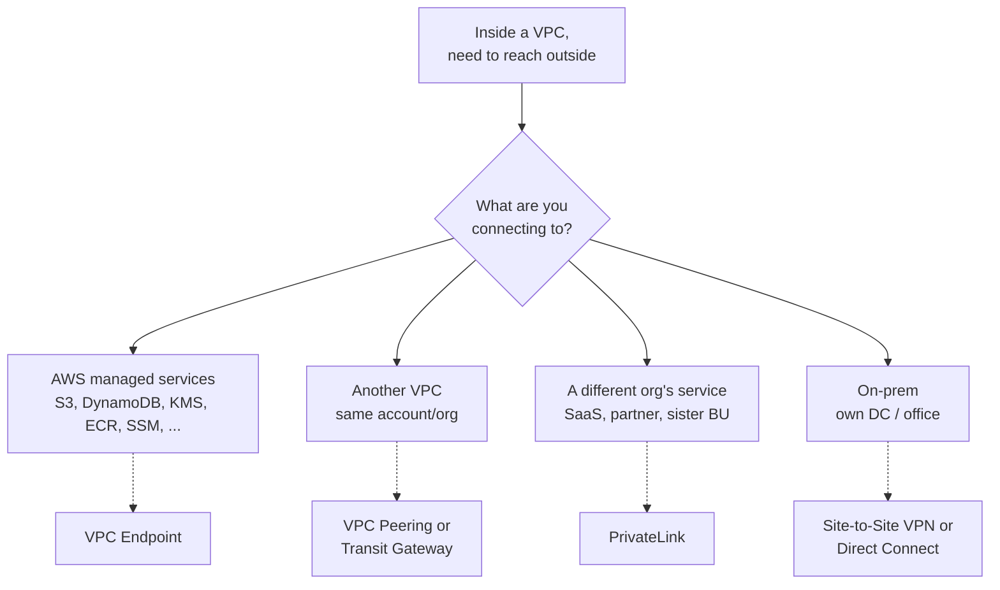
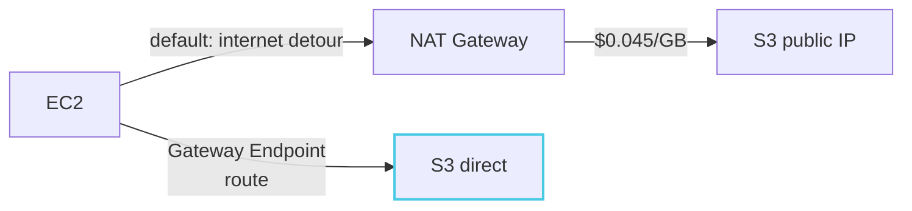
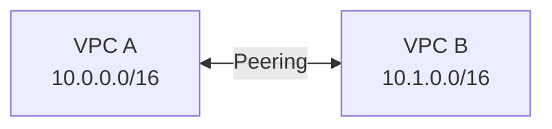
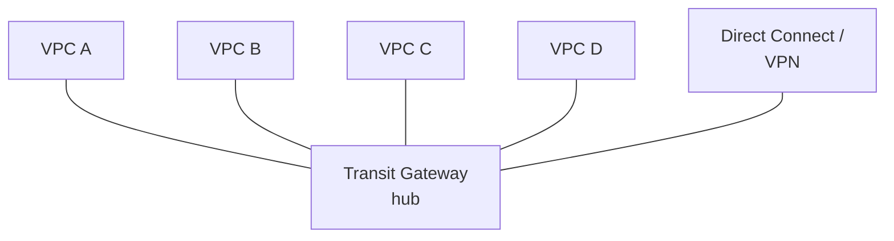
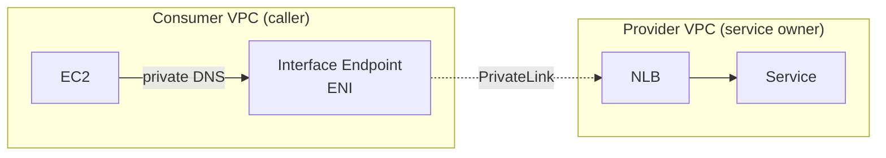
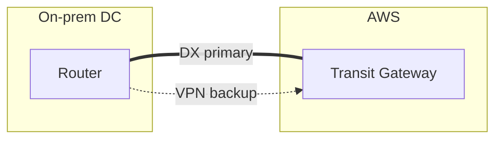
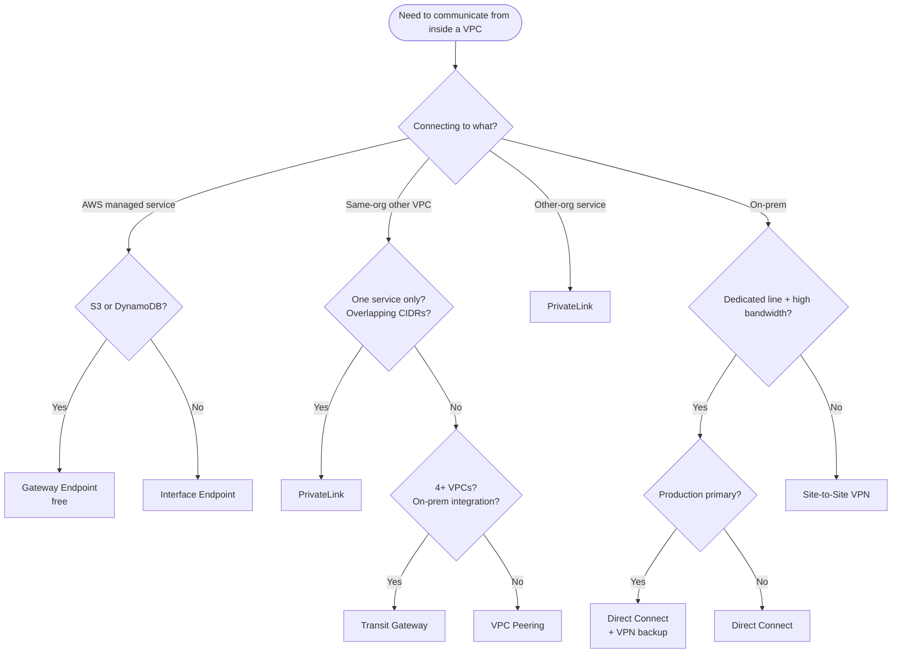

## Introduction

In the [previous post](/blog/en/aws-vpc-edge-routing-guide-1) we covered picking the entry point that fronts a VPC. This post handles the next decision — <strong>once traffic is inside (or already lives inside) a VPC, how does it reach another VPC, an AWS-managed service, or on-premises?</strong>

This decision goes wrong far more often than Part 1's. There are six candidates, each works on a fundamentally different mechanism, and "looks similar but actually can't do X" comes up everywhere. Building an N×N mesh of VPC Peerings only to rip it out for Transit Gateway a year later, or routing S3 traffic through a NAT Gateway and quietly burning hundreds of dollars a month — both are common.

- Part 1 — Picking the entry point: ALB / NLB / API Gateway / CloudFront / Global Accelerator
- <strong>Part 2 — VPC-to-VPC and on-prem connectivity: VPC Endpoint / PrivateLink / Peering / Transit Gateway / VPN / Direct Connect (this post)</strong>
- Part 3 — Inside the VPC: IGW / NAT GW / Route Tables / Security Group vs NACL

Same target reader as Part 1 — backend or infrastructure engineers who've built a VPC but can't explain "what's the difference between option A and option B" in one line. After this post, the goal is that <strong>"connect this VPC to something" is a 30-second decision.</strong>

---

## TL;DR

- <strong>The first split is "where does the destination live"</strong> — AWS managed service / another VPC / a different organization's service / on-prem. The candidate set barely overlaps across these four.
- <strong>For S3 and DynamoDB, Gateway Endpoint (free)</strong> is almost always the answer. Routing S3 traffic through NAT Gateway charges per-GB data processing.
- <strong>VPC Peering is 1:1, Transit Gateway is N:N.</strong> Past three or four VPCs, a Peering mesh stops being operationally feasible — switch to TGW.
- <strong>To privately expose a service from another organization (or VPC), use PrivateLink.</strong> It sidesteps IP-overlap problems and exposes only one service in one direction.
- <strong>On-prem starts with VPN and graduates to Direct Connect.</strong> The two aren't competitors — production patterns usually run DX as primary with a VPN backup.

---

## 1. Why this decision is hard

Unlike Part 1's entry-point candidates, the six VPC-connectivity options split <strong>by the underlying decision problem itself, into four buckets</strong>. So the same word "connection" pulls in completely different candidate sets depending on what you're connecting.

"Connect VPC to X" almost completely partitions by where X lives. So this guide's decision tree puts <strong>destination-type as the first branch</strong>, then asks two or three more variables inside each region.

In one table:

| Destination | Decision variables | Candidates |
| --- | --- | --- |
| AWS managed service | S3/DynamoDB or other? | Gateway Endpoint / Interface Endpoint |
| Same-org VPC | 1:1 or N:N? | VPC Peering / Transit Gateway |
| Other-org service | One-way exposure / IP isolation needed | PrivateLink |
| On-prem | Internet OK / dedicated line needed | Site-to-Site VPN / Direct Connect / both |

Sections 2–5 cover the candidates per region with their mechanisms and selection criteria. §6 has the full decision tree, §7 the anti-patterns.

---

## 2. Reaching AWS managed services — VPC Endpoint

By default, when an EC2 inside a VPC talks to an AWS managed service like S3, DynamoDB, KMS, or ECR, <strong>traffic goes out to the internet</strong> — through IGW from a Public Subnet, or through NAT Gateway from a Private one. Both eventually return to the AWS backbone, but the round-trip "leave the VPC, come back in" hurts cost and security.

VPC Endpoint removes that detour. <strong>"Talk to AWS services directly from inside the VPC, without traversing the internet"</strong> is the one-line definition.

### 2.1 Gateway Endpoint vs Interface Endpoint

Endpoints come in two flavors, and the choice is automatic based on <strong>which service you're targeting</strong>.

| | Gateway Endpoint | Interface Endpoint |
| --- | --- | --- |
| Supported services | <strong>S3, DynamoDB</strong> only | Most others (KMS, ECR, SSM, CloudWatch, Lambda, ...) |
| Mechanism | Route Table + prefix list | ENI in the VPC + Private DNS |
| Cost | <strong>Free</strong> | $0.01/hour/AZ + $0.01/GB |
| Reachable from another VPC / on-prem | No | Yes (via PrivateLink) |

The rule is simple — <strong>S3 and DynamoDB → Gateway Endpoint; everything else → Interface Endpoint.</strong>

### 2.2 Why Gateway Endpoint is free, and the pitfalls

Gateway Endpoint is just "add a prefix-list route for S3/DynamoDB to the Route Table." Packets exit through that route instead of the IGW or NAT Gateway, and AWS handles the path on its own backbone — no extra infrastructure (no ENI, no traffic processing). That's why it's free.

Two pitfalls:

- <strong>Same-region only</strong> — Gateway Endpoint reaches S3 buckets in the same region only. Cross-region S3 still goes through NAT.
- <strong>Useless without a Route Table entry</strong> — creating the Endpoint isn't enough; the prefix list has to be added to the Route Table of the EC2's Subnet for routing to actually change. 99% of "I created it but nothing changed" comes from this miss.

### 2.3 Interface Endpoint — an ENI inside the VPC

Interface Endpoint works completely differently. <strong>It puts an ENI in a Subnet of your VPC and attaches Private DNS</strong> so that the service's official domain (e.g., `kms.ap-northeast-2.amazonaws.com`) resolves to the ENI's private IP.

Two implications:

- <strong>It costs money</strong> — $0.01/hour/AZ + $0.01/GB. Three AZs gives you ~$21/month fixed. Small numbers, but creating Interface Endpoints for every service in a small environment can quietly add up to $100~200/month.
- <strong>Endpoint policies for access control</strong> — IAM-policy-style rules on which resources can be reached through this Endpoint. Common in compliance-driven environments.

> <strong>Note</strong>: Interface Endpoint and PrivateLink are the same mechanism. AWS managed services exposed via PrivateLink → Interface Endpoint; user services exposed the same way → PrivateLink (§5). Same box, different label.

---

## 3. Same-org VPCs — Peering vs Transit Gateway

Anyone running more than one VPC hits this fork. Splitting dev/staging/prod, separating per team, or building in another region — all create the moment when <strong>"these two should be able to talk to each other."</strong>

### 3.1 VPC Peering — 1:1 direct

VPC Peering is the simplest way: <strong>connect two VPCs at L3 by adding routes on each side</strong>. Both Route Tables get a route for the other VPC's CIDR, both sides accept the peering, done.

Properties and limits:

- <strong>Almost zero cost</strong> — Peering itself is free; only data transfer is billed.
- <strong>Non-transitive</strong> — A↔B and B↔C don't automatically give you A↔C. You need a separate Peering for that.
- <strong>CIDRs cannot overlap</strong> — overlapping IP ranges make Peering impossible.
- <strong>Mesh explodes with VPC count</strong> — N VPCs full-mesh = N(N-1)/2 peerings. 5 → 10. 10 → 45.

### 3.2 Transit Gateway — N:N hub

Transit Gateway (TGW) is <strong>a hub model where all VPCs and on-prem connections attach to a single Transit Gateway</strong>. Each attachment routes through TGW Route Tables. Adding a new VPC means attaching it to TGW — none of the existing VPCs need to change.

Differences that matter:

- <strong>Transitive</strong> — A→B→C routing is just a TGW Route Table setting away.
- <strong>On-prem / DX / VPN integration</strong> — attach DX/VPN to TGW once, all VPCs share it.
- <strong>It costs</strong> — $0.05/hour per attachment + $0.02/GB. Five VPCs + one DX = ~$200+/month.

### 3.3 Where they split

| Variable | VPC Peering | Transit Gateway |
| --- | --- | --- |
| Connection count | 1:1 (or 2~3 full mesh) | 4+ |
| Transitive | No | Yes |
| Cost | $0 (data only) | $0.05/hour per attachment |
| On-prem integration | Configured separately | One TGW attach, all VPCs share |
| CIDR overlap | Not allowed | Can be split via TGW Route Tables |
| Operational complexity | Explodes with VPC count | Centralized |

Practical crossover: <strong>around 3~4 VPCs</strong>. Below that, Peering's zero cost wins. Above, mesh management eats your operations and TGW's fee earns its keep.

---

## 4. Other-org services — PrivateLink

Section 3 covers within-org VPC connections. But there's a separate scenario — <strong>privately calling a service from another organization</strong> (a SaaS vendor, a partner, or even another business unit at the same company) from your own VPC. PrivateLink is built for that decision problem.

### 4.1 What PrivateLink solves

The mechanism is straightforward. <strong>The Provider defines a "Service" in front of an NLB</strong>; <strong>the Consumer creates an Interface Endpoint in their VPC connected to that Service</strong>. The Consumer talks to a domain that resolves to an ENI in their own VPC; the Provider only exposes their NLB.

PrivateLink's wins versus Peering / TGW:

- <strong>IP overlap is irrelevant</strong> — it works even when Consumer/Provider VPC CIDRs collide. The Consumer just talks to an ENI in its own VPC.
- <strong>One-way and service-scoped</strong> — Provider exposes only the service behind the specified NLB; the rest of the VPC stays private. Peering exposes the entire VPC.
- <strong>Consumer-side SG control</strong> — attach an SG to the Endpoint ENI to restrict which Consumer-side EC2s can call.

### 4.2 PrivateLink vs Peering — when each wins

Even within the same organization, PrivateLink is sometimes the right call.

| Situation | Pick |
| --- | --- |
| Two VPCs need full bidirectional VPC-wide access | Peering / TGW |
| One VPC calls a single service in another VPC | <strong>PrivateLink</strong> |
| CIDRs overlap | <strong>PrivateLink</strong> (or TGW + NAT) |
| Calling a service in another AWS account/org | <strong>PrivateLink</strong> (essentially the only answer) |
| Privately calling a SaaS vendor's service | <strong>PrivateLink</strong> (if they support it) |

Summary: <strong>"VPC-wide" → Peering/TGW. "One service" → PrivateLink.</strong>

---

## 5. On-prem — VPN and Direct Connect

Connecting on-prem (your DC or office server room) to a VPC narrows to two options: Site-to-Site VPN and Direct Connect. They're not competitors — <strong>they're a "low-barrier vs high-performance" progression</strong>.

### 5.1 Site-to-Site VPN — IPsec tunnel over the internet

Site-to-Site VPN sets up IPsec tunnels over the public internet between AWS-side Virtual Private Gateway (VGW) or TGW and your on-prem router. Two IPsec tunnels come up automatically; both sides exchange routes via BGP or static routing.

- <strong>Up in days</strong> — no hardware orders, just router configuration.
- <strong>Bandwidth bound by your internet circuit</strong> — roughly 1.25 Gbps per tunnel cap.
- <strong>Latency exposed to internet routing volatility</strong> — fine most days, but ISP issues show through.
- <strong>Pricing</strong> — $0.05/hour per tunnel. AWS automatically creates two → $0.10/hour.

### 5.2 Direct Connect — dedicated fiber to AWS

Direct Connect (DX) is <strong>actual fiber laid to an AWS facility (or DX Location)</strong> — a dedicated circuit.

- <strong>1, 10, or 100 Gbps options</strong> — bandwidth VPN can't match.
- <strong>Stable latency</strong> — no internet routing in the picture.
- <strong>Different pricing model</strong> — port-hour fee plus data transfer. But <strong>AWS-to-on-prem outbound on DX is much cheaper than over the internet</strong>, so high-volume traffic ends up cheaper than VPN.
- <strong>Takes time</strong> — circuit ordering and physical install takes weeks to months.

### 5.3 They complement each other — DX primary + VPN backup

The standard production pattern is <strong>"DX primary, VPN backup."</strong>

Reasons:

- <strong>DX is a single physical circuit</strong> — one cable cut and you're down. With VPN configured, BGP fails over automatically.
- <strong>VPN is your fast start</strong> — bring up VPN first while DX is being provisioned, promote DX to primary later.
- <strong>BGP picks the path automatically</strong> — no manual ops involvement; availability is built in.

| | Site-to-Site VPN | Direct Connect |
| --- | --- | --- |
| Medium | Internet + IPsec | Dedicated fiber |
| Bandwidth | ~1.25 Gbps per tunnel | 1 / 10 / 100 Gbps |
| Latency | Subject to internet routing | Stable |
| Build time | Days | Weeks to months |
| Pricing | $0.05/hour per tunnel | Port-hour + data (cheaper at scale) |
| When to pick | PoC, mid-scale, backup | Production primary |

---

## 6. The decision tree

The four regional decisions combine into:

Each branch in one line:

- <strong>QA (S3/DynamoDB)</strong>: always Gateway Endpoint. Routing through NAT Gateway just leaks data-processing fees.
- <strong>QB (single service / CIDR overlap)</strong>: either condition → PrivateLink wins decisively.
- <strong>QC (VPC count, on-prem integration)</strong>: under 4 + no on-prem → Peering. Otherwise TGW.
- <strong>QD (bandwidth/latency demands)</strong>: internet circuit suffices → VPN. Need dedicated line → DX.
- <strong>QE (production primary?)</strong>: production primary should be DX + VPN backup, not DX alone.

> <strong>Key</strong>: The first-level branch is destination type, not cost or features. Once that's set, the candidate set drops to one or two immediately.

---

## 7. Five common anti-patterns

### 7.1 NAT Gateway for S3 access

The most common and most expensive leak. <strong>S3 traffic through a NAT Gateway costs $0.045/GB</strong>, and analytics, log shipping, and image upload workloads run hundreds of GB to TBs monthly — that just gets added to the bill. A Gateway Endpoint plus one prefix-list line in the Route Table is a five-minute change that saves hundreds of dollars a month.

### 7.2 N:N mesh of VPC Peerings

Five-plus VPCs all needing to talk to each other, drawn as a full Peering mesh. <strong>Route Tables explode and every new VPC means touching every existing VPC's Route Table.</strong> Move to TGW — yes, attachments cost, but the operational complexity reduction more than pays for itself.

### 7.3 Direct Connect alone

Running only one DX circuit and going dark when the fiber is cut. <strong>DX is a single physical circuit; on its own its SLA isn't materially better than a regular internet circuit.</strong> AWS's standard pattern is always DX + VPN backup; for higher availability, run two DX circuits over separate physical paths or use a second DX Location.

### 7.4 Interface Endpoints in every AZ

"For AZ separation" — putting an Interface Endpoint in every AZ. <strong>$0.01/hour/AZ adds up</strong>; small services can leak tens of dollars a month doing this. Single-AZ environments (dev, staging) or low-traffic services usually only need one or two AZs. Even in production, look at traffic patterns first.

### 7.5 Solving a PrivateLink problem with Peering

Calling a single service from another org (or BU) but solving it with VPC Peering. <strong>Peering exposes the entire VPC</strong> — overkill for security, and impossible if the two orgs' CIDRs collide. Anything that fits PrivateLink and is built on Peering will get torn out the moment a security review lands.

---

## Recap

What this post covered:

1. <strong>The first split is where the destination lives</strong>: AWS managed service / same-org VPC / other-org service / on-prem. The four buckets barely share candidates.
2. <strong>S3/DynamoDB → Gateway Endpoint, everything else → Interface Endpoint.</strong> Gateway is free and almost always right; Interface costs per AZ, so be deliberate.
3. <strong>VPC Peering vs Transit Gateway is "1:1 vs N:N."</strong> Past 3~4 VPCs, TGW is operationally non-negotiable.
4. <strong>Other-org services, CIDR collisions, single-service exposure → PrivateLink.</strong> It solves problems Peering and TGW can't.
5. <strong>On-prem starts with VPN, graduates to DX</strong>, but production runs both — DX primary + VPN backup.

Part 2's goal was to make <strong>"VPC needs to talk to something outside" a 30-second decision</strong>. The decision tree narrows to one or two candidates in step one, and lands on exactly one by step three.

Part 3 covers <strong>routing inside the VPC</strong> — how IGW and NAT Gateway actually work, the priority order Route Tables evaluate in, and where stateful Security Groups and stateless NACLs split in practice. After ingress and external connectivity are settled, <strong>how packets actually flow inside the VPC</strong> is what's left.

---

## Appendix. One-page summary

### A. One-line decision per region

| Destination | First pick | If first pick doesn't fit |
| --- | --- | --- |
| S3 / DynamoDB | Gateway Endpoint | (no alternative — always pick it) |
| Other AWS managed services | Interface Endpoint | Internet path (NAT GW) |
| Same-org VPC, 1:1 | VPC Peering | TGW |
| Same-org VPC, N:N | Transit Gateway | (mesh Peering is an anti-pattern) |
| Other-org service | PrivateLink | (essentially no alternative) |
| On-prem PoC / mid-scale | Site-to-Site VPN | DX |
| On-prem production primary | DX + VPN backup | (DX alone is an anti-pattern) |

### B. Pricing in one line

| Candidate | Idle cost | Data cost |
| --- | --- | --- |
| Gateway Endpoint | $0 | $0 (same region) |
| Interface Endpoint | $0.01/hour/AZ | $0.01/GB |
| VPC Peering | $0 | $0.01/GB cross-AZ, free same-AZ |
| Transit Gateway | $0.05/hour per attachment | $0.02/GB |
| PrivateLink (Provider) | NLB cost + Endpoint Service | NLB data |
| Site-to-Site VPN | $0.05/hour per tunnel | Standard outbound |
| Direct Connect | Port-hour (capacity-based) | DX outbound (cheaper than internet) |

### C. Official AWS docs

- VPC Endpoint: <https://docs.aws.amazon.com/vpc/latest/privatelink/>
- VPC Peering: <https://docs.aws.amazon.com/vpc/latest/peering/>
- Transit Gateway: <https://docs.aws.amazon.com/vpc/latest/tgw/>
- Direct Connect: <https://docs.aws.amazon.com/directconnect/latest/UserGuide/>
- Site-to-Site VPN: <https://docs.aws.amazon.com/vpn/latest/s2svpn/>

### D. Acronyms

| Acronym | Meaning |
| --- | --- |
| TGW | Transit Gateway. N:N VPC and on-prem hub |
| DX | Direct Connect. Dedicated fiber to AWS |
| VPN | Virtual Private Network. Here, Site-to-Site VPN |
| VGW | Virtual Private Gateway. AWS-side VPN endpoint |
| ENI | Elastic Network Interface. Virtual NIC in a VPC |
| BGP | Border Gateway Protocol. Dynamic routing protocol |
| CIDR | Classless Inter-Domain Routing. IP range notation |
| AZ | Availability Zone. Datacenter unit within a region |
