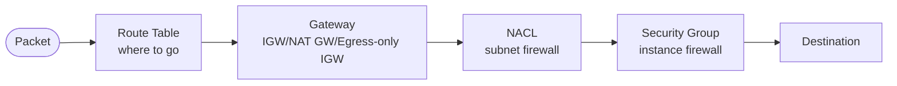
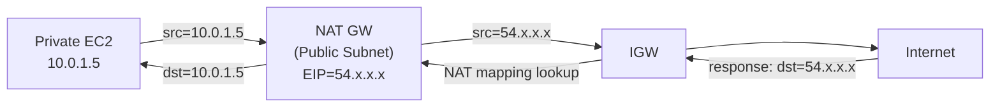
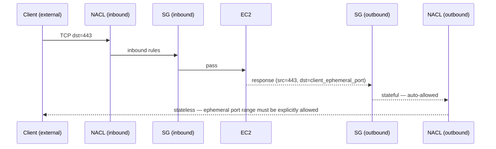
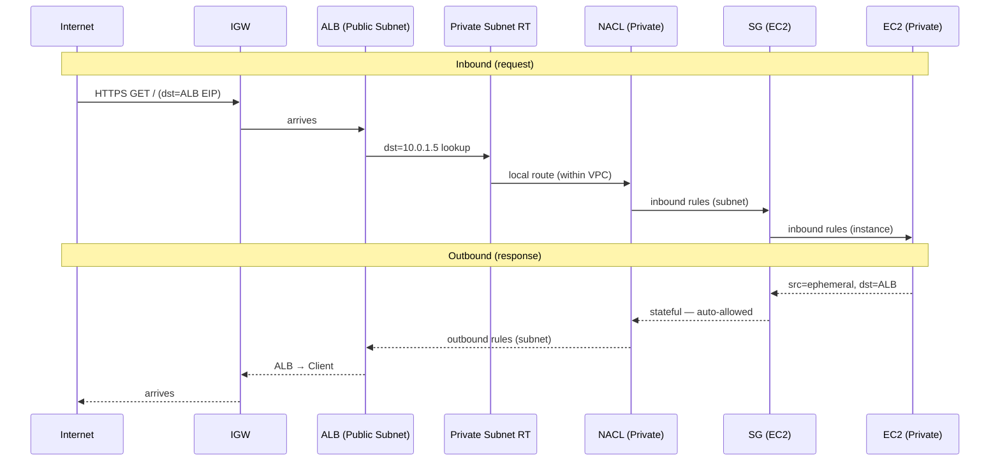

## Introduction

[Part 1](/blog/en/aws-vpc-edge-routing-guide-1) picked the entry point that fronts a VPC. [Part 2](/blog/en/aws-vpc-edge-routing-guide-2) handled how that traffic reaches other VPCs, AWS services, and on-prem. The final post covers what happens between — <strong>how packets actually flow inside the VPC and where they get blocked</strong>.

This area trips people up more than Parts 1 and 2 combined. It isn't a "pick A or B" decision; it's <strong>four components cooperating to determine the packet's path</strong>, so most engineers first run into it during debugging — "why isn't this working?" Open Security Groups but no response, Route Table edits with no effect, NACL rules that look right but outbound is blocked — every one of those traps comes from the way these four interact.

- Part 0 — [Primer: network and AWS fundamentals](/blog/en/aws-vpc-edge-routing-guide-0)
- Part 1 — Picking the entry point: ALB / NLB / API Gateway / CloudFront / Global Accelerator
- Part 2 — VPC-to-VPC and on-prem connectivity: VPC Endpoint / PrivateLink / Peering / Transit Gateway / VPN / Direct Connect
- <strong>Part 3 — Inside the VPC: IGW / NAT GW / Route Tables / Security Group vs NACL (this post)</strong>

Same target reader as before — backend or infrastructure engineers who've built a VPC but freeze when "why isn't this working?" hits. After this post, the goal is that <strong>you can mentally trace a single packet through the VPC and debug from there.</strong>

---

## TL;DR

- <strong>The Public/Private subnet distinction isn't physical isolation</strong> — it's just whether the Route Table has a `0.0.0.0/0 → IGW` route. One line in the same VPC.
- <strong>There are three exit paths from a VPC</strong>: IGW (Public, bidirectional), NAT GW (Private IPv4 outbound), Egress-only IGW (Private IPv6 outbound).
- <strong>Route Tables use longest-prefix match</strong> — the more specific CIDR wins. The local route (VPC CIDR) is always present and immutable.
- <strong>SG is stateful (instance-level, allow-only); NACL is stateless (subnet-level, allow + deny)</strong>. Forgetting NACL's ephemeral port range blocks the response and is the most common debugging trap.
- <strong>NAT Gateway should be created per AZ</strong>. A single-AZ NAT GW means losing internet access for Private instances in other AZs when that AZ fails.

---

## 1. The four components inside the VPC

When a packet leaves or enters a VPC, four components cooperate to decide its path.

Each component answers a different question.

| Component | Decision it answers | Granularity |
| --- | --- | --- |
| Route Table | "Where does this packet go next?" | Subnet (or VPC main RT) |
| Gateway (IGW/NAT GW/EOIGW) | "How does it cross the VPC boundary?" | VPC |
| NACL | "Is it allowed in or out of this subnet?" | Subnet, stateless |
| Security Group | "Is it allowed to reach this instance/ENI directly?" | Instance/ENI, stateful |

A packet has to pass all four to reach its destination. When debugging, <strong>walk through which component blocked it</strong>, in order.

§2~4 unpack each component, §5 traces a single packet through the whole sequence, and §6 closes with anti-patterns.

---

## 2. Three exit paths — IGW / NAT GW / Egress-only IGW

A VPC always crosses its boundary through a gateway. There are three candidates, split by <strong>"do we accept inbound?"</strong> and <strong>"IPv4 or IPv6?"</strong>.

### 2.1 Internet Gateway (IGW) — bidirectional for Public

IGW is a bidirectional gateway between the VPC and the internet. <strong>It accepts both inbound and outbound</strong>, the decisive difference from NAT GW.

- One IGW per VPC.
- Subnets aren't directly attached to IGW — internet only flows when <strong>the subnet's Route Table has `0.0.0.0/0 → IGW`</strong>.
- Instances also need a <strong>public IP or EIP</strong> to be reachable. IGW isn't doing Source NAT; it's a plain gateway, so the instance IP itself has to be reachable from outside.

### 2.2 NAT Gateway — Private's outbound-only path

NAT GW lets Private Subnet instances reach the internet <strong>outbound only</strong>. Inbound from the internet is impossible.

Mechanism:

- <strong>Source NAT</strong> — rewrites the instance's private IP to the NAT GW's EIP on the way out. From outside, all traffic appears to originate from the NAT GW's EIP.
- <strong>NAT mapping table</strong> — when responses come back, looks up the mapping and routes to the original instance.
- <strong>AZ-bound</strong> — a NAT GW lives in a specific AZ's Public Subnet. Private instances should route to a NAT GW in their own AZ to avoid cross-AZ data charges.

Pricing: <strong>$0.045/hour + $0.045/GB processed</strong>. One per AZ in Korea region runs ~$32/month, three AZs ~$97/month. <strong>This is the same NAT GW cost the Part 1 anti-pattern (S3 traffic via NAT) called out repeatedly.</strong>

> <strong>Note — NAT Gateway vs NAT Instance</strong>: Self-hosted NAT on EC2 used to be common. Cost is roughly EC2 (t3.nano ~$4/month) — about 1/10 of NAT GW. But you take on <strong>bandwidth limits, your own HA setup, and patching</strong>, so for anything past a side project, NAT GW is the standard answer.

### 2.3 Egress-only Internet Gateway (EOIGW) — IPv6 only

NAT GW is IPv4 only. It doesn't apply to IPv6 — IPv6 has no notion of private addresses, so NAT isn't needed. But the decision problem "outbound from Private OK, no inbound from outside" still exists for IPv6, and <strong>Egress-only IGW</strong> fills that role.

- IPv6 outbound only, inbound blocked.
- No NAT translation (IPv6 has no public/private distinction). It's just a stateful firewall.
- Free — only data transfer is charged.

### 2.4 The three side by side

| | IGW | NAT GW | Egress-only IGW |
| --- | --- | --- | --- |
| Direction | Bidirectional | Outbound only | Outbound only |
| Protocol | IPv4 + IPv6 | IPv4 only | IPv6 only |
| Location | Per VPC (one) | Attached per Public Subnet (recommend per AZ) | Per VPC |
| Cost | $0 | $0.045/hour + $0.045/GB | $0 |
| When to pick | Bidirectional traffic from Public | IPv4 outbound from Private | IPv6 outbound from Private |

---

## 3. Route Tables — the real definition of Public/Private

A VPC creates a main Route Table at construction time, and a <strong>local route</strong> for the VPC CIDR is hard-wired. The local route can't be modified or deleted. <strong>Here's the most important sentence in this post — the difference between Public and Private subnets is just whether the Route Table has `0.0.0.0/0 → IGW`.</strong>

### 3.1 What a Route Table is

A Route Table maps <strong>(destination CIDR, next hop)</strong> — <strong>CIDR (Classless Inter-Domain Routing) is the notation `startIP/prefix-length` for IP ranges</strong>. For example, `10.0.0.0/16` is a block of 65,536 IPs (smaller prefix = larger range); `0.0.0.0/0` means every IP. The packet's destination IP is matched against the CIDR entries, and the matching entry's target is the next hop.

Example (Public Subnet's Route Table):

| Destination | Target |
| --- | --- |
| `10.0.0.0/16` | local |
| `0.0.0.0/0` | igw-abc123 |

Private Subnet's Route Table:

| Destination | Target |
| --- | --- |
| `10.0.0.0/16` | local |
| `0.0.0.0/0` | nat-xyz789 |

The only difference is one row — does `0.0.0.0/0` go to IGW or to NAT GW? That single line is what makes one subnet directly internet-exposed and the other outbound-only.

### 3.2 Evaluation is longest-prefix match

When multiple routes exist, the one whose prefix matches the destination IP for the most bits wins.

| Destination | Target |
| --- | --- |
| `10.0.0.0/16` | local |
| `10.0.50.0/24` | tgw-aaa |
| `0.0.0.0/0` | igw-bbb |

For dst `10.0.50.7`:

- `10.0.0.0/16` matches (16 bits)
- `10.0.50.0/24` matches (24 bits) ← more specific, wins
- `0.0.0.0/0` matches (0 bits)

→ Routes through TGW.

This rule is what makes "everything to IGW, but a specific range to TGW" possible.

### 3.3 The local route is always there and immutable

Traffic within the VPC's CIDR is always handled by the local route. <strong>The local route can't be deleted, modified, or overridden</strong> by another route (when prefix length is equal, local wins).

What this means:

- Two subnets in the same VPC can talk without any explicit Route Table setup.
- You can't force same-VPC traffic to detour through an external gateway.

---

## 4. Security Group vs NACL — the decisive difference between two firewalls

VPC has two firewall types. They aren't substitutes — <strong>they operate at different scopes and answer different questions.</strong>

### 4.1 Security Group (SG) — instance-level, stateful

- <strong>Applies to</strong>: ENIs (Elastic Network Interface — virtual NICs with a private IP that live inside a VPC; EC2, RDS, Lambda VPC connections, ALB/NLB and effectively anything attached to a VPC has at least one).
- <strong>Stateful</strong>: allow inbound and the response is automatically allowed outbound, and vice versa.
- <strong>Allow-only</strong>: no explicit deny rules. "Not allowed = denied" model.
- <strong>Multiple SGs per ENI</strong>: up to 5. Rules are unioned.

### 4.2 NACL — subnet-level, stateless

- <strong>Applies to</strong>: the subnet itself. Every packet entering or leaving the subnet goes through it.
- <strong>Stateless</strong>: response traffic is NOT auto-allowed. Both inbound and outbound rules must be explicit.
- <strong>Allow + deny</strong>: explicit deny rules are possible. Useful for blocking specific IPs.
- <strong>Rule numbers evaluated in order</strong>: lowest first; first match wins. No match = default deny.

### 4.3 Where stateful vs stateless bites in practice

This is the most common landmine — <strong>if NACL outbound doesn't explicitly allow ephemeral ports, the response is blocked</strong>.

Suppose EC2 receives a request on port 443. The response goes back to the client's ephemeral port (typically 1024~65535). SG auto-allows it (stateful), but NACL requires an outbound rule covering the ephemeral port range — without it, the response just gets dropped.

> <strong>Caution</strong>: AWS-recommended NACL outbound rule allows the ephemeral port range `1024-65535`. Forget this and you'll see the strange symptom of "inbound works but no response comes out" — a top contender for the most time-consuming debugging session.

### 4.4 Decision — when SG, when to add NACL

<strong>The practical default is "SG only; leave NACL at the default (allow all)."</strong> Add NACL rules only for scenarios SG can't solve.

| Situation | Tool |
| --- | --- |
| Service-level access control (most cases) | <strong>SG only</strong> |
| Block a specific IP or range | <strong>NACL deny rule</strong> |
| Compliance — subnet-level blanket policy | <strong>NACL</strong> |
| Ultra-high throughput where stateful tracking is too expensive | NACL as first-pass filter |

---

## 5. A single packet's full journey

Let's see all four components in concert through one scenario — <strong>an external user reaching an EC2 in a Private Subnet via an ALB.</strong>

If a step blocks, you get:

| Where it blocks | Symptom |
| --- | --- |
| Route Table | `Connection timed out` — packet has no route |
| NACL inbound | Timeout, ALB target unhealthy |
| SG inbound | Same timeout, target unhealthy |
| NACL outbound (ephemeral) | Inbound OK but no response goes out |
| SG outbound (rare) | Only DB / external API calls fail |

Debug in <strong>one direction consistently — outside-in or inside-out</strong>. Enable VPC Flow Logs and the ACCEPT/REJECT pattern almost gives away the offending component.

---

## 6. Five common anti-patterns

### 6.1 NAT Gateway in a single AZ only

To save cost, NAT GW gets created in one AZ only. <strong>When that AZ fails, Private instances in other AZs lose internet access too</strong> (they were using cross-AZ to reach the NAT GW). Your traffic is fine but OS patching, external API calls, and log shipping all stop simultaneously, and the cross-AZ data charges have been quietly piling up the whole time.

The standard is <strong>one NAT GW per AZ</strong>. If multi-AZ cost is a concern, start with a single NAT Instance instead.

### 6.2 Trying to deny in SG

"I just want to block this one IP" — and you try to add a deny rule to a Security Group. <strong>SG is allow-only — there are no deny rules.</strong> Specific-IP blocking is NACL territory.

### 6.3 Forgetting NACL ephemeral ports

The trap from §4.3. SG works, then you turn on a NACL and responses get blocked. <strong>Without `1024-65535 TCP/UDP allow` on NACL outbound, half your traffic just disappears.</strong>

### 6.4 Treating Public/Private as physical isolation

"Private subnet means attackers can't reach me" — false. <strong>Public/Private is a Route Table difference, nothing more.</strong> Misconfigure the Route Table and even Private subnets get internet exposure; loose SG/NACL rules and the attack surface inside Private opens up. <strong>Private subnets reduce direct exposure; they don't make you "safe" by themselves.</strong>

### 6.5 Leaving outbound `0.0.0.0/0` in the default SG

The default SG ships with `0.0.0.0/0` outbound (allow all). Most people leave it. <strong>This rule is the most common path for compromised instances to exfiltrate data.</strong> Best practice is to whitelist outbound to specific domains/IPs/ports — though external dependencies make this rarely enforced in practice.

---

## Recap

What this post covered:

1. <strong>VPC internal routing is four components cooperating</strong>: Route Table (where) → Gateway (boundary) → NACL (subnet firewall) → SG (instance firewall).
2. <strong>The Public/Private subnet difference is one row in the Route Table</strong> — `0.0.0.0/0 → IGW` or not. One of the most important facts in the entire series.
3. <strong>Three exits from a VPC</strong>: IGW (bidirectional), NAT GW (IPv4 outbound), Egress-only IGW (IPv6 outbound).
4. <strong>Route Tables use longest-prefix match</strong>, and the local route is immutable.
5. <strong>SG is stateful + per-instance + allow-only; NACL is stateless + per-subnet + allow/deny</strong>. Forgetting NACL's ephemeral port range is the top debugging trap.

Part 3's goal was to make <strong>tracing a single packet through the VPC mentally — and debugging from there — second nature</strong>. When "why isn't this working?" hits, the habit of walking the four components in order is the win.

### Series retrospective

This series unpacked AWS network ingress and routing through the lens of <strong>"what decision problem does this solve?"</strong>, in three parts.

- <strong>Part 1</strong> — Picking the entry point that fronts a VPC (ALB / NLB / API Gateway / CloudFront / Global Accelerator). Four decision variables and a decision tree.
- <strong>Part 2</strong> — Connecting a VPC to other VPCs, AWS services, and on-prem (VPC Endpoint / PrivateLink / Peering / Transit Gateway / VPN / Direct Connect). The first split is destination type.
- <strong>Part 3</strong> — How packets actually flow inside (IGW / NAT GW / Route Tables / SG vs NACL). Less about choosing, more about understanding mechanics.

Together, the three parts give you <strong>a decision-tree-driven path through "external → VPC → inside → other systems"</strong>. Holding all three in mind simultaneously is the starting point for infrastructure design.

Worthwhile follow-ups: cost optimization (VPC traffic-cost patterns), observability (VPC Flow Logs, Reachability Analyzer), multi-account (AWS Organizations + Resource Access Manager). Material for another series.

---

## Appendix. One-page summary

### A. Component responsibility matrix

| Component | Granularity | Decision answered |
| --- | --- | --- |
| Route Table | Subnet | "Where does this packet go next?" |
| IGW | VPC | "Public bidirectional gateway" |
| NAT GW | AZ | "Private's IPv4 outbound path" |
| Egress-only IGW | VPC | "Private's IPv6 outbound path" |
| NACL | Subnet | "Is it allowed in/out of this subnet?" (stateless) |
| Security Group | ENI | "Is it allowed to reach this instance directly?" (stateful) |

### B. Debugging checklist

When "the packet isn't getting through" lands on your desk:

1. <strong>Route Table</strong> — is there a route for the destination CIDR? Does longest-prefix match pick the intended target?
2. <strong>Gateway</strong> — is IGW/NAT GW attached and operational? Is it in a Public Subnet?
3. <strong>NACL</strong> — are both inbound and outbound explicitly allowed? Did you remember the ephemeral port range?
4. <strong>Security Group</strong> — does the SG on the instance allow this port/protocol? Is the source an IP or an SG ID?
5. <strong>VPC Flow Logs</strong> — REJECT lines almost give away which component blocked it.

### C. Official AWS docs

- VPC: <https://docs.aws.amazon.com/vpc/latest/userguide/>
- Route Tables: <https://docs.aws.amazon.com/vpc/latest/userguide/VPC_Route_Tables.html>
- NAT Gateway: <https://docs.aws.amazon.com/vpc/latest/userguide/vpc-nat-gateway.html>
- Security Groups: <https://docs.aws.amazon.com/vpc/latest/userguide/vpc-security-groups.html>
- NACLs: <https://docs.aws.amazon.com/vpc/latest/userguide/vpc-network-acls.html>
- VPC Flow Logs: <https://docs.aws.amazon.com/vpc/latest/userguide/flow-logs.html>

### D. Acronyms

**AWS services and components**

| Acronym | Meaning |
| --- | --- |
| VPC | Virtual Private Cloud. An isolated virtual network inside AWS |
| EC2 | Elastic Compute Cloud. AWS virtual servers |
| RDS | Relational Database Service. AWS-managed RDB |
| Lambda | AWS serverless compute |
| S3 | Simple Storage Service. AWS object storage |
| ALB / NLB | Application / Network Load Balancer (L7 / L4) |
| CloudFront | AWS's CDN (global edge caching) |
| PrivateLink | A one-way connection that exposes another org's service behind an NLB |
| VPN | Virtual Private Network. Here, Site-to-Site VPN |

**Gateways and firewalls**

| Acronym | Meaning |
| --- | --- |
| IGW | Internet Gateway. Bidirectional VPC-internet gateway |
| NAT GW | NAT Gateway. IPv4 outbound path for Private subnets |
| EOIGW | Egress-only Internet Gateway. IPv6 outbound path for Private subnets |
| NAT | Network Address Translation. Private-IP-to-public-IP translation |
| RT / Route Table | (destination CIDR, next hop) mapping. Per-subnet routing table |
| SG / Security Group | ENI-level stateful firewall (allow inbound → response auto-allowed, allow-only) |
| NACL | Network Access Control List. Subnet-level stateless firewall (both allow and deny) |

**Network basics**

| Acronym | Meaning |
| --- | --- |
| ENI | Elastic Network Interface. Virtual NIC with a private IP inside a VPC |
| NIC | Network Interface Card. A network adapter (physical or virtual) |
| EIP | Elastic IP. Static public IP |
| CIDR | Classless Inter-Domain Routing. IP-range notation `startIP/prefix-length` (e.g., `10.0.0.0/16`) |
| IPv4 / IPv6 | 32-bit / 128-bit IP address schemes. NAT GW is IPv4-only; Egress-only IGW is IPv6-only |
| AZ | Availability Zone. Datacenter unit within a region |

**General**

| Acronym | Meaning |
| --- | --- |
| On-prem / On-premises | Your own datacenter or office server room — infrastructure you operate outside a public cloud like AWS |
