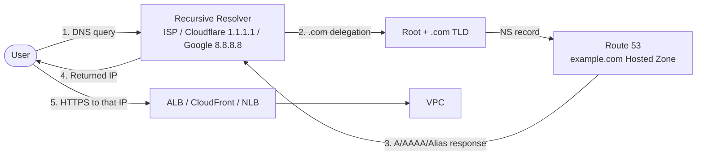
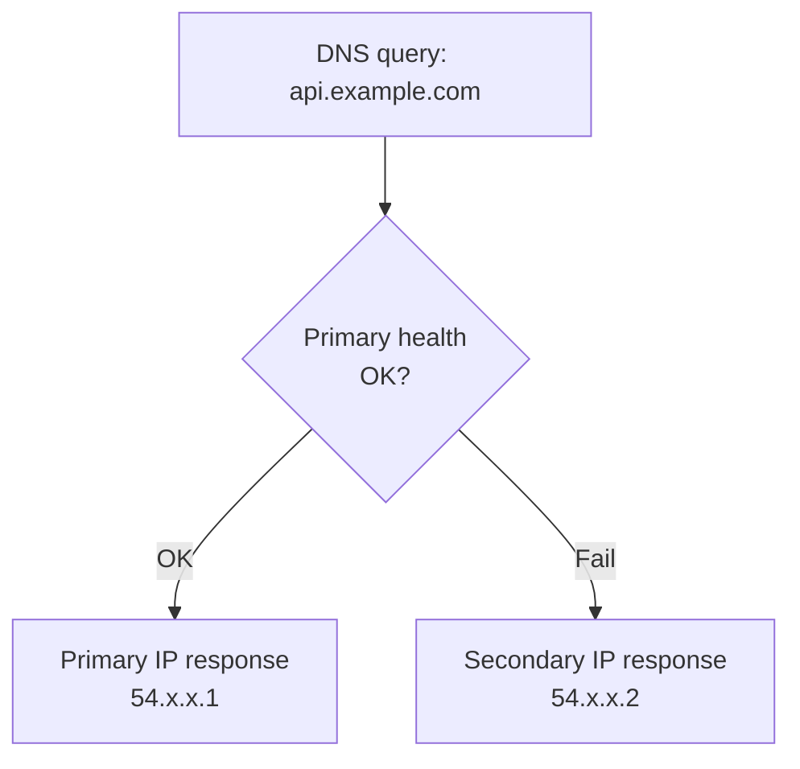

## Introduction

Part 1 picked the entry point that fronts a VPC (ALB, NLB, API Gateway, CloudFront, GA). But before traffic ever reaches that entry point, another decision always happens first — <strong>DNS resolution</strong>. Type `https://api.example.com`, and the browser fires off a DNS query to learn an IP; the IP / CNAME returned at that moment decides which entry point, region, or instance the traffic actually reaches.

The layer that handles that decision is **Route 53**. Part 4 unpacks Route 53's core decisions — Hosted Zone selection, record types, Routing Policies, Health Checks. (The series synthesis and standard patterns close in Part 5.)

- Part 0 — [Primer: network and AWS fundamentals](/blog/en/aws-vpc-edge-routing-guide-0)
- Part 1 — [Picking the entry point: ALB / NLB / API Gateway / CloudFront / Global Accelerator](/blog/en/aws-vpc-edge-routing-guide-1)
- Part 2 — [VPC-to-VPC and on-prem connectivity: VPC Endpoint / PrivateLink / Peering / Transit Gateway / VPN / Direct Connect](/blog/en/aws-vpc-edge-routing-guide-2)
- Part 3 — [Inside the VPC: IGW / NAT GW / Route Tables / Security Group vs NACL](/blog/en/aws-vpc-edge-routing-guide-3)
- <strong>Part 4 — DNS decisions and Route 53 (this post)</strong>
- Part 5 — Four standard patterns: from decision tree to first sketch

Same target reader as the rest of the series — backend or infrastructure engineers who've used Route 53 in the console but aren't sure how the six Routing Policies differ, why Alias is preferable to CNAME, or how a Private Hosted Zone interacts with VPC Endpoint. After this post, the goal is that <strong>even DNS decisions resolve through a single decision tree</strong>.

---

## TL;DR

- <strong>Route 53 always runs before the entry points in Parts 1–3</strong> — the order is user → DNS resolution → entry point (ALB / CloudFront / etc.) → VPC.
- <strong>Hosted Zones split into Public vs Private</strong> — Public is internet-visible, Private only resolves inside attached VPCs.
- <strong>Alias records are the standard way to map AWS resources (ALB, CloudFront, S3, API Gateway, etc.) to a domain root</strong>. CNAME can't sit at the root, and it incurs an extra DNS query (with cost).
- <strong>The six Routing Policies</strong> are traffic-distribution strategies — Simple (default), Weighted (canary), Latency (closest region), Geolocation (per country), Geoproximity (geo + bias), Multi-value (random + health), Failover (primary + secondary).
- <strong>Health Check + Failover routing gives you DNS-layer auto-failover</strong>. But TTL caching means minute-level latency — for second-level failover, reach for Global Accelerator or ALB target health checks instead.

---

## 1. Where Route 53 sits in the traffic flow

Trace the actual path from "user types `https://api.example.com`" to "backend EC2 receives the request" and you'll see <strong>Route 53 sits at the very front of everything</strong>.



Three key facts:

- <strong>Route 53 is an authoritative DNS server</strong>. Once your domain's NS record delegates to Route 53, all DNS queries for that domain land on Route 53.
- <strong>Responses are cached</strong>. Clients (browsers, OSes), recursive resolvers (ISPs, Cloudflare 1.1.1.1), and CDN edges all cache the response for the TTL. This is the defining trait of DNS-based routing — DNS changes don't propagate instantly.
- <strong>Route 53 makes routing decisions</strong>. It's not just "name to IP" — based on the Routing Policy, it picks which IP to return given the requester's location, configured weights, health states, etc. That's why Route 53 is more than a DNS server; it's a routing tool.

---

## 2. Hosted Zone — Public vs Private

A <strong>Hosted Zone is a settings container in Route 53 for a single domain</strong>. All records (A, CNAME, MX, etc.) for `example.com` live inside its Hosted Zone.

There are two kinds: **Public** and **Private**.

### 2.1 Public Hosted Zone

- A normal domain that can be resolved from anywhere on the internet.
- Becomes active once your domain registrar (Route 53 Domains, GoDaddy, Cloudflare, etc.) delegates the NS records to Route 53.
- Cost: $0.50 per hosted zone per month + $0.40 per million queries.

### 2.2 Private Hosted Zone

- <strong>A domain that only resolves inside specific attached VPCs</strong>.
- Example: `internal.example.com` configured as a Private Hosted Zone attached to VPCs A and B → only resolves inside those VPCs; invisible from the internet.
- Use cases: internal microservice DNS, friendly aliases for RDS endpoints, service discovery.
- The same domain can exist as both Public and Private simultaneously — VPC clients see the Private answer, external clients see the Public answer (split-horizon DNS).

### 2.3 When to pick which

| Situation | Pick |
| --- | --- |
| General web service domain (external users) | <strong>Public Hosted Zone</strong> |
| Internal microservice traffic | <strong>Private Hosted Zone</strong> |
| Marketing externally, different backend internally | Both (split-horizon) |
| RDS / ElastiCache managed endpoints | Private possible (default DNS also works) |

> <strong>Note — relationship with VPC Endpoint Private DNS</strong>: Part 2 says "Interface Endpoint attaches Private DNS so the service's official domain resolves to the ENI's private IP." That Private DNS is the same Route 53 Private Hosted Zone mechanism — AWS auto-creates a Private Hosted Zone when you make the Endpoint.

---

## 3. Record types and Alias vs CNAME

DNS maps a domain to some other piece of information; the kind of mapped information is the <strong>record type</strong>.

### 3.1 Common record types

| Type | Maps to | Common use |
| --- | --- | --- |
| <strong>A</strong> | Domain → IPv4 | Most basic — `api.example.com → 54.x.x.x` |
| <strong>AAAA</strong> | Domain → IPv6 | IPv6 dual stack |
| <strong>CNAME</strong> | Domain → another domain | `www.example.com → cdn.cloudfront.net` |
| <strong>MX</strong> | Domain → mail server | Email routing |
| <strong>TXT</strong> | Domain → string | SPF, DKIM, domain ownership verification |
| <strong>NS</strong> | Domain → authoritative nameserver | Domain delegation |
| <strong>Alias</strong> | Domain → AWS resource | <strong>AWS-only. The key one</strong> |

### 3.2 Alias — Route 53's secret weapon

<strong>Alias is a non-standard record that lets Route 53 map AWS resources (ALB, CloudFront, S3, API Gateway, Global Accelerator, Elastic Beanstalk, etc.) directly to a domain</strong>.

It looks like CNAME on the surface, but the differences are decisive.

### 3.3 Alias vs CNAME

| | CNAME | Alias |
| --- | --- | --- |
| Maps to | Any domain | <strong>AWS resources only</strong> (ALB, CloudFront, S3, API Gateway, GA, etc.) |
| Works at the root domain (`example.com`) | <strong>No</strong> | <strong>Yes</strong> |
| DNS query count | Two (CNAME → A lookup of that domain) | One (Route 53 internally returns the IP) |
| Cost | Standard query billing | <strong>Free</strong> (Alias queries aren't billed) |
| Tracks AWS-resource IP changes | No (the CNAME stays put) | Yes (auto-followed) |

Two key points:

- <strong>You can't put a CNAME at the root</strong> — that's DNS standard (RFC 1034). To map `example.com → ALB DNS` you can't use CNAME. Alias is AWS's workaround.
- <strong>Alias adds no extra query and is free</strong>. CNAME forces clients to do a second A lookup; Alias has Route 53 resolve the actual IP internally and respond directly.

> <strong>Practical trap</strong>: trying to map `example.com` to an ALB with CNAME and getting confused when it doesn't work is one of the most common DNS gotchas. The answer is always <strong>Alias</strong> — for AWS-resource mappings, root or subdomain, Alias is almost always the right choice.

---

## 4. The six Routing Policies — Route 53's core decision

This is what makes Route 53 a routing tool, not just a DNS server. Multiple records can sit on the same domain, and a **policy decides which response to return**.

### 4.1 Simple — single fixed response

- One record = one response. No routing decision.
- The simplest case. `api.example.com → ALB DNS` is a 1:1 mapping.

### 4.2 Weighted — distribute by weight

- Multiple records on the same domain, each with a weight.
- Example: `api.example.com → 10.0.0.1 (weight 90)`, `→ 10.0.0.2 (weight 10)` → 90% to the first, 10% to the second.
- Use cases: <strong>canary deploys</strong> (route only 10% to a new version), A/B testing.

### 4.3 Latency-based — closest region

- Multiple regions running the same service; respond with the IP of the **lowest-latency region** for the requester.
- Use cases: global multi-region services. US users hit us-east-1, EU hits eu-west-1, Asia hits ap-northeast-2.
- Similar to Global Accelerator's routing, but Route 53 decides at the **DNS layer** (GA decides at the anycast IP layer).

### 4.4 Geolocation — by country / continent

- Different responses based on the requester's geographic location (country, continent, US state).
- Use cases: country-specific compliance (EU GDPR data must stay in EU), region-specific content (China users get the China region).
- Differs from Latency-based by being **political/legal** boundary-driven, not distance-driven.

### 4.5 Geoproximity — geo distance + bias

- A generalization of Geolocation. Distance is computed from lat/long, and each resource gets a bias (±99%) to expand or shrink its zone.
- Use cases: precise distribution like "Texas users — 50% to us-east, 50% to us-west."
- The most complex; rarely used in everyday cases.

### 4.6 Multi-value Answer — random response + health check

- Multiple records on the same domain; **return up to 8 IPs in random order** per query (only healthy ones).
- Use cases: managed lightweight load balancing — when an ALB is overkill.
- The client falls back to the next IP if the first fails (default browser behavior).

### 4.7 Failover — primary + secondary

- Primary record + Secondary record + Health Check.
- If Primary's health check fails, responses automatically come from Secondary.
- Use cases: disaster recovery (DR), multi-region active-passive.

### 4.8 Quick-pick table

| Policy | Distribution basis | Common use |
| --- | --- | --- |
| Simple | Single response | Basic 1:1 mapping |
| Weighted | Percentage by weight | Canary / A/B tests |
| Latency | Closest region | Global multi-region |
| Geolocation | Country / continent | Compliance / region-specific content |
| Geoproximity | Lat/long + bias | Precise geo distribution (rare) |
| Multi-value | Random + health | Managed lightweight LB |
| Failover | Primary + secondary | DR / active-passive |

---

## 5. Health Check — auto-failover at the DNS layer

A Route 53 Health Check <strong>periodically checks whether an endpoint (or a calculated combination of other checks) is alive and removes failing answers from DNS responses</strong>.

### 5.1 Three kinds of Health Check

| Kind | What it does |
| --- | --- |
| <strong>Endpoint</strong> | Sends HTTP / HTTPS / TCP to a specific IP / domain on a port every 30s (or 10s), checks status code and string |
| <strong>Calculated</strong> | Combines multiple other health checks with AND/OR — "OK if 2 of A/B/C pass" |
| <strong>CloudWatch Alarm</strong> | Tied to a CloudWatch alarm state — health based on CPU or custom metrics |

### 5.2 Combined with Failover routing



- If Primary's health is failing, queries automatically failover to Secondary.
- The DNS response itself changes, so clients reconnect to the new IP starting with their next query.

### 5.3 The catch — DNS TTL latency

The weakness of DNS-based failover is <strong>TTL caching: changes don't propagate instantly</strong>. A 60-second TTL means clients keep using the old IP for up to a minute. So:

- <strong>Minute-level failover</strong> → DNS-based is fine
- <strong>Second-level failover</strong> required → use Global Accelerator (anycast IP, no TTL impact) or ALB target health checks (drop unhealthy targets at L7)

---

## 6. The DNS decision tree

Combine the variables above and you get the DNS decision tree.

```mermaid
flowchart TD
    Start([Creating or changing a domain]) --> Q1{External vs internal?}
    Q1 -->|External users| Q2{Need root-domain mapping?}
    Q1 -->|VPC-only| Private[Private Hosted Zone]
    Q2 -->|"Yes, to an AWS resource"| Alias[Alias record]
    Q2 -->|No, only subdomains| Q3{Mapping target an AWS resource?}
    Q3 -->|Yes| Alias
    Q3 -->|No, external domain| CNAME[CNAME record]
    Q2 -->|"To a specific IP"| A[A / AAAA record]
    Alias --> Q4{Distribute across multiple endpoints?}
    A --> Q4
    Q4 -->|No| Simple[Simple Routing]
    Q4 -->|Yes| Q5{Distribution criterion?}
    Q5 -->|"Weighted (canary, A/B)"| Weighted[Weighted]
    Q5 -->|Closest region (latency)| Latency[Latency-based]
    Q5 -->|Country / continent (compliance)| Geo[Geolocation]
    Q5 -->|"Primary + backup"| FO[Failover + Health Check]
    Q5 -->|"Random + health"| MV[Multi-value]
```

Each branch in one line:

- <strong>Q1</strong>: External users → Public Hosted Zone. VPC-only → Private.
- <strong>Q2-Q3</strong>: Mapping to an AWS resource → Alias almost always. External domain → CNAME. Specific IP → A.
- <strong>Q4-Q5</strong>: Single endpoint → Simple. Multiple endpoints → pick a Routing Policy by distribution criterion: Weighted / Latency / Geolocation / Failover / Multi-value.

---

## 7. Route 53 vs Global Accelerator vs CloudFront — same neighborhood?

All three "route global users to the right endpoint," so their decision spaces overlap. But they operate at different layers and fit different scenarios.

| | Route 53 (Latency Routing) | Global Accelerator | CloudFront |
| --- | --- | --- | --- |
| Layer | DNS (different IP responses) | Anycast IP (network layer) | Edge caching (HTTP layer) |
| Failover speed | Minute-level (DNS TTL) | Second-level (anycast auto-rerouting) | Second-level (edge health) |
| Static IP | No (DNS response varies) | <strong>Yes (two permanent anycast IPs)</strong> | No |
| Caching | No | No | <strong>Yes</strong> |
| Uses AWS backbone | (not directly) | <strong>Yes (entire path)</strong> | Yes (on cache miss) |
| Pricing | Hosted zone + per query | ~$18/hour + data transfer | Data transfer + per request |
| Best fit | General multi-region routing | Static IP / second-level failover / UDP / gaming | Static assets / HTTP caching |

### One-liner picks

| Situation | Pick |
| --- | --- |
| Simple global routing, cost-sensitive | <strong>Route 53 Latency-based</strong> |
| Static IP allowlist, UDP, gaming | <strong>Global Accelerator</strong> |
| Heavy static assets, HTTP caching effective | <strong>CloudFront</strong> |
| All three combined | DNS (Route 53) → CloudFront → ALB is a common pattern |

The three aren't really alternatives — they often **stack at different layers**. Route 53 alias-points to CloudFront, CloudFront's origin is an ALB, and the ALB sits in front of EC2.

---

## 8. Five common anti-patterns

### 8.1 Trying to CNAME the root domain

`example.com` (root) being CNAME'd to an ALB. <strong>DNS standard forbids CNAME at the apex</strong> (RFC 1034). The answer is always Alias. The very first DNS gotcha most people hit on AWS.

### 8.2 TTL set absurdly low

"For fast failover, I'll set TTL to 5 seconds." <strong>Now every client re-queries DNS on every request — cost and latency explode</strong>. Route 53 charges per query, and users see additional latency. A reasonable TTL is 60–300 seconds; if you really need fast failover, switch to Global Accelerator.

### 8.3 Failover routing without an attached health check

Configuring Failover routing with a Primary and Secondary but no Health Check — <strong>Primary failure won't trigger failover</strong>. Without health information, Route 53 has no basis to declare Primary "failing." Always pair Failover routing with a Health Check.

### 8.4 Forgetting CloudFront / ALB Alias's Hosted Zone ID

When creating an Alias record, <strong>CloudFront, ALB, and S3 each have their own Hosted Zone ID</strong>. CloudFront is always `Z2FDTNDATAQYW2` (global, fixed); ALB differs by region. The console handles this for you, but Terraform / CloudFormation requires it explicitly — pick the wrong one and the record silently fails.

### 8.5 Forgetting to attach the Private Hosted Zone

Creating a Private Hosted Zone but skipping the VPC association. <strong>The Hosted Zone exists, but no VPC actually resolves it</strong>. Or sharing across multiple accounts / regions requires explicit VPC associations. Adding a new VPC and forgetting to associate is a common slip.

---

## Recap

What this post covered:

1. <strong>Route 53 always runs before the entry points in Parts 1–3</strong>. The DNS response decides which IP, region, or instance traffic ends up on.
2. <strong>Hosted Zones split into Public (internet) vs Private (VPC-internal)</strong>. They can both serve the same domain (split-horizon).
3. <strong>Mapping AWS resources is almost always Alias</strong>. CNAME can't sit at the apex and adds extra queries / cost.
4. <strong>The six Routing Policies</strong> are Simple / Weighted (canary, A/B) / Latency (global region) / Geolocation (country) / Multi-value (random + health) / Failover (primary + secondary) — pick by distribution criterion.
5. <strong>Health Check delivers DNS-layer auto-failover</strong>. But TTL keeps it minute-level — for second-level failover, GA or ALB is the better fit.

Part 4's goal was to make <strong>DNS decisions resolvable through one decision tree</strong>. Walk Hosted Zone type → record type → routing policy in order, and almost every case lands on a clear answer.

### Series retrospective

This series unpacks AWS network ingress and routing through the lens of <strong>"what decision problem does this solve?"</strong>, across six parts.

- <strong>Part 0</strong> — Primer: network and AWS fundamentals, gathered into one post.
- <strong>Part 1</strong> — Picking the entry point that fronts a VPC (ALB / NLB / API Gateway / CloudFront / Global Accelerator). Four decision variables and a decision tree.
- <strong>Part 2</strong> — Connecting a VPC to other VPCs, AWS services, and on-prem (VPC Endpoint / PrivateLink / Peering / Transit Gateway / VPN / Direct Connect). The first split is destination type.
- <strong>Part 3</strong> — How packets actually flow inside (IGW / NAT GW / Route Tables / SG vs NACL). Less about choosing, more about understanding mechanics.
- <strong>Part 4</strong> — DNS decisions and Route 53. The decision that runs before all the entry points.
- <strong>Part 5</strong> — Four standard patterns. The closing post that takes Parts 0–4's decision trees and recombines them into a "where do I start drawing?" layer.

Together, the six posts give you <strong>a decision-tree-driven path through "DNS → external entry point → VPC → inside → other systems," plus four standard patterns to start from on day one</strong>. Parts 0–4 do the decomposition; Part 5 does the synthesis. Holding both at once is the starting point for infrastructure design.

Worthwhile follow-ups: security (WAF / Shield / SG / NACL / Network Firewall / GuardDuty / VPC Lattice), cost optimization (VPC traffic-cost patterns), observability (VPC Flow Logs, Reachability Analyzer, Route 53 Resolver Query Logs), multi-account (AWS Organizations + Resource Access Manager + domain delegation). Security gets its own series — <strong>AWS VPC Security Guide</strong> — because the decision area and narrative are different enough that bundling them here would make the series too heavy.

---

## Appendix. One-page summary

### A. Hosted Zone choice

| Situation | Pick |
| --- | --- |
| Domain for external users | Public Hosted Zone |
| VPC-internal-only domain | Private Hosted Zone |
| Split-horizon (different answers external vs internal) | Both |

### B. Record selection

| Mapping target | Use |
| --- | --- |
| AWS resource (ALB / CloudFront / S3 / API Gateway / GA) | <strong>Alias</strong> (root or subdomain) |
| External domain (subdomain) | CNAME |
| External domain (root) | <strong>Not allowed — find another way</strong> |
| Specific IP | A (IPv4) / AAAA (IPv6) |
| Mail server | MX |
| Domain verification / SPF | TXT |

### C. Routing Policy in one line

| Policy | Headline |
| --- | --- |
| Simple | 1:1 mapping, no routing |
| Weighted | Weighted percentage distribution (canary) |
| Latency | Closest region |
| Geolocation | Country / continent |
| Geoproximity | Lat/long + bias (rare) |
| Multi-value | Random 8 + health |
| Failover | Primary + Secondary + health |

### D. Official AWS docs

- Route 53: <https://docs.aws.amazon.com/Route53/latest/DeveloperGuide/>
- Routing Policy comparison: <https://docs.aws.amazon.com/Route53/latest/DeveloperGuide/routing-policy.html>
- Health Check: <https://docs.aws.amazon.com/Route53/latest/DeveloperGuide/dns-failover.html>
- Hosted Zone: <https://docs.aws.amazon.com/Route53/latest/DeveloperGuide/hosted-zones-working-with.html>

### E. Acronyms

| Acronym | Meaning |
| --- | --- |
| DNS | Domain Name System. Domain-to-IP resolution |
| TTL | Time To Live. How long a DNS response is cached |
| Hosted Zone | A Route 53 settings container for a single domain |
| Alias | An AWS-only record that maps directly to AWS resources |
| Health Check | The mechanism Route 53 uses to verify endpoint health |
| TLD | Top Level Domain (`.com`, `.kr`, etc.) |
| NS | Name Server. The record that delegates authority |
