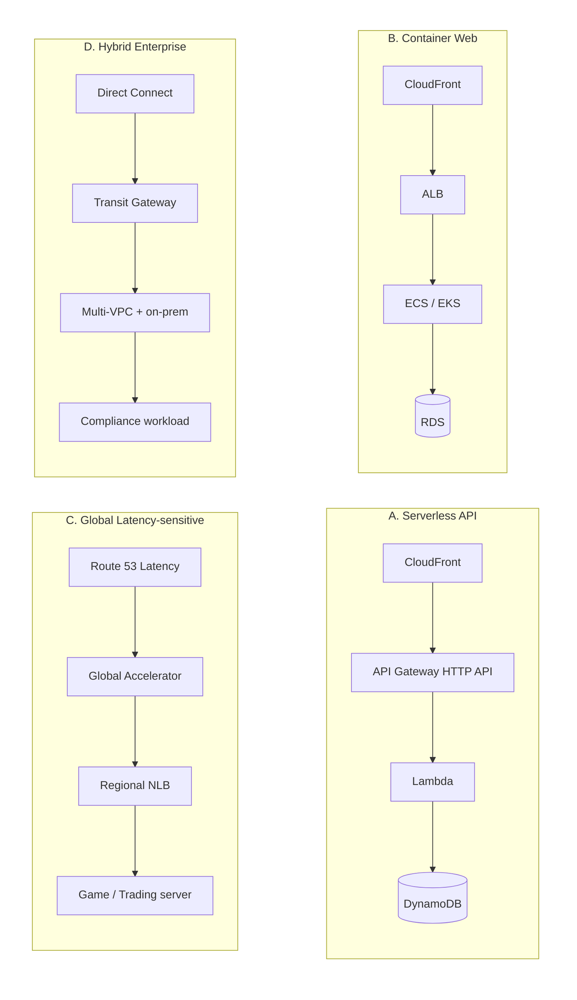
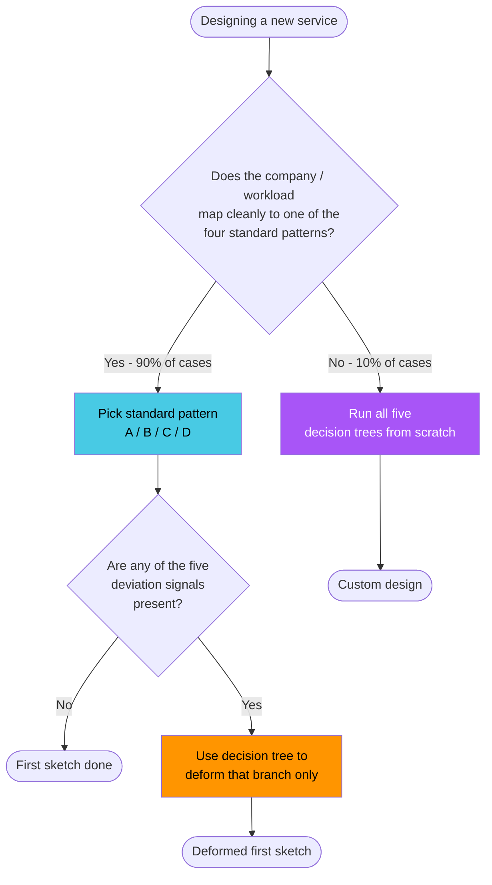

## Introduction

Part 0 laid the groundwork, Parts 1–3 unpacked the decision trees for ingress entry points, VPC connectivity, and inside-VPC routing, and Part 4 closed off DNS. But finishing the series and staring at a blank canvas is strangely paralyzing — <strong>"where do I start drawing?"</strong> has no answer. You have five decision trees. You don't have an ordering, dependencies, or a starting point.

That's the structural limit of the trees. <strong>A decision tree gives you candidates and forks, not a starting point.</strong> What real engineers actually do when designing a new service is not running five trees concurrently from scratch — they <strong>start from a standard pattern that similar companies, similar scales, and similar workloads use, then deform it to fit their constraints</strong>. The decision trees are the tool for making those deformations consciously.

This post closes the series by doing that synthesis. It nails down the four standard patterns that 90% of real-world AWS designs converge on, builds a table that shows how each pattern fills in the decision-tree branches from Parts 0–4 by default, and lays out the signals for "we're a real exception" versus "we're rationalizing." When you finish reading, the flow that should be in your head is: <strong>pick a standard pattern in five minutes, sketch the first version, then reach for the decision trees only when you need to deform a specific branch.</strong>

- Part 0 — [Primer: network and AWS fundamentals](/blog/en/aws-vpc-edge-routing-guide-0)
- Part 1 — [Picking the entry point: ALB / NLB / API Gateway / CloudFront / Global Accelerator](/blog/en/aws-vpc-edge-routing-guide-1)
- Part 2 — [VPC-to-VPC and on-prem connectivity: VPC Endpoint / PrivateLink / Peering / Transit Gateway / VPN / Direct Connect](/blog/en/aws-vpc-edge-routing-guide-2)
- Part 3 — [Inside the VPC: IGW / NAT GW / Route Tables / Security Group vs NACL](/blog/en/aws-vpc-edge-routing-guide-3)
- Part 4 — [DNS decisions and Route 53: Hosted Zone / Routing Policy / Alias vs CNAME / Health Check](/blog/en/aws-vpc-edge-routing-guide-4)
- <strong>Part 5 — Four standard patterns: from decision tree to first sketch (this post)</strong>

Same target reader as the rest of the series — backend or infrastructure engineers who've walked through all five decision trees. After this post, the goal is that <strong>"this company, this workload → start from pattern X, deform branch Y"</strong> happens automatically when you sit down to design.

---

## TL;DR

- <strong>Decision trees give you candidates, not a starting point, an ordering, or interdependencies</strong>. Running five trees concurrently against a blank canvas is inefficient — real practice is starting from a standard pattern and deforming.
- <strong>90% of real workloads converge on four standard patterns</strong> — A) Serverless API, B) Container Web, C) Global Latency-sensitive, D) Hybrid Enterprise. Each pattern fills in Parts 0–4's decision-tree branches with a known default.
- <strong>Pattern selection is a three-layer composition</strong> — Well-Architected's five pillars (operational excellence, security, reliability, performance, cost) + business constraints (budget, regulation, SLO, existing assets) + team capability (familiar tools, operations bandwidth). All three together pick the pattern.
- <strong>Five signals tell you when to actually deviate from the standard</strong>. They distinguish a real exception from "we're special, ignore the patterns" rationalization.
- <strong>Decision trees aren't the starting tool — they're the deviation tool</strong>. Pattern = starting point, tree = deformation tool. The series only fully composes when you hold both.

---

## 1. The limits of decision trees — they decompose, but the starting point isn't visible

Each tree in Parts 0–4 works well in its own area. Part 1's "L7 vs L4 → auth required → static IP needed" splits cleanly. Part 2's "what's the destination type" is clean. But <strong>holding all five and standing in front of a blank canvas, the model breaks down</strong>.

Three reasons.

First, <strong>decision trees don't tell you where to start</strong>. Part 1 starts with "is this L7 or L4?" — but that's never the actual first question when designing a new service. The actual first question is "what kind of company is this? what's the traffic scale? is it global?" — those questions sit above the L7/L4 decision.

Second, <strong>decision trees don't tell you the ordering of decisions</strong>. Do you decide ingress (Part 1) first, or DNS (Part 4) first? Is VPC structure (Part 3) before ingress or after? Within the series, Part 4 makes the point that DNS happens chronologically before Part 1's ingress (DNS resolution comes first), but in actual design it goes the other way — you fix the ingress before you can decide what domain mapping to set up.

Third, <strong>decision trees don't expose interdependencies</strong>. Part 1's "use CloudFront?" is entangled with Part 2's "do you have an S3 backend?" and both depend on Part 4's "are users global?". Walking one tree assumes the others have already been fixed somewhere.

> <strong>Bottom line</strong>: The five decision trees are a tool for <strong>"the right answer at each individual decision point"</strong>, not for <strong>"the starting point of the whole design"</strong>. The starting point has to come from a different layer — that layer is the standard patterns.

---

## 2. The four patterns 90% of real workloads converge on

90% of new AWS infrastructure designs converge on one of four patterns. Each pattern has a fixed answer for ingress, compute, and data layers.

### 2.1 Pattern A — Serverless API

CloudFront → API Gateway HTTP API → Lambda → DynamoDB. The standard for shipping fast with zero ops overhead.

- <strong>Pick when</strong>: traffic is small or spiky, internal tools / back-office, event-driven work, early-stage startup MVP, side projects.
- <strong>Strengths</strong>: zero operations (no servers), automatic scaling, pay-per-use (zero idle cost), auth and throttling baked into API Gateway.
- <strong>Weaknesses</strong>: cold starts, expensive per-request once traffic is steady (ALB+ECS undercuts past a threshold), 15-minute Lambda timeout, calling private VPC backends needs VPC Link (cost + complexity).
- <strong>Typical company</strong>: early-stage startup, internal admin tooling, side projects, event-driven automation.

### 2.2 Pattern B — Container Web

CloudFront → ALB → ECS/EKS → RDS. The single most common pattern; ~90% of normal SaaS and web apps.

- <strong>Pick when</strong>: traffic is steady at meaningful scale, normal web app or API service, team is comfortable with containers, RDB-centric workload.
- <strong>Strengths</strong>: most cost-effective once traffic is steady, leverages standard container tooling (Docker, k8s), one ALB hosts multiple services via host/path routing, RDS as managed data layer.
- <strong>Weaknesses</strong>: container operations overhead (especially EKS), there's idle cost, autoscaling is good but not Lambda-fast.
- <strong>Typical company</strong>: mid-stage SaaS, normal web service, B2B API, mobile app backend.

### 2.3 Pattern C — Global Latency-sensitive

Route 53 Latency Routing → Global Accelerator → regional NLB → game server / trading system. For workloads where latency is the business value.

- <strong>Pick when</strong>: real-time games, trading or finance, globally distributed users sensitive to ms-level latency, WebRTC / VoIP / live streaming.
- <strong>Strengths</strong>: users land at the closest AWS edge then ride the backbone (skipping internet hops), static anycast IPs, automatic regional failover, L4 NLB for ultra-low latency.
- <strong>Weaknesses</strong>: expensive (GA at ~$18/month + data processing), no L7 niceties (auth, cache) for non-HTTP workloads, multi-region operations overhead.
- <strong>Typical company</strong>: game studios, fintech / trading, global SaaS like Notion or Figma.

### 2.4 Pattern D — Hybrid Enterprise

Direct Connect → Transit Gateway → multi-VPC + on-prem datacenter. For workloads where regulation and existing assets dominate.

- <strong>Pick when</strong>: regulated industries (finance, healthcare, government), large enterprises with significant on-prem assets, organizations needing standardized multi-account / multi-VPC, network segregation requirements.
- <strong>Strengths</strong>: consistent private network between on-prem and AWS (DX with reserved bandwidth, low latency), Transit Gateway gives N:N routing for standardized multi-VPC, can satisfy regulatory requirements.
- <strong>Weaknesses</strong>: very expensive (DX circuit + TGW attachments + cross-AZ), long lead times (DX takes weeks to months), high operational complexity.
- <strong>Typical company</strong>: banks, insurers, brokerages, hospitals, pharma, government / public sector, manufacturing IT.

> <strong>Bottom line</strong>: Describing the company in one sentence almost always nails the pattern — "early-stage MVP" → A, "normal SaaS" → B, "games or trading" → C, "bank or government" → D. 90% of cases split this cleanly. The remaining 10% map to the deviation signals in the next section.

---

## 3. Pattern defaults — how the patterns fill in Parts 0–4's decision trees

When you put each pattern next to the decision-tree branches from Parts 0–4, the table shows that "pattern = pre-filling the trees."

| Decision area (Part) | A. Serverless API | B. Container Web | C. Global Latency | D. Hybrid Enterprise |
| --- | --- | --- | --- | --- |
| <strong>Part 1 ingress (L7/L4)</strong> | API Gateway HTTP API + CloudFront | ALB + CloudFront | NLB + Global Accelerator | ALB (internal) + DX |
| <strong>Part 1 auth / throttle</strong> | API Gateway built-in (JWT/OIDC) | ALB → backend or Cognito | Backend handles itself | IAM + AD/LDAP integration |
| <strong>Part 1 global cache</strong> | CloudFront standard | CloudFront standard | GA backbone (CloudFront optional) | Usually unnecessary (internal) |
| <strong>Part 2 AWS service access</strong> | Lambda → DynamoDB direct | Gateway Endpoint (S3, DDB) | Gateway Endpoint | Gateway / Interface Endpoint standardized |
| <strong>Part 2 VPC-to-VPC</strong> | Usually single VPC | ≤3 VPCs: Peering. 4+: TGW (same threshold as Part 2 §3.3) | Multi-region: inter-region Peering or TGW | <strong>TGW required</strong> (10+ VPCs) |
| <strong>Part 2 on-prem</strong> | Almost never | VPN if needed | Usually none | <strong>Direct Connect + VPN backup</strong> |
| <strong>Part 3 Public/Private subnet</strong> | Lambda is outside the VPC by default | Public: ALB / Private: ECS, RDS | Public: NLB / Private: game servers | All Private (segregation) |
| <strong>Part 3 NAT GW</strong> | Almost none | One per AZ standard | One per AZ if needed | Standard: one per AZ |
| <strong>Part 3 SG / NACL</strong> | API Gateway handles most | SG-centric, NACL is supplementary | SG + NACL (game traffic protection) | SG + NACL + Network Firewall |
| <strong>Part 4 Hosted Zone</strong> | Public Hosted Zone | Public Hosted Zone | Public + Private | Private-centric (Public when externally exposed) |
| <strong>Part 4 Routing Policy</strong> | Simple (Alias) | Simple (Alias) | <strong>Latency Routing</strong> | Failover (DR) |
| <strong>Part 4 Health Check</strong> | API Gateway native | ALB target health check | <strong>GA + Route 53 Failover</strong> | Calculated Health Check |

This table is, in effect, the answer key for the series' decision trees. <strong>Once the pattern is fixed, ~80% of the tree branches fill in automatically.</strong>

> <strong>Note</strong>: A cell means "almost always this in the standard pattern," not "no exceptions." A Pattern B company with global users may shift the Part 1 branch from "ALB + CloudFront" to "ALB + GA + CloudFront." That's exactly the moment the decision tree returns as the deformation tool.

---

## 4. Three layers that pick the pattern

The answer to "which pattern are we?" comes from three layers composed together. Looking at any one layer alone gives a wrong answer.

### 4.1 The Well-Architected five pillars

AWS's official design framework. Validate every decision against five lenses.

| Pillar | Question | Effect on pattern selection |
| --- | --- | --- |
| <strong>Operational excellence</strong> | Automation, observability, recovery? | A is fully managed (zero ops), D has the heaviest ops load |
| <strong>Security</strong> | IAM, encryption, isolation? | D is built around segregation and compliance, A defaults to IAM Roles + Lambda outside VPC |
| <strong>Reliability</strong> | Multi-AZ, backups, fault isolation? | C is essentially multi-region failover; A and B default to Multi-AZ |
| <strong>Performance efficiency</strong> | Right service, cache, global? | C is about milliseconds; A and B are fine with normal latency |
| <strong>Cost optimization</strong> | Pay per use, reservations, right-sizing? | A has zero idle cost; B is cheapest at steady traffic |

### 4.2 Business constraints

- <strong>Budget</strong> — Is there a hard monthly limit? Can we afford Reserved Instances or Savings Plans? Startups can't tolerate idle cost, which alone drives them to A.
- <strong>Regulation</strong> — Do you have PCI-DSS, HIPAA, or financial-sector segregation requirements? If yes, almost automatically D. If no, free choice across A/B/C.
- <strong>SLO</strong> — 99.9% is fine in a single region. 99.99% effectively requires multi-region (a C variant or D). One digit shifts the pattern.
- <strong>Existing assets</strong> — On-prem datacenters, VMware, an existing AWS org? That gravity pulls toward D. If you're greenfield, A/B/C are open.

### 4.3 Team capability

- <strong>Anyone here run Kubernetes in production?</strong> If not, swap EKS for ECS / Fargate, or go all-in on Lambda (i.e., Pattern A).
- <strong>Is there an IaC standard?</strong> Terraform, CDK, console? Without one, prefer managed services (A).
- <strong>24/7 oncall?</strong> Without it, prefer managed services, which biases A and B.
- <strong>Network engineer on staff?</strong> Without one, D is effectively impossible (DX, BGP, Route 53 Resolver inbound endpoints all need real network depth).

> <strong>Bottom line</strong>: Pattern selection is <strong>"validate the workload against Well-Architected → narrow with business constraints → finalize with team capability"</strong>. Compose those three before reaching for any decision tree, otherwise the tree's questions don't have the right context.

---

## 5. Five signals to actually deviate from the pattern

90% fits inside a pattern, 10% genuinely deviates. The five signals below distinguish a real exception from a rationalization.

1. <strong>Pattern B but with global users</strong> — Pattern B defaults to single-region, which feels slow for global users. Use Part 1's tree to decide whether to put GA in front of the ALB, or whether to upgrade to Pattern C entirely. Real signal: measure global user RTT — if it's 200ms+, the signal is real.
2. <strong>Pattern A but with steady, sustained traffic</strong> — A's idle-zero advantage disappears, and per-request costs accumulate. The crossover is roughly 2 million requests per month (the same threshold Part 1 §2.5 calls out for ALB vs. API Gateway HTTP API) — past that, evaluate moving to B. Real signal: API Gateway + Lambda costs in your monthly bill start to outpace what an ALB + ECS deployment would cost in pure compute hours.
3. <strong>Pattern D scale but you can't justify DX</strong> — You have regulatory requirements but the company isn't large enough for DX (~$300+/month). Start with Site-to-Site VPN, migrate to DX after a year. Real signal: monthly on-prem traffic under 1 TB makes VPN sufficient.
4. <strong>Pattern B but no container ops headcount</strong> — EKS is operationally heavy. Switch to ECS Fargate, or split out modules into Lambda for an A/B hybrid. Real signal: fewer than one SRE who can carry pager.
5. <strong>Pattern C but you're single-region</strong> — Single-region + GA is almost always wasted spend (you pay for GA without backbone benefit). Downgrade to B, or actually build the multi-region infra first. Real signal: 90% of users in one country means C was the wrong starting choice.

> <strong>Caution</strong>: <strong>"We're different" is genuinely real in roughly five cases — the ones above</strong>. The other 90% of "we're not like other companies" claims are rationalization — usually meaning you picked the wrong pattern, or you skipped a deformation. Re-pick the pattern or apply a small deformation before declaring yourself a unicorn.

---

## 6. Decision tree vs. standard pattern — when to use which

The decision trees in Parts 0–4 and the four standard patterns aren't competitors. They are <strong>two different tools playing different roles</strong>.

| Tool | When to use | Role |
| --- | --- | --- |
| <strong>Four standard patterns</strong> | First sketch (90% of cases) | Pin down the starting point in five minutes |
| <strong>Decision trees (Parts 0–4)</strong> | Deviating from a pattern, change / debate moments, debugging | Consciously pick a different answer at one specific branch |
| <strong>Neither</strong> | Genuinely custom (< 10%) | Run all five trees from scratch and design a new pattern |

> <strong>The point</strong>: <strong>Decision trees aren't the tool you reach for first; they're the tool you reach for when deforming</strong>. Walking Part 1's tree from a blank canvas is wasted effort — 90% of the time it produces the same answer. Pattern first, tree for deformation — that's the right ordering.

### 6.1 Where the decision trees actually shine

Outside of the initial sketch, the trees light up at specific moments:

- <strong>Architectural change</strong> — "Should we move from ALB to API Gateway?" Walk Part 1's tree to re-confirm that auth and throttling are actually needed.
- <strong>Cost optimization</strong> — "NAT GW is too expensive." Walk Part 2's tree to check whether Gateway Endpoint applies.
- <strong>Debugging</strong> — "Why isn't this working?" Walk Part 3's tree to trace a packet through SG / NACL / Route Table in order.
- <strong>Security hardening</strong> — "Where do we put the WAF?" Walk Part 1's tree comparing "in front of ALB" vs. "in front of CloudFront."

These cases are where the standard patterns don't help — the pattern is already fixed, and you need one specific branch decided differently. That's the trees' real job.

---

## 7. Five common antipatterns

Misapplying the pattern + decision-tree composition lands you in one of five traps.

### 7.1 Pattern stew — mixing B and C without a plan

"It's a normal web app, but a few APIs are latency-sensitive..." → Pattern B (ALB) and Pattern C (GA + NLB) get mashed into one system without separation. Operations, observability, and cost all fragment. <strong>Fix</strong>: split the latency-sensitive APIs into a separate region / separate ingress, or re-examine whether the latency requirement is real (do you actually need ms-level?). Two patterns in one system is almost always wrong.

### 7.2 Pattern D scale problems on Pattern B traffic — Transit Gateway over-provisioning

"We might need multi-VPC in the future..." → Transit Gateway gets installed up front. At 2–3 VPCs, TGW's N:N is overkill, and the hourly cost + attachments + data processing accumulate. <strong>Fix</strong>: under 4 VPCs, use Peering. Migrate to TGW past that. "Future-proofing" is usually rationalization.

### 7.3 Tree-only thinking — analysis paralysis

You concurrently walk all five trees from scratch trying to justify every branch. Decision paralysis + wasted weeks. <strong>Fix</strong>: at the blank canvas, start from a pattern, not a tree. Trees only at deformation time.

### 7.4 "Big company copying" — context-blind imitation

"Netflix runs EKS so we run EKS." "Kakao is multi-region so we should be." The company size, traffic, and team capability are different but the tools get copied. <strong>Fix</strong>: four standard patterns are enough. Deform within the pattern based on your context — budget, SLO, team. "Copying X company" isn't a pattern-selection signal.

### 7.5 Ignoring near-future growth — full rebuild in 12 months

"We're small now, so Pattern A is fine" → traffic explodes a year later → you rebuild everything. Or the inverse: "we're going global soon, so Pattern C from day one" → global never materializes, GA cost just accumulates. <strong>Fix</strong>: only reflect a clear 6–12 month growth scenario. Beyond that is future. Pick the pattern for "today + 6 months" and write a one-line migration trigger — "switch to ALB + ECS once we cross 2M requests/month," "add GA when global user share crosses 30%," and so on.

---

## Recap

The whole thesis of this post is one sentence: <strong>"decision trees decompose; standard patterns compose."</strong> Parts 0–4 covered the decomposition. Part 5 closes off the composition.

1. <strong>Decision trees don't give you a starting point, ordering, or interdependencies</strong>. Running all five from scratch on a blank canvas is inefficient.
2. <strong>90% of real workloads converge on four standard patterns</strong> — A) Serverless API, B) Container Web, C) Global Latency-sensitive, D) Hybrid Enterprise. A one-line description of the company almost picks the pattern automatically.
3. <strong>Once the pattern is fixed, ~80% of the decision-tree branches fill in by default</strong>. The mapping table in Section 3 is effectively the answer key.
4. <strong>Pattern selection is a three-layer composition</strong> — Well-Architected five pillars + business constraints + team capability.
5. <strong>Decision trees aren't the first-sketch tool; they're the deviation tool</strong>. They shine at architectural change, cost optimization, debugging, and security hardening — not at the blank canvas.

Part 5's goal was the flow <strong>"pick a pattern in five minutes and sketch the first version, then reach for the trees only when deforming a branch."</strong> Once that flow is in your head, the whole series composes into one tool.

### Series retrospective

This series unpacks AWS network ingress and routing through the lens of <strong>"what decision problem does this solve?"</strong>, across six parts.

- <strong>Part 0</strong> — Primer: network and AWS fundamentals, gathered into one post.
- <strong>Part 1</strong> — Picking the entry point that fronts a VPC. Four decision variables and a decision tree.
- <strong>Part 2</strong> — Connecting a VPC to other VPCs, AWS services, and on-prem. The first split is destination type.
- <strong>Part 3</strong> — How packets actually flow inside the VPC. Less about choosing, more about understanding mechanics.
- <strong>Part 4</strong> — DNS decisions and Route 53. The decision that runs before all the entry points.
- <strong>Part 5</strong> — Four standard patterns. The closing post that takes Parts 0–4's decision trees and recombines them into a "where do I start drawing?" layer.

Together, the six posts give you <strong>a decision-tree-driven path through "DNS → external entry point → VPC → inside → other systems," plus four standard patterns to start from on day one</strong>. Parts 0–4 do the decomposition; Part 5 does the synthesis. Holding both at once is the actual starting point for infrastructure design.

Worthwhile follow-ups: <strong>security</strong> (WAF / Shield / SG / NACL / Network Firewall / GuardDuty / VPC Lattice), cost optimization (VPC traffic-cost patterns), observability (VPC Flow Logs, Reachability Analyzer, Route 53 Resolver Query Logs), multi-account (AWS Organizations + Resource Access Manager + domain delegation). Security gets its own series — <strong>AWS VPC Security Guide</strong> — because the decision area and narrative are different enough that bundling it here would make the series too heavy.

The next series builds on these routing patterns and asks <strong>"where and how do you layer defenses on top?"</strong> — decision trees for WAF, Shield, SG, NACL, Network Firewall, GuardDuty, VPC Lattice, in the same shape. The four standard patterns from Part 5 become the starting points for the security series too — for example, "a Pattern B company puts WAF in front of the ALB or CloudFront, then aligns SG/NACL, then turns on GuardDuty, in that order."

---

## Appendix. One-page summary

### A. Patterns at a glance

| Pattern | Ingress → Compute → Data | Who uses it |
| --- | --- | --- |
| A. Serverless API | CloudFront → API Gateway HTTP API → Lambda → DynamoDB | Early-stage startups, back-office, event-driven |
| B. Container Web | CloudFront → ALB → ECS / EKS → RDS | General SaaS, web apps (most common) |
| C. Global Latency-sensitive | Route 53 Latency → GA → regional NLB → game / trading | Games, trading, global SaaS |
| D. Hybrid Enterprise | Direct Connect → Transit Gateway → multi-VPC + on-prem | Finance, healthcare, government |

### B. 30-second pattern picker

1. Regulatory requirements (segregation, HIPAA, PCI) or significant on-prem assets? → <strong>D</strong>
2. Is millisecond latency the business value? (games, trading) → <strong>C</strong>
3. Is traffic steady at meaningful scale? (~2M+ requests/month, container workload) → <strong>B</strong>
4. Otherwise (spiky traffic, ops avoidance, early-stage startup) → <strong>A</strong>

### C. External references

- AWS Well-Architected Framework: <https://aws.amazon.com/architecture/well-architected/>
- AWS Architecture Center (Reference Architectures): <https://aws.amazon.com/architecture/>
- AWS Solutions Constructs: <https://aws.amazon.com/solutions/constructs/>
- AWS Decision Guides: <https://docs.aws.amazon.com/decision-guides/>

### D. Series at a glance (six parts)

| Part | Topic | Core |
| --- | --- | --- |
| 0 | Primer | OSI 7-layer, CIDR, ENI, core AWS services |
| 1 | External entry point | ALB / NLB / API Gateway / CloudFront / GA |
| 2 | VPC connectivity & on-prem | Endpoint / PrivateLink / Peering / TGW / VPN / DX |
| 3 | Inside the VPC | IGW / NAT / Route Table / SG vs NACL |
| 4 | DNS & Route 53 | Hosted Zone / Routing Policy / Alias vs CNAME / Health Check |
| 5 | Standard patterns (this post) | Four patterns / Well-Architected / pattern defaults |
