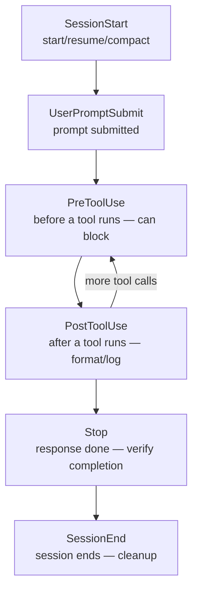

## Introduction

Installing Claude Code and coding through basic conversation is quick to learn. But most users stop here -- stuck at the "write this code," "fix this bug" level.

Claude Code actually hides powerful features: <strong>project-specific memory</strong>, <strong>repeatable task automation</strong>, and <strong>external tool integration</strong>. Using them transforms Claude Code from a simple chatbot into <strong>your personalized coding partner</strong>.

This series covers how to get 200% out of Claude Code, across four parts:

- <strong>Part 1 — Memory + Skills + Hooks (this post)</strong>: make Claude remember you and automate repetitive work
- Part 2 — [Plugins + MCP + IDE integration](/en/blog/claude-code-advanced-guide-2): connect external tools and work inside your editor
- Part 3 — [Sub-agents + Agent Teams](/en/blog/claude-code-advanced-guide-3): split complex tasks and process them in parallel
- Part 4 — [Workflows + Ultrareview + Remote Agents](/en/blog/claude-code-advanced-guide-4): deterministic orchestration and cloud automation

> <strong>Note</strong>: This post was checked against the latest Claude Code as of June 2026. Claude Code evolves fast, so for fast-growing lists like bundled skills or hook events, confirm with `/help` in your own environment.

---

## TL;DR

- <strong>Memory has two axes.</strong> The `CLAUDE.md` you write yourself (rules, guidance) and the auto-memory Claude writes during a session (learned habits, build commands). Both spare you from repeating the same explanations.
- <strong>Skills teach new commands.</strong> A single markdown file (`SKILL.md`) defines "do this task this way." Many bundled skills also ship ready to use -- well over a dozen, no install needed.
- <strong>Hooks run commands at specific moments.</strong> Auto-format after edits, block dangerous commands, notify you when input is needed, verify task completion -- all attached to events.
- <strong>Blocking and verification use defined signals.</strong> To block an action or keep Claude working, a hook returns an agreed exit code or JSON (`permissionDecision`, `decision`).
- <strong>Combine all three for a tailored partner.</strong> Put rules in memory, repetitive work in skills, automation in hooks, and Claude Code becomes optimized for your project.

---

## 1. Memory — Making Claude Remember You

Claude Code starts each session with a fresh context window. It doesn't remember yesterday's conversation today. <strong>Memory</strong> solves this.

### 1.1 CLAUDE.md — Your Project Instruction Manual

`CLAUDE.md` is a markdown file Claude reads automatically at session start. Write your coding rules, build commands, and architecture there, and you won't have to re-explain them every time.

#### Scope depends on where you put it

You can place it in several locations; all of them load and merge. A narrower scope (project) takes precedence over a wider one (user).

| Location | Scope | Sharing |
|---|---|---|
| Managed policy (`/Library/Application Support/ClaudeCode/CLAUDE.md`, etc.) | Org-wide, enforced | Admin-deployed |
| `./CLAUDE.md` or `./.claude/CLAUDE.md` | Whole project | Shared with team (Git) |
| `./CLAUDE.local.md` | This project, just me | Gitignore recommended |
| `~/.claude/CLAUDE.md` | All my projects | Just me |
| `.claude/rules/*.md` | Specific file types | Shared with team |

#### Quick start: `/init`

If it's your first time, run `/init` in Claude Code. It analyzes your codebase and generates a `CLAUDE.md` automatically. (`/init` is a built-in command, not a skill.)

```bash
# Inside Claude Code
/init
```

#### Writing a good CLAUDE.md

```markdown
# Project Rules

## Build & Test
- `pnpm dev` to run the dev server
- `pnpm test` to run tests; always run before committing

## Coding Rules
- 2-space indentation
- Use TypeScript strict mode
- Place API handlers in `src/api/handlers/`

## Architecture
- Frontend: React + Vite
- Backend: Express + Prisma
- DB: PostgreSQL
```

<strong>Key points:</strong>

- Keep it <strong>under 200 lines</strong>. Longer files lower Claude's compliance (the official guidance also targets "under 200 lines per file").
- Be <strong>specific</strong>. "Write good code" → "2-space indentation."
- Avoid <strong>contradictory rules</strong>. When two rules conflict, Claude picks arbitrarily.

#### Importing other files

When `CLAUDE.md` grows, reference external files with `@path` syntax (nesting up to 4 levels):

```markdown
# Project Rules
@README.md
@docs/api-conventions.md

## Personal Settings
@~/.claude/my-preferences.md
```

Imported files are inlined into the context at session start. The first time you import a file outside your home directory, an approval dialog appears.

### 1.2 `.claude/rules/` — File-Type Rules

Rules that don't apply to every file belong in `.claude/rules/`. Use glob patterns in the `paths` frontmatter to apply them only to specific files:

```markdown
---
paths:
  - "src/api/**/*.ts"
---

# API Development Rules
- Include input validation on every endpoint
- Use the standard error response format
- Include OpenAPI doc comments
```

Now this rule loads only when Claude works on TypeScript files under `src/api/`, saving context.

### 1.3 Auto-Memory — Claude Records on Its Own

Auto-memory is a system where Claude records things automatically without you doing anything. It learns and saves build commands, debugging tips, code-style preferences, etc. during a session.

#### Storage location

```text
~/.claude/projects/<project>/memory/
├── MEMORY.md          # Index (loaded at every session start)
├── debugging.md       # Debugging patterns
├── api-conventions.md # API design decisions
└── ...
```

The `MEMORY.md` index loads at session start, up to whichever comes first of 200 lines / 25KB. The remaining files are referenced as needed.

#### Enable/disable

```bash
# Inside Claude Code
/memory  # Toggle auto-memory + show loaded memory/rules files
```

```json
// settings.json
{
  "autoMemoryEnabled": false
}
```

You can also disable it with the `CLAUDE_CODE_DISABLE_AUTO_MEMORY=1` environment variable, or change the storage path with the `autoMemoryDirectory` key.

#### Telling it to remember

Say "remember this" to Claude and it saves to auto-memory:

```text
Always use pnpm, not npm. Remember this.
```

The `/memory` command lets you review and edit what's stored. They're plain markdown files, so you can edit them directly.

### 1.4 CLAUDE.md vs Auto-Memory — When to Use Which

| | CLAUDE.md | Auto-Memory |
|---|---|---|
| <strong>Who writes it</strong> | You, directly | Claude, automatically |
| <strong>Content</strong> | Rules, guidance | Learned patterns |
| <strong>Scope</strong> | Project/user/org | Per project |
| <strong>Use for</strong> | Coding standards, workflow | Build commands, debugging tips, preferences |

> <strong>Summary</strong>: Put rules you share with the team in `CLAUDE.md`; use auto-memory to let Claude learn your habits.

---

## 2. Skills — Giving Claude New Abilities

A skill teaches Claude <strong>how to perform a specific task</strong>. A single `SKILL.md` file teaches Claude a new command.

### 2.1 Bundled Skills — Ready Without Installing

Claude Code ships with several built-in skills. Type a name after `/` and use them immediately, no install. <strong>The count grows with each version</strong>, so check your full list with `/help`. The major bundled skills as of June 2026, by purpose:

| Category | Skills | Purpose |
|---|---|---|
| Code quality | `/code-review`, `/simplify`, `/review` | Review/simplify changes, review a PR |
| Security & verification | `/security-review`, `/verify` | Vulnerability scan, verify a change actually works |
| Large-scale work | `/batch` | Parallel changes across the codebase |
| Run & debug | `/run`, `/debug` | Run/check the app, analyze session debug logs |
| Automation | `/loop`, `/schedule` | Repeated execution, scheduled/remote agents |
| Analysis & config | `/insights`, `/statusline`, `/claude-api` | Session analysis, status line, load API reference |

A few worth highlighting:

- <strong>`/batch`</strong> — handles large-scale codebase changes in parallel. It decomposes the work into independent units; once you approve, <strong>a separate agent per unit</strong> implements, tests, and opens a PR in an isolated git worktree. E.g. `/batch replace all console.log with a structured logger`.
- <strong>`/code-review`</strong> — reviews the current diff for bugs and cleanups. You can set `low`–`max` effort, and `/code-review ultra` scales it to a cloud multi-agent review (see [Part 4](/en/blog/claude-code-advanced-guide-4)).
- <strong>`/loop`</strong> — runs a prompt or slash command on a fixed interval. E.g. `/loop 5m check the deploy status`.
- <strong>`/claude-api`</strong> — loads the Claude API/SDK reference for your project's language. It can auto-activate when you import `anthropic` in code.

> <strong>Note</strong>: If you remember "there are 5 bundled skills," that's stale. With `/code-review`, `/security-review`, `/run`, `/verify`, `/simplify` and more added, there are now well over a dozen.

### 2.2 Creating Custom Skills

Beyond bundled skills, you can make <strong>your own</strong>. One `SKILL.md` file is enough.

#### Skill storage locations

| Location | Scope |
|---|---|
| `~/.claude/skills/<name>/SKILL.md` | All my projects |
| `.claude/skills/<name>/SKILL.md` | This project only |

#### Example: blog post generation skill

```yaml
---
name: blog-post
description: Generates a blog post draft. Creates Korean and English versions at once.
disable-model-invocation: true
---

Write a blog post:

1. Write a post about the $ARGUMENTS topic
2. Create the Korean version in `src/content/blog/`
3. Create the English version in `src/content/blog/en/`
4. Include the current time in pubDate (e.g. 2026-03-14T18:00:00+09:00)
5. Korean uses casual style; English uses a practical tone
6. heroImage path: Korean `../../assets/`, English `../../../assets/`
```

Usage:

```bash
/blog-post How to write Terraform modules
```

#### Frontmatter fields

Only `name` and `description` are required. Many fields have been added for fine-grained control:

| Field | Role |
|---|---|
| `name` / `description` | Name and description (required). The description drives auto-invocation |
| `disable-model-invocation: true` | User-invocable only, no auto-invocation (deploy/commit side effects) |
| `user-invocable: false` | Auto-reference by Claude only, no direct user call (background knowledge) |
| `allowed-tools` / `disallowed-tools` | Tools allowed/removed while the skill is active |
| `model` | `haiku` / `sonnet` / `opus` / `inherit` |
| `effort` | `low` to `max` reasoning effort |
| `context: fork` | Run in a separate sub-agent (avoid polluting the main conversation) |
| `agent` | Sub-agent type when `context: fork` |
| `when_to_use` / `argument-hint` | Extra auto-invocation triggers / autocomplete hint |

#### Controlling skill invocation

| Setting | User call | Claude auto-call |
|---|---|---|
| (default) | O | O |
| `disable-model-invocation: true` | O | X |
| `user-invocable: false` | X | O |

- <strong>`disable-model-invocation: true`</strong>: for side-effecting work like deploy or commit. You don't want Claude auto-running "looks ready, I'll deploy."
- <strong>`user-invocable: false`</strong>: for background knowledge like legacy-system context. You'd never call `/legacy-context` yourself, but it's useful for Claude to auto-reference it.

### 2.3 Dynamic Context Injection

The `` !`command` `` syntax injects shell command output before the skill runs:

```yaml
---
name: pr-summary
description: Summarize a PR
context: fork
agent: Explore
---

## PR Context
- PR diff: !`gh pr diff`
- PR comments: !`gh pr view --comments`
- Changed files: !`gh pr diff --name-only`

## Task
Summarize this PR...
```

<strong>How it works:</strong>

1. Run `/pr-summary`
2. Shell commands like `` !`gh pr diff` `` run <strong>first</strong>
3. Each command's output is substituted in place as text
4. The fully substituted content is sent to Claude

`` !`command` `` behaves like a <strong>template variable</strong>. You can't embed data directly in the skill file, so it means "insert this command's result here at runtime."

<strong>Frontmatter explained:</strong>

| Field | Role |
|---|---|
| `context: fork` | Run this skill in a separate sub-agent (prevents polluting the main conversation) |
| `agent: Explore` | Set the forked sub-agent's type to Explore (read-only) |

Without `context: fork`, it runs directly in the main conversation. For potentially long output like a PR diff, forking isolates it and saves the main conversation's context.

> <strong>What's an agent type?</strong> Claude Code has specialized built-in agent types. `Explore` is read-only codebase exploration, `Plan` is for planning, and `general-purpose` is general (all tools). You can also build custom agents. [Part 3](/en/blog/claude-code-advanced-guide-3) covers this in detail.

---

## 3. Hooks — Workflow Automation

A hook is a command that runs <strong>automatically at a specific moment</strong> in Claude Code. If a skill "teaches Claude how," a hook "auto-runs code on a specific event."

### 3.1 What's a hook

Hooks can step in at several moments during a session. The common spots:



- <strong>After editing a file</strong> → run Prettier automatically (PostToolUse)
- <strong>Before a dangerous command</strong> → block it (PreToolUse)
- <strong>When Claude waits for input</strong> → desktop notification (Notification)
- <strong>At session start</strong> → load environment variables (SessionStart)

### 3.2 Your first hook

Get a desktop notification when Claude waits for input. Add to `~/.claude/settings.json`:

```json
{
  "hooks": {
    "Notification": [
      {
        "matcher": "",
        "hooks": [
          {
            "type": "command",
            "command": "osascript -e 'display notification \"Claude Code needs your attention\" with title \"Claude Code\"'"
          }
        ]
      }
    ]
  }
}
```

> On Linux, use `notify-send 'Claude Code' 'Claude Code needs your attention'`.

Type `/hooks` to see registered hooks.

### 3.3 Practical hook recipes

#### Auto-format after edits

`.claude/settings.json` (project level):

```json
{
  "hooks": {
    "PostToolUse": [
      {
        "matcher": "Edit|Write",
        "hooks": [
          {
            "type": "command",
            "command": "jq -r '.tool_input.file_path' | xargs npx prettier --write"
          }
        ]
      }
    ]
  }
}
```

Prettier runs only after the `Edit` or `Write` tool. It ignores other tools like `Bash` or `Read`.

#### Block edits to protected files

This hook blocks edits to sensitive files like `.env`, `package-lock.json`, `.git/`. The PreToolUse hook blocks the tool call with <strong>exit code 2</strong>, and the stderr message is shown to Claude.

`.claude/hooks/protect-files.sh`:

```bash
#!/bin/bash
INPUT=$(cat)
FILE_PATH=$(echo "$INPUT" | jq -r '.tool_input.file_path // empty')

PROTECTED_PATTERNS=(".env" "package-lock.json" ".git/")

for pattern in "${PROTECTED_PATTERNS[@]}"; do
  if [[ "$FILE_PATH" == *"$pattern"* ]]; then
    echo "Blocked: $FILE_PATH matches protected pattern '$pattern'" >&2
    exit 2  # exit 2 = block the tool call; stderr is shown to Claude
  fi
done

exit 0
```

```bash
chmod +x .claude/hooks/protect-files.sh
```

`.claude/settings.json`:

```json
{
  "hooks": {
    "PreToolUse": [
      {
        "matcher": "Edit|Write",
        "hooks": [
          {
            "type": "command",
            "command": "\"$CLAUDE_PROJECT_DIR\"/.claude/hooks/protect-files.sh"
          }
        ]
      }
    ]
  }
}
```

> <strong>Note</strong>: Instead of exit code 2, you can exit 0 and print the JSON below for the same block. Useful for delivering a structured reason.
>
> ```json
> {
>   "hookSpecificOutput": {
>     "hookEventName": "PreToolUse",
>     "permissionDecision": "deny",
>     "permissionDecisionReason": "Protected files cannot be modified"
>   }
> }
> ```

#### Inject a reminder after compaction

After a long conversation, compaction (`/compact`) can drop important info. Auto-inject a reminder afterward:

```json
{
  "hooks": {
    "SessionStart": [
      {
        "matcher": "compact",
        "hooks": [
          {
            "type": "command",
            "command": "echo 'Reminder: use pnpm, not npm. Run pnpm test before committing. Current sprint: auth refactor.'"
          }
        ]
      }
    ]
  }
}
```

#### Log Bash commands

Log every Bash command Claude runs to a file:

```json
{
  "hooks": {
    "PostToolUse": [
      {
        "matcher": "Bash",
        "hooks": [
          {
            "type": "command",
            "command": "jq -r '.tool_input.command' >> ~/.claude/command-log.txt"
          }
        ]
      }
    ]
  }
}
```

### 3.4 Prompt-based hooks — hooks that the AI judges

Beyond rule-based (exit code) hooks, there are hooks <strong>the AI judges</strong>. When Claude says it's done but you want to confirm, use a `type: prompt` hook:

```json
{
  "hooks": {
    "Stop": [
      {
        "hooks": [
          {
            "type": "prompt",
            "prompt": "Check whether all requested work is complete. If not, block so the work continues."
          }
        ]
      }
    ]
  }
}
```

If the Stop hook judges "not done yet," it returns the JSON below to keep Claude <strong>working instead of stopping</strong>:

```json
{
  "decision": "block",
  "reason": "Tests aren't passing yet. Fix the failing tests first."
}
```

> <strong>Caution — common misconception</strong>: The `{"ok": false, "reason": "..."}` format seen in older material is <strong>not a hook return format</strong>. Hook block/continue signals use `decision`/`reason` (Stop/PostToolUse family) and `hookSpecificOutput.permissionDecision` (PreToolUse).

### 3.5 Hook events — where you can attach

Hook events keep growing with each version; there are now over 30. Use `/hooks` to see the full list your version supports. The most-used ones, categorized:

#### Session events

| Event | When | Use for |
|---|---|---|
| `SessionStart` | Session start, resume, compact, clear | Load env vars, inject context |
| `SessionEnd` | Session ends | Cleanup, release resources |
| `PreCompact` / `PostCompact` | Just before/after context compaction | Back up key info, inject reminders |

#### Input & tool events

| Event | When | Use for |
|---|---|---|
| `UserPromptSubmit` | User submits a prompt | Input validation, add context |
| `PreToolUse` | Just before a tool runs | Block dangerous commands, protect files |
| `PostToolUse` | Just after a tool runs | Auto-format, logging, lint |

#### Response, sub-agent & team events

| Event | When | Use for |
|---|---|---|
| `Notification` | Claude sends a notification | Desktop notification |
| `Stop` | Claude finishes responding | Verify completion, catch missing work |
| `SubagentStart` / `SubagentStop` | Sub-agent start/finish | Prep environment, log results |
| `TeammateIdle` / `TaskCreated` / `TaskCompleted` | Agent team events | Deliver feedback, quality gates |
| `Elicitation` | An MCP server requests user input | Auto-respond |

### 3.6 Hook types — what runs

Hooks don't only run shell commands. There are now five types:

| Type | Action |
|---|---|
| `command` | Run a shell command (most common) |
| `prompt` | The AI judges (§3.4) |
| `agent` | Spawn a sub-agent |
| `http` | POST to an HTTP endpoint |
| `mcp_tool` | Call a tool on an MCP server |

### 3.7 Hook settings locations

| Location | Scope |
|---|---|
| Managed policy (`/Library/Application Support/ClaudeCode/`, etc.) | Org-wide, enforced |
| `~/.claude/settings.json` | All my projects |
| `.claude/settings.json` | This project (team shared) |
| `.claude/settings.local.json` | This project (just me) |
| Plugin `hooks/hooks.json`, skill/agent frontmatter `hooks:` | When that plugin/skill is active |

---

## Recap

A summary of the three features covered here:

| Feature | Core | Typical use |
|---|---|---|
| <strong>CLAUDE.md</strong> | Rules you write (auto-loaded each session) | Build commands, coding standards, architecture |
| <strong>Auto-memory</strong> | What Claude learns and records | Debugging tips, tool preferences |
| <strong>Skills</strong> | Teach new commands (`SKILL.md`) | Repetitive work, bundled skills |
| <strong>Hooks</strong> | Auto-run commands on events | Format, block, notify, verify completion |

Memory, skills, and hooks are each powerful, but <strong>combined they show real force</strong>:

1. Define project rules in <strong>CLAUDE.md</strong>
2. Automate repetitive work (deploy, blogging, code review) with <strong>custom skills</strong>
3. Set up file protection, auto-formatting, and notifications with <strong>hooks</strong>

Then Claude Code becomes not a simple AI chat but a <strong>development partner tailored to your project</strong>.

[Part 2](/en/blog/claude-code-advanced-guide-2) covers <strong>plugins, MCP, and IDE integration</strong>. Install useful plugins from the marketplace, connect external services via MCP, and use Claude Code directly in VS Code and JetBrains.

---

## Appendix

### A. Glossary

| Term | Description |
|---|---|
| CLAUDE.md | Project guide file auto-loaded at session start |
| Auto-memory | System where Claude records what it learns during a session |
| Skill | A task procedure you teach Claude via `SKILL.md` |
| Bundled skill | A skill shipped with Claude Code, usable without install |
| Hook | A command/judgment auto-run at a specific event |
| matcher | Pattern filtering which tools/situations a hook reacts to (e.g. `Edit|Write`) |
| context: fork | Setting that runs a skill in a separate sub-agent to protect the main conversation |

### B. Command & config cheat sheet

```bash
# Memory
/init           # Auto-generate CLAUDE.md (built-in command)
/memory         # Toggle auto-memory + show loaded memory/rules

# Skills (bundled — grows per version, check with /help)
/code-review    # Review changes  (/code-review ultra = cloud multi-agent)
/security-review
/simplify /review /verify /run /debug /batch
/loop 5m <cmd>  # Repeated execution
/schedule       # Scheduled/remote agents
/claude-api     # Load API reference

# Hooks
/hooks          # Show registered hooks
```

```json
// settings.json hook skeleton
{
  "hooks": {
    "<event>": [
      { "matcher": "<pattern>", "hooks": [ { "type": "command|prompt|agent|http|mcp_tool", "command": "..." } ] }
    ]
  }
}
```

### C. References

- [Claude Code Docs — Memory](https://docs.claude.com/en/docs/claude-code/memory)
- [Claude Code Docs — Skills](https://docs.claude.com/en/docs/claude-code/skills)
- [Claude Code Docs — Hooks Guide](https://docs.claude.com/en/docs/claude-code/hooks-guide)
- [Claude Code Docs — Hooks Reference](https://docs.claude.com/en/docs/claude-code/hooks)
