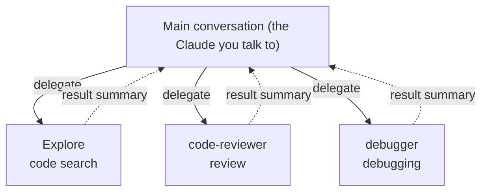
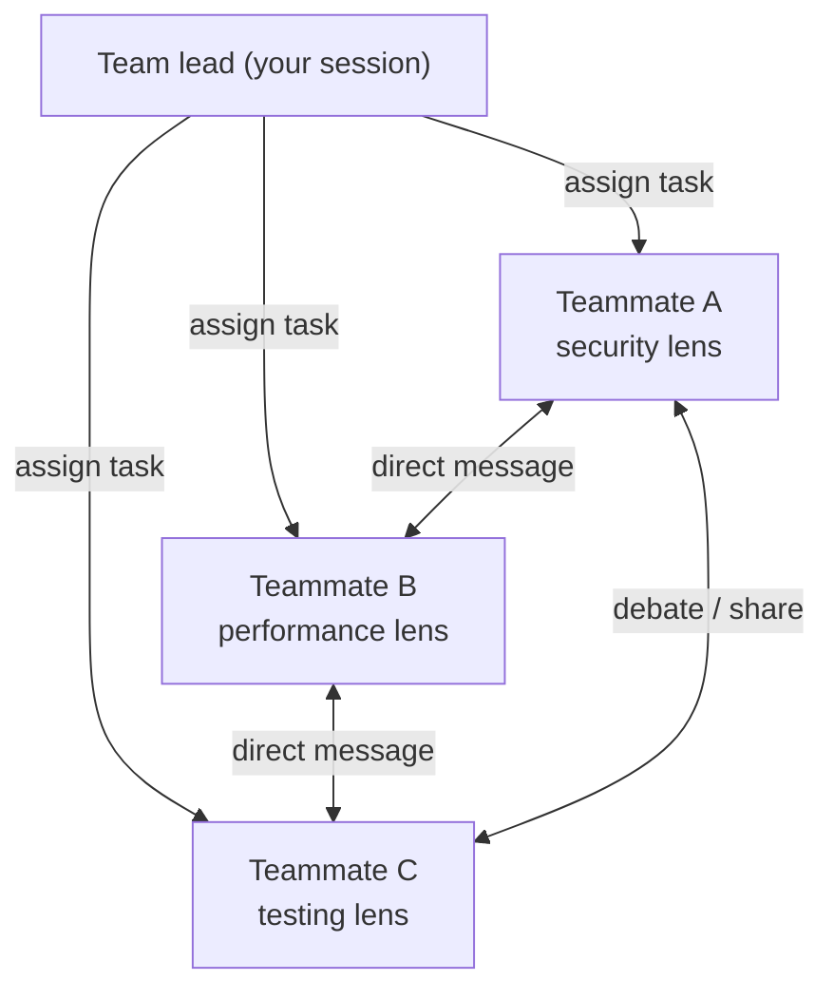

## Introduction

In [Part 1](/en/blog/claude-code-advanced-guide-1) we covered memory, skills, and hooks. In [Part 2](/en/blog/claude-code-advanced-guide-2) we covered plugins, MCP, and IDE integration.

In Part 3, we cover how Claude Code <strong>commands multiple AIs</strong>:

- Part 1 — [Memory + Skills + Hooks](/en/blog/claude-code-advanced-guide-1)
- Part 2 — [Plugins + MCP + IDE integration](/en/blog/claude-code-advanced-guide-2)
- <strong>Part 3 — Sub-agents + Agent Teams (this post)</strong>
- Part 4 — [Workflows + Ultrareview + Remote Agents](/en/blog/claude-code-advanced-guide-4)

- <strong>Sub-agents</strong>: create specialized AI assistants that handle specific tasks
- <strong>Agent Teams</strong>: multiple Claude Code instances working together as a coordinated team

> <strong>Note</strong>: This post was checked against the latest version as of June 2026. The following [Part 4](/en/blog/claude-code-advanced-guide-4) covers newer multi-agent features (deterministic workflows, cloud multi-agent review, remote/scheduled agents).

---

## TL;DR

- <strong>A sub-agent is delegation to a specialist.</strong> Hand a task to an AI assistant with its own context, tool permissions, and system prompt, and get back only a result summary in the main conversation.
- <strong>The benefit is context preservation.</strong> Isolating large-output work like exploration or tests keeps the main conversation clean. Routing to a faster model also cuts cost.
- <strong>An agent team is collaboration.</strong> Multiple Claudes work in their own contexts and message each other directly. Strong for complex work needing discussion and debate (experimental).
- <strong>The difference is the communication structure.</strong> Sub-agents are "just bring back the result"; agent teams are "solve it by discussing together." Teams cost more tokens.
- <strong>You build your own domain experts.</strong> One markdown + frontmatter file defines specialists like a code reviewer or debugger. Beyond the built-ins, you can add unlimited custom agents.

---

## 1. Sub-agents — Delegate to Specialists

A sub-agent is an <strong>independent AI assistant dedicated to a specific task</strong>. Each has its own context window, system prompt, and tool access. When Claude hits a suitable task, it automatically delegates to the matching sub-agent.



### 1.1 Why Sub-agents

- <strong>Context preservation</strong>: exploration/research results don't pollute the main conversation
- <strong>Constraint enforcement</strong>: restrict to specific tools only
- <strong>Cost savings</strong>: route to a fast, cheap model (Haiku)
- <strong>Specialization</strong>: domain-specific system prompts improve accuracy

### 1.2 Built-in Sub-agents

Claude Code ships with built-in sub-agents. Three are core, plus two helper agents:

| Agent | Model | Tools | Purpose |
|---|---|---|---|
| <strong>Explore</strong> | Haiku (fast) | Read-only | Codebase exploration, file search |
| <strong>Plan</strong> | Inherit | Read-only | Gather context in plan mode |
| <strong>general-purpose</strong> | Inherit | Full | Complex multi-step tasks |
| <strong>claude-code-guide</strong> | Haiku | Read-only | Answer Claude Code feature questions |
| <strong>statusline-setup</strong> | Sonnet | Limited | Configure the status line on `/statusline` |

The Explore agent is used automatically during codebase exploration, fetching needed info without wasting the main conversation's context.

> <strong>Note — built-ins are just the start</strong>: The list above is what's "provided"; the real power comes from <strong>custom agents</strong>. You can add unlimited domain-expert agents at user/project/plugin scope (§1.3). Also, the tool that spawns sub-agents used to be `Task` but is now named `Agent` (`Task` still works as an alias).

### 1.3 Creating Custom Sub-agents

#### The /agents command

```bash
# Inside Claude Code
/agents
# → Create new agent → choose User-level or Project-level
# → Generate with Claude, or write it yourself
```

#### Writing the file directly

A sub-agent is a markdown file with YAML frontmatter.

<strong>Storage locations:</strong>

| Location | Scope | Priority |
|---|---|---|
| Managed policy | Org-wide | Highest |
| `.claude/agents/` | This project | High |
| `~/.claude/agents/` | All projects | Medium |
| Plugin `agents/` | When plugin is active | Low |

#### Example: code reviewer

`.claude/agents/code-reviewer.md`:

```markdown
---
name: code-reviewer
description: Expert reviewer for code quality and security. Used automatically after code changes.
tools: Read, Grep, Glob, Bash
model: sonnet
---

As a senior code reviewer, inspect code quality and security.

When run:
1. Check recent changes with git diff
2. Focus on modified files
3. Start reviewing immediately

Review checklist:
- Code readability and structure
- Error handling
- Security vulnerabilities (exposed API keys, etc.)
- Test coverage

Organize feedback by priority:
- Critical (must fix)
- Warning (should fix)
- Suggestion (improvement)
```

Usage:

```text
Review the recent changes with the code-reviewer sub-agent
```

### 1.4 Sub-agent Frontmatter Options

Frontmatter finely controls model, tools, memory, isolation, and more. Many fields have been added:

| Field | Role |
|---|---|
| `name` / `description` | Name and description (drives auto-delegation) |
| `tools` / `disallowedTools` | Allowed/forbidden tools |
| `model` | `haiku` / `sonnet` / `opus` / `inherit` |
| `effort` | Reasoning effort |
| `mcpServers` | Attach MCP servers to just this agent (saves main context) |
| `memory` | `user` / `project` / `local` — memory persisting beyond a conversation |
| `isolation: worktree` | Work in a separate git worktree (no impact on main code) |
| `permissionMode` | Permission mode (e.g. `plan`) |
| `maxTurns` | Cap the number of turns |
| `skills` | Pre-inject skills into this agent |
| `hooks` | Hooks scoped to this agent |
| `background` | `true` to always run in the background |

#### Example: model, tools, isolation

```yaml
---
name: browser-tester
description: Browser testing with Playwright
model: sonnet
tools: Read, Bash
isolation: worktree          # isolated work in a separate worktree
mcpServers:
  - playwright:
      type: stdio
      command: npx
      args: ["-y", "@playwright/mcp@latest"]
  - github                   # reference an already-configured server
---
```

#### Persistent memory

The `memory` field gives an agent memory that persists across conversations:

| Scope | Location | Use for |
|---|---|---|
| `user` | `~/.claude/agent-memory/` | Keep learnings across all projects |
| `project` | `.claude/agent-memory/` | Per-project knowledge (Git-shareable) |
| `local` | `.claude/agent-memory-local/` | Per-project, just you |

### 1.5 Foreground vs Background

- <strong>Foreground</strong>: the main conversation waits until the sub-agent finishes. Permission requests are forwarded to you.
- <strong>Background</strong>: runs in parallel with the main conversation. Use frontmatter `background: true` to always run in the background, or move an in-flight task to the background.

Manage running background agents from the <strong>Agent View</strong> (`claude agents`).

```text
Run the test suite via a background sub-agent and report only failing tests
```

### 1.6 Usage Patterns

#### Isolating large output

Delegate large-output work like test runs or log analysis to a sub-agent, and get back only a summary without wasting the main conversation's context:

```text
Run the full test suite via a sub-agent and report only failing tests and error messages
```

#### Parallel investigation

For independent investigations, spin up multiple sub-agents at once:

```text
Investigate the auth, database, and API modules each in a separate sub-agent
```

#### Chaining

For sequential workflows, use sub-agents in a chain:

```text
Find performance issues with the code-reviewer sub-agent, then fix them with the optimizer sub-agent
```

---

## 2. Agent Teams — Multiple Claudes Working Together

> <strong>Caution</strong>: Agent teams are an <strong>experimental feature</strong>, disabled by default.

An agent team is a feature where <strong>multiple Claude Code instances collaborate as a team</strong>. One session acts as team lead; teammates work independently in their own context windows and communicate directly with each other.



### 2.1 Sub-agents vs Agent Teams

|  | Sub-agents | Agent Teams |
|---|---|---|
| <strong>Context</strong> | Independent window, returns result to main | Fully independent |
| <strong>Communication</strong> | Report only to the main agent | Teammates message each other directly |
| <strong>Coordination</strong> | Managed by the main agent | Self-coordinated via a shared task list |
| <strong>Best for</strong> | Focused work where you only need the result | Complex work needing discussion and collaboration |
| <strong>Token cost</strong> | Low | High (each teammate is a separate instance) |

> Sub-agents are "just bring back the result." Agent teams are "solve it by discussing together."

### 2.2 Enabling

Add to `settings.json`:

```json
{
  "env": {
    "CLAUDE_CODE_EXPERIMENTAL_AGENT_TEAMS": "1"
  }
}
```

### 2.3 Starting a Team

Describe the team composition in natural language:

```text
I want to design a CLI tool. Make an agent team to explore three perspectives:
- one for UX
- one for technical architecture
- one as a devil's advocate
```

Claude creates the team, assigns teammates, and coordinates the work.

### 2.4 Display Modes

| Mode | Setting value | Environment |
|---|---|---|
| <strong>in-process</strong> | `"in-process"` | All teammates in one terminal |
| <strong>split panes</strong> | `"tmux"` | Requires tmux; each teammate in its own pane |
| <strong>auto</strong> (default) | `"auto"` | Split inside tmux, else in-process |

```json
{
  "teammateMode": "auto"
}
```

`Shift+Down` switches between teammates; `Ctrl+T` toggles the shared task list. You can message each teammate directly.

### 2.5 Communicating with Teammates

- <strong>Lead → teammate</strong>: assign tasks, give instructions
- <strong>Teammate → teammate</strong>: share findings via direct message, rebut each other's theories
- <strong>You → teammate</strong>: select a teammate with `Shift+Down` and instruct directly

```text
Tell the security-reviewer teammate to focus on the auth module
```

### 2.6 Task Management

A shared task list coordinates the work:

- The lead creates and assigns tasks
- A teammate that finishes its work automatically picks up the next unassigned task
- Task dependencies are managed too (downstream tasks block until prerequisites complete)
- Apply quality gates with the `TeammateIdle` / `TaskCreated` / `TaskCompleted` hooks

### 2.7 Plan Approval Mode

For complex or risky work, require teammates to plan first:

```text
Have the architect teammate refactor the auth module, but require plan approval before changes
```

The teammate submits a plan; the lead reviews and approves/rejects. On rejection, it revises with feedback.

### 2.8 Real-World Example

#### Competing-hypothesis debugging

```text
A user reports the app sends one message then exits.
Create a 5-teammate agent team to investigate different hypotheses.
Have them scientifically debate, trying to disprove each other's theories.
```

Debugging alone, you tend to fixate on the first hypothesis. Teammates rebutting each other reach the real cause faster.

### 2.9 Best Practices

1. <strong>Give enough context</strong>: teammates don't inherit the lead's conversation history. Include everything needed in the spawn prompt.
2. <strong>3-5 teammates is the sweet spot</strong>: optimal given token cost and coordination overhead.
3. <strong>5-6 tasks per teammate</strong>: so none is too idle or too busy.
4. <strong>Avoid file conflicts</strong>: multiple teammates editing the same file overwrite each other. Assign different files to each.
5. <strong>Check in periodically</strong>: monitor progress and redirect if a teammate goes the wrong way.

### 2.10 Limitations

- In-process teammates aren't restored on resume (`/resume` · `/rewind`)
- Only one team per session; the lead role can't change
- Teammates can't create their own team or sub-teams
- Split-pane mode is unsupported in the VS Code integrated terminal, Windows Terminal, and Ghostty

---

## 3. Oh My Claude Code — A Community Multi-agent Framework

[Oh My Claude Code (OMCC)](https://github.com/Yeachan-Heo/oh-my-claudecode) is a <strong>community open-source project</strong> layering multi-agent orchestration on top of Claude Code. Like Oh My Zsh extends zsh, OMCC adds agents, skills, and automatic model routing to Claude Code.

### 3.1 Key Features

- <strong>A bundle of expert agents</strong>: domain agents for architecture, security, testing, code review, data science, etc.
- <strong>Many preset skills</strong>: skills for common development tasks, preconfigured
- <strong>Smart model routing</strong>: auto-switches Haiku (simple) ↔ Opus (complex) by task complexity to save tokens

### 3.2 Agent Teams vs OMCC

|  | Agent Teams (built-in) | OMCC (community) |
|---|---|---|
| <strong>Install</strong> | Enable with one env var | Install from a plugin marketplace |
| <strong>Setup</strong> | Compose teams in natural language | Pick a mode by keyword (`ralph`, `autopilot`, etc.) |
| <strong>Model routing</strong> | Manual (`model:`) | Automatic (complexity-based) |
| <strong>Workflow</strong> | Free-form — teammates self-coordinate | Structured — pipelines/verification loops |
| <strong>Stability</strong> | Experimental | Community-maintained |

> Agent teams are "multiple Claudes solving by debating"; OMCC is "processing systematically via a pre-built pipeline." They don't conflict and can be used together. OMCC's signature Ralph (repeat verify/fix until done) also exists in the official plugin marketplace as `ralph-wiggum`. Since it's a third-party project, check the latest at the [OMCC repo](https://github.com/Yeachan-Heo/oh-my-claudecode).

---

## Recap

| Feature | Core | Best for |
|---|---|---|
| <strong>Sub-agent</strong> | Delegate to an independent context, get only the result | Exploration, tests, isolating large output |
| <strong>Built-in agents</strong> | Explore · Plan · general-purpose + helpers | Default exploration/planning |
| <strong>Custom agents</strong> | Experts defined via frontmatter | Domain-specific reviewers, debuggers |
| <strong>Agent teams</strong> | Multiple Claudes collaborating directly (experimental) | Complex work needing discussion/debate |

Sub-agents are "just bring back the result"; agent teams are "solve it by discussing together." Pick based on the nature of the work.

The final [Part 4](/en/blog/claude-code-advanced-guide-4) covers the <strong>third paradigm</strong> of multi-agent work: <strong>workflows (ultracode)</strong> where Claude writes its own orchestration scripts, <strong>Ultrareview</strong> where a cloud multi-agent fleet verifies code, and <strong>remote/scheduled agents</strong> that run even when your laptop is closed -- the far edge of automation.

---

## Appendix

### A. Glossary

| Term | Description |
|---|---|
| Sub-agent | A delegation AI assistant with its own context and tool permissions |
| Built-in agent | Provided agents like Explore, Plan, general-purpose |
| Agent tool | The tool that spawns sub-agents (formerly `Task`) |
| isolation: worktree | Run a sub-agent isolated in a separate git worktree |
| Agent team | An experimental feature where multiple Claudes collaborate via direct messaging |
| teammateMode | Teammate display mode (`in-process` / `tmux` / `auto`) |
| Agent View | A screen to manage background agents (`claude agents`) |

### B. Command & config cheat sheet

```bash
# Sub-agents
/agents                 # Create / manage
claude agents           # Agent View (manage background agents)

# Agent teams (experimental)
# settings.json: { "env": { "CLAUDE_CODE_EXPERIMENTAL_AGENT_TEAMS": "1" } }
# Shift+Down  switch teammate / Ctrl+T  toggle task list
```

```yaml
# Sub-agent frontmatter skeleton
---
name: my-agent
description: Description that drives auto-delegation
tools: Read, Grep, Glob, Bash
model: sonnet            # haiku | sonnet | opus | inherit
memory: project          # user | project | local
isolation: worktree
background: true
---
```

### C. References

- [Claude Code Docs — Sub-agents](https://docs.claude.com/en/docs/claude-code/sub-agents)
- [Claude Code Docs — Agent Teams](https://docs.claude.com/en/docs/claude-code/agent-teams)
- [Claude Code Docs — Common Workflows](https://docs.claude.com/en/docs/claude-code/common-workflows)
